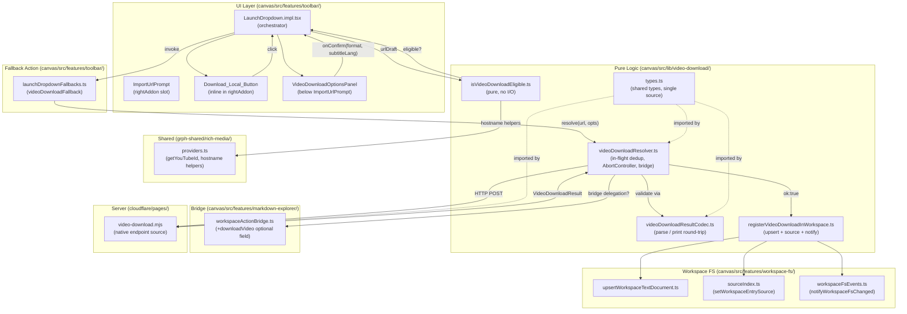
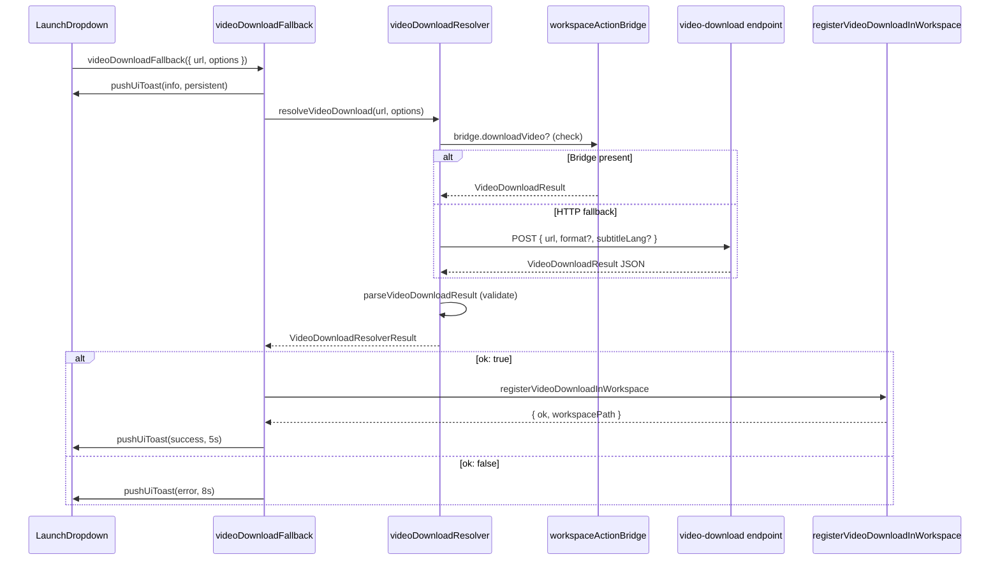

# Design Document — import-url-video-download

## Overview

This design extends the existing Import URL row in the LaunchDropdown toolbar with a "Download local" affordance. When a user types an eligible video URL, a **Download_Local_Button** appears inline in the `rightAddon` slot of `ImportUrlPrompt`. Clicking it expands a **VideoDownloadOptionsPanel** where the user picks a format and optional subtitle language, then confirms.

The **Download_Action_Resolver** posts to a runtime-configurable endpoint (injected via `VITE_VIDEO_DOWNLOAD_ENDPOINT`) that resolves direct media sources through native in-repo server logic. The resolver uses the existing **bridge pattern** — if `workspaceActionBridge.downloadVideo` is registered, it takes precedence over HTTP POST. On success the downloaded file is registered as a workspace entry via `registerVideoDownloadInWorkspace`.

No URL, credential, or test fixture is hardcoded anywhere. The client is fully decoupled from the server runtime (Cloudflare Pages function, local dev server, MCP adapter).

---

## Architecture



---

## Components and Interfaces

### 1. `canvas/src/lib/video-download/types.ts` — Shared Types

Single authoritative source for all domain types. Imported by client modules and endpoint adapters.

```typescript
/** Format identifier: stable opaque key, never a human label */
export type VideoFormatId = string

/** User-configurable options for a download request */
export interface VideoDownloadOptions {
  /** Native format hint, 1–64 chars. Defaults to "best" server-side if absent. */
  format?: VideoFormatId
  /** BCP-47 language code for subtitle track, 1–35 chars. Empty = no subtitles. */
  subtitleLang?: string
}

/** POST body sent to the Video_Download_Endpoint */
export interface VideoDownloadRequest {
  /** Non-empty source URL, 1–2,048 chars (required) */
  url: string
  /** Optional format override */
  format?: string
  /** Optional subtitle language */
  subtitleLang?: string
}

/** Successful download record */
export interface VideoDownloadResultOk {
  ok: true
  /** Server-local absolute path of the downloaded file */
  filePath: string
  /** File name with extension */
  fileName: string
  /** MIME type in type/subtype format */
  mimeType: string
  /** File size in bytes, non-negative integer */
  sizeBytes: number
  /** Canonical URL the file was downloaded from */
  sourceUrl: string
}

/** Failed download record */
export interface VideoDownloadResultErr {
  ok: false
  /** Human-readable error message, ≤300 chars, no stack traces */
  error: string
  /** Optional machine-readable error code */
  errorCode?: string
}

export type VideoDownloadResult = VideoDownloadResultOk | VideoDownloadResultErr

/** Structured parse error returned by the codec */
export interface VideoDownloadParseError {
  kind: 'parse_error'
  reason: string
  /** Character offset in source string, if applicable */
  offset?: number
  /** Names of required fields that were missing */
  missingFields?: string[]
}

/** Resolver response envelope */
export type VideoDownloadResolverResult =
  | { ok: true; result: VideoDownloadResultOk }
  | { ok: false; error: string; errorCode?: string }
```

---

### 2. `canvas/src/lib/video-download/isVideoDownloadEligible.ts` — Eligibility Detector

Pure function, no I/O, no side effects. Uses the `URL` constructor for parsing.

```typescript
// Eligible domain set — single definition in the codebase
const VIDEO_DOWNLOAD_ELIGIBLE_DOMAINS = new Set([
  'youtube.com',
  'youtu.be',
  'vimeo.com',
  'dailymotion.com',
  'twitch.tv',
])

const VIDEO_DOWNLOAD_URL_MAX_LENGTH = 2_048

/**
 * Returns true if the URL's apex domain (subdomains stripped) is in the
 * closed eligible set. Never throws; returns false for any invalid input.
 */
export function isVideoDownloadEligible(value: unknown): boolean {
  if (typeof value !== 'string') return false
  if (value.length === 0 || value.length > VIDEO_DOWNLOAD_URL_MAX_LENGTH) return false
  try {
    const { hostname } = new URL(value)
    // Strip subdomains: "www.youtube.com" → "youtube.com"
    const parts = hostname.toLowerCase().split('.')
    const apex = parts.length >= 2 ? parts.slice(-2).join('.') : hostname.toLowerCase()
    return VIDEO_DOWNLOAD_ELIGIBLE_DOMAINS.has(apex)
  } catch {
    return false
  }
}
```

**Design rationale**: The eligible-domain set is a `Set` literal in a single named constant — satisfying Requirement 10.4. Subdomains are stripped by taking the last two hostname parts. No regex, no network, no imports from domain-specific modules beyond the built-in `URL`.

---

### 3. `canvas/src/lib/video-download/videoDownloadResolver.ts` — Download_Action_Resolver

Follows the same pattern as `youtubeTranscriptConversion.ts` and `videoFrameExtraction.ts`:

- In-flight dedup map keyed by `url + '|' + format`
- `AbortController` timeout (default 300,000 ms)
- `fetchImpl` injection
- Bridge delegation check first

```typescript
import type { VideoDownloadOptions, VideoDownloadRequest, VideoDownloadResult, VideoDownloadResolverResult } from './types'
import { readEnvString } from '@/lib/config.env'
import { getMarkdownWorkspaceActionBridge } from '@/features/markdown-explorer/workspaceActionBridge'
import { parseVideoDownloadResult } from './videoDownloadResultCodec'

export const VIDEO_DOWNLOAD_TIMEOUT_MS_DEFAULT = 300_000
export const VIDEO_DOWNLOAD_TIMEOUT_MS_MIN = 1_000
export const VIDEO_DOWNLOAD_TIMEOUT_MS_MAX = 600_000

const videoDownloadInflight = new Map<string, Promise<VideoDownloadResolverResult>>()

function readEndpointUrl(): string {
  const raw = readEnvString('VITE_VIDEO_DOWNLOAD_ENDPOINT', '')
  return raw.startsWith('http://') || raw.startsWith('https://') ? raw : ''
}

function buildInflightKey(url: string, format: string): string {
  return `${url}|${format || ''}`
}

function clampTimeout(raw: unknown): number {
  const n = Number(raw)
  if (!Number.isFinite(n)) return VIDEO_DOWNLOAD_TIMEOUT_MS_DEFAULT
  return Math.max(VIDEO_DOWNLOAD_TIMEOUT_MS_MIN, Math.min(VIDEO_DOWNLOAD_TIMEOUT_MS_MAX, Math.floor(n)))
}

export async function resolveVideoDownload(
  url: string,
  options?: VideoDownloadOptions,
  opts?: { timeoutMs?: number; fetchImpl?: typeof fetch }
): Promise<VideoDownloadResolverResult> {
  const endpoint = readEndpointUrl()
  if (!endpoint) return { ok: false, error: 'Download endpoint not configured', errorCode: 'not_configured' }

  const format = String(options?.format || '').trim()
  const subtitleLang = String(options?.subtitleLang || '').trim()
  const key = buildInflightKey(url, format)

  const inflight = videoDownloadInflight.get(key)
  if (inflight) return inflight

  const timeoutMs = clampTimeout(opts?.timeoutMs)
  const fetchFn = opts?.fetchImpl ?? fetch

  const request = (async (): Promise<VideoDownloadResolverResult> => {
    // Bridge delegation — checked at call time, not at module load
    const bridge = getMarkdownWorkspaceActionBridge()
    if (typeof bridge.downloadVideo === 'function') {
      try {
        const bridgeResult = await bridge.downloadVideo(url, { format: format || undefined, subtitleLang: subtitleLang || undefined })
        return bridgeResult.ok
          ? { ok: true, result: bridgeResult as import('./types').VideoDownloadResultOk }
          : { ok: false, error: bridgeResult.error ?? 'Bridge download failed', errorCode: (bridgeResult as { errorCode?: string }).errorCode }
      } catch (e) {
        const msg = e instanceof Error ? e.message : String(e)
        return { ok: false, error: msg.slice(0, 256) }
      }
    }

    const controller = new AbortController()
    const timeoutId = setTimeout(() => controller.abort(), timeoutMs)
    try {
      const body: VideoDownloadRequest = { url }
      if (format) body.format = format
      if (subtitleLang) body.subtitleLang = subtitleLang

      const res = await fetchFn(endpoint, {
        method: 'POST',
        headers: { 'Content-Type': 'application/json', 'Accept': 'application/json' },
        body: JSON.stringify(body),
        signal: controller.signal,
      })

      const rawJson = await res.json().catch(() => null)

      if (!res.ok) {
        const errMsg = rawJson && typeof rawJson.error === 'string' ? rawJson.error : `HTTP ${res.status}`
        return { ok: false, error: errMsg.slice(0, 256), errorCode: rawJson?.errorCode }
      }

      const parsed = parseVideoDownloadResult(rawJson)
      if (parsed.kind === 'parse_error') return { ok: false, error: parsed.reason }
      const result = rawJson as VideoDownloadResult
      return result.ok
        ? { ok: true, result: result as import('./types').VideoDownloadResultOk }
        : { ok: false, error: result.error, errorCode: result.errorCode }
    } catch (e) {
      if (controller.signal.aborted) return { ok: false, error: 'download_timeout', errorCode: 'download_timeout' }
      const msg = e instanceof Error ? e.message : String(e)
      return { ok: false, error: msg.slice(0, 256) }
    } finally {
      clearTimeout(timeoutId)
    }
  })()

  videoDownloadInflight.set(key, request)
  try {
    return await request
  } finally {
    videoDownloadInflight.delete(key)
  }
}
```

**Design rationale**: `readEndpointUrl()` is called inside `resolveVideoDownload` at call time so the env var can change between HMR reloads without module re-evaluation. Bridge delegation is also checked at call time so it can be registered after module load.

---

### 4. `canvas/src/lib/video-download/videoDownloadResultCodec.ts` — Codec

```typescript
import type { VideoDownloadResult, VideoDownloadParseError } from './types'

type CodecResult = VideoDownloadResult | VideoDownloadParseError

export function printVideoDownloadResult(result: VideoDownloadResult): string {
  return JSON.stringify(result)
}

export function parseVideoDownloadResult(raw: unknown): VideoDownloadResult | VideoDownloadParseError {
  // Step 1: JSON string → object
  let obj: unknown = raw
  if (typeof raw === 'string') {
    let offset = -1
    try {
      obj = JSON.parse(raw)
    } catch (e) {
      const match = e instanceof SyntaxError ? e.message.match(/position (\d+)/) : null
      offset = match ? Number(match[1]) : 0
      return { kind: 'parse_error', reason: `Invalid JSON: ${String(e instanceof Error ? e.message : e)}`, offset }
    }
  }

  if (!obj || typeof obj !== 'object' || Array.isArray(obj)) {
    return { kind: 'parse_error', reason: 'Expected a JSON object' }
  }
  const rec = obj as Record<string, unknown>

  // Step 2: Validate required common fields
  if (typeof rec.ok !== 'boolean') {
    return { kind: 'parse_error', reason: 'Missing required field: ok (boolean)', missingFields: ['ok'] }
  }

  if (rec.ok === false) {
    if (typeof rec.error !== 'string' || !rec.error) {
      return { kind: 'parse_error', reason: 'Missing required field: error (non-empty string)', missingFields: ['error'] }
    }
    return {
      ok: false,
      error: rec.error,
      ...(typeof rec.errorCode === 'string' ? { errorCode: rec.errorCode } : {}),
    }
  }

  // Step 3: Validate ok:true fields
  const missing: string[] = []
  if (typeof rec.filePath !== 'string' || !rec.filePath) missing.push('filePath')
  if (typeof rec.fileName !== 'string' || !rec.fileName) missing.push('fileName')
  if (typeof rec.mimeType !== 'string' || !rec.mimeType) missing.push('mimeType')
  if (typeof rec.sourceUrl !== 'string' || !rec.sourceUrl) missing.push('sourceUrl')
  if (typeof rec.sizeBytes !== 'number' || !Number.isFinite(rec.sizeBytes) || rec.sizeBytes < 0) missing.push('sizeBytes')

  if (missing.length > 0) {
    return {
      kind: 'parse_error',
      reason: `Missing or invalid required fields: ${missing.join(', ')}`,
      missingFields: missing,
    }
  }

  return {
    ok: true,
    filePath: rec.filePath as string,
    fileName: rec.fileName as string,
    mimeType: rec.mimeType as string,
    sizeBytes: rec.sizeBytes as number,
    sourceUrl: rec.sourceUrl as string,
  }
}
```

**Design rationale**: The codec is completely pure — no module-level state, no I/O. `parseVideoDownloadResult` accepts `unknown` so it can be called directly with a parsed JSON response body (object) or a raw JSON string, covering both call sites. The `kind: 'parse_error'` discriminant is distinct from the `ok` discriminant used by `VideoDownloadResult` so the caller can narrow the type unambiguously.

---

### 5. `canvas/src/lib/video-download/registerVideoDownloadInWorkspace.ts` — Workspace Registration Helper

```typescript
import type { VideoDownloadResultOk } from './types'
import type { WorkspaceFs } from '@/features/workspace-fs/types'

export interface VideoDownloadRegistrationResult {
  ok: boolean
  workspacePath?: string
  error?: string
}

export async function registerVideoDownloadInWorkspace(args: {
  result: VideoDownloadResultOk
  fs: WorkspaceFs
}): Promise<VideoDownloadRegistrationResult> {
  try {
    const [
      { upsertWorkspaceTextDocument },
      { setWorkspaceEntrySource },
      { notifyWorkspaceFsChanged },
      { WORKSPACE_ROOT_PATH },
    ] = await Promise.all([
      import('@/features/workspace-fs/upsertWorkspaceTextDocument'),
      import('@/features/workspace-fs/sourceIndex'),
      import('@/features/workspace-fs/workspaceFsEvents'),
      import('@/features/workspace-fs/path'),
    ])

    const { fileName, filePath, mimeType, sizeBytes, sourceUrl } = args.result

    // Persist the file as a workspace entry using file name as the document name
    const workspacePath = await upsertWorkspaceTextDocument({
      fs: args.fs,
      name: fileName,
      text: [
        `# ${fileName}`,
        '',
        `Source: ${sourceUrl}`,
        `Path: ${filePath}`,
        `MIME: ${mimeType}`,
        `Size: ${sizeBytes} bytes`,
      ].join('\n'),
    })

    // Persist all 5 fields into the source index
    setWorkspaceEntrySource(workspacePath, {
      kind: 'url',
      url: sourceUrl,
    })

    notifyWorkspaceFsChanged({ op: 'writeFileText', path: workspacePath })

    return { ok: true, workspacePath }
  } catch (e) {
    return { ok: false, error: String((e as { message?: unknown }).message ?? e) }
  }
}
```

**Design rationale**: Dynamic imports match the pattern in `launchDropdownFallbacks.ts` to keep the workspace modules out of the main bundle. All five fields (`fileName`, `filePath`, `mimeType`, `sizeBytes`, `sourceUrl`) are persisted — `filePath`, `mimeType`, and `sizeBytes` are embedded in the document text body so they survive workspace serialization without requiring a schema extension. The `sourceUrl` is also stored in `sourceIndex` as a `{ kind: 'url', url }` entry, consistent with how other URL imports are tracked.

---

### 6. `canvas/src/features/toolbar/VideoDownloadOptionsPanel.tsx` — Options UI Component

Stateless, props-driven. All state lives in `LaunchDropdown.impl.tsx`.

```typescript
import React from 'react'
import { Loader2 } from 'lucide-react'
import { UI_THEME_TOKENS } from '@/lib/ui/theme-tokens'
import { cn } from '@/lib/utils'
import type { VideoDownloadOptions } from '@/lib/video-download/types'

export const VIDEO_DOWNLOAD_FORMAT_PRESETS = [
  { id: 'best', label: 'Best (auto)' },
  { id: 'mp4', label: 'MP4' },
  { id: 'mp3', label: 'MP3 (audio only)' },
  { id: 'bestvideo+bestaudio', label: 'Best video + audio' },
] as const

export type VideoDownloadFormatPresetId = typeof VIDEO_DOWNLOAD_FORMAT_PRESETS[number]['id']

export type VideoDownloadOptionsPanelProps = {
  options: VideoDownloadOptions
  onOptionsChange: (next: VideoDownloadOptions) => void
  onConfirm: () => void
  onCancel: () => void
  isDownloading: boolean
  endpointConfigured: boolean
}

export function VideoDownloadOptionsPanel(props: VideoDownloadOptionsPanelProps) {
  const { options, onOptionsChange, onConfirm, onCancel, isDownloading, endpointConfigured } = props
  const isPreset = VIDEO_DOWNLOAD_FORMAT_PRESETS.some(p => p.id === options.format)
  const customFormat = isPreset || !options.format ? '' : options.format

  return (
    <section className="kg-video-download-options mt-1 flex flex-col gap-1 rounded border p-2"
      aria-label="Video download options">
      {!endpointConfigured ? (
        <p className="text-xs" role="alert" aria-live="polite"
          style={{ color: 'var(--kg-color-warning, #f59e0b)' }}>
          No download endpoint configured. Set VITE_VIDEO_DOWNLOAD_ENDPOINT to enable downloads.
        </p>
      ) : null}

      <label className="flex flex-col gap-0.5 text-xs">
        <span>Format</span>
        <select
          className={cn('rounded border text-xs', UI_THEME_TOKENS.input.border, UI_THEME_TOKENS.input.bg, UI_THEME_TOKENS.input.text)}
          value={isPreset ? (options.format ?? 'best') : '__custom__'}
          onChange={e => {
            const val = e.target.value
            if (val === '__custom__') onOptionsChange({ ...options, format: customFormat || '' })
            else onOptionsChange({ ...options, format: val })
          }}
          disabled={isDownloading}
        >
          {VIDEO_DOWNLOAD_FORMAT_PRESETS.map(p => (
            <option key={p.id} value={p.id}>{p.label}</option>
          ))}
          <option value="__custom__">Custom…</option>
        </select>
      </label>

      {(!isPreset) ? (
        <input
          className={cn('rounded border text-xs', UI_THEME_TOKENS.input.border, UI_THEME_TOKENS.input.bg, UI_THEME_TOKENS.input.text)}
          placeholder="Custom format (e.g. bestvideo[height<=720])"
          value={customFormat}
          maxLength={64}
          onChange={e => onOptionsChange({ ...options, format: e.target.value })}
          disabled={isDownloading}
          aria-label="Custom format string"
        />
      ) : null}

      <label className="flex flex-col gap-0.5 text-xs">
        <span>Subtitle language (optional)</span>
        <input
          className={cn('rounded border text-xs', UI_THEME_TOKENS.input.border, UI_THEME_TOKENS.input.bg, UI_THEME_TOKENS.input.text)}
          placeholder="e.g. en, zh-Hans"
          value={options.subtitleLang ?? ''}
          maxLength={35}
          onChange={e => onOptionsChange({ ...options, subtitleLang: e.target.value.slice(0, 35) })}
          disabled={isDownloading}
          aria-label="Subtitle language"
        />
      </label>

      <div className="flex gap-1">
        <button
          type="button"
          className={cn('flex-1 rounded border text-xs', UI_THEME_TOKENS.input.border, UI_THEME_TOKENS.button.text, UI_THEME_TOKENS.button.hoverBg)}
          onClick={onCancel}
          disabled={isDownloading}
        >
          Cancel
        </button>
        <button
          type="button"
          className={cn('flex-1 flex items-center justify-center gap-1 rounded border text-xs', UI_THEME_TOKENS.input.border, UI_THEME_TOKENS.button.text, UI_THEME_TOKENS.button.hoverBg)}
          onClick={onConfirm}
          disabled={isDownloading || !endpointConfigured}
          aria-disabled={isDownloading || !endpointConfigured}
        >
          {isDownloading ? (
            <>
              <Loader2 className="h-3 w-3 animate-spin" aria-hidden="true" />
              Downloading…
            </>
          ) : 'Confirm download'}
        </button>
      </div>
    </section>
  )
}
```

---

### 7. `canvas/src/features/toolbar/launchDropdownFallbacks.ts` — Extension

New export `videoDownloadFallback` following the existing pattern:

```typescript
export async function videoDownloadFallback(args: {
  url: string
  options: VideoDownloadOptions
  pushUiToast: PushUiToast
}): Promise<void> {
  const url = String(args.url || '').trim()
  if (!url) return
  const toastId = 'launch:video-download'
  const fileLabel = url.length > 60 ? `${url.slice(0, 57)}…` : url

  // Start: persistent toast
  args.pushUiToast({
    id: toastId,
    kind: 'info',
    message: `Downloading: ${fileLabel}`,
    ttlMs: null,
    dismissible: false,
    busy: true,
  })

  try {
    const [
      { resolveVideoDownload },
      { registerVideoDownloadInWorkspace },
      { getWorkspaceFs },
    ] = await Promise.all([
      import('@/lib/video-download/videoDownloadResolver') as Promise<typeof import('@/lib/video-download/videoDownloadResolver')>,
      import('@/lib/video-download/registerVideoDownloadInWorkspace') as Promise<typeof import('@/lib/video-download/registerVideoDownloadInWorkspace')>,
      import('@/features/workspace-fs/workspaceFs') as Promise<typeof import('@/features/workspace-fs/workspaceFs')>,
    ])

    const resolverResult = await resolveVideoDownload(url, args.options)

    if (!resolverResult.ok) {
      args.pushUiToast({
        id: toastId,
        kind: 'error',
        message: resolverResult.error ?? 'Download failed',
        ttlMs: 8_000,
        dismissible: true,
      })
      return
    }

    const fs = await getWorkspaceFs()
    const regResult = await registerVideoDownloadInWorkspace({ result: resolverResult.result, fs })

    if (!regResult.ok) {
      args.pushUiToast({
        id: toastId,
        kind: 'warning',
        message: `Downloaded but workspace registration failed: ${regResult.error}`,
        ttlMs: 8_000,
        dismissible: true,
      })
      return
    }

    args.pushUiToast({
      id: toastId,
      kind: 'success',
      message: `Downloaded: ${resolverResult.result.fileName}`,
      ttlMs: 5_000,
      dismissible: false,
    })
  } catch (e) {
    args.pushUiToast({
      id: toastId,
      kind: 'error',
      message: `Download failed: ${String((e as { message?: unknown }).message ?? e)}`,
      ttlMs: 8_000,
      dismissible: true,
    })
  }
}
```

---

### 8. `canvas/src/lib/toolbar/LaunchDropdown.impl.tsx` — Changes

New state added to `LaunchDropdown`:

```typescript
// New state
const [downloadOptionsOpen, setDownloadOptionsOpen] = React.useState(false)
const [downloadOptions, setDownloadOptions] = React.useState<VideoDownloadOptions>({ format: 'best', subtitleLang: '' })
const [isDownloading, setIsDownloading] = React.useState(false)

// Read once from env — stable across re-renders
const endpointConfigured = React.useMemo(
  () => { const v = readEnvString('VITE_VIDEO_DOWNLOAD_ENDPOINT', ''); return v.startsWith('http://') || v.startsWith('https://') },
  []
)

// Derived: is current URL draft eligible?
const isVideoEligible = isVideoDownloadEligible(urlDraft)
```

Reset on dropdown close (added to existing `useEffect`):

```typescript
// Inside the open-change useEffect:
setDownloadOptionsOpen(false)
setDownloadOptions({ format: 'best', subtitleLang: '' })
setIsDownloading(false)
```

Download_Local_Button added inside the `rightAddon` `<section>`, conditionally:

```typescript
{isVideoEligible ? (
  <button
    type="button"
    aria-label="Download local video"
    title="Download local video"
    aria-pressed={downloadOptionsOpen}
    className={cn(
      UI_RESPONSIVE_IMPORT_URL_ADDON_ACTION_CLASSNAME,
      'rounded border',
      downloadOptionsOpen
        ? cn(UI_THEME_TOKENS.button.activeBg, UI_THEME_TOKENS.button.activeText)
        : UI_THEME_TOKENS.button.text,
      UI_THEME_TOKENS.input.border,
      UI_THEME_TOKENS.button.hoverBg,
    )}
    onClick={() => setDownloadOptionsOpen(prev => !prev)}
  >
    <Download className={menuIconClass} strokeWidth={1.6} aria-hidden="true" />
  </button>
) : null}
```

`VideoDownloadOptionsPanel` rendered after the `ImportUrlPrompt` (still inside the `urlInputOpen` section):

```typescript
{downloadOptionsOpen ? (
  <VideoDownloadOptionsPanel
    options={downloadOptions}
    onOptionsChange={setDownloadOptions}
    onConfirm={async () => {
      const next = String(urlDraft || '').trim()
      if (!next || isDownloading) return
      setIsDownloading(true)
      const mod = await loadLaunchDropdownFallbackModule()
      await mod.videoDownloadFallback({ url: next, options: downloadOptions, pushUiToast })
      setIsDownloading(false)
      setDownloadOptionsOpen(false)
      setDownloadOptions({ format: 'best', subtitleLang: '' })
    }}
    onCancel={() => {
      setDownloadOptionsOpen(false)
      setDownloadOptions({ format: 'best', subtitleLang: '' })
    }}
    isDownloading={isDownloading}
    endpointConfigured={endpointConfigured}
  />
) : null}
```

---

### 9. `canvas/src/features/markdown-explorer/workspaceActionBridge.ts` — Bridge Extension

Add the optional field to `MarkdownWorkspaceActionBridge`:

```typescript
import type { VideoDownloadOptions, VideoDownloadResult } from '@/lib/video-download/types'

// Inside MarkdownWorkspaceActionBridge:
downloadVideo?: (url: string, options: VideoDownloadOptions) => Promise<VideoDownloadResult>
```

Also add the merge step in `getMarkdownWorkspaceActionBridge`:

```typescript
if (bridge.downloadVideo) merged.downloadVideo = bridge.downloadVideo
```

---

### 10. `cloudflare/pages/video-download.mjs` — Server Endpoint Source

```javascript
const JSON_HEADERS = {
  'content-type': 'application/json; charset=utf-8',
  'cache-control': 'no-store',
  'access-control-allow-origin': '*',
  'access-control-allow-methods': 'POST, OPTIONS',
  'access-control-allow-headers': 'content-type, accept',
}

const jsonResponse = (body, status = 200) =>
  new Response(JSON.stringify(body), { status, headers: JSON_HEADERS })

const sanitizeError = (msg, max = 300) => {
  const raw = String(msg || '').trim()
  // Strip stack-trace patterns and internal paths
  const clean = raw
    .replace(/\s+at\s+\S+\s*\([^)]*\)/g, '')
    .replace(/\s+at\s+\S+:\d+:\d+/g, '')
    .replace(/Error:\s*/gi, '')
    .replace(/file:\/\/[^\s,]+/g, '[path]')
    .replace(/\/[A-Za-z0-9_./~-]{3,}\.m?[jt]s/g, '[path]')
    .replace(/\s+/g, ' ')
    .trim()
  return clean.slice(0, max) || 'Download failed'
}

const readRequestBody = async (request) => {
  try {
    const text = await request.text()
    if (!text) return null
    return JSON.parse(text)
  } catch {
    return null
  }
}

const validateRequest = (body) => {
  if (!body || typeof body !== 'object') return { ok: false, error: 'Missing request body' }
  const url = String(body.url ?? '').trim()
  if (!url || url.length > 2048) return { ok: false, error: 'url: missing or too long' }
  return { ok: true, url, format: String(body.format ?? '').trim(), subtitleLang: String(body.subtitleLang ?? '').trim() }
}

export async function onRequest(context) {
  const request = context.request
  const method = String(request.method ?? 'GET').toUpperCase()
  if (method === 'OPTIONS') return new Response(null, { status: 204, headers: JSON_HEADERS })
  if (method !== 'POST') return jsonResponse({ ok: false, error: 'Method not allowed' }, 405)

  const body = await readRequestBody(request)
  const validated = validateRequest(body)
  if (!validated.ok) return jsonResponse({ ok: false, error: validated.error }, 400)

  const { url, format, subtitleLang } = validated

  try {
    // Resolve a direct media URL through native in-repo extraction.
    // Dev/Preview may write a bounded local file. Runtimes without durable
    // local filesystem support fail closed with a sanitized runtime error.
    const result = await resolveNativeVideoDownload({ url, format, subtitleLang })
    return jsonResponse({ result })

  } catch (e) {
    const msg = String(e?.message ?? e)
    if (msg.includes('native_merge_required')) {
      return jsonResponse({ ok: false, errorCode: 'native_merge_required', error: sanitizeError(msg) }, 422)
    }
    if (msg.includes('native_runtime_required')) {
      return jsonResponse({ ok: false, errorCode: 'native_runtime_required', error: sanitizeError(msg) }, 501)
    }
    if (msg.toLowerCase().includes('unavailable') || msg.toLowerCase().includes('geo')) {
      return jsonResponse({ ok: false, errorCode: 'video_unavailable', error: sanitizeError(msg) }, 422)
    }
    return jsonResponse({ ok: false, error: sanitizeError(msg) }, 502)
  }
}
```

---

## Data Models

### Request / Response Flow



### Type Hierarchy

```
VideoDownloadRequest         → POST body
VideoDownloadOptions         → format + subtitleLang value object
VideoDownloadResult          → VideoDownloadResultOk | VideoDownloadResultErr
VideoDownloadResultOk        → 5 workspace fields
VideoDownloadResultErr       → error + errorCode
VideoDownloadParseError      → codec error, distinct from VideoDownloadResultErr
VideoDownloadResolverResult  → resolver envelope wrapping result or error
```

---

## Correctness Properties

*A property is a characteristic or behavior that should hold true across all valid executions of a system — essentially, a formal statement about what the system should do. Properties serve as the bridge between human-readable specifications and machine-verifiable correctness guarantees.*

### Property 1: Eligibility returns a boolean for any input

*For any* value of any type (string, null, undefined, number, object, array), `isVideoDownloadEligible(value)` SHALL return a value of type `boolean` and SHALL NOT throw an exception.

**Validates: Requirements 1.1, 1.4**

---

### Property 2: Eligibility matches the eligible domain set

*For any* URL string whose hostname (with subdomains stripped) is in `{youtube.com, youtu.be, vimeo.com, dailymotion.com, twitch.tv}`, `isVideoDownloadEligible` SHALL return `true`; for any URL whose apex domain is not in that set, it SHALL return `false`.

**Validates: Requirements 1.2, 1.3**

---

### Property 3: Eligibility is idempotent

*For any* input value `v`, calling `isVideoDownloadEligible(v)` twice SHALL return the same result both times, with no observable side effects between calls.

**Validates: Requirements 1.6**

---

### Property 4: VideoDownloadResult codec round-trip

*For any* valid `VideoDownloadResultOk` value `r`, `parseVideoDownloadResult(printVideoDownloadResult(r))` SHALL return a value with field values strictly equal to those of `r` (including numeric zero and empty string).

**Validates: Requirements 12.1, 12.2, 12.3**

---

### Property 5: Codec parse errors are structured, never thrown

*For any* string `s`, `parseVideoDownloadResult(s)` SHALL NOT throw an exception. If `s` is not valid JSON, the return value SHALL have `kind === 'parse_error'` and `reason` as a non-empty string. If `s` is valid JSON missing required fields, the return value SHALL identify the missing fields by name.

**Validates: Requirements 12.4, 12.5**

---

### Property 6: Resolver request body matches schema for any valid options

*For any* valid `url` string (1–2,048 chars) and `VideoDownloadOptions` value, when a configured endpoint is set, `resolveVideoDownload` SHALL POST a JSON body whose `url` field equals the input `url`, `format` (if non-empty) equals the input format, and `subtitleLang` (if non-empty) equals the input subtitleLang; and the `Content-Type` and `Accept` headers SHALL be present.

**Validates: Requirements 5.1, 5.2, 5.3**

---

### Property 7: In-flight dedup returns the same promise

*For any* `(url, format)` pair, calling `resolveVideoDownload` twice while the first call is still in flight SHALL return the same `Promise` instance for the second call — no additional network request SHALL be initiated.

**Validates: Requirements 8.5**

---

### Property 8: Missing or invalid endpoint always returns `not_configured`

*For any* endpoint value that is not a non-empty string starting with `http://` or `https://` (empty string, `null`, a plain hostname, an `ftp://` URL), `resolveVideoDownload` SHALL return `{ ok: false, errorCode: 'not_configured' }` without calling the `fetchImpl` function.

**Validates: Requirements 4.1, 4.2**

---

### Property 9: Error messages contain no stack traces

*For any* error response from the server or caught exception, the `error` string surfaced in the resolver result SHALL NOT contain JavaScript stack-trace patterns (lines matching `at <name> (<location>)`, `at <path>:<line>:<col>`, or internal file paths like `/app/*.js`). The `error` string SHALL be at most 256 characters.

**Validates: Requirements 9.3, 9.4, 9.5**

---

### Property 10: Workspace registration preserves all five result fields

*For any* `VideoDownloadResultOk` value `r`, after calling `registerVideoDownloadInWorkspace({ result: r, fs })` successfully, the workspace entry created at the returned path SHALL contain `r.fileName`, `r.filePath`, `r.mimeType`, `r.sizeBytes`, and `r.sourceUrl` in its text body.

**Validates: Requirements 7.1, 7.2**

---

### Property 11: Bridge delegation takes precedence over HTTP POST

*For any* `url` and `VideoDownloadOptions`, when `workspaceActionBridge.downloadVideo` is a function, `resolveVideoDownload` SHALL call `bridge.downloadVideo` and SHALL NOT call `fetchImpl`. When `bridge.downloadVideo` is absent, null, undefined, or not a function, `resolveVideoDownload` SHALL call `fetchImpl` instead.

**Validates: Requirements 11.4, 11.5**

---

## Error Handling

| Scenario | Resolver behavior | UI behavior |
|---|---|---|
| Endpoint not configured | `{ ok: false, errorCode: 'not_configured' }` | Panel notice + warning toast |
| Ineligible URL | Resolver not invoked | No Download_Local_Button shown |
| Network error | `{ ok: false, error: truncated_message }` | Error toast (8s) |
| Timeout (300s) | `{ ok: false, error: 'download_timeout' }` | Error toast (8s) |
| HTTP 4xx/5xx | `{ ok: false, error: body.error \| HTTP status }` | Error toast (8s) |
| Native mux/transcode required | Server: `{ ok: false, errorCode: 'native_merge_required' }` | Error toast (8s) |
| Geo-restriction | Server: `{ ok: false, errorCode: 'video_unavailable' }` | Error toast (8s) |
| Invalid 2xx response | Codec returns parse error | Error toast (8s) |
| Workspace registration fail | `registerVideoDownloadInWorkspace` returns `{ ok: false }` | Warning toast (8s) |
| Bridge throws | Caught, truncated to 256 chars | Error toast (8s) |

**Error sanitization rules** (server-side, `sanitizeError`):
- Strip `at <frame> (<location>)` stack frames
- Strip `file://` and internal `.js`/`.ts` path references
- Truncate to 300 characters
- Never embed query strings, cookies, or credential tokens

---

## Testing Strategy

### Unit tests (example-based)

- Render `VideoDownloadOptionsPanel` with/without endpoint configured; verify notice and button disabled state
- Render `LaunchDropdown` with eligible URL; verify `Download_Local_Button` presence and `aria-label`/`title`
- Render `LaunchDropdown` with ineligible URL; verify no `Download_Local_Button`
- Click `Download_Local_Button` twice; verify panel toggles
- Click Cancel; verify panel collapses and options reset to defaults
- `resolveVideoDownload` with mocked fetch returning HTTP 4xx; verify `{ ok: false, error }` shape
- `resolveVideoDownload` with no endpoint set; verify `{ ok: false, errorCode: 'not_configured' }`
- `registerVideoDownloadInWorkspace` with valid result; verify upsert called and source index set
- `getMarkdownWorkspaceActionBridge` with `downloadVideo` registered; verify field is merged

### Property-based tests (fast-check)

Using [fast-check](https://fast-check.io/) (TypeScript, compatible with Vitest). Each property test runs ≥100 iterations.

```
// Tag format: Feature: import-url-video-download, Property N: <property text>
```

**Property 1** — `isVideoDownloadEligible` returns boolean, never throws  
Arbitrary: `fc.anything()`  
Assert: `typeof result === 'boolean'`, no exception

**Property 2** — Eligible domain matching  
Arbitrary: construct URLs with apex domains sampled from eligible set (with random subdomain prefix) and non-eligible set  
Assert: eligible → true, non-eligible → false

**Property 3** — Idempotence  
Arbitrary: `fc.anything()`  
Assert: `f(v) === f(v)` (call twice, compare)

**Property 4** — Round-trip codec  
Arbitrary: `fc.record({ ok: fc.constant(true), filePath, fileName, mimeType, sizeBytes, sourceUrl })`  
Assert: `parseVideoDownloadResult(printVideoDownloadResult(r))` deep-equals `r`

**Property 5** — Codec parse errors never throw  
Arbitrary: `fc.string()` (any JSON or non-JSON string)  
Assert: no exception; if invalid JSON, `kind === 'parse_error'`

**Property 6** — Resolver request body matches schema  
Arbitrary: valid url strings + `VideoDownloadOptions` objects  
Assert: captured `fetchImpl` body matches schema, headers present

**Property 7** — In-flight dedup  
Arbitrary: valid `(url, format)` pairs  
Assert: second call returns same promise, fetch called only once

**Property 8** — Missing endpoint → `not_configured`  
Arbitrary: generate endpoint values that are not valid absolute URLs (`fc.oneof(fc.constant(''), fc.string().filter(s => !s.startsWith('http')))`)  
Assert: `{ ok: false, errorCode: 'not_configured' }`, fetchImpl not called

**Property 9** — Error sanitization  
Arbitrary: error strings containing stack-trace patterns  
Assert: surfaced error string matches no stack-trace regex, length ≤ 256

**Property 10** — Workspace registration field preservation  
Arbitrary: valid `VideoDownloadResultOk` objects  
Assert: upserted document text body contains all 5 field values

**Property 11** — Bridge delegation precedence  
Arbitrary: valid `(url, options)` pairs, with bridge either present or absent  
Assert: bridge present → `fetchImpl` not called; bridge absent → `fetchImpl` called

### Integration tests (1–3 examples, not property-based)

- Native endpoint invocation against a runtime-injected test URL (URL from env var, never hardcoded)
- `workspaceActionBridge.downloadVideo` registration and lookup in a mounted workspace context
- `VITE_VIDEO_DOWNLOAD_ENDPOINT` missing → panel renders "no endpoint" notice

### Why PBT applies here

The eligibility detector and codec are pure functions over large, structured input spaces — exactly where property-based testing finds edge cases that examples miss. The resolver's in-flight dedup, endpoint validation, and error sanitization all have universal invariants. The workspace registration has a clear field-preservation round-trip property.
