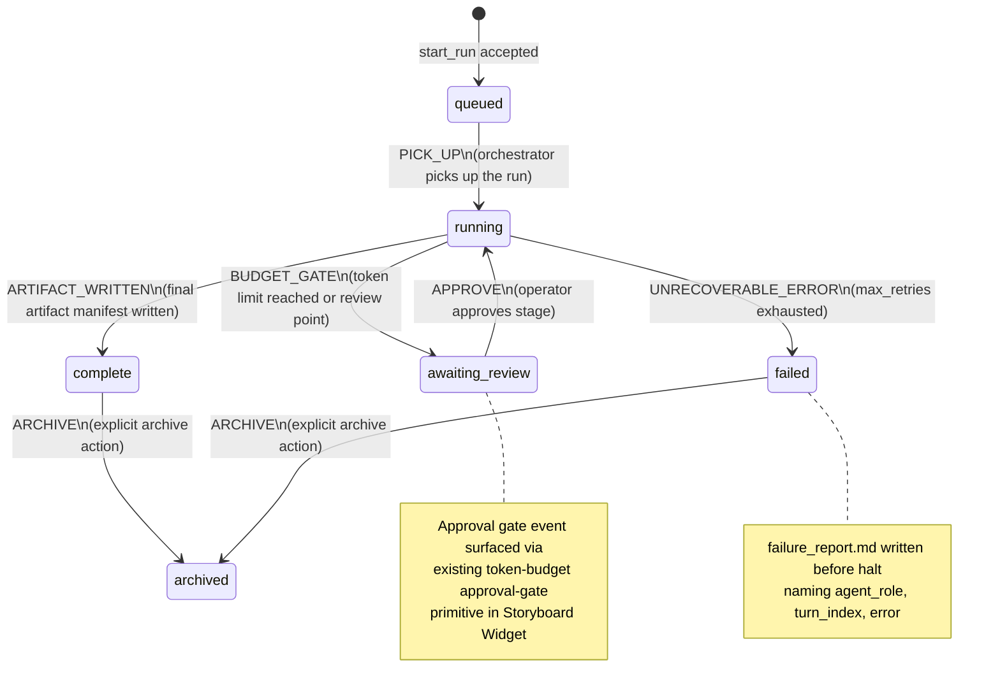
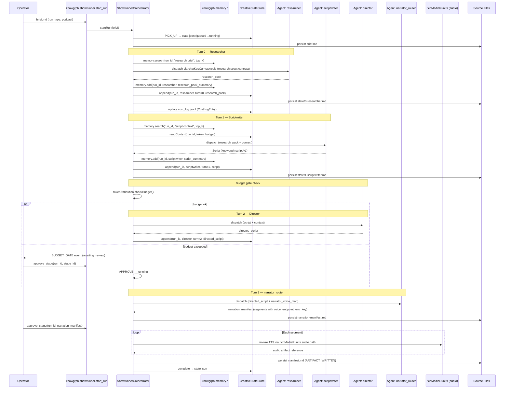
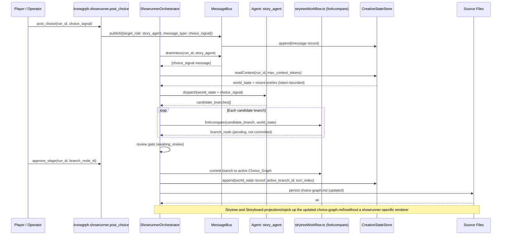
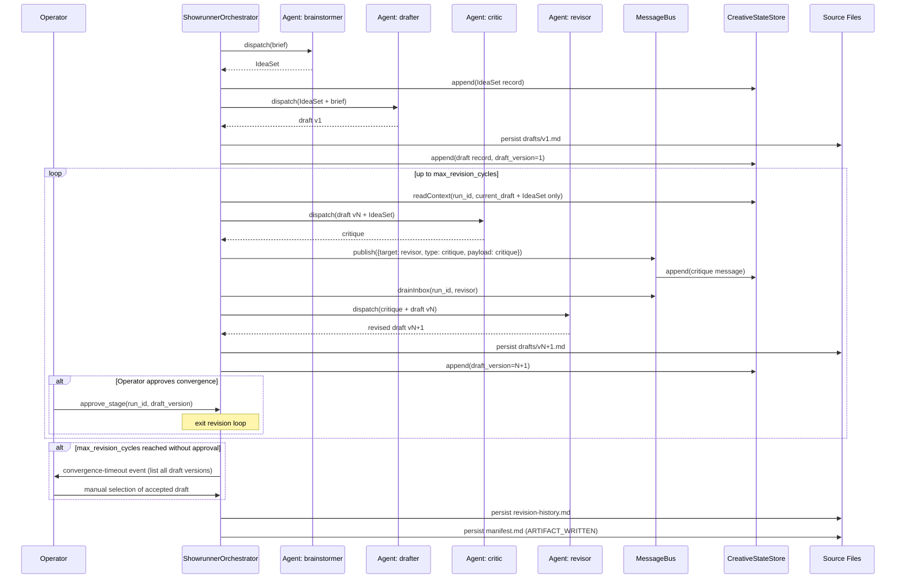
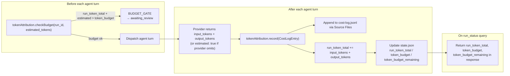

# Knowgrph AI Showrunner — Technical Design

## Overview

The **AI Showrunner** is a multi-agent creative pipeline orchestration layer for knowgrph.
It enables three concrete production scenarios — automated podcast pipelines, narrative game
engines, and multi-agent writers' rooms — by composing over existing platform owners rather
than replacing them.

The design is **harness-first**: every agent call is dry-runnable, every state transition is
durable, and every token spend is attributable. All new components are provider-neutral,
renderer-agnostic, and integrated through existing contracts (MCP, KGC, Source Files, memory
layer, semantic key, storyboard widget).

### Design Principles

- **No parallel owners**: all new logic routes through existing chat-to-canvas, Source Files,
  memory, MCP, and renderer owners.
- **Frontmatter-first documents**: all structured data (briefs, scripts, state) is expressed as
  frontmatter-first Markdown so the existing KGC pipeline can parse, validate, and apply it.
- **Append-only state**: Creative_State is an immutable log — no in-place mutations.
- **Semantic keys everywhere**: all run-scoped identifiers are derived from
  `buildScopedGraphSemanticKey()`, never hardcoded.
- **Bounded everything**: every loop, retry, revision cycle, and message delivery is bounded by
  values declared in the Creative_Brief or system defaults.


## Architecture

### High-Level Architecture

```mermaid
graph TD
  subgraph "MCP Surface — mcp/server.js"
    MCP_START["knowgrph.showrunner.start_run"]
    MCP_STATUS["knowgrph.showrunner.run_status"]
    MCP_CHOICE["knowgrph.showrunner.post_choice"]
    MCP_CRITIQUE["knowgrph.showrunner.submit_critique"]
    MCP_APPROVE["knowgrph.showrunner.approve_stage"]
    MCP_ARTIFACT["knowgrph.showrunner.get_artifact"]
  end

  subgraph "Showrunner Core — canvas/src/features/ai-showrunner/"
    BRIEF_PARSER["briefParser.ts\nShowrunnerBriefSpec parse/print"]
    ORCHESTRATOR["showrunnerOrchestrator.ts\nPipeline_Run lifecycle + routing"]
    STATE_STORE["creativeStateStore.ts\nAppend-only Creative_State log"]
    MSG_BUS["messageBus.ts\nTyped message routing between roles"]
    TOKEN_ATTR["tokenAttribution.ts\nPer-turn cost_log + budget enforcement"]
    PIPELINE_PODCAST["podcastPipeline.ts\nresearcher→scriptwriter→director→narrator_router"]
    PIPELINE_NARRATIVE["narrativeGameEngine.ts\nChoice_Graph runtime API over Strytree"]
    PIPELINE_WRITERS["writersRoomSession.ts\nbrainstormer→drafter→critic→revisor"]
    SCRIPT_SCHEMA["scriptSchema.ts\nScript parse/print + knowgrph-script/v1"]
    LIFECYCLE["pipelineRunLifecycle.ts\nState machine: 6 states + transitions"]
  end

  subgraph "Existing Owners — REUSED, NOT MODIFIED"
    SEMANTIC_KEY["canvas/src/lib/graph/semanticKey.ts\nbuildScopedGraphSemanticKey()"]
    SOURCE_FILES["canvas/src/features/source-files/\nSource_Files persistence SSOT"]
    STORAGE_SYNC["canvas/src/lib/storage/\nD1/R2 sync"]
    MEMORY_LAYER["mcp/memory-layer-runtime.js\nknowgrph.memory.*"]
    STRYBLDR["canvas/src/features/strybldr/\nStoryboard renderer"]
    STRYTREE["canvas/src/features/strybldr/strytreeWorkflow.ts\nBranching graph + forkcompare"]
    CHAT_KGC["canvas/src/features/chat/chatKgcCanvasApply.ts\nLLM output → canvas"]
    RICH_MEDIA["canvas/src/features/chat/richMediaRun.ts\nAudio/TTS output path"]
    FLOW_EDITOR["canvas/src/features/storyboard-widget-manager/\nkgc-computing-flow/v1 registry"]
    TOKEN_BUDGET["canvas/src/features/token-budget/\nApproval gate + budget meter"]
    VDEOXPLN["canvas/src/features/agent-ready/knowgrphVdeoxplnContract.mjs\nSkill registry"]
    RESEARCH["canvas/src/features/research-agent/researchThesisContract.ts\nResearch compiler"]
    SUPERAGENT["knowgrph_parser/superagent_harness.py\nSuperAgent harness"]
  end

  MCP_START --> ORCHESTRATOR
  MCP_STATUS --> ORCHESTRATOR
  MCP_CHOICE --> PIPELINE_NARRATIVE
  MCP_CRITIQUE --> PIPELINE_WRITERS
  MCP_APPROVE --> ORCHESTRATOR
  MCP_ARTIFACT --> SOURCE_FILES

  ORCHESTRATOR --> BRIEF_PARSER
  ORCHESTRATOR --> STATE_STORE
  ORCHESTRATOR --> MSG_BUS
  ORCHESTRATOR --> TOKEN_ATTR
  ORCHESTRATOR --> LIFECYCLE
  ORCHESTRATOR --> PIPELINE_PODCAST
  ORCHESTRATOR --> PIPELINE_NARRATIVE
  ORCHESTRATOR --> PIPELINE_WRITERS

  STATE_STORE --> SOURCE_FILES
  TOKEN_ATTR --> SOURCE_FILES
  LIFECYCLE --> SOURCE_FILES

  PIPELINE_PODCAST --> SCRIPT_SCHEMA
  PIPELINE_PODCAST --> RESEARCH
  PIPELINE_PODCAST --> RICH_MEDIA
  PIPELINE_NARRATIVE --> STRYTREE
  PIPELINE_WRITERS --> MSG_BUS

  ORCHESTRATOR --> MEMORY_LAYER
  ORCHESTRATOR --> CHAT_KGC
  ORCHESTRATOR --> SEMANTIC_KEY

  FLOW_EDITOR --> ORCHESTRATOR
  VDEOXPLN --> ORCHESTRATOR
  TOKEN_BUDGET --> ORCHESTRATOR
  STORAGE_SYNC --> SOURCE_FILES
```




## Components and Interfaces

### New Files — All under `canvas/src/features/ai-showrunner/`

| File | Responsibility |
|---|---|
| `briefParser.ts` | Parse / print `ShowrunnerBriefSpec` ↔ `knowgrph-showrunner-brief/v1` Markdown |
| `showrunnerOrchestrator.ts` | Pipeline_Run sequencing, routing, resume, approval gates |
| `creativeStateStore.ts` | Append-only log: read_context, append, dedup by content_hash |
| `messageBus.ts` | Typed pub/sub routing between agent roles within a run |
| `tokenAttribution.ts` | Per-turn cost_log append, run_token_total accumulation, budget gate |
| `pipelineRunLifecycle.ts` | State machine transitions, list_runs, failure_report |
| `podcastPipeline.ts` | researcher → scriptwriter → director → narrator_router sequence |
| `narrativeGameEngine.ts` | Choice_Graph runtime API extending Strytree forkcompare |
| `writersRoomSession.ts` | brainstormer → drafter → critic → revisor revision loop |
| `scriptSchema.ts` | Parse / print `Script` ↔ `knowgrph-script/v1` Markdown |
| `showrunnerFlowNode.ts` | Storyboard Widget node registration (input/output ports + widget entry) |
| `showrunnerVdeoxpln.ts` | Vdeoxpln registry entry for AI Showrunner skill |
| `showrunnerMcpTools.ts` | MCP tool definitions, registered via `buildKnowgrphLocalMcpToolDefinitions()` |
| `showrunnerDryRun.ts` | Dry-run harness: deterministic mock provider, paidCallCount=0 |
| `showrunnerTypes.ts` | All shared TypeScript types and Zod schemas |

### MCP Registration Pattern

New showrunner tools are added to `mcp/local-tool-contract.js` inside the existing
`buildKnowgrphLocalMcpToolDefinitions()` return array, following the existing pattern:

```typescript
// canvas/src/features/ai-showrunner/showrunnerMcpTools.ts
export const SHOWRUNNER_MCP_TOOL_NAMES = Object.freeze({
  startRun:        "knowgrph.showrunner.start_run",
  runStatus:       "knowgrph.showrunner.run_status",
  postChoice:      "knowgrph.showrunner.post_choice",
  submitCritique:  "knowgrph.showrunner.submit_critique",
  approveStage:    "knowgrph.showrunner.approve_stage",
  getArtifact:     "knowgrph.showrunner.get_artifact",
} as const)
```

The names are then added to `KNOWGRPH_LOCAL_MCP_TOOL_NAMES` in
`canvas/src/features/agent-ready/knowgrphVdeoxplnContract.mjs` — no new keys invented,
appended to the existing frozen object following the `memoryAdd`, `memorySearch` pattern.

### Storyboard Widget Node Registration

The `showrunner` node type is registered in `canvas/src/features/ai-showrunner/showrunnerFlowNode.ts`
as a `WidgetRegistryEntry` following the `SwarmPrediction` and `TextGeneration` node patterns:

```typescript
export const SHOWRUNNER_WIDGET_ENTRY: WidgetRegistryEntry = {
  id: "knowgrph-showrunner-v1",
  isEnabled: true,
  nodeTypeId: "showrunner",
  widgetTypeId: "knowgrph-showrunner",
  formId: "showrunner-form",
  fields: [
    { fieldKey: "brief_path",  label: "Brief Path",  fieldType: "string" },
    { fieldKey: "run_id",      label: "Run ID",       fieldType: "string" },
    { fieldKey: "dry_run",     label: "Dry Run Mode", fieldType: "boolean" },
  ],
  ports: [
    { portKey: "brief_path",          direction: "input"  },
    { portKey: "run_id",              direction: "input"  },
    { portKey: "run_status",          direction: "output" },
    { portKey: "latest_artifact_path",direction: "output" },
    { portKey: "token_spend_summary", direction: "output" },
  ],
  updatedAt: "2026-06-19T00:00:00Z",
}
```

### Vdeoxpln Skill Registration

A new entry `KNOWGRPH_VDEOXPLN_IDS.aiShowrunner = "knowgrph-ai-showrunner"` is added to
`knowgrphVdeoxplnContract.mjs` following the `memoryLayer` pattern. The entry declares
showrunner triggers, owners, local MCP tools, and AI policy.


## Data Models

### `ShowrunnerBriefSpec`

```typescript
// canvas/src/features/ai-showrunner/showrunnerTypes.ts

export type AgentRoleEntry = {
  role: string                  // e.g. "researcher", "scriptwriter", "critic"
  model_hint?: string           // resolved from env, never hardcoded
  max_retries?: number          // defaults to system default (3)
  system_prompt_path?: string   // optional override, relative to workspace root
}

export type NarratorVoiceMapEntry = {
  speaker: string               // matches Script segment speaker field
  voice_endpoint_env_key: string// env var name that resolves to the TTS URL — never a literal URL
}

export type ShowrunnerBriefSpec = {
  schema: "knowgrph-showrunner-brief/v1"
  run_type: "podcast" | "narrative_game" | "writers_room"
  title: string
  run_id: string                // semantic key input, not a literal UUID
  token_budget: number          // total token spend cap for this run
  max_retries: number           // default agent turn retry ceiling
  max_revision_cycles?: number  // writers_room only
  max_context_tokens?: number   // narrative_game only
  max_memory_tokens?: number    // bounded top_k for memory recall
  agent_pipeline: string[]      // ordered role names e.g. ["researcher","scriptwriter","director","narrator_router"]
  agent_roles: AgentRoleEntry[]
  narrator_voice_map?: NarratorVoiceMapEntry[]  // podcast only
  acceptance_criteria?: string[]
  notes?: string
}
```

### `CreativeStateEntry`

```typescript
export type CreativeStateEntry = {
  run_id: string
  agent_role: string
  turn_index: number            // monotonically increasing per run
  content_hash: string          // SHA-256 of content — write is rejected if duplicate
  entry_type: "research_pack" | "script_draft" | "idea_set" | "draft" | "critique"
             | "revision" | "world_state" | "narration_segment" | "artifact_manifest"
             | "message" | "error_record"
  content: string               // plain text or JSON string — never provider-specific format
  timestamp_iso: string
  token_estimate?: number       // estimated tokens for this entry
}
```

### `MessageBusMessage`

```typescript
export type MessageBusMessageType =
  | "draft" | "critique" | "revision_request" | "approval"
  | "choice_signal" | "narration_segment"

export type MessageBusMessage = {
  run_id: string
  source_role: string
  target_role: string
  message_type: MessageBusMessageType
  payload: string               // plain text or JSON string
  turn_index: number
  delivered: boolean
  timestamp_iso: string
}
```

### `PipelineRunState`

```typescript
export type PipelineRunStatus =
  | "queued" | "running" | "awaiting_review" | "complete" | "failed" | "archived"

export type PipelineRunState = {
  run_id: string
  run_type: "podcast" | "narrative_game" | "writers_room"
  status: PipelineRunStatus
  brief_path: string            // showrunner/briefs/<run_id>/brief.md
  current_stage_id: string
  current_turn_index: number
  run_token_total: number
  token_budget: number
  token_budget_remaining: number
  paid_call_count: number       // 0 in dry-run mode
  retry_counts: Record<string, number>  // keyed by agent_role
  created_at_iso: string
  updated_at_iso: string
  dry_run: boolean
}
```

### `CostLogEntry`

```typescript
export type CostLogEntry = {
  run_id: string
  agent_role: string
  model_id: string              // resolved from env, never hardcoded literal
  input_tokens: number
  output_tokens: number
  turn_index: number
  stage_id: string
  estimated: boolean            // true when provider did not return token counts
  timestamp_iso: string
}
```

### `Script`

```typescript
export type ScriptSegment = {
  speaker: string               // matches NarratorVoiceMapEntry.speaker
  text: string
  stage_direction?: string
  duration_estimate_s?: number
}

export type Script = {
  schema: "knowgrph-script/v1"
  title: string
  run_id: string
  segments: ScriptSegment[]
}
```

### Source File Paths

All paths are derived from `run_id` via `buildScopedGraphSemanticKey()`. No path contains
a hardcoded literal identifier.

| Artifact | Path Pattern |
|---|---|
| Brief | `showrunner/briefs/<run_id>/brief.md` |
| Run state | `showrunner/runs/<run_id>/state.json` |
| Creative_State entries | `showrunner/runs/<run_id>/state/<turn_index>-<role>.md` |
| Cost log | `showrunner/runs/<run_id>/cost-log.jsonl` |
| Narration manifest | `showrunner/runs/<run_id>/narration-manifest.md` |
| Choice graph | `showrunner/runs/<run_id>/choice-graph.md` |
| Drafts | `showrunner/runs/<run_id>/drafts/v<draft_version>.md` |
| Revision history | `showrunner/runs/<run_id>/revision-history.md` |
| Artifact manifest | `showrunner/runs/<run_id>/manifest.md` |
| Failure report | `showrunner/runs/<run_id>/failure_report.md` |


## Key Interfaces and Contracts

### `IBriefParser`

```typescript
// canvas/src/features/ai-showrunner/briefParser.ts
export interface IBriefParser {
  /** Parse a knowgrph-showrunner-brief/v1 Markdown document into ShowrunnerBriefSpec.
   *  Returns a structured validation error if the document is invalid.  */
  parse(markdownText: string): { ok: true; spec: ShowrunnerBriefSpec }
                             | { ok: false; errors: string[] }

  /** Format a ShowrunnerBriefSpec back into a knowgrph-showrunner-brief/v1 document.
   *  Round-trip guarantee: parse(print(spec)) produces an equivalent spec.  */
  print(spec: ShowrunnerBriefSpec): string
}
```

### `IScriptSchema`

```typescript
// canvas/src/features/ai-showrunner/scriptSchema.ts
export interface IScriptSchema {
  parse(markdownText: string): { ok: true; script: Script }
                             | { ok: false; errors: string[] }
  print(script: Script): string
}
```

### `ICreativeStateStore`

```typescript
// canvas/src/features/ai-showrunner/creativeStateStore.ts
export interface ICreativeStateStore {
  /** Append an entry. Rejected (structured error) if content_hash is duplicate for run_id. */
  append(entry: CreativeStateEntry): Promise<{ ok: true } | { ok: false; error: string }>

  /** Return the most recent entries fitting within token_budget tokens.
   *  If token_budget <= 0 returns empty context and a structured error. */
  readContext(runId: string, tokenBudget: number): Promise<{
    entries: CreativeStateEntry[]
    estimatedTokens: number
    error?: string
  }>
}
```

### `IMessageBus`

```typescript
// canvas/src/features/ai-showrunner/messageBus.ts
export interface IMessageBus {
  /** Publish a typed message. Returns structured error if target_role is not in the brief. */
  publish(msg: MessageBusMessage): Promise<{ ok: true } | { ok: false; error: string }>

  /** Drain the inbox for a specific role before its next turn. */
  drainInbox(runId: string, role: string): Promise<MessageBusMessage[]>

  /** Flush all pending inbox entries to the run trace (called on complete/fail). */
  flush(runId: string): Promise<void>
}
```

### `IShowrunnerOrchestrator`

```typescript
// canvas/src/features/ai-showrunner/showrunnerOrchestrator.ts
export interface IShowrunnerOrchestrator {
  startRun(briefOrPath: ShowrunnerBriefSpec | string): Promise<{ runId: string; status: PipelineRunStatus }>
  resumeRun(runId: string): Promise<void>
  approveStage(runId: string, stageId: string): Promise<void>
  runStatus(runId: string): Promise<PipelineRunState>
  listRuns(filter: RunListFilter): Promise<PipelineRunState[]>
  archiveRun(runId: string): Promise<void>
}
```

### `ITokenAttribution`

```typescript
// canvas/src/features/ai-showrunner/tokenAttribution.ts
export interface ITokenAttribution {
  /** Record a cost log entry; append to cost-log.jsonl via Source Files owner. */
  record(entry: CostLogEntry): Promise<void>

  /** Check if adding estimatedTokens would exceed budget. Returns true if safe to proceed. */
  checkBudget(runId: string, estimatedTokens: number): Promise<boolean>

  /** Estimate tokens from text without a provider call, using the memory layer estimator. */
  estimate(text: string): number
}
```

### `IPipelineRunLifecycle`

```typescript
// canvas/src/features/ai-showrunner/pipelineRunLifecycle.ts
export interface IPipelineRunLifecycle {
  transition(runId: string, event: LifecycleEvent): Promise<PipelineRunState>
  writeFailureReport(runId: string, report: FailureReport): Promise<void>
  writeArtifactManifest(runId: string): Promise<void>
}

export type LifecycleEvent =
  | { type: "PICK_UP" }
  | { type: "BUDGET_GATE"; stageId: string }
  | { type: "APPROVE"; stageId: string }
  | { type: "ARTIFACT_WRITTEN" }
  | { type: "UNRECOVERABLE_ERROR"; report: FailureReport }
  | { type: "ARCHIVE" }
```


## Integration Points with Existing Owners

### `buildScopedGraphSemanticKey()` — `canvas/src/lib/graph/semanticKey.ts`

All `run_id`, `turn_id`, `draft_version` key derivations call `buildScopedGraphSemanticKey()`
with a `scope` of `"showrunner"` and a stable content hash as the `graphSemanticKey` argument.
No UUID literals or hardcoded path segments appear in showrunner source.

### Source Files — `canvas/src/features/source-files/`

The `creativeStateStore`, `pipelineRunLifecycle`, `tokenAttribution`, and all pipeline variants
write artifacts exclusively through the Source Files owner. No second persistence path is created.
The existing workspace path structure (`showrunner/runs/<run_id>/...`) is a natural extension
of the existing `docs/**` SSOT convention.

### Memory Layer — `mcp/memory-layer-runtime.js`

The orchestrator calls `knowgrph.memory.add` and `knowgrph.memory.search` before and after each
agent turn. Scope fields: `run_id` as the `run_id` scope, `agent_role` as `agent_id`.
Token-bounded recall via `knowgrph.memory.assemble_prompt` with `max_memory_tokens` from the
brief. No parallel memory store is created.

### Chat KGC Canvas Apply — `canvas/src/features/chat/chatKgcCanvasApply.ts`

All LLM outputs that mutate the canvas flow through `chatKgcCanvasApply.ts`. The orchestrator
dispatches agent turns as structured KGC prompts through the FloatingPanel Chat submit
coordinator path, not by calling an LLM provider directly.

### Rich Media Panel — `canvas/src/features/chat/richMediaRun.ts`

TTS invocations for podcast narration are routed through `richMediaRun.ts` audio output path.
No parallel audio rendering path is created.

### Strytree — `canvas/src/features/strybldr/strytreeWorkflow.ts`

The Narrative_Game_Engine extends Strytree at the `forkcompare` contract level. It adds a
runtime API (`NarrativeGameEngine.extendChoiceGraph`) that generates candidate nodes and submits
them to the existing `forkcompare` workbench. The Strytree renderer and edge-projection
contract are unchanged.

### Token Budget / Approval Gate — `canvas/src/features/token-budget/`

The orchestrator emits `BUDGET_GATE` lifecycle events consumed by the existing approval-gate
and budget-meter primitives. The Storyboard Widget approval widget surfaces these gates. No second
approval UX is created.

### MCP Local Tool Surface — `mcp/local-tool-contract.js`

Showrunner tools are added to the `buildKnowgrphLocalMcpToolDefinitions()` return array. All
six tools follow the `withLocalMcpDescriptorDefaults()` pattern. The MCP server is not forked.

### Vdeoxpln Registry — `canvas/src/features/agent-ready/knowgrphVdeoxplnContract.mjs`

A single new `RAW_VDEOXPLN` entry `knowgrph-ai-showrunner` is appended. Its `tools.local`
array lists the six showrunner MCP tool names. The canvas Storyboard Widget node is referenced in
`owners`. The `vdeoxpln:check` validation suite picks it up automatically.

### Research Compiler — `canvas/src/features/research-agent/researchThesisContract.ts`

The `podcastPipeline` researcher role invokes the existing `research.scout` contract from the
SuperAgent harness to produce the research pack. No new research contract is created.

### Storyboard Widget — `canvas/src/features/storyboard-widget-manager/`

The `showrunner` node type is registered as a `WidgetRegistryEntry` in `showrunnerFlowNode.ts`.
It follows the same `nodeTypeId` / port pattern as `SwarmPrediction` and `TextGeneration` nodes.
The registration is exported and imported by the Storyboard Widget manager's registry loader.


## State Machine — Pipeline_Run Lifecycle

Exactly six states, seven transitions, zero additional states.



### Transition Table

| From | Event | To | Side Effect |
|---|---|---|---|
| `queued` | `PICK_UP` | `running` | Write `state.json` via Source Files |
| `running` | `BUDGET_GATE` | `awaiting_review` | Emit approval-gate event; update `state.json` |
| `awaiting_review` | `APPROVE` | `running` | Release gate; update `state.json` |
| `running` | `ARTIFACT_WRITTEN` | `complete` | Write `manifest.md` via Source Files |
| `running` | `UNRECOVERABLE_ERROR` | `failed` | Write `failure_report.md`; update `state.json` |
| `complete` | `ARCHIVE` | `archived` | Produce final Artifact_Package manifest |
| `failed` | `ARCHIVE` | `archived` | Produce final Artifact_Package manifest |

### Resume on Restart

On platform restart the orchestrator loads all runs in `running` or `awaiting_review` state
from their `state.json` checkpoints. It resumes from `current_turn_index + 1` — already
completed turns are not re-executed.


## Sequence Diagrams

### Podcast Pipeline



### Narrative Game Engine



### Writers' Room Session




## Token Economics Flow

Token attribution is per-turn, per-role, and aggregated at the run level. All cost logic
lives in `tokenAttribution.ts` and persists to `cost-log.jsonl` through Source Files.



### Token Estimation Fallback

When a provider does not return token counts, `tokenAttribution.ts` calls the shared
`knowgrph.memory.assemble_prompt` token-estimation contract from the memory layer.
The `CostLogEntry` records `estimated: true`. No provider-specific cost formula is used.

### Budget Gate Integration

The orchestrator emits a `BUDGET_GATE` lifecycle event via `pipelineRunLifecycle.ts` when
`token_budget_remaining < estimated_tokens_for_next_turn`. The existing approval-gate primitive
in `canvas/src/features/token-budget/` surfaces this as an approval widget in the Storyboard Widget.
The orchestrator only resumes on `APPROVE`.


## MCP Tool Registration Pattern

All six showrunner MCP tools are defined in `canvas/src/features/ai-showrunner/showrunnerMcpTools.ts`
and registered by appending them to the array returned by `buildKnowgrphLocalMcpToolDefinitions()`
in `mcp/local-tool-contract.js`. No parallel MCP server is created.

### Tool Schemas

```typescript
// Abbreviated schemas — full JSON Schema objects live in showrunnerMcpTools.ts

START_RUN_INPUT_SCHEMA = {
  type: "object", additionalProperties: false,
  oneOf: [
    { required: ["brief_path"] },   // path to persisted brief.md
    { required: ["brief_inline"] }, // inline ShowrunnerBriefSpec as JSON string
  ],
  properties: {
    brief_path:    { type: "string" },
    brief_inline:  { type: "string" },
    dry_run:       { type: "boolean", default: false },
  }
}

RUN_STATUS_INPUT_SCHEMA = {
  type: "object", additionalProperties: false,
  required: ["run_id"],
  properties: { run_id: { type: "string" } }
}

POST_CHOICE_INPUT_SCHEMA = {
  type: "object", additionalProperties: false,
  required: ["run_id", "choice_signal"],
  properties: {
    run_id:       { type: "string" },
    choice_signal: { type: "string" }  // narrative choice text
  }
}

SUBMIT_CRITIQUE_INPUT_SCHEMA = {
  type: "object", additionalProperties: false,
  required: ["run_id", "draft_version", "critique_text"],
  properties: {
    run_id:        { type: "string" },
    draft_version: { type: "number" },
    critique_text: { type: "string" }
  }
}

APPROVE_STAGE_INPUT_SCHEMA = {
  type: "object", additionalProperties: false,
  required: ["run_id", "stage_id"],
  properties: {
    run_id:   { type: "string" },
    stage_id: { type: "string" }
  }
}

GET_ARTIFACT_INPUT_SCHEMA = {
  type: "object", additionalProperties: false,
  required: ["run_id", "artifact_type"],
  properties: {
    run_id:        { type: "string" },
    artifact_type: {
      type: "string",
      enum: ["brief", "script", "narration_manifest", "choice_graph",
             "draft", "revision_history", "manifest", "cost_log"]
    }
  }
}
```

### Read-Safety Contract

`run_status` and `get_artifact` are annotated with `readOnlyHint: true`,
`idempotentHint: true`, and `destructiveHint: false` — matching `READ_ONLY_TOOL_ANNOTATIONS`
from the existing local tool contract. These tools never mutate Creative_State or trigger
agent turns.


## Dry-Run / Test Harness Design

### Dry-Run Mode (`showrunnerDryRun.ts`)

Dry-run mode is activated by `dry_run: true` in the brief or the `start_run` MCP call.
When active:

- Every agent turn is dispatched to the **deterministic mock provider** rather than the
  live chat/LLM endpoint. The mock returns a structurally valid response (correct schema,
  plausible fixture content) without any paid API call.
- `paidCallCount` in `PipelineRunState` is set to `0` and never incremented in dry-run mode.
- The full lifecycle executes: state transitions, Creative_State appends, cost-log entries,
  Source File writes, and artifact manifest production all happen with mock content.
- Artifact structure is identical to a live run — same file paths, same frontmatter schema.

```typescript
// canvas/src/features/ai-showrunner/showrunnerDryRun.ts

export interface IMockProvider {
  /** Returns a deterministic, structurally valid agent response for the given role + turn. */
  generate(role: string, turnIndex: number, context: string): string
}

export const buildDeterministicMockProvider = (): IMockProvider => ({
  generate(role, turnIndex, _context) {
    // Each role returns a canned fixture matching its expected output schema.
    // Output is deterministic given (role, turnIndex) — no randomness.
    return MOCK_RESPONSES[role]?.[turnIndex % 3] ?? MOCK_RESPONSES.default
  }
})
```

Following the Strybldr dry-run proof pattern, the run manifest includes:
```json
{
  "mode": "dry-run",
  "paidCallCount": 0,
  "validation": { "ok": true, "artifactStructureMatch": true }
}
```

### Unit Test Coverage

Test files follow the `npm --prefix canvas run test:ci:unit` convention. All new tests live in
`canvas/src/features/ai-showrunner/__tests__/`:

| Test File | What It Tests |
|---|---|
| `briefParser.test.ts` | Brief validation, parse/print round-trip (PBT) |
| `scriptSchema.test.ts` | Script parse/print round-trip (PBT) |
| `creativeStateStore.test.ts` | Append-only invariant, deduplication, read_context edge cases (PBT) |
| `messageBus.test.ts` | Message routing, unregistered target_role error (PBT) |
| `pipelineRunLifecycle.test.ts` | State machine transitions, failure report writes |
| `tokenAttribution.test.ts` | Budget enforcement invariant, cost_log append (PBT) |
| `podcastPipeline.test.ts` | Voice map resolution, gap-report on missing speaker |
| `narrativeGameEngine.test.ts` | world_state invariant after choice, forkcompare delegation |
| `writersRoomSession.test.ts` | draft_version monotonic increase, convergence-timeout event |
| `showrunnerOrchestrator.test.ts` | Re-entrance on resume, run_status idempotence |
| `showrunnerDryRun.test.ts` | Dry-run produces correct artifact structure, paidCallCount=0 |

### Vdeoxpln Check Integration

`showrunnerVdeoxpln.ts` exports the `knowgrph-ai-showrunner` entry. The `vdeoxpln:check` script
(`scripts/check-vdeoxpln.mjs`) validates it automatically when the entry is added to `RAW_VDEOXPLN`
in `knowgrphVdeoxplnContract.mjs`. No extra registration step is needed.

### Typecheck

All new files are TypeScript and must pass `npm --prefix canvas run typecheck` without new
type errors. Shared types in `showrunnerTypes.ts` are imported from every other showrunner
module rather than redeclared inline.


## Correctness Properties

*A property is a characteristic or behavior that should hold true across all valid executions
of a system — essentially, a formal statement about what the system should do. Properties serve
as the bridge between human-readable specifications and machine-verifiable correctness
guarantees.*

PBT is appropriate here because: the showrunner has pure parsing, state-append, and routing
logic with clear input/output contracts; input variation (different briefs, scripts, agent
sequences, token values) reveals meaningful edge cases; and the core logic is in-memory or
Source-File-backed — not gated on paid AWS or LLM calls in test mode.

**PBT library**: fast-check (TypeScript, npm), minimum 100 iterations per property.

---

### Property 1: Brief Round-Trip

*For any* valid `ShowrunnerBriefSpec` object, parsing the printed Markdown document
and then printing the parsed result again SHALL produce a document that parses to
a structurally equivalent `ShowrunnerBriefSpec`.

That is: `parse(print(parse(print(spec)))) ≡ parse(print(spec))` for all valid specs.

**Validates: Requirements 1.6, 1.7, 1.8**

---

### Property 2: Script Round-Trip

*For any* valid `Script` object (with one or more `ScriptSegment` entries of varying
speaker, text, and optional stage_direction), parsing the printed document and then
printing the re-parsed result again SHALL produce a structurally equivalent `Script`.

**Validates: Requirements 5.4, 5.5, 5.6**

---

### Property 3: Creative_State Append-Only Monotonic Growth

*For any* sequence of N append calls to the Creative_State store where each call
carries a distinct `(run_id, content_hash)` pair, the log size after N appends SHALL
be exactly N, and the entries SHALL appear in the order they were appended.

This also implies: for any message delivered by the Message Bus (which appends to
Creative_State), and for any agent turn output routed by the Orchestrator (which also
appends to Creative_State), the log size grows by exactly 1 per operation.

**Validates: Requirements 3.1, 4.5, 2.2**

---

### Property 4: Creative_State Deduplication by content_hash

*For any* `(run_id, content_hash)` pair, if `append` is called twice with the same
content_hash for the same run_id, the second call SHALL return a structured error
and the log size SHALL remain unchanged (no duplicate entry created).

**Validates: Requirements 3.2**

---

### Property 5: run_status is Read-Only and Idempotent

*For any* `PipelineRunState` at any lifecycle stage, calling `runStatus(run_id)` N times
SHALL return the same `PipelineRunState` value each time, and the stored `state.json`
SHALL be identical before and after any number of `runStatus` calls.

**Validates: Requirements 2.5**

---

### Property 6: Orchestrator Re-entrance on Resume

*For any* `run_id` where the last committed `state.json` records `current_turn_index = K`,
resuming the orchestrator with that `run_id` SHALL begin dispatching from turn index `K + 1`
and SHALL NOT re-execute or re-append any turn with index ≤ K.

**Validates: Requirements 2.8**

---

### Property 7: Zero-or-Negative Token Budget Returns Empty Context and Structured Error

*For any* Creative_State (including non-empty states with many entries), calling
`readContext(run_id, budget)` with `budget ≤ 0` SHALL return an empty `entries` array,
a `token_estimate` of 0, and a non-null `error` string, without throwing an exception.

**Validates: Requirements 3.5**

---

### Property 8: Message Bus Returns Structured Error for Unregistered Target Role

*For any* `ShowrunnerBriefSpec` and any `MessageBusMessage` where `target_role` is not
present in `brief.agent_roles`, calling `bus.publish(message)` SHALL return
`{ ok: false, error: <non-empty string> }` and SHALL NOT silently discard the message
or deliver it to an unregistered role.

**Validates: Requirements 4.4**

---

### Property 9: Narrator Voice Map Covers All Speakers or Emits Gap-Report Entries

*For any* `Script` with N distinct speaker values and any `Narrator_Voice_Map`, the
narrator_router SHALL produce exactly N outputs: a resolved segment (with `voice_endpoint_env_key`)
for each speaker present in the map, and a structured `gap_report` entry for each speaker
absent from the map — processing continues for remaining segments in either case. The sum of
resolved segments and gap_report entries SHALL equal N.

**Validates: Requirements 5.7, 5.8**

---

### Property 10: world_state Written After Every Choice Resolution

*For any* sequence of M choice signals submitted to the Narrative_Game_Engine, the
Creative_State store SHALL contain exactly M `world_state` entries with
`turn_index` values forming a strictly increasing sequence.

**Validates: Requirements 6.4**

---

### Property 11: draft_version is Monotonically Increasing

*For any* Writers' Room session, the sequence of `draft_version` values assigned to
successive drafts SHALL be strictly increasing — no draft version SHALL be repeated,
skipped, or decremented over the course of a session.

**Validates: Requirements 7.3**

---

### Property 12: Token Budget Safety Invariant

*For any* `token_budget` value B > 0 and any sequence of agent turns with input+output
token costs `c_1, c_2, ..., c_n`, the orchestrator SHALL never dispatch the k-th turn
if `sum(c_1, ..., c_{k-1}) + estimated_cost(turn_k) > B`. The `run_token_total` field
in `state.json` SHALL never exceed `token_budget` at the moment any agent turn begins.

**Validates: Requirements 10.2**

---

### Property 13: Dry-Run Produces Full Artifact Structure with paidCallCount = 0

*For any* valid `ShowrunnerBriefSpec` with `dry_run: true`, a complete orchestrator run
SHALL produce the same set of Source File paths (brief.md, state.json, cost-log.jsonl,
manifest.md, and run-type-specific artifacts) as a live run with the same brief, and
`paidCallCount` in the run manifest SHALL equal 0.

**Validates: Requirements 14.1, 14.2**


## Error Handling

### Structured Error Contract

All errors returned by showrunner components follow a uniform shape so the orchestrator,
MCP tools, and UI can display them without switch/case on error type:

```typescript
export type ShowrunnerError = {
  ok: false
  code: ShowrunnerErrorCode
  message: string
  context?: Record<string, unknown>  // e.g. { field: "token_budget", received: -1 }
}

export type ShowrunnerErrorCode =
  | "BRIEF_VALIDATION_ERROR"
  | "DUPLICATE_CONTENT_HASH"
  | "UNREGISTERED_ROLE"
  | "INVALID_TOKEN_BUDGET"
  | "BUDGET_EXCEEDED"
  | "MAX_RETRIES_EXHAUSTED"
  | "INVALID_RUN_STATE"
  | "ARTIFACT_NOT_FOUND"
  | "MEMORY_RECALL_EMPTY"
  | "BRANCH_GENERATION_FAILED"
  | "CONVERGENCE_TIMEOUT"
  | "VOICE_MAP_GAP"
```

### Retry Logic

Each agent role has a `max_retries` value from the brief (defaulting to 3). The orchestrator:

1. On a structured error from an agent turn, increments `retry_counts[role]` in `state.json`.
2. If `retry_counts[role] < max_retries`, re-dispatches with the error context appended to the
   prompt (via memory layer).
3. If `retry_counts[role] >= max_retries`, transitions the run to `failed` and writes
   `failure_report.md`.

No unbounded retry loop exists. The ceiling is always explicit.

### Failure Report Format

```markdown
---
schema: knowgrph-showrunner-failure-report/v1
run_id: <derived semantic key>
failing_role: scriptwriter
turn_index: 3
error_code: MAX_RETRIES_EXHAUSTED
error_message: "Agent produced malformed Script after 3 attempts"
timestamp_iso: 2026-06-19T12:34:56Z
---

# Failure Report

Failing role `scriptwriter` at turn 3 exhausted `max_retries: 3`.

Last error: Agent produced malformed Script after 3 attempts.

Context: see `cost-log.jsonl` for token spend up to this point.
```

### Memory Recall Empty

If `knowgrph.memory.search` returns an empty result, the orchestrator proceeds with the base
system prompt. It records a `MEMORY_RECALL_EMPTY` event in the run trace (as a
`CreativeStateEntry` of type `error_record`) but does not halt the run.


## Testing Strategy

### Dual Testing Approach

Every functional contract has both unit tests (concrete examples and edge cases) and
property-based tests (universal properties across generated inputs). Unit tests confirm
specific behaviors; property tests confirm general correctness across the input space.

### Property-Based Testing

**Library**: `fast-check` (TypeScript, npm, already used in `mcp/__pbt__/`)  
**Minimum iterations**: 100 per property  
**Tag format**: Each property test carries a comment tag:

```typescript
// Feature: knowgrph-ai-showrunner, Property 1: Brief Round-Trip
fc.assert(fc.property(arbBriefSpec, (spec) => {
  const printed = briefParser.print(spec)
  const reparsed = briefParser.parse(printed)
  expect(reparsed.ok).toBe(true)
  if (reparsed.ok) {
    expect(reparsed.spec).toEqual(spec)
  }
}), { numRuns: 100 })
```

### Property Test Arbitraries

```typescript
// canvas/src/features/ai-showrunner/__tests__/arbitraries.ts

export const arbBriefSpec   = fc.record({ ... })  // generates valid ShowrunnerBriefSpec
export const arbScript      = fc.record({ ... })  // generates valid Script with 1-20 segments
export const arbStateEntry  = fc.record({ ... })  // generates CreativeStateEntry
export const arbTokenBudget = fc.integer({ min: 1, max: 100_000 })
export const arbNegativeBudget = fc.integer({ max: 0 })
export const arbVoiceMap    = fc.array(fc.record({ ... }), { minLength: 0, maxLength: 10 })
```

### Unit Test Focus Areas

- Brief validation: minimum required fields, each `run_type` value, missing fields return
  structured error (not thrown exception).
- Creative_State: append with same content_hash twice returns error; `readContext` with exact
  token budget boundary; empty state returns empty context.
- Message Bus: delivery ordering; flush on complete; unregistered role returns error.
- Pipeline lifecycle: every valid transition succeeds; invalid transitions return structured
  error; resume skips completed turns.
- Token attribution: budget gate fires at the correct threshold; `estimated: true` is set
  when token counts are absent; cost-log.jsonl is append-only.

### Integration Points Tested by Mocks

Agent turns, Source File writes, memory layer calls, and TTS invocations are all mocked in
unit and PBT tests. End-to-end integration against the real memory layer and real Source Files
is validated via dry-run mode (which exercises the real persistence path with mock LLM responses).

### Test Runner

```bash
npm --prefix canvas run test:ci:unit
```

All new test files in `canvas/src/features/ai-showrunner/__tests__/` are picked up
automatically by the existing Vitest configuration.

### Checklist

- [ ] `npm --prefix canvas run typecheck` — zero new errors
- [ ] `npm --prefix canvas run test:ci:unit` — all showrunner tests pass
- [ ] `npm run vdeoxpln:check` — `knowgrph-ai-showrunner` present in registry
- [ ] `npm run hygiene:check` — zero new hygiene violations
- [ ] Dry-run end-to-end: `paidCallCount: 0`, full artifact structure produced
