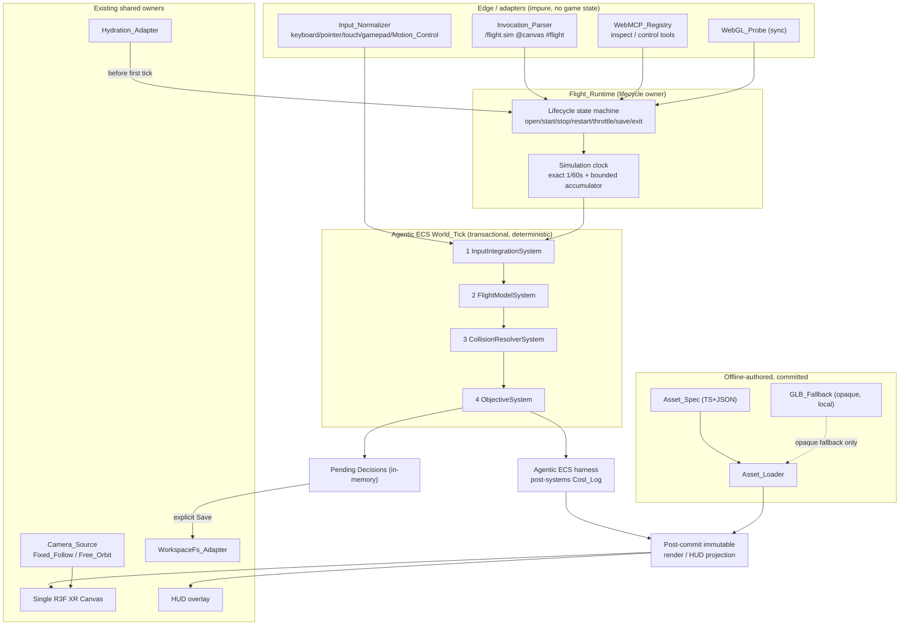

# Design Document: Knowgrph Native Flight Simulator

## Overview

The Knowgrph Native Flight Simulator (`Flight_Sim`) is a browser-local, single-player, offline, deterministic flight mission that mounts as a `FloatingPanel` mode on the single existing Knowgrph React Three Fiber XR Canvas. It composes existing repository owners — the Knowgrph renderer, the native Agentic ECS, browser-local WorkspaceFs, and the shared camera catalog — with a small cluster of new, in-repo flight owners: an in-repo `Flight_Model`, an in-repo AABB `Collision_Resolver`, an `Asset_Loader` over `img2threejs`-style diffable specs, a strict `Invocation_Parser`, two browser-local WebMCP tools, and a Decisions-only persistence path.

The feature is governed by hard, non-negotiable platform constraints that this design treats as invariants rather than goals:

- **TCO-zero, zero-infrastructure, offline-first, local-first, mobile-first.** Core gameplay issues zero outbound network requests, requires no sign-in/camera/passkey/Cloudflare service, and mutates no deployed infrastructure. It renders and controls the mission inside a 375×812 device-independent-pixel viewport.
- **Token economics.** Every `World_Tick` performs zero model-inference calls and zero runtime image-to-3D calls, and emits exactly one honest canonical `$0` `Cost_Log`.
- **FOSS-only, zero new runtime dependencies.** The flight cluster adds no runtime dependency beyond the existing renderer, Agentic_ECS, WorkspaceFs, and camera owners, and forbids Rapier, Yuka, behavior-tree/navmesh libraries, bitECS, edge-ML, and LLM dependencies.
- **FlightGear inspiration boundary.** FlightGear (and the framing reference `Arnie016/flight-simulator-fable5`) informs concepts and architecture only. Knowgrph contributors attest that the implementation and assets are source-authored, and zero external-project dependency is declared. The build-time gate scans tracked files for named identity, path, content-marker, binary/asset, and declared-dependency contamination; it cannot prove the absence of arbitrary derived code.
- **Native Agentic ECS.** Mission state advances exclusively through the transactional `World_Tick` API, stays ephemeral in memory, and persists only validated `EcsDecision` nodes with deterministic replay.
- **In-repo physics.** `Flight_Model` (thrust/pitch/roll/yaw + bounded lift/drag/gravity) and `Collision_Resolver` (swept AABB against an authored slab catalog) are in-repo, with no external physics engine and no mesh colliders or navmesh.
- **img2threejs primary asset pipeline.** The required aircraft is a committed diffable TypeScript + JSON `Asset_Spec`; one optional subject may use an opaque GLB produced by the repository-owned deterministic offline generator and admitted only as a committed, hash-pinned, license-gated local fallback. No TRELLIS.2 or other external-generator dependency is present.
- **Strict invocation and bounded MCP surface.** Exactly `/flight.sim @canvas #flight`; browser-local tools `knowgrph.inspect_local_flight_sim` and `knowgrph.control_local_flight_sim`; the private Agentic ECS stdio lane stays at exactly three tools.
- **Shared single Canvas.** One R3F XR Canvas, one renderer, one camera owner; `Camera_Source` offers Fixed_Follow and Free_Orbit; `Motion_Control` is optional input only, never the flight policy.
- **Deterministic loop.** Exact fixed `1 / 60` second (approximately 16.667 ms, 60 Hz) timestep with a bounded catch-up accumulator, synchronous WebGL admission, a resumable lifecycle, fail-closed hydration/retry, repository-owned runtime-readiness and browser-smoke gates, and source-authored activation identity.

This repository-tracked design is part of the normative `.kiro/specs/knowgrph-game-flight-sim` source of truth. It grounds those constraints in the tracked Agentic ECS contract (`docs/documents/knowgrph-agentic-entity-component-system-prd-tad.md`), the canonical `contracts/cost-log.schema.js`, and the source module cluster under `canvas/src/features/game-flight-sim/`. The Flight Sim PRD/TAD (`docs/documents/knowgrph-game-flight-sim-prd-tad.md`) and workspace seed (`docs/workspace-seeds/knowgrph-game-flight-sim-demo.md`) are derived implementation/proof projections; any workspace-root Kiro copy is a byte-identical local projection only.

### Grounding in existing owners

| Concern | Reused existing owner | Flight_Sim addition |
|---|---|---|
| Entity/component state, transactional tick | `ecs/` five-function API (`createWorld`, `allocateEntity`, `registerComponent`, `query`, `worldTick`) | Flight components + ordered flight systems injected at `createWorld` |
| Rendering | Single R3F Canvas (`ThreeGraph.impl.tsx`) + authored XR stage | Aircraft/waypoint/objective actors + HUD overlay only |
| Camera/input arbitration | Shared camera catalog + XR controller hook + Timeline camera-marks + Motion Control adapter | Pure follow/framing descriptor; no Flight-owned camera |
| Browser persistence | WorkspaceFs source-file bridge + KGC decision document | Decisions-only flight save adapter |
| Cost truth | `contracts/cost-log.schema.js` | Canonical model-free zero record per tick |
| Transport | Official MCP SDK stdio lane (exactly three ECS tools) | Two browser-local WebMCP tools only |

## Architecture

### Layered composition

`Flight_Sim` is a thin, deterministic domain layer over the Agentic ECS. Input, invocation, and MCP calls are converted into normalized frames and lifecycle operations; the ECS `World_Tick` advances ordered flight systems; an immutable projection feeds the shared renderer and HUD; and only validated Decisions leave the process through WorkspaceFs.



No node in this topology is a model call, remote service, Cloudflare resource, Git operation, or runtime image-to-3D call. Every arrow crossing the process boundary is either a committed-local file read (Asset_Spec/GLB_Fallback, save hydration) or the single explicit Decisions-only local write.

### Determinism architecture

Determinism is the backbone constraint (Requirements 5, 6). It is achieved structurally:

1. **Frame-derived clock.** The simulation advances only from normalized input frames on an exact fixed `1 / 60` second timestep (approximately 16.667 ms), never from raw DOM/document events (R6.2). A bounded accumulator executes at most 5 catch-up ticks per rendered frame so results are refresh-rate-independent across 24–240 fps (R6.3).
2. **Transactional advance.** All mission state changes happen inside a committed `World_Tick`; any mutation attempted outside the transactional boundary is rejected (R5.1, R5.7).
3. **Pure, integer-stable integration.** `Flight_Model` and `Collision_Resolver` are pure functions of `(previous state, normalized input, mission constants)` with no wall-clock, RNG, or floating display-time inputs. Identical inputs produce byte-equivalent canonical serialization (R6.1).
4. **Immutable projection.** The renderer and HUD read a projection produced only after a committed tick; rendering cannot feed back into simulation state (R6.4).
5. **Replay guard.** Replays validate input count, ordering, and mission seed before advancing, and halt on the first byte-divergent tick, preserving the last byte-equivalent state (R6.5, R6.6).

### World_Tick system ordering

Each `World_Tick` runs a fixed, construction-time-ordered pipeline of systems inside the ECS per-system journal model (earlier commits survive a later system's failure; the failing system rolls back and names itself — R5.4). Ordering is significant and stable:

| Order | System | Responsibility | Primary requirements |
|---|---|---|---|
| 1 | `InputIntegrationSystem` | Read the single normalized input frame for this tick; clamp out-of-range/non-finite values to nearest bound; hold last valid frame when no input | R7.5, R16.1–R16.5 |
| 2 | `FlightModelSystem` | Apply thrust from throttle and pitch/roll/yaw from control inputs; apply bounded lift/drag/gravity; update attitude/velocity to finite, bounded values | R7.1–R7.4 |
| 3 | `CollisionResolverSystem` | Sweep previous→proposed aircraft cuboid against the AABB slab catalog + perimeter/ceiling blockers; return earliest non-penetrating hit; zero velocity along hit normal | R8.1–R8.6 |
| 4 | `ObjectiveSystem` | Advance ordered waypoint capture and landing-pad completion; emit terminal-result Decision as pending | R17.1–R17.5 |

The Agentic ECS harness emits exactly one canonical `Cost_Log` after the four systems, including the required `incomplete: true` blocked-inference representation, and the Flight runtime captures the immutable render/HUD projection only after the World commits. These are required post-system owners, not journaled systems and not no-op aliases.

The stdio ECS server injects no systems (per the ECS design); the four flight systems are host code passed through the internal `createWorld({ systems })` construction seam by `Flight_Runtime`. The MCP caller cannot author or inject them.

### Lifecycle and clock

`Flight_Runtime` owns a lifecycle state machine over exactly `open`, `start`, `stop`, `restart`, `throttle`, `save`, `exit`. Start performs synchronous WebGL admission (R21.1), prepares a ready frame at tick zero, and holds at tick zero until at least one normalized input arrives (R21.3, R21.8). Blur/hidden and Fixed_Follow pointer-release pause the clock within one fixed tick without changing state; Free_Orbit pointer-lock exit does not pause (R21.4–R21.6). Stop-then-Start resumes the exact in-memory tick and aircraft state (R21.7).

### Shared Canvas ownership

`Flight_Runtime` mounts overlay actors and the HUD inside the single existing R3F Canvas, keeping the authored atmosphere/terrain/scene graph mounted (R14.1, R14.2). It never introduces a second renderer, Canvas, alternate world, or Flight-owned camera. On exit it restores the previous surface controller and simulation state; entry or restoration failure leaves the existing Canvas and prior controller unchanged and surfaces a local error (R14.3–R14.5). `Camera_Source` supplies a pure follow/framing descriptor consumed by the shared controller hook; Fixed_Follow is the default, Free_Orbit is selectable, and Timeline camera-marks temporarily own framing then return to the last selected option (R15).

## Components and Interfaces

### Flight_Runtime (`flightSimRuntime.ts`)

The lifecycle and orchestration owner. Holds the ECS World handle, the simulation clock, the pending-decision buffer, and the current lifecycle state.

```ts
type LifecycleOp = "open" | "start" | "stop" | "restart" | "throttle" | "save" | "exit";

interface FlightRuntime {
  apply(op: LifecycleOp, args?: { throttle?: number }): Promise<LifecycleResult>;
  // Advances at most `maxCatchUp` (=5) fixed ticks for elapsed real time.
  pump(nowMs: number, frame: NormalizedInputFrame): Promise<void>;
  inspect(): Readonly<FlightSimProjection>;          // read-only, no mutation
}
```

Responsibilities: reject any state change outside a committed `World_Tick` (R5.1, R5.7); discard all in-memory World state on session end (R5.3); keep the mission held at tick zero until first input (R21.3); resume exact tick/state on Stop→Start (R21.7); persist only via explicit Save (R19.4).

### Flight_Model (`flightModel.ts`)

Pure deterministic flight-dynamics function used by `FlightModelSystem`.

```ts
interface AircraftState {
  position: Vec3; velocity: Vec3;        // world units, world units/s
  attitude: Vec3;                        // pitch, roll, yaw in degrees [-180,180]
}
interface FlightInput { throttle: number; pitch: number; roll: number; yaw: number; }

function integrateFlight(
  prev: AircraftState, input: FlightInput, k: FlightConstants, dtSeconds = 1 / 60
): { next: AircraftState; clampedInput: FlightInput; outOfRange: boolean };
```

Guarantees: throttle clamped to `[0,1]`, control axes to `[-1,1]`, non-finite inputs clamped to nearest bound with `outOfRange` surfaced and prior valid state retained (R7.5); output attitude bounded to `[-180,180]` per axis, velocity components bounded to configured min/max, and all outputs finite — never NaN/Infinity (R7.1); lift/drag/gravity applied deterministically each tick (R7.2, R7.3); no external physics engine (R7.4, R3.3).

### Collision_Resolver (`flightModel.ts` / spatial profile)

Pure swept-AABB resolver used by `CollisionResolverSystem`.

```ts
interface AabbBlocker { id: string; min: Vec3; max: Vec3; }   // stable ascending id order
interface SweptResult { position: Vec3; velocity: Vec3; hit?: { blockerId: string; t: number; normal: Vec3 }; }

function resolveSweep(
  prev: Vec3, proposed: Vec3, half: Vec3,   // aircraft cuboid half-extents
  catalog: AabbBlocker[], velocity: Vec3
): SweptResult;
```

Guarantees: sweeps previous→proposed parameterized by `t ∈ [0,1]` and completes within the tick (R8.1); selects lowest-`t` earliest hit, breaking ties by smallest blocker id under stable ascending ordering (R8.2); returns a position with ≥ 0.001 world-unit separation margin (no penetration) and zeroes velocity along the hit normal within 0.0001 wu/s while preserving tangential velocity (R8.3); returns proposed position/velocity unchanged when the catalog is empty (R8.4); de-penetrates a start-of-tick overlap along the axis of shallowest penetration (R8.5); uses no mesh colliders/navmesh/generated geometry (R8.6).

### Input_Normalizer (`flightSimInput.ts`, `flightSimMotionControlAdapter.ts`)

Combines desktop keyboard, pointer, mobile touch, standard gamepad, and optional Motion_Control into a single `NormalizedInputFrame` per tick.

Guarantees: single combined frame per tick (R16.1); pitch/roll/yaw mapped to `[-1,1]`, throttle to `[0,1]` (R16.2); out-of-range clamped to nearest bound with last valid frame retained (R16.3); no input → pitch/roll/yaw 0.0 and last commanded throttle held (R16.4); multi-device conflict resolved by largest absolute magnitude (R16.5); Motion_Control contributes optional normalized input only and is never the control policy (R16.6, R16.7).

### Invocation_Parser (`flightSimMcpContract.mjs`)

Validates the strict native grammar `/flight.sim @canvas #flight operation=<op>`.

Guarantees: accepts only exactly one `/flight.sim`, one `@canvas`, one `#flight` (R12.1); rejects with a named-missing-token error when any is absent (R12.2); fails closed on duplicate sigil, unknown key, or mixed structured/native input, leaving prior state unchanged (R12.3); applies exactly one supported lifecycle op (R12.4); rejects unsupported ops without state change (R12.5).

### WebMCP_Registry (`flightSimMcpRuntime.ts`)

Exposes exactly two browser-local tools for this surface: `knowgrph.inspect_local_flight_sim` (read-only state within 2000 ms, no mutation; error result when state unavailable — R13.1–R13.3) and `knowgrph.control_local_flight_sim` (applies a supported lifecycle op within 2000 ms; rejects unsupported ops without state change — R13.4, R13.5). It adds zero stdio tools, HTTP mutation routes, remote gateways, or deployment authority (R13.6) and keeps the private Agentic ECS stdio lane at exactly three tools (R13.7).

### Asset_Loader (`assetSpec/flightSimAssetSpec.ts`)

Resolves committed local `Asset_Spec` artifacts to the canonical in-repo procedural renderer, with GLB_Fallback confined to a committed local file.

Guarantees: prefers `Asset_Spec` when both spec and GLB exist (R9.1); resolves identity/shape/dimensions/collision size/color/zero-call metadata entirely from in-repo data with all fields non-empty and zero network/external-binary fetches (R9.2); fails closed (naming the asset, loading no renderer, performing no GLB fetch) on missing/invalid field, non-positive dimension/collision size, non-null opaque-binary fallback field, unknown field, or mismatched scene-library identity (R9.3, R9.4); admits the required aircraft through exactly one committed TS+JSON spec and records a GLB_Fallback count of zero for it (R9.5, R9.6); records opaque GLB fallbacks with `opaque: true` (R10.1), obtains GLB only from committed local files (R10.2), reports total fallback count in `[0, subjectCount]` (R10.3), rejects remote GLB URLs without fetch (R10.4), and surfaces a local error excluding the subject from the count when a local GLB is missing/unreadable (R10.5).

### WorkspaceFs_Adapter & Hydration_Adapter (`flightSimDecisionStore.ts`, `flightSimDecisionAdmission.ts`, `flightSimPendingDecisions.ts`, `flightSimHydrationGate.ts`)

Decisions-only persistence over the existing WorkspaceFs KGC decision document. Writes only canonical `EcsDecision` additions of type `dialogue_outcome`/`quest_flag`/`world_tick_result`, rejecting other types (R19.1); merges idempotently by `decisionId` (R19.2); preserves all authored bytes except supported Decision insertions (R19.3); persists only on explicit Save, never auto-saving (R19.4); on failure leaves bytes and prior Decisions unchanged and surfaces an error (R19.5). Hydration reconstructs mission progress from the validated Decision index before the first tick (R20.7); a validation failure blocks World creation, names the unreadable path, preserves bytes, and exposes Reset (R20.2, R20.3); Reset re-enables Start/Restart (R20.4); write failure retains pending Decisions and exposes Retry (R20.5, R20.6).

### HUD (`FlightSimHud.tsx`)

Displays airspeed, altitude, heading, attitude, throttle (normalized `[0,1]`), waypoint/objective state, save state, and errors, refreshing each value within 100 ms of an underlying change (R18.1, R18.2); shows local error indications with the affected local path (R18.3); reflects pending/retryable/successful and non-retryable save states (R18.4, R18.5).

## Data Models

### AircraftState (ephemeral ECS components)

Stored as Agentic ECS numeric components (typed arrays), never persisted:

```
Position   { x: f32, y: f32, z: f32 }          // world units
Velocity   { x: f32, y: f32, z: f32 }          // world units/s, each clamped to configured [min,max]
Attitude   { pitch: f32, roll: f32, yaw: f32 } // degrees, each in [-180.0, 180.0]
Throttle   { value: f32 }                       // normalized [0.0, 1.0]
```

Invariants: every field finite (no NaN/Infinity); attitude bounded per axis; velocity components within configured limits; throttle within `[0,1]`.

### NormalizedInputFrame

```ts
interface NormalizedInputFrame {
  tickIndex: number;         // monotonic; drives the fixed clock
  throttle: number;          // [0.0, 1.0]
  pitch: number; roll: number; yaw: number; // each [-1.0, 1.0]
  sources: InputSourceTag[]; // provenance; not part of canonical simulation state
}
```

### AABB slab catalog

```ts
interface AabbBlocker { id: string; min: Vec3; max: Vec3; kind: "slab" | "perimeter" | "ceiling"; }
type AabbCatalog = AabbBlocker[]; // stable ascending sort by id; sourced from the authored XR spatial profile
```

Invariants: `min <= max` per axis for every blocker; ids unique; ordering stable and ascending for deterministic tie-breaking.

### Asset_Spec (img2threejs-style)

```ts
interface AssetSpec {
  identity: string;                 // non-empty; matches canonical scene-library identity
  sceneLibrary: string;             // non-empty; must match the canonical renderer library id
  shape: ProceduralShapeDescriptor; // non-empty procedural renderer shape
  dimensions: Vec3;                 // each strictly > 0
  collisionSize: Vec3;              // each strictly > 0
  color: string;                    // non-empty
  zeroCallMetadata: { runtimeModelCalls: 0; runtimeNetworkCalls: 0; };
  opaqueBinaryFallback: null;       // MUST be null in this increment; non-null fails closed
}
```

Constraints: committed human-editable UTF-8 text, ≤ 1 MB per spec (R11.2, R11.5); authored fully offline before commit (R11.1); any unknown field, non-positive dimension/collision size, missing field, non-null `opaqueBinaryFallback`, or mismatched `sceneLibrary` fails closed (R9.2–R9.4).

### GLB_Fallback metadata

```ts
interface GlbFallbackRecord { subjectId: string; source: "committed-local-file"; opaque: true; }
interface AssetLoadReport { subjects: string[]; glbFallbackCount: number; /* 0..subjects.length */ }
```

Invariants: `source` is always a committed local file (remote URLs rejected without fetch); `glbFallbackCount` ∈ `[0, subjects.length]`; the required aircraft contributes 0.

### Cost_Log (canonical, from `contracts/cost-log.schema.js`)

Per `World_Tick`, snake_case canonical shape:

```
{ model, prompt_tokens, completion_tokens, cache_hits, estimated_cost_usd, incomplete }
```

Model-free tick emits exactly: `model: "none"`, all token fields `0`, `cache_hits: 0`, `estimated_cost_usd: 0`, `incomplete: false` (R2.1). A blocked inference attempt emits exactly one record with `incomplete: true` and a blocked-inference error field, preserving tick state (R2.5). Cost_Log records are never persisted (R5.5, R19.1).

### EcsDecision (the only persisted data)

```yaml
- type: EcsDecision
  properties:
    ecsDecision:
      decisionId: string        # idempotency key
      decisionType: dialogue_outcome | quest_flag | world_tick_result
      entityRef: string
      payload: {}
      producedAt: ISO-8601
```

Constraints: only these three types accepted (R19.1); merged idempotently by `decisionId` (R19.2); the sole durable output — component arrays, World snapshots, Cost_Log records, credentials, and raw input history are never persisted (R5.5).

### MissionObjective

```ts
interface MissionObjective {
  waypoints: [Waypoint, Waypoint, Waypoint];  // exactly 3, ordered
  landingPad: Waypoint;
  captureRadiusM: number;                      // 50..200 per point
}
interface MissionProgress { capturedCount: 0 | 1 | 2 | 3; landed: boolean; terminal: "pending" | "success" | null; }
```

Invariants: capture requires strict in-order progression (out-of-order entry does not advance — R17.3); terminal success requires all three waypoints then the pad (R17.2); terminal result is held pending until an explicit successful Save (R17.4, R17.5).

### ActivationIdentity

```ts
interface ActivationIdentity { runReadyDemoId: string; importedPath?: string; }
```

Activation keys on the source-authored `run_ready_demo.id` in the known registry independent of imported path (R23.1); path/source disagreement fails closed with an identity-conflict error (R23.2); an unregistered id fails closed (R23.3).

## Correctness Properties

*A property is a characteristic or behavior that should hold true across all valid executions of a system — essentially, a formal statement about what the system should do. Properties serve as the bridge between human-readable specifications and machine-verifiable correctness guarantees.*

This feature is a strong fit for property-based testing: the flight loop is built from pure, deterministic functions (`Flight_Model`, `Collision_Resolver`), universal invariants (determinism, non-penetration, cost-truth, no-network, idempotent persistence), and structured validators (`Asset_Spec`, invocation grammar, input normalization) over large input spaces. The properties below are derived from the prework analysis after redundancy reflection. Acceptance criteria classified as SMOKE, INTEGRATION, EXAMPLE, or EDGE_CASE are covered by the Testing Strategy rather than as standalone properties (edge cases are folded in as property-generator branches).

Each property MUST be implemented as a single property-based test running at least 100 iterations, tagged in the form `Feature: knowgrph-game-flight-sim, Property <number> - <property text>`.

### Property 1: Zero external calls during runtime
*For any* sequence of normalized input frames, lifecycle operations, and asset loads exercised during core play, the Flight_Sim issues zero outbound network requests, zero model-inference calls, zero runtime image-to-3D calls, and zero Cloudflare service requests.
**Validates: Requirements 1.2, 1.7, 2.2, 2.3, 2.4, 10.2, 11.3**

### Property 2: Blocked gameplay/inference attempt fails closed and preserves state
*For any* mission state, an attempted gameplay network request or model-inference call is blocked without being performed, the mission state is retained without rollback, no blocking wait on a remote response occurs, and (for inference) exactly one canonical Cost_Log with `incomplete: true` and a blocked-inference error field is emitted while the World_Tick state is preserved.
**Validates: Requirements 1.3, 2.5**

### Property 3: Successful model-free tick emits exactly one canonical zero Cost_Log
*For any* normalized input frame, a World_Tick that completes without a reasoning request emits exactly one schema-valid canonical Cost_Log with `model` equal to `none`, every token field equal to 0, `cache_hits` equal to 0, `estimated_cost_usd` equal to 0, and `incomplete` equal to false.
**Validates: Requirements 2.1**

### Property 4: Decisions-only persistence path
*For any* play sequence that records Decisions, all persistence flows exclusively through the WorkspaceFs_Adapter into browser-local storage, and no component arrays, World snapshots, Cost_Log records, credentials, or raw input history are ever written.
**Validates: Requirements 1.5, 5.5**

### Property 5: Transactional boundary is enforced
*For any* attempted mutation of Agentic_ECS World state outside the committed `World_Tick` API, the mutation is rejected, the World state is left unchanged, and a structured error indicating the transactional-boundary violation is returned.
**Validates: Requirements 5.1, 5.7**

### Property 6: Ephemeral in-memory state with no durable World writes
*For any* play sequence, no durable write of Agentic_ECS component arrays or World snapshots occurs, and after a session ends the in-memory World state is discarded so it is unrecoverable outside persisted Decisions.
**Validates: Requirements 5.2, 5.3**

### Property 7: Per-system rollback preserves prior commits
*For any* World_Tick in which system k fails, all systems ordered before k remain committed, only system k's writes are rolled back, later systems do not execute, and a structured failure names the failing system and its cause.
**Validates: Requirements 5.4**

### Property 8: Deterministic byte-equivalent replay
*For any* mission seed and any list of normalized input frames advanced for the same number of ticks, two fresh Flight_Runtime instances produce byte-equivalent aircraft state, flight integration, collision result, waypoint/objective progress, Decisions, and HUD projection after canonical serialization (zero differing bytes), and identical committed World results.
**Validates: Requirements 5.6, 6.1**

### Property 9: Frame-derived, refresh-independent, bounded-accumulator advance
*For any* frame stream and any display-refresh schedule in the range 24 to 240 frames per second, tick advancement is derived solely from normalized input frames (not raw document/DOM event timing), the mission result equals the reference result, and the number of catch-up ticks executed per rendered frame never exceeds 5.
**Validates: Requirements 6.2, 6.3**

### Property 10: Projection is read-only and post-commit
*For any* projection read consumed by the renderer or HUD, the projection is produced after a committed World_Tick and reading it leaves the committed World state unchanged.
**Validates: Requirements 6.4**

### Property 11: Replay rejects mismatched inputs without mutation
*For any* recorded run, a replay whose normalized input frame count, ordering, or mission seed does not match the recorded run is rejected without mutating aircraft state and surfaces an invalid-replay-inputs indication.
**Validates: Requirements 6.5**

### Property 12: Replay halts on determinism divergence
*For any* replay in which a World_Tick produces aircraft state that is not byte-equivalent to the recorded state at the same tick index, the replay halts at that tick, preserves the last byte-equivalent committed state, and surfaces a determinism-divergence indication.
**Validates: Requirements 6.6**

### Property 13: Flight integration stays finite and bounded
*For any* aircraft state and control input, `Flight_Model` integration within a single World_Tick produces only finite values (no NaN or infinite), attitude bounded to −180.0 to 180.0 degrees per axis, and each velocity component bounded to its configured min/max limits, applying deterministic thrust, pitch, roll, yaw, lift, drag, and gravity.
**Validates: Requirements 7.1, 7.2, 7.3**

### Property 14: Input clamping to valid ranges
*For any* throttle, pitch, roll, or yaw value that is outside its defined normalized range (throttle 0.0–1.0; control axes −1.0–1.0) or non-finite, the value is clamped to its nearest valid bound before integration, the last valid frame/aircraft state is retained, and an out-of-range indication is surfaced.
**Validates: Requirements 7.5, 16.3**

### Property 15: Swept AABB collision yields a non-penetrating result
*For any* previous and proposed aircraft cuboid and any AABB slab/perimeter/ceiling catalog, the resolver sweeps parameterized by normalized time t in 0.0–1.0 within the tick and returns a position maintaining at least 0.001 world-unit separation from the hit blocker, sets velocity along the hit normal to 0.0 within 0.0001 wu/s while preserving tangential velocity, and returns the proposed position and velocity unchanged when the catalog is empty.
**Validates: Requirements 8.1, 8.3, 8.4**

### Property 16: Earliest-hit selection with stable tie-break
*For any* configuration in which the sweep intersects multiple blockers, the resolver selects the hit with the lowest sweep-time t, and when two or more hits share the lowest t it selects the hit with the smallest blocker identifier under stable ascending ordering.
**Validates: Requirements 8.2**

### Property 17: Start-of-tick penetration is resolved
*For any* aircraft cuboid already penetrating a blocker at the start of a World_Tick, the resolver returns the nearest non-penetrating position that restores at least 0.001 world-unit separation along the axis of shallowest penetration and sets the velocity component directed into that blocker to 0.0.
**Validates: Requirements 8.5**

### Property 18: Asset_Spec preference over GLB fallback
*For any* subject for which both an Asset_Spec and a GLB_Fallback exist, the Asset_Loader loads the Asset_Spec and does not load the GLB_Fallback for that subject.
**Validates: Requirements 9.1**

### Property 19: Valid Asset_Spec resolves offline from in-repo data
*For any* admitted Asset_Spec, the Asset_Loader resolves identity, procedural renderer shape, dimensions, collision size, color, and zero-call metadata to the canonical in-repo renderer entirely from in-repo data with zero network and zero external-binary fetches, requiring each field to be non-empty.
**Validates: Requirements 9.2**

### Property 20: Asset_Spec validation fails closed
*For any* Asset_Spec that is missing a required field, declares a non-positive dimension or collision size, declares a non-null opaque-binary fallback field, contains an unknown field, or declares a mismatched scene-library identity, the Asset_Loader fails closed with a local error naming the asset, loads no renderer for that subject, and performs no GLB_Fallback fetch. The same fail-closed outcome holds for a required asset absent from committed local files.
**Validates: Requirements 2.6, 9.3, 9.4, 11.5**

### Property 21: GLB fallback is opaque, local, and correctly counted
*For any* load run, each subject lacking an Asset_Spec but having a committed local GLB_Fallback is loaded with an opaque flag of true and sourced only from a committed local file, and the reported total GLB_Fallback count is a non-negative integer within 0 to the total subject count that equals the number of opaque loads (a missing or unreadable local GLB yields a local error, leaves that subject unloaded, and excludes it from the count).
**Validates: Requirements 10.1, 10.3, 10.5**

### Property 22: Remote GLB references are rejected without fetch
*For any* GLB_Fallback referenced by a remote URL, the Asset_Loader rejects the reference without attempting any network fetch, returns a local error indicating a remote GLB_Fallback is not permitted, and loads no asset for the affected subject.
**Validates: Requirements 10.4**

### Property 23: Invocation grammar strictness
*For any* submitted invocation, it is accepted only if it contains exactly one `/flight.sim` command token, exactly one `@canvas` binding token, and exactly one `#flight` semantic token; a missing required token, a duplicate sigil, an unknown key, or mixed structured/native input causes fail-closed rejection with no control action, prior state unchanged, and a local error naming the specific missing token or violation.
**Validates: Requirements 12.1, 12.2, 12.3**

### Property 24: Supported lifecycle operation is applied exactly once
*For any* valid invocation or WebMCP `control` request naming a supported operation in `open`, `start`, `stop`, `restart`, `throttle`, `save`, `exit`, the Flight_Runtime applies exactly that one operation and returns a result naming the applied operation.
**Validates: Requirements 12.4, 13.4**

### Property 25: Unsupported operation is rejected without state change
*For any* invocation or WebMCP `control` request naming an operation outside the supported lifecycle set, the request is rejected with an unsupported-operation error and the current Flight_Sim lifecycle state is left unchanged.
**Validates: Requirements 12.5, 13.5**

### Property 26: Inspect is read-only
*For any* Flight_Sim state, invoking `knowgrph.inspect_local_flight_sim` returns read-only state (or an error result when state is unavailable) and leaves all mission state unchanged.
**Validates: Requirements 13.2, 13.3**

### Property 27: Normalized input frame composition
*For any* combination of desktop keyboard, pointer, mobile touch, and standard gamepad inputs in a tick, the Input_Normalizer produces exactly one normalized flight input frame with pitch/roll/yaw in −1.0 to 1.0 and throttle in 0.0 to 1.0; when input for one control arrives from multiple devices it resolves to the value with the largest absolute magnitude; and when no input is received it sets pitch/roll/yaw to 0.0 and holds the last commanded throttle.
**Validates: Requirements 16.1, 16.2, 16.4, 16.5**

### Property 28: Motion_Control is optional input only
*For any* Motion_Control output while Motion_Control is started by explicit Operator action, the value enters the Flight_Runtime only as optional normalized player input and is never used as the flight control policy.
**Validates: Requirements 16.6, 16.7**

### Property 29: Ordered waypoint progression to terminal success
*For any* trajectory, mission progress advances only when the aircraft enters the capture radius of each waypoint in the defined order; entering a waypoint before all preceding waypoints are captured does not advance progression or change the captured count; and entering all three waypoints in order followed by the landing pad records a terminal mission result of success.
**Validates: Requirements 17.2, 17.3**

### Property 30: Terminal results are pending until explicit successful Save
*For any* recorded terminal mission result, the result is held pending and is not treated as persisted until an explicit Save operation completes successfully; absent an explicit Save no Decisions are persisted (no auto-save), and if a Save operation fails the terminal result remains pending with a save-failure indication.
**Validates: Requirements 17.4, 17.5, 19.4**

### Property 31: Decisions-only idempotent byte-preserving Save
*For any* set of Decisions saved into arbitrary authored bytes, only canonical `EcsDecision` additions of type `dialogue_outcome`, `quest_flag`, or `world_tick_result` are written (other types rejected), the merge is idempotent by `decisionId` (an existing id produces no duplication and leaves existing bytes unchanged), all existing authored bytes are preserved except the byte ranges of supported Decision insertions, and a persistence failure leaves authored bytes and prior Decisions unchanged with an error surfaced.
**Validates: Requirements 19.1, 19.2, 19.3, 19.5**

### Property 32: HUD projection reflects underlying state
*For any* running mission state, the HUD projection includes airspeed, altitude, heading, attitude, throttle (normalized 0.0–1.0), waypoint state, objective state, and save state reflecting their underlying values; on a runtime error it includes an explicit local error indication with the affected local path when present; and it reflects the corresponding pending, retryable, successful, or non-retryable save state.
**Validates: Requirements 18.1, 18.2, 18.3, 18.4, 18.5**

### Property 33: Fresh mission when no save exists
*For any* start with no save document present, the Flight_Runtime creates a fresh mission without overwriting any existing local path.
**Validates: Requirements 20.1**

### Property 34: Fail-closed hydration with reset gating
*For any* existing KGC save that fails validation, the Hydration_Adapter blocks World creation, surfaces an unreadable-save error naming the local path, preserves the original bytes unchanged, exposes an explicit Reset local save action, and blocks Start and Restart until a Reset completes; a successful Reset creates a fresh mission and re-enables Start and Restart.
**Validates: Requirements 20.2, 20.3, 20.4**

### Property 35: Write failure retains pending Decisions and supports retry
*For any* local write failure, the WorkspaceFs_Adapter retains all pending Decisions in memory, preserves the prior bytes unchanged, surfaces a did-not-persist error, and exposes a Retry action that, when invoked, re-attempts writing exactly those retained pending Decisions.
**Validates: Requirements 20.5, 20.6**

### Property 36: Hydration reconstructs saved progress before first tick
*For any* save document that passes validation, the Hydration_Adapter reconstructs equivalent mission progress from the validated Decision index before the first World_Tick.
**Validates: Requirements 20.7**

### Property 37: Fail-closed admission keeps mission stopped
*For any* case where WebGL is unavailable or saved Decisions are unreadable, the Flight_Runtime keeps the mission stopped, retains existing in-memory mission data without modification, and displays a local on-screen error indicating the reason, without issuing any remote call and without instantiating a second renderer.
**Validates: Requirements 21.2**

### Property 38: Hold at tick zero until first input
*For any* Start followed by no normalized input event (including up to and beyond 300 seconds), the Flight_Runtime prepares a ready frame at tick zero and holds at tick zero without advancing fixed ticks and without changing mission state until at least one normalized input event from a desktop, pointer, touch, gamepad, Motion_Control, or MCP source arrives.
**Validates: Requirements 21.3, 21.8**

### Property 39: Focus-loss pauses the clock; Free_Orbit pointer-lock exit does not
*For any* running mission, a tab blur or document-hidden event, and a pointer-capture release while Fixed_Follow framing is active, pause the simulation clock within one fixed tick while leaving the mission tick, aircraft state, and mission state unchanged; whereas a pointer-lock exit while Free_Orbit framing is active continues advancing the clock without pausing and without changing the mission tick or aircraft state.
**Validates: Requirements 21.4, 21.5, 21.6**

### Property 40: Stop-then-Start resumes exact state
*For any* mission state held at the time Stop is applied, a subsequent Start resumes from the exact in-memory mission tick and aircraft state with zero deviation in tick value and aircraft state fields.
**Validates: Requirements 21.7**

### Property 41: Valid framing selection applied independently of aircraft
*For any* valid framing selection (Fixed_Follow or Free_Orbit) through the Camera catalog or `/camera.select`, the Camera_Source applies the selected framing regardless of aircraft selection.
**Validates: Requirements 15.2, 15.4**

### Property 42: Timeline camera-mark framing ownership round-trip
*For any* Operator selection state, while a Timeline camera-mark is playing the camera-mark owns framing, and when its playback ends the Camera_Source returns framing to the most recently Operator-selected option, or to the default Fixed_Follow framing if none has been selected.
**Validates: Requirements 15.3, 15.7**

### Property 43: Invalid camera value is rejected
*For any* `/camera.select` command whose camera value is other than `fixed-follow` or `free-orbit`, the Camera_Source rejects the selection, retains the currently active framing, and returns an error naming the invalid value.
**Validates: Requirements 15.6**

### Property 44: Canvas ownership preserved across enter/exit and failures
*For any* prior surface state, entering then exiting Flight_Sim restores the previous surface controller input and simulation state; an entry failure leaves the existing Canvas, scene graph, and prior surface controller unchanged with a local entry error; and a restoration failure on exit retains the existing single Canvas without a second renderer with a local restoration error.
**Validates: Requirements 14.3, 14.4, 14.5**

### Property 45: Source-authored activation identity with fail-closed conflicts
*For any* activation request, the Flight_Sim activates through the source-authored `run_ready_demo.id` registered in the known registry independent of any imported path; if the imported path identity and the source-authored identity disagree it fails closed with an identity-conflict error naming the conflicting identities and leaves prior activation state unchanged; and if the source-authored id is not registered it fails closed with an unregistered-identity error.
**Validates: Requirements 23.1, 23.2, 23.3**

## Error Handling

All error handling is local, fail-closed, and non-destructive. No error path issues a remote call, instantiates a second renderer, or mutates authored bytes outside supported Decision insertions.

| Failure | Owner | Required behavior | Requirements |
|---|---|---|---|
| Gameplay network request attempted | Flight_Runtime | Block within 1 s with a local blocked-request error; retain mission state without rollback; do not block on a remote response | 1.3 |
| Model-inference call attempted in a tick | Agentic ECS post-systems Cost_Log owner | Block without performing inference; emit one Cost_Log with `incomplete: true` + blocked-inference error; preserve tick state | 2.5 |
| Missing/invalid Asset_Spec, non-null opaque fallback, unknown field, mismatched identity, non-positive size | Asset_Loader | Fail closed with a local error naming the asset; load no renderer; perform no GLB fetch | 2.6, 9.3, 9.4 |
| Remote GLB URL / missing-unreadable local GLB | Asset_Loader | Reject without fetch (remote) or surface unavailable error and exclude from count (local) | 10.4, 10.5 |
| Prohibited/unlicensed/unauthorized dependency, including either inspiration-only project | Build gate | Terminate build with no artifact; name each offending item | 3.4, 3.5, 4.5 |
| System failure in a World_Tick | Agentic_ECS | Roll back only the failing system; preserve prior commits; return structured failure naming system + cause | 5.4 |
| Out-of-tick mutation attempt | Flight_Runtime | Reject; leave World unchanged; return structured transactional-boundary error | 5.1, 5.7 |
| Out-of-range / non-finite input | Input_Normalizer / Flight_Model | Clamp to nearest bound; retain last valid frame/state; surface out-of-range indication | 7.5, 16.3 |
| Invalid invocation grammar | Invocation_Parser | Fail closed; take no action; leave prior state unchanged; name missing token/violation | 12.2, 12.3 |
| Unsupported lifecycle operation | Flight_Runtime / WebMCP | Reject with unsupported-operation error; leave state unchanged | 12.5, 13.5 |
| Inspect while state unavailable | WebMCP_Registry | Return error result; leave mission state unchanged | 13.3 |
| Invalid camera value | Camera_Source | Reject; retain active framing; name invalid value | 15.6 |
| Save persistence failure | WorkspaceFs_Adapter | Preserve authored bytes + prior Decisions; retain pending in memory; surface error; expose Retry | 17.5, 19.5, 20.5 |
| Malformed existing save (hydration) | Hydration_Adapter | Block World creation; name unreadable path; preserve bytes; expose Reset; block Start/Restart until Reset | 20.2, 20.3 |
| WebGL unavailable / unreadable Decisions at Start | WebGL_Probe / Flight_Runtime | Keep mission stopped; retain in-memory data; local on-screen error; no remote call; no second renderer | 21.2 |
| Entry / restoration failure on shared Canvas | Flight_Runtime | Leave Canvas/scene/prior controller unchanged (entry) or retain single Canvas (exit); surface local error | 14.4, 14.5 |
| Activation identity conflict / unregistered id | Activation | Fail closed without activating; identity-conflict or unregistered error; leave prior activation unchanged | 23.2, 23.3 |

Structured error envelopes reuse the Agentic ECS convention `{ ok: false, errorCode, message }` with optional non-secret details, and never leak source bytes, credentials, prompts, or unrestricted absolute paths (consistent with the ECS error model). HUD surfaces the affected local path only where one is associated with the error (R18.3).

## Testing Strategy

The strategy is dual: property-based tests verify universal invariants across large input spaces, and unit/example/integration/smoke tests cover concrete scenarios, infrastructure boundaries, and configuration facts that do not vary meaningfully with input.

### Property-based tests

- Library: the repository-pinned `fast-check` (same as the Agentic ECS suite); no property framework is implemented from scratch.
- Each of Properties 1–45 is implemented as a single property-based test running a minimum of 100 generated iterations.
- Each test is tagged with a comment in the form `Feature: knowgrph-game-flight-sim, Property <number> - <property text>`.
- Generators cover edge cases folded from the prework: empty AABB catalogs (P15), start-of-tick overlaps (P17), missing/unreadable/remote GLB (P20–P22), no-input and multi-device-conflict frames (P27), out-of-order waypoint entry (P29), non-retryable save failures (P32), and the 300-second no-input hold (P38).
- Determinism properties (P8, P9, P13) rely on pure functions of `(prev state, input, constants)` with no wall-clock, RNG, or display-time inputs; external-call properties (P1, P2) run against instrumented network/model/image-to-3D seams asserting zero invocations.

### Unit and example tests

- Dependency-gate behavior over crafted dependency sets: fail-with-names on non-OSI/prohibited/unauthorized items or either inspiration-only project; pass on a clean set (R3.4, R3.5, R4.5, R4.6).
- Configuration/surface facts: exactly two WebMCP tools for the surface (R13.1); exactly three ECS stdio tools (R13.7); exactly two framing options and Fixed_Follow default (R15.1, R15.5); one ordered three-waypoint route + pad with capture radius 50–200 m (R17.1); required aircraft admitted via exactly one committed TS+JSON spec with GLB count zero (R9.5, R9.6); each committed spec is UTF-8 text ≤ 1 MB (R11.2).
- Authoring-tool behavior: offline authoring aborts before commit on a disallowed model/network/Cloudflare op, names the op, and leaves prior specs unchanged (R11.4).
- Synchronous WebGL probe returns available/unavailable without deferred resolution (R21.1).
- Runtime-readiness and browser-smoke command failure paths report non-success naming each failed verification with no repository change (R22.2, R22.4).

### Integration tests (1–3 representative examples, not PBT)

- Time-to-first-playable-frame under 3 s from seed application without sign-in/permission/fetch/Cloudflare (R1.1).
- Rendering/control at 375×812 without clipping or scrolling (R1.4).
- Shared-Canvas ownership: entering Flight_Sim keeps the authored atmosphere/terrain/scene graph mounted in exactly one Canvas/renderer/camera owner with overlay actors and HUD (R14.1, R14.2).

### Smoke and scan checks (single execution)

- Zero new deployed infrastructure and no prod/D1/R2/KV/DO/Worker/Pages mutation surface (R1.6).
- Dependency license and prohibited-library scans, including in-repo-physics boundary (no external physics engine; no mesh colliders/navmesh) (R3.1, R3.2, R3.3, R7.4, R8.6).
- Named FlightGear or `Arnie016/flight-simulator-fable5` identity/path/content-marker/binary/asset/dependency contamination scan across all tracked repository files, invoked by the build and paired with the source-authored provenance attestation; the gate cannot prove the absence of arbitrary derived code (R4.1–R4.6).
- WebMCP surface boundary: zero added stdio tools, HTTP mutation routes, remote gateways, or deployment authority (R13.6).
- Repository-owned runtime-readiness command (source authority, native ECS, focused tests, TypeScript, production build) and browser-smoke command (Source Files apply, one retained authored XR Canvas, playable input, strict WebMCP, lifecycle, Timeline camera round-trip, mobile HUD), both local-only with zero paid model/image-to-3D/Cloudflare/network and no automatic Git or deployment (R22.1, R22.3, R22.5, R22.6).

### Proof boundary

Consistent with the Agentic ECS and Flight Sim PRD/TAD proof layers, this design's tests establish local Dev correctness only. Protected integration, production, and Cloudflare deployment remain separate, operator-authorized workflows and are out of scope for these tests.
