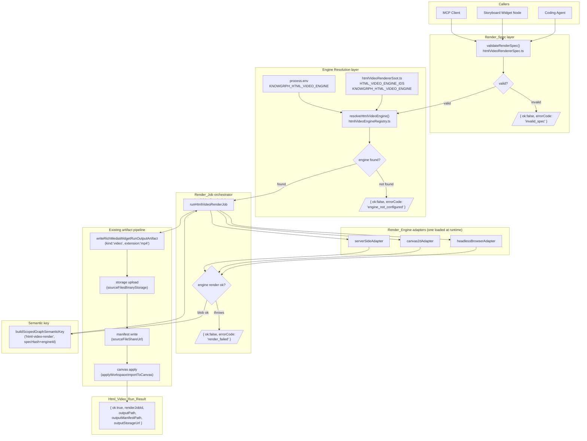
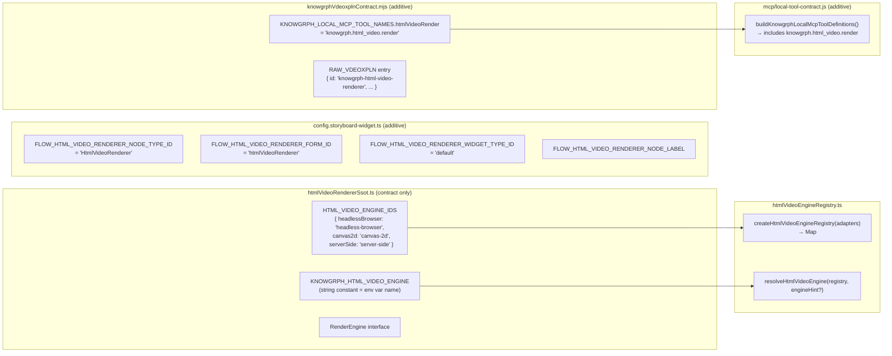
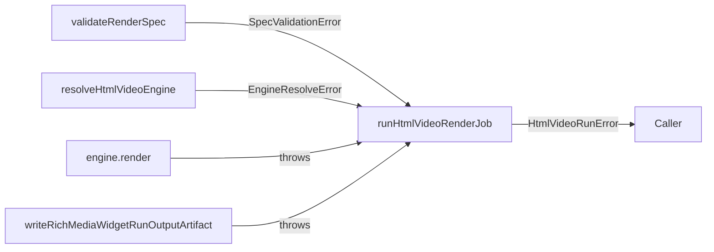

# Design Document

## Overview

`knowgrph-html-video-renderer` adds a pluggable HTML-to-video render pipeline to the knowgrph
platform. It accepts a typed `Render_Spec` from coding agents, Storyboard Widget nodes, or MCP clients,
resolves an active `Render_Engine` at runtime via the `KNOWGRPH_HTML_VIDEO_ENGINE` environment
variable (never cached, never hardcoded), produces a real `video/mp4` blob, and routes the artifact
through the existing `writeRichMediaWidgetRunOutputArtifact` → storage → manifest → canvas-apply
path.

The feature introduces no new storage owners, no new manifest writers, and no new canvas-apply
steps. All artifact lifecycle is delegated to `canvas/src/features/chat/richMediaRun.ts` exactly
as the `VideoGeneration` and `SwarmPrediction` nodes do today.

**Design principles:**
- Runtime-only engine selection — `KNOWGRPH_HTML_VIDEO_ENGINE` read at invocation, never cached
- Fail-fast structured errors — every failure path returns `{ ok: false, errorCode, ... }`
- SSOT isolation — `htmlVideoRendererSsot.ts` is the single source of all engine IDs and the
  adapter interface; adapters never import each other
- Semantic key determinism — `buildScopedGraphSemanticKey("html-video-render", ...)` for all job IDs
- Reuse over rebuild — imports `writeRichMediaWidgetRunOutputArtifact`, `buildRichMediaWidgetOutputPatch`,
  `resolveRichMediaWidgetKind` from `richMediaRun.ts` without re-declaring them


## Architecture

### Component Map

| Module | Role | Layer |
|--------|------|-------|
| `htmlVideoRendererSsot.ts` | Pure contract: adapter interface, env-var name constant, frozen engine-ID map | Contract |
| `htmlVideoRendererSpec.ts` | `Render_Spec` TypeScript type + `validateRenderSpec()` pure validator | Validation |
| `htmlVideoEngineRegistry.ts` | `Engine_Registry` map + `resolveHtmlVideoEngine()` pure resolver | Resolution |
| `htmlVideoRenderJob.ts` | Orchestrator: spec → resolver → engine → artifact pipeline | Orchestration |
| `engines/headlessBrowserAdapter.ts` | Headless-browser adapter stub implementing `Render_Engine` | Adapter |
| `engines/canvas2dAdapter.ts` | Canvas-2D adapter stub implementing `Render_Engine` | Adapter |
| `engines/serverSideAdapter.ts` | Server-side adapter stub implementing `Render_Engine` | Adapter |
| `htmlVideoFlowNode.ts` | Storyboard Widget node run handler (imports `htmlVideoRenderJob`) | Surface |
| `index.ts` | Public barrel (no adapter re-exports at top level) | Barrel |
| `canvas/src/lib/config.storyboard-widget.ts` | Adds `FLOW_HTML_VIDEO_RENDERER_*` constants (existing file, additive) | Config |
| `canvas/src/features/chat/richMediaRun.ts` | `writeRichMediaWidgetRunOutputArtifact`, `resolveRichMediaWidgetKind` (existing, no changes) | Shared |
| `mcp/local-tool-contract.js` | Registers `knowgrph.html_video.render` tool (existing file, additive) | MCP |
| `canvas/src/features/agent-ready/knowgrphVdeoxplnContract.mjs` | Adds `htmlVideoRender` to `KNOWGRPH_LOCAL_MCP_TOOL_NAMES` + vdeoxpln entry (existing file, additive) | Registry |


### Data Flow Diagram




### Registration Flow




## Components and Interfaces

### `htmlVideoRendererSsot.ts` — Pure Contract

```typescript
// canvas/src/features/html-video-renderer/htmlVideoRendererSsot.ts
// Pure contract module. Zero imports from adapter modules.

/** The environment variable name used to select the active render engine. */
export const KNOWGRPH_HTML_VIDEO_ENGINE = 'KNOWGRPH_HTML_VIDEO_ENGINE' as const

/** Frozen map of canonical engine identifiers. Single source of truth for all engine IDs. */
export const HTML_VIDEO_ENGINE_IDS = Object.freeze({
  headlessBrowser: 'headless-browser',
  canvas2d: 'canvas-2d',
  serverSide: 'server-side',
} as const)

export type HtmlVideoEngineId = typeof HTML_VIDEO_ENGINE_IDS[keyof typeof HTML_VIDEO_ENGINE_IDS]

/** Stateless adapter interface implemented by each render engine. */
export interface RenderEngine {
  readonly engineId: HtmlVideoEngineId | string
  render(spec: Readonly<RenderSpec>): Promise<RenderResult>
}

/** Structured input to the render pipeline. All numeric ranges validated before engine call. */
export type RenderSpec = {
  html: string            // non-empty
  durationMs: number      // integer, 1–3_600_000
  fps: number             // integer, 1–120
  width: number           // integer, 1–7680
  height: number          // integer, 1–4320
  css?: string
  data?: Record<string, unknown>
  engineHint?: string     // max 255 chars
}

/** Output produced by a RenderEngine adapter. */
export type RenderResult = {
  blob: Blob              // MIME: video/mp4, size > 0
  engineId: string
  durationMs: number
  fps: number
  width: number
  height: number
  renderLog?: string[]
}
```


### `htmlVideoRendererSpec.ts` — Spec Validator

```typescript
// canvas/src/features/html-video-renderer/htmlVideoRendererSpec.ts

import type { RenderSpec } from './htmlVideoRendererSsot'

export type SpecValidationOk = { ok: true; spec: Readonly<RenderSpec> }
export type SpecValidationError = {
  ok: false
  errorCode: 'invalid_spec'
  field: string
  reason: string
}
export type SpecValidationResult = SpecValidationOk | SpecValidationError

/**
 * Validates a candidate Render_Spec against the required field set and numeric ranges.
 * Pure function — no side effects, no engine knowledge, no hardcoded engine names.
 */
export function validateRenderSpec(candidate: unknown): SpecValidationResult

/**
 * Returns true when the html string, when parsed as markup, contains at least one
 * non-whitespace text node or element node. Rejects whitespace-only or empty html.
 */
export function htmlHasContent(html: string): boolean
```


### `htmlVideoEngineRegistry.ts` — Engine Registry + Resolver

```typescript
// canvas/src/features/html-video-renderer/htmlVideoEngineRegistry.ts

import type { RenderEngine, RenderSpec } from './htmlVideoRendererSsot'
import { KNOWGRPH_HTML_VIDEO_ENGINE } from './htmlVideoRendererSsot'

export type HtmlVideoEngineRegistry = ReadonlyMap<string, RenderEngine>

export type EngineResolveOk = { ok: true; engine: RenderEngine }
export type EngineResolveError = {
  ok: false
  errorCode: 'engine_not_configured'
  engineId: string
}
export type EngineResolveResult = EngineResolveOk | EngineResolveError

/**
 * Creates an immutable Engine_Registry from the provided adapter map.
 * Adapters are registered by the caller — never hard-registered in source.
 */
export function createHtmlVideoEngineRegistry(
  adapters: ReadonlyArray<RenderEngine>,
): HtmlVideoEngineRegistry

/**
 * Resolves the active RenderEngine.
 * 1. If engineHint is non-empty, uses it as the engine identifier.
 * 2. Otherwise reads process.env[KNOWGRPH_HTML_VIDEO_ENGINE] at call time (never cached).
 * 3. Looks up the resolved identifier in the registry.
 * 4. Returns EngineResolveError when the identifier is absent/empty or not in the registry.
 */
export function resolveHtmlVideoEngine(
  registry: HtmlVideoEngineRegistry,
  engineHint?: string,
): EngineResolveResult
```


### `htmlVideoRenderJob.ts` — Render Job Orchestrator

```typescript
// canvas/src/features/html-video-renderer/htmlVideoRenderJob.ts

import type { RenderSpec, RenderResult } from './htmlVideoRendererSsot'
import type { HtmlVideoEngineRegistry } from './htmlVideoEngineRegistry'
import type { GraphNode } from '@/lib/graph/types'
import type { WorkspaceFs } from '@/features/workspace-fs/types'

export type HtmlVideoRunOk = {
  ok: true
  renderJobId: string
  kind: 'video'
  blob: Blob
  outputPath: string | null
  outputManifestPath: string | null
  outputStorageUrl: string | null
}

export type HtmlVideoRunError = {
  ok: false
  errorCode: 'invalid_spec' | 'engine_not_configured' | 'render_failed' | 'artifact_write_failed'
  engineId?: string
  reason?: string
  field?: string
}

export type HtmlVideoRunResult = HtmlVideoRunOk | HtmlVideoRunError

/**
 * Full render pipeline: spec validation → engine resolution → render → artifact pipeline.
 * Calls writeRichMediaWidgetRunOutputArtifact exactly once with kind:"video", extension:"mp4".
 * Adds engineId to the manifest. Never invokes separate storage/manifest/canvas-apply steps.
 */
export async function runHtmlVideoRenderJob(args: {
  spec: unknown
  node: GraphNode
  registry: HtmlVideoEngineRegistry
  workspacePath?: string | null
  fs?: WorkspaceFs | null
}): Promise<HtmlVideoRunResult>

/**
 * Builds the deterministic renderJobId from spec fields and engineId.
 * Uses buildScopedGraphSemanticKey("html-video-render", { graphSemanticKey: stableStringify({...}) }).
 */
export function buildRenderJobId(spec: Readonly<RenderSpec>, engineId: string): string
```


### Engine Adapters

All three adapters implement the `RenderEngine` interface from `htmlVideoRendererSsot.ts`.
No adapter imports any other adapter. No adapter is imported by the SSOT module.
The `headless-browser` adapter is runtime-ready and Hyperframes-inspired without copying
Hyperframes code: it builds a seekable HTML document, advances each frame through a page-level
`window.__knowgrphRenderFrame(timeMs)` hook, captures PNG frames with the existing Playwright
runtime, and invokes an operator-provided FFmpeg binary to encode MP4. The registry still never
hard-registers it; callers must inject/select the adapter through runtime config.
The `canvas-2d` adapter is the no-system-FFmpeg Dev/Prod smoke path: it rasterizes HTML/CSS
through html2canvas into a browser canvas, then uses WebCodecs and Mediabunny to mux an MP4 blob
in memory. It fails closed in Node or browsers without `VideoEncoder`.

```typescript
// canvas/src/features/html-video-renderer/engines/headlessBrowserAdapter.ts
import type { RenderEngine } from '../htmlVideoRendererSsot'
import { HTML_VIDEO_ENGINE_IDS } from '../htmlVideoRendererSsot'

export const KNOWGRPH_HTML_VIDEO_FFMPEG_BIN = 'KNOWGRPH_HTML_VIDEO_FFMPEG_BIN' as const
export const KNOWGRPH_HTML_VIDEO_FFMPEG_VIDEO_CODEC = 'KNOWGRPH_HTML_VIDEO_FFMPEG_VIDEO_CODEC' as const
export const KNOWGRPH_HTML_VIDEO_MAX_FRAMES = 'KNOWGRPH_HTML_VIDEO_MAX_FRAMES' as const

export const headlessBrowserAdapter: RenderEngine = {
  engineId: HTML_VIDEO_ENGINE_IDS.headlessBrowser,
  async render(spec) {
    // Validate max-frame budget, render seeked browser frames, run FFmpeg, return video/mp4 Blob.
  },
}

// canvas/src/features/html-video-renderer/engines/canvas2dAdapter.ts
import type { RenderEngine } from '../htmlVideoRendererSsot'
import { HTML_VIDEO_ENGINE_IDS } from '../htmlVideoRendererSsot'

export const canvas2dAdapter: RenderEngine = {
  engineId: HTML_VIDEO_ENGINE_IDS.canvas2d,
  async render(spec) {
    // Browser-only: rasterize HTML/CSS frames to canvas, encode with WebCodecs, mux MP4 with Mediabunny.
  },
}

// canvas/src/features/html-video-renderer/engines/serverSideAdapter.ts
import type { RenderEngine, RenderSpec, RenderResult } from '../htmlVideoRendererSsot'
import { HTML_VIDEO_ENGINE_IDS } from '../htmlVideoRendererSsot'

export const serverSideAdapter: RenderEngine = {
  engineId: HTML_VIDEO_ENGINE_IDS.serverSide,
  async render(spec: Readonly<RenderSpec>): Promise<RenderResult> {
    throw new Error('server-side adapter not implemented')
  },
}
```


### Storyboard Widget Node Registration (additive changes to existing files)

**`canvas/src/lib/config.storyboard-widget.ts`** — new constants added alongside existing node type constants:

```typescript
// Additive — no existing constants modified
export const FLOW_HTML_VIDEO_RENDERER_NODE_TYPE_ID = 'HtmlVideoRenderer' as const
export const FLOW_HTML_VIDEO_RENDERER_NODE_LABEL = 'HTML Video Renderer Widget' as const
export const FLOW_HTML_VIDEO_RENDERER_WIDGET_TYPE_ID = 'default' as const
export const FLOW_HTML_VIDEO_RENDERER_FORM_ID = 'htmlVideoRenderer' as const
```

**`canvas/src/features/chat/richMediaRun.ts`** — `resolveRichMediaWidgetKind` updated to handle new typeId:

```typescript
// Additive case in the existing switch — no structural change to the function
import { FLOW_HTML_VIDEO_RENDERER_NODE_TYPE_ID } from '@/lib/config.storyboard-widget'

// Inside resolveRichMediaWidgetKind:
if (typeId === FLOW_HTML_VIDEO_RENDERER_NODE_TYPE_ID) return 'video'
```

**`canvas/src/features/html-video-renderer/htmlVideoFlowNode.ts`** — Storyboard Widget node run handler:

```typescript
// canvas/src/features/html-video-renderer/htmlVideoFlowNode.ts
import type { GraphNode } from '@/lib/graph/types'
import type { WorkspaceFs } from '@/features/workspace-fs/types'
import { runHtmlVideoRenderJob } from './htmlVideoRenderJob'
import { createHtmlVideoEngineRegistry, resolveHtmlVideoEngine } from './htmlVideoEngineRegistry'
import type { HtmlVideoRunResult } from './htmlVideoRenderJob'

/**
 * Storyboard Widget node run handler for HtmlVideoRenderer nodes.
 * Reads properties via readNodeProperty pattern (html, css, data_json, duration_ms,
 * fps, width, height, engine_hint) — no StoryboardWidgetSmartNodeProperties key collisions.
 */
export async function runHtmlVideoFlowNode(args: {
  node: GraphNode
  registry: ReturnType<typeof createHtmlVideoEngineRegistry>
  workspacePath?: string | null
  fs?: WorkspaceFs | null
}): Promise<HtmlVideoRunResult>
```


### MCP Tool Registration

**`canvas/src/features/agent-ready/knowgrphVdeoxplnContract.mjs`** — additive changes:

```javascript
// 1. Add to KNOWGRPH_LOCAL_MCP_TOOL_NAMES (additive):
htmlVideoRender: "knowgrph.html_video.render",

// 2. Add to KNOWGRPH_VDEOXPLN_IDS (additive):
htmlVideoRenderer: "knowgrph-html-video-renderer",
```

**`mcp/local-tool-contract.js`** — schema constants and tool entry:

```javascript
const HTML_VIDEO_RENDER_INPUT_SCHEMA = Object.freeze({
  type: "object",
  additionalProperties: false,
  required: ["html", "duration_ms", "fps", "width", "height"],
  properties: {
    html:        { type: "string" },
    duration_ms: { type: "integer", minimum: 1, maximum: 3600000 },
    fps:         { type: "integer", minimum: 1, maximum: 120 },
    width:       { type: "integer", minimum: 1, maximum: 7680 },
    height:      { type: "integer", minimum: 1, maximum: 4320 },
    css:         { type: "string" },
    data:        { type: "object", additionalProperties: true },
    engine_hint: { type: "string", maxLength: 255 },
  },
})

const HTML_VIDEO_RENDER_OUTPUT_SCHEMA = Object.freeze({
  type: "object",
  additionalProperties: false,
  required: ["ok", "render_job_id", "output_path", "output_manifest_path"],
  properties: {
    ok:                   { type: "boolean" },
    render_job_id:        { type: "string" },
    output_path:          { type: ["string", "null"] },
    output_manifest_path: { type: ["string", "null"] },
    output_storage_url:   { type: "string" },
    engine_id:            { type: "string" },
    error: {
      type: "object",
      required: ["code", "message"],
      properties: {
        code:    { type: "string" },
        message: { type: "string" },
      },
    },
  },
})

// Inside buildKnowgrphLocalMcpToolDefinitions() — additive entry:
withLocalMcpDescriptorDefaults({
  name: KNOWGRPH_LOCAL_MCP_TOOL_NAMES.htmlVideoRender,
  description:
    "Use this when a local MCP host needs to render an HTML + CSS + data document into a " +
    "real MP4 video blob through the Knowgrph HTML Video Renderer pipeline.",
  inputSchema: HTML_VIDEO_RENDER_INPUT_SCHEMA,
  outputSchema: HTML_VIDEO_RENDER_OUTPUT_SCHEMA,
}, LOCAL_PROCESS_TOOL_ANNOTATIONS),
```


## Data Models

### Render_Spec

```typescript
type RenderSpec = {
  // Required
  html:       string          // non-empty; parseable content required (req 1.5)
  durationMs: number          // integer, 1–3_600_000 ms
  fps:        number          // integer, 1–120
  width:      number          // integer, 1–7680 px
  height:     number          // integer, 1–4320 px
  // Optional
  css?:        string
  data?:       Record<string, unknown>
  engineHint?: string         // max 255 chars; overrides env when non-empty
}
```

### Render_Result

```typescript
type RenderResult = {
  blob:       Blob            // MIME: video/mp4; size > 0
  engineId:   string          // matches registry key
  durationMs: number          // equals spec.durationMs
  fps:        number          // equals spec.fps
  width:      number          // equals spec.width
  height:     number          // equals spec.height
  renderLog?: string[]
}
```

### Render_Job

```typescript
type RenderJob = {
  renderJobId:  string        // buildScopedGraphSemanticKey("html-video-render", ...)
  spec:         Readonly<RenderSpec>
  engineId:     string
  startedAt:    string        // ISO-8601, from caller's createdAtIso or new Date().toISOString()
}
```

### Html_Video_Run_Result (surface-level return type)

```typescript
type HtmlVideoRunOk = {
  ok: true
  renderJobId:         string
  kind:                'video'
  blob:                Blob
  outputPath:          string | null
  outputManifestPath:  string | null
  outputStorageUrl:    string | null
}

type HtmlVideoRunError = {
  ok:         false
  errorCode:  'invalid_spec' | 'engine_not_configured' | 'render_failed' | 'artifact_write_failed'
  engineId?:  string
  reason?:    string
  field?:     string
}
```

### Semantic Key Construction

```typescript
// renderJobId derivation (pseudocode):
const stableStringify = (value: unknown): string => { /* sort keys, no whitespace */ }

function buildRenderJobId(spec: RenderSpec, engineId: string): string {
  return buildScopedGraphSemanticKey("html-video-render", {
    graphSemanticKey: stableStringify({
      html:      spec.html,
      css:       spec.css ?? '',
      data:      spec.data ?? {},
      durationMs: spec.durationMs,
      fps:       spec.fps,
      width:     spec.width,
      height:    spec.height,
      engineId,
    }),
  })
}
```

### Vdeoxpln Entry Shape

```javascript
{
  id: "knowgrph-html-video-renderer",
  title: "Knowgrph HTML Video Renderer",
  purpose: "Render HTML + CSS + data documents to real MP4 blobs through a runtime-selected " +
           "pluggable engine without hardcoded engine names or paid API dependencies.",
  scope: "local-stdio-and-browser-local",
  mutation: "local-approval-gated",
  triggers: [
    "html video render", "html to video", "programmatic video",
    "render html mp4", "coding agent video",
  ],
  inputs: ["html document", "css", "data json", "render spec", "engine hint"],
  outputs: ["mp4 video blob", "render manifest", "artifact path", "render job id"],
  owners: [
    "canvas/src/features/html-video-renderer/htmlVideoRendererSsot.ts",
    "canvas/src/features/html-video-renderer/htmlVideoRenderJob.ts",
    "canvas/src/features/html-video-renderer/htmlVideoEngineRegistry.ts",
    "canvas/src/features/html-video-renderer/htmlVideoRendererSpec.ts",
    "canvas/src/features/html-video-renderer/htmlVideoFlowNode.ts",
    "canvas/src/features/chat/richMediaRun.ts",
    "canvas/src/lib/config.storyboard-widget.ts",
    "canvas/src/lib/graph/semanticKey.ts",
    "mcp/local-tool-contract.js",
    "canvas/src/features/agent-ready/knowgrphVdeoxplnContract.mjs",
  ],
  tools: {
    published: [],
    browserLocal: [],
    local: [KNOWGRPH_LOCAL_MCP_TOOL_NAMES.htmlVideoRender, KNOWGRPH_LOCAL_MCP_TOOL_NAMES.vdeoxplnList],
  },
  workflow: [
    "Validate the Render_Spec before any engine call.",
    "Resolve active engine from KNOWGRPH_HTML_VIDEO_ENGINE or engineHint at invocation time.",
    "Execute the render engine and capture the video/mp4 blob.",
    "Route the blob through writeRichMediaWidgetRunOutputArtifact exactly once.",
    "Return renderJobId, outputPath, outputManifestPath, and outputStorageUrl.",
  ],
  aiPolicy: { mode: "none", maxAttempts: 0, tokenBudget: 0,
    fallback: "Return structured error without model call." },
  artifactPolicy: {
    persistence: "local-workspace",
    graphMaterialization: "rich-media-panel",
    semanticKeyInputs: ["renderJobId", "engineId", "renderSpecHash", "outputPath"],
  },
  validation: ["vdeoxpln:check", "mcpLocalToolContract"],
  publish: ["local-mcp-docs", "mainpanel-mcp"],
}
```


## Correctness Properties

*A property is a characteristic or behavior that should hold true across all valid executions of a system — essentially, a formal statement about what the system should do. Properties serve as the bridge between human-readable specifications and machine-verifiable correctness guarantees.*

**Property reflection:** After prework analysis, 5 non-redundant properties remain. Requirements 3.6 and 3.7 (idempotence and same-content → same-id) are the same property; merged into Property 3. Requirements 3.3 and 10.5 (output metadata invariant) are the same property; merged into Property 5. Requirements 1.1 and 1.2 (valid spec acceptance + invalid spec rejection) compose one round-trip validator property; merged into Property 1. Requirements 2.7 and 10.2 (metamorphic engine swap) are the same; merged into Property 2.

---

### Property 1: Render_Spec validator accepts valid inputs and rejects invalid inputs

*For any* candidate object, `validateRenderSpec` SHALL return `{ ok: true }` if and only if all
required fields (`html`, `durationMs`, `fps`, `width`, `height`) are present and within their
specified ranges, the `html` string has parseable content, and all optional fields (when present)
are within their specified constraints. For any candidate where at least one required field is
absent, out-of-range, or `html` is empty/whitespace-only, `validateRenderSpec` SHALL return
`{ ok: false, errorCode: "invalid_spec", field, reason }` without initiating a render.

**Validates: Requirements 1.1, 1.2, 1.4, 1.5**

---

### Property 2: Engine swap preserves metadata, changes identity (metamorphic)

*For any* valid Render_Spec and any two distinct mock engine adapters (mock-engine-A and
mock-engine-B) both present in the registry, running the render job through each engine separately
SHALL produce Render_Results where:
- `resultA.durationMs === spec.durationMs` AND `resultB.durationMs === spec.durationMs`
- `resultA.fps === spec.fps` AND `resultB.fps === spec.fps`
- `resultA.width === spec.width` AND `resultB.width === spec.width`
- `resultA.height === spec.height` AND `resultB.height === spec.height`
- `resultA.engineId !== resultB.engineId`

**Validates: Requirements 2.7, 3.3, 10.2, 10.5**

---

### Property 3: Semantic key idempotence (determinism)

*For any* valid Render_Spec and any engine identifier string, calling `buildRenderJobId(spec, engineId)`
twice SHALL return the same non-empty string on both invocations. Furthermore, for any two distinct
Render_Specs that differ in at least one field (`html`, `css`, `durationMs`, `fps`, `width`,
`height`, or the stable-serialised `data`) or differ in `engineId`, the produced `renderJobId`
values SHALL be different.

**Validates: Requirements 3.6, 3.7, 9.2, 9.3, 9.4**

---

### Property 4: Error conditions produce structured errors, never thrown exceptions

*For any* Render_Spec with at least one invalid field (missing required field, out-of-range value,
whitespace-only `html`), OR any engineHint / env value that does not correspond to a registered
adapter, OR any mock engine that throws during `render()`, the `runHtmlVideoRenderJob` function
SHALL return a structured `{ ok: false, errorCode, ... }` value and SHALL NOT throw an unhandled
exception to the caller. The `errorCode` SHALL be one of `"invalid_spec"`,
`"engine_not_configured"`, `"render_failed"`, or `"artifact_write_failed"` as appropriate.

**Validates: Requirements 1.2, 2.4, 3.4, 3.5, 4.6, 6.5, 6.6, 10.4**

---

### Property 5: Render_Result round-trip preserves spec metadata and produces video/mp4

*For any* valid Render_Spec passed to `runHtmlVideoRenderJob` with a mock engine that returns a
deterministic blob derived from the spec content hash, the resulting `HtmlVideoRunOk` SHALL satisfy:
- `result.blob.type === "video/mp4"`
- `result.blob.size > 0`
- The Render_Result metadata fields (`durationMs`, `fps`, `width`, `height`) SHALL equal the
  corresponding spec fields
- `writeRichMediaWidgetRunOutputArtifact` is called exactly once with `kind: "video"` and
  `extension: "mp4"`

**Validates: Requirements 3.1, 3.2, 3.3, 4.1, 4.2, 10.1, 10.5**


## Error Handling

All error paths return structured `{ ok: false }` objects — no unhandled exceptions propagate to
callers. The error taxonomy and escalation rules are:

| errorCode | Trigger | Short-circuits at |
|-----------|---------|-------------------|
| `invalid_spec` | `validateRenderSpec` returns `ok: false` | Before Engine_Resolver |
| `engine_not_configured` | `resolveHtmlVideoEngine` returns `ok: false` | Before engine `render()` call |
| `render_failed` | Engine's `render()` throws or rejects | Before artifact pipeline |
| `artifact_write_failed` | `writeRichMediaWidgetRunOutputArtifact` throws | After successful render |

### Null outputPath handling

When `writeRichMediaWidgetRunOutputArtifact` returns `{ outputPath: null }` (path picker
cancelled or workspace path not available), the run result is `ok: true` with all three path
fields set to `null`. This is a degraded-success state — the blob was rendered but not persisted.
No retry is performed; the caller is responsible for deciding whether to surface this to the user.

### Engine resolution priority

1. `engineHint` argument (if non-empty string) — highest priority
2. `process.env[KNOWGRPH_HTML_VIDEO_ENGINE]` read at invocation time — fallback
3. If both absent/empty → `{ ok: false, errorCode: "engine_not_configured", engineId: "" }`

No hardcoded fallback engine is ever used.

### Error propagation boundary

`htmlVideoRenderJob.ts` is the outer boundary. Errors from `htmlVideoRendererSpec.ts`,
`htmlVideoEngineRegistry.ts`, engine adapters, and `richMediaRun.ts` are all caught and
re-wrapped into the `HtmlVideoRunError` union before returning to callers (Flow node, MCP tool).




## Testing Strategy

### PBT Applicability Assessment

This feature contains significant pure-function logic — a spec validator, an engine resolver, a
semantic key builder, and a render job orchestrator — all of which have clear input/output
behavior with large input spaces. Property-based testing applies directly to these layers.

The feature also has infrastructure-adjacent concerns (artifact pipeline, MCP registration,
vdeoxpln entry) that do not vary meaningfully with input and are covered by example-based tests
and smoke checks.

Real engine adapters (`headlessBrowserAdapter`, `canvas2dAdapter`, `serverSideAdapter`) are stubs
at this stage; property tests use in-process mock adapters that return deterministic blobs derived
from a content hash of the input spec. No headless browser, canvas library, or server-side render
binary is invoked during testing.

---

### Dual Testing Approach

**Unit / example tests** cover:
- `resolveRichMediaWidgetKind` returns `"video"` for `FLOW_HTML_VIDEO_RENDERER_NODE_TYPE_ID`
- `FLOW_HTML_VIDEO_RENDERER_NODE_TYPE_ID`, `FLOW_HTML_VIDEO_RENDERER_FORM_ID`,
  `FLOW_HTML_VIDEO_RENDERER_WIDGET_TYPE_ID` have exact expected string values
- `HTML_VIDEO_ENGINE_IDS` is frozen (assign new key → no effect)
- `buildKnowgrphLocalMcpToolDefinitions()` returns an entry with name `"knowgrph.html_video.render"`
- `validateKnowgrphVdeoxplnRegistry()` returns `{ ok: true, errors: [] }` with updated registry
- `HtmlVideoFlowNode` property keys do not intersect `StoryboardWidgetSmartNodeProperties` keys
- `writeRichMediaWidgetRunOutputArtifact` returns `outputPath: null` → run result has all paths null

**Property tests** cover the 5 Correctness Properties above. Library: **fast-check** (TypeScript,
MIT licensed, OSI-approved). Each property test runs a minimum of **100 iterations**.

---

### Property Test Implementation Guide

```typescript
// Feature: knowgrph-html-video-renderer, Property 1: Render_Spec validator round-trip
// Uses fast-check's fc.record() to generate valid/invalid candidates.

import * as fc from 'fast-check'
import { validateRenderSpec } from './htmlVideoRendererSpec'

// Arbitrary: valid RenderSpec
const validRenderSpecArb = fc.record({
  html:       fc.string({ minLength: 1 }).filter(s => s.trim().length > 0),
  durationMs: fc.integer({ min: 1, max: 3_600_000 }),
  fps:        fc.integer({ min: 1, max: 120 }),
  width:      fc.integer({ min: 1, max: 7680 }),
  height:     fc.integer({ min: 1, max: 4320 }),
  css:        fc.option(fc.string()),
  data:       fc.option(fc.dictionary(fc.string(), fc.jsonValue())),
  engineHint: fc.option(fc.string({ maxLength: 255 })),
})

// Arbitrary: invalid candidate (at least one field missing or out of range)
const invalidRenderSpecArb = fc.oneof(
  fc.record({ html: fc.constant(''), durationMs: fc.integer({ min: 1 }), /* ... */ }),
  fc.record({ html: fc.string({ minLength: 1 }), durationMs: fc.constant(0), /* ... */ }),
  // ... additional invalid generators
)

test('Property 1 — valid specs accepted, invalid rejected', () => {
  fc.assert(fc.property(validRenderSpecArb, (spec) => {
    const result = validateRenderSpec(spec)
    return result.ok === true
  }), { numRuns: 100 })

  fc.assert(fc.property(invalidRenderSpecArb, (candidate) => {
    const result = validateRenderSpec(candidate)
    return result.ok === false && result.errorCode === 'invalid_spec'
      && typeof result.field === 'string' && result.field.length > 0
  }), { numRuns: 100 })
})

// Feature: knowgrph-html-video-renderer, Property 2: Engine swap preserves metadata
test('Property 2 — metamorphic engine swap', () => {
  const mockEngineA = buildMockEngine('mock-engine-a')
  const mockEngineB = buildMockEngine('mock-engine-b')
  const registry = createHtmlVideoEngineRegistry([mockEngineA, mockEngineB])

  fc.assert(fc.property(validRenderSpecArb, async (spec) => {
    const resultA = await mockEngineA.render(spec)
    const resultB = await mockEngineB.render(spec)
    return resultA.durationMs === spec.durationMs
      && resultB.durationMs === spec.durationMs
      && resultA.fps === spec.fps && resultB.fps === spec.fps
      && resultA.engineId !== resultB.engineId
  }), { numRuns: 100 })
})

// Feature: knowgrph-html-video-renderer, Property 3: Semantic key idempotence
test('Property 3 — renderJobId determinism and collision-resistance', () => {
  fc.assert(fc.property(
    validRenderSpecArb,
    fc.string({ minLength: 1 }),
    (spec, engineId) => {
      const id1 = buildRenderJobId(spec, engineId)
      const id2 = buildRenderJobId(spec, engineId)
      return id1 === id2 && id1.length > 0
    }
  ), { numRuns: 100 })
})

// Feature: knowgrph-html-video-renderer, Property 4: Error conditions → structured errors
test('Property 4 — invalid inputs never throw, always structured error', () => {
  fc.assert(fc.property(invalidRenderSpecArb, async (candidate) => {
    const result = await runHtmlVideoRenderJob({
      spec: candidate, node: mockNode, registry: emptyRegistry,
    })
    return result.ok === false && typeof result.errorCode === 'string'
  }), { numRuns: 100 })
})

// Feature: knowgrph-html-video-renderer, Property 5: Round-trip preserves spec and kind
test('Property 5 — render result preserves spec metadata and produces video/mp4', () => {
  const registry = createHtmlVideoEngineRegistry([buildMockEngine('mock-engine-a')])
  fc.assert(fc.property(validRenderSpecArb, async (spec) => {
    const result = await runHtmlVideoRenderJob({ spec, node: mockNode, registry })
    if (!result.ok) return false
    return result.blob.type === 'video/mp4' && result.blob.size > 0
  }), { numRuns: 100 })
})
```

---

### Mock Engine Builder Pattern

```typescript
/**
 * Builds a deterministic mock RenderEngine for property tests.
 * Returns a blob whose content is derived from a hash of the input spec — reproducible,
 * non-empty, never calls a real render binary.
 */
function buildMockEngine(mockEngineId: string): RenderEngine {
  return {
    engineId: mockEngineId,
    async render(spec: Readonly<RenderSpec>): Promise<RenderResult> {
      const hashBytes = hashSpecToBytes(spec, mockEngineId) // deterministic 8-byte hash
      const blob = new Blob([hashBytes], { type: 'video/mp4' })
      return {
        blob,
        engineId: mockEngineId,
        durationMs: spec.durationMs,
        fps: spec.fps,
        width: spec.width,
        height: spec.height,
        renderLog: [`mock render for ${mockEngineId}`],
      }
    },
  }
}
```
