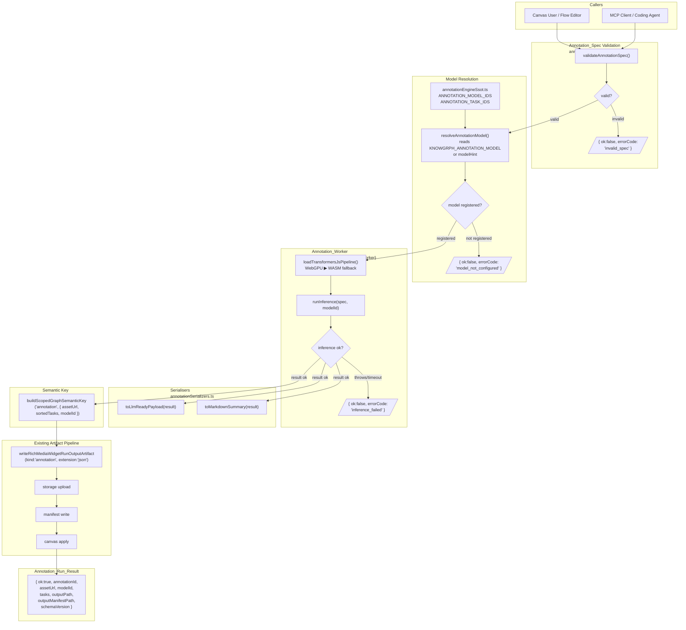
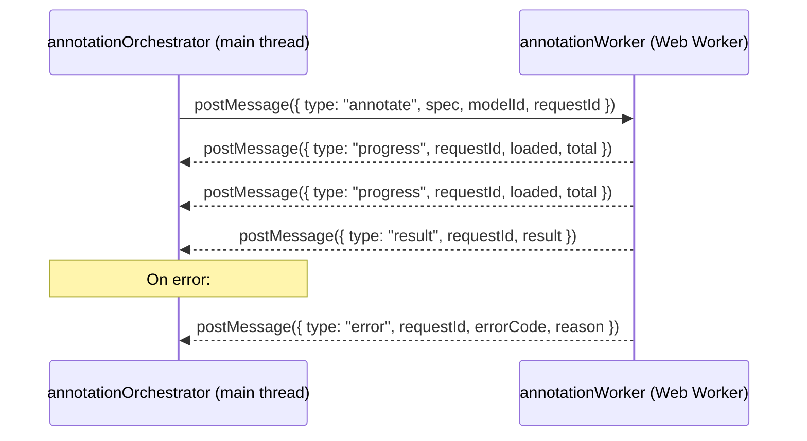
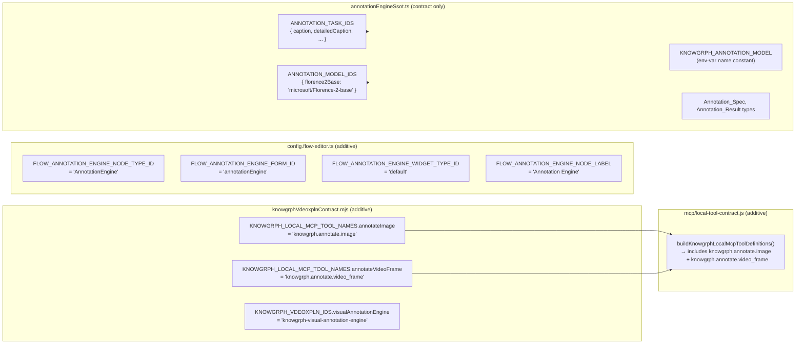
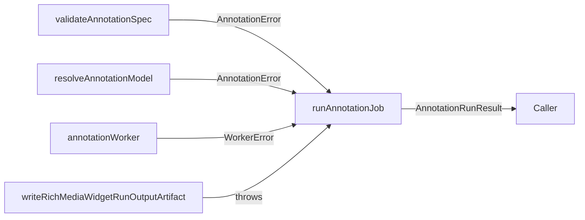

# Design Document

## Overview

`knowgrph-visual-annotation-engine` embeds in-browser image annotation directly into the
knowgrph canvas. Users supply an image URL (or select an existing canvas node); the engine
dispatches inference to a browser Web Worker running Transformers.js with
`microsoft/Florence-2-base` (or any runtime-configured model from `ANNOTATION_MODEL_IDS`),
produces a structured `Annotation_Result` (semantic labels, bounding boxes, captions, dense
captions, OCR), serialises it as LLM-ready JSON via `toLlmReadyPayload`, and materialises it
as a canvas graph node through the existing `writeRichMediaWidgetRunOutputArtifact` pipeline.

**Design principles:**
- Zero-TCO inference — Transformers.js WASM/WebGPU, model weights cached in browser IndexedDB
- Fail-fast structured errors — every failure path returns `{ ok: false, errorCode, ... }`
- SSOT isolation — `annotationEngineSsot.ts` owns all type contracts, task IDs, model IDs; no
  ML-library imports leak out of it
- Reuse over rebuild — `writeRichMediaWidgetRunOutputArtifact`, `buildScopedGraphSemanticKey`,
  `buildKnowgrphLocalMcpToolDefinitions`, and Flow Editor node patterns all reused unchanged
- LLM-ready output first — `toLlmReadyPayload` and `toMarkdownSummary` are the primary
  consumer-facing deliverables; canvas rendering is secondary
- FOSS-first — Transformers.js (Apache 2.0) + Florence-2-base (MIT); zero paid API dependency

**Hackathon MVP scope (180 min):** image annotation (`assetType: "image"`) is the deliverable.
Video frame extraction (requirement 11) is fully specified and structurally wired but deferred
to a post-hackathon phase; the orchestrator routes `assetType: "video_frame"` through the same
worker and artifact path with a `frame_extraction_failed / not_implemented` error stub.

**Research notes:**
- Transformers.js v3 ships a `pipeline("image-to-text", ...)` and `pipeline("object-detection", ...)`
  API; Florence-2 tasks are dispatched via the `<TASK_TOKEN>` prompt convention documented at
  [HuggingFace Florence-2](https://huggingface.co/microsoft/Florence-2-base).
- WebGPU backend selection in Transformers.js v3 is controlled via `{ device: "webgpu" }` in the
  pipeline constructor; falls through to WASM when `navigator.gpu` is unavailable.
- Model weights are cached automatically by Transformers.js in the browser Cache API / IndexedDB;
  the `progress_callback` parameter exposes download progress events.
- Worker communication uses `postMessage` with structured-clone transferables; `ImageBitmap` is
  the correct transferable for passing decoded image data to the worker.


---

## Architecture

### Component Map

| Module | Role | Layer |
|--------|------|-------|
| `annotationEngineSsot.ts` | Pure contract: types, `ANNOTATION_TASK_IDS`, `ANNOTATION_MODEL_IDS`, env-var constant | Contract |
| `annotationWorker.ts` | Web Worker: loads Transformers.js pipeline, runs inference off main thread | Worker |
| `annotationOrchestrator.ts` | Main-thread orchestrator: validates spec, manages worker lifecycle, builds annotationId, calls artifact pipeline | Orchestration |
| `annotationSerializers.ts` | Pure functions: `toLlmReadyPayload`, `toMarkdownSummary` | Serialisation |
| `annotationFlowNode.ts` | Flow Editor node run handler | Surface |
| `annotationMcpTools.ts` | MCP tool handlers for `knowgrph.annotate.image` and `knowgrph.annotate.video_frame` | Surface |
| `canvas/src/lib/config.flow-editor.ts` | Adds `FLOW_ANNOTATION_ENGINE_*` constants (additive) | Config |
| `canvas/src/features/chat/richMediaRun.ts` | `writeRichMediaWidgetRunOutputArtifact` (existing, no changes) | Shared |
| `canvas/src/lib/graph/semanticKey.ts` | `buildScopedGraphSemanticKey` (existing, no changes) | Shared |
| `mcp/local-tool-contract.js` | Registers both annotation tools (additive) | MCP |
| `canvas/src/features/agent-ready/knowgrphVdeoxplnContract.mjs` | Adds annotation tool names + vdeoxpln entry (additive) | Registry |

### Data Flow Diagram



### Worker Communication Protocol



### Registration Flow (additive changes)



---

## Components and Interfaces

### `annotationEngineSsot.ts` — Pure Contract

```typescript
// canvas/src/features/visual-annotation-engine/annotationEngineSsot.ts
// Pure contract module. Zero imports from Transformers.js, worker, or adapter modules.

/** Env-var name for runtime model selection. */
export const KNOWGRPH_ANNOTATION_MODEL = 'KNOWGRPH_ANNOTATION_MODEL' as const

/** Env-var name for backend override: "webgpu" | "wasm". */
export const KNOWGRPH_ANNOTATION_BACKEND = 'KNOWGRPH_ANNOTATION_BACKEND' as const

/** Env-var name for cache storage key prefix. */
export const KNOWGRPH_ANNOTATION_CACHE_PREFIX = 'KNOWGRPH_ANNOTATION_CACHE_PREFIX' as const

/** Canonical annotation task identifiers. Frozen; add new tasks here only. */
export const ANNOTATION_TASK_IDS = Object.freeze({
  caption:            'caption',
  detailedCaption:    'detailed_caption',
  moreDetailedCaption:'more_detailed_caption',
  objectDetection:    'object_detection',
  denseRegionCaption: 'dense_region_caption',
  ocr:                'ocr',
} as const)

export type AnnotationTaskId = typeof ANNOTATION_TASK_IDS[keyof typeof ANNOTATION_TASK_IDS]

/** Canonical model identifiers. Frozen; add new models here only. */
export const ANNOTATION_MODEL_IDS = Object.freeze({
  florence2Base: 'microsoft/Florence-2-base',
} as const)

export type AnnotationModelId = typeof ANNOTATION_MODEL_IDS[keyof typeof ANNOTATION_MODEL_IDS]

/** Task output shapes — vary by task type. */
export type AnnotationTaskOutput =
  | { text: string }                                                    // caption tasks
  | { objects: Array<{ label: string; bbox: [number, number, number, number]; confidence?: number }> }
  | { regions: Array<{ label: string; bbox: [number, number, number, number] }> }
  | { text: string; blocks?: Array<{ text: string; bbox: [number, number, number, number] }> }
  | { error: string }                                                   // per-task failure

/** Self-contained, serialisable annotation job descriptor. */
export type AnnotationSpec = {
  assetUrl:         string          // non-empty, max 2048 chars
  assetType:        'image' | 'video_frame'
  tasks:            AnnotationTaskId[]   // non-empty, max 6 entries
  modelHint?:       string          // max 255 chars; overrides KNOWGRPH_ANNOTATION_MODEL
  frameTimestampMs?: number         // integer ≥ 0; required when assetType === 'video_frame'
}

/** Structured output produced for a single AnnotationSpec. */
export type AnnotationResult = {
  ok:            true
  annotationId:  string             // semantic key
  assetUrl:      string
  assetType:     'image' | 'video_frame'
  modelId:       string
  tasks:         Record<AnnotationTaskId, AnnotationTaskOutput>
  processedAt:   string             // ISO-8601
  durationMs:    number             // positive integer
  schemaVersion: 'knowgrph-annotation/v1'
  frameTimestampMs?: number         // present when assetType === 'video_frame'
}

export type AnnotationError = {
  ok:        false
  errorCode: 'invalid_spec' | 'model_not_configured' | 'inference_failed' |
             'artifact_write_failed' | 'frame_extraction_failed' | 'worker_not_supported'
  modelId?:  string
  field?:    string
  reason?:   string
}

export type AnnotationRunResult = AnnotationResult | AnnotationError

/** Worker request envelope (postMessage to worker). */
export type WorkerRequest = {
  type:      'annotate'
  requestId: string
  spec:      AnnotationSpec
  modelId:   string
}

/** Worker response envelopes (postMessage from worker). */
export type WorkerResponse =
  | { type: 'progress'; requestId: string; loaded: number; total: number }
  | { type: 'result';   requestId: string; result: Omit<AnnotationResult, 'annotationId' | 'ok'> }
  | { type: 'error';    requestId: string; errorCode: AnnotationError['errorCode']; reason: string }
```

### `annotationWorker.ts` — Web Worker

```typescript
// canvas/src/features/visual-annotation-engine/annotationWorker.ts
// Runs inside a browser Web Worker. Never imported by non-worker code at runtime.
// Only dependency on ML: @huggingface/transformers (Transformers.js v3).

import type { WorkerRequest, WorkerResponse } from './annotationEngineSsot'

// Worker state — one pipeline instance reused per session.
let currentModelId: string | null = null
let pipeline: unknown = null

self.onmessage = async (event: MessageEvent<WorkerRequest>) => {
  const { requestId, spec, modelId } = event.data
  // Load or reuse pipeline for modelId
  // Select device: read env-var hint or probe navigator.gpu
  // For each task in spec.tasks:
  //   build Florence-2 task prompt (e.g. "<OD>", "<CAPTION>", etc.)
  //   run pipeline(prompt, imageBitmap or imageUrl)
  //   shape output into AnnotationTaskOutput
  // Post { type: "result", requestId, result }
  // On any error: post { type: "error", requestId, errorCode, reason }
}

/** Convert raw Florence-2 task name to its prompt token. */
export function buildFlorenceTaskPrompt(taskId: string): string

/** Shape raw Florence-2 pipeline output into typed AnnotationTaskOutput. */
export function shapeTaskOutput(
  taskId: string,
  raw: unknown,
): import('./annotationEngineSsot').AnnotationTaskOutput
```

**Design decisions:**
- Worker is instantiated lazily on first annotation request; a single instance is reused per
  browser session to amortise model load time.
- The worker receives `assetUrl` as a string for image tasks; it fetches and decodes internally
  (or uses `createImageBitmap` on a pre-fetched blob passed as a transferable for video frames).
- A `INFERENCE_TIMEOUT_MS = 120_000` guard wraps the pipeline call via `Promise.race`.
- Progress events from Transformers.js `progress_callback` are forwarded as `{ type: "progress" }`
  messages to the orchestrator.
- Backend selection: read `KNOWGRPH_ANNOTATION_BACKEND` env hint first; else probe
  `navigator.gpu?.requestAdapter()` — if non-null, use `"webgpu"`; else `"wasm"`.

### `annotationOrchestrator.ts` — Main-Thread Orchestrator

```typescript
// canvas/src/features/visual-annotation-engine/annotationOrchestrator.ts

import type { WorkspaceFs } from '@/features/workspace-fs/types'
import type { GraphNode } from '@/lib/graph/types'
import { buildScopedGraphSemanticKey } from '@/lib/graph/semanticKey'
import { writeRichMediaWidgetRunOutputArtifact } from '@/features/chat/richMediaRun'
import type { AnnotationRunResult, AnnotationSpec } from './annotationEngineSsot'
import { ANNOTATION_MODEL_IDS, KNOWGRPH_ANNOTATION_MODEL } from './annotationEngineSsot'

/** Validates an unknown candidate against the AnnotationSpec schema. Pure function. */
export function validateAnnotationSpec(candidate: unknown): AnnotationSpecValidationResult

/**
 * Resolves the active model identifier.
 * Priority: non-whitespace modelHint > KNOWGRPH_ANNOTATION_MODEL env var > florence2Base default.
 * Returns { ok: false, errorCode: "model_not_configured" } only when modelHint is provided
 * but not registered. Env-var absence falls back to florence2Base.
 */
export function resolveAnnotationModel(
  modelHint: string | undefined,
): AnnotationModelResolveResult

/**
 * Builds the deterministic annotationId.
 * Sorts tasks lexicographically before key computation to ensure order-independence.
 */
export function buildAnnotationId(
  assetUrl: string,
  tasks: readonly string[],
  modelId: string,
): string {
  const sortedTasks = [...tasks].sort((a, b) => a.localeCompare(b))
  return buildScopedGraphSemanticKey('annotation', {
    graphSemanticKey: JSON.stringify({ assetUrl, tasks: sortedTasks, modelId }),
  })
}

/**
 * Full annotation pipeline:
 *   validateAnnotationSpec → resolveAnnotationModel → dispatch to worker →
 *   buildAnnotationId → writeRichMediaWidgetRunOutputArtifact → AnnotationRunResult
 *
 * Calls writeRichMediaWidgetRunOutputArtifact exactly once per run with kind:"annotation".
 * Never throws to caller; all failures return { ok: false, errorCode, ... }.
 */
export async function runAnnotationJob(args: {
  spec: unknown
  node: GraphNode
  worker: AnnotationWorkerHandle
  workspacePath?: string | null
  fs?: WorkspaceFs | null
  onProgress?: (loaded: number, total: number) => void
}): Promise<AnnotationRunResult>

/** Lazy worker handle: creates the Web Worker on first use, reuses across calls. */
export type AnnotationWorkerHandle = {
  dispatch(request: WorkerRequest): Promise<WorkerResult>
}
export function createAnnotationWorkerHandle(): AnnotationWorkerHandle
```

### `annotationSerializers.ts` — Pure Serialisers

```typescript
// canvas/src/features/visual-annotation-engine/annotationSerializers.ts

import type { AnnotationResult } from './annotationEngineSsot'

export type LlmReadyPayload = {
  assetUrl:      string
  modelId:       string
  schemaVersion: string
  tasks:         Record<string, unknown>
}

/**
 * Extracts the LLM-ready subset from an ok:true AnnotationResult.
 * Fields excluded: ok, annotationId, processedAt, durationMs, assetType.
 * Throws TypeError("toLlmReadyPayload requires ok:true result") if result.ok === false.
 * Pure, deterministic, idempotent.
 */
export function toLlmReadyPayload(result: AnnotationResult): LlmReadyPayload

/**
 * Produces a human-readable markdown summary of an annotation result.
 * - ok:true with caption task → starts with "## Caption" section
 * - ok:true with object_detection and objects present → includes "## Detected Objects" section
 * - Per-task error entries → includes task name with "(failed)" indicator
 * - No caption/detection data → non-empty fallback string
 * Pure, deterministic.
 */
export function toMarkdownSummary(result: AnnotationResult): string
```

### `annotationFlowNode.ts` — Flow Editor Node Handler

```typescript
// canvas/src/features/visual-annotation-engine/annotationFlowNode.ts

import type { GraphNode } from '@/lib/graph/types'
import type { WorkspaceFs } from '@/features/workspace-fs/types'
import type { AnnotationRunResult } from './annotationEngineSsot'
import { runAnnotationJob } from './annotationOrchestrator'
import { createAnnotationWorkerHandle } from './annotationOrchestrator'

/**
 * Flow Editor node run handler for AnnotationEngine nodes.
 * Reads node properties via readNodeProperty:
 *   asset_url (string), asset_type (string), tasks (comma-separated string | JSON array string),
 *   model_hint (string), frame_timestamp_ms (integer ≥ 0).
 * All properties optional in node schema; validated by validateAnnotationSpec at runtime.
 */
export async function runAnnotationFlowNode(args: {
  node: GraphNode
  worker: ReturnType<typeof createAnnotationWorkerHandle>
  workspacePath?: string | null
  fs?: WorkspaceFs | null
}): Promise<AnnotationRunResult>
```

### `annotationMcpTools.ts` — MCP Tool Handlers

```typescript
// canvas/src/features/visual-annotation-engine/annotationMcpTools.ts

import type { AnnotationRunResult } from './annotationEngineSsot'
import { runAnnotationJob } from './annotationOrchestrator'
import { createAnnotationWorkerHandle } from './annotationOrchestrator'

/** Handler for knowgrph.annotate.image MCP tool invocation. */
export async function handleAnnotateImageTool(input: {
  asset_url: string
  tasks: string[]
  model_hint?: string
}): Promise<McpAnnotationOutput>

/** Handler for knowgrph.annotate.video_frame MCP tool invocation. */
export async function handleAnnotateVideoFrameTool(input: {
  asset_url: string
  tasks: string[]
  frame_timestamp_ms: number
  model_hint?: string
}): Promise<McpAnnotationOutput>

export type McpAnnotationOutput = {
  ok:             boolean
  annotation_id:  string
  asset_url:      string
  model_id:       string
  schema_version: string
  tasks:          Record<string, unknown>
  error?: { code: string; message: string }
}
```

### Flow Editor Node Registration (additive changes to existing files)

**`canvas/src/lib/config.flow-editor.ts`** — new constants alongside existing node type constants:

```typescript
// Additive — no existing constants modified
export const FLOW_ANNOTATION_ENGINE_NODE_TYPE_ID = 'AnnotationEngine' as const
export const FLOW_ANNOTATION_ENGINE_NODE_LABEL    = 'Annotation Engine' as const
export const FLOW_ANNOTATION_ENGINE_WIDGET_TYPE_ID = 'default' as const
export const FLOW_ANNOTATION_ENGINE_FORM_ID        = 'annotationEngine' as const
```

**`canvas/src/features/chat/richMediaRun.ts`** — `resolveRichMediaWidgetKind` updated (additive case):

```typescript
// Additive case — no structural change to the function
import { FLOW_ANNOTATION_ENGINE_NODE_TYPE_ID } from '@/lib/config.flow-editor'
// Inside resolveRichMediaWidgetKind:
if (typeId === FLOW_ANNOTATION_ENGINE_NODE_TYPE_ID) return 'annotation'
```

### MCP Tool Registration (additive changes to existing files)

**`canvas/src/features/agent-ready/knowgrphVdeoxplnContract.mjs`** — additive entries:

```javascript
// 1. Add to KNOWGRPH_LOCAL_MCP_TOOL_NAMES (additive):
annotateImage:      "knowgrph.annotate.image",
annotateVideoFrame: "knowgrph.annotate.video_frame",

// 2. Add to KNOWGRPH_VDEOXPLN_IDS (additive):
visualAnnotationEngine: "knowgrph-visual-annotation-engine",
```

**`mcp/local-tool-contract.js`** — schema constants and tool entries (additive):

```javascript
const ANNOTATE_IMAGE_INPUT_SCHEMA = Object.freeze({
  type: "object",
  additionalProperties: false,
  required: ["asset_url", "tasks"],
  properties: {
    asset_url:   { type: "string", minLength: 1, maxLength: 2048 },
    tasks:       { type: "array", items: { type: "string" }, minItems: 1, maxItems: 6 },
    model_hint:  { type: "string", maxLength: 255 },
  },
})

const ANNOTATE_VIDEO_FRAME_INPUT_SCHEMA = Object.freeze({
  type: "object",
  additionalProperties: false,
  required: ["asset_url", "tasks", "frame_timestamp_ms"],
  properties: {
    asset_url:          { type: "string", minLength: 1, maxLength: 2048 },
    tasks:              { type: "array", items: { type: "string" }, minItems: 1, maxItems: 6 },
    frame_timestamp_ms: { type: "integer", minimum: 0 },
    model_hint:         { type: "string", maxLength: 255 },
  },
})

const ANNOTATE_OUTPUT_SCHEMA = Object.freeze({
  type: "object",
  additionalProperties: false,
  required: ["ok", "annotation_id", "asset_url", "model_id", "schema_version", "tasks"],
  properties: {
    ok:             { type: "boolean" },
    annotation_id:  { type: "string" },
    asset_url:      { type: "string" },
    model_id:       { type: "string" },
    schema_version: { type: "string" },
    tasks:          { type: "object" },
    error: {
      type: "object",
      required: ["code", "message"],
      properties: { code: { type: "string" }, message: { type: "string" } },
    },
  },
})
```

---

## Data Models

### Annotation_Spec

```typescript
type AnnotationSpec = {
  // Required
  assetUrl:  string           // non-empty, max 2048 chars
  assetType: 'image' | 'video_frame'
  tasks:     AnnotationTaskId[] // non-empty, max 6; each must be a value in ANNOTATION_TASK_IDS
  // Optional
  modelHint?:        string   // max 255 chars; overrides KNOWGRPH_ANNOTATION_MODEL when non-whitespace
  frameTimestampMs?: number   // integer ≥ 0; required when assetType === 'video_frame'
}
```

### Annotation_Result

```typescript
type AnnotationResult = {
  ok:            true
  annotationId:  string       // buildScopedGraphSemanticKey('annotation', { assetUrl, sortedTasks, modelId })
  assetUrl:      string       // equals spec.assetUrl
  assetType:     'image' | 'video_frame'
  modelId:       string       // resolved model identifier
  tasks:         Record<AnnotationTaskId, AnnotationTaskOutput>
  processedAt:   string       // ISO-8601 UTC
  durationMs:    number       // positive integer (wall-clock inference time)
  schemaVersion: 'knowgrph-annotation/v1'
  frameTimestampMs?: number   // present when assetType === 'video_frame'
}
```

### LLM_Ready_Payload

```typescript
type LlmReadyPayload = {
  assetUrl:      string                       // from Annotation_Result
  modelId:       string
  schemaVersion: string
  tasks:         Record<string, unknown>      // task outputs only; no operational metadata
  // Excluded: ok, annotationId, processedAt, durationMs, assetType
}
```

### Annotation_Error

```typescript
type AnnotationError = {
  ok:        false
  errorCode: 'invalid_spec' | 'model_not_configured' | 'inference_failed' |
             'artifact_write_failed' | 'frame_extraction_failed' | 'worker_not_supported'
  modelId?:  string
  field?:    string     // present for invalid_spec
  reason?:   string
}
```

### Annotation_Task_Output Shapes (per task)

| Task | Output shape |
|------|-------------|
| `caption`, `detailed_caption`, `more_detailed_caption` | `{ text: string }` |
| `object_detection` | `{ objects: Array<{ label: string, bbox: [x,y,w,h], confidence?: number }> }` |
| `dense_region_caption` | `{ regions: Array<{ label: string, bbox: [x,y,w,h] }> }` |
| `ocr` | `{ text: string, blocks?: Array<{ text: string, bbox: [x,y,w,h] }> }` |
| (failed) | `{ error: string }` |

### Annotation_ID Construction

```typescript
// annotationId derivation (pseudocode):
function buildAnnotationId(assetUrl: string, tasks: readonly string[], modelId: string): string {
  const sortedTasks = [...tasks].sort((a, b) => a.localeCompare(b))
  return buildScopedGraphSemanticKey('annotation', {
    graphSemanticKey: JSON.stringify({ assetUrl, tasks: sortedTasks, modelId }),
  })
}
// Guarantees: same assetUrl + same tasks (any order) + same modelId → same annotationId
// Guarantees: differing any input → different annotationId
```

### Vdeoxpln Entry Shape

```javascript
{
  id: KNOWGRPH_VDEOXPLN_IDS.visualAnnotationEngine,  // "knowgrph-visual-annotation-engine"
  title: "Knowgrph Visual Annotation Engine",
  purpose: "Run in-browser ML image/video-frame annotation via Transformers.js + Florence-2-base, " +
           "producing LLM-ready structured JSON materialised as canvas graph nodes.",
  scope: "browser-local",
  mutation: "local-approval-gated",
  triggers: [
    "annotate image", "annotate video", "visual annotation", "object detection",
    "image caption", "florence2", "semantic labels", "llm-ready annotation",
  ],
  inputs: ["image url", "video asset url", "annotation tasks", "model hint"],
  outputs: ["annotation result json", "llm-ready payload", "annotation canvas node", "markdown summary"],
  owners: [
    "canvas/src/features/visual-annotation-engine/annotationEngineSsot.ts",
    "canvas/src/features/visual-annotation-engine/annotationWorker.ts",
    "canvas/src/features/visual-annotation-engine/annotationOrchestrator.ts",
    "canvas/src/features/visual-annotation-engine/annotationSerializers.ts",
    "canvas/src/features/visual-annotation-engine/annotationFlowNode.ts",
    "canvas/src/features/visual-annotation-engine/annotationMcpTools.ts",
    "canvas/src/features/chat/richMediaRun.ts",
    "canvas/src/lib/graph/semanticKey.ts",
    "canvas/src/lib/config.flow-editor.ts",
    "mcp/local-tool-contract.js",
    "canvas/src/features/agent-ready/knowgrphVdeoxplnContract.mjs",
  ],
  tools: {
    published: [],
    browserLocal: [],
    local: [
      KNOWGRPH_LOCAL_MCP_TOOL_NAMES.annotateImage,
      KNOWGRPH_LOCAL_MCP_TOOL_NAMES.annotateVideoFrame,
      KNOWGRPH_LOCAL_MCP_TOOL_NAMES.vdeoxplnList,
    ],
  },
  workflow: [
    "Validate the Annotation_Spec before any model resolution or inference.",
    "Resolve model identifier from modelHint, KNOWGRPH_ANNOTATION_MODEL, or florence2Base default.",
    "Dispatch inference to the Annotation_Worker via postMessage.",
    "Build annotationId with buildScopedGraphSemanticKey('annotation', ...) using sorted tasks.",
    "Route result through writeRichMediaWidgetRunOutputArtifact exactly once.",
    "Return annotationId, assetUrl, modelId, tasks, outputPath, outputManifestPath.",
  ],
  aiPolicy: { mode: "none", maxAttempts: 0, tokenBudget: 0,
    fallback: "Return structured error without model call." },
  artifactPolicy: {
    persistence: "browser-local",
    graphMaterialization: "annotation-canvas-node",
    semanticKeyInputs: ["annotationId", "assetUrl", "modelId", "sortedTasks"],
  },
  validation: ["vdeoxpln:check", "mcpLocalToolContract"],
  publish: ["local-mcp-docs", "mainpanel-mcp"],
}
```

---

## Correctness Properties

*A property is a characteristic or behavior that should hold true across all valid executions of a system — essentially, a formal statement about what the system should do. Properties serve as the bridge between human-readable specifications and machine-verifiable correctness guarantees.*

**Property reflection summary:** After prework analysis across all 13 requirements, 7 non-redundant
properties remain. Requirements 1.1, 1.2(edge), 1.6 merged into P1. Requirements 1.5, 3.4, 3.7,
3.8, 13.3 merged into P2. Requirements 3.9, 9.1, 9.2, 9.3, 9.4, 13.2 merged into P3. Requirements
4.1, 4.2, 4.3, 4.4, 4.5, 4.8, 13.1 merged into P4. Requirements 4.7 and 13.5 merged into P5.
Requirements 5.1 and 5.5 merged into P6. Requirements 3.5 and 13.4 merged into P7.

---

### Property 1: Spec validator accepts valid inputs and rejects invalid inputs

*For any* candidate object, `validateAnnotationSpec` SHALL return `{ ok: true }` if and only if
all required fields (`assetUrl`, `assetType`, `tasks`) are present and within their specified
constraints, every entry in `tasks` is a value in `ANNOTATION_TASK_IDS`, and — when
`assetType` is `"video_frame"` — `frameTimestampMs` is present and ≥ 0. For any candidate
where at least one required field is absent, out of range, contains an unrecognised task string,
or has `assetType: "video_frame"` with absent/negative `frameTimestampMs`, `validateAnnotationSpec`
SHALL return `{ ok: false, errorCode: "invalid_spec", field, reason }` without invoking the
Annotation_Worker.

**Validates: Requirements 1.1, 1.2, 1.6**

---

### Property 2: Annotation_Result fields preserved and structurally complete

*For any* valid `AnnotationSpec` processed by a mock Annotation_Worker that returns deterministic
task outputs, the resulting `AnnotationResult` SHALL satisfy:
- `result.assetUrl === spec.assetUrl`
- `result.assetType === spec.assetType`
- `Object.keys(result.tasks)` contains every string in `spec.tasks`
- Caption tasks produce `{ text: string }` where `text` is a non-empty string
- Object detection tasks produce `{ objects: Array<...> }` where each object has `label` (non-empty
  string) and `bbox` ([number, number, number, number] with all values ≥ 0)
- `result.schemaVersion === "knowgrph-annotation/v1"`
- `result.durationMs > 0`
- `result.processedAt` is a valid ISO-8601 timestamp string

**Validates: Requirements 1.5, 3.4, 3.7, 3.8, 13.3**

---

### Property 3: Annotation ID semantic key determinism and collision-resistance

*For any* `assetUrl`, `tasks` array (in any order), and `modelId`, calling `buildAnnotationId`
SHALL return the same non-empty string on every invocation (idempotence). Furthermore, for any
two inputs that differ in `assetUrl`, in the sorted `tasks` array (compared element-by-element),
or in `modelId`, the produced `annotationId` values SHALL be distinct (collision-resistance).
Task order SHALL NOT affect the output — `["caption", "object_detection"]` and
`["object_detection", "caption"]` SHALL produce the same `annotationId`.

**Validates: Requirements 3.9, 9.1, 9.2, 9.3, 9.4, 13.2**

---

### Property 4: LLM payload shape, field exclusions, bbox type preservation, and JSON round-trip

*For any* valid `AnnotationResult` `r` (where `r.ok === true`):
1. `toLlmReadyPayload(r)` SHALL return an object containing `assetUrl`, `modelId`, `schemaVersion`,
   and `tasks` — and SHALL NOT contain `ok`, `annotationId`, `processedAt`, `durationMs`,
   or `assetType`.
2. `JSON.parse(JSON.stringify(toLlmReadyPayload(r)))` SHALL produce an object whose
   `JSON.stringify` output equals that of `toLlmReadyPayload(r)` (JSON round-trip).
3. Where `r.tasks` contains entries with `bbox` arrays, those arrays SHALL be preserved as
   `Array<number>` in the payload — not stringified.
4. Calling `toLlmReadyPayload` with an `AnnotationResult` where `ok: false` SHALL throw a
   `TypeError` with message `"toLlmReadyPayload requires ok:true result"`.

**Validates: Requirements 4.1, 4.2, 4.3, 4.4, 4.5, 4.8, 13.1**

---

### Property 5: toLlmReadyPayload idempotence

*For any* valid `AnnotationResult` `r`, calling `toLlmReadyPayload(r)` twice SHALL produce
outputs where `JSON.stringify(call1) === JSON.stringify(call2)` — the function is pure and
referentially transparent.

**Validates: Requirements 4.7, 13.5**

---

### Property 6: Artifact pipeline called exactly once; structured error returned on failure

*For any* valid `AnnotationSpec` processed through a mock Annotation_Worker and a mock
`writeRichMediaWidgetRunOutputArtifact`, the mock SHALL be invoked exactly once per
`runAnnotationJob` call with `kind: "annotation"`. When the mock throws an exception or
returns `{ outputPath: null }`, `runAnnotationJob` SHALL return `{ ok: false, errorCode:
"artifact_write_failed", reason }` or a degraded-success `{ outputPath: null }` respectively,
without propagating an uncaught exception.

**Validates: Requirements 5.1, 5.5**

---

### Property 7: Inference failure returns structured error, never throws

*For any* valid `AnnotationSpec` dispatched to a mock Annotation_Worker that posts an
`{ type: "error", errorCode, reason }` response (or rejects the request promise), `runAnnotationJob`
SHALL return `{ ok: false, errorCode: "inference_failed", modelId, reason }` and SHALL NOT
throw an unhandled exception to its caller.

**Validates: Requirements 3.5, 13.4**

---

## Error Handling

All error paths return structured `{ ok: false }` objects — no unhandled exceptions propagate
to callers. The error taxonomy and short-circuit rules are:

| errorCode | Trigger | Short-circuits at |
|-----------|---------|-------------------|
| `invalid_spec` | `validateAnnotationSpec` returns `ok: false` | Before model resolution |
| `model_not_configured` | Explicit `modelHint` not in `ANNOTATION_MODEL_IDS` | Before worker dispatch |
| `worker_not_supported` | `typeof Worker === "undefined"` in current context | Before worker creation |
| `inference_failed` | Worker posts `{ type: "error" }` or inference timeout ≥ 120 s | Before artifact pipeline |
| `frame_extraction_failed` | Video seek timeout, timestamp exceeds duration, CORS, unsupported codec | Before worker dispatch |
| `artifact_write_failed` | `writeRichMediaWidgetRunOutputArtifact` throws | After successful inference |

### Model resolution priority

1. Non-whitespace `modelHint` in spec — highest priority; returns `model_not_configured` if not
   in `ANNOTATION_MODEL_IDS`.
2. `KNOWGRPH_ANNOTATION_MODEL` environment variable read at invocation time — fallback.
3. `ANNOTATION_MODEL_IDS.florence2Base` — default when env is absent/empty; no error returned;
   resolved `modelId` is included in the result so callers can observe the fallback.

No hardcoded model URL appears in orchestrator or worker dispatch logic.

### Partial task success

When some tasks succeed and some fail individually (worker returns `{ error: string }` for a
task), the orchestrator returns `ok: true` with the mixed `tasks` map. `ok: false` is only
returned when inference cannot produce any output at all.

### Degraded-success path

When `writeRichMediaWidgetRunOutputArtifact` returns `{ outputPath: null }` (path picker
cancelled, workspace path unavailable), `runAnnotationJob` returns:
```
{ ok: true, annotationId, tasks, ..., outputPath: null, outputManifestPath: null }
```
This is a degraded-success: inference completed, artifact not persisted. No retry.

### Error propagation boundary

`annotationOrchestrator.ts` is the outer error boundary. All errors from `validateAnnotationSpec`,
`resolveAnnotationModel`, the worker, and the artifact pipeline are caught and re-wrapped into
`AnnotationError` before reaching callers (Flow node, MCP tool).



---

## Testing Strategy

### PBT Applicability Assessment

This feature contains significant pure-function logic — a spec validator, a model resolver, a
semantic key builder, an annotation ID builder, `toLlmReadyPayload`, and `toMarkdownSummary` —
all of which are pure functions with large input spaces where 100+ iterations will find more bugs
than 2–3 fixed examples. Property-based testing applies directly to these functions.

Integration tests cover the Web Worker lifecycle, model weight caching (IndexedDB/Cache API),
backend selection (WebGPU vs WASM), request queuing, and canvas node materialisation.

Smoke tests cover SSOT module structure, Flow Editor constant registration, MCP tool wiring,
and vdeoxpln registry validation.

### Property-Based Testing (Vitest + fast-check)

Library: **fast-check** (MIT). Each property test runs ≥ 100 iterations.
Tag format: `// Feature: knowgrph-visual-annotation-engine, Property N: <property_text>`

| Property | fast-check arbitraries |
|----------|----------------------|
| P1: Spec validator | `fc.record` with all field combinations; `fc.constantFrom` for assetType; `fc.array` of task strings including invalid ones |
| P2: Result fields preserved | `fc.record` of valid AnnotationSpecs; mock worker returning deterministic outputs derived from spec |
| P3: Annotation ID determinism | `fc.string` for assetUrl; `fc.array(fc.constantFrom(...ANNOTATION_TASK_IDS values))`; permuted task arrays for order-independence |
| P4: LLM payload shape + round-trip | `fc.record` of valid AnnotationResults with bbox arrays; verify field exclusions + JSON round-trip |
| P5: toLlmReadyPayload idempotence | `fc.record` of valid AnnotationResults; call twice, compare `JSON.stringify` |
| P6: Artifact pipeline exactly-once | `fc.record` of valid AnnotationSpecs; mock artifact writer counting calls; mock throwing variant |
| P7: Inference failure → structured error | `fc.record` of valid AnnotationSpecs; mock worker that posts `{ type: "error" }` |

**Test harness rules (per requirement 13.6):**
- No Transformers.js calls, no model weight loading, no network requests in property tests
- Mock worker: each task output is deterministic — caption text is `"mock-caption:" + assetUrl.slice(0, 20)`,
  objects array contains `[{ label: "mock-" + taskId, bbox: [0, 0, 10, 10] }]`
- Mock `writeRichMediaWidgetRunOutputArtifact`: returns `{ outputPath: "/mock/path.json", outputManifestPath: "/mock/manifest.md" }`

### Example-Based Unit Tests

- Validation error field ordering (1.3): 3 specimens with 2+ invalid fields each
- Model fallback to florence2Base (2.4): unset env + no hint → verify modelId equals florence2Base value
- Partial task success (3.6): 3 tasks, 1 fails → verify ok:true, mixed tasks map
- `toMarkdownSummary` section structure (4.6): caption-only, detection-only, mixed, empty
- MCP error response shapes (6.5, 6.6, 6.8): each error code variant

### Integration Tests

| Scenario | Approach |
|----------|----------|
| WebGPU vs WASM backend selection | Mock `navigator.gpu`; verify Transformers.js called with correct `device` |
| Model weights cached (no network) | Seed mock Cache API; verify no fetch called |
| Model weights downloaded + cached | Mock fetch; verify progress messages emitted; verify weights written to cache |
| Request queuing (concurrent requests) | Submit 2 requests concurrently; verify both complete |
| `resolveRichMediaWidgetKind` returns "annotation" | Call with `FLOW_ANNOTATION_ENGINE_NODE_TYPE_ID`; verify "annotation" |

### Smoke Tests

- `annotationEngineSsot.ts`: zero ML imports; `Object.isFrozen(ANNOTATION_TASK_IDS)`;
  `Object.isFrozen(ANNOTATION_MODEL_IDS)`; `Object.keys(ANNOTATION_TASK_IDS)` has 6 entries
- `config.flow-editor.ts`: all 4 `FLOW_ANNOTATION_ENGINE_*` constants exported and non-empty;
  no collision with `FlowEditorSmartNodeProperties` keys
- `mcp/local-tool-contract.js`: `buildKnowgrphLocalMcpToolDefinitions()` result contains
  `knowgrph.annotate.image` and `knowgrph.annotate.video_frame`
- `knowgrphVdeoxplnContract.mjs`: `validateKnowgrphVdeoxplnRegistry()` returns `{ ok: true, errors: [] }`
- `annotationOrchestrator.ts`: does not directly import `sourceFilesBinaryStorage` or any
  manifest writer other than `writeRichMediaWidgetRunOutputArtifact`
