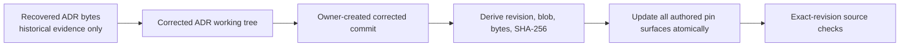
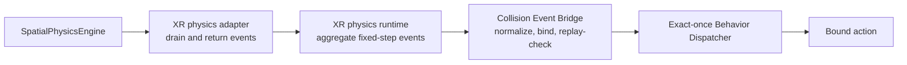

# XR v2 Runtime-Readiness Recovery Design

## Overview

This design performs four ordered jobs:

1. preserve the recovered ADR bytes as historical evidence;
2. correct the ADR against current repository owners;
3. leave every pin unchanged until the corrected ADR is committed; and
4. implement only AC-14 by routing existing collision transitions through the
   existing exact-once behavior dispatcher.

AC-13 forces/joints, AC-15 spatial audio, AC-16 portals, and AC-17 unified input
are follow-on designs. They are excluded from this implementation and from its
readiness evidence.

## Ownership topology

| Concern | Canonical owner | This increment |
|---|---|---|
| 3D physics state and events | `canvas/src/features/physics/` | Reuse unchanged |
| XR physics binding and stepping | `canvas/src/features/three/xrSpatialPhysicsAdapter.ts`, `xrPhysicsRuntime.ts` | Preserve drained events |
| Behavior graph and exact-once dispatch | `canvas/src/features/xr-v2/behaviorDispatcher.ts` | Add collision begin/end triggers |
| Collision-to-behavior routing | New focused module under `canvas/src/features/xr-v2/` | Implement AC-14 |
| XR command grammar | `canvas/src/features/three/xrSceneMcpContract.mjs`, `xrSceneMcpRuntime.ts` | Reuse `/xr.physics` |
| Agentic ECS | root `ecs/` | No schema or ownership change |
| Three/R3F renderer and camera | `canvas/src/lib/three/ThreeGraph.impl.tsx` | No change |
| Apple device sensors | `packages/apple-spatial-input` | No change; not a hand-ray source |

No new ECS, event bus, renderer, physics engine, invocation alias, dependency,
storage owner, or network path is introduced.

## Authority recovery and pin flow



The recovered `107090`-byte,
`8f0839fea7a30b9714ab7d8a46ffb1073fa54144257ee746977f96ae7969b12f`
artifact proves preservation only. The final corrected commit is the sole
future derivation source. If no such commit exists, the pin operation stops
without writing.

## AC-14 data flow



The physics engine remains the event source. The adapter currently calls
`drainEvents()` and discards the result; it will return those immutable values.
The runtime aggregates events in fixed-step order. The bridge consumes only
`collision-began` and `collision-ended`; sensor transitions remain available
to their separate proximity path.

## Event preservation interface

The existing step result gains a read-only event list:

```ts
type XrPhysicsStepResult = Readonly<{
  stepped: boolean
  contactCount: number
  elapsedSeconds: number
  stepCount: number
  events: readonly SpatialPhysicsEvent[]
}>
```

The public runtime step result carries the ordered aggregate across its bounded
substeps. Paused/stopped/no-step results return an empty list. Reset clears
pending physics events through the existing engine reset rather than retaining
stale transitions.

This is an additive typed result, not an alias or duplicate runtime path.

## Collision Event Bridge

The bridge owns only normalization, binding, replay admission, and dispatcher
translation:

```ts
type CollisionPairBinding = Readonly<{
  colliderIds: readonly [string, string]
  sourceEntityId: number
}>

type CollisionBridgeResult = Readonly<{
  eventId: string
  kind: 'collision-begin' | 'collision-end'
  status: BehaviorDispatchResult['status'] | 'unbound' | 'capacity-exhausted'
  invokedActionIds: readonly string[]
}>
```

The concrete API may batch events, but it must preserve these semantics:

1. Sort the two collider identifiers lexically.
2. Build the replay key from event kind, physics tick, and normalized pair.
3. Reject malformed ticks, identifiers, numeric entity bindings, or capacity
   configuration with a `TypeError` before dispatch.
4. Resolve the normalized pair to zero or one numeric `sourceEntityId`.
5. Return `unbound` without invoking the dispatcher when no binding exists.
6. Re-submit the admitted dispatcher revision when the replay key repeats; the
   canonical dispatcher returns `stale` and invokes zero actions.
7. Default the replay ledger to 4096 identities, permit only a smaller positive
   safe-integer limit, and fail closed with `capacity-exhausted` before
   accepting a new key when that ledger is full.
8. Record the accepted replay key before dispatch, preventing callback
   reentrancy from replaying it.
9. Translate native `collision-began` to `collision-begin` and
   `collision-ended` to `collision-end`.
10. Allocate `dispatcher.getRevision() + 1` and expose only a compact,
    safe-ID-compatible event identifier derived from the private replay key,
    never a raw internal collider path.
11. Call `dispatcher.dispatch` exactly once for the admitted transition.

Bindings are supplied by an explicit resolver. The bridge does not parse an
entity number from a subject/collider string and does not mutate root ECS.
N:N binding is deferred.

## Behavior dispatcher change

The closed `BehaviorTrigger` union and validation set gain:

- `collision-begin`
- `collision-end`

No other trigger is added. Existing select, hover, proximity, and timeline
semantics remain unchanged. The existing dispatcher continues to own monotonic
revision validation, reentrancy rejection, action de-duplication, bounded
action counts, callback isolation, and error reporting.

## Existing invocation grammar

The control surface remains:

```text
/xr.physics @canvas #world operation=play|pause|stop|reset|step|configure
/xr.physics @canvas #body operation=attach|configure|detach subject=<id>
/xr.physics @canvas #impulse operation=impulse subject=<id> vector=x,y,z
/xr.physics @canvas #controller operation=develop-run|pause|resume|reset|exit|select
```

`/xr.simulate`, `#physics-world`, and `@xr-physics-contract` are retired
documentation claims and must not be registered as aliases.

## Follow-on boundaries

### AC-13

The existing engine has linear state and impulses but no force accumulator,
orientation/angular velocity, or joint solver. A separate design must introduce
physically coherent state and constraints. A positional hinge projection is
rejected because it cannot enforce revolute behavior without angular state.

### AC-15

Spatial audio needs explicit user-gesture admission, one active listener tied
to the existing camera owner, source cleanup, suspend/resume behavior, offline
assets, and deterministic non-audio parameter tests before browser proof.

### AC-16

Portals must be implemented inside the sole Three/R3F renderer. The actual HTML
viewer runtime path is `canvas/src/lib/graph/htmlViewer/runtimeTemplate.ts`.
ADR-12 remains proposed; only pixel readback inside/outside the mask can satisfy
the acceptance criterion.

### AC-17

R3F pointer/touch adapters may be designed later. A hand-ray adapter requires a
real hand pose/ray source and target resolver. Optional WebXR
`hand-tracking` session policy and Apple device-sensor axes do not constitute
that adapter.

## Error handling

| Failure | Result |
|---|---|
| Malformed native event | `TypeError`; no dispatch |
| Sensor event presented to AC-14 bridge | no bridge result; retained for separate owner |
| Missing pair binding | `unbound`; zero actions |
| Repeated replay key | canonical dispatcher `stale`; zero actions |
| Ledger full | `capacity-exhausted`; fail closed |
| Dispatcher rejects revision/event | surface canonical dispatcher result; no retry |
| Action callback throws | preserve existing `dispatched-with-errors` behavior |

There is no silent fallback to another dispatcher, ECS, or physics engine.

## Focused verification

Unit coverage:

- adapter returns drained events in engine order;
- paused/no-step returns no events;
- collision begin/end mapping;
- lexical pair normalization;
- explicit numeric binding;
- unbound no-op;
- replay-to-`stale` exact-once rejection;
- bounded-capacity failure without eviction;
- safe event identifier;
- existing behavior triggers remain valid;
- sensor events are not collision triggers.

Integration coverage:

- existing XR physics unit/source checks;
- existing behavior-dispatch tests;
- AC-14 source-ready check at the candidate revision;
- browser smoke demonstrating one bound action and one unbound no-op.

Xcode, visionOS Simulator, Safari, and physical-device verification are separate
evidence activities. Missing evidence is reported as missing; it is not inferred
from documentation, unit tests, or desktop browser smoke.

## TCO and token economics

The correction and AC-14 adapter add no runtime dependency, hosted compute,
model call, token spend, storage class, or egress. Cost is bounded to local
development, focused tests, and later authorized device verification.

## Fixed decisions

- Replay capacity defaults to 4096 and may only be configured downward.
- Numeric pair bindings are explicit bridge-construction input; no string
  identity is promoted into root ECS.
- One bridge instance is one replay epoch. Starting a new epoch requires a new
  instance; no admitted identity is evicted from a live instance.
