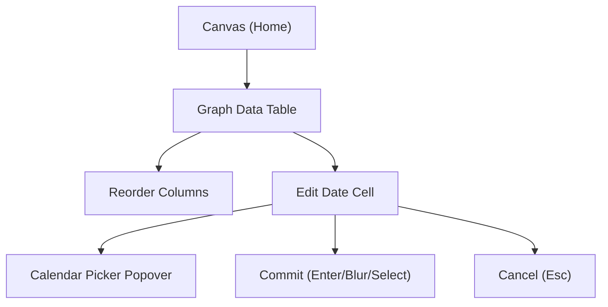

## 1. Product Overview
Add a first-class Date cell editing experience (matching Glide Data Grid DateEditor demos) to the existing Graph Data Table.
Preserve the current table UI (custom fast canvas grid), support column reordering, and prevent re-render/recompute loops across Document Structure Mode and all zoom levels.

## 2. Core Features

### 2.1 Feature Module
Our requirements consist of the following main pages:
1. **Graph Data Table**: nodes/edges dataset switch, fast grid, column reordering, date editor behavior, inspector, persistence, performance safeguards.

### 2.2 Page Details
| Page Name | Module Name | Feature description |
|-----------|-------------|---------------------|
| Graph Data Table | Dataset switcher | Switch between Nodes and Edges tables without losing per-table column order/width/visibility. |
| Graph Data Table | Column reordering | Drag a column header to reorder; show left/right drop hint; persist order per table; keep current header look and interactions. |
| Graph Data Table | Date cell rendering | Display date values consistently (same formatting rules) for columns with kind `date`; keep non-date columns unchanged. |
| Graph Data Table | DateEditor (Glide-like) | Edit date cells via keyboard-first input plus calendar picker popover. Support: type-to-edit, Enter commit, Esc cancel, clear date, invalid-date feedback, and consistent parsing/formatting. |
| Graph Data Table | Commit semantics | Commit exactly once per user action (Enter, blur, picker select) and avoid duplicate writes that can cause store/DB feedback loops. |
| Graph Data Table | Performance guardrails | Prevent re-render/recompute loops when editing (especially from persistence effects). Keep editor positioning stable with rAF/throttling where needed. |
| Graph Data Table | Mode + zoom alignment | Keep editor overlay aligned with the edited cell across: scroll, resize, devicePixelRatio changes, browser zoom, and workspace mode changes (including Document Structure Mode). |

## 3. Core Process
You open the Graph Data Table, optionally reorder columns, then click (or press Enter) on a date cell to edit. You can type a date, pick from a calendar, press Enter to commit, or press Escape to cancel. Switching graph modes (e.g., Document Structure Mode) must not break table layout, column order, or editor alignment.

