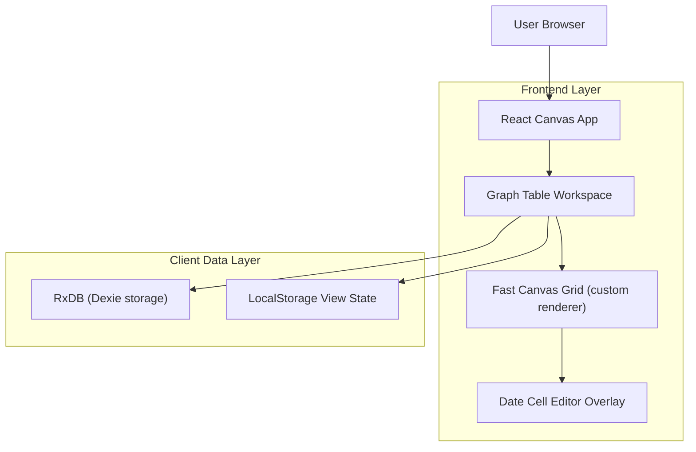

## 1.Architecture design


## 2.Technology Description
- Frontend: React@18 + TypeScript + vite + tailwindcss
- State: zustand (graph/workspace state) + local component state for table UI
- Persistence: RxDB@16 (Dexie backend) for table rows/columns + LocalStorage for view preferences (order/width/visibility)
- Date handling: dayjs (parsing/formatting) + custom calendar popover UI inside the existing overlay system
- Backend: None

## 3.Route definitions
| Route | Purpose |
|-------|---------|
| /* | Single-canvas app surface including Graph Data Table workspace/panels |

## 4.API definitions (If it includes backend services)
Not applicable (no backend).

## 6.Data model(if applicable)
### 6.1 Data model definition
```mermaid
erDiagram
  GRAPH_TABLE ||--o{ GRAPH_COLUMN : contains
  GRAPH_TABLE ||--o{ GRAPH_ROW : contains

  GRAPH_TABLE {
    string id
    string name
    int order
    int createdAtMs
    int updatedAtMs
  }

  GRAPH_COLUMN {
    string pk
    string tableId
    string columnId
    string name
    string kind
    int order
    boolean hidden
    int createdAtMs
    int updatedAtMs
  }

  GRAPH_ROW {
    string pk
    string tableId
    string rowId
    int order
    string dataJson
    int createdAtMs
    int updatedAtMs
  }
```

### 6.2 Data Definition Language
Not applicable (RxDB schema is defined in TypeScript).

### Implementation notes (to meet the requirement)
- DateEditor integration point: branch on `GraphColumnDoc.kind === 'date'` and render a dedicated `DateCellEditor` overlay (text input + calendar) while keeping existing `CanvasCellEditor` for non-date columns.
- Preserve UI: do not replace the custom fast grid; keep header layout, selection, and column reorder interactions unchanged.
- Avoid re-render/recompute loops:
  - Commit on a single pathway (ensure picker selection does not also trigger blur commit).
  - Use refs for rapidly-changing positioning/scroll values; update React state only on semantic changes.
  - Keep derived grid model memoization stable; avoid effect ping-pong with LocalStorage writes by writing only on value changes.
- Alignment across modes/zooms:
  - Anchor the editor popover to the computed cell rect in CSS pixels.
  - Reposition on scroll/resize/devicePixelRatio changes using rAF batching (not per mousemove).
