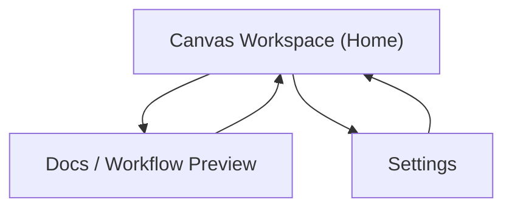

## 1. Product Overview
Improve knowgrph’s mobile-first responsiveness so the local app (dev) and deployed site behave consistently, remain fast, and stay maintainable under a single source of truth (SSOT).
Focus on app-shell layout, panel ergonomics, touch interactions, and predictable routing/base-path behavior.

## 2. Core Features

### 2.1 User Roles
| Role | Registration Method | Core Permissions |
|------|---------------------|------------------|
| User | None (local-first) | Can use the full app UI and workflows |

### 2.2 Feature Module
Our responsiveness enhancement requirements consist of the following main pages:
1. **Canvas Workspace (Home)**: responsive app shell (toolbar/sidebar/bottom panel), touch-friendly canvas interactions, adaptive panel behavior.
2. **Docs / Workflow Preview**: readable typography and navigation on mobile, responsive content container, consistent app chrome.
3. **Settings**: centralized UI preferences (density/theme), responsive settings layout, SSOT for design tokens.

### 2.3 Page Details
| Page Name | Module Name | Feature description |
|-----------|-------------|---------------------|
| Canvas Workspace (Home) | Responsive App Shell | Adapt layout by breakpoint (mobile-first): stack/overlay panels on small screens; allow multi-column/persistent panels on desktop; preserve existing panel semantics (Sidebar, Bottom Panel, Toolbar) while changing presentation only. |
| Canvas Workspace (Home) | Touch & Input Ergonomics | Increase tap targets; support safe-area insets; prevent scroll-jank and unintended zoom; provide predictable gestures (pan/zoom) with clear modes and visible controls on mobile. |
| Canvas Workspace (Home) | Panel Interaction Model | Standardize open/close, outside-click, focus trapping, and scroll locking for overlays/drawers; keep one “active surface” on mobile to reduce clutter; ensure keyboard access on desktop. |
| Canvas Workspace (Home) | Performance on Mobile | Reduce reflows/repaints in responsive transitions; avoid rerendering large canvas + tables on every resize; ensure layout changes are debounced and state-driven (SSOT). |
| Canvas Workspace (Home) | Local vs Deployed Parity | Ensure routes and assets resolve correctly for local dev and GitHub Pages base path; avoid hardcoded paths; keep configuration centralized. |
| Docs / Workflow Preview | Responsive Reading Layout | Provide mobile typography scale and line-length constraints; support code blocks/tables with horizontal scrolling; keep navigation accessible without consuming vertical space. |
| Docs / Workflow Preview | App Chrome Consistency | Reuse the same header/navigation components as the Canvas Workspace; ensure “back to workspace” remains one tap. |
| Settings | SSOT Design Tokens | Centralize breakpoints, spacing scale, panel sizes, z-index layers, and touch-target minimums into shared constants; avoid duplicated “magic numbers”. |
| Settings | UI Preferences | Allow adjusting density (compact/comfortable) and optional “always show desktop panels” behavior on large screens; persist locally. |
| Settings | Diagnostics (Lean) | Display current breakpoint and base path (read-only) to help verify local vs deployed behavior without devtools. |

## 3. Core Process
- User opens knowgrph on a phone: the Canvas Workspace loads with a compact header, a primary action area (canvas), and panels presented as drawers/overlays; the user toggles panels as needed without losing context.
- User opens knowgrph on desktop: panels can stay visible simultaneously (sidebar + bottom panel) while maintaining the same information architecture as mobile.
- User switches between Canvas and Docs: navigation remains consistent; content reflows without layout “jumps”; routes work the same in local dev and deployed site (base path aware).

