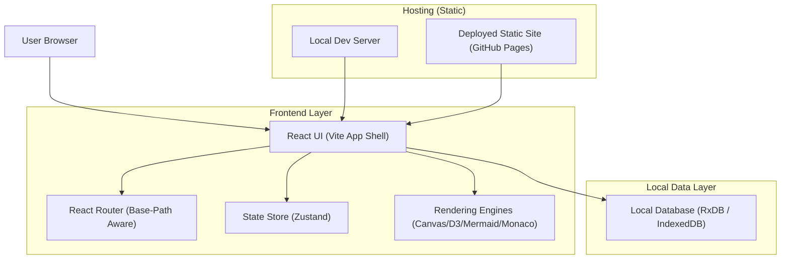
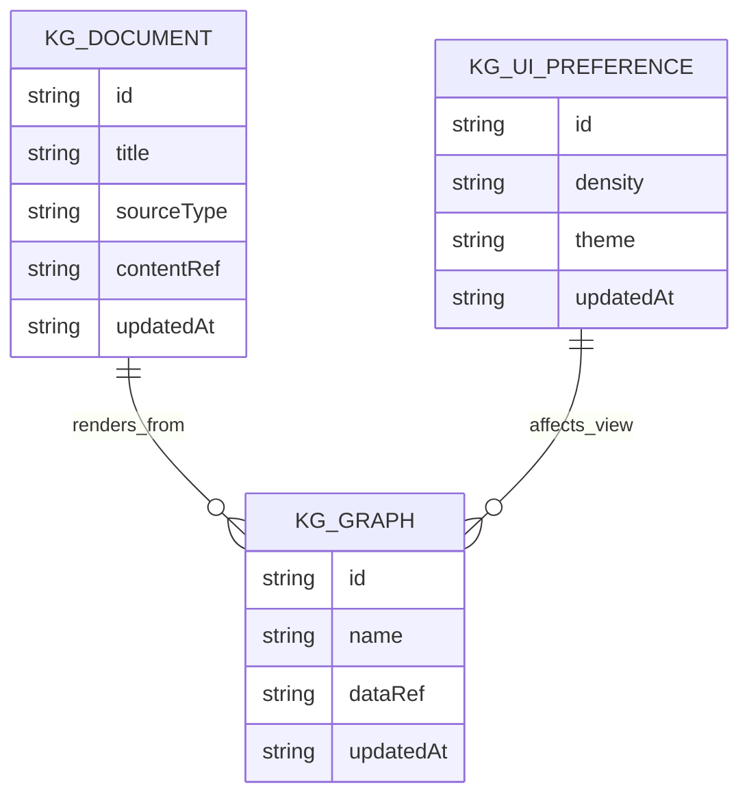

## 1.Architecture design

## 2.Technology Description
- Frontend: React@18 + react-router-dom@7 + vite@6
- Styling: tailwindcss@3 (plus centralized design tokens/constants)
- State: zustand@5
- Local persistence: rxdb@16 (IndexedDB)
- Editors/visualization: monaco-editor, d3, mermaid, three (existing)
- Backend: None

## 3.Route definitions
| Route | Purpose |
|-------|---------|
| / | Entry route; redirects to primary workspace (base-path aware) |
| /canvas | Main Canvas Workspace (toolbar/sidebar/bottom panel) |
| /docs | Docs / workflow preview content in app shell |
| /settings | UI preferences and SSOT token diagnostics |

## 6.Data model(if applicable)
### 6.1 Data model definition
Client-side (RxDB) collections should remain stable while UI responsiveness changes.

### 6.2 Data Definition Language
Not applicable (no server database).