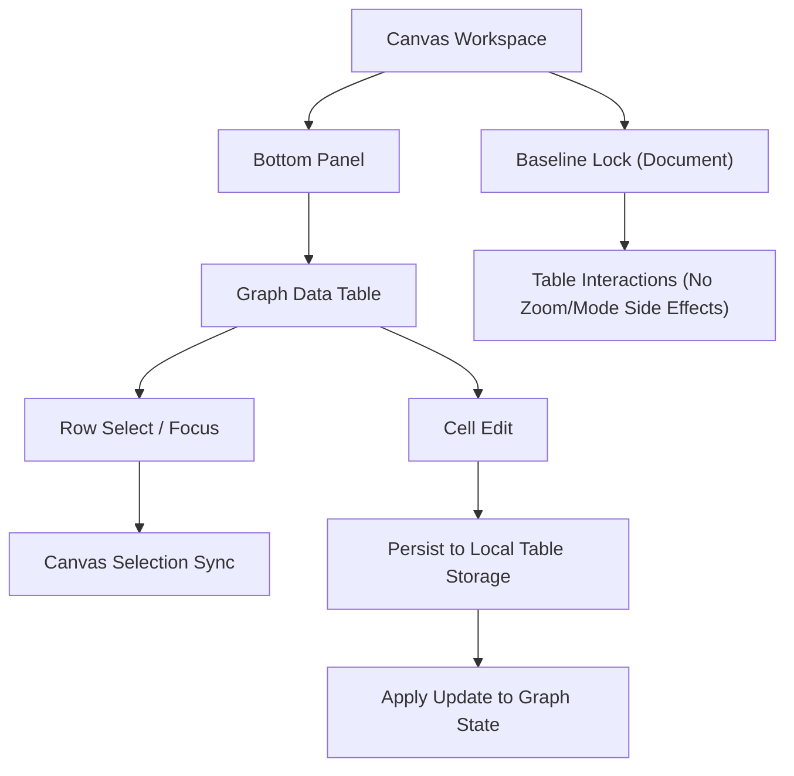

## 1. Product Overview
Replace the current Graph Data Table implementation by removing ag-grid and shipping an in-repo, high-performance grid (glide-data-grid-like).
Ensure Document Mode’s baseline-locked behavior stays correct and unchanged for all other modes/zoom behaviors.

## 2. Core Features

### 2.1 User Roles
Not required (single-user, local-first workspace).

### 2.2 Feature Module
The requirements consist of the following main pages:
1. **Canvas Workspace**: graph canvas, mode/zoom controls, Bottom Panel with Graph Data Table (Nodes/Edges), selection sync, Document Mode baseline lock.

### 2.3 Page Details
| Page Name | Module Name | Feature description |
|---|---|---|
| Canvas Workspace | Bottom Panel: Graph Data Table | View graph entities as rows for **Nodes** and **Edges**; show row count; allow collapse/expand of table area; allow split view with inspector. |
| Canvas Workspace | Table toolbar controls | Toggle column visibility; set filters (match any/all + clauses); set group-by; set multi-column sort rules; switch row height preset; reset column widths. |
| Canvas Workspace | Fast Grid (replacement) | Render large tables smoothly with virtualization (rows/columns); support sticky header; support column resize; support row selection (multi-select + select-all); support row focus and auto-scroll-to-focused row. |
| Canvas Workspace | Editing & persistence | Edit cell values (except immutable IDs); persist changes to local table storage; apply edits back into in-memory graph state. |
| Canvas Workspace | Selection + preview sync | On row click, select corresponding node/edge in the graph; when selection originates outside the table, focus the related row; keep the table preview dock visible in Table view mode. |
| Canvas Workspace | Document Mode baseline sync (must not regress) | When baseline lock is enabled: enforce Document Mode baseline state and prevent mode-switch/renderer changes; ensure table interactions (scroll/resize/edit/select) do **not** modify canvas zoom policies or unlocked modes; TOC focus dispatch from table row click must remain functional. |
| Canvas Workspace | Dependency removal | Remove ag-grid from runtime (no ag-grid imports/styles/registry); grid must be implemented in-repo and themed via existing UI tokens. |

## 3. Core Process
**Table editing & selection flow**
1. You open the Canvas Workspace and switch to the Graph Data Table tab.
2. You choose Nodes or Edges, optionally adjust filters/group/sort, and resize columns.
3. You click a row to inspect it; the corresponding node/edge becomes selected on the canvas.
4. You edit a cell value; the table persists the update and the graph updates accordingly.

**Document Mode baseline lock flow (non-regression)**
1. You enable baseline lock (Document structure baseline).
2. The workspace stays in the baseline configuration (Document semantic mode + baseline zoom policies).
3. You use the table (scroll, select, resize, edit) without changing any non-table mode/zoom state.
4. You disable baseline lock and your prior (pre-lock) modes/zoom-related state is restored.

