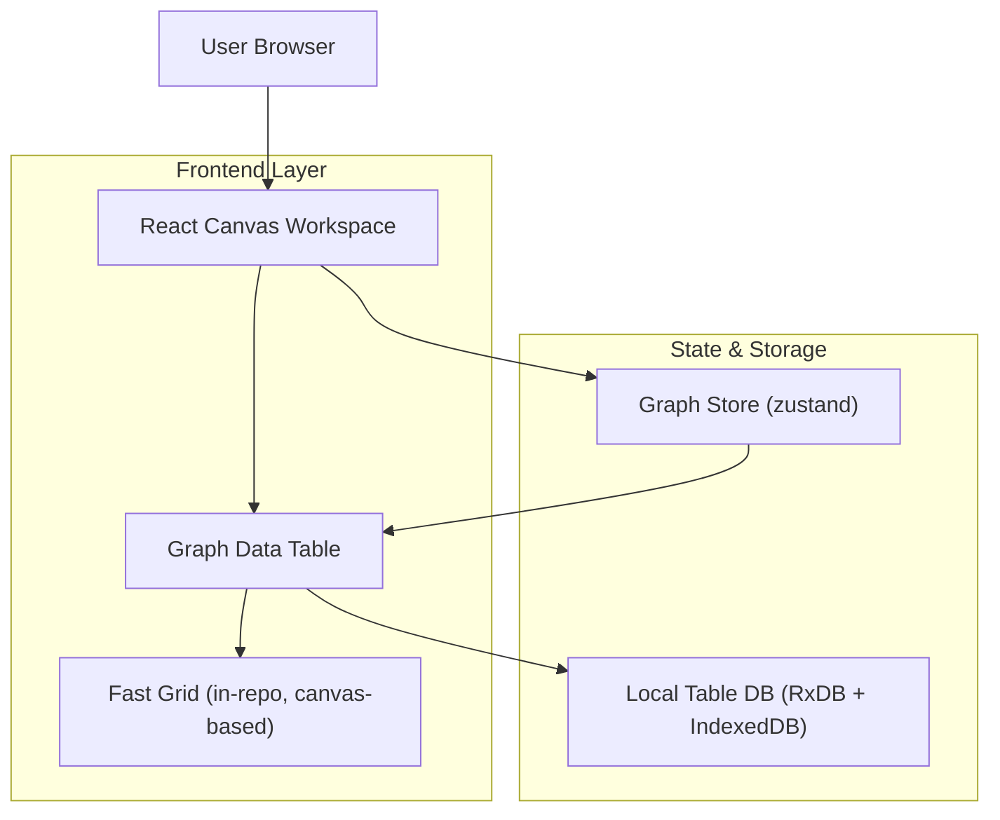

## 1.Architecture design


## 2.Technology Description
- Frontend: React@18 + TypeScript + react-router-dom@7 + vite@6
- UI: tailwindcss@3 + existing design tokens (`UI_THEME_TOKENS`)
- State: zustand@5
- Local persistence: RxDB@16 + dexie (IndexedDB)
- Backend: None

## 3.Route definitions
| Route | Purpose |
|---|---|
| /* | Single-page Canvas Workspace; includes Bottom Panel and Graph Data Table mode |

## 4.API definitions (If it includes backend services)
None.

## 6.Data model(if applicable)
### 6.1 Data model definition
Local-first table storage (RxDB collections):
- `columns`: per-table column definitions (visibility, order, name, columnId)
- `rows`: per-table row documents (rowId, order, data payload)

Shared TS shapes (conceptual):
```ts
export type GraphTableId = 'nodes' | 'edges'

export type GraphColumnDoc = {
  pk: string
  tableId: GraphTableId
  columnId: string
  name: string
  order: number
  hidden?: boolean
}

export type GraphRowDoc = {
  pk: string
  tableId: GraphTableId
  rowId: string
  order: number
  data: Record<string, unknown>
}
```

### 6.2 Data Definition Language
Not applicable (IndexedDB via RxDB/Dexie, no SQL DDL).

---

## Implementation notes (for this refactor)
### A) Remove ag-grid cleanly
- Delete the ag-grid registry bootstrap and any stylesheet imports.
- Remove `ag-grid-community` and `ag-grid-react` from dependencies.

### B) In-repo Fast Grid (glide-data-grid-like)
Core design goals:
- Canvas-rendered cells + DOM overlay for focus/IME if needed.
- Row/column virtualization (only render visible viewport + overscan).
- Stable, memoized data access (`getCell(col,row)`), minimal allocations per frame.
- Column sizing model compatible with existing `columnWidthsPxById` persistence.

Suggested internal module boundaries:
- `fast-grid/core`: viewport math, virtualization, hit-testing.
- `fast-grid/render`: canvas draw pipeline + theme integration.
- `fast-grid/interaction`: selection, keyboard nav, editing lifecycle.
- `graph-table/adapters`: map current GraphTableSemanticTable derived rows/cols into grid data API.

### C) Document Mode baseline sync: isolation contract
- Grid must not mutate workspace mode, document semantic mode, renderer selection, or zoom policies.
- Wheel/trackpad interactions over the grid must scroll the grid and must not be interpreted as canvas zoom.
- Baseline lock behavior remains the source of truth (existing store guards + restore logic).