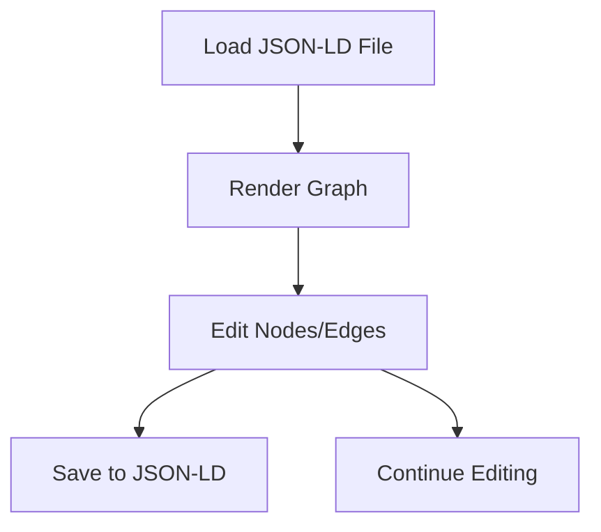

## 1. Product Overview
Interactive graph visualization canvas for loading, viewing, and editing local graph data. Users can manipulate nodes and edges, with changes saved back to JSON-LD format.

## 2. Core Features

### 2.1 User Roles
No user authentication required - single user mode for local file operations.

### 2.2 Feature Module
Canvas graph page consists of:
1. **Canvas graph page**: graph visualization, node/edge editing, file operations.

### 2.3 Page Details
| Page Name | Module Name | Feature description |
|-----------|-------------|---------------------|
| Canvas graph page | Graph visualization | Load JSON-LD graph data from local file, render interactive graph with nodes and edges |
| Canvas graph page | Node editing | Click nodes to edit properties, drag to reposition, add new nodes |
| Canvas graph page | Edge editing | Create connections between nodes, modify edge properties |
| Canvas graph page | File operations | Save edited graph back to JSON-LD file, load new graph files |
| Canvas graph page | Interactive controls | Zoom, pan, fit-to-screen, reset view |

## 3. Core Process
User loads JSON-LD graph file → Graph renders interactively → User edits nodes/edges → Changes saved back to JSON-LD.

## 4. User Interface Design

### 4.1 Design Style
- Primary color: #3B82F6 (blue)
- Secondary color: #10B981 (green)
- Clean white background with subtle grid
- Rounded buttons and nodes
- Sans-serif font (Inter)
- Icon-based toolbar

### 4.2 Page Design Overview
| Page Name | Module Name | UI Elements |
|-----------|-------------|-------------|
| Canvas graph page | Graph area | Full-screen canvas with zoom/pan controls, node selection highlighting |
| Canvas graph page | Toolbar | Top bar with load/save buttons, zoom controls, edit mode toggle |
| Canvas graph page | Node editor | Side panel for editing selected node properties |
| Canvas graph page | Status bar | Bottom bar showing file name, save status, node count |

### 4.3 Responsiveness
Desktop-first design with mouse-optimized interactions for precise graph editing.