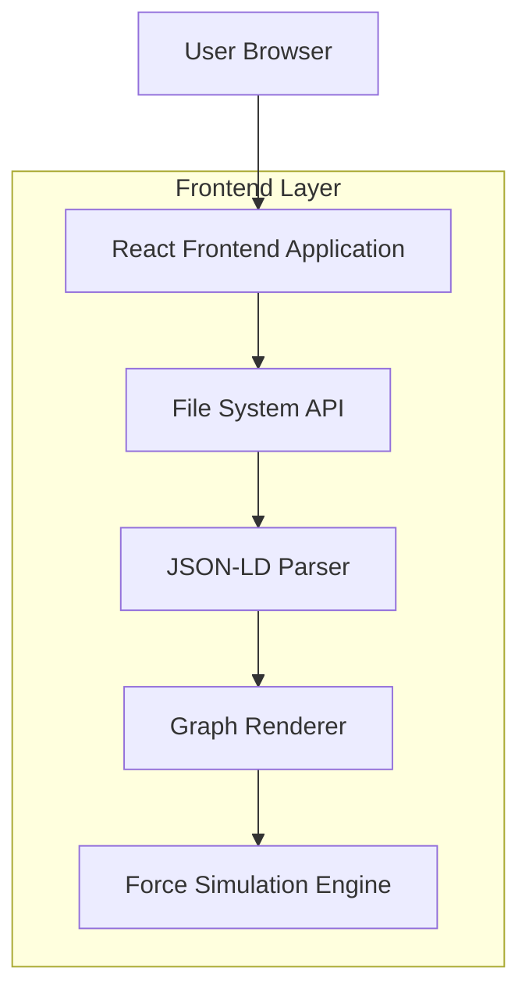
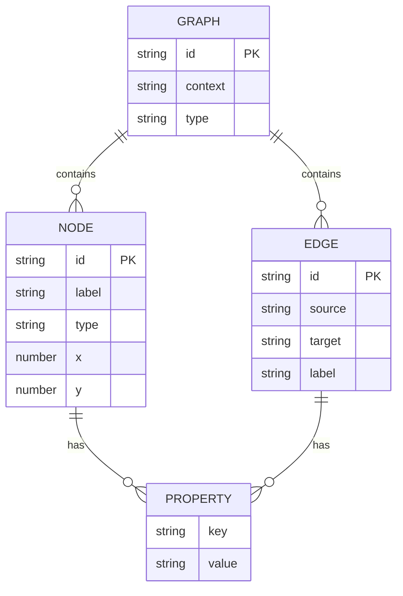

## 1. Architecture design



## 2. Technology Description
- Frontend: React@18 + D3.js@7 + Vite
- Initialization Tool: vite-init
- Backend: None (client-side only)
- File Handling: Browser File System Access API

## 3. Route definitions
| Route | Purpose |
|-------|---------|
| /canvas | Main graph visualization and editing interface |

## 4. API definitions

### 4.1 File Operations
```
File System Access API
```

Request:
| Param Name| Param Type  | isRequired  | Description |
|-----------|-------------|-------------|-------------|
| fileHandle| FileSystemFileHandle | true | Browser file handle for read/write operations |

Response:
| Param Name| Param Type  | Description |
|-----------|-------------|-------------|
| content   | string      | JSON-LD graph data |
| success   | boolean     | Operation status |

## 5. Data model

### 5.1 Data model definition


### 5.2 Data Definition Language
Graph Node Collection
```typescript
interface GraphNode {
  id: string;
  label: string;
  type: string;
  x?: number;
  y?: number;
  properties: Record<string, any>;
}

interface GraphEdge {
  id: string;
  source: string;
  target: string;
  label: string;
  properties: Record<string, any>;
}

interface GraphData {
  context: string;
  type: string;
  nodes: GraphNode[];
  edges: GraphEdge[];
}
```