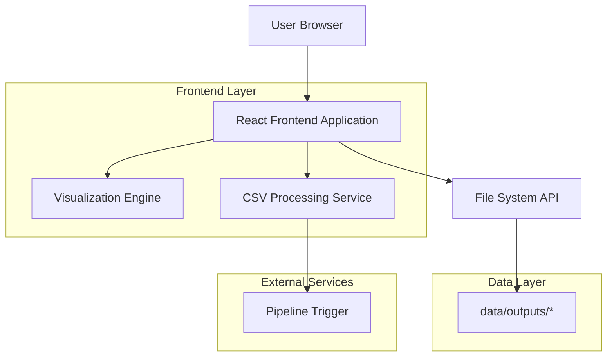
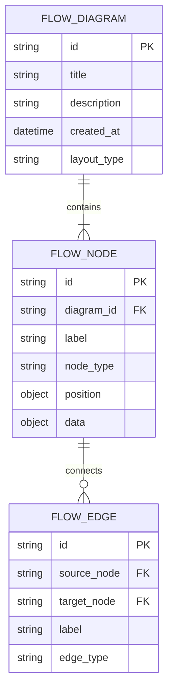

## 1. Architecture design



## 2. Technology Description
- Frontend: React@18 + tailwindcss@3 + vite
- Initialization Tool: vite-init
- Visualization: D3.js@7 + React Flow@11
- Backend: None (client-side only)
- File Processing: Papa Parse@5 for CSV parsing

## 3. Route definitions
| Route | Purpose |
|-------|---------|
| / | Home page, displays interactive flow visualization |
| /upload | Upload page for CSV file upload and pipeline regeneration |

## 4. API definitions
Since this is a client-side only application, there are no backend APIs. File operations are handled through browser File API and data is read from the local file system.

### 4.1 File Operations
**Read Pipeline Outputs**
```javascript
// Read from data/outputs/* directory
const readPipelineOutputs = async () => {
  const files = await readDirectory('/data/outputs');
  return files.filter(file => file.endsWith('.json'));
}
```

**CSV Upload Processing**
```javascript
// Process uploaded CSV file
const processCSVUpload = async (file) => {
  const csvData = await parseCSV(file);
  return triggerPipelineRegeneration(csvData);
}
```

## 5. Data model

### 5.1 Data model definition


### 5.2 Data Definition Language
Since this is a client-side application, data is stored in JSON format rather than a traditional database. The data structure follows this schema:

**Flow Diagram Schema**
```json
{
  "id": "string",
  "title": "string", 
  "description": "string",
  "created_at": "ISO datetime string",
  "layout_type": "flow | graph | timeline",
  "nodes": [
    {
      "id": "string",
      "label": "string",
      "node_type": "process | decision | input | output",
      "position": { "x": number, "y": number },
      "data": {}
    }
  ],
  "edges": [
    {
      "id": "string", 
      "source": "string",
      "target": "string",
      "label": "string",
      "edge_type": "default | conditional | loop"
    }
  ]
}
```

## 6. File System Integration
The application reads from the local `data/outputs/` directory to load pipeline-generated visualization data. CSV uploads trigger a client-side pipeline simulation that regenerates the visualization data in the same format.