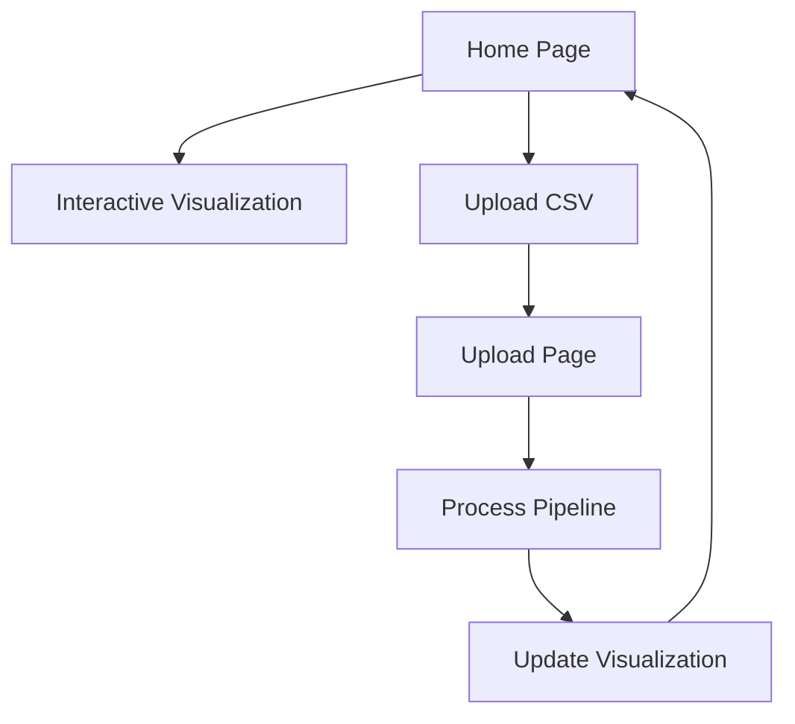

## 1. Product Overview
A public web application that visualizes README Example Flow data from the knowgrph project. Users can interactively explore flow diagrams and graphs generated from pipeline outputs without requiring authentication. The tool supports CSV upload to regenerate the visualization pipeline.

This product helps developers and project maintainers understand complex data flows through interactive visualizations, making technical documentation more accessible and engaging.

## 2. Core Features

### 2.1 User Roles
Since no login is required, this is a single-role application for public users.

### 2.2 Feature Module
Our README Flow Visualizer consists of the following main pages:
1. **Home page**: Interactive flow visualization, file upload section, graph controls.
2. **Upload page**: CSV file upload interface, pipeline regeneration status.

### 2.3 Page Details
| Page Name | Module Name | Feature description |
|-----------|-------------|---------------------|
| Home page | Flow Visualization | Display interactive flow diagram from data/outputs/* files with zoom, pan, and node selection capabilities. |
| Home page | Graph Controls | Provide toggle buttons for different view modes (flow, graph, timeline) and filtering options. |
| Home page | Data Refresh | Auto-load latest pipeline outputs and provide manual refresh button. |
| Upload page | CSV Upload | Allow users to upload CSV files to trigger pipeline regeneration with drag-and-drop interface. |
| Upload page | Pipeline Status | Show real-time status of pipeline execution and visualization update progress. |

## 3. Core Process
**Public User Flow:**
1. User lands on Home page and sees the current flow visualization
2. User can interact with the graph (zoom, pan, select nodes)
3. User can switch between different visualization modes
4. User can upload CSV file via Upload page to regenerate pipeline
5. System processes upload and updates visualization automatically
6. User returns to updated Home page with new visualization

## 4. User Interface Design

### 4.1 Design Style
- **Primary colors**: Deep blue (#1e40af) for headers, light gray (#f3f4f6) for backgrounds
- **Button style**: Rounded corners with subtle shadows, hover effects
- **Font**: Inter for body text, monospace for code/technical elements
- **Layout style**: Card-based layout with clean separation between sections
- **Icons**: Lucide React icons for consistency and clarity

### 4.2 Page Design Overview
| Page Name | Module Name | UI Elements |
|-----------|-------------|-------------|
| Home page | Flow Visualization | Full-width canvas with dark theme, interactive nodes with tooltips, zoom controls in top-right corner |
| Home page | Graph Controls | Horizontal button group with active state highlighting, dropdown filters, toggle switches |
| Upload page | CSV Upload | Centered upload zone with dashed border, file drag-and-drop area, upload progress bar |
| Upload page | Pipeline Status | Real-time status messages with loading spinner, success/error indicators |

### 4.3 Responsiveness
Desktop-first design with mobile-responsive layouts. Touch interaction optimized for tablet and mobile devices with gesture support for graph navigation.