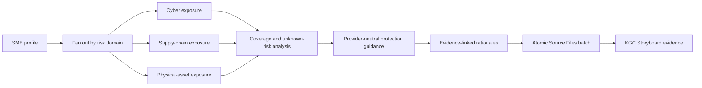

# Knowgrph SME Care Agent

`/sme-care-agent` gives a small or medium-sized business a traceable view of declared cyber, supply-chain, and physical-asset exposure; apparent coverage gaps; unresolved unknowns; provider-neutral protection guidance; and the evidence needed for qualified review.

The implemented baseline is deterministic, bounded, and zero-spend. It is decision support—not an insurer, broker, legal adviser, underwriting engine, or automated insurance seller.

## What Is Runtime-Ready

The current implementation provides:

- the public invocation `/sme-care-agent`;
- the internal `agent.sme` / `sme.risk.profile` kernel;
- typed `knowgrph-sme-profile/v1` input and `knowgrph-sme-risk-run/v1` output;
- one-pass fan-out/fan-in analysis across `cyber`, `supply_chain`, and `asset_physical`;
- explicit coverage outcomes, gaps, unknown risks, protection guidance, and per-item rationales;
- deterministic semantic identifiers and growth-stage delta detection;
- canonical zero-cost logs with zero paid provider calls;
- atomic Source Files persistence for successful local live runs;
- a `kgc-computing-flow/v1` Storyboard Canvas evidence document;
- fail-closed approval gates for purchase, bind, apply, third-party contact, and paid-model actions.

The broader living protection graph in `docs/documents/knowgrph-sme-protection-gap-prd-tad.md` is a product and technical specification. Policy wording extraction, jurisdiction packs, adviser review workflows, accepted graph deltas, and continuous reassessment described there are not all implemented or deployed.

## Repository

This runbook belongs to the SME protection-gap worktree:

```text
$GITHUB_ROOT/knowgrph-desktop-sme-protection-gap
```

Run commands from that directory unless a command says otherwise:

```bash
cd $GITHUB_ROOT/knowgrph-desktop-sme-protection-gap
```

The canonical integrated repository is:

```text
$GITHUB_ROOT/knowgrph
```

## Quick Start: Canvas Webpage Demo

Install dependencies if this checkout has not been prepared:

```bash
npm install
```

Regenerate and verify the deterministic pre-seed Canvas evidence:

```bash
npm run sme-care-agent:canvas-demo
npm run sme-care-agent:canvas-demo:check
```

Start Knowgrph:

```bash
npm run dev -- --host 127.0.0.1
```

Open [http://127.0.0.1:5173/](http://127.0.0.1:5173/), then:

1. Select **Launch**.
2. Select **Import URL**.
3. Paste this absolute local path:

   ```text
   $GITHUB_ROOT/knowgrph-desktop-sme-protection-gap/sme-agent/demo/sme-care-agent-canvas-evidence.md
   ```

4. Select **Import**.

The pre-seed evidence renders in **2D Renderer: Storyboard** with 27 semantic nodes and 36 typed edges, including:

- `/sme-care-agent` runtime identity;
- the synthetic SME profile;
- three exposure domains;
- three assumed-uncovered gaps;
- three explicit unknown risks;
- three provider-neutral protection items;
- nine traceable rationales;
- `$0 · 0 provider calls`;
- `Dev-only · no deploy mutation`;
- the final runtime-ready evidence node.

`npm run sme-care-agent:canvas-demo` regenerates the checked-in deterministic evidence artifact. It does not call a paid model or deploy anything.

## Run the Agent Through Local MCP

The executable local tool is `knowgrph.superagent.run`. For `/sme-care-agent`, the shared runtime detects `runtimeKernel: "sme.risk.profile"` and invokes the specialized deterministic kernel instead of the generic Python SuperAgent harness.

Start the local stdio MCP server:

```bash
KNOWGRPH_ROOT="$(pwd)" \
KNOWGRPH_PYTHON="${KNOWGRPH_PYTHON:-./.venv/bin/python}" \
node ./mcp/server.js
```

Configure that command in a stdio-capable MCP client, then call `knowgrph.superagent.run` with:

```json
{
  "invocation": "/sme-care-agent",
  "inputPath": "sme-agent/fixtures/pre-seed.md",
  "outputDir": "data/outputs/sme-care-agent-demo",
  "mode": "live",
  "tokenBudget": 100000,
  "timeoutMs": 300000
}
```

For a non-persisting evaluation, set `"mode": "dry-run"`. For this specialized deterministic kernel, local `live` mode writes the Source Files batch but still records zero paid provider calls.

## Input Profile

The input must be Markdown with byte-zero YAML frontmatter using `knowgrph-sme-profile/v1`:

```markdown
---
schema: "knowgrph-sme-profile/v1"
profile_id: "synthetic-logistics-01"
industry: "logistics"
size: 48
growth_stage: "growth"
assets: ["warehouse equipment"]
digital_footprint: "online booking portal and staff email"
suppliers: ["packaging supplier", "fleet maintenance supplier"]
declared_coverage:
  - category: "asset_physical"
    scope: "limited"
---

# Synthetic Logistics SME
```

Supported synthetic fixtures cover all growth stages:

| Fixture | Growth stage | Purpose |
|---|---|---|
| `sme-agent/fixtures/pre-seed.md` | `pre_seed` | Demonstrates undeclared inputs, unknown risks, and assumed-uncovered gaps |
| `sme-agent/fixtures/early.md` | `early` | Demonstrates an early operating profile |
| `sme-agent/fixtures/growth.md` | `growth` | Demonstrates growth-stage exposure and coverage comparison |
| `sme-agent/fixtures/established.md` | `established` | Demonstrates a larger established profile |

Use `"undeclared"` when assets, digital footprint, suppliers, or declared coverage are not known. The runtime preserves missing information as an explicit unknown; it does not interpret missing evidence as safety or complete coverage.

## Output Artifacts

A successful local live run writes one atomic seven-file Source Files batch:

```text
sme-agent/profiles/<profileId>/profile.md
sme-agent/runs/<runId>/exposures.md
sme-agent/runs/<runId>/gaps.md
sme-agent/runs/<runId>/protection.md
sme-agent/runs/<runId>/rationale.md
sme-agent/runs/<runId>/delta.md
sme-agent/runs/<runId>/canvas-evidence.md
```

The write is all-or-nothing. A persistence failure rolls back the batch rather than leaving a partial risk record.

The structured result includes:

- normalized profile;
- risk exposure profile;
- coverage matches;
- ranked coverage gaps;
- unresolved unknown risks;
- protection guidance;
- traceable rationales;
- unsupported or blocked inference trace;
- growth delta;
- canonical cost logs and budget meters;
- the guidance disclaimer;
- explicit deployment status.

## Runtime Topology



Runtime bounds:

| Bound | Value |
|---|---:|
| Maximum iterations | 1 |
| Maximum wall time | 300 seconds |
| Maximum token budget | 100,000 |
| Deterministic baseline tokens used | 0 |
| Deterministic baseline paid calls | 0 |
| Circuit breakers | `schema_error`, `approval_denial`, `token_budget_breach`, `verification_failure` |

## Safety and Approval Boundaries

The baseline provides education, evidence preparation, resilience guidance, and qualified-review handoff. It must not:

- claim that an SME is fully covered;
- infer that undeclared coverage is safe;
- rank or select an insurer, carrier, or product;
- estimate premium, eligibility, underwriting outcome, or claim outcome;
- quote, apply, purchase, bind, renew, cancel, or alter a policy;
- contact a third party without exact approval;
- present legal, financial, insurance, or regulated advice;
- mutate Prod, Cloudflare, payment, DNS, remote storage, or a production mirror without separate explicit authorization.

The actions `purchase`, `bind`, `apply`, `contact_third_party`, and `paid_model_call` fail closed without an exact unexpired approval.

## Runtime and Infrastructure Boundary

The deterministic SME kernel does not require an external orchestration service, paid model, provider API, database, or network call.

| Surface | Required for deterministic local run? | Notes |
|---|---|---|
| Node.js repository runtime | Yes | Runs schemas, kernel, persistence, and evidence projection |
| Knowgrph Source Files owner | Yes for local `live` persistence | Writes the atomic seven-file batch |
| Knowgrph Canvas | Only for visual demo | Parses the same frontmatter-first KGC document |
| Agentic Canvas OS docs checkout | Source-time readiness check only | Not a request-time dependency |
| Cloudflare Worker | No for local run | Required only for the deployed Worker surface |
| Durable Objects / Workers AI binding / bearer secret | No for local deterministic run | Required by the deployed authenticated agent runtime as configured |
| BytePlus, Exa, StryTree, payment, or media services | No | Optional adapters for other specialized stages |

This runbook does not authorize deployment. Cloudflare verification and release remain separate, operator-approved workflows.

## Verification

Focused SME runtime tests:

```bash
node --test mcp/__tests__/sme-risk-coverage-runtime.test.mjs
node --test mcp/__pbt__/sme-risk-coverage.pbt.test.mjs
```

Canvas ingestion and render contract:

```bash
npm -C canvas run test:ci:unit -- smeCareAgent.canvasEvidence.runtimeReady
```

Byte-stable demo evidence:

```bash
npm run sme-care-agent:canvas-demo:check
```

Full runtime-readiness gate:

```bash
KNOWGRPH_AGENTIC_CANVAS_OS_DOCS_ROOT=$GITHUB_ROOT/agentic-canvas-os/docs \
npm run runtime:check
```

The full gate verifies runtime/property tests, pinned invocation dictionaries, deterministic replay, Canvas parsing, KGC round-trip, zero paid calls, zero actual cost, and the no-deploy boundary.

## Key Source Owners

| Concern | Source owner |
|---|---|
| Agent registry | `data/config/agents/agent-definitions.json` |
| Agent input schema | `contracts/sme-profile.schema.js` |
| Agent output schema | `contracts/sme-risk-coverage.schema.js` |
| Deterministic SME kernel | `mcp/sme-risk-coverage/core.js` |
| Canvas evidence projection | `mcp/sme-risk-coverage/canvas-evidence.js` |
| Atomic Source Files writer | `mcp/sme-risk-coverage/local-source-files.js` |
| Shared local agent runtime | `mcp/local-agent-runtime.js` |
| Local MCP server | `mcp/server.js` |
| Synthetic fixtures | `sme-agent/fixtures/` |
| Checked-in Canvas demo | `sme-agent/demo/sme-care-agent-canvas-evidence.md` |
| Runtime readiness contract | `docs/runtime-readiness-contract.md` |
| Broader product specification | `docs/documents/knowgrph-sme-protection-gap-prd-tad.md` |

## Troubleshooting

### Port 5173 is already in use

Reuse the existing page at `http://127.0.0.1:5173/`, stop the old Vite process, or select another port:

```bash
npm run dev -- --host 127.0.0.1 --port 5174
```

### Canvas still shows an older graph

Import `sme-agent/demo/sme-care-agent-canvas-evidence.md` again through **Launch → Import URL**. The document declares the complete Storyboard preset in frontmatter, so it does not require a custom renderer.

### The demo check says the evidence is stale

Regenerate from the deterministic fixture, inspect the diff, then rerun the check:

```bash
npm run sme-care-agent:canvas-demo
npm run sme-care-agent:canvas-demo:check
```

### The agent returns `blocked`

Check the typed error. Expected fail-closed causes include invalid profile fields, token budget breach, invalid timeout, verification failure, or a gated action without approval. Do not bypass a failed safety or approval gate.

### Runtime readiness cannot find Agentic Canvas OS docs

Point the source-time check at the canonical docs directory:

```bash
export KNOWGRPH_AGENTIC_CANVAS_OS_DOCS_ROOT=$GITHUB_ROOT/agentic-canvas-os/docs
```

This environment variable affects readiness verification only; the deterministic SME request path does not read that repository at runtime.
