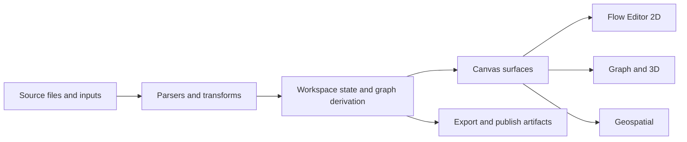
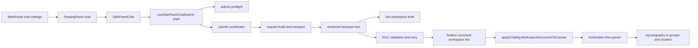
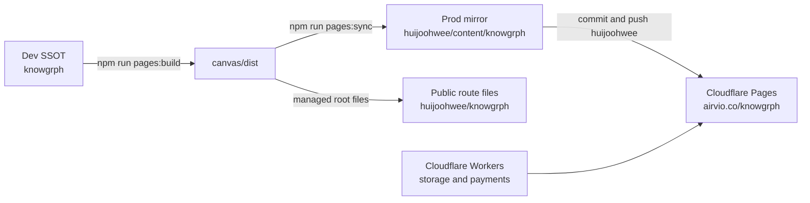

| title                           | Knowgrph                              |
| ------------------------------- | ------------------------------------- |
| id                              | md:knowgrph-readme-chat-to-canvas     |
| author                          | joohwee                               |
| date                            | 2026-05-22                            |
| version                         | 2.1.1                                 |
| kgCanvasSurfaceMode             | 2d                                    |
| kgCanvasRenderMode              | 2d                                    |
| kgCanvas2dRenderer              | flowEditor                            |
| kgDocumentSemanticMode          | document                              |
| kgFrontmatterModeEnabled        | true                                  |
| kgDocumentStructureBaselineLock | false                                 |

# Knowgrph

**Workspace-first knowledge graph canvas.**

Knowgrph is a browser-based workspace for turning documents, structured data, and media-rich references into editable graph and canvas views. 
The app keeps one upstream source of truth in Dev, derives interactive workspace state in the canvas runtime, and publishes generated artifacts through a mirrored Cloudflare Pages topology.

## Overview

**Context**: Knowgrph runs from `/Users/huijoohwee/Documents/GitHub/knowgrph`, mirrors built output into `/Users/huijoohwee/Documents/GitHub/huijoohwee/content/knowgrph`, and serves the public route at `airvio.co/knowgrph`.

**Intent**: keep the product workspace-first, source-owned, and traceable across Markdown, graph, flow-editor, geospatial, and publish surfaces.

**Directive**: fix behavior upstream in Dev, validate focused diffs, sync generated artifacts downstream, and never patch `content/knowgrph` as if it were the source owner.

## What Knowgrph Does

| Surface | Role | Current Behavior |
| --- | --- | --- |
| Markdown workspace | Source editing and derivation | Opens workspace documents, preserves editor state, and derives graph/canvas state from the active source snapshot |
| Flow Editor canvas | Primary 2D authoring surface | Renders widget-style nodes, rich media panels, handles, overlays, and workspace-linked editing flows |
| Graph and 3D views | Alternate graph exploration surfaces | Supports graph-oriented rendering paths and 3D/Three.js visualization without changing the upstream workspace model |
| Geospatial overlay | Map and location-aware exploration | Mounts geospatial overlays and POI-driven rich media previews when map-backed data is active |
| Search, chat, and panels | Operator workflow tools | Exposes side-panel chat, search, floating panels, history, settings, and import/export utilities |
| Storage and publish | Persistence and release | Persists local/runtime state, syncs publish artifacts, and deploys Cloudflare Worker APIs for storage and payments |

## Product Flow



## Chat-To-Canvas Runtime

Knowgrph keeps the LLM chat path workspace-first as well. The current in-repo owner split is:

| Stage | Current owner | Runtime contract |
| --- | --- | --- |
| Chat settings | `MainPanel`, `SettingsView`, `useSettingsChatAssist` | Provider, endpoint, model, auth mode, and context scope are configured upstream once |
| Chat UI mount | `FloatingPanel`, `SidePanelChat` | FloatingPanel mounts the chat surface; SidePanelChat owns runtime UI state and store reads |
| Submit shell | `useSidePanelChatSubmit.ts` | Thin shell only: resolves request guards, initializes optimistic state, and delegates |
| Async submit lifecycle | `sidePanelChatSubmitCoordinator.ts` | Central lifecycle owner for request-build, transport, streaming, retry, and terminal cleanup |
| Request and transport | `sidePanelChatSubmitRequest.ts`, `sidePanelChatSubmitTransport.ts` | Builds packed context and payload messages, applies token-key/model fallback upstream |
| Streaming and KGC retry | `sidePanelChatStreaming.ts`, `sidePanelChatKgcAttempt.ts`, `chatMarkdownValidation.ts` | Persists live drafts, validates canonical KGC Markdown, and retries with correction prompts |
| Finalize and apply | `useFinalizeAssistantSuccess.ts`, `chatKgcCanvasApply.ts` | Persists the canonical workspace document, then applies it through `setActiveMarkdownDocument()` |
| Parse and group projection | `default.ts`, `markdownFrontmatterFlowGraph.core.ts`, `subgraphs.ts`, `graphGroups.ts` | Prefers frontmatter-flow parsing and keeps `flow.subgraphs -> kg:subgraphs -> deriveGraphGroups()` as the only grouping pipeline |

### Chat Flow



### Chat Rules

- Keep `CHAT_BASE_KGC_RESPONSE_CONTRACT_PROMPT` as the only `chatKnowgrph` prompt contract source.
- Keep `useSidePanelChatSubmit.ts` thin; do not move request-build, transport, streaming, or KGC retry logic back into the hook.
- Persist assistant output to workspace drafts first; do not patch graph state directly from raw assistant text.
- Keep `flow.subgraphs` as the only grouping authoring surface; do not add parallel cluster or grouping aliases.
- Fix chat-to-canvas bugs at the highest current owner instead of adding downstream compatibility shims.

### Data Flow

| Stage | Component family | Input | Output | Persistence |
| --- | --- | --- | --- | --- |
| Ingest | `canvas/src/features/parsers`, `knowgrph_parser` | Markdown, JSON, JSON-LD, CSV, PDF, webpages, codebase inputs | Normalized workspace or graph-ready content | In-memory runtime, generated files, optional storage sync |
| Derive | `canvas/src/lib/graph`, `canvas/src/hooks/store` | Parsed source text and workspace snapshots | `GraphData`, view state, layout state, semantic document state | Zustand, local storage, minimal persisted-cache flows |
| Render | `canvas/src/components`, `canvas/src/features` | Graph and workspace state | Flow Editor, graph canvas, markdown/editor panes, geospatial overlays | Browser runtime |
| Export | `canvas/src/cli`, `canvas/sandbox`, publish scripts | Workspace state and built assets | HTML exports, schema/docs artifacts, static site build | `canvas/dist`, generated docs, output artifacts |
| Publish | `scripts/sync-pages-knowgrph.mjs`, Cloudflare Workers | Built app plus managed public files | Prod mirror, public-route compatibility files, root headers/redirects, Worker deployments | `huijoohwee/content/knowgrph`, `huijoohwee/knowgrph`, Cloudflare |

## Release Topology



### Topology Rules

| Surface | Source of truth | Directive |
| --- | --- | --- |
| App source | `knowgrph` | Keep source, build logic, docs generation, and release scripts upstream |
| Prod artifact mirror | `huijoohwee/content/knowgrph` | Treat as generated output only; do not hand-edit downstream |
| Public managed root files | `huijoohwee/knowgrph` | Sync only managed route files such as `index.html`, `llms.txt`, `manifest.webmanifest`, `sw.js`, and `assets/**` |
| Pages control files | `huijoohwee/_headers`, `huijoohwee/_redirects` | Root-only deploy authority; nested mirrored `_headers` or `_redirects` are forbidden |
| Cloudflare deploy | `huijoohwee` repo root | Run Pages deploy from the publish repo root so shared Functions are included |

## Quick Start

### Prerequisites

- Node.js 18+
- Python 3.11+
- npm
- Wrangler for Cloudflare worker or Pages deployment flows

### Local App

```bash
npm install
npm run dev
```

Equivalent direct canvas run:

```bash
cd canvas
npm install
npm run dev
```

### Core Checks

```bash
npm run lint
npm run check
npm test
```

### Useful Dev Commands

```bash
npm run preview
npm run pages:check-sync
npm run pages:build-sync
npm run conflict:check
```

## Release Workflow

### 1. Build and sync the static app

```bash
npm run pages:build-sync
```

This builds the app with `VITE_BASE_PATH=/knowgrph/`, syncs `canvas/dist` into the Prod mirror, updates managed public-route files, and refreshes the generated Knowgrph blocks in root `_headers` and `_redirects`.

### 2. Optionally deploy Workers

```bash
npm run workers:deploy
```

Or use the combined static-plus-worker path:

```bash
npm run pages:build-sync-cloudflare
```

### 3. Commit and push the publish repo

```bash
cd /Users/huijoohwee/Documents/GitHub/huijoohwee
git add content/knowgrph knowgrph _headers _redirects functions/knowgrph
git commit -m "Publish knowgrph"
git push
```

### 4. Deploy Cloudflare Pages from the publish repo root

```bash
cd /Users/huijoohwee/Documents/GitHub/huijoohwee
npx wrangler pages deploy . --project-name=joohwee --branch=main
```

## API and Runtime Boundaries

| Surface | Route or entry point | Notes |
| --- | --- | --- |
| Static app | `airvio.co/knowgrph` | Cloudflare Pages serves the mirrored SPA output |
| Storage Worker | `airvio.co/api/storage/*` | Owns workspace mutation sync, export, source-file doc views, and crawler entry points |
| Payment Worker | `airvio.co/api/payments/*` | Owns Stripe checkout and webhook flows |
| Dev middleware | `vite.config.ts` routes | Local dev and preview support remote fetch proxying, markdown pipeline runs, and transcript conversion |
| Python tooling | `python3 -m knowgrph_parser ...` | Optional parser, pipeline, GraphRAG, and superagent tooling; useful for fixtures, docs, and artifact generation |

## Validation Checklist

- [ ] Run `npm run lint`, `npm run check`, and `npm test` for the touched area
- [ ] Run `npm run pages:check-sync` before publishing static changes
- [ ] Keep fixes upstream; remove stale code instead of adding downstream shims
- [ ] Verify root `_headers` and `_redirects` remain the only Pages deploy authority
- [ ] Deploy from `huijoohwee` root, not from inside `knowgrph`
- [ ] Re-check `https://airvio.co/knowgrph/` and any changed Worker route after publish

## Repository Map

```text
canvas/
  src/                          React app, runtime shells, store slices, canvas surfaces
  public/                       Static app assets and preview-only header template
  sandbox/                      Export and verification helpers

cloudflare/
  d1/migrations/                D1 schema migrations
  pages/                        Pages function and agent-ready assets
  workers/                      Storage, payments, fetch-proxy, and shared Worker code

docs/
  documents/                    Product, architecture, API, storage, and topology docs

knowgrph_parser/
  *.py                          Parser, pipeline, GraphRAG, export, and superagent tooling

scripts/
  sync-pages-knowgrph.mjs       Dist -> Prod mirror sync and root control-file generation
  publish-to-huijoohwee.sh      Lean local publish helper
  check-*.mjs                   Hygiene, conflict, and agent-ready verification
```

## Boundaries

- Knowgrph is source-owned in `knowgrph`; `huijoohwee` is a publish boundary, not a second app source tree.
- Nested `_headers` and `_redirects` inside mirrored outputs are not deploy authority and must stay excluded from sync.
- Coarse intentional bundles such as Monaco, Mermaid, and Three.js stay source-managed; avoid risky fine-grained production-only chunk fan-out.
- Focus validation on changed slices; do not rely on downstream patching to correct stale source behavior.
- Update cross-repo docs and API notes from upstream after structural or topology changes.
