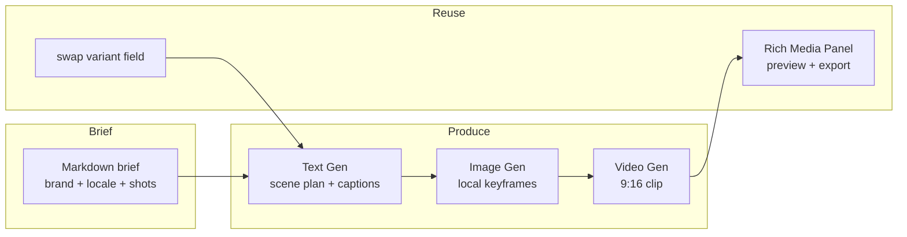
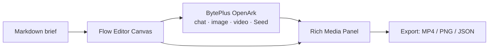

# Knowgrph

**Brief in. Campaign out.** A node canvas where Markdown becomes images — and images become video — orchestrated by AI. Built for solo creators who already know CapCut and need to go further without starting over.

> Not a replacement. An extension.

---

## The problem — the middle is empty

Every creator eventually hits a ceiling. The tool that got them here can't take them further.

| | Too sophisticated | Just right | Too simple |
|---|---|---|---|
| **Tool** | Node-graph editors · Higgsfield | **← Knowgrph fits here →** | CapCut |
| **Learning curve** | Hours to days | Minutes | Seconds |
| **Local context** | Possible but manual | Built-in to the brief | None |
| **Variants** | Manual wiring | Swap one field, N exports | Full re-edit |
| **Who it's for** | Technical users | **Solopreneurs · freelancers · creators** | Anyone |

CapCut is fast for one video. It breaks when a creator needs ten — same brand, three markets, two formats. Every variant is a full manual re-edit. No brand memory. No locale context. No pipeline.

Node-graph editors are too steep. Higgsfield is powerful but context-blind — it doesn't know that Eid gifting is not Christmas gifting, that a Wild West frontier aesthetic needs a different energy than a Caribbean island, or that your brand font is not the default.

**Knowgrph is the middle path** — structured enough to scale, simple enough to start in minutes.

---

## Who it's for — global emerging market creators

The ICP is not a geography. It's a situation: **a solo creator, freelancer, or one-person business in a fragmented emerging market who makes content for a local audience and needs local context baked in.**

This person exists in:
- Southeast Asia (Jakarta, Manila, Bangkok, Ho Chi Minh City, Singapore)
- Latin America (Mexico City, São Paulo, Bogotá, Buenos Aires)
- MENA (Cairo, Riyadh, Lagos, Dubai)
- South Asia (Mumbai, Dhaka, Karachi)
- Frontier markets everywhere — including the US creator economy's long tail and the Caribbean

What they share: they already use CapCut. They've hit a ceiling. They want to ship more, faster, without a learning curve. They want a tool that knows their market, their language, their cultural moment — without having to explain it every time.

**They don't want to replace CapCut. They want something that picks up where CapCut stops.**

---

## The insight — extend, don't replace

Knowgrph augments the CapCut workflow. It doesn't compete with it.

A CapCut creator already knows what good video looks like. Knowgrph handles the part that kills them: re-editing the same brief six times by hand for six markets.

If you can write a scene plan as structured Markdown, then:
- **AI becomes the orchestrator** — text node produces localised scene plans, image node renders culturally-grounded keyframes, video node composes the clip
- **The brief becomes brand memory** — palette, font, tone, cultural context, locale — locked once, inherited by every downstream node
- **Upstream change → downstream recompute** — swap one field, every variant updates automatically

```
CapCut creator → hits variant ceiling
→ gets Knowgrph template from a creator group
→ runs once → ships 6 variants
→ shares template forward → new creator joins
```

Template sharing is the distribution loop, same as CapCut templates spread today. Every share is a distribution event.

---

## What it does

One Markdown brief. Three pipeline stages. N variants.



The brief carries three locked layers:

```markdown
## Campaign brief · variant: US-WEST
Brand: SkyKids · Palette: amber, sand · Tone: frontier · adventurous
Product: RoboDrone X1 · Age: 8–14 · Price: $49
— parent layer —
Trust: obstacle-sense / 20-min flight / crash-proof shell
— child adventure layer —
Shot 1: boy on mesa cliff, sunrise, drone launches
Shot 2: ghost mustang herd charges across sky-plain above canyon
Shot 3: drone banks through cathedral arch light beams
CTA: "Ship it before school break!" · Format: 9:16 · Platform: TikTok US
```

Swap `variant: US-WEST` → `variant: CARIBBEAN`. Hook rewrites. Keyframes change. Video recomposes. **Zero manual re-edit.**

---

## Demo — RoboDrone X1 · Three Skies

Same drone. Three worlds. Three completely different children. Three completely different reasons a parent buys it.

**US · Wild West frontier mesa**
- Real scene: boy on sandstone cliff at sunrise, canyon below
- Multiverse: ghost mustang herd charges silver across a sky-plain above the canyon; spectral frontier town hangs inverted from the clouds; drone leads the stampede through cathedral light arches
- Parent trust: crash-proof shell, obstacle-sense, 20-min flight
- Hook: *"Lead the ghost herd. Own the frontier."*

**Caribbean · island tempest**
- Real scene: girl on white-sand beach, tropical storm rolling in off turquoise water
- Multiverse: drone punches through the rain wall; mermaid queen rises from the deep — coral crown, bioluminescent scales; drone descends as her herald through a cathedral of lightning-lit coral spires
- Parent trust: waterproof-rated, obstacle-sense, crash-proof shell
- Hook: *"Fly the tempest. Serve the queen."*

**Singapore · Marina Bay → RoboTown**
- Real scene: girl on Marina Bay promenade at blue-hour dusk
- Multiverse: Merlion morphs to 100m chrome AI sentinel with amber scanning eyes; city becomes RoboTown — sensor arrays, drone corridors, neural grid bay; girl's drone ascends to command position
- Parent trust: precision sensors, 20-min flight, crash-proof shell
- Hook: *"Command the future. Your city. Your drone."*

**Canvas reveal:** pull-back from SG command position — three locale scenes materialise as glowing nodes on a dark canvas, connected by luminous bezier threads. Three parent silhouettes at each node base. A cursor hovers. One brief. Three multiverses.

---

## Architecture

Client-first. The browser handles parsing, rendering, and orchestration. AI APIs called directly from the canvas. No heavy backend required.



| Layer | Technology |
|---|---|
| Frontend | React 18 + TypeScript + Vite 6 |
| 2D / 3D | D3.js · Three.js + R3F |
| Markdown | markdown-it + Mermaid + KaTeX |
| AI runtime | BytePlus OpenArk (chat · image) + Seed (video) |
| Local DB | RxDB — offline-first |
| Parsers | Python 3.10+ — NetworkX · DuckDB |
| Payments | Stripe — subscription + usage |
| Deployment | Cloudflare Pages (PWA) — airvio.co/knowgrph |

Shell: ~248 KB gzip. Monaco, Mermaid, Three.js lazy-loaded.

---

## Business model

**Workspace subscription** — canvas, collaboration, storage, template library.  
**Usage-based compute** — per-image and per-second pricing with explicit budget caps. No surprise bills.  
**Template marketplace** — creators sell locale-aware pipeline templates; buyers get a proven brief-to-video workflow, not just a prompt.

---

## Roadmap

**Now** — brief→video pipeline, BytePlus OpenArk + Seed, Flow Editor Canvas, Stripe gating  
**Next** — batch variant generation, eval harness, scene template library, MCP server  
**Later** — mobile-first brief editor (form UI over Markdown), real-time collaboration, plugin system

---

## The ask

**Design partners** — solo creators and freelancers who've hit the CapCut ceiling and are shipping content across 2+ markets or languages.  
**Distribution intros** — creator community leads, influencer networks, TikTok Shop / Shopee seller communities in any emerging market.  
**Locale briefs** — real-world campaign specs to encode as Markdown pipelines and seed the template marketplace.

If you believe video creation should be as reusable as code — declarative, local-aware, automatable — let us build it together.

---

**Demo:** airvio.co/knowgrph  

> *"Write it. See it. Ship it."*