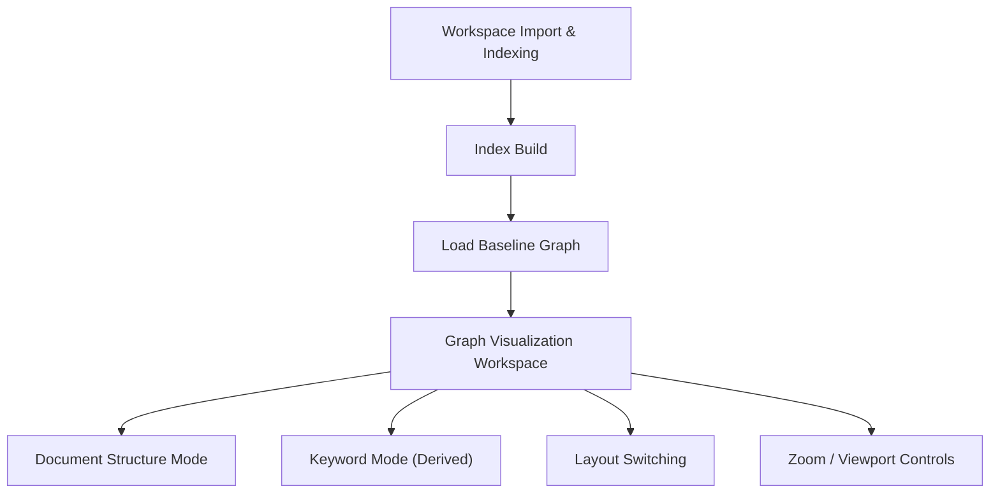

## 1. Product Overview
Speed up the in-repo pipeline (import → index → load → render) and make Keyword Mode reuse the Document Structure Mode baseline.
Ensure mode/layout/zoom switching behaves consistently and predictably across graph updates.

## 2. Core Features

### 2.1 User Roles
Not role-based. All users access the same workspace features.

### 2.2 Feature Module
1. **Workspace Import & Indexing**: GitHub repo import, indexing progress, cancellation, caching, failure reporting.
2. **Graph Visualization Workspace**: Document Structure baseline rendering, Keyword Mode derived view, layout controls, viewport/zoom controls, performance-safe rendering.

### 2.3 Page Details
| Page Name | Module Name | Feature description |
|---|---|---|
| Workspace Import & Indexing | Repo import (in-repo) | Import a GitHub repo/folder into the workspace; show phase-based progress (listing/fetching/writing); allow cancel; cap/communicate truncation limits. |
| Workspace Import & Indexing | Index build (document baseline) | Build/refresh a Document Structure baseline index from imported files using incremental parsing; reuse parse cache when inputs are unchanged. |
| Workspace Import & Indexing | Index build (keyword view inputs) | Derive keyword source text inputs from the same baseline artifacts (sections/blocks/text) to avoid parallel pipelines. |
| Workspace Import & Indexing | Performance diagnostics | Display key timings for each stage (import/index/load/render) and cache hit rates; surface the slowest file/parser stage in error/warning summaries. |
| Graph Visualization Workspace | Baseline render (Document Structure Mode) | Render the baseline graph as the default view; preserve selection/media overlays when graph updates. |
| Graph Visualization Workspace | Keyword Mode (refactored) | Toggle Keyword Mode as a derived projection of the baseline (not a standalone graph generator); keep media-capable nodes for overlays; keep metadata hashes to prevent stale views. |
| Graph Visualization Workspace | Layout switching | Switch layout modes without breaking selection/viewport invariants; apply layout changes as staged transitions (compute → commit). |
| Graph Visualization Workspace | Zoom/viewport controls | Fit-to-screen, pin-to-view, zoom-to-selection; ensure these policies remain consistent across mode/layout changes and graph recomputation. |
| Graph Visualization Workspace | Baseline lock safety | When baseline lock is enabled, prevent mode/layout/renderer switches that would invalidate the baseline experience; explain via toast. |

## 3. Core Process
### Import → Index → Load → Render flow
1) You import a repo (or folder). The app lists eligible files, fetches them, then writes them into the workspace with a progress indicator and clear truncation warnings.
2) You trigger (or auto-trigger) indexing. The app incrementally parses changed files only, updating a baseline Document Structure graph index and storing cache artifacts.
3) You load the resulting baseline graph into the canvas. The app applies layout without blocking the UI, then commits a single graph update.
4) You render and interact. The canvas draws progressively (coarse → refined) and keeps selection and viewport stable.

### Mode / layout / zoom switching invariants (must always hold)
- **Baseline identity**: Document Structure Mode is the canonical “baseline graph.” Keyword Mode is a derived view over the same baseline inputs.
- **No surprise camera jumps**: Switching semantic mode MUST NOT change camera transform unless the user explicitly invokes Fit-to-screen/Fit-to-view.
- **Pinned means pinned**: If Pin-to-view is enabled, graph updates (including mode/layout changes) MUST preserve the camera transform.
- **Focused selection policy**: If Zoom-to-selection is enabled, mode/layout changes MUST keep the camera centered on the active selection; if selection becomes invalid, gracefully disable Zoom-to-selection.
- **Selection continuity**: Switching modes/layouts MUST attempt to map selection by stable node/edge IDs; if mapping fails, clear selection with a single user-visible reason.
- **Layout is orthogonal**: Layout mode changes MUST NOT mutate semantic mode; semantic mode changes MUST NOT silently change layout mode.
- **Renderer is orthogonal**: Switching 2D renderer (D3/Flow/Design/Flow Editor) MUST reuse the same graph + view state contract.
- **Media overlay continuity**: Media-capable nodes/overlays MUST remain available across modes when possible (e.g., Keyword Mode merges media nodes).
- **Staleness prevention**: Any derived view (Keyword Mode) MUST carry a deterministic source hash and invalidate caches when the baseline text changes.

