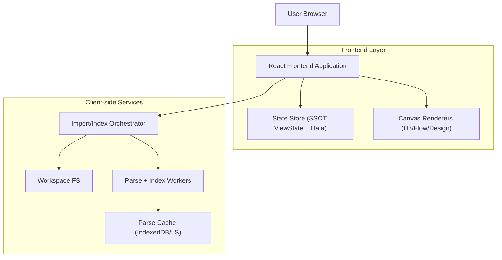
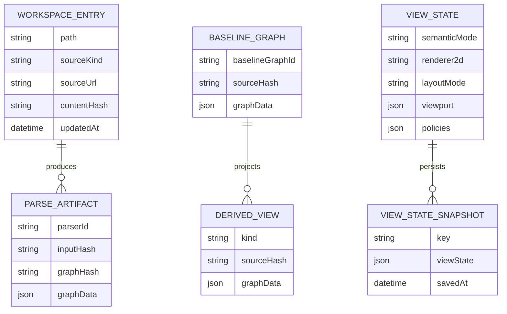

## 1.Architecture design

## 2.Technology Description
- Frontend: React@18 + TypeScript + vite
- State: Zustand (existing store slices; treat view/interaction as SSOT)
- Rendering: D3 (2D), plus existing Flow/Design renderers
- Concurrency: Web Workers (parsing/indexing/layout computation where applicable)
- Storage: LocalStorage (small settings) + IndexedDB (large parse/index caches; optional but recommended)
- Backend: None

## 3.Route definitions
| Route | Purpose |
|---|---|
| / | Single-page workspace: import/index + canvas render + panels |

## 6.Data model(if applicable)
### 6.1 Data model definition

### 6.2 Data Definition Language
No database DDL. Persist caches via IndexedDB and/or LocalStorage.

## Key architectural decisions (performance + refactor)
1) **Pipeline stage boundaries**
- Import: network + write-only; avoid parsing during file fetch.
- Index: incremental parse; only changed inputs recompute artifacts.
- Load: compose baseline graph once per commit (batch state update).
- Render: progressive draw; keep camera/selection stable via SSOT ViewState.

2) **Incremental caching**
- Key parse cache by `(parserId, workspacePath, inputHash)`.
- Key baseline graph by `baselineSourceHash` (rolled up from relevant workspace entries).
- Key Keyword Mode derived view by the same `baselineSourceHash` to guarantee staleness correctness.

3) **Keyword Mode refactor to reuse baseline**
- Introduce a “baseline extraction” layer that emits canonical text blocks/sections from the Document Structure pipeline.
- Keyword graph derivation consumes baseline extraction output (not raw editor text) and merges baseline-required node types (e.g., media-capable overlay nodes).

4) **ViewState SSOT + invariants enforcement**
- Model `ViewState = { semanticMode, renderer2d, layoutMode, viewportTransform, policies }`.
- Enforce orthogonality: mode/layout/renderer toggles update only their domain fields.
- Make zoom policies deterministic: pin-to-view and zoom-to-selection are evaluated on every graph commit.

5) **Render safety**
- Avoid full teardown on graph commits: diff nodes/edges where possible; reuse D3 simulation objects when IDs are stable.
- Keep heavy computations (keyword extraction, community detection, large layout) off the main thread when feasible.
