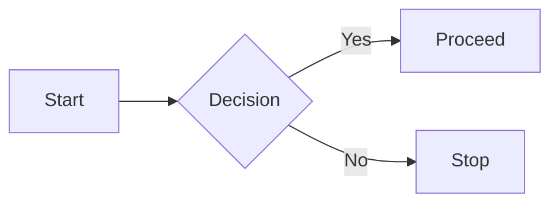
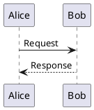

---
layout: cover
class: text-center
background: https://placehold.co/1920x1080?text=Cover+Image
transition: slide-left
---

# Markdown Slide Demo

**Goal:** End‑to‑end demo of markdown slide rendering in the viewer.

This deck mirrors the styling capabilities described in the *Markdown Slide Styling Guidelines*.

---

## Academic Theme Metadata

This presentation uses the **Academic / Metadata** keys in the frontmatter to render the footer you see at the bottom of the screen.

**Frontmatter configuration:**

```yaml
theme: academic
authors:
  - A. Researcher
  - B. Scientist
meeting: "Example Research Meeting"
institution: "Example Research Group"
date: "2026-01-12"
venue: "Example City"
url: "https://example.com"
```

The footer persists on all slides (except `cover` and `intro`) and displays:
- Theme-dependent footer content (meeting/authors/institution/page)

**Themes:**
- `theme: academic`: Meeting + Authors (Left), Institution/Venue + Page X / Y (Right)
- `theme: default`: Meeting/Venue/Institution/Date (Left), Authors/URL (Right), Page Numbers (Right)

---

## Text Styling

**Bold:** **important**  
**Italic:** *emphasis*  
**Bold+Italic:** ***very important***  
**Underline:** <u>underlined text</u>  
**Highlight:** ==highlighted text==  
**Strikethrough:** ~~deprecated~~  
**Subscript:** H~2~O  
**Superscript:** E=mc^2^  
**Inline code:** `code-span`

Inline hover text (native tooltip):

Hover over this term: <abbr title="Interactive markdown and graph viewer">Canvas Viewer</abbr>

Custom span for framework utility classes:

<span class="text-emerald-400 font-semibold">Tailwind‑style span with custom color</span>

---

## Lists and Tasks

**Unordered list**

- Item one
- Item two
  - Nested item A
  - Nested item B

**Ordered list**

1. First step
2. Second step
3. Third step

**Task list**

- [x] Connect markdown editor
- [x] Enable presentation mode
- [ ] Ship this deck to production

---

## Tables and Alignment

Basic table:

| Column A | Column B | Column C |
|----------|----------|----------|
| Alpha    | Bravo    | Charlie  |
| Delta    | Echo     | Foxtrot  |

Alignment:

```markdown
| Metric | Before | After |
|:-------|-------:|:-----:|
| Speed  |  3.2s  | 0.8s  |

Line breaks and code in tables:

| Feature | Details |
|---------|---------|
| Break   | Line 1<br>Line 2 |
| Code    | `inline code` inside cell |
| Pre     | <pre>block code</pre> |

---

## Footnotes and Heading IDs

This slide demonstrates footnotes[^1] and custom heading IDs.

### Custom ID Heading {#my-custom-id}

Link to [Custom ID Heading](#my-custom-id).

[^1]: This is a footnote rendered at the bottom of the slide.
```

Rendered:

| Metric | Before | After |
|:-------|-------:|:-----:|
| Speed  |  3.2s  | 0.8s  |

---

## Blockquotes and Horizontal Rules

> **Single‑line quote**
>
> Presentation‑ready markdown with clear visual hierarchy.

> **Multi‑line quote with list**
>
> - Point one
> - Point two
> - Point three

Horizontal rules inside a slide:

***

Content below the rule stays on the same slide.

---

## Code Blocks with Syntax Highlighting

```javascript
function greet(name) {
  return `Hello, ${name}!`
}

console.log(greet('Demo'))
```

```python
def square(x: int) -> int:
    return x * x

print(square(7))
```

```bash
curl https://api.example.com/health
```

---

## Code Line Highlighting and Steps

```js {1,3-5}
const a = 1          // highlighted
const b = 2
const c = 3          // highlighted
const d = 4          // highlighted
const e = 5          // highlighted
```

Progressive steps:

```js {1|3-5|all}
// Step 1: show heading line only
// Step 2: reveal core block (lines 3‑5)
// Step 3: show all lines
```

Line numbers:

```python {lines:true}
def example():
    total = 0
    for i in range(5):
        total += i
    return total
```

---

## Diff and Editable Code (Structural)

Diff syntax:

```diff
- removed_line()
+ added_line()
  unchanged_line()
```

Editable code (Monaco‑style structural marker):

```js {monaco}
const editable = true
const message = 'Edit me in the embedded editor'
```

---

## Math and LaTeX

Inline math: The famous equation is $E = mc^2$.

Block math:

$$
\int_{-\infty}^{\infty} e^{-x^2} \, dx = \sqrt{\pi}
$$

Matrix:

$$
\begin{bmatrix}
1 & 0 \\
0 & 1
\end{bmatrix}
$$

Backslash delimiters:

Inline: The same equation written as \(E = mc^2\).

Display:

\[
\sum_{i=1}^{n} i = \frac{n(n+1)}{2}
\]

---

## Images and Backgrounds

Basic image:


Sized images:


Background image semantics (structural for this demo):


---

## Links and Auto‑Links

Standard links:

- [Project repository](https://example.com)
- [Markdown Slide Styling Guidelines](https://huijoohwee.github.io/guidelines/markdown-slide-styling-guidelines)

Link with title:

[External docs](https://example.com "Example documentation site")

Auto‑linked URL:

<https://example.com>

---

---
layout: two-cols
class: text-left
---

## Two‑Column Layout (Native)

Left column content

- One
- Two
- Three

::right::

Right column content

- A
- B
- C

---

## Click‑Based Progressive Disclosure

Group animation:

<v-clicks>

- Appears on click 1
- Appears on click 2
- Appears on click 3

</v-clicks>

Individual fragments:

<v-click>Appears first</v-click>

<v-click at="2">Appears second</v-click>

<v-click at="3">Appears third</v-click>

---

## Inline Text Markers

Markers that participate in fragment stepping:

<v-mark color="red">red highlight</v-mark>  
<v-mark color="yellow">yellow highlight</v-mark>  
<v-mark type="circle">circled content</v-mark>  
<v-mark type="underline">underlined content</v-mark>  
<v-mark type="strike-through">struck content</v-mark>

These markers are parsed structurally and treated as fragments by the viewer.

---

---
layout: center
class: text-center
background: '#111827'
transition: fade
fragments:
  enabled: true
  steps: 3
---

# Fragment Animations

<p class="fragment">Default fade‑in (step 1)</p>
<p class="fragment fade-up" data-fragment-index="2">Fade up (step 2)</p>
<p class="fragment highlight-red" data-fragment-index="3">Highlight red (step 3)</p>

---

## Custom CSS Classes and Utilities

Framework utility classes applied via HTML:

<div class="text-center opacity-50">
  Centered, semi‑transparent text
</div>

<div class="grid grid-cols-3 gap-4 mt-4">
  <div class="bg-slate-800 p-2">Column 1</div>
  <div class="bg-slate-800 p-2">Column 2</div>
  <div class="bg-slate-800 p-2">Column 3</div>
</div>

---

## Absolute Positioning and Grid Layouts

<div class="relative h-48 bg-slate-900">
  <div class="absolute top-2 left-2 bg-emerald-600 px-2 py-1">
    Top‑left
  </div>
  <div class="absolute bottom-2 right-2 bg-sky-600 px-2 py-1">
    Bottom‑right
  </div>
  <div class="absolute top-1/2 left-1/2 -translate-x-1/2 -translate-y-1/2 bg-indigo-600 px-3 py-2">
    Center
  </div>
</div>

Grid examples:

<div class="grid grid-cols-2 grid-rows-2 gap-2 mt-4">
  <div class="bg-slate-800 p-2">Cell 1</div>
  <div class="bg-slate-800 p-2">Cell 2</div>
  <div class="bg-slate-800 p-2">Cell 3</div>
  <div class="bg-slate-800 p-2">Cell 4</div>
</div>

---

## Diagrams: Mermaid and PlantUML

Mermaid diagram:



PlantUML (structural only):



---

---
layout: center
class: text-center
background: linear-gradient(135deg, #667eea, #764ba2)
transition: zoom
fragments:
  enabled: true
  steps: 2
---

# Speaker Notes and Directives

Visible slide content for the audience.

<!--
Speaker notes:
- Not visible to the audience
- Accessible in presenter mode
-->

Note:
- This section demonstrates note‑style speaker notes
- Use for quick talking points per slide

---

## Global and Slide‑Level Configuration

Aspect ratio is set globally to **16:9** in the deck frontmatter.

Per‑slide configuration overrides:

```yaml
---
layout: center
class: text-center
background: '#1a1a2e'
transition: fade
fragments:
  enabled: true
  steps: 3
---
```

Font configuration (structural in this viewer):

```yaml
fonts:
  sans: 'Inter'
  serif: 'Merriweather'
  mono: 'Fira Code'
  provider: 'google'
```

---

## Drawing Mode and Multi‑Language Support

Drawing mode (structural toggle):

```yaml
drawings:
  enabled: true
  persist: false
  presenterOnly: false
```

Language and direction:

```yaml
lang: en-US
# lang: zh-CN

dir: ltr
# dir: rtl
```

These keys are parsed structurally and can be used by compatible presentation frameworks.

---

## Best Practices Recap

Content structure:

- One main concept per slide
- Aim for ≤ 6 bullet points
- Prefer visuals over dense paragraphs

Code presentation:

- Highlight changed lines
- Keep blocks small and focused
- Always specify language hints for syntax highlighting

Accessibility:

- Maintain high contrast
- Use readable font sizes
- Provide alternative text for images

---

## End of Demo

You can now:

- Load this markdown file into the markdown viewer
- Toggle between viewer and presentation modes
- Step through fragments, clicks, and animations

This deck is designed as a compact, production‑ready demo of the markdown slide rendering capabilities.
