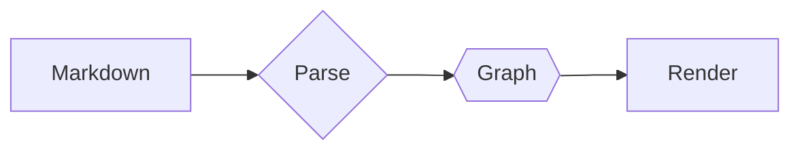

# Markdown Parsing + Rendering (All Modes)

Use this single file to validate end-to-end behavior across Infinite Canvas + all renderers/modes.

> [!tip] One-file SSOT
> This markdown is intentionally dense: headings, callouts, tables, lists, code fences, mermaid, HTML, media, GeoJSON, and internal links.

---

## Mode Matrix

| Mode | What to verify (from this markdown) |
| --- | --- |
| Infinite Canvas | Markdown blocks become nodes (Document/Section/Paragraph/Table/Code) |
| 2D (D3) | Mermaid diagram nodes/edges + internal links navigation |
| 2D (Flow) | Frontmatter Flow nodes/ports/typed edges |
| 2D (Design) | Layers by `category` and overlays by `'kg:subgraphs'` |
| 2D (Flow Editor) | Overlay-first Node Quick Editors + port handles (ComfyUI-like) |
| 3D | Shape parity (diamond/hex + media nodes) |
| Frontmatter On/Off | Mermaid-in-frontmatter + Flow overlay vs body-only |
| Geospatial On/Off | `geojson` fences become map layers |
| Structure / Keywords | Headings/tree + tag clusters |

---

## Quick Checklist (by mode)

### Infinite Canvas

- Pan/zoom across this document's block-nodes.
- Confirm these blocks become distinct nodes: this callout, tables, mermaid fences, code fences, GeoJSON.

### 2D Renderer (D3)

- Confirm Mermaid nodes/edges appear and are selectable.
- Click internal links in this markdown and verify navigation.

### 2D Renderer (Flow)

- Confirm frontmatter nodes/edges render as a typed flow graph.
- Confirm `category` creates layer/depth differences.

### 2D Renderer (Design)

- Toggle layers/subgraphs: `AI Generation (Cluster)` and `Publish (Subgraph)`.
- Confirm groups/clusters have visible boundaries.

### 2D Renderer (Flow Editor)

- You should see Node Quick Editors (not node glyphs) for Flow nodes.
- Connect ports using the overlay handle dots.
- Try ComfyUI-like workflow in the section below.

### 3D Mode

- Confirm the same graph is rendered in 3D and preserves selection.

### Frontmatter Mode On/Off

- Off: only the markdown body graph.
- On: includes frontmatter Mermaid + frontmatter Flow graph overlays.

### Geospatial Mode On/Off

- On: GeoJSON renders as map layers.
- Off: GeoJSON stays as a fenced block and does not affect the canvas.

### Document Structure / Keyword Mode

- Structure mode shows a heading tree.
- Keyword mode clusters tags like `#canvas`, `#flow`, `#geo`.

## Flow (Frontmatter) ↔ Markdown Links + Template Vars

- [[NODE_SCRIPT]] provides `{{title}}` + `{{script}}`.
- [[NODE_PROMPT]] builds the prompt consumed by [[NODE_KEYFRAME]] and [[NODE_VIDEO]].
- [[NODE_CAPTION]] formats a caption using `{{title}}` / `{{script}}`.
- [[NODE_RENDER]] is the final output node.

### Flow Editor: ComfyUI-like Video Generation

This section is designed to look and feel like a ComfyUI workflow in **2D Renderer (Flow Editor)**.

1. Open Flow Editor.
2. You should immediately see Quick Editors for:
   - [[NODE_KEYFRAME]] (model `generate_image`)
   - [[NODE_VIDEO]] (model `generate_video`)
3. Inspect these fields in the Quick Editor UI:
   - `model`, `prompt`, `aspect_ratio`, `duration`, `resolution`, `fast`, `generate_audio`, `reference_image`
4. Use port handles to connect:
   - `NODE_KEYFRAME.image_url_out → NODE_VIDEO.reference_image_in`
   - `NODE_PROMPT.prompt_out → NODE_VIDEO.prompt_in`

| Node | Purpose | Key property fields you should see |
| --- | --- | --- |
| `NODE_KEYFRAME` | Create a reference image | `model=generate_image`, `prompt`, `aspect_ratio`, `resolution` |
| `NODE_VIDEO` | Generate a 5-second clip | `model=generate_video`, `prompt`, `duration=5`, `resolution`, `generate_audio` |

> [!info] Template vars inside a blockquote
> Caption preview: **{{title}}** — {{script}}

| Field | Source | Example |
| --- | --- | --- |
| Title | `NODE_SCRIPT.title_out` | {{title}} |
| Script | `NODE_SCRIPT.script_out` | {{script}} |

---

## Mermaid ↔ Markdown Jump Targets

**Mermaid → Markdown jump targets (click directives in frontmatter):**
- Phase 1 Input → [[#Phase 1 Input (Mermaid S1)]]
- Phase 2 Transform → [[#Phase 2 Transform (Mermaid S2)]]
- Phase 3 Report → [[#Phase 3 Report (Mermaid S3)]]
- Phase 4 Output → [[#Phase 4 Output (Mermaid S4)]]

<a id="phase-1-input"></a>
#### Phase 1 Input (Mermaid S1)

Aggregator DB represents an ingest junction. ^mermaid-s1-port

<a id="phase-2-transform"></a>
#### Phase 2 Transform (Mermaid S2)

This paragraph is a block-link target: decision point “Validate?” ^mermaid-s2-decide

<a id="phase-3-report"></a>
#### Phase 3 Report (Mermaid S3)

Block-link target: render surface “Render 2D/3D”. ^mermaid-s3-render

<a id="phase-4-output"></a>
#### Phase 4 Output (Mermaid S4)

Block-link target: publish/store step. ^mermaid-s4-pub

**Block link examples (same note):**
- Jump to decision block: [[#^mermaid-s2-decide]]
- Jump to render block: [[#^mermaid-s3-render]]

---

## Rich Media (Image / Video / Iframe / YouTube)


[](https://example.com/)

YouTube (provider embed): https://www.youtube.com/watch?v=dQw4w9WgXcQ

Short link variant: https://youtu.be/dQw4w9WgXcQ


<iframe src="https://example.com/" title="Example iframe"></iframe>

---

## Code Blocks + Mermaid Fence

```ts
export type DemoMode = 'infinite-canvas' | 'd3' | 'flow' | 'design' | 'flow-editor' | '3d'
```



---

## Geospatial Mode (Embedded GeoJSON)

Turn **Geospatial Mode ON** to render these layers.

```geojson
{
  "type": "FeatureCollection",
  "features": [
    {
      "type": "Feature",
      "properties": { "name": "Demo Point", "kind": "poi", "tag": "#geo" },
      "geometry": { "type": "Point", "coordinates": [103.8198, 1.3521] }
    },
    {
      "type": "Feature",
      "properties": { "name": "Demo Line", "kind": "route", "tag": "#geo" },
      "geometry": {
        "type": "LineString",
        "coordinates": [
          [103.8198, 1.3521],
          [103.851959, 1.290270]
        ]
      }
    }
  ]
}
```

---

## Multi-dimensional Table

| Task | Status | Date | Category    |
| --- | --- | --- | --- |
| Try the Infinite Canvas    | Done  | 2023-08-01 | A,1 |
| Observe what airvio can do | Doing | 2023-08-02 | B,2   |
| Visit airvio               | Done  | 2023-08-03 | 1,Y   |
| Invite and collaborate     | Todo  | 2023-08-08 | 2,Z   |

---

## Document Structure + Keyword Mode

### Keywords

- #canvas #flow #design #flow-editor #d3 #3d #geo

### Section Tags

- Flow + editing: #flow #flow-editor
- Renderers: #d3 #design #3d
- Geospatial: #geo

### Notes

- Use **Document Structure Mode** to inspect heading/tree derivation.
- Use **Keyword Mode** to cluster/tag-filter.
- Toggle **Frontmatter Mode** on/off to compare overlays.

