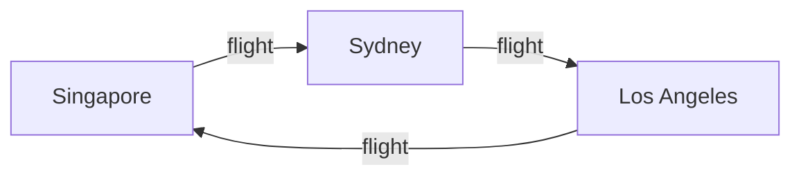

# Trip Demo (Workspace Seed)

Use this file to sanity-check:

- Markdown Viewer
- Presentation mode (slides)
- Gallery renderer
- Mermaid rendering
- Embedded GeoJSON → geospatial layer integration

---

## Slides

---

### Slide 1

This is a slide.

---

### Slide 2

Inline media:

[](https://www.youtube.com/watch?v=nvrJVxb55qY)

---

## Mermaid



---

## GeoJSON

```json
{
  "type": "FeatureCollection",
  "features": [
    {
      "type": "Feature",
      "properties": { "name": "Singapore" },
      "geometry": { "type": "Point", "coordinates": [103.8198, 1.3521] }
    },
    {
      "type": "Feature",
      "properties": { "name": "Sydney" },
      "geometry": { "type": "Point", "coordinates": [151.2093, -33.8688] }
    }
  ]
}
```
