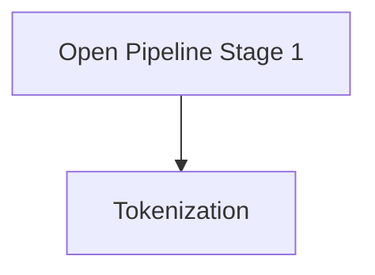

# Storyboard Widget (2D) + D3 Canvas · Demo

This deck includes a **frontmatter-flow graph** (see the YAML block at the top of this file) to demo:

- **Nodes + node quick editors** (smart fields for rich media generation)
- **Edges/flows** with typed ports and port handles
- **Graph layers** via `category` → `visual:layer`
- **Subgraphs / clusters / groups** via `'kg:subgraphs'`

It also includes a separate **2D (D3) editor-mode** section for generic graph editing gestures.

Hover term: <abbr title="The 2D graph renderer built with D3 + SVG">D3 Canvas</abbr>

> [!info] What this demo covers
> - **Storyboard Widget (2D)**: node quick editors + port handles + groups/clusters
> - **2D → D3 → Editor**: interactive graph editing on the canvas
> - **Schema-driven visuals** + per-node overrides (shapes, grouping)

---

## Storyboard Widget Quick Start (2 minutes)

- Open this markdown file in Knowgrph
- Switch to **Canvas → 2D → Storyboard Widget**
- Select **NODE_KEYFRAME** or **NODE_VIDEO**, then open the node quick editor and tweak:
  - `model` (`generate_image` / `generate_video`)
  - `prompt`, `aspect_ratio`, `duration`, `resolution`
- Use port handles to connect:
  - `NODE_KEYFRAME.image_url_out → NODE_VIDEO.reference_image_in`
  - `NODE_PROMPT.prompt_out → NODE_VIDEO.prompt_in`
- Open the **Groups** tab to inspect the `AI Generation (Cluster)` and `Publish (Subgraph)` overlays

### Frontmatter Flow Graph ↔ Markdown Links

- [[NODE_SCRIPT]] → “Script + Metadata” source node（anchor: `#node-script`）feeds `{{title}}` / `{{script}}` in the caption template.
- [[NODE_PROMPT]] → “Prompt Composer” node（anchor: `#node-prompt`）builds the generation prompt used by both [[NODE_KEYFRAME]] and [[NODE_VIDEO]].
- [[NODE_KEYFRAME]] → Image keyframe generator（anchor: `#node-keyframe`）produces an image URL for [[NODE_VIDEO]].
- [[NODE_VIDEO]] → Video generator（anchor: `#node-video`）combines prompt + reference image.
- [[NODE_CAPTION]] → Caption builder（anchor: `#node-caption`）formats the text overlay using `{{title}}` and `{{script}}`.
- [[NODE_RENDER]] → Final render node（anchor: `#node-render`）writes the composed mp4 file.

---

## Quick Start (2 minutes)

- Import the demo JSON on the next slide via **Toolbar → Import → JSON**
- Switch to **Canvas → 2D → D3**
- Set **Workspace View Mode → Editor** (enables editing gestures)

---

## Demo Graph JSON (paste into Import → JSON)

This dataset intentionally mixes:
- Per-node shapes via `properties["visual:shape"]`
- Community groups via `properties["visual:community"]`
- A few seeded `x/y` positions so the first render is stable

```json
{
  "type": "Graph",
  "nodes": [
    {
      "id": "s1",
      "type": "Subject",
      "label": "Subject (hex)",
      "x": -260,
      "y": -40,
      "properties": { "visual:shape": "hex", "visual:community": "1" }
    },
    {
      "id": "e1",
      "type": "Entity",
      "label": "Entity (diamond)",
      "x": -40,
      "y": -40,
      "properties": { "visual:shape": "diamond", "visual:community": "1" }
    },
    {
      "id": "n1",
      "type": "Note",
      "label": "Note (rect)",
      "x": 200,
      "y": -40,
      "properties": { "visual:shape": "rect", "visual:community": "1" }
    },
    {
      "id": "s2",
      "type": "Subject",
      "label": "Subject 2",
      "x": -260,
      "y": 140,
      "properties": { "visual:shape": "hex", "visual:community": "2" }
    },
    {
      "id": "e2",
      "type": "Entity",
      "label": "Entity 2",
      "x": -40,
      "y": 140,
      "properties": { "visual:shape": "diamond", "visual:community": "2" }
    },
    {
      "id": "n2",
      "type": "Note",
      "label": "Note 2",
      "x": 200,
      "y": 140,
      "properties": { "visual:shape": "rect", "visual:community": "2" }
    }
  ],
  "edges": [
    { "id": "a", "source": "s1", "target": "e1", "label": "relatesTo" },
    { "id": "b", "source": "e1", "target": "n1", "label": "mentions" },
    { "id": "c", "source": "s2", "target": "e2", "label": "relatesTo" },
    { "id": "d", "source": "e2", "target": "n2", "label": "mentions" },
    { "id": "e", "source": "e1", "target": "e2", "label": "connects" }
  ]
}
```

---

## What To Try (Editor Gestures)

- **Click** a node/edge to select it (selection highlight updates)
- **Drag** a node to reposition it (positions commit back into the graph)
- **Shift-click** a source node to start edge creation, then **click** a target node to finish
- **Double-click** a node to open the properties panel; when enabled, it can also zoom to selection

> [!tip] If you don’t see group boxes
> Ensure groups are enabled in the schema (`layout.groups.enabled`). Community groups come from `properties["visual:community"]`.

---

## Frontmatter Configuration (fully supported in Knowgrph viewer)
## Frontmatter 配置（Knowgrph 视图完全支持）

```yaml
---
theme: default
background: /cover.svg
class: text-center
transition: slide-left
layout: cover
aspectRatio: '16/9'
lang: en-US
mermaid: |
  graph LR
    A[Start] --> B[End]
---
```

**Purpose**: Configures presentation-wide settings via YAML metadata block
**用途**：通过 YAML 元数据块配置整份演示的全局属性

**Common keys**: `theme`, `background`, `class`, `transition`, `layout`, `aspectRatio`, `lang`
**常用键**：`theme`、`background`、`class`、`transition`、`layout`、`aspectRatio`、`lang`

**Academic / Metadata keys (fully supported):**
**学术 / 元数据键（完全支持）：**
- `authors`: List of authors (string or array)
- `meeting`: Conference or meeting name
- `date`: Presentation date
- `venue`: Presentation venue
- `institution`: Institution or organization name (displays in footer)
- `url`: Link to paper or project
- `theme`: Theme style (e.g., `default`, `academic`)
- `mermaid`: Global mermaid diagram definition (string)

### Node Shapes Demo (Mermaid + Canvas)
### 节点形状示例（Mermaid + Canvas）

The diagram in this file intentionally uses Mermaid flowchart shape syntax (diamond `{}` and hexagon `{{}}`) to exercise the Canvas node-shape pipeline in both 2D and 3D renderers.
本文件中的 Mermaid 流程图刻意使用菱形 `{}` 和六边形 `{{}}` 语法，以便在 2D 与 3D 渲染器中共同验证 Canvas 的节点形状管线。

### YAML Mermaid Frontmatter ↔ Knowgrph Links/Backlinks/Callouts (MECE demo)

> [!note] Internal links / 内部链接
> - Wikilink syntax: `[[Note Name]]` (file-level link)
> - Link to a heading in this note: `[[#Heading]]`
> - Link to a block in this note: `[[#^block-id]]`
> - Markdown link syntax: `[label](path-or-url)` (URL-encode spaces when needed)

> [!tip] Backlinks (Backlinks plugin) / 反向链接（Backlinks 插件）
> - Linked mentions: another note contains an explicit internal link to this note (e.g., `[[Markdown Slide Demo]]`).
> - Unlinked mentions: another note contains an unlinked occurrence of this note name (depending on plugin settings).
> - This file is single-note by design; use the syntax below to create cross-note backlinks in a Knowgrph vault without changing this demo.

> [!example] Callouts / Callout
> Callouts are blockquotes whose first line includes `[!type]`, for example `[!info]`, `[!tip]`, `[!warning]`, `[!question]`. Add `+` or `-` after the type to make it foldable.

**Mermaid → Markdown jump targets (click directives in frontmatter):**
- Phase 1 Input → [[#Phase 1 Input (Mermaid S1)]]
- Phase 2 Transform → [[#Phase 2 Transform (Mermaid S2)]]
- Phase 3 Report → [[#Phase 3 Report (Mermaid S3)]]
- Phase 4 Output → [[#Phase 4 Output (Mermaid S4)]]

<a id="phase-1-input"></a>
#### Phase 1 Input (Mermaid S1)

The Mermaid node `S1_Port` links here (frontmatter `click S1_Port ...`).
Continue to: [[#Phase 2 Transform (Mermaid S2)]]

Aggregator DB represents an ingest junction (e.g., Source Files folder handle). ^mermaid-s1-port

<a id="phase-2-transform"></a>
#### Phase 2 Transform (Mermaid S2)

The Mermaid node `S2_Decide` links here.
Continue to: [[#Phase 3 Report (Mermaid S3)]]

This paragraph is a block-link target: decision point “Validate?” ^mermaid-s2-decide

<a id="phase-3-report"></a>
#### Phase 3 Report (Mermaid S3)

The Mermaid node `S3_Render` links here.
Continue to: [[#Phase 4 Output (Mermaid S4)]]

Block-link target: render surface “Render 2D/3D”. ^mermaid-s3-render

<a id="phase-4-output"></a>
#### Phase 4 Output (Mermaid S4)

The Mermaid node `S4_Pub` links here.
Back to: [[#Multi-Dataset Geospatial Demo (Airports + Countries + Cities)]]

Block-link target: publish/store step. ^mermaid-s4-pub

**Block link examples (same note):**
- Jump to decision block: [[#^mermaid-s2-decide]]
- Jump to render block: [[#^mermaid-s3-render]]

### Mermaid Render Ordering (schema-driven)
### Mermaid 渲染顺序（由 schema 驱动）

Mermaid syntax does not specify z-order rules beyond draw order. For deterministic layering in the Canvas Mermaid layout, configure renderer ordering in the graph schema (not inside the Mermaid diagram text).
Mermaid 语法本身除了绘制顺序外并不定义 z 轴层级；要在 Canvas 的 Mermaid 布局中获得可预测的分层效果，应当在图 schema 中配置渲染顺序，而不是在 Mermaid 文本里硬编码。

```json
{
  "layout": {
    "mermaid": {
      "renderOrder": {
        "MermaidSubgraph": -10,
        "MermaidNode": 0,
        "edge": 10
      }
    }
  }
}
```

**Effect**: When these keys are present, a persistent footer is rendered on slides (except `cover` and `intro` layouts).
**效果**：当 schema 中存在上述配置时，除 `cover` 与 `intro` 布局外，其余幻灯片都会渲染持久页脚。

- **Default Theme**: Meeting/Venue/Institution/Date (Left), Authors/URL (Right), Page Numbers (Right).
  **默认主题**：左侧显示会议 / 场地 / 机构 / 日期，右侧显示作者 / URL 与页码。
- **Academic Theme** (`theme: academic`): Meeting + Authors (Left), Institution/Venue + Page X / Y (Right). (`neversink` is accepted as a legacy alias.)
  **学术主题**（`theme: academic`）：左侧显示会议名 + 作者，右侧显示机构 / 场地 + 第 X / Y 页。（`neversink` 作为历史别名仍然被接受。）

---

## Computing Data Flows (Storyboard Widget + Node Quick Editor)
## 计算数据流（Storyboard Widget + Node Quick Editor）

**Goal / 目标**: demonstrate **connected input values** and **computed outputs** inside the Storyboard Widget, using the Node Quick Editor registry (no external Flow libraries).

### Demo steps / 演示步骤

- Import the JSON below via **Toolbar → Import → JSON**.
- The app auto-switches to **Canvas → 2D → Storyboard Widget** (because the imported graph contains `flow:nodeQuickEditorRegistry`).
- Click the `ColorPreview` node and open the Node Quick Editor.
- Observe per-field **Connected:** hints for `r/g/b`, plus computed `color` and `textColor`.
- Use **Apply** (per-field) or **Apply All** (empty fields) to materialize computed values into `node.properties`.

```json
{
  "kind": "kg:flow:nodeQuickEditorBundle",
  "version": 1,
  "registry": [
    {
      "id": "qer-NumberInput-default-value",
      "isEnabled": true,
      "nodeTypeId": "NumberInput",
      "quickEditorTypeId": "default",
      "formId": "value",
      "fields": [
        { "fieldKey": "value", "fieldType": "number", "label": "Value", "schemaPath": "properties.value" }
      ],
      "ports": [
        { "portKey": "value", "direction": "output", "schemaPath": "properties.value" }
      ],
      "schemaMappings": [],
      "updatedAt": "2026-02-08T00:00:00.000Z"
    },
    {
      "id": "qer-ColorPreview-default-color",
      "isEnabled": true,
      "nodeTypeId": "ColorPreview",
      "quickEditorTypeId": "default",
      "formId": "color",
      "fields": [
        { "fieldKey": "r", "fieldType": "number", "label": "Red", "schemaPath": "properties.r" },
        { "fieldKey": "g", "fieldType": "number", "label": "Green", "schemaPath": "properties.g" },
        { "fieldKey": "b", "fieldType": "number", "label": "Blue", "schemaPath": "properties.b" },
        { "fieldKey": "color", "fieldType": "text", "label": "Background", "schemaPath": "properties.color" },
        { "fieldKey": "textColor", "fieldType": "text", "label": "Text", "schemaPath": "properties.textColor" }
      ],
      "ports": [
        { "portKey": "r", "direction": "input", "schemaPath": "properties.r" },
        { "portKey": "g", "direction": "input", "schemaPath": "properties.g" },
        { "portKey": "b", "direction": "input", "schemaPath": "properties.b" },
        { "portKey": "color", "direction": "output", "schemaPath": "properties.color" },
        { "portKey": "textColor", "direction": "output", "schemaPath": "properties.textColor" }
      ],
      "schemaMappings": [
        { "fromPath": "in", "toPath": "properties.color", "transformId": "rgb_css" },
        { "fromPath": "in", "toPath": "properties.textColor", "transformId": "contrast_text" }
      ],
      "updatedAt": "2026-02-08T00:00:00.000Z"
    }
  ],
  "graph": {
    "type": "Graph",
    "nodes": [
      {
        "id": "red",
        "type": "NumberInput",
        "label": "R",
        "properties": { "value": 255, "flow:quickEditorTypeId": "default", "flow:quickEditorFormId": "value" }
      },
      {
        "id": "green",
        "type": "NumberInput",
        "label": "G",
        "properties": { "value": 0, "flow:quickEditorTypeId": "default", "flow:quickEditorFormId": "value" }
      },
      {
        "id": "blue",
        "type": "NumberInput",
        "label": "B",
        "properties": { "value": 128, "flow:quickEditorTypeId": "default", "flow:quickEditorFormId": "value" }
      },
      {
        "id": "preview",
        "type": "ColorPreview",
        "label": "ColorPreview",
        "properties": { "flow:quickEditorTypeId": "default", "flow:quickEditorFormId": "color" }
      }
    ],
    "edges": [
      {
        "id": "e-r",
        "source": "red",
        "target": "preview",
        "label": "linksTo",
        "properties": { "flow:sourcePortKey": "value", "flow:targetPortKey": "r" }
      },
      {
        "id": "e-g",
        "source": "green",
        "target": "preview",
        "label": "linksTo",
        "properties": { "flow:sourcePortKey": "value", "flow:targetPortKey": "g" }
      },
      {
        "id": "e-b",
        "source": "blue",
        "target": "preview",
        "label": "linksTo",
        "properties": { "flow:sourcePortKey": "value", "flow:targetPortKey": "b" }
      }
    ]
  }
}
```

## Multi-Dataset Geospatial Demo (Airports + Countries + Cities)
## 多数据集地理演示（Airports + Countries + Cities）

**Goal**: Configure 3 independent Geo layers via **Source Files / Geo Panel** (no runtime hardcoded URLs) and observe MapLibre overlay behavior: **stacking**, **clustering**, **fit-to-data**.

**Goal**: Configure 3 independent Geo layers via **Source Files / Geo Panel** (no runtime hardcoded URLs) and observe MapLibre overlay behavior: **stacking**, **clustering**, **fit-to-data**.
**目标**：通过 **Source Files / Geo 面板** 配置 3 个互相独立的 Geo 图层（不在代码里硬编码 URL），观察 MapLibre 叠加层的「多图层叠加、聚类、自动视图适配」行为。

### Local fixture (recommended)
### 本地夹具（推荐）

This repo includes a small local dataset catalog to emulate Airports/Countries/Cities without any external URLs:

- Dataset catalog: provide a small local JSON catalog via `VITE_GEOSPATIAL_DATASETS_JSON`.
- Data files served by Knowgrph dev server (same-origin paths):
  - `/examples/geospatial-demo/airports.records.json`
  - `/examples/geospatial-demo/countries.geojson`
  - `/examples/geospatial-demo/cities.records.json`

These fixtures are intentionally tiny and dataset-agnostic:

- **Records** layers use common coordinate fields (`lat/lng` or `lat/lon`) so Gympgrph derives points via neutral heuristics.
- **GeoJSON** layer uses polygons so MapLibre renders fill/line layers.

To enable the dataset catalog via environment (no code changes), set:

```bash
# copy from knowgrph/canvas/.env.local.example (or paste the JSON inline)
VITE_GEOSPATIAL_DATASETS_JSON='[...]'
```

### Embedded GeoJSON blocks (FeatureCollection)
### 内嵌 GeoJSON 代码块（FeatureCollection）

This document also embeds GeoJSON **FeatureCollection** blocks so you can validate:

- **Document Mode**: Markdown code blocks render as readable source.
- **Geospatial Mode**: the same GeoJSON blocks can be extracted and registered as datasets (via Source Files → Geo toggle) and rendered as MapLibre layers.

```geojson
{
  "type": "FeatureCollection",
  "features": [
    {
      "type": "Feature",
      "id": "embedded-country-a",
      "properties": { "name": "Embedded Country A", "iso2": "EA" },
      "geometry": {
        "type": "Polygon",
        "coordinates": [
          [
            [100.0, 0.0],
            [102.0, 0.0],
            [102.0, 2.0],
            [100.0, 2.0],
            [100.0, 0.0]
          ]
        ]
      }
    }
  ]
}
```

```geojson
{
  "type": "FeatureCollection",
  "features": [
    {
      "type": "Feature",
      "id": "embedded-airport-aaa",
      "properties": { "kind": "airport", "name": "Embedded Airport AAA" },
      "geometry": { "type": "Point", "coordinates": [103.8198, 1.3521] }
    },
    {
      "type": "Feature",
      "id": "embedded-city-001",
      "properties": { "kind": "city", "name": "Embedded City 001" },
      "geometry": { "type": "Point", "coordinates": [-122.4194, 37.7749] }
    }
  ]
}
```

### 1) Provide dataset URLs (docs-only placeholders)
### 第 1 步：准备数据集 URL（仅在文档/配置中占位）

- Airports: record-style JSON with coordinates (points)
  Airports：带坐标字段的记录型 JSON（点要素）
- Countries: GeoJSON polygons
  Countries：多边形 GeoJSON
- Cities: record-style JSON with coordinates (points)
  Cities：带坐标字段的记录型 JSON（点要素）

Use environment config (recommended for demos) or paste into Source Files at runtime. Do not embed real dataset URLs in shipped code.
推荐将这些 URL 放在环境配置（如 `VITE_GEOSPATIAL_DATASETS_JSON`）或在运行时粘贴到 Source Files 中，勿将真实数据集 URL 烧录到源码。

```jsonc
// Example structure for VITE_GEOSPATIAL_DATASETS_JSON
[
  { "id": "layer-airports", "label": "Airports", "url": "<AIRPORTS_URL>", "format": "records", "enabled": true },
  { "id": "layer-countries", "label": "Countries", "url": "<COUNTRIES_GEOJSON_URL>", "format": "geojson", "enabled": true },
  { "id": "layer-cities", "label": "Cities", "url": "<CITIES_URL>", "format": "records", "enabled": true }
]
```

Notes:
说明：
- GitHub `.../blob/...` URLs are normalized to `raw` form by the shared helper (`normalizeGitHubBlobLikeUrl`).
  共享 URL 工具会自动将 GitHub 的 `blob` 链接规范化为 `raw` 地址。
- Large datasets are expected to fail unless the user explicitly increases fetch limits (still bounded).
  超大数据集在未提升限额前预期会加载失败，以保证 fetch 始终有界。

### Parsing → Rendering demo for this very file (Knowgrph + Curagrph)
### 本文件的解析→渲染演示（Knowgrph + Curagrph）

This document is designed to exercise the end-to-end pipeline in a single journey:

1. Open Knowgrph Canvas.
2. Go to **MainPanel Workflow → Step 3 (Ingest) → Source Files**.
3. Add a Source File row, then import this file:
   - Local import: pick this repo-local fixture (`data/test-data/md-demo-00.md`)
4. Click the row action to open the Markdown viewer.
5. Apply parsing:
   - The frontmatter `mermaid:` block should render as a graph with multiple node shapes (rect / diamond / hex / circle) in both 2D and 3D.
6. Verify cross-surface synchronization:
   - Selecting a node on the Canvas should jump/highlight the corresponding Markdown section.
   - Selecting a Markdown range (“Show on canvas”) should select the corresponding graph node.

This relies on shared utilities and contracts:

- URL normalization and bounded fetch: `grph-shared` (`normalizeGitHubBlobLikeUrl`, `fetchRemoteTextDetailed`)
- Canonical parse entrypoint: `loadGraphDataFromTextViaParser`
- Single GraphData store shared by Canvas + Curagrph

---

## End-to-End GraphRAG Pipeline (Viewer demo map)

This section mirrors the high-level stages shown in:

- the embedded GraphRAG pipeline section below

Use this to demo Markdown Viewer capabilities end-to-end: lexing/tokenization, chunking, entity/relation extraction, graph construction, and rich media rendering.

```mermaid
flowchart LR
  A[Raw Markdown Text] --> B[Stage 1: Lexing & Tokenization]
  B --> C[Stage 2: Semantic Chunking]
  C --> D[Stage 3: Entity Extraction]
  D --> E[Stage 4: Relationship Extraction]
  E --> F[Stage 5: Knowledge Graph Build]
  F --> G[Stage 6: Graph Analysis]
  G --> H[Stage 7: Export & Visualization]

  click B "#pipeline-stage-tokenize" "Open tokenization section"
  click C "#pipeline-stage-chunk" "Open chunking section"
  click F "#pipeline-stage-graph" "Open graph build section"
  click H "#pipeline-stage-rich-media" "Open rich media section"
```



<a id="pipeline-stage-tokenize"></a>
#### Stage 1: Lexing & Tokenization

- Viewer lexes Markdown into structured tokens (blocks + inlines) to render consistently across Viewer/Presentation.
- Token sharing prevents redundant lexing when switching Editor ↔ Viewer ↔ Presentation.

Example (illustrative) token payload shape:

```json
{
  "documentPath": "data/test-data/md-demo-00.md",
  "tokenType": "heading",
  "text": "End-to-End GraphRAG Pipeline (Viewer demo map)",
  "lineStart": 311,
  "lineEnd": 311
}
```

Anchor targets also work from rendered Mermaid SVG links (hash-only, in-document): see the frontmatter Mermaid `click ... "#phase-*"` directives. ^pipeline-tokenize

<a id="pipeline-stage-chunk"></a>
#### Stage 2: Semantic Chunking

- Chunking groups adjacent tokens into bounded excerpts for retrieval (e.g., section-aware chunks).
- Chunking avoids breaking fenced code blocks and prefers heading-bounded slices.

Chunking can stay configurable (policy-only), while Markdown remains schema-agnostic:

```json
{
  "chunking": {
    "unit": "section",
    "maxChars": 2000,
    "overlapChars": 200
  }
}
```

Use these stable anchors for deterministic chunk starts and in-doc navigation: ^pipeline-chunking

<a id="pipeline-stage-graph"></a>
#### Stage 5: Knowledge Graph Build (Canvas)

- Entities become nodes; relationships become edges; each node/edge can keep provenance back to line ranges.
- “Show on canvas” / “Show in markdown” uses `metadata.documentPath` + `lineStart/lineEnd` to keep selection round-trippable.

Minimal, portable provenance example:

```json
{
  "metadata": {
    "documentPath": "data/test-data/md-demo-00.md",
    "lineStart": 311,
    "lineEnd": 370
  }
}
```

^pipeline-graph

<a id="pipeline-stage-rich-media"></a>
#### Stage 7: Export & Visualization + Rich Media (Viewer)

- Export is data-only (e.g., JSON-LD / GraphData / reports); Viewer is a rendering surface for inspection.
- Rich media promotion is optional and should stay safe + local-first (no hardcoded external domains).

Local-first image demo (uses the same asset path as the cover background):


Inline HTML demo (no external URLs):

<iframe
  title="Inline rich media demo (srcdoc)"
  style="width: 100%; height: 140px; border: 1px solid rgba(148, 163, 184, 0.6); border-radius: 8px;"
  srcdoc="<div style='font-family: ui-sans-serif, system-ui; padding: 12px;'><strong>Rich Media</strong><br/>This iframe uses <code>srcdoc</code> (no network).<br/>Use this to validate safe HTML passthrough + layout.</div>"
></iframe>

^pipeline-rich-media

### 2) Register layers via Source Files
### 第 2 步：通过 Source Files 注册图层

1. Open **MainPanel Workflow → Step 3 (Ingest) → Source Files**.
   打开 **MainPanel Workflow → Step 3 (Ingest) → Source Files**。
2. Create/select 3 rows labeled **Airports**, **Countries**, **Cities**.
   创建或选择 3 行 Source File，名称分别为 Airports / Countries / Cities。
3. For each row:
   对于每一行：
   - Paste the dataset URL in the URL input and import.
     在 URL 输入框中粘贴该数据集 URL 并执行导入。
   - Enable the Geo toggle/checkbox to register it as a geospatial dataset layer.
     打开 Geo 勾选/开关，将该 Source File 注册为 geospatial 图层。

If the Source File row is this Markdown document itself, enabling the Geo checkbox registers the embedded `geojson` blocks above as separate overlay datasets (uploaded to the local dataset cache).

For the local fixtures, you can paste the same-origin URLs directly:

- `/examples/geospatial-demo/airports.records.json`
- `/examples/geospatial-demo/countries.geojson`
- `/examples/geospatial-demo/cities.records.json`

### 3) Observe overlay behavior in Geo Panel
### 第 3 步：在 Geo 面板中观察叠加行为

1. Open the **Geo** tab (MapLibre overlay).
   打开 **Geo** 标签页，使 MapLibre 叠加层处于激活状态。
2. Verify all 3 datasets appear and are enabled.
   确认 Airports / Countries / Cities 三个图层均已出现在列表中并处于启用状态。
3. Turn on **Clustering** and tune radius/max zoom.
   打开 **Clustering**，并按需要调整聚类半径与最大缩放等级。
4. Click **Fit to data**:
   点击 **Fit to data** 按钮：
   - The map camera fits the combined bounds of Airports + Countries + Cities.
     地图相机会根据三层数据集的整体边界进行自动视图适配。
   - Countries render as polygons/lines; Airports/Cities render as points (often clustered).
     Countries 以多边形/线形式渲染；Airports / Cities 以点要素（通常为聚类点）渲染。
5. Confirm Document Mode remains intact: Markdown/JSON panels and GraphCanvas continue to work while Geo overlay is active.
   确认 Document Mode 未受到干扰：在 Geo 叠加层运行时，Markdown / JSON 面板与 GraphCanvas 仍可以正常操作并保持同步。

---

## Click-Based Progressive Disclosure (fully supported in Knowgrph viewer)

**Group animation:**
```html
<v-clicks>

- Appears on click 1
- Appears on click 2
- Appears on click 3

</v-clicks>
```

**Individual control (step-based reveal):**
```html
<v-click>Block appears on click</v-click>

<v-click at="2">Appears at step 2</v-click>
```

**Knowgrph semantics:**
- `<v-click>` blocks are treated as slide fragments.
- `at="N"` sets the explicit fragment index for ordering.
- When presentation mode is enabled and fragments are configured, fragments appear as the presenter advances steps.

---

## Markdown → Documentation Website (Static SPA export demo)

This section demos a neutral, tool-agnostic pattern for turning a folder of Markdown files into a documentation website:

- **Input**: Markdown files (plus optional `_sidebar.md`, `_navbar.md`).
- **Output**: A static site (one `index.html` + assets) that loads and renders Markdown with client-side routing.

### 1) Folder contract (SSOT content)

Recommended minimal file tree:

```text
docs/
  index.html
  README.md
  _sidebar.md
  _navbar.md
  guide/
    intro.md
    pipeline.md
  assets/
    cover.jpg
```

### 2) Navigation contract (MECE)

- **Routes**: each `.md` file maps to one route (e.g., `/#/guide/intro`).
- **Sidebar**: `_sidebar.md` is the single left navigation source.
- **Navbar**: `_navbar.md` is the single top navigation source.
- **Anchors**: headings and explicit `<a id="..."></a>` anchors support `#hash` deep links.

Example `_sidebar.md`:

```markdown
- [Home](/README.md)
- Guide
  - [Intro](/guide/intro.md)
  - [Pipeline](/guide/pipeline.md#pipeline-stage-tokenize)
```

### 3) Rendering contract (safe + deterministic)

- **Markdown renderer**: GFM-first, CommonMark-style fallback.
- **Code blocks**: syntax highlighting + copy; Render mode for supported blocks (Mermaid, GeoJSON).
- **HTML policy**: allow a safe subset only; sanitize; no silent failures.

Mermaid + in-doc anchor demo (click targets must scroll within the preview container):



### 4) Search contract (bounded + offline-friendly)

- Build a bounded `search-index.json` from headings + short excerpts (no full-text megablobs).
- Search results navigate to the exact route + `#hash`.

Example search record:

```json
{
  "path": "/guide/pipeline.md",
  "title": "End-to-End GraphRAG Pipeline",
  "anchors": ["pipeline-stage-tokenize", "pipeline-stage-chunk"],
  "excerpt": "Token sharing prevents redundant lexing when switching modes…"
}
```

### 5) Export contract (no hardcoded domains)

- **Local-first**: use relative asset paths (e.g., `/assets/cover.svg`).
- **Deploy**: any static file server works; keep all fetches same-origin by default.
- **Provenance**: preserve original `documentPath` + line ranges so “Show on canvas” stays round-trippable after export.

---

## Data-intensive blocks

**Table**

|     | Column |   |   | Expandable                         |
| --- | ------ | - | - | ---------------------------------- |
| Row |        |   |   | Hover **here** to see drag handles |

**Multi-dimensional Table**

| Task | Status | Date | Category | Task copy |
| ---- | ------ | ---- | -------- | --------- |
| Try the Infinite Canvas | Done | 2023-08-01 | A,1 |  |
| Observe what airvio can do | Doing | 2023-08-02 | B,2 | Try the Infinite Canvas |
| Visit airvio | Done | 2023-08-03 | 1,Y | Observe what airvio can do |
| Invite and collaborate | Todo | 2023-08-08 | 2,Z | Visit airvio |
