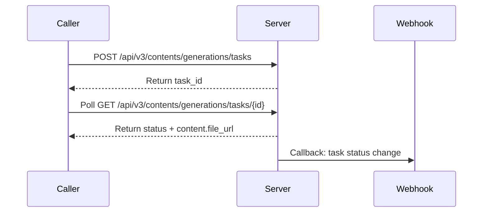

# BytePlus · ModelArk · 3D Generation (Hyper3D)

---

## Schema Legend

### Column Order & Zone Logic

```
[ANCHOR]       [CLASSIFY]        [IDENTITY]        [CONTRACT]                                      [SEQUENCE]              [CLASSIFY-2]               [PROSE]                              [BINDING]
endpoint       kind              key · type · val  required · direction                            actor · seq-note        location · scope · pattern key-description · value-description  module · class · function
```

`endpoint` is col 1 because it is the primary grouping key — every other column is subordinate to it. A reader scans endpoint first to locate their context, then reads right into the row.

Zones read left-to-right from most structural (machine-queryable, sparse-friendly) to most discursive (human prose, binding metadata). The four sparsest columns (`module · class · function`, often blank during API reference pass) land at the far right so the informational core stays compact.

The `[SEQUENCE]` zone (`actor · seq-note`) sits between `[CONTRACT]` and `[CLASSIFY-2]` so that the direction of data flow (`direction`) is resolved before the participant (`actor`) and message label (`seq-note`) are assigned — enabling direct, lossless export to a Mermaid `sequenceDiagram` without touching any other column.

---

### Column Definitions

#### `endpoint`
The API operation this row belongs to. Format: `METHOD /path` (relative to `base-url`), e.g. `POST /api/v3/images/generations`. Use `ALL` for rows that apply globally across every endpoint (base URL, auth headers). Sort rows by endpoint, then by kind order within each endpoint.

**Kind sort order within an endpoint:** `config → header → path → param → return → enum → error`
This mirrors the natural implementation read order: setup → request → response → reference → errors.

---

#### `kind`
Controlled vocabulary. Classifies what type of entity the row describes. Determines which other columns are applicable (see sparsity rules below).

| kind | meaning | typical `direction` | `required` |
|------|---------|-------------------|------------|
| `config` | Operational/environment-level setting not part of the wire format | `in` or `out` | `yes` or `—` |
| `header` | HTTP request or response header | `in` or `out` | `yes` or `no` |
| `path` | URL path segment variable, interpolated before the request is sent | `in` | `yes` |
| `param` | Request body or query string parameter | `in` | `yes`, `no`, or `conditional` |
| `return` | Response body field | `out` | `yes`, `no`, or `conditional` |
| `enum` | Enumerated valid value for a `param` or `return` key | same as parent | `—` |
| `error` | HTTP status code or named error code returned by the server | `out` | `—` |

---

#### `key`
The canonical field name as it appears on the wire (API param name, header name, response field, error code key). For nested fields use dot-notation: `data[].url`, `error.code`. For codebase binding rows, use the internal symbol name and cross-reference via `key-description`.

**Key sort order:** a→z within each `kind` group within each `endpoint`, except `enum` rows which sort a→z by `value`.

---

#### `type`
Data type of the field. Use wire-format types: `string`, `integer`, `boolean`, `float`, `array<T>`, `object`, `string (url)`, `string (base64)`, `integer (unix)`. For enums, repeat the parent type (usually `string`). For discriminated union arrays, use `array<object (union)>`.

---

#### `value`
The fixed, default, or example value for this field. Use backtick formatting for literal values: `` `application/json` ``. Leave blank if the value is caller-supplied and has no fixed default. For `enum` rows, this column carries the specific enum value being documented.

---

#### `required`
Whether the field must be present. Controlled vocabulary:

| value | meaning |
|-------|---------|
| `yes` | Always required |
| `no` | Optional |
| `conditional` | Required only under specific conditions (explain in `value-description`) |
| `—` | Not applicable (used for `enum` and `error` rows) |

---

#### `direction`
Data flow relative to the caller.

| value | meaning |
|-------|---------|
| `in` | Caller → Server (request) |
| `out` | Server → Caller (response) |

---

#### `actor`
The named participant that **sends** this message in a `sequenceDiagram`. Decouples participant identity from the binary `direction` axis so multi-party flows (e.g. server → webhook → caller) are unambiguous.

Controlled vocabulary (`actor-vocab` in frontmatter):

| value | meaning |
|------|---------|
| `Caller` | The API consumer (client application, SDK, browser) |
| `Server` | The API provider endpoint handling the request |
| `Broker` | An intermediary layer (queue, gateway, proxy) that relays messages between participants |
| `Webhook` | An external receiver the server POSTs callbacks to (owned by Caller but distinct from it in sequence) |
| `—` | Not applicable (`config`, `enum`, `error` rows that produce no diagram arrow) |

**Sparsity rule:** populate `—` for `config`, `enum`, and `error` rows. All other kinds must carry a named participant.

**Mermaid mapping:**
- `direction = in` → arrow from `actor` to the other participant (typically `Server`)
- `direction = out` → arrow from `actor` to the other participant (typically `Caller`)
- Multi-party: any non-`Caller`/`Server` actor signals a third participant node in the diagram

---

#### `seq-note`
A terse (≤ 60 characters) message label suitable for use as the arrow annotation in a Mermaid `sequenceDiagram`. Must be self-contained at a glance — no placeholders, no prose.

**Format:** imperative verb phrase or noun phrase that names the action, e.g.:
- `POST /images/generations`
- `Return task_id + status: queued`
- `Poll GET /tasks/{task_id}`
- `Callback: task succeeded`
- `401 Unauthorized`

**Rules:**
- No angle-bracket placeholders (`{{…}}`); use the actual key name or a short literal
- Prefer the HTTP method + path for top-level request rows
- Prefer `Return <key>` or `Respond <status>` for response rows
- For webhook flows, prefix with `Callback:`
- For polling steps, prefix with `Poll`
- Leave `—` for `config`, `enum`, and `error` rows that do not map to a diagram arrow

**Mermaid export note:** these values feed directly into the `->>` / `-->>` label position. Keep them free of Markdown special characters (no `|`, `"`, backticks).

---

#### `location`
Where on the wire this field lives. Disambiguates `param` rows and is always populated for `path`, `header`, `param`, and `return` kinds. Use `—` for `config`, `enum`, and `error` rows.

| value | meaning |
|-------|---------|
| `path` | Interpolated into the URL path, e.g. `/tasks/{id}` |
| `query` | Appended to the URL as a query string, e.g. `?limit=10` |
| `body` | Sent in the HTTP request or response body (JSON unless noted) |
| `header` | Transmitted in an HTTP header |
| `—` | Not applicable (`config`, `enum`, `error`) |

---

#### `scope`
Applicability constraint for this row — which versions, plans, tiers, or named variants the field applies to. Leave blank (populate with `—`) when the field applies universally to all variants of this endpoint.

**Format:** a pipe-separated list of named applicability tokens, e.g. `v2 | v2-fast`, `pro | enterprise`, `i2v-only`, `t2v-only`, `flex-tier`.

Use the API's own version/model/plan naming conventions verbatim. Do not invent abbreviations.

**Sparsity rule:** populate only when the field is genuinely restricted. A field available in all variants must carry `—`, not a list of every variant. Use `scope` to flag **exclusions**, not to repeat the universal case.

---

#### `pattern`
Structural pattern of this field's value shape. Enables tooling to select the correct parsing and validation strategy without reading prose.

| value | meaning |
|-------|---------|
| `scalar` | Single atomic value (string, integer, boolean, float) |
| `union` | Object whose shape is determined by a discriminant field (`type`, `kind`, etc.) |
| `array<union>` | Array where each element is a discriminated union object |
| `webhook` | String field that, when set, causes the server to POST responses to the supplied URL rather than (or in addition to) returning them inline |
| `state-machine` | Enumerable field whose values represent discrete lifecycle states with defined legal transitions |
| `—` | Not applicable or pattern is trivially scalar (use for `header`, `path`, `enum`, `error`, `config`) |

**Sparsity rule:** use `scalar` only when the distinction matters (i.e. the field is in a context where non-scalar patterns also appear). For `header`, `path`, `enum`, `error`, and most `config` rows, populate with `—`.

---

#### `key-description`
**Pattern: role → action → outcome**
Who uses this field → what it does mechanically → why it matters / what it affects downstream.

Format: `{Actor} → {verb phrase} → {consequence}`

- Actor is typically `Caller`, `Server`, or `Operator`
- Each clause is load-bearing; omit decorative clauses
- Do not describe the value range here (that belongs in `value-description`)

**Example:**
> `Caller → fix random seed → enables reproducible outputs across calls with identical parameters`

---

#### `value-description`
**Pattern: structured prose with `{{placeholders}}`**
Describes the valid value space, defaults, constraints, and behavioural notes for the field.

**For numeric / bounded fields:**
> `Default: {{default}}; Min: {{min}}; Max: {{max}}; Interval: {{interval}}; {{expansion_note}}; {{contraction_note}}`

**For enum fields:**
> `Default: {{default}}; Options: {{enum_a}} → {{desc_a}} | {{enum_b}} → {{desc_b}}; {{selection_note}}`

**For string fields:**
> `Default: {{default}}; Max: {{max_length}}; {{constraint_note}}`

**For boolean fields:**
> `Default: {{default}}; true → {{true_consequence}}; false → {{false_consequence}}`

**For URL / expiring resource fields:**
> `{{format_note}}; expires {{ttl}}; {{fallback_note}}`

**For record-level TTL (the whole resource expires, not just a URL):**
> `Record retained for {{ttl}} from {{anchor_timestamp}}; auto-deleted on expiry; caller-adjustable via {{control_param}} (Min: {{min}}; Max: {{max}})`

**For media / binary input fields (`pattern = union` sub-fields):**
> `Formats: {{fmt_list}}; Max size: {{per_item_limit}} per item, {{request_limit}} per request; Dimensions: {{dimension_constraints}}; Count: {{count_range}} {{count_note}}`

**For discriminated union arrays (`pattern = array<union>`):**
> `Discriminant: {{discriminant_key}}; Variants: {{variant_a}} → {{desc_a}} | {{variant_b}} → {{desc_b}}; Combination rules: {{combination_note}}`

**For webhook fields (`pattern = webhook`):**
> `Server POSTs to this URL on status change; payload mirrors {{mirrored_endpoint}} response body; retry policy: {{retry_note}}; states that trigger callback: {{state_list}}`

**For state-machine fields (`pattern = state-machine`):**
> `States: {{state_a}} → {{desc_a}} | {{state_b}} → {{desc_b}}; Transitions: {{transition_rules}}; Terminal states: {{terminal_list}}`

**For dual-method / alternative invocation fields:**
> `Primary: {{primary_method}}; Alt: {{alt_method}}; Validation: primary uses strict validation (error on mismatch); alt uses lenient validation (mismatch silently ignored or errors)`

Omit inapplicable sub-clauses. Conditions under which a `conditional` field is required must be stated here.

**Example (numeric):**
> `Default: 2; Min: 1; Max: 8; Interval: 1; More hops expands reach; fewer narrows scope`

**Example (enum):**
> `Default: url; Options: url → time-limited HTTPS link (~1h TTL) | b64_json → base64-encoded PNG in response body; use b64_json if downstream cannot follow redirects`

**Example (state-machine):**
> `States: queued → awaiting processing | running → actively executing | succeeded → output available | failed → terminal error | cancelled → manually stopped | expired → exceeded execution threshold; Transitions: queued → running | running → succeeded | failed | expired; Terminal states: succeeded, failed, cancelled, expired`

---

#### `module · class · function`
Codebase binding columns. Leave blank during the API reference pass. Populated in a separate binding pass via static analysis or manual mapping. Together they locate where in the implementation this key is read, written, or transformed.

| column | meaning |
|--------|---------|
| `module` | File or package that owns the logic (e.g. `services/image`, `api/byteplus`) |
| `class` | Class or component name (e.g. `ImageClient`, `GenerationService`) |
| `function` | Method or function name (e.g. `generate`, `pollTask`, `parseResponse`) |

---

### Categorisation Decisions

**`kind = config` vs `kind = param`**
`config` is for environment-level or operational settings not part of the wire request body (base URL, polling interval, TTL constants). `param` is for per-request fields sent in the HTTP body or query string.

**`kind = path`**
Use for URL path segment variables — values interpolated into the URL before the request is sent, e.g. `{id}` in `/tasks/{id}`. Always `required = yes`, `direction = in`, `location = path`. Never conflate with `param` (body/query) even though both are `in`.

**`kind = enum` rows**
Each valid value for a constrained field gets its own `enum` row. The `key` column repeats the parent param key. The `value` column carries the specific enum value. `required = —`. This makes each option independently queryable and annotatable without embedding all options in a single `value-description` cell.

**`required = conditional`**
Use when a field is required only in certain configurations. Always state the triggering condition in `value-description`.

**`endpoint = ALL`**
Use only for rows that are literally universal — apply to every endpoint in this document regardless of method or path. Typically: `base_url` config, `Authorization` header, `Content-Type` header. Do not use `ALL` as a shortcut for "most endpoints".

**`key` for nested fields**
Use dot-notation for response object fields: `data[].url`, `data[].b64_json`, `error.code`. Bracket notation `[]` indicates array element. Keep nesting explicit so rows are independently parseable without reading surrounding context.

**`value` column sparsity**
Leave `value` blank when the field is caller-supplied with no fixed or default value. Only populate when the value is fixed (headers), defaulted (optional params), or is a specific enum value being documented.

**`scope` sparsity**
Default is `—` (universal). Only populate when a row is genuinely restricted to a subset of versions, tiers, or named variants. Never list all variants for a universally applicable row.

**`pattern` sparsity**
Default is `—` for `header`, `path`, `enum`, `error`, and `config` kinds. Populate `pattern` for `param` and `return` rows where the structural shape is non-trivial or where a tool would need to select a different parsing strategy.

**`actor` and `seq-note` for non-arrow rows**
Set both `actor = —` and `seq-note = —` for `config`, `enum`, and `error` rows. These rows describe constraints and reference data, not message-passing events, and produce no arrow in a `sequenceDiagram`.

**`actor` in multi-party flows**
When the API involves a third participant (e.g. a webhook receiver, an async broker, a callback server), introduce it with a distinct `actor` token in `actor-vocab` in the frontmatter. Do not overload `Caller` or `Server` to represent a third party.

**`seq-note` and `actor` coherence check**
If `direction = in` and `actor = Caller`, the arrow is `Caller ->> Server`. If `direction = out` and `actor = Server`, the arrow is `Server -->> Caller`. If the actors do not match the direction, the row represents a non-standard relay and a comment should be added in `key-description`.

**Async APIs and the `async-pattern` frontmatter key**
When an API is asynchronous, record the mechanism in `async-pattern` (`poll`, `webhook`, or `stream`). The resource ID returned by the creating endpoint should carry `key-description` text that explains the polling flow. The status field of the polled resource should carry `pattern = state-machine`. In the `seq-note` column, polling steps should be prefixed with `Poll` and webhook callbacks prefixed with `Callback:` so a diagram generator can assign the correct arrow style.

**Discriminated unions**
When a request or response field is an array of objects whose shape varies by a discriminant key (e.g. `type`), mark the parent array field with `pattern = array<union>`. Each variant's sub-fields are documented as nested dot-notation rows under the parent key; each sub-schema group should open with the discriminant key row (`pattern = union`, `value = <discriminant_value>`).

---

### Mermaid `sequenceDiagram` Export Guide

The two new columns enable mechanical export. The mapping is:

| table column | `sequenceDiagram` construct |
|---|---|
| `actor` | participant / actor node label |
| `direction = in` | `->>` (synchronous) or `-)` (async) arrow from `actor` to counterpart |
| `direction = out` | `-->>` (synchronous) or `--)` (async) return arrow from `actor` to counterpart |
| `seq-note` | arrow label text |
| `pattern = webhook` | activates a `Webhook` participant node; arrow style `->>` Server to Webhook |
| `pattern = state-machine` | candidates for `Note over Server: state` annotations |
| `scope` | optionally gates the arrow inside an `opt` or `alt` block |

**Minimal export algorithm (pseudocode):**

```
participants = distinct non-"—" values of actor column + inferred counterparts
for each row where actor != "—" and seq-note != "—":
    sender = actor
    receiver = counterpart(direction, actor)   # Caller↔Server, or named third-party
    style   = "-->" if direction == "out" else "->"
    emit:  sender style receiver : seq-note
```

**Example output** (async poll + webhook flow):



All arrow labels are drawn directly from the `seq-note` column of the corresponding rows.

---

## Table

| endpoint | kind | key | type | value | required | direction | actor | seq-note | location | scope | pattern | key-description | value-description | module | class | function |
|----------|------|-----|------|-------|----------|-----------|-------|----------|----------|-------|---------|-----------------|-------------------|--------|-------|----------|
| ALL | config | base_url | string | `https://ark.ap-southeast.bytepluses.com` | yes | in | — | — | — | — | — | Operator → set regional base URL → scopes all requests to the correct inference cluster | Fixed per region; no trailing slash; supported regions: AU, KH, KY, EG, FJ, GH, HK, IN, ID, JP, KW, LA, MO, MY, MA, NZ, PK, PH, QA, SA, SG, SB, ZA, KR, TZ, TH, TR, TW, VN, ZM | | | |
| ALL | config | billing_per_model | string | `$0.399` | — | out | — | — | — | — | — | Operator → anticipate per-model generation cost → enables budget planning before submitting tasks | Fixed: 30,000 completion tokens at $0.0133/1K tokens per generated 3D model; output tokens only; input tokens always 0; see Model Billing for details | | | |
| ALL | config | output_file_ttl | string | `24h` | — | out | — | — | — | — | — | Server → expire generated file URL → caller must download content.file_url within 24 hours of task completion | TTL starts from task completion timestamp; URL inaccessible after expiry; no recovery possible; download and store output promptly | | | |
| ALL | config | task_record_ttl | string | `7d` | — | out | — | — | — | — | — | Server → expire task record → task ID and all associated metadata are auto-deleted after 7 days | Record retained for 7 days from created_at timestamp (UTC); auto-deleted on expiry; expired tasks transition to expired status and are no longer queryable | | | |
| ALL | header | Authorization | string | `Bearer <API_KEY>` | yes | in | Caller | Authenticate request | header | — | — | Caller → authenticate request → grants access to the Hyper3D generation API | Long-term API Key; obtain from BytePlus Console API Key management page; only supported auth scheme; no token expiry | | | |
| ALL | header | Content-Type | string | `application/json` | yes | in | Caller | Declare JSON body encoding | header | — | — | Caller → declare request body encoding → ensures server parses JSON body correctly | Fixed value; no other encoding accepted | | | |
| POST /api/v3/contents/generations/tasks | param | callback_url | string (url) | | no | in | Caller | POST /api/v3/contents/generations/tasks | body | — | webhook | Caller → register webhook URL → enables async task status updates via server-initiated POST without polling | Server POSTs to this URL on status change; payload mirrors GET /api/v3/contents/generations/tasks/{id} response body; retry policy: 3 attempts if no acknowledgement within 5s; states that trigger callback: queued, running, succeeded, failed | | | |
| POST /api/v3/contents/generations/tasks | param | content | array<object (union)> | | yes | in | Caller | POST /api/v3/contents/generations/tasks | body | — | array<union> | Caller → supply generation references → provides text and/or image inputs driving 3D model generation | Discriminant: content[].type; Variants: image_url → image input object (1–5 images); text → text prompt string with optional inline parameters; Combination rules: Text-to-3D requires text; Image-to-3D requires image_url (1–5 images), text optional; parameters optional via --key suffix appended to text | | | |
| POST /api/v3/contents/generations/tasks | param | content[].image_url | object | | conditional | in | Caller | POST /api/v3/contents/generations/tasks | body | image_url | — | Caller → supply image input object → wraps image URL or base64 data for 3D generation | Required when content[].type = image_url; absent when content[].type = text | | | |
| POST /api/v3/contents/generations/tasks | param | content[].image_url.url | string | | yes | in | Caller | POST /api/v3/contents/generations/tasks | body | image_url | scalar | Caller → provide image data → delivers image as public URL or base64-encoded string for model input | Formats: jpg, jpeg, png; Max size: 30 MB per image; Max pixels: 4096x4096 per image; Count: 1–5 images per request; URL: must be publicly accessible; Base64: format data:image/<fmt>;base64,<data> | | | |
| POST /api/v3/contents/generations/tasks | param | content[].text | string | | conditional | in | Caller | POST /api/v3/contents/generations/tasks | body | text | scalar | Caller → supply text prompt and optional inline parameters → drives text-to-3D generation or supplements image-to-3D | Required when content[].type = text; optional when image_url is also present; English only; Max: 400 characters (truncated if exceeded); append --key value suffixes after the prompt for model parameters (see Parameters section) | | | |
| POST /api/v3/contents/generations/tasks | param | content[].type | string | | yes | in | Caller | POST /api/v3/contents/generations/tasks | body | — | union | Caller → declare input variant → determines which sibling fields (image_url or text) are required in each content array element | Discriminant key for content array union; value image_url activates content[].image_url; value text activates content[].text | | | |
| POST /api/v3/contents/generations/tasks | param | model | string | | yes | in | Caller | POST /api/v3/contents/generations/tasks | body | — | scalar | Caller → specify model → selects Hyper3D model version for generation | Activate model service in BytePlus Console before use; query model ID from ModelArk model list; alternatively use inference endpoint ID for rate-limit visibility, billing method, and monitoring | | | |
| POST /api/v3/contents/generations/tasks | param | seed | integer | | no | in | Caller | POST /api/v3/contents/generations/tasks | body | — | scalar | Caller → set random seed → varies output while holding other request parameters constant | Default: none (random); Min: 0; Max: 65535; same seed does not guarantee identical output; change seed value to get different outputs from identical request | | | |
| POST /api/v3/contents/generations/tasks | param | addons | string | | no | in | Caller | POST /api/v3/contents/generations/tasks | body | text-cmd | scalar | Caller → enhance texture resolution → upgrades output texture maps from default 2K to higher resolution | Default: none (2K textures); Options: HighPack → 4K resolution texture maps; append as --addons HighPack in content[].text | | | |
| POST /api/v3/contents/generations/tasks | param | bbox_condition | array<integer> | | no | in | Caller | POST /api/v3/contents/generations/tasks | body | text-cmd | scalar | Caller → specify bounding box dimensions → constrains 3D output geometry to explicit spatial proportions | Array of 3 integers: [width (x-axis), height (y-axis), length (z-axis)]; example: [100,100,100]; not recommended unless specific proportions required; model auto-determines bounding box if omitted; append as --bbox_condition [x,y,z] in content[].text | | | |
| POST /api/v3/contents/generations/tasks | param | fileformat | string | `glb` | no | in | Caller | POST /api/v3/contents/generations/tasks | body | text-cmd | scalar | Caller → select output file container format → determines the format of the generated 3D model file | Default: glb; Options: glb; obj; usdz; fbx; stl; append as --fileformat <value> or --ff <value> in content[].text | | | |
| POST /api/v3/contents/generations/tasks | param | hd_texture | boolean | `false` | no | in | Caller | POST /api/v3/contents/generations/tasks | body | text-cmd | scalar | Caller → enable HD texture generation → activates high-definition texture output for increased detail | Default: false; true → HD texture enabled; false → standard texture; append as --hd_texture true in content[].text | | | |
| POST /api/v3/contents/generations/tasks | param | material | string | `PBR` | no | in | Caller | POST /api/v3/contents/generations/tasks | body | text-cmd | scalar | Caller → select material type → determines texture and lighting model of the output 3D model | Default: PBR; Options: PBR → physically based rendering with base color + metallic + normal + roughness textures; Shaded → stylized with base color + baked lighting; All → generates both PBR and Shaded; None → no texture, white mesh only; append as --material <value> in content[].text | | | |
| POST /api/v3/contents/generations/tasks | param | mesh_mode | string | `Quad` | no | in | Caller | POST /api/v3/contents/generations/tasks | body | text-cmd | scalar | Caller → select mesh topology → controls whether output uses triangle or quad mesh geometry | Default: Quad; Options: Raw → triangle mesh; Quad → quad mesh; affects valid range and default of quality_override; append as --mesh_mode <value> in content[].text | | | |
| POST /api/v3/contents/generations/tasks | param | quality_override | number | | no | in | Caller | POST /api/v3/contents/generations/tasks | body | text-cmd | scalar | Caller → set exact polygon count → overrides preset subdivisionlevel with a precise face count | When mesh_mode = Raw: Min 500; Max 1,000,000; default 500,000; When mesh_mode = Quad: Min 1,000; Max 200,000; default 18,000; if both quality_override and subdivisionlevel are specified, subdivisionlevel is ignored; recommended minimum 150,000 faces; append as --quality_override <value> in content[].text | | | |
| POST /api/v3/contents/generations/tasks | param | subdivisionlevel | string | | no | in | Caller | POST /api/v3/contents/generations/tasks | body | text-cmd | scalar | Caller → select preset polygon tier → sets polygon count via named preset; ignored when quality_override is also set | When mesh_mode = Raw: default high (500k); options: high → 500k; medium → 150k; low → 20k; When mesh_mode = Quad: default medium (18k); options: high → 50k; medium → 18k; low → 8k; ignored if quality_override is also specified; append as --subdivisionlevel <value> or --sl <value> in content[].text | | | |
| POST /api/v3/contents/generations/tasks | param | TAPose | boolean | `false` | no | in | Caller | POST /api/v3/contents/generations/tasks | body | text-cmd | scalar | Caller → enforce T/A pose for humanoid models → controls standard binding pose for rigging compatibility | Default: false; true → enforce standard binding pose (model selects T-Pose or A-Pose); false → model freely determines pose; append as --TAPose true in content[].text | | | |
| POST /api/v3/contents/generations/tasks | param | use_original_alpha | boolean | `false` | no | in | Caller | POST /api/v3/contents/generations/tasks | body | text-cmd | scalar | Caller → control alpha transparency handling → preserves or fills transparent regions from the uploaded image | Default: false; true → preserve transparent parts of uploaded image; false → auto-fill transparent parts (may lose original transparency effect); append as --use_original_alpha true in content[].text | | | |
| POST /api/v3/contents/generations/tasks | return | id | string | | yes | out | Server | Return task_id | body | — | scalar | Server → return task ID → provides the handle required to poll for task completion via GET endpoint | Record retained for 7 days from created_at; auto-deleted on expiry; async flow: poll GET /api/v3/contents/generations/tasks/{id} until status = succeeded, then retrieve content.file_url | | | |
| POST /api/v3/contents/generations/tasks | enum | addons | string | `HighPack` | — | in | — | — | — | text-cmd | — | 4K resolution texture maps; if omitted textures default to 2K | — | | | |
| POST /api/v3/contents/generations/tasks | enum | content[].type | string | `image_url` | — | in | — | — | — | — | — | Image input variant; activates content[].image_url; supports 1–5 images per request | — | | | |
| POST /api/v3/contents/generations/tasks | enum | content[].type | string | `text` | — | in | — | — | — | — | — | Text input variant; activates content[].text; English prompt up to 400 characters with optional --param suffixes | — | | | |
| POST /api/v3/contents/generations/tasks | enum | fileformat | string | `fbx` | — | in | — | — | — | text-cmd | — | FBX format output; suitable for animation workflows and DCC tools | — | | | |
| POST /api/v3/contents/generations/tasks | enum | fileformat | string | `glb` | — | in | — | — | — | text-cmd | — | GLB (binary glTF) format output; default; widely supported in web, game engines, and AR/VR runtimes | — | | | |
| POST /api/v3/contents/generations/tasks | enum | fileformat | string | `obj` | — | in | — | — | — | text-cmd | — | OBJ format output; widely supported legacy format; exports as .obj + .mtl | — | | | |
| POST /api/v3/contents/generations/tasks | enum | fileformat | string | `stl` | — | in | — | — | — | text-cmd | — | STL format output; suitable for 3D printing; no texture data | — | | | |
| POST /api/v3/contents/generations/tasks | enum | fileformat | string | `usdz` | — | in | — | — | — | text-cmd | — | USDZ format output; Apple AR ecosystem format for iOS and macOS | — | | | |
| POST /api/v3/contents/generations/tasks | enum | material | string | `All` | — | in | — | — | — | text-cmd | — | Generates both PBR and Shaded material outputs in a single task | — | | | |
| POST /api/v3/contents/generations/tasks | enum | material | string | `None` | — | in | — | — | — | text-cmd | — | No texture; generates white mesh model only; lowest output size | — | | | |
| POST /api/v3/contents/generations/tasks | enum | material | string | `PBR` | — | in | — | — | — | text-cmd | — | Physically based rendering; base color + metallic + normal + roughness textures; default; high realism under dynamic lighting | — | | | |
| POST /api/v3/contents/generations/tasks | enum | material | string | `Shaded` | — | in | — | — | — | text-cmd | — | Stylized material; base color + baked lighting; no dynamic lighting response | — | | | |
| POST /api/v3/contents/generations/tasks | enum | mesh_mode | string | `Quad` | — | in | — | — | — | text-cmd | — | Quad mesh topology; default; quality_override range 1,000–200,000; subdivisionlevel defaults to medium (18k) | — | | | |
| POST /api/v3/contents/generations/tasks | enum | mesh_mode | string | `Raw` | — | in | — | — | — | text-cmd | — | Triangle mesh topology; quality_override range 500–1,000,000; subdivisionlevel defaults to high (500k) | — | | | |
| POST /api/v3/contents/generations/tasks | enum | subdivisionlevel | string | `high` | — | in | — | — | — | text-cmd | — | High polygon preset; Raw: 500k faces; Quad: 50k faces | — | | | |
| POST /api/v3/contents/generations/tasks | enum | subdivisionlevel | string | `low` | — | in | — | — | — | text-cmd | — | Low polygon preset; Raw: 20k faces; Quad: 8k faces | — | | | |
| POST /api/v3/contents/generations/tasks | enum | subdivisionlevel | string | `medium` | — | in | — | — | — | text-cmd | — | Medium polygon preset; Raw: 150k faces; Quad: 18k faces | — | | | |
| GET /api/v3/contents/generations/tasks/{id} | path | id | string | | yes | in | Caller | Poll GET /api/v3/contents/generations/tasks/{id} | path | — | — | Caller → identify task to retrieve → specifies which 3D generation task record to fetch | Replace {id} placeholder in URL with task ID obtained from POST response; used in polling loop until status = succeeded | | | |
| GET /api/v3/contents/generations/tasks/{id} | return | content | object | | conditional | out | Server | Return status + content.file_url | body | — | — | Server → return output container → wraps generated 3D file URL on task success | Populated only when status = succeeded; absent or null otherwise | | | |
| GET /api/v3/contents/generations/tasks/{id} | return | content.file_url | string (url) | | conditional | out | Server | Return status + content.file_url | body | — | scalar | Server → return 3D output download URL → provides time-limited HTTPS link to the generated 3D model file | Expires 24h from task completion; format: HTTPS URL; file format determined by --fileformat parameter (default glb); save promptly; no re-retrieval after expiry | | | |
| GET /api/v3/contents/generations/tasks/{id} | return | created_at | integer (unix) | | yes | out | Server | Return status + content.file_url | body | — | scalar | Server → return task creation timestamp → provides Unix epoch time for record lifecycle and TTL calculations | Unix timestamp in seconds; task record auto-deleted 7 days from this value | | | |
| GET /api/v3/contents/generations/tasks/{id} | return | error | object / null | | conditional | out | Server | Return status + content.file_url | body | — | — | Server → return error details → provides structured error code and message when task has failed | null when status = succeeded, queued, or running; populated when status = failed; refer to ModelArk error codes documentation for resolution steps | | | |
| GET /api/v3/contents/generations/tasks/{id} | return | error.code | string | | conditional | out | Server | Return status + content.file_url | body | — | scalar | Server → return machine-readable error code → enables programmatic error handling and lookup | Present when parent error object is non-null; see ModelArk error codes reference | | | |
| GET /api/v3/contents/generations/tasks/{id} | return | error.message | string | | conditional | out | Server | Return status + content.file_url | body | — | scalar | Server → return human-readable error message → describes the failure reason for debugging | Present when parent error object is non-null | | | |
| GET /api/v3/contents/generations/tasks/{id} | return | id | string | | yes | out | Server | Return status + content.file_url | body | — | scalar | Server → return task ID → confirms identity of the task record being returned | Matches the {id} path parameter used in the request | | | |
| GET /api/v3/contents/generations/tasks/{id} | return | model | string | | yes | out | Server | Return status + content.file_url | body | — | scalar | Server → return model identity → identifies the model version used for this task | Format: Model name-Version (e.g. Hyper3d-Gen2-...) | | | |
| GET /api/v3/contents/generations/tasks/{id} | return | status | string | | yes | out | Server | Return status + content.file_url | body | — | state-machine | Server → return task lifecycle state → allows Caller to determine whether output is ready or if the task has reached a terminal state | States: queued → awaiting queue processing; running → actively generating 3D model; succeeded → output available in content.file_url; failed → terminal error, see error object; cancelled → manually stopped; expired → exceeded 7-day retention threshold; Transitions: queued → running; running → succeeded or failed; queued → cancelled; any → expired on TTL; Terminal states: succeeded, failed, cancelled, expired | | | |
| GET /api/v3/contents/generations/tasks/{id} | return | updated_at | integer (unix) | | yes | out | Server | Return status + content.file_url | body | — | scalar | Server → return last-updated timestamp → indicates when task state last changed | Unix timestamp in seconds | | | |
| GET /api/v3/contents/generations/tasks/{id} | return | usage | object | | yes | out | Server | Return status + content.file_url | body | — | — | Server → return token usage summary → provides billing-relevant token counts for this task | Always present; input tokens fixed at 0 for 3D generation; total_tokens = completion_tokens | | | |
| GET /api/v3/contents/generations/tasks/{id} | return | usage.completion_tokens | integer | | yes | out | Server | Return status + content.file_url | body | — | scalar | Server → return output token count → number of tokens consumed for the 3D model output | Fixed at 30,000 tokens per generated model; billed at $0.0133/1K tokens = $0.399 per model | | | |
| GET /api/v3/contents/generations/tasks/{id} | return | usage.total_tokens | integer | | yes | out | Server | Return status + content.file_url | body | — | scalar | Server → return total request token count → sum of input and output tokens | Always equals usage.completion_tokens; input tokens are always 0 for 3D generation | | | |
| GET /api/v3/contents/generations/tasks/{id} | enum | status | string | `cancelled` | — | out | — | — | — | — | — | Task was manually cancelled from queued state; only queued tasks can be cancelled; terminal state | — | | | |
| GET /api/v3/contents/generations/tasks/{id} | enum | status | string | `expired` | — | out | — | — | — | — | — | Task record exceeded 7-day retention threshold and was auto-deleted; terminal state | — | | | |
| GET /api/v3/contents/generations/tasks/{id} | enum | status | string | `failed` | — | out | — | — | — | — | — | Task encountered a terminal error; error object populated; terminal state | — | | | |
| GET /api/v3/contents/generations/tasks/{id} | enum | status | string | `queued` | — | out | — | — | — | — | — | Task is awaiting processing in the generation queue; not yet running | — | | | |
| GET /api/v3/contents/generations/tasks/{id} | enum | status | string | `running` | — | out | — | — | — | — | — | Task is actively generating the 3D model; cannot be cancelled in this state | — | | | |
| GET /api/v3/contents/generations/tasks/{id} | enum | status | string | `succeeded` | — | out | — | — | — | — | — | Task completed successfully; content.file_url available for 24h; terminal state | — | | | |
| GET /api/v3/contents/generations/tasks | config | query_window | string | `7d` | — | in | — | — | — | — | — | Operator → constrain query time window → only tasks created in the past 7 days are queryable | Window: [T − 7 days, T) in UTC; calculated to the second from request time; older task records are auto-purged and not retrievable | | | |
| GET /api/v3/contents/generations/tasks | param | filter.model | string | | no | in | Caller | GET /api/v3/contents/generations/tasks | query | — | scalar | Caller → filter by inference endpoint ID → narrows results to tasks executed on a specific endpoint | Matches inference endpoint ID used when creating the task; differs from the model name returned in the response model field | | | |
| GET /api/v3/contents/generations/tasks | param | filter.status | string | | no | in | Caller | GET /api/v3/contents/generations/tasks | query | — | scalar | Caller → filter by task lifecycle status → narrows results to tasks in a specific state | Default: none (all statuses returned); Options: queued; running; cancelled; succeeded; failed | | | |
| GET /api/v3/contents/generations/tasks | param | filter.task_ids | array<string> | | no | in | Caller | GET /api/v3/contents/generations/tasks | query | — | scalar | Caller → filter by specific task IDs → retrieves named tasks in a single batch request | Pass multiple IDs as repeated query parameters: filter.task_ids=id1&filter.task_ids=id2 | | | |
| GET /api/v3/contents/generations/tasks | param | page_num | integer / null | | no | in | Caller | GET /api/v3/contents/generations/tasks | query | — | scalar | Caller → specify result page number → paginates through the filtered task list | Default: none; Min: 1; Max: 500 | | | |
| GET /api/v3/contents/generations/tasks | param | page_size | integer / null | | no | in | Caller | GET /api/v3/contents/generations/tasks | query | — | scalar | Caller → specify entries per page → controls how many task records are returned per response | Default: none; Min: 1; Max: 500 | | | |
| GET /api/v3/contents/generations/tasks | return | items | array<object> | | yes | out | Server | Return items[] + total | body | — | — | Server → return matching task array → list of task records that satisfy the applied filter criteria | Empty array if no tasks match; each element mirrors the single-task GET /.../{id} response structure | | | |
| GET /api/v3/contents/generations/tasks | return | items[].content | object | | conditional | out | Server | Return items[] + total | body | — | — | Server → return output container per task → wraps 3D file URL for succeeded tasks | Present only when items[].status = succeeded | | | |
| GET /api/v3/contents/generations/tasks | return | items[].content.file_url | string (url) | | conditional | out | Server | Return items[] + total | body | — | scalar | Server → return 3D file URL per task → time-limited download link to the generated 3D model | Expires 24h from task completion; save promptly | | | |
| GET /api/v3/contents/generations/tasks | return | items[].created_at | integer (unix) | | yes | out | Server | Return items[] + total | body | — | scalar | Server → return creation timestamp per task → Unix timestamp in seconds | Task record auto-deleted 7 days from this value | | | |
| GET /api/v3/contents/generations/tasks | return | items[].error | object / null | | conditional | out | Server | Return items[] + total | body | — | — | Server → return per-task error details → populated when individual task status = failed | null when status is not failed | | | |
| GET /api/v3/contents/generations/tasks | return | items[].error.code | string | | conditional | out | Server | Return items[] + total | body | — | scalar | Server → return error code per task → machine-readable failure identifier | Present when parent items[].error is non-null | | | |
| GET /api/v3/contents/generations/tasks | return | items[].error.message | string | | conditional | out | Server | Return items[] + total | body | — | scalar | Server → return error message per task → human-readable description of the failure reason | Present when parent items[].error is non-null | | | |
| GET /api/v3/contents/generations/tasks | return | items[].id | string | | yes | out | Server | Return items[] + total | body | — | scalar | Server → return task ID per item → unique identifier for each task in the list | Use to retrieve, poll, or delete individual tasks | | | |
| GET /api/v3/contents/generations/tasks | return | items[].model | string | | yes | out | Server | Return items[] + total | body | — | scalar | Server → return model identity per task → identifies model version used for each task | Format: Model name-Version | | | |
| GET /api/v3/contents/generations/tasks | return | items[].status | string | | yes | out | Server | Return items[] + total | body | — | state-machine | Server → return lifecycle state per task → per-item status within the result list | States: queued; running; succeeded; failed; cancelled; expired; Transitions same as single-task GET; Terminal states: succeeded, failed, cancelled, expired | | | |
| GET /api/v3/contents/generations/tasks | return | items[].updated_at | integer (unix) | | yes | out | Server | Return items[] + total | body | — | scalar | Server → return last-updated timestamp per task → Unix timestamp in seconds | Reflects last status transition time | | | |
| GET /api/v3/contents/generations/tasks | return | items[].usage | object | | yes | out | Server | Return items[] + total | body | — | — | Server → return token usage per task → billing-relevant token counts for each task | input tokens = 0; total_tokens = completion_tokens | | | |
| GET /api/v3/contents/generations/tasks | return | items[].usage.completion_tokens | integer | | yes | out | Server | Return items[] + total | body | — | scalar | Server → return output token count per task → tokens consumed for the 3D output | Fixed 30,000 tokens per generated model | | | |
| GET /api/v3/contents/generations/tasks | return | items[].usage.total_tokens | integer | | yes | out | Server | Return items[] + total | body | — | scalar | Server → return total token count per task → equals completion_tokens as input is always 0 | total_tokens = completion_tokens | | | |
| GET /api/v3/contents/generations/tasks | return | total | integer | | yes | out | Server | Return items[] + total | body | — | scalar | Server → return aggregate match count → total number of tasks matching the applied filter conditions across all pages | Reflects all matches regardless of pagination; use with page_num and page_size for navigation | | | |
| GET /api/v3/contents/generations/tasks | enum | filter.status | string | `cancelled` | — | in | — | — | — | — | — | Filter to cancelled tasks only | — | | | |
| GET /api/v3/contents/generations/tasks | enum | filter.status | string | `failed` | — | in | — | — | — | — | — | Filter to failed tasks only | — | | | |
| GET /api/v3/contents/generations/tasks | enum | filter.status | string | `queued` | — | in | — | — | — | — | — | Filter to queued tasks only | — | | | |
| GET /api/v3/contents/generations/tasks | enum | filter.status | string | `running` | — | in | — | — | — | — | — | Filter to running tasks only | — | | | |
| GET /api/v3/contents/generations/tasks | enum | filter.status | string | `succeeded` | — | in | — | — | — | — | — | Filter to succeeded tasks only | — | | | |
| DELETE /api/v3/contents/generations/tasks/{id} | path | id | string | | yes | in | Caller | DELETE /api/v3/contents/generations/tasks/{id} | path | — | — | Caller → identify task to cancel or delete → specifies which task record to operate on via the DELETE method | Replace {id} placeholder in URL with target task ID; operation behaviour by status: queued → task removed from queue and status set to cancelled; running → operation not permitted; succeeded/failed/expired → task record deleted and no longer queryable; cancelled → operation not permitted | | | |

---

*Source: BytePlus ModelArk · 3D Generation (Hyper3D) · docs ID ModelArk-Hyper3D-3DGen · retrieved 2026-04-26*
*fetch-status: raw-markdown; mixin-react tab content stripped; complete*
*`module · class · function` columns intentionally blank — pending codebase binding pass*