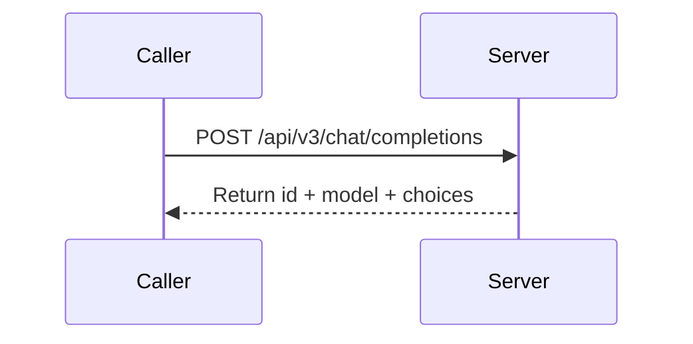

# BytePlus · ModelArk Chat API

---

## Schema Legend

### Column Order & Zone Logic

```
[ANCHOR]       [CLASSIFY]        [IDENTITY]        [CONTRACT]                                      [SEQUENCE]              [CLASSIFY-2]               [PROSE]                              [BINDING]
endpoint       kind              key · type · val  required · direction                            actor · seq-note        location · scope · pattern key-description · value-description  module · class · function
```

`endpoint` is col 1 because it is the primary grouping key — every other column is subordinate to it. A reader scans endpoint first to locate their context, then reads right into the row.

Zones read left-to-right from most structural (machine-queryable, sparse-friendly) to most discursive (human prose, binding metadata). The four sparsest columns (`module · class · function`, often blank during API reference pass) land at the far right so the informational core stays compact.

The `[SEQUENCE]` zone (`actor · seq-note`) sits between `[CONTRACT]` and `[CLASSIFY-2]` so that the direction of data flow (`direction`) is resolved before the participant (`actor`) and message label (`seq-note`) are assigned — enabling direct, lossless export to a Mermaid `sequenceDiagram` without touching any other column.

---

### Column Definitions

#### `endpoint`
The API operation this row belongs to. Format: `METHOD /path` (relative to `base-url`), e.g. `POST /api/v3/chat/completions`. Use `ALL` for rows that apply globally across every endpoint (base URL, auth headers). Sort rows by endpoint, then by kind order within each endpoint.

**Kind sort order within an endpoint:** `config → header → path → param → return → enum → error`
This mirrors the natural implementation read order: setup → request → response → reference → errors.

---

#### `kind`
Controlled vocabulary. Classifies what type of entity the row describes. Determines which other columns are applicable (see sparsity rules below).

| kind | meaning | typical `direction` | `required` |
|------|---------|-------------------|------------|
| `config` | Operational/environment-level setting not part of the wire format | `in` or `out` | `yes` or `—` |
| `header` | HTTP request or response header | `in` or `out` | `yes` or `no` |
| `path` | URL path segment variable, interpolated before the request is sent | `in` | `yes` |
| `param` | Request body or query string parameter | `in` | `yes`, `no`, or `conditional` |
| `return` | Response body field | `out` | `yes`, `no`, or `conditional` |
| `enum` | Enumerated valid value for a `param` or `return` key | same as parent | `—` |
| `error` | HTTP status code or named error code returned by the server | `out` | `—` |

---

#### `key`
The canonical field name as it appears on the wire (API param name, header name, response field, error code key). For nested fields use dot-notation: `data[].url`, `error.code`. For codebase binding rows, use the internal symbol name and cross-reference via `key-description`.

**Key sort order:** a→z within each `kind` group within each `endpoint`, except `enum` rows which sort a→z by `value`.

---

#### `type`
Data type of the field. Use wire-format types: `string`, `integer`, `boolean`, `float`, `array<T>`, `object`, `string (url)`, `string (base64)`, `integer (unix)`. For enums, repeat the parent type (usually `string`). For discriminated union arrays, use `array<object (union)>`.

---

#### `value`
The fixed, default, or example value for this field. Use backtick formatting for literal values: `` `application/json` ``. Leave blank if the value is caller-supplied and has no fixed default. For `enum` rows, this column carries the specific enum value being documented.

---

#### `required`
Whether the field must be present. Controlled vocabulary:

| value | meaning |
|-------|---------|
| `yes` | Always required |
| `no` | Optional |
| `conditional` | Required only under specific conditions (explain in `value-description`) |
| `—` | Not applicable (used for `enum` and `error` rows) |

---

#### `direction`
Data flow relative to the caller.

| value | meaning |
|-------|---------|
| `in` | Caller → Server (request) |
| `out` | Server → Caller (response) |

---

#### `actor`
The named participant that **sends** this message in a `sequenceDiagram`. Decouples participant identity from the binary `direction` axis so multi-party flows (e.g. server → webhook → caller) are unambiguous.

Controlled vocabulary (`actor-vocab` in frontmatter):

| value | meaning |
|------|---------|
| `Caller` | The API consumer (client application, SDK, browser) |
| `Server` | The API provider endpoint handling the request |
| `Broker` | An intermediary layer (queue, gateway, proxy) that relays messages between participants |
| `Webhook` | An external receiver the server POSTs callbacks to (owned by Caller but distinct from it in sequence) |
| `—` | Not applicable (`config`, `enum`, `error` rows that produce no diagram arrow) |

**Sparsity rule:** populate `—` for `config`, `enum`, and `error` rows. All other kinds must carry a named participant.

**Mermaid mapping:**
- `direction = in` → arrow from `actor` to the other participant (typically `Server`)
- `direction = out` → arrow from `actor` to the other participant (typically `Caller`)
- Multi-party: any non-`Caller`/`Server` actor signals a third participant node in the diagram

---

#### `seq-note`
A terse (≤ 60 characters) message label suitable for use as the arrow annotation in a Mermaid `sequenceDiagram`. Must be self-contained at a glance — no placeholders, no prose.

**Format:** imperative verb phrase or noun phrase that names the action, e.g.:
- `POST /api/v3/chat/completions`
- `Return id + model + choices`
- `Stream chat.completion.chunk`
- `401 Unauthorized`

**Rules:**
- No angle-bracket placeholders (`{{…}}`); use the actual key name or a short literal
- Prefer the HTTP method + path for top-level request rows
- Prefer `Return <key>` or `Respond <status>` for response rows
- For webhook flows, prefix with `Callback:`
- For polling steps, prefix with `Poll`
- Leave `—` for `config`, `enum`, and `error` rows that do not map to a diagram arrow

**Mermaid export note:** these values feed directly into the `->>` / `-->>` label position. Keep them free of Markdown special characters (no `|`, `"`, backticks).

---

#### `location`
Where on the wire this field lives. Disambiguates `param` rows and is always populated for `path`, `header`, `param`, and `return` kinds. Use `—` for `config`, `enum`, and `error` rows.

| value | meaning |
|-------|---------|
| `path` | Interpolated into the URL path, e.g. `/tasks/{id}` |
| `query` | Appended to the URL as a query string, e.g. `?limit=10` |
| `body` | Sent in the HTTP request or response body (JSON unless noted) |
| `header` | Transmitted in an HTTP header |
| `—` | Not applicable (`config`, `enum`, `error`) |

---

#### `scope`
Applicability constraint for this row — which versions, plans, tiers, or named variants the field applies to. Leave blank (populate with `—`) when the field applies universally to all variants of this endpoint.

**Format:** a pipe-separated list of named applicability tokens, e.g. `v2 | v2-fast`, `pro | enterprise`, `deep-reasoning`, `streaming`.

Use the API's own version/model/plan naming conventions verbatim. Do not invent abbreviations.

**Sparsity rule:** populate only when the field is genuinely restricted. A field available in all variants must carry `—`, not a list of every variant.

---

#### `pattern`
Structural pattern of this field's value shape. Enables tooling to select the correct parsing and validation strategy without reading prose.

| value | meaning |
|-------|---------|
| `scalar` | Single atomic value (string, integer, boolean, float) |
| `union` | Object whose shape is determined by a discriminant field (`type`, `kind`, etc.) |
| `array<union>` | Array where each element is a discriminated union object |
| `webhook` | String field that, when set, causes the server to POST responses to the supplied URL |
| `state-machine` | Enumerable field whose values represent discrete lifecycle states with defined legal transitions |
| `—` | Not applicable or pattern is trivially scalar |

**Sparsity rule:** use `scalar` only when the distinction matters. For `header`, `path`, `enum`, `error`, and most `config` rows, populate with `—`.

---

#### `key-description`
**Pattern: role → action → outcome**
Who uses this field → what it does mechanically → why it matters / what it affects downstream.

Format: `{Actor} → {verb phrase} → {consequence}`

---

#### `value-description`
**Pattern: structured prose**
Describes the valid value space, defaults, constraints, and behavioural notes for the field.

---

#### `module · class · function`
Codebase binding columns. Leave blank during the API reference pass. Populated in a separate binding pass via static analysis or manual mapping.

---

### Categorisation Decisions

**`kind = config` vs `kind = param`**
`config` is for environment-level or operational settings not part of the wire request body (base URL, polling interval, TTL constants). `param` is for per-request fields sent in the HTTP body or query string.

**`kind = enum` rows**
Each valid value for a constrained field gets its own `enum` row. The `key` column repeats the parent param key. The `value` column carries the specific enum value. `required = —`. This makes each option independently queryable and annotatable without embedding all options in a single `value-description` cell.

**`required = conditional`**
Use when a field is required only in certain configurations. Always state the triggering condition in `value-description`.

**`endpoint = ALL`**
Use only for rows that are literally universal — apply to every endpoint in this document regardless of method or path.

---

### Mermaid `sequenceDiagram` Export Guide

The two columns enable mechanical export. The mapping is:

| table column | `sequenceDiagram` construct |
|---|---|
| `actor` | participant / actor node label |
| `direction = in` | `->>` arrow from `actor` to counterpart |
| `direction = out` | `-->>` return arrow from `actor` to counterpart |
| `seq-note` | arrow label text |
| `pattern = state-machine` | candidates for `Note over Server: state` annotations |
| `scope` | optionally gates the arrow inside an `opt` or `alt` block |

**Example output:**



---

## Table

| endpoint | kind | key | type | value | required | direction | actor | seq-note | location | scope | pattern | key-description | value-description | module | class | function |
|----------|------|-----|------|-------|----------|-----------|-------|----------|----------|-------|---------|-----------------|-------------------|--------|-------|----------|
| ALL | config | base_url | string | `https://ark.ap-southeast.bytepluses.com/api/v3` | yes | in | — | — | — | ap-southeast-1 | — | Operator → set regional base URL → scopes all requests to the AP Southeast inference cluster | Fixed per region; primary URL for ap-southeast-1; no trailing slash; region mismatch causes 401 or 404 | | | |
| ALL | config | base_url | string | `https://ark.eu-west.bytepluses.com/api/v3` | — | in | — | — | — | eu-west-1 | — | Operator → set regional base URL → scopes all requests to the EU West inference cluster | Fixed per region; use for eu-west-1 endpoints; no trailing slash | | | |
| ALL | header | Authorization | string | `Bearer <api-key>` | yes | in | Caller | Authenticate request | header | — | — | Caller → authenticate request → grants access to the ModelArk inference API | API key authentication; prefix value with Bearer; obtain key from ModelArk console; access key auth requires SDK instead | | | |
| ALL | header | Content-Type | string | `application/json` | yes | in | Caller | Declare JSON body encoding | header | — | — | Caller → declare request body encoding → ensures server parses JSON body correctly | Fixed value; no other encoding accepted | | | |
| POST /api/v3/chat/completions | param | frequency_penalty | float/null | `0` | no | in | Caller | POST /api/v3/chat/completions | body | non-seed-1.8-2.0 | scalar | Caller → penalise repeated tokens by frequency → reduces output repetition | Default: 0; Min: -2.0; Max: 2.0; positive values penalise tokens already appearing frequently, reducing repetition; negative values increase repetition; not supported by seed-1.8 and seed-2.0 series | | | |
| POST /api/v3/chat/completions | param | logit_bias | map/null | `null` | no | in | Caller | POST /api/v3/chat/completions | body | non-deep-reasoning | — | Caller → bias token log-probabilities → steers vocabulary selection toward or away from specific tokens | Default: null; map of token ID (from tokenization API) to bias in [-100, 100]; -100 = never use token; 100 = only use token; not supported by deep reasoning models | | | |
| POST /api/v3/chat/completions | param | logprobs | boolean/null | `false` | no | in | Caller | POST /api/v3/chat/completions | body | non-deep-reasoning | scalar | Caller → enable token log-probability output → exposes per-token logprob in response | Default: false; true → logprob for each output token returned in choices[].logprobs; false → no logprob returned; not supported by deep reasoning models | | | |
| POST /api/v3/chat/completions | param | max_completion_tokens | integer/null | | no | in | Caller | POST /api/v3/chat/completions | body | deep-reasoning | scalar | Caller → cap total output length including chain-of-thought → prevents runaway reasoning token consumption | Min: 0; Max: 65536; controls combined length of response + chain-of-thought; overrides max_tokens default when set; mutually exclusive with max_tokens; see Model list for per-model support | | | |
| POST /api/v3/chat/completions | param | max_tokens | integer/null | `4096` | no | in | Caller | POST /api/v3/chat/completions | body | — | scalar | Caller → cap response length in tokens → limits model response excluding chain-of-thought | Default: 4096; valid range varies by model (see Model list); excludes chain-of-thought tokens; also bounded by model context length; mutually exclusive with max_completion_tokens | | | |
| POST /api/v3/chat/completions | param | messages | array<object (union)> | | yes | in | Caller | POST /api/v3/chat/completions | body | — | array<union> | Caller → provide conversation history → sets context and instructions for model response | Discriminant: role; Variants: system → instructions/persona for model; user → human turn input; assistant → model reply for multi-turn history or response prefilling; tool → function call result for function calling flows; at least one message required | | | |
| POST /api/v3/chat/completions | param | messages[].content | string/object[] | | conditional | in | Caller | POST /api/v3/chat/completions | body | — | union | Caller → provide message text or multimodal content → supplies the payload for this conversational turn | Required for system, user, tool roles; for assistant role, at least one of content or tool_calls is required; Variants: string → plaintext text; object[] → multimodal array of text/image/video content objects | | | |
| POST /api/v3/chat/completions | param | messages[].content[].image_url | object | | conditional | in | Caller | POST /api/v3/chat/completions | body | — | — | Caller → supply image content object → provides image data for visual understanding models | Required when messages[].content[].type = image_url | | | |
| POST /api/v3/chat/completions | param | messages[].content[].image_url.detail | string/null | | no | in | Caller | POST /api/v3/chat/completions | body | — | scalar | Caller → set image understanding granularity → controls pixel budget and token cost per image | Options: low → low detail, fewer tokens; high → high detail; xhigh → highest detail; default varies by model; overridden by image_pixel_limit if both set; see Image understanding docs for per-model pixel ranges | | | |
| POST /api/v3/chat/completions | param | messages[].content[].image_url.image_pixel_limit | object/null | `null` | no | in | Caller | POST /api/v3/chat/completions | body | user-role | — | Caller → override pixel resize constraints → fine-grained control over image dimension bounds | Default: null; image pixel count must be in [196, 36000000] or request fails; takes precedence over detail if both set; if min_pixels or max_pixels omitted, detail field values used as fallback | | | |
| POST /api/v3/chat/completions | param | messages[].content[].image_url.image_pixel_limit.max_pixels | integer | | no | in | Caller | POST /api/v3/chat/completions | body | user-role | scalar | Caller → cap image pixel count → images exceeding limit are proportionally scaled down | For pre-seed-1.8 models: (min_pixels, 4014080]; for seed-1.8 and seed-2.0: (min_pixels, 9031680]; if not set, max_pixels from detail parameter is used | | | |
| POST /api/v3/chat/completions | param | messages[].content[].image_url.image_pixel_limit.min_pixels | integer | | no | in | Caller | POST /api/v3/chat/completions | body | user-role | scalar | Caller → floor image pixel count → images below limit are proportionally scaled up | For pre-seed-1.8 models: [3136, max_pixels); for seed-1.8 and seed-2.0: [1764, max_pixels); if not set, min_pixels from detail parameter is used | | | |
| POST /api/v3/chat/completions | param | messages[].content[].image_url.url | string (url) | | yes | in | Caller | POST /api/v3/chat/completions | body | — | scalar | Caller → supply image source → provides image data for visual understanding inference | Formats: image URL or base64-encoded string; see Image input methods for supported formats and per-model size limits | | | |
| POST /api/v3/chat/completions | param | messages[].content[].text | string | | conditional | in | Caller | POST /api/v3/chat/completions | body | — | scalar | Caller → supply text in multimodal message → provides the text portion of a mixed-content message | Required when messages[].content[].type = text | | | |
| POST /api/v3/chat/completions | param | messages[].content[].type | string | | yes | in | Caller | POST /api/v3/chat/completions | body | — | union | Caller → declare content modality discriminant → determines which sibling content fields are parsed | Discriminant for multimodal content object; Options: text → text content (requires .text); image_url → image content (requires .image_url); video_url → video content (requires .video_url) | | | |
| POST /api/v3/chat/completions | param | messages[].content[].video_url | object | | conditional | in | Caller | POST /api/v3/chat/completions | body | — | — | Caller → supply video content object → provides video data for visual understanding models | Required when messages[].content[].type = video_url; audio comprehension within video is not supported | | | |
| POST /api/v3/chat/completions | param | messages[].content[].video_url.fps | float/null | `1` | no | in | Caller | POST /api/v3/chat/completions | body | — | scalar | Caller → set video frame extraction rate → controls sampling density for video understanding | Default: 1; Min: 0.2; Max: 5; higher value → more frames extracted, better temporal detail, more tokens consumed; lower value → fewer frames, faster and cheaper inference | | | |
| POST /api/v3/chat/completions | param | messages[].content[].video_url.url | string (url) | | yes | in | Caller | POST /api/v3/chat/completions | body | — | scalar | Caller → supply video source → provides video data for visual understanding inference | Formats: video URL or base64-encoded string; see Video input methods for supported formats and size limits | | | |
| POST /api/v3/chat/completions | param | messages[].encrypted_content | string | | no | in | Caller | POST /api/v3/chat/completions | body | assistant-role · seed-2-0-pro-260328+ | scalar | Caller → pass back encrypted reasoning content from prior turn → restores reasoning state without recomputation | Supported from seed-2-0-pro-260328; takes precedence over reasoning_content if both present; must be returned verbatim and unmodified; tampered value causes Invalid signature error | | | |
| POST /api/v3/chat/completions | param | messages[].reasoning_content | string | | no | in | Caller | POST /api/v3/chat/completions | body | assistant-role · seed-1.8 · seed-2.0 · deepseek-v3.2 | scalar | Caller → pass back chain-of-thought from prior turn → provides reasoning context for multi-turn deep reasoning | Supported by seed-1.8, seed-2.0, deepseek-v3.2 only; ignored if encrypted_content is also present | | | |
| POST /api/v3/chat/completions | param | messages[].role | string | | yes | in | Caller | POST /api/v3/chat/completions | body | — | union | Caller → declare message sender role → determines message schema and model behaviour for this turn | Discriminant for messages array union; Options: system; user; assistant; tool | | | |
| POST /api/v3/chat/completions | param | messages[].tool_call_id | string | | conditional | in | Caller | POST /api/v3/chat/completions | body | tool-role | scalar | Caller → link tool result to originating model request → associates function output with the correct tool call | Required when messages[].role = tool; must match the id value returned by the model in the preceding assistant tool_calls message | | | |
| POST /api/v3/chat/completions | param | messages[].tool_calls | object[] | | conditional | in | Caller | POST /api/v3/chat/completions | body | assistant-role | — | Caller → pass back model-generated tool call history → enables multi-turn function calling flows | For assistant role, at least one of content or tool_calls is required; these values are model-generated at inference time and returned verbatim in history | | | |
| POST /api/v3/chat/completions | param | messages[].tool_calls[].function | object | | yes | in | Caller | POST /api/v3/chat/completions | body | assistant-role | — | Caller → pass function invocation details → supplies name and arguments for this tool call entry in history | | | | |
| POST /api/v3/chat/completions | param | messages[].tool_calls[].function.arguments | string | | yes | in | Caller | POST /api/v3/chat/completions | body | assistant-role | scalar | Caller → pass function arguments as JSON string → provides model-generated parameter values for the function | JSON-encoded string; model may produce invalid or undefined parameters; validate before executing function | | | |
| POST /api/v3/chat/completions | param | messages[].tool_calls[].function.name | string | | yes | in | Caller | POST /api/v3/chat/completions | body | assistant-role | scalar | Caller → pass function name → identifies which registered tool function the model selected | | | | |
| POST /api/v3/chat/completions | param | messages[].tool_calls[].id | string | | yes | in | Caller | POST /api/v3/chat/completions | body | assistant-role | scalar | Caller → pass tool call ID → links this invocation to tool result messages via messages[].tool_call_id | Model-generated; must be echoed verbatim in the corresponding tool-role message | | | |
| POST /api/v3/chat/completions | param | messages[].tool_calls[].type | string | `function` | yes | in | Caller | POST /api/v3/chat/completions | body | assistant-role | scalar | Caller → declare tool type in history → identifies the category of this tool call | Fixed value: function | | | |
| POST /api/v3/chat/completions | param | model | string | | yes | in | Caller | POST /api/v3/chat/completions | body | — | scalar | Caller → specify target model or inference endpoint → routes request to the correct model version | Accepts model ID (activate via ModelArk console or query via model list) or endpoint ID; endpoint ID unlocks rate limit visibility, billing control (prepaid/postpaid), runtime status, and advanced features | | | |
| POST /api/v3/chat/completions | param | parallel_tool_calls | boolean | `true` | no | in | Caller | POST /api/v3/chat/completions | body | — | scalar | Caller → allow or restrict multiple simultaneous tool calls in model response → controls tool call multiplicity | Default: true → multiple tools allowed in one response; false → at most one tool included; false only effective on seed-1.6 and later series | | | |
| POST /api/v3/chat/completions | param | presence_penalty | float/null | `0` | no | in | Caller | POST /api/v3/chat/completions | body | non-seed-1.8-2.0 | scalar | Caller → penalise tokens already present in output → encourages model to introduce new topics | Default: 0; Min: -2.0; Max: 2.0; positive values increase likelihood of new topics; negative values increase repetition; not supported by seed-1.8 and seed-2.0 series | | | |
| POST /api/v3/chat/completions | param | reasoning_effort | string/null | `medium` | no | in | Caller | POST /api/v3/chat/completions | body | deep-reasoning | scalar | Caller → tune reasoning depth vs latency trade-off → balances response speed against analytical thoroughness | Default: medium; Options: minimal → immediate response without reasoning; low → faster with low reasoning depth; medium → balanced speed and depth; high → deep analysis for complex tasks; see Deep reasoning docs for per-model support and interaction with thinking.type | | | |
| POST /api/v3/chat/completions | param | response_format | object | `{"type":"text"}` | no | in | Caller | POST /api/v3/chat/completions | body | — | union | Caller → constrain response output format → enforces structured or free-text output shape | Beta feature; Discriminant: response_format.type; Variants: text → free-text (default); json_object → valid JSON object; json_schema → JSON conforming to provided schema; see Supported models for per-format model compatibility | | | |
| POST /api/v3/chat/completions | param | response_format.json_schema | object | | conditional | in | Caller | POST /api/v3/chat/completions | body | json_schema-mode | — | Caller → define JSON schema for structured output → enforces response to conform to a specific object shape | Required when response_format.type = json_schema | | | |
| POST /api/v3/chat/completions | param | response_format.json_schema.description | string/null | | no | in | Caller | POST /api/v3/chat/completions | body | json_schema-mode | scalar | Caller → describe response purpose → guides model on how to populate the schema | Optional; model uses this description to inform schema conformance decisions | | | |
| POST /api/v3/chat/completions | param | response_format.json_schema.name | string | | yes | in | Caller | POST /api/v3/chat/completions | body | json_schema-mode | scalar | Caller → name the JSON schema → identifies the schema definition | User-defined name; no format constraints specified | | | |
| POST /api/v3/chat/completions | param | response_format.json_schema.schema | object | | yes | in | Caller | POST /api/v3/chat/completions | body | json_schema-mode | — | Caller → supply JSON Schema object → defines required output structure | Described as a JSON Schema object; defines shape, types, and required fields of the model response | | | |
| POST /api/v3/chat/completions | param | response_format.json_schema.strict | boolean/null | `false` | no | in | Caller | POST /api/v3/chat/completions | body | json_schema-mode | scalar | Caller → enforce strict schema adherence → controls how strictly model follows the schema | Default: false; true → model always strictly follows schema definition; false → model follows schema on best-effort basis | | | |
| POST /api/v3/chat/completions | param | response_format.type | string | | yes | in | Caller | POST /api/v3/chat/completions | body | — | union | Caller → select response format variant → determines output structure | Discriminant for response_format; Options: text; json_object; json_schema | | | |
| POST /api/v3/chat/completions | param | service_tier | string/null | `auto` | no | in | Caller | POST /api/v3/chat/completions | body | — | scalar | Caller → select TPM guarantee tier → determines whether reserved quota is consumed for this request | Default: auto; Options: auto → use TPM guarantee package quota if available for the endpoint, otherwise fall back to default tier; default → never consume guarantee quota, always use default tier | | | |
| POST /api/v3/chat/completions | param | stop | string/string[] | `null` | no | in | Caller | POST /api/v3/chat/completions | body | non-deep-reasoning | scalar | Caller → define stop sequences → halts generation when any specified string is encountered in output | Default: null; up to 4 strings; matched strings are excluded from the output; not supported by any deep reasoning models | | | |
| POST /api/v3/chat/completions | param | stream | boolean/null | `false` | no | in | Caller | POST /api/v3/chat/completions | body | — | scalar | Caller → enable streaming output → switches response delivery from batch to incremental SSE chunks | Default: false; true → content streamed as SSE per-chunk, ending with data: [DONE]; false → full response returned in one body; when true, stream_options may be set | | | |
| POST /api/v3/chat/completions | param | stream_options | object/null | `null` | no | in | Caller | POST /api/v3/chat/completions | body | streaming | — | Caller → configure streaming behaviour → controls optional per-stream features | Applicable only when stream = true | | | |
| POST /api/v3/chat/completions | param | stream_options.include_usage | boolean/null | `false` | no | in | Caller | POST /api/v3/chat/completions | body | streaming | scalar | Caller → request token usage in stream → appends a usage chunk before data: [DONE] | Default: false; true → extra chunk emitted before DONE with full usage statistics and empty choices array; false → no usage data returned during streaming | | | |
| POST /api/v3/chat/completions | param | temperature | float/null | `1` | no | in | Caller | POST /api/v3/chat/completions | body | — | scalar | Caller → set sampling temperature → controls randomness and creativity of output | Default: 1; Min: 0; Max: 2; 0 → deterministic (highest-logprob token only); higher → more random; lower → more deterministic; adjust either temperature or top_p but not both simultaneously | | | |
| POST /api/v3/chat/completions | param | thinking | object | `{"type":"enabled"}` | no | in | Caller | POST /api/v3/chat/completions | body | deep-reasoning | — | Caller → enable or disable deep thinking mode → controls whether model reasons internally before responding | Default value and model support vary; see Enable/disable deep reasoning docs for per-model defaults and interaction with reasoning_effort | | | |
| POST /api/v3/chat/completions | param | thinking.type | string | | yes | in | Caller | POST /api/v3/chat/completions | body | deep-reasoning | union | Caller → select thinking mode variant → switches between always-think, never-think, and adaptive | Required within thinking object; Discriminant for thinking; Options: enabled → model always reasons before answering; disabled → model answers directly without reasoning; auto → model decides whether to reason based on query complexity | | | |
| POST /api/v3/chat/completions | param | tool_choice | string/object | | no | in | Caller | POST /api/v3/chat/completions | body | seed-1.6+ | union | Caller → control whether and which tools the model must call → overrides model's autonomous tool selection | Default: none when no tools specified; auto when tools specified; seed-1.6 and later only; Variants: string (none/required/auto) → mode-based control; object → force a specific named tool | | | |
| POST /api/v3/chat/completions | param | tool_choice.function | object | | conditional | in | Caller | POST /api/v3/chat/completions | body | seed-1.6+ | — | Caller → specify the exact function to call → forces model to invoke a particular registered tool | Required when tool_choice is used in object form | | | |
| POST /api/v3/chat/completions | param | tool_choice.function.name | string | | yes | in | Caller | POST /api/v3/chat/completions | body | seed-1.6+ | scalar | Caller → name the required tool → designates which registered function the model must invoke | Must match a name in the tools[] array | | | |
| POST /api/v3/chat/completions | param | tool_choice.type | string | `function` | yes | in | Caller | POST /api/v3/chat/completions | body | seed-1.6+ | scalar | Caller → declare tool type for forced call → identifies the tool category | Fixed value: function | | | |
| POST /api/v3/chat/completions | param | tools | object[]/null | `null` | no | in | Caller | POST /api/v3/chat/completions | body | — | — | Caller → register callable tools → provides the model with function definitions it may invoke during inference | Default: null; required to enable function calling; see Tool use for per-model support | | | |
| POST /api/v3/chat/completions | param | tools[].function | object | | yes | in | Caller | POST /api/v3/chat/completions | body | — | — | Caller → define function schema → supplies name, description, and parameters for one callable tool | | | | |
| POST /api/v3/chat/completions | param | tools[].function.description | string | | no | in | Caller | POST /api/v3/chat/completions | body | — | scalar | Caller → describe tool function purpose → helps model determine when and whether to invoke this tool | Optional but strongly recommended; used by model for tool selection heuristics | | | |
| POST /api/v3/chat/completions | param | tools[].function.name | string | | yes | in | Caller | POST /api/v3/chat/completions | body | — | scalar | Caller → name the tool function → unique identifier for this callable referenced in tool_calls responses | Case-sensitive | | | |
| POST /api/v3/chat/completions | param | tools[].function.parameters | object | | no | in | Caller | POST /api/v3/chat/completions | body | — | — | Caller → define function parameters as JSON Schema → specifies expected input types and required fields | JSON Schema format; all parameter names are case-sensitive; must be a valid JSON Schema object; see JSON Schema spec | | | |
| POST /api/v3/chat/completions | param | tools[].type | string | `function` | yes | in | Caller | POST /api/v3/chat/completions | body | — | scalar | Caller → declare tool type → identifies the category of this tool definition | Fixed value: function | | | |
| POST /api/v3/chat/completions | param | top_logprobs | integer/null | `0` | no | in | Caller | POST /api/v3/chat/completions | body | non-deep-reasoning | scalar | Caller → request top-N alternative token logprobs per output position → enables beam analysis and token probability inspection | Default: 0; Min: 0; Max: 20; only applicable when logprobs = true; count returned may be less than requested in some cases; not supported by deep reasoning models | | | |
| POST /api/v3/chat/completions | param | top_p | float/null | `0.7` | no | in | Caller | POST /api/v3/chat/completions | body | — | scalar | Caller → set nucleus sampling threshold → filters token candidates to the top cumulative probability mass | Default: 0.7; Min: 0; Max: 1; lower → more deterministic; higher → more random; adjust either top_p or temperature but not both simultaneously | | | |
| POST /api/v3/chat/completions | return | choices | object[] | | yes | out | Server | Return choices | body | — | — | Server → return model output candidates → carries all completion candidates for this request | Array of completion candidates; typically one element; each element contains finish_reason, index, and either message (non-streaming) or delta (streaming) | | | |
| POST /api/v3/chat/completions | return | choices[].delta | object | | yes | out | Server | Stream choices[].delta | body | streaming | — | Server → return incremental content chunk → supplies next segment of the model's streamed output | Present in streaming responses only (object = chat.completion.chunk); replaces choices[].message; accumulate across chunks to reconstruct full response | | | |
| POST /api/v3/chat/completions | return | choices[].delta.content | string | | no | out | Server | Stream choices[].delta.content | body | streaming | scalar | Server → stream next text segment → delivers incremental model response text | Empty string while reasoning_content is still streaming; absent or empty at end of stream | | | |
| POST /api/v3/chat/completions | return | choices[].delta.encrypted_content | string | | no | out | Server | Stream choices[].delta.encrypted_content | body | streaming · seed-2-0-pro-260328+ | scalar | Server → deliver compressed encrypted reasoning content → provides complete encrypted reasoning for caller to cache and return in subsequent turns | Emitted in a single dedicated chunk after reasoning_content finishes and before content begins; in that chunk both content and reasoning_content are empty; supported from seed-2-0-pro-260328 | | | |
| POST /api/v3/chat/completions | return | choices[].delta.reasoning_content | string/null | | no | out | Server | Stream choices[].delta.reasoning_content | body | streaming · deep-reasoning | scalar | Server → stream chain-of-thought segment → delivers incremental internal reasoning content | Only supported by deep reasoning models; starting from seed-2-0-pro-260328, returns a summary rather than full chain-of-thought; increase TTFT and TPOT timeouts for long reasoning scenarios | | | |
| POST /api/v3/chat/completions | return | choices[].delta.role | string | `assistant` | no | out | Server | Stream choices[].delta.role | body | streaming | scalar | Server → declare response role → identifies the message sender in the stream | Fixed: assistant; typically emitted only in the first chunk of the stream | | | |
| POST /api/v3/chat/completions | return | choices[].delta.tool_calls | object[]/null | | no | out | Server | Stream choices[].delta.tool_calls | body | streaming | — | Server → stream tool call invocations → delivers incremental tool call data across chunks | Accumulate arguments field across multiple chunks to reconstruct full tool calls; null when no tools invoked | | | |
| POST /api/v3/chat/completions | return | choices[].delta.tool_calls[].function | object | | yes | out | Server | Stream choices[].delta.tool_calls[].function | body | streaming | — | Server → provide called function details → supplies name and arguments for this streamed tool invocation | | | | |
| POST /api/v3/chat/completions | return | choices[].delta.tool_calls[].function.arguments | string | | yes | out | Server | Stream choices[].delta.tool_calls[].function.arguments | body | streaming | scalar | Server → stream function arguments → JSON string fragment for the called function's parameters | Model-generated; streamed incrementally; accumulate across chunks; may include invalid or undefined parameters; validate before executing function | | | |
| POST /api/v3/chat/completions | return | choices[].delta.tool_calls[].function.name | string | | yes | out | Server | Stream choices[].delta.tool_calls[].function.name | body | streaming | scalar | Server → return function name → identifies which registered tool the model selected | | | | |
| POST /api/v3/chat/completions | return | choices[].delta.tool_calls[].id | string | | yes | out | Server | Stream choices[].delta.tool_calls[].id | body | streaming | scalar | Server → return tool call ID → unique identifier; echo in subsequent tool-role message tool_call_id | | | | |
| POST /api/v3/chat/completions | return | choices[].delta.tool_calls[].type | string | `function` | yes | out | Server | Stream choices[].delta.tool_calls[].type | body | streaming | scalar | Server → declare tool type → identifies the category of the tool call | Fixed: function | | | |
| POST /api/v3/chat/completions | return | choices[].finish_reason | string | | yes | out | Server | Return choices[].finish_reason | body | — | state-machine | Server → signal generation stop cause → indicates why the model stopped producing tokens | Options: stop → stop string matched or output naturally complete; length → max_tokens, max_completion_tokens, or context_window limit reached; content_filter → output intercepted by content moderation; tool_calls → model invoked a tool | | | |
| POST /api/v3/chat/completions | return | choices[].index | integer | | yes | out | Server | Return choices[].index | body | — | scalar | Server → provide candidate index → identifies position of this completion in the choices array | Zero-based index | | | |
| POST /api/v3/chat/completions | return | choices[].logprobs | object/null | | no | out | Server | Return choices[].logprobs | body | — | — | Server → return log-probability data → provides per-token probability information for analysis | Only populated when logprobs = true in the request; null otherwise | | | |
| POST /api/v3/chat/completions | return | choices[].logprobs.content | object[]/null | | no | out | Server | Return choices[].logprobs.content | body | — | — | Server → return per-token logprob list → one entry per output token in the message | | | | |
| POST /api/v3/chat/completions | return | choices[].logprobs.content[].bytes | integer[]/null | | no | out | Server | Return choices[].logprobs.content[].bytes | body | — | scalar | Server → return UTF-8 byte values for token → enables reconstruction of multi-token characters such as emojis | List of integers representing UTF-8 encoding; empty list if token has no UTF-8 representation | | | |
| POST /api/v3/chat/completions | return | choices[].logprobs.content[].logprob | float | | yes | out | Server | Return choices[].logprobs.content[].logprob | body | — | scalar | Server → return token log-probability → natural log of the probability this token was selected at this position | | | | |
| POST /api/v3/chat/completions | return | choices[].logprobs.content[].token | string | | yes | out | Server | Return choices[].logprobs.content[].token | body | — | scalar | Server → return token string → the actual token at this position in the output sequence | | | | |
| POST /api/v3/chat/completions | return | choices[].logprobs.content[].top_logprobs | object[] | | yes | out | Server | Return choices[].logprobs.content[].top_logprobs | body | — | — | Server → return top-N alternative tokens and their logprobs → provides ranked candidate tokens at each position | Count may be less than top_logprobs request value in some positions | | | |
| POST /api/v3/chat/completions | return | choices[].logprobs.content[].top_logprobs[].bytes | integer[]/null | | no | out | Server | Return choices[].logprobs.content[].top_logprobs[].bytes | body | — | scalar | Server → return UTF-8 byte values for alternative token → enables character reconstruction for non-ASCII candidates | Empty list if no UTF-8 representation | | | |
| POST /api/v3/chat/completions | return | choices[].logprobs.content[].top_logprobs[].logprob | float | | yes | out | Server | Return choices[].logprobs.content[].top_logprobs[].logprob | body | — | scalar | Server → return alternative token log-probability → probability score for this candidate token at this position | | | | |
| POST /api/v3/chat/completions | return | choices[].logprobs.content[].top_logprobs[].token | string | | yes | out | Server | Return choices[].logprobs.content[].top_logprobs[].token | body | — | scalar | Server → return alternative token string → the candidate token at this position | | | | |
| POST /api/v3/chat/completions | return | choices[].message | object | | yes | out | Server | Return choices[].message | body | non-streaming | — | Server → return complete model message → delivers the full response for non-streaming calls | Present in non-streaming responses only (object = chat.completion); replaced by choices[].delta in streaming | | | |
| POST /api/v3/chat/completions | return | choices[].message.content | string | | yes | out | Server | Return choices[].message.content | body | non-streaming | scalar | Server → return response text → delivers the model's complete generated text reply | | | | |
| POST /api/v3/chat/completions | return | choices[].message.reasoning_content | string/null | | no | out | Server | Return choices[].message.reasoning_content | body | non-streaming · deep-reasoning | scalar | Server → return chain-of-thought → delivers the model's internal reasoning process before the final answer | Only populated by deep reasoning models; null for standard models | | | |
| POST /api/v3/chat/completions | return | choices[].message.role | string | `assistant` | yes | out | Server | Return choices[].message.role | body | non-streaming | scalar | Server → declare response role → identifies the message sender | Fixed: assistant | | | |
| POST /api/v3/chat/completions | return | choices[].message.tool_calls | object[]/null | | no | out | Server | Return choices[].message.tool_calls | body | non-streaming | — | Server → return tool invocations → delivers function calls the model requests to make | Null when model did not invoke tools; caller must execute each function and return results via tool-role messages | | | |
| POST /api/v3/chat/completions | return | choices[].message.tool_calls[].function | object | | yes | out | Server | Return choices[].message.tool_calls[].function | body | non-streaming | — | Server → return called function details → supplies name and arguments for this tool invocation | | | | |
| POST /api/v3/chat/completions | return | choices[].message.tool_calls[].function.arguments | string | | yes | out | Server | Return choices[].message.tool_calls[].function.arguments | body | non-streaming | scalar | Server → return function arguments → JSON string of model-generated parameters for the function call | Model-generated; may include invalid or undefined parameters; validate before executing function | | | |
| POST /api/v3/chat/completions | return | choices[].message.tool_calls[].function.name | string | | yes | out | Server | Return choices[].message.tool_calls[].function.name | body | non-streaming | scalar | Server → return function name → identifies which registered tool the model selected to call | | | | |
| POST /api/v3/chat/completions | return | choices[].message.tool_calls[].id | string | | yes | out | Server | Return choices[].message.tool_calls[].id | body | non-streaming | scalar | Server → return tool call ID → unique identifier for this invocation; must be echoed in tool message tool_call_id | | | | |
| POST /api/v3/chat/completions | return | choices[].message.tool_calls[].type | string | `function` | yes | out | Server | Return choices[].message.tool_calls[].type | body | non-streaming | scalar | Server → declare tool type → identifies the category of the tool call | Fixed: function | | | |
| POST /api/v3/chat/completions | return | choices[].moderation_hit_type | string/null | | no | out | Server | Return choices[].moderation_hit_type | body | — | scalar | Server → return content moderation classification → signals if model output contains sensitive or policy-violating content | Null if no hit; only visual understanding models return this field; requires ModerationStrategy = Basic in endpoint settings or CreateEndpoint API; Options: severe_violation; violence | | | |
| POST /api/v3/chat/completions | return | created | integer (unix) | | yes | out | Server | Return created | body | — | scalar | Server → return request creation timestamp → records when this inference request was initiated | Unix timestamp in seconds | | | |
| POST /api/v3/chat/completions | return | id | string | | yes | out | Server | Return id | body | — | scalar | Server → return request identifier → unique ID for this inference request for tracing and logging | | | | |
| POST /api/v3/chat/completions | return | model | string | | yes | out | Server | Return model | body | — | scalar | Server → return model identifier → confirms the model name and version used for this request | Reflects the resolved model version, not just the input model param | | | |
| POST /api/v3/chat/completions | return | object | string | | yes | out | Server | Return object | body | — | union | Server → declare response object type → identifies whether this is a full or streamed response | Discriminant for response shape; Options: chat.completion → non-streaming full response; chat.completion.chunk → one SSE chunk in a streaming response | | | |
| POST /api/v3/chat/completions | return | service_tier | string | | yes | out | Server | Return service_tier | body | — | scalar | Server → return tier indicator → confirms whether TPM guarantee package quota was consumed for this request | Options: scale → TPM guarantee quota was used; default → default service tier was used | | | |
| POST /api/v3/chat/completions | return | usage | object/null | | yes | out | Server | Return usage | body | — | — | Server → return token usage statistics → reports token consumption for billing and monitoring | Null for streaming by default; populate by setting stream_options.include_usage = true; includes prompt, completion, and total token counts | | | |
| POST /api/v3/chat/completions | return | usage.completion_tokens | integer | | yes | out | Server | Return usage.completion_tokens | body | — | scalar | Server → return output token count → number of tokens generated by the model, excluding chain-of-thought | | | | |
| POST /api/v3/chat/completions | return | usage.completion_tokens_details | object | | yes | out | Server | Return usage.completion_tokens_details | body | — | — | Server → return breakdown of completion tokens → provides sub-category counts for output token consumption | | | | |
| POST /api/v3/chat/completions | return | usage.completion_tokens_details.reasoning_tokens | integer | | yes | out | Server | Return usage.completion_tokens_details.reasoning_tokens | body | deep-reasoning | scalar | Server → return reasoning token count → number of tokens consumed for chain-of-thought content | Only meaningful for deep reasoning models; 0 for standard models | | | |
| POST /api/v3/chat/completions | return | usage.prompt_tokens | integer | | yes | out | Server | Return usage.prompt_tokens | body | — | scalar | Server → return input token count → number of tokens in the prompt including all messages and system instructions | | | | |
| POST /api/v3/chat/completions | return | usage.prompt_tokens_details | object | | yes | out | Server | Return usage.prompt_tokens_details | body | — | — | Server → return breakdown of prompt tokens → sub-category counts for input token consumption | | | | |
| POST /api/v3/chat/completions | return | usage.prompt_tokens_details.cached_tokens | integer | `0` | yes | out | Server | Return usage.prompt_tokens_details.cached_tokens | body | — | scalar | Server → return cached prompt token count → tokens served from prompt cache | Currently always 0; reserved for future prompt caching support | | | |
| POST /api/v3/chat/completions | return | usage.total_tokens | integer | | yes | out | Server | Return usage.total_tokens | body | — | scalar | Server → return total token count → sum of prompt and completion tokens consumed for this request | Used for billing and quota tracking | | | |
| POST /api/v3/chat/completions | enum | choices[].finish_reason | string | `content_filter` | — | out | — | — | — | — | — | Content moderation intercepted model output | Model output blocked before completion due to sensitive content policy | | | |
| POST /api/v3/chat/completions | enum | choices[].finish_reason | string | `length` | — | out | — | — | — | — | — | Token limit reached mid-output | One of max_tokens, max_completion_tokens, or context_window limit reached before output completed | | | |
| POST /api/v3/chat/completions | enum | choices[].finish_reason | string | `stop` | — | out | — | — | — | — | — | Natural stop or stop string matched | Output ended naturally or because a string in the stop parameter was encountered; matched string excluded from output | | | |
| POST /api/v3/chat/completions | enum | choices[].finish_reason | string | `tool_calls` | — | out | — | — | — | — | — | Model invoked a tool | Model halted text generation to issue one or more tool call requests | | | |
| POST /api/v3/chat/completions | enum | choices[].moderation_hit_type | string | `severe_violation` | — | out | — | — | — | — | — | Severe policy violation detected in output | Model output involves severe violations of content policy | | | |
| POST /api/v3/chat/completions | enum | choices[].moderation_hit_type | string | `violence` | — | out | — | — | — | — | — | Radical behaviour content detected in output | Model output involves radical or violent behaviour content | | | |
| POST /api/v3/chat/completions | enum | messages[].content[].type | string | `image_url` | — | in | — | — | — | — | — | Image content modality | Signals that messages[].content[].image_url is present and contains the image data | | | |
| POST /api/v3/chat/completions | enum | messages[].content[].type | string | `text` | — | in | — | — | — | — | — | Text content modality | Signals that messages[].content[].text is present and contains the text data | | | |
| POST /api/v3/chat/completions | enum | messages[].content[].type | string | `video_url` | — | in | — | — | — | — | — | Video content modality | Signals that messages[].content[].video_url is present and contains the video data; audio comprehension not supported | | | |
| POST /api/v3/chat/completions | enum | messages[].role | string | `assistant` | — | in | — | — | — | — | — | Assistant role — model reply turn | Used for passing model replies in multi-turn history or response prefilling; at least one of content or tool_calls required | | | |
| POST /api/v3/chat/completions | enum | messages[].role | string | `system` | — | in | — | — | — | — | — | System role — model instructions | Sets persona, constraints, and context for the model; supports plaintext or multimodal content | | | |
| POST /api/v3/chat/completions | enum | messages[].role | string | `tool` | — | in | — | — | — | — | — | Tool role — function call result | Returns the output of a function invoked by the model; requires tool_call_id matching the model's prior request | | | |
| POST /api/v3/chat/completions | enum | messages[].role | string | `user` | — | in | — | — | — | — | — | User role — human turn | Represents a human message in the conversation; supports plaintext or multimodal content | | | |
| POST /api/v3/chat/completions | enum | object | string | `chat.completion` | — | out | — | — | — | non-streaming | — | Non-streaming full response | Response returned in a single HTTP response body; choices[].message is present | | | |
| POST /api/v3/chat/completions | enum | object | string | `chat.completion.chunk` | — | out | — | — | — | streaming | — | Streaming SSE chunk | One chunk in a Server-Sent Events stream; choices[].delta is present; stream ends with data: [DONE] | | | |
| POST /api/v3/chat/completions | enum | reasoning_effort | string | `high` | — | in | — | — | — | deep-reasoning | — | High reasoning effort | Deep analysis mode; suitable for complex multi-step problems; highest latency | | | |
| POST /api/v3/chat/completions | enum | reasoning_effort | string | `low` | — | in | — | — | — | deep-reasoning | — | Low reasoning effort | Faster response with minimal reasoning; suitable for moderately complex tasks | | | |
| POST /api/v3/chat/completions | enum | reasoning_effort | string | `medium` | — | in | — | — | — | deep-reasoning | — | Medium reasoning effort (default) | Balanced mode covering both speed and analytical depth; default value | | | |
| POST /api/v3/chat/completions | enum | reasoning_effort | string | `minimal` | — | in | — | — | — | deep-reasoning | — | Minimal reasoning effort | Immediate response without any reasoning; equivalent to disabling deep thinking | | | |
| POST /api/v3/chat/completions | enum | response_format.type | string | `json_object` | — | in | — | — | — | — | — | JSON object output format (beta) | Model response is formatted as a valid JSON object; see Supported models for compatibility | | | |
| POST /api/v3/chat/completions | enum | response_format.type | string | `json_schema` | — | in | — | — | — | — | — | JSON schema-constrained output format (beta) | Model response conforms to the schema defined in response_format.json_schema; see Supported models for compatibility | | | |
| POST /api/v3/chat/completions | enum | response_format.type | string | `text` | — | in | — | — | — | — | — | Free-text output format (default) | Model responds with unstructured natural language text; default behaviour | | | |
| POST /api/v3/chat/completions | enum | service_tier | string | `auto` | — | in | — | — | — | — | — | Automatic tier selection (request) | Use TPM guarantee package quota if the endpoint has one; otherwise fall back to default tier | | | |
| POST /api/v3/chat/completions | enum | service_tier | string | `default` | — | in | — | — | — | — | — | Default tier (request) | Never consume TPM guarantee quota; always use the default service tier for this request | | | |
| POST /api/v3/chat/completions | enum | service_tier | string | `default` | — | out | — | — | — | — | — | Default tier (response) | No TPM guarantee package quota was consumed for this request | | | |
| POST /api/v3/chat/completions | enum | service_tier | string | `scale` | — | out | — | — | — | — | — | TPM guarantee tier (response) | TPM guarantee package quota was consumed; higher availability and faster response | | | |
| POST /api/v3/chat/completions | enum | thinking.type | string | `auto` | — | in | — | — | — | deep-reasoning | — | Automatic thinking mode | Model decides whether to reason based on query complexity; simple questions skip reasoning | | | |
| POST /api/v3/chat/completions | enum | thinking.type | string | `disabled` | — | in | — | — | — | deep-reasoning | — | Thinking mode disabled | Model answers directly without prior chain-of-thought reasoning | | | |
| POST /api/v3/chat/completions | enum | thinking.type | string | `enabled` | — | in | — | — | — | deep-reasoning | — | Thinking mode enabled | Model always reasons internally before producing a response | | | |
| POST /api/v3/chat/completions | enum | tool_choice | string | `auto` | — | in | — | — | — | seed-1.6+ | — | Automatic tool selection | Model decides whether to call a tool or respond directly based on context | | | |
| POST /api/v3/chat/completions | enum | tool_choice | string | `none` | — | in | — | — | — | seed-1.6+ | — | No tool calls allowed | Model must not call any tools in this request; default when no tools are defined | | | |
| POST /api/v3/chat/completions | enum | tool_choice | string | `required` | — | in | — | — | — | seed-1.6+ | — | Tool call mandatory | Model must call at least one tool; ensure appropriate tools are available to reduce hallucination | | | |
| POST /api/v3/chat/completions | error | error.code | string | `401` | — | out | — | — | — | — | — | Unauthorized | Invalid or missing API key; or region mismatch between base URL and endpoint | | | |
| POST /api/v3/chat/completions | error | error.code | string | `429` | — | out | — | — | — | — | — | Too Many Requests | Rate limit or TPM quota exceeded for the model or endpoint | | | |
| POST /api/v3/chat/completions | error | error.code | string | `500` | — | out | — | — | — | — | — | Internal Server Error | Inference cluster error; retry with exponential backoff | | | |

---

*Source: BytePlus ModelArk Chat API · docs ID modelark-chat-api · retrieved 2026-04-26*
*fetch-status: scraped · complete*
*`module · class · function` columns intentionally blank — pending codebase binding pass*