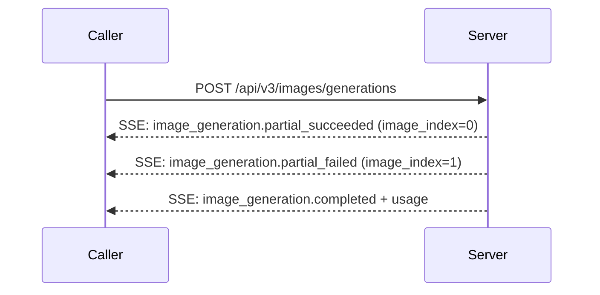

# BytePlus ModelArk · Image Generation API

---

## Schema Legend

### Column Order & Zone Logic

```
[ANCHOR]       [CLASSIFY]        [IDENTITY]        [CONTRACT]                                      [SEQUENCE]              [CLASSIFY-2]               [PROSE]                              [BINDING]
endpoint       kind              key · type · val  required · direction                            actor · seq-note        location · scope · pattern key-description · value-description  module · class · function
```

`endpoint` is col 1 because it is the primary grouping key — every other column is subordinate to it. A reader scans endpoint first to locate their context, then reads right into the row.

Zones read left-to-right from most structural (machine-queryable, sparse-friendly) to most discursive (human prose, binding metadata). The four sparsest columns (`module · class · function`, often blank during API reference pass) land at the far right so the informational core stays compact.

The `[SEQUENCE]` zone (`actor · seq-note`) sits between `[CONTRACT]` and `[CLASSIFY-2]` so that the direction of data flow (`direction`) is resolved before the participant (`actor`) and message label (`seq-note`) are assigned — enabling direct, lossless export to a Mermaid `sequenceDiagram` without touching any other column.

---

### Column Definitions

#### `endpoint`
The API operation this row belongs to. Format: `METHOD /path` (relative to `base-url`), e.g. `POST /api/v3/images/generations`. Use `ALL` for rows that apply globally across every endpoint (base URL, auth headers). Sort rows by endpoint, then by kind order within each endpoint.

**Kind sort order within an endpoint:** `config → header → path → param → return → enum → error`
This mirrors the natural implementation read order: setup → request → response → reference → errors.

---

#### `kind`
Controlled vocabulary. Classifies what type of entity the row describes. Determines which other columns are applicable (see sparsity rules below).

| kind | meaning | typical `direction` | `required` |
|------|---------|-------------------|------------|
| `config` | Operational/environment-level setting not part of the wire format | `in` or `out` | `yes` or `—` |
| `header` | HTTP request or response header | `in` or `out` | `yes` or `no` |
| `path` | URL path segment variable, interpolated before the request is sent | `in` | `yes` |
| `param` | Request body or query string parameter | `in` | `yes`, `no`, or `conditional` |
| `return` | Response body field | `out` | `yes`, `no`, or `conditional` |
| `enum` | Enumerated valid value for a `param` or `return` key | same as parent | `—` |
| `error` | HTTP status code or named error code returned by the server | `out` | `—` |

---

#### `key`
The canonical field name as it appears on the wire (API param name, header name, response field, error code key). For nested fields use dot-notation: `data[].url`, `error.code`. For codebase binding rows, use the internal symbol name and cross-reference via `key-description`.

**Key sort order:** a→z within each `kind` group within each `endpoint`, except `enum` rows which sort a→z by `value`.

---

#### `type`
Data type of the field. Use wire-format types: `string`, `integer`, `boolean`, `float`, `array<T>`, `object`, `string (url)`, `string (base64)`, `integer (unix)`. For enums, repeat the parent type (usually `string`). For discriminated union arrays, use `array<object (union)>`.

---

#### `value`
The fixed, default, or example value for this field. Use backtick formatting for literal values: `` `application/json` ``. Leave blank if the value is caller-supplied and has no fixed default. For `enum` rows, this column carries the specific enum value being documented.

---

#### `required`
Whether the field must be present. Controlled vocabulary:

| value | meaning |
|-------|---------|
| `yes` | Always required |
| `no` | Optional |
| `conditional` | Required only under specific conditions (explain in `value-description`) |
| `—` | Not applicable (used for `enum` and `error` rows) |

---

#### `direction`
Data flow relative to the caller.

| value | meaning |
|-------|---------|
| `in` | Caller → Server (request) |
| `out` | Server → Caller (response) |

---

#### `actor`
The named participant that **sends** this message in a `sequenceDiagram`. Decouples participant identity from the binary `direction` axis so multi-party flows (e.g. server → webhook → caller) are unambiguous.

Controlled vocabulary (`actor-vocab` in frontmatter):

| value | meaning |
|-------|---------|
| `Caller` | The API consumer (client application, SDK, browser) |
| `Server` | The API provider endpoint handling the request |
| `Broker` | An intermediary layer (queue, gateway, proxy) that relays messages between participants |
| `Webhook` | An external receiver the server POSTs callbacks to (owned by Caller but distinct from it in sequence) |
| `—` | Not applicable (`config`, `enum`, `error` rows that produce no diagram arrow) |

**Sparsity rule:** populate `—` for `config`, `enum`, and `error` rows. All other kinds must carry a named participant.

---

#### `seq-note`
A terse (≤ 60 characters) message label suitable for use as the arrow annotation in a Mermaid `sequenceDiagram`. Must be self-contained at a glance — no placeholders, no prose.

**Format:** imperative verb phrase or noun phrase that names the action, e.g.:
- `POST /images/generations`
- `Return task_id + status: queued`
- `Poll GET /tasks/{task_id}`
- `Callback: task succeeded`
- `401 Unauthorized`

**Rules:**
- No angle-bracket placeholders (`{{…}}`); use the actual key name or a short literal
- Prefer the HTTP method + path for top-level request rows
- Prefer `Return <key>` or `Respond <status>` for response rows
- For webhook flows, prefix with `Callback:`
- For polling steps, prefix with `Poll`
- Leave `—` for `config`, `enum`, and `error` rows that do not map to a diagram arrow

**Mermaid export note:** these values feed directly into the `->>` / `-->>` label position. Keep them free of Markdown special characters (no `|`, `"`, backticks).

---

#### `location`
Where on the wire this field lives. Disambiguates `param` rows and is always populated for `path`, `header`, `param`, and `return` kinds. Use `—` for `config`, `enum`, and `error` rows.

| value | meaning |
|-------|---------|
| `path` | Interpolated into the URL path, e.g. `/tasks/{id}` |
| `query` | Appended to the URL as a query string, e.g. `?limit=10` |
| `body` | Sent in the HTTP request or response body (JSON unless noted) |
| `header` | Transmitted in an HTTP header |
| `—` | Not applicable (`config`, `enum`, `error`) |

---

#### `scope`
Applicability constraint for this row — which versions, plans, tiers, or named variants the field applies to. Leave blank (populate with `—`) when the field applies universally to all variants of this endpoint.

**Format:** a dot-separated list of named applicability tokens, e.g. `seedream-5-0-lite · seedream-4-5`.

Use the API's own version/model/plan naming conventions verbatim. Do not invent abbreviations.

**Sparsity rule:** populate only when the field is genuinely restricted. A field available in all variants must carry `—`, not a list of every variant. Use `scope` to flag **exclusions**, not to repeat the universal case.

---

#### `pattern`
Structural pattern of this field's value shape. Enables tooling to select the correct parsing and validation strategy without reading prose.

| value | meaning |
|-------|---------|
| `scalar` | Single atomic value (string, integer, boolean, float) |
| `union` | Object whose shape is determined by a discriminant field (`type`, `kind`, etc.) |
| `array<union>` | Array where each element is a discriminated union object |
| `webhook` | String field that, when set, causes the server to POST responses to the supplied URL rather than (or in addition to) returning them inline |
| `state-machine` | Enumerable field whose values represent discrete lifecycle states with defined legal transitions |
| `—` | Not applicable or pattern is trivially scalar (use for `header`, `path`, `enum`, `error`, `config`) |

**Sparsity rule:** use `scalar` only when the distinction matters (i.e. the field is in a context where non-scalar patterns also appear). For `header`, `path`, `enum`, `error`, and most `config` rows, populate with `—`.

---

#### `key-description`
**Pattern: role → action → outcome**
Who uses this field → what it does mechanically → why it matters / what it affects downstream.

Format: `{Actor} → {verb phrase} → {consequence}`

- Actor is typically `Caller`, `Server`, or `Operator`
- Each clause is load-bearing; omit decorative clauses
- Do not describe the value range here (that belongs in `value-description`)

---

#### `value-description`
**Pattern: structured prose with placeholders**
Describes the valid value space, defaults, constraints, and behavioural notes for the field.

Omit inapplicable sub-clauses. Conditions under which a `conditional` field is required must be stated here.

---

#### `module · class · function`
Codebase binding columns. Leave blank during the API reference pass. Populated in a separate binding pass via static analysis or manual mapping.

---

### Categorisation Decisions

**`kind = config` vs `kind = param`**
`config` is for environment-level or operational settings not part of the wire request body (base URL, polling interval, TTL constants). `param` is for per-request fields sent in the HTTP body or query string.

**`kind = enum` rows**
Each valid value for a constrained field gets its own `enum` row. The `key` column repeats the parent param key. The `value` column carries the specific enum value. `required = —`.

**`required = conditional`**
Use when a field is required only in certain configurations. Always state the triggering condition in `value-description`.

**`endpoint = ALL`**
Use only for rows that are literally universal — apply to every endpoint in this document regardless of method or path.

**`key` for nested fields**
Use dot-notation for response object fields: `data[].url`, `data[].b64_json`, `error.code`. Bracket notation `[]` indicates array element.

---

### Mermaid `sequenceDiagram` Export Guide

The two columns `actor` and `seq-note` enable mechanical export. The mapping is:

| table column | `sequenceDiagram` construct |
|---|---|
| `actor` | participant / actor node label |
| `direction = in` | `->>` (synchronous) arrow from `actor` to counterpart |
| `direction = out` | `-->>` (synchronous) return arrow from `actor` to counterpart |
| `seq-note` | arrow label text |
| `pattern = state-machine` | candidates for `Note over Server: state` annotations |
| `scope` | optionally gates the arrow inside an `opt` or `alt` block |

**Example output** (streaming flow):



---

## Table

| endpoint | kind | key | type | value | required | direction | actor | seq-note | location | scope | pattern | key-description | value-description | module | class | function |
|----------|------|-----|------|-------|----------|-----------|-------|----------|----------|-------|---------|-----------------|-------------------|--------|-------|----------|
| ALL | config | base_url | string | `https://ark.ap-southeast.bytepluses.com/api/v3` | yes | in | — | — | — | ap-southeast-1 | — | Operator → set regional base URL → scopes all requests to the correct inference cluster | Region: ap-southeast-1; no trailing slash; region mismatch causes 401 or 404 | | | |
| ALL | config | base_url | string | `https://ark.eu-west.bytepluses.com/api/v3` | yes | in | — | — | — | eu-west-1 | — | Operator → set regional base URL → scopes all requests to the correct inference cluster | Region: eu-west-1; no trailing slash; region mismatch causes 401 or 404 | | | |
| ALL | header | Authorization | string | `Bearer <api_key>` | yes | in | Caller | Authenticate request | header | — | — | Caller → authenticate request → grants access to the API | Long-term API Key; obtain from API Key management page; format: Bearer \<api_key\>; only authentication method supported | | | |
| ALL | header | Content-Type | string | `application/json` | yes | in | Caller | Declare JSON body encoding | header | — | — | Caller → declare request body encoding → ensures server parses JSON body correctly | Fixed value; no other encoding accepted | | | |
| POST /api/v3/images/generations | param | guidance_scale | float | | no | in | Caller | POST /api/v3/images/generations | body | seedream-3-0-t2i · seededit-3-0-i2i | scalar | Caller → tune prompt adherence vs. creative freedom → higher values produce outputs that more closely follow the prompt | Default: 2.5 (seedream-3-0-t2i), 5.5 (seededit-3-0-i2i); Range: [1, 10]; higher value reduces model creative freedom and increases prompt adherence; not supported on seedream-5-0-lite, seedream-4-5, seedream-4-0 | | | |
| POST /api/v3/images/generations | param | image | string or array | | no | in | Caller | POST /api/v3/images/generations | body | seedream-5-0-lite · seedream-4-5 · seedream-4-0 · seededit-3-0-i2i | union | Caller → provide reference image(s) → enables image-guided generation or editing; seededit-3-0-t2i does not support this parameter | Formats: JPEG, PNG (seedream-5-0-lite/4-5/4-0 also support WEBP, BMP, TIFF, GIF); Max size: 10 MB per image; Width and height: > 14 px each; Aspect ratio: [1/16, 16] for seedream-5-0-lite/4-5/4-0, [1/3, 3] for seededit-3-0-i2i; Total pixels per image: ≤ 36,000,000 (6000×6000); Count: 1 for seededit-3-0-i2i, 1–14 for seedream-5-0-lite/4-5/4-0; Value: accessible URL or Base64 string (format: data:image/\<format\>;base64,\<data\>, format must be lowercase) | | | |
| POST /api/v3/images/generations | param | model | string | | yes | in | Caller | POST /api/v3/images/generations | body | — | scalar | Caller → specify model → routes request to the correct inference engine and capability set | Model ID (e.g. seedream-5-0-lite, seedream-4-5, seedream-4-0, seedream-3-0-t2i, seededit-3-0-i2i) or Endpoint ID (custom inference endpoint); see Model ID reference for full list | | | |
| POST /api/v3/images/generations | param | optimize_prompt_options | object | | no | in | Caller | POST /api/v3/images/generations | body | seedream-5-0-lite · seedream-4-5 · seedream-4-0 | scalar | Caller → configure prompt optimization feature → enables model to enhance the prompt before image generation | Only effective when the optimize_prompt_options.mode sub-field is set; seedream-4-5 only supports standard mode | | | |
| POST /api/v3/images/generations | param | optimize_prompt_options.mode | string | `standard` | no | in | Caller | POST /api/v3/images/generations | body | seedream-5-0-lite · seedream-4-5 · seedream-4-0 | scalar | Caller → select prompt optimization quality tier → trades off generation speed against prompt enhancement quality | Default: standard; Options: standard → higher quality, longer generation time; fast → faster, average quality; seedream-4-5 only supports standard | | | |
| POST /api/v3/images/generations | param | output_format | string | `jpeg` | no | in | Caller | POST /api/v3/images/generations | body | seedream-5-0-lite | scalar | Caller → specify output file encoding format → determines the container format of the returned image bytes | Default: jpeg; Options: jpeg, png; all other models (seedream-4-5/4-0, seededit-3-0-i2i/t2i) always output jpeg and do not support this parameter | | | |
| POST /api/v3/images/generations | param | prompt | string | | yes | in | Caller | POST /api/v3/images/generations | body | — | scalar | Caller → supply text description → drives content and style of the generated or edited image | Max recommended: 600 English words; excessively long prompts may cause model to miss fine details and focus only on major elements; see model-specific prompt guides for best practices | | | |
| POST /api/v3/images/generations | param | response_format | string | `url` | no | in | Caller | POST /api/v3/images/generations | body | — | scalar | Caller → select delivery method for generated images → determines whether images are returned as URLs or inline Base64 data | Default: url; Options: url → time-limited HTTPS download link (valid 24 h from generation, must be saved before expiry); b64_json → Base64-encoded image data as JSON string in response body | | | |
| POST /api/v3/images/generations | param | seed | integer | `-1` | no | in | Caller | POST /api/v3/images/generations | body | seedream-3-0-t2i · seededit-3-0-i2i | scalar | Caller → fix random seed → enables approximately reproducible outputs across calls with identical parameters | Default: -1 (random); Range: [-1, 2147483647]; same seed produces similar (not guaranteed identical) results; different seeds or unspecified seed always produce different outputs | | | |
| POST /api/v3/images/generations | param | sequential_image_generation | string | `disabled` | no | in | Caller | POST /api/v3/images/generations | body | seedream-5-0-lite · seedream-4-5 · seedream-4-0 | scalar | Caller → configure batch image output mode → controls whether the model generates a single image or a thematically-related batch | Default: disabled; Options: auto → model determines image count based on prompt and reference inputs; disabled → exactly one image generated | | | |
| POST /api/v3/images/generations | param | sequential_image_generation_options | object | | no | in | Caller | POST /api/v3/images/generations | body | seedream-5-0-lite · seedream-4-5 · seedream-4-0 | scalar | Caller → configure batch generation limits → caps the number of images returned per request | Only effective when sequential_image_generation is set to auto | | | |
| POST /api/v3/images/generations | param | sequential_image_generation_options.max_images | integer | `15` | no | in | Caller | POST /api/v3/images/generations | body | seedream-5-0-lite · seedream-4-5 · seedream-4-0 | scalar | Caller → cap number of generated images in batch → limits cost and response size per request | Default: 15; Range: [1, 15]; actual count is also constrained by number of input reference images (input count + output count ≤ 15) | | | |
| POST /api/v3/images/generations | param | size | string | | no | in | Caller | POST /api/v3/images/generations | body | — | scalar | Caller → specify output image dimensions → controls resolution and aspect ratio of the generated image | Default: 2048x2048 (pixel method) or model-default (keyword method); Two mutually exclusive methods: (1) Keyword — e.g. 1K, 2K, 3K, 4K; available keywords vary by model; model determines exact pixel dimensions; (2) Pixel — explicit WxH string; must satisfy both total pixel range AND aspect ratio range simultaneously; ranges vary by model; seededit-3-0-i2i uses adaptive matching against a fixed preset table | | | |
| POST /api/v3/images/generations | param | stream | boolean | `false` | no | in | Caller | POST /api/v3/images/generations | body | seedream-5-0-lite · seedream-4-5 · seedream-4-0 | scalar | Caller → enable streaming output → causes server to push each generated image immediately via SSE as it completes, rather than batching all images at the end | Default: false; true → Server-Sent Events (SSE), each image returned immediately after generation for both single and batch requests; false → all images returned together in a single JSON response | | | |
| POST /api/v3/images/generations | param | watermark | boolean | `true` | no | in | Caller | POST /api/v3/images/generations | body | — | scalar | Caller → control AI provenance watermark on generated image → adds or suppresses the built-in "AI generated" overlay | Default: true; true → "AI generated" watermark added to bottom-right corner of each output image; false → no watermark applied | | | |
| POST /api/v3/images/generations | return | created | integer (unix) | | yes | out | Server | Return created | body | non-streaming | scalar | Server → report request creation timestamp → enables logging, deduplication, and URL expiry calculation | Unix timestamp in seconds at the time the request was created | | | |
| POST /api/v3/images/generations | return | data | array<object (union)> | | yes | out | Server | Return data | body | non-streaming | array<union> | Server → deliver all image generation results → contains per-image success or error objects indexed in request order | Each element is either a success object (containing url or b64_json, optionally size) or an error object (containing error.code and error.message); content filter failures do not halt remaining batch tasks; internal 500 errors halt further generation in the batch | | | |
| POST /api/v3/images/generations | return | data[].b64_json | string (base64) | | conditional | out | Server | Return data[].b64_json | body | non-streaming | scalar | Server → deliver inline image data as Base64 → caller decodes to obtain image bytes without a separate HTTP fetch | Required when response_format=b64_json; base64-encoded image bytes; JPEG format unless output_format overrides on supported models | | | |
| POST /api/v3/images/generations | return | data[].error | object | | conditional | out | Server | Return data[].error | body | non-streaming | scalar | Server → report per-image generation failure → allows caller to detect and handle individual failures within a batch response | Present only for failed image entries within the data array; success entries do not include this field; content filter rejections allow remaining batch tasks to proceed; 500 errors halt all subsequent tasks | | | |
| POST /api/v3/images/generations | return | data[].error.code | string | | conditional | out | Server | Return data[].error.code | body | non-streaming | scalar | Server → identify per-image error type → enables programmatic error classification and retry decisions | Machine-readable error code; see Error Codes reference; e.g. OutputImageSensitiveContentDetected | | | |
| POST /api/v3/images/generations | return | data[].error.message | string | | conditional | out | Server | Return data[].error.message | body | non-streaming | scalar | Server → provide human-readable per-image error explanation → aids debugging of individual failed generations | Human-readable description of why this specific image failed to generate | | | |
| POST /api/v3/images/generations | return | data[].size | string | | no | out | Server | Return data[].size | body | non-streaming · seedream-5-0-lite · seedream-4-5 · seedream-4-0 | scalar | Server → report actual output image dimensions → informs caller of pixel dimensions for layout, storage, or token calculation | Format: \<width\>x\<height\>, e.g. 2048x2048; only returned by seedream-5-0-lite, seedream-4-5, seedream-4-0 | | | |
| POST /api/v3/images/generations | return | data[].url | string (url) | | conditional | out | Server | Return data[].url | body | non-streaming | scalar | Server → deliver image download link → caller must fetch and store the image before the link expires | Required when response_format=url; HTTPS download link; expires 24 h from generation time; must be saved or downloaded before expiry | | | |
| POST /api/v3/images/generations | return | error | object | | conditional | out | Server | Return error | body | non-streaming | scalar | Server → report request-level failure → indicates the entire request failed before any image was generated | Present when the whole request fails (distinct from per-image data[].error); contains error.code and error.message | | | |
| POST /api/v3/images/generations | return | error.code | string | | conditional | out | Server | Return error.code | body | non-streaming | scalar | Server → identify request-level error type → enables programmatic handling and routing of request failures | Machine-readable error code; see Error Codes reference; e.g. BadRequest | | | |
| POST /api/v3/images/generations | return | error.message | string | | conditional | out | Server | Return error.message | body | non-streaming | scalar | Server → provide human-readable request error explanation → aids debugging of failed requests | Human-readable description of the request-level error | | | |
| POST /api/v3/images/generations | return | model | string | | yes | out | Server | Return model | body | non-streaming | scalar | Server → identify model version used → allows caller to confirm which model processed the request | Format: \<model_name\>-\<version\>, e.g. seedream-5-0-260128 | | | |
| POST /api/v3/images/generations | return | usage | object | | yes | out | Server | Return usage | body | non-streaming | scalar | Server → report resource consumption for the request → used for billing and quota tracking | Contains three sub-fields: generated_images, output_tokens, total_tokens | | | |
| POST /api/v3/images/generations | return | usage.generated_images | integer | | yes | out | Server | Return usage.generated_images | body | non-streaming | scalar | Server → count successfully generated images → billing is based on this number | Number of successfully generated images; excludes failed generations; caller is only billed for this count | | | |
| POST /api/v3/images/generations | return | usage.output_tokens | integer | | yes | out | Server | Return usage.output_tokens | body | non-streaming | scalar | Server → report token consumption for generated images → used for per-token quota and billing | Calculated as round(sum(image_width × image_height) / 256) across all successful images | | | |
| POST /api/v3/images/generations | return | usage.total_tokens | integer | | yes | out | Server | Return usage.total_tokens | body | non-streaming | scalar | Server → report total token consumption → currently identical to output_tokens as input tokens are not counted | Equal to output_tokens; input tokens are not currently calculated | | | |
| POST /api/v3/images/generations | return | b64_json | string (base64) | | conditional | out | Server | SSE: Return b64_json | body | streaming · image_generation.partial_succeeded | scalar | Server → deliver inline image data for a streamed image → caller decodes to obtain image bytes without a separate HTTP fetch | Returned when response_format=b64_json; Base64-encoded image bytes for the image at image_index | | | |
| POST /api/v3/images/generations | return | created | integer (unix) | | yes | out | Server | SSE: Return created | body | streaming | scalar | Server → report request creation timestamp in each SSE event → enables event correlation and logging | Unix timestamp in seconds; same value across all events in a single streaming request | | | |
| POST /api/v3/images/generations | return | error | object | | yes | out | Server | SSE: Return error | body | streaming · image_generation.partial_failed | scalar | Server → report per-image failure details in streaming mode → allows caller to handle individual failures without aborting the stream | Contains error.code and error.message sub-fields; content filter rejections allow subsequent generation tasks to proceed; 500 errors halt all further tasks in the stream | | | |
| POST /api/v3/images/generations | return | error.code | string | | yes | out | Server | SSE: Return error.code | body | streaming · image_generation.partial_failed | scalar | Server → identify streaming per-image error type → enables programmatic classification and retry logic | Machine-readable error code; see Error Codes reference; e.g. OutputImageSensitiveContentDetected | | | |
| POST /api/v3/images/generations | return | error.message | string | | yes | out | Server | SSE: Return error.message | body | streaming · image_generation.partial_failed | scalar | Server → describe streaming per-image failure in human-readable form → aids debugging of individual failed images within a stream | Human-readable error description for the image at image_index | | | |
| POST /api/v3/images/generations | return | image_index | integer | | yes | out | Server | SSE: Return image_index | body | streaming · image_generation.partial_succeeded · image_generation.partial_failed | scalar | Server → identify image position in generation sequence → allows caller to track ordering and correlate streamed images with the batch request | Zero-based index; increments by 1 for every partial_succeeded and partial_failed event regardless of success status | | | |
| POST /api/v3/images/generations | return | model | string | | yes | out | Server | SSE: Return model | body | streaming | scalar | Server → identify model version in each SSE event → confirms which model processed the request | Format: \<model_name\>-\<version\>, e.g. seedream-5-0-260128; same value across all events in a single streaming request | | | |
| POST /api/v3/images/generations | return | size | string | | yes | out | Server | SSE: Return size | body | streaming · image_generation.partial_succeeded | scalar | Server → report pixel dimensions of the streamed image → informs caller of actual output dimensions for this image | Format: \<width\>×\<height\>, e.g. 2048×2048 | | | |
| POST /api/v3/images/generations | return | type | string | | yes | out | Server | SSE: Return event type | body | streaming | scalar | Server → identify SSE event kind → allows caller to route each event to the correct handler | Discriminant for streaming event; Options: image_generation.partial_succeeded → image generated successfully; image_generation.partial_failed → image failed to generate; image_generation.completed → final event, all tasks complete; error → request-level failure | | | |
| POST /api/v3/images/generations | return | url | string (url) | | conditional | out | Server | SSE: Return url | body | streaming · image_generation.partial_succeeded | scalar | Server → deliver streaming image download link → caller fetches and stores the image before the link expires | Returned when response_format=url; HTTPS link; expires 24 h after generation; must be saved before expiry | | | |
| POST /api/v3/images/generations | return | usage | object | | yes | out | Server | SSE: Return usage | body | streaming · image_generation.completed | scalar | Server → report final resource consumption after all streaming tasks complete → used for billing and quota tracking | Present only in the image_generation.completed event; contains generated_images, output_tokens, total_tokens sub-fields; represents totals for the entire streaming request | | | |
| POST /api/v3/images/generations | return | usage.generated_images | integer | | yes | out | Server | SSE: Return usage.generated_images | body | streaming · image_generation.completed | scalar | Server → count successfully streamed images → billing is based on this number | Count of images that generated successfully; excludes failed images; caller is only billed for successful images | | | |
| POST /api/v3/images/generations | return | usage.output_tokens | integer | | yes | out | Server | SSE: Return usage.output_tokens | body | streaming · image_generation.completed | scalar | Server → report token consumption for all streamed images → used for per-token quota and billing | Calculated as round(sum(image_height × image_width) / 256) across all successfully generated images | | | |
| POST /api/v3/images/generations | return | usage.total_tokens | integer | | yes | out | Server | SSE: Return usage.total_tokens | body | streaming · image_generation.completed | scalar | Server → report total token consumption for the streaming request → currently identical to output_tokens | Equal to output_tokens; input tokens are not currently calculated | | | |
| POST /api/v3/images/generations | enum | optimize_prompt_options.mode | string | `fast` | — | in | — | — | — | seedream-5-0-lite · seedream-4-0 | — | Faster prompt optimization at average quality | Reduced generation time; average prompt enhancement quality; not available on seedream-4-5 | | | |
| POST /api/v3/images/generations | enum | optimize_prompt_options.mode | string | `standard` | — | in | — | — | — | seedream-5-0-lite · seedream-4-5 · seedream-4-0 | — | Higher quality prompt optimization | Higher quality prompt enhancement; longer generation time; only mode available for seedream-4-5 | | | |
| POST /api/v3/images/generations | enum | output_format | string | `jpeg` | — | in | — | — | — | seedream-5-0-lite | — | JPEG output (default) | JPEG-encoded output image; default for all models; all models other than seedream-5-0-lite always use jpeg | | | |
| POST /api/v3/images/generations | enum | output_format | string | `png` | — | in | — | — | — | seedream-5-0-lite | — | PNG output | PNG-encoded output image; only available on seedream-5-0-lite | | | |
| POST /api/v3/images/generations | enum | response_format | string | `b64_json` | — | in | — | — | — | — | — | Return Base64-encoded image inline in JSON | Image delivered as base64 string in the response body; no separate HTTP fetch required; use when caller cannot follow redirects or store URLs | | | |
| POST /api/v3/images/generations | enum | response_format | string | `url` | — | in | — | — | — | — | — | Return download URL (default) | Time-limited HTTPS download link; expires 24 h after image generation; caller must fetch and save the image before expiry | | | |
| POST /api/v3/images/generations | enum | sequential_image_generation | string | `auto` | — | in | — | — | — | seedream-5-0-lite · seedream-4-5 · seedream-4-0 | — | Model auto-determines image count from prompt and inputs | Number of output images is chosen by the model based on prompt content and number of reference images; capped by sequential_image_generation_options.max_images; total input + output ≤ 15 | | | |
| POST /api/v3/images/generations | enum | sequential_image_generation | string | `disabled` | — | in | — | — | — | seedream-5-0-lite · seedream-4-5 · seedream-4-0 | — | Force single image output (default) | Exactly one image is generated regardless of prompt or reference inputs | | | |
| POST /api/v3/images/generations | enum | type | string | `error` | — | out | — | — | — | streaming | — | Request-level error event | Emitted when the entire streaming request fails; contains top-level error.code and error.message | | | |
| POST /api/v3/images/generations | enum | type | string | `image_generation.completed` | — | out | — | — | — | streaming | — | Final stream event after all tasks processed | Emitted after all images (successful or failed) have been processed; includes usage totals for billing | | | |
| POST /api/v3/images/generations | enum | type | string | `image_generation.partial_failed` | — | out | — | — | — | streaming | — | Per-image failure event in streaming mode | Emitted when an individual image fails to generate; image_index increments for each event; content filter failures allow next tasks to proceed; 500 errors halt further generation | | | |
| POST /api/v3/images/generations | enum | type | string | `image_generation.partial_succeeded` | — | out | — | — | — | streaming | — | Per-image success event in streaming mode | Emitted immediately after each image is successfully generated; image_index increments for each event; contains url or b64_json plus size | | | |

---

*Source: BytePlus ModelArk Image Generation API · docs ID 1666945 · retrieved 2026-04-26*
*fetch-status: ok*
*`module · class · function` columns intentionally blank — pending codebase binding pass*