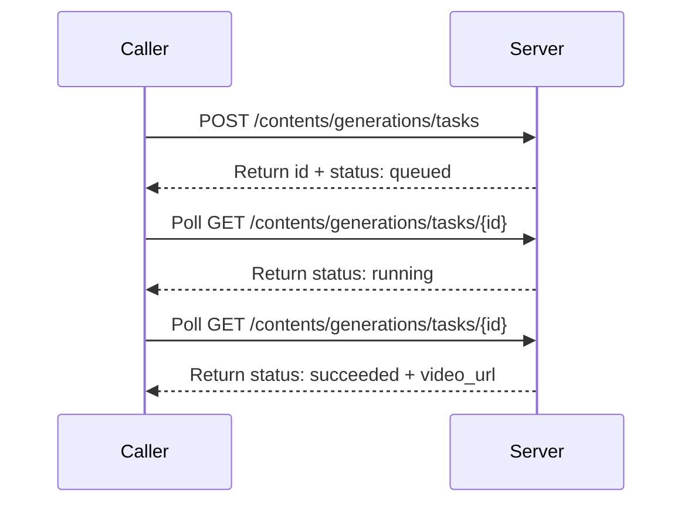

# BytePlus ModelArk · Video Generation API

---

## Schema Legend

### Column Order & Zone Logic

```
[ANCHOR]       [CLASSIFY]        [IDENTITY]        [CONTRACT]                                      [SEQUENCE]              [CLASSIFY-2]               [PROSE]                              [BINDING]
endpoint       kind              key · type · val  required · direction                            actor · seq-note        location · scope · pattern key-description · value-description  module · class · function
```

`endpoint` is col 1 because it is the primary grouping key — every other column is subordinate to it. A reader scans endpoint first to locate their context, then reads right into the row.

Zones read left-to-right from most structural (machine-queryable, sparse-friendly) to most discursive (human prose, binding metadata). The four sparsest columns (`module · class · function`, often blank during API reference pass) land at the far right so the informational core stays compact.

The `[SEQUENCE]` zone (`actor · seq-note`) sits between `[CONTRACT]` and `[CLASSIFY-2]` so that the direction of data flow (`direction`) is resolved before the participant (`actor`) and message label (`seq-note`) are assigned — enabling direct, lossless export to a Mermaid `sequenceDiagram` without touching any other column.

---

### Column Definitions

#### `endpoint`
The API operation this row belongs to. Format: `METHOD /path` (relative to `base-url`), e.g. `POST /api/v3/contents/generations/tasks`. Use `ALL` for rows that apply globally across every endpoint. Sort rows by endpoint, then by kind order within each endpoint.

**Kind sort order within an endpoint:** `config → header → path → param → return → enum → error`

---

#### `kind`
Controlled vocabulary. Classifies what type of entity the row describes.

| kind | meaning | typical `direction` | `required` |
|------|---------|-------------------|------------|
| `config` | Operational/environment-level setting not part of the wire format | `in` or `out` | `yes` or `—` |
| `header` | HTTP request or response header | `in` or `out` | `yes` or `no` |
| `path` | URL path segment variable, interpolated before the request is sent | `in` | `yes` |
| `param` | Request body or query string parameter | `in` | `yes`, `no`, or `conditional` |
| `return` | Response body field | `out` | `yes`, `no`, or `conditional` |
| `enum` | Enumerated valid value for a `param` or `return` key | same as parent | `—` |
| `error` | HTTP status code or named error code returned by the server | `out` | `—` |

---

#### `key`
The canonical field name as it appears on the wire. For nested fields use dot-notation: `items[].content.video_url`, `error.code`. For array elements use bracket notation `[]`.

**Key sort order:** a→z within each `kind` group within each `endpoint`, except `enum` rows which sort a→z by `value` within each parent key group.

---

#### `type`
Wire-format data type: `string`, `integer`, `boolean`, `float`, `array<T>`, `object`, `string (url)`, `string (base64)`, `integer (unix)`.

---

#### `value`
Fixed, default, or example value. Backtick-formatted literals. Blank when caller-supplied with no default. For `enum` rows, carries the specific enum value being documented.

---

#### `required`
`yes` · `no` · `conditional` · `—` (enum/error rows).

---

#### `direction`
`in` (Caller → Server) · `out` (Server → Caller).

---

#### `actor`
Named participant that **sends** this message. `Caller` · `Server` · `Broker` · `Webhook` · `—` (config/enum/error rows).

---

#### `seq-note`
Terse (≤ 60 chars) arrow label for Mermaid `sequenceDiagram`. Imperative verb phrase. `—` for config/enum/error rows. Polling steps prefixed with `Poll`. Webhook callbacks prefixed with `Callback:`.

---

#### `location`
`path` · `query` · `body` · `header` · `—` (config/enum/error).

---

#### `scope`
Applicability constraint. `—` when universally applicable. Dot-separated model or tier names when restricted, e.g. `seedance-2.0 · seedance-2.0-fast`.

---

#### `pattern`
`scalar` · `union` · `array<union>` · `webhook` · `state-machine` · `—`.

---

#### `key-description`
Pattern: `{Actor} → {verb phrase} → {consequence}`. Do not describe value ranges here.

---

#### `value-description`
Structured prose covering defaults, ranges, constraints, and behavioural notes. Conditions for `conditional` fields must be stated here.

---

#### `module · class · function`
Codebase binding columns. Blank during API reference pass; populated in a separate binding pass.

---

### Async Pattern: Poll

This API uses an asynchronous task model. The caller creates a task with `POST`, then polls `GET /{id}` until `status` reaches a terminal state. An optional `callback_url` webhook can replace or supplement polling.



Terminal states: `succeeded`, `failed`, `cancelled`, `expired`.

---

## Table

| endpoint | kind | key | type | value | required | direction | actor | seq-note | location | scope | pattern | key-description | value-description | module | class | function |
|----------|------|-----|------|-------|----------|-----------|-------|----------|----------|-------|---------|-----------------|-------------------|--------|-------|----------|
| ALL | config | base_url | string | `https://ark.ap-southeast.bytepluses.com/api/v3` | yes | in | — | — | — | — | — | Operator → set base URL → scopes all requests to the correct regional inference cluster | No trailing slash; region mismatch causes 401 or 404; only ap-southeast-1 documented; see region docs for other endpoints | | | |
| ALL | header | Authorization | string | `Bearer <api_key>` | yes | in | Caller | Authenticate request | header | — | — | Caller → authenticate request → grants access to the API | Long-term API Key; obtain from API Key management page; format: Bearer \<api_key\>; only authentication method supported | | | |
| ALL | header | Content-Type | string | `application/json` | yes | in | Caller | Declare JSON body encoding | header | — | — | Caller → declare request body encoding → ensures server parses JSON body correctly | Fixed value; no other encoding accepted | | | |
| POST /api/v3/contents/generations/tasks | param | callback_url | string (url) | | no | in | Caller | POST /contents/generations/tasks | body | — | webhook | Caller → register webhook URL → causes Server to POST task status updates to this address on every status change, eliminating the need to poll | Server POSTs to this URL on status change; payload mirrors GET /contents/generations/tasks/{id} response body; retry policy: 3 attempts if no acknowledgement within 5 s; states that trigger callback: queued, running, succeeded, failed, expired | | | |
| POST /api/v3/contents/generations/tasks | param | camera_fixed | boolean | `false` | no | in | Caller | POST /contents/generations/tasks | body | seedance-1.0-pro · seedance-1.0-pro-fast · seedance-1.5-pro · seedance-1.0-lite | scalar | Caller → lock camera position → instructs model to append a camera-fix directive to the prompt | Default: false; true → platform appends camera-fix instruction to prompt (effect not guaranteed); false → camera may move freely; not supported by seedance-2.0/2.0-fast; reference image-based generation is not supported | | | |
| POST /api/v3/contents/generations/tasks | param | content | array<object (union)> | | yes | in | Caller | POST /contents/generations/tasks | body | — | array<union> | Caller → provide generation references → supplies the text, image, video, audio, or sample inputs from which the model generates the video | Discriminant: content[].type; Variants: text, image_url, video_url (seedance-2.0/2.0-fast only), audio_url (seedance-2.0/2.0-fast only), draft_task (seedance-1.5-pro only); Combination rules: text alone; text+image; text+video; text+image+audio; text+image+video; text+image+video+audio; draft_task alone; audio cannot be input alone — at least one image or video required; seedance-2.0 series does not support direct upload of reference content containing real human faces | | | |
| POST /api/v3/contents/generations/tasks | param | content[].audio_url | object | | conditional | in | Caller | POST /contents/generations/tasks | body | seedance-2.0 · seedance-2.0-fast | scalar | Caller → provide audio reference object → wraps the audio URL or Base64 payload for model consumption | Required when content[].type = audio_url; contains content[].audio_url.url sub-field | | | |
| POST /api/v3/contents/generations/tasks | param | content[].audio_url.url | string | | conditional | in | Caller | POST /contents/generations/tasks | body | seedance-2.0 · seedance-2.0-fast | scalar | Caller → supply audio asset → provides reference audio to guide video generation | Required when content[].type = audio_url; Formats: wav, mp3; Duration: [2, 15] s per file; Max 3 audio files, total duration ≤ 15 s; Max size: 15 MB per file, 64 MB per request body; Values: accessible URL; Base64 string (format: data:audio/\<format\>;base64,\<data\>, format must be lowercase); or Asset ID (format: asset://\<ASSET_ID\>) | | | |
| POST /api/v3/contents/generations/tasks | param | content[].draft_task | object | | conditional | in | Caller | POST /contents/generations/tasks | body | seedance-1.5-pro | scalar | Caller → provide draft task reference → wraps the sample task ID so the model can generate a final-quality video from a previously approved draft | Required when content[].type = draft_task; contains content[].draft_task.id sub-field | | | |
| POST /api/v3/contents/generations/tasks | param | content[].draft_task.id | string | | conditional | in | Caller | POST /contents/generations/tasks | body | seedance-1.5-pro | scalar | Caller → identify draft video task → platform reuses all inputs from the draft (model, text, image_url, generate_audio, seed, ratio, duration, frames, camera_fixed) to produce the final video | Required when content[].type = draft_task; obtain from a prior create-task response with draft=true; parameters not present in the draft may be specified in the new request; otherwise model defaults apply | | | |
| POST /api/v3/contents/generations/tasks | param | content[].image_url | object | | conditional | in | Caller | POST /contents/generations/tasks | body | — | scalar | Caller → provide image reference object → wraps the image URL or Base64 payload for model consumption | Required when content[].type = image_url; contains content[].image_url.url and optionally content[].role sub-fields | | | |
| POST /api/v3/contents/generations/tasks | param | content[].image_url.url | string | | conditional | in | Caller | POST /contents/generations/tasks | body | — | scalar | Caller → supply image asset → provides start frame, end frame, or reference image for video generation | Required when content[].type = image_url; Formats: jpeg, png, webp, bmp, tiff, gif (seedance-1.5-pro also supports heic, heif); Aspect ratio (width/height): (0.4, 2.5); Width and height: (300, 6000) px; Max size: 30 MB per image, 64 MB per request body; Count: 1 for first-frame only; 2 for first+last frame; 1–9 for seedance-2.0 multimodal; 1–4 for seedance-1.0-lite-i2v; Values: accessible URL; Base64 string (format: data:image/\<format\>;base64,\<data\>); or Asset ID (format: asset://\<ASSET_ID\>) | | | |
| POST /api/v3/contents/generations/tasks | param | content[].role | string | | conditional | in | Caller | POST /contents/generations/tasks | body | — | scalar | Caller → specify image or media role → tells model whether the asset is a first frame, last frame, reference image, reference video, or reference audio | Applicable when content[].type is image_url, video_url, or audio_url; valid values depend on type — see enum rows; image-to-video (first frame), image-to-video (first+last frame), and multimodal reference generation are mutually exclusive and cannot be mixed within a single request; omitting role for a single image defaults to first_frame behavior | | | |
| POST /api/v3/contents/generations/tasks | param | content[].text | string | | conditional | in | Caller | POST /contents/generations/tasks | body | — | scalar | Caller → supply text prompt → describes the video content or appends legacy parameter commands to control output specs | Required when content[].type = text; Supported languages: English (all models); Japanese, Indonesian, Spanish, Portuguese (seedance-2.0/2.0-fast only); Max recommended length: 1000 English words; legacy parameter syntax: append --[param] [value] after the prompt (e.g. --rs 720p --rt 16:9 --dur 5); new method preferred: pass parameters as top-level request body fields | | | |
| POST /api/v3/contents/generations/tasks | param | content[].type | string | | yes | in | Caller | POST /contents/generations/tasks | body | — | scalar | Caller → declare content element type → routes the array element to the correct content handler and determines which sibling fields are required | Discriminant for content union; Options: text, image_url, video_url (seedance-2.0/2.0-fast only), audio_url (seedance-2.0/2.0-fast only), draft_task (seedance-1.5-pro only) | | | |
| POST /api/v3/contents/generations/tasks | param | content[].video_url | object | | conditional | in | Caller | POST /contents/generations/tasks | body | seedance-2.0 · seedance-2.0-fast | scalar | Caller → provide video reference object → wraps the video URL payload for model consumption | Required when content[].type = video_url; contains content[].video_url.url sub-field; only video URL is supported (no Base64) | | | |
| POST /api/v3/contents/generations/tasks | param | content[].video_url.url | string (url) | | conditional | in | Caller | POST /contents/generations/tasks | body | seedance-2.0 · seedance-2.0-fast | scalar | Caller → supply reference video asset → provides video for editing, extension, or multimodal reference generation | Required when content[].type = video_url; Formats: mp4, mov; Encodings: H.264/AVC, H.265/HEVC video; AAC, MP3 audio; Resolution: 480p, 720p, or 1080p; Duration: [2, 15] s per video; Max 3 videos, total duration ≤ 15 s; Dimensions: aspect ratio (width/height) [0.4, 2.5], width and height [300, 6000] px, total pixels [409600, 2086876]; Max size: 50 MB per video; FPS: [24, 60]; Values: accessible public URL or Asset ID (format: asset://\<ASSET_ID\>) | | | |
| POST /api/v3/contents/generations/tasks | param | draft | boolean | `false` | no | in | Caller | POST /contents/generations/tasks | body | seedance-1.5-pro | scalar | Caller → enable draft mode → generates a lower-cost 480p preview video to verify scene structure and prompt alignment before committing to full generation | Default: false; true → 480p draft video; reduces token cost; does not support return_last_frame or offline inference (flex service_tier); false → standard quality video; Note: draft=true generates a draft task ID; pass that ID via content[].draft_task.id to produce the final video | | | |
| POST /api/v3/contents/generations/tasks | param | duration | integer | `5` | no | in | Caller | POST /contents/generations/tasks | body | — | scalar | Caller → set video duration in whole seconds → directly controls output length and billing cost | Default: 5; Range by model: seedance-1.0-pro / seedance-1.0-pro-fast / seedance-1.0-lite: [2, 12] s; seedance-1.5-pro: [4, 12] or -1; seedance-2.0/2.0-fast: [4, 15] or -1; -1 (seedance-2.0 / seedance-1.5-pro only): model autonomously selects duration within valid range; frames takes precedence when both are specified; use duration for integer-second videos | | | |
| POST /api/v3/contents/generations/tasks | param | execution_expires_after | integer | `172800` | no | in | Caller | POST /contents/generations/tasks | body | — | scalar | Caller → set task expiry threshold → caps how long a queued or running task is permitted to exist before being auto-terminated | Default: 172800 (48 h); Range: [3600, 259200] seconds; tasks exceeding this threshold are automatically terminated and marked expired; calculated from created_at timestamp | | | |
| POST /api/v3/contents/generations/tasks | param | frames | integer | | no | in | Caller | POST /contents/generations/tasks | body | seedance-1.0-pro · seedance-1.0-pro-fast · seedance-1.0-lite | scalar | Caller → set output frame count → enables fractional-second video lengths not expressible as integer seconds | Not supported by seedance-2.0/2.0-fast or seedance-1.5-pro; Range: integers in [29, 289] conforming to format 25+4n (n is a positive integer); frames takes precedence over duration when both are specified; Calculation: frames = duration × 24; example: 2.4 s → 2.4×24=57.6 → round to nearest valid value 57 → actual duration 57/24=2.375 s | | | |
| POST /api/v3/contents/generations/tasks | param | generate_audio | boolean | `true` | no | in | Caller | POST /contents/generations/tasks | body | seedance-2.0 · seedance-2.0-fast · seedance-1.5-pro | scalar | Caller → toggle synchronized audio generation → controls whether the output video includes model-generated voice, sound effects, and background music | Default: true; true → model generates audio synchronized with visuals (seedance-1.5-pro auto-generates voice, sound effects, background music based on prompt; enclose dialogue in double quotes); false → silent video output; not supported by seedance-1.0 series | | | |
| POST /api/v3/contents/generations/tasks | param | model | string | | yes | in | Caller | POST /contents/generations/tasks | body | — | scalar | Caller → specify model → routes request to the correct inference engine and capability set | Model ID (e.g. dreamina-seedance-2-0-260128, seedance-1-5-pro, seedance-1-0-pro, seedance-pro-fast, seedance-1-0-lite-t2v, seedance-1-0-lite-i2v) or Endpoint ID (custom inference endpoint); see Model ID reference for full list; chosen model determines which params and value ranges are valid | | | |
| POST /api/v3/contents/generations/tasks | param | ratio | string | | no | in | Caller | POST /contents/generations/tasks | body | — | scalar | Caller → set output video aspect ratio → controls the width-to-height shape of the generated video | Default: adaptive (seedance-2.0/2.0-fast and seedance-1.5-pro); 16:9 for t2v or adaptive for i2v (other models); 16:9 for seedance-1.0-lite reference image generation; Options: 16:9, 4:3, 1:1, 3:4, 9:16, 21:9, adaptive; adaptive — model selects ratio automatically based on input content; actual ratio returned in GET response ratio field; if output ratio differs from input image, Ark crops the image centered; exact pixel dimensions per ratio and resolution: see pixel dimension table in source docs | | | |
| POST /api/v3/contents/generations/tasks | param | resolution | string | | no | in | Caller | POST /contents/generations/tasks | body | — | scalar | Caller → set output video resolution → determines pixel dimensions and billing tier of the generated video | Default: 720p (seedance-2.0/2.0-fast, seedance-1.5-pro, seedance-1.0-lite); 1080p (seedance-1.0-pro, seedance-1.0-pro-fast); Options: 480p, 720p, 1080p; 1080p not supported by seedance-1.0-lite reference image generation or seedance-2.0-fast; can be passed via new body field (strict validation) or legacy --rs text command (lenient validation) | | | |
| POST /api/v3/contents/generations/tasks | param | return_last_frame | boolean | `false` | no | in | Caller | POST /contents/generations/tasks | body | — | scalar | Caller → request last-frame image extraction → causes the task result to include a PNG of the final video frame, usable as the first frame of a subsequent video for chained generation | Default: false; true → last frame PNG (same pixel dimensions as video, no watermark) is available via content.last_frame_url in the GET task response; false → last frame not extracted; not supported in draft mode | | | |
| POST /api/v3/contents/generations/tasks | param | safety_identifier | string | | no | in | Caller | POST /contents/generations/tasks | body | — | scalar | Caller → tag request with stable end-user identifier → enables platform-side detection of policy violations per user without exposing personal data | Max length: 64 ASCII characters; must be stable and unique per end user; recommended: hash of username, user ID, or email to avoid PII exposure; returned unchanged in GET task response | | | |
| POST /api/v3/contents/generations/tasks | param | seed | integer | `-1` | no | in | Caller | POST /contents/generations/tasks | body | — | scalar | Caller → fix random seed → enables approximately reproducible outputs across calls with identical parameters | Default: -1 (random); Range: [-1, 2^32-1]; same seed produces similar (not guaranteed identical) results; different seeds always yield different outputs; can be passed via new body field or legacy --seed text command | | | |
| POST /api/v3/contents/generations/tasks | param | service_tier | string | `default` | no | in | Caller | POST /contents/generations/tasks | body | — | scalar | Caller → select inference tier → trades latency and concurrency quota against price | Default: default; Options: default → online inference, lower RPM/concurrency, standard pricing; flex → offline inference, higher TPD quota, 50% price of online tier, higher latency acceptable; once submitted, service tier cannot be changed; seedance-2.0/2.0-fast does not support flex; actual tier applied is returned in GET task response service_tier field | | | |
| POST /api/v3/contents/generations/tasks | param | watermark | boolean | `false` | no | in | Caller | POST /contents/generations/tasks | body | — | scalar | Caller → control output watermark → adds or suppresses a visible watermark overlay on the generated video | Default: false; true → watermark added; false → no watermark; can be passed via new body field (strict validation) or legacy --wm text command (lenient validation) | | | |
| POST /api/v3/contents/generations/tasks | return | id | string | | yes | out | Server | Return task id | body | — | scalar | Server → issue task identifier → caller uses this ID to poll status and retrieve results | Task record retained for 7 days from created_at timestamp; auto-deleted after expiry; draft=true produces a draft task ID; draft=false produces a standard task ID; asynchronous — caller must poll GET /contents/generations/tasks/{id} for completion | | | |
| POST /api/v3/contents/generations/tasks | enum | content[].role | string | `first_frame` | — | in | — | — | — | — | — | First frame of the generated video | Used with content[].type=image_url; all image-to-video models; role may be omitted for a single first-frame image | | | |
| POST /api/v3/contents/generations/tasks | enum | content[].role | string | `last_frame` | — | in | — | — | — | seedance-2.0 · seedance-1.5-pro · seedance-1.0-pro · seedance-1.0-lite-i2v | — | Last frame of the generated video | Used with content[].type=image_url; requires a corresponding first_frame image; if aspect ratios differ, first_frame takes precedence and last_frame is cropped | | | |
| POST /api/v3/contents/generations/tasks | enum | content[].role | string | `reference_audio` | — | in | — | — | — | seedance-2.0 · seedance-2.0-fast | — | Reference audio for multimodal generation | Used with content[].type=audio_url; cannot be used without at least one reference image or video | | | |
| POST /api/v3/contents/generations/tasks | enum | content[].role | string | `reference_image` | — | in | — | — | — | seedance-2.0 · seedance-1.0-lite-i2v | — | Reference image for multimodal generation | Used with content[].type=image_url; seedance-2.0 supports 1–9 images; seedance-1.0-lite-i2v supports 1–4 images; specify combinations in prompt using [Image N] notation for best results | | | |
| POST /api/v3/contents/generations/tasks | enum | content[].role | string | `reference_video` | — | in | — | — | — | seedance-2.0 · seedance-2.0-fast | — | Reference video for multimodal generation | Used with content[].type=video_url; supports new video generation, video editing, and video extension scenarios | | | |
| POST /api/v3/contents/generations/tasks | enum | content[].type | string | `audio_url` | — | in | — | — | — | seedance-2.0 · seedance-2.0-fast | — | Audio input element | Activates content[].audio_url and content[].audio_url.url sub-fields; requires role=reference_audio; must be accompanied by at least one image or video | | | |
| POST /api/v3/contents/generations/tasks | enum | content[].type | string | `draft_task` | — | in | — | — | — | seedance-1.5-pro | — | Draft (sample) task input element | Activates content[].draft_task and content[].draft_task.id sub-fields; platform reuses all inputs from the referenced draft task | | | |
| POST /api/v3/contents/generations/tasks | enum | content[].type | string | `image_url` | — | in | — | — | — | — | — | Image input element | Activates content[].image_url, content[].image_url.url, and content[].role sub-fields; all image-to-video and multimodal models | | | |
| POST /api/v3/contents/generations/tasks | enum | content[].type | string | `text` | — | in | — | — | — | — | — | Text prompt input element | Activates content[].text sub-field; supported by all models; optional when combined with other content types | | | |
| POST /api/v3/contents/generations/tasks | enum | content[].type | string | `video_url` | — | in | — | — | — | seedance-2.0 · seedance-2.0-fast | — | Video input element | Activates content[].video_url, content[].video_url.url, and content[].role sub-fields; only video URL is supported (no Base64 for video) | | | |
| POST /api/v3/contents/generations/tasks | enum | ratio | string | `1:1` | — | in | — | — | — | — | — | Square aspect ratio | Pixel dimensions vary by resolution and model family; see source pixel dimension table | | | |
| POST /api/v3/contents/generations/tasks | enum | ratio | string | `16:9` | — | in | — | — | — | — | — | Landscape widescreen aspect ratio | Default for text-to-video on most models; pixel dimensions vary by resolution | | | |
| POST /api/v3/contents/generations/tasks | enum | ratio | string | `21:9` | — | in | — | — | — | — | — | Ultra-wide cinematic aspect ratio | Pixel dimensions vary by resolution and model family | | | |
| POST /api/v3/contents/generations/tasks | enum | ratio | string | `3:4` | — | in | — | — | — | — | — | Portrait aspect ratio | Pixel dimensions vary by resolution and model family | | | |
| POST /api/v3/contents/generations/tasks | enum | ratio | string | `4:3` | — | in | — | — | — | — | — | Standard landscape aspect ratio | Pixel dimensions vary by resolution and model family | | | |
| POST /api/v3/contents/generations/tasks | enum | ratio | string | `9:16` | — | in | — | — | — | — | — | Vertical short-form aspect ratio | Pixel dimensions vary by resolution and model family | | | |
| POST /api/v3/contents/generations/tasks | enum | ratio | string | `adaptive` | — | in | — | — | — | seedance-2.0 · seedance-2.0-fast · seedance-1.5-pro | — | Model auto-selects aspect ratio | Default for seedance-2.0/2.0-fast and seedance-1.5-pro; t2v: ratio chosen from prompt intent; first-frame/first+last-frame i2v: ratio chosen from first-frame image; multimodal: ratio chosen from first media file (video prioritized over image); actual ratio returned in GET response ratio field | | | |
| POST /api/v3/contents/generations/tasks | enum | resolution | string | `1080p` | — | in | — | — | — | seedance-1.0-pro · seedance-1.0-pro-fast · seedance-1.5-pro · seedance-2.0 | — | Full HD resolution | Default for seedance-1.0-pro/pro-fast; not supported by seedance-1.0-lite reference image generation or seedance-2.0-fast | | | |
| POST /api/v3/contents/generations/tasks | enum | resolution | string | `480p` | — | in | — | — | — | — | — | Low resolution | Forced when draft=true; lowest cost tier | | | |
| POST /api/v3/contents/generations/tasks | enum | resolution | string | `720p` | — | in | — | — | — | — | — | HD resolution | Default for seedance-2.0/2.0-fast, seedance-1.5-pro, seedance-1.0-lite | | | |
| POST /api/v3/contents/generations/tasks | enum | service_tier | string | `default` | — | in | — | — | — | — | — | Online inference (default) | Lower RPM and concurrency quotas; standard pricing; suitable for latency-sensitive scenarios | | | |
| POST /api/v3/contents/generations/tasks | enum | service_tier | string | `flex` | — | in | — | — | — | seedance-1.0-pro · seedance-1.0-pro-fast · seedance-1.0-lite · seedance-1.5-pro | — | Offline inference | Higher TPD quota; 50% price of online tier; higher latency; suitable for non-latency-sensitive batch workloads; not supported by seedance-2.0/2.0-fast | | | |
| GET /api/v3/contents/generations/tasks/{id} | path | id | string | | yes | in | Caller | Poll GET /contents/generations/tasks/{id} | path | — | — | Caller → identify task to retrieve → selects the specific video generation task record to return | Task ID returned in POST create response; records retained for 7 days from created_at; expired or deleted records return 404 | | | |
| GET /api/v3/contents/generations/tasks/{id} | return | content | object | | conditional | out | Server | Return content | body | — | scalar | Server → deliver generation output container → holds video and optional last-frame URLs once task succeeds | Present and populated when status=succeeded; null or absent for other states | | | |
| GET /api/v3/contents/generations/tasks/{id} | return | content.last_frame_url | string (url) | | conditional | out | Server | Return content.last_frame_url | body | — | scalar | Server → deliver last-frame image URL → allows caller to use the final video frame as the first frame of a subsequent generation task for seamless chaining | Present only when return_last_frame=true was set in the create request and status=succeeded; PNG format, same pixel dimensions as video, no watermark; expires 24 h after generation; must be saved before expiry | | | |
| GET /api/v3/contents/generations/tasks/{id} | return | content.video_url | string (url) | | conditional | out | Server | Return content.video_url | body | — | scalar | Server → deliver generated video download URL → caller fetches and stores the video before the link expires | Present when status=succeeded; expires 24 h after generation; save promptly before expiry | | | |
| GET /api/v3/contents/generations/tasks/{id} | return | created_at | integer (unix) | | yes | out | Server | Return created_at | body | — | scalar | Server → report task creation timestamp → enables TTL calculation (record expires 7 days after created_at) and execution_expires_after countdown | Unix timestamp in seconds | | | |
| GET /api/v3/contents/generations/tasks/{id} | return | draft | boolean | | conditional | out | Server | Return draft | body | seedance-1.5-pro | scalar | Server → indicate whether output is a draft or standard video → allows caller to branch workflow based on draft mode | Only returned by seedance-1.5-pro; true → current output is a draft video; false → current output is a standard video | | | |
| GET /api/v3/contents/generations/tasks/{id} | return | draft_task_id | string | | conditional | out | Server | Return draft_task_id | body | seedance-1.5-pro | scalar | Server → echo the source draft task ID → allows caller to trace which draft this final video was generated from | Returned only when the task was created using a draft_task content element | | | |
| GET /api/v3/contents/generations/tasks/{id} | return | duration | integer | | conditional | out | Server | Return duration | body | — | scalar | Server → report actual video length in seconds → enables billing calculation and downstream player configuration | Returned when frames was not specified in the create request; mutually exclusive with frames in the response; value may differ from requested duration when smart duration (-1) was used | | | |
| GET /api/v3/contents/generations/tasks/{id} | return | error | object | | conditional | out | Server | Return error | body | — | scalar | Server → report task failure details → allows caller to classify the error and decide on retry or escalation | null when task succeeds; populated when status=failed; contains error.code and error.message; see Error Codes reference | | | |
| GET /api/v3/contents/generations/tasks/{id} | return | error.code | string | | conditional | out | Server | Return error.code | body | — | scalar | Server → identify task failure type → enables programmatic error classification and retry logic | Machine-readable error code; see Error Codes reference | | | |
| GET /api/v3/contents/generations/tasks/{id} | return | error.message | string | | conditional | out | Server | Return error.message | body | — | scalar | Server → provide human-readable failure description → aids debugging of failed generation tasks | Human-readable description of why the task failed | | | |
| GET /api/v3/contents/generations/tasks/{id} | return | execution_expires_after | integer | | yes | out | Server | Return execution_expires_after | body | — | scalar | Server → echo the task expiry threshold → allows caller to confirm the TTL applied to this task | Value in seconds; reflects what was set in the create request (or the default 172800) | | | |
| GET /api/v3/contents/generations/tasks/{id} | return | frames | integer | | conditional | out | Server | Return frames | body | — | scalar | Server → report actual frame count of generated video → returned when frames was explicitly specified in the create request | Mutually exclusive with duration in the response; returned only when frames was set in the create request | | | |
| GET /api/v3/contents/generations/tasks/{id} | return | framespersecond | integer | | yes | out | Server | Return framespersecond | body | — | scalar | Server → report video frame rate → used to calculate exact duration from frame count (duration = frames / framespersecond) | Frame rate of the generated video in frames per second | | | |
| GET /api/v3/contents/generations/tasks/{id} | return | generate_audio | boolean | | conditional | out | Server | Return generate_audio | body | seedance-2.0 · seedance-2.0-fast · seedance-1.5-pro | scalar | Server → confirm audio generation status → indicates whether the output video contains synchronized audio | Only returned by seedance-2.0/2.0-fast and seedance-1.5-pro; true → video has synchronized audio; false → silent video | | | |
| GET /api/v3/contents/generations/tasks/{id} | return | id | string | | yes | out | Server | Return id | body | — | scalar | Server → echo task identifier → confirms which task record was retrieved | Same value as the {id} path parameter; retained for 7 days from created_at | | | |
| GET /api/v3/contents/generations/tasks/{id} | return | model | string | | yes | out | Server | Return model | body | — | scalar | Server → report model version used → confirms which model and version processed the task | Format: \<model_name\>-\<version\>, e.g. seedance-2-0-260128 | | | |
| GET /api/v3/contents/generations/tasks/{id} | return | ratio | string | | yes | out | Server | Return ratio | body | — | scalar | Server → report actual aspect ratio of generated video → critical when adaptive was requested, since the actual ratio is only known after generation | Actual width-to-height ratio of the generated video; may differ from the requested ratio value when adaptive was used | | | |
| GET /api/v3/contents/generations/tasks/{id} | return | resolution | string | | yes | out | Server | Return resolution | body | — | scalar | Server → report resolution of generated video → confirms which resolution tier was applied | Actual resolution: 480p, 720p, or 1080p | | | |
| GET /api/v3/contents/generations/tasks/{id} | return | safety_identifier | string | | conditional | out | Server | Return safety_identifier | body | — | scalar | Server → echo end-user identifier → returned unchanged if set in the create request, for caller-side audit logging | Only present if safety_identifier was set in the create request | | | |
| GET /api/v3/contents/generations/tasks/{id} | return | seed | integer | | yes | out | Server | Return seed | body | — | scalar | Server → report seed value used → enables caller to reproduce similar results by reusing this seed in a new request | Actual integer seed applied; if -1 was specified in the create request, the actual randomly-chosen seed is returned here | | | |
| GET /api/v3/contents/generations/tasks/{id} | return | service_tier | string | | yes | out | Server | Return service_tier | body | — | scalar | Server → confirm inference tier actually used → allows caller to verify billing and concurrency tier | Actual service tier applied: default or flex | | | |
| GET /api/v3/contents/generations/tasks/{id} | return | status | string | | yes | out | Server | Return status | body | — | state-machine | Server → report current task lifecycle state → primary signal for polling termination; caller stops polling when a terminal state is reached | States: queued → running → succeeded / failed / expired; cancelled reachable from queued only; Terminal states: succeeded, failed, cancelled, expired; Transitions: queued → running; running → succeeded / failed / expired; queued → cancelled (via DELETE); see enum rows for per-state descriptions | | | |
| GET /api/v3/contents/generations/tasks/{id} | return | updated_at | integer (unix) | | yes | out | Server | Return updated_at | body | — | scalar | Server → report last state-change timestamp → enables caller to detect stalled tasks and calculate elapsed time | Unix timestamp in seconds; updates on every status transition | | | |
| GET /api/v3/contents/generations/tasks/{id} | return | usage | object | | conditional | out | Server | Return usage | body | — | scalar | Server → report token consumption for the task → used for billing and quota tracking | Populated when task has consumed resources; contains completion_tokens and total_tokens sub-fields | | | |
| GET /api/v3/contents/generations/tasks/{id} | return | usage.completion_tokens | integer | | conditional | out | Server | Return usage.completion_tokens | body | — | scalar | Server → report video output token count → primary billing metric for video generation | Number of tokens consumed for the generated video; billing is based on this count | | | |
| GET /api/v3/contents/generations/tasks/{id} | return | usage.total_tokens | integer | | conditional | out | Server | Return usage.total_tokens | body | — | scalar | Server → report total request token count → equals completion_tokens since input tokens are always 0 for video models | Equal to usage.completion_tokens; input tokens are always 0 for video generation models | | | |
| GET /api/v3/contents/generations/tasks/{id} | enum | status | string | `cancelled` | — | out | — | — | — | — | — | Task was cancelled | Terminal state; reachable only from queued via DELETE; task record deleted on subsequent DELETE call | | | |
| GET /api/v3/contents/generations/tasks/{id} | enum | status | string | `expired` | — | out | — | — | — | — | — | Task exceeded expiry threshold | Terminal state; task remained queued or running longer than execution_expires_after seconds from created_at; auto-terminated by platform | | | |
| GET /api/v3/contents/generations/tasks/{id} | enum | status | string | `failed` | — | out | — | — | — | — | — | Task failed | Terminal state; error.code and error.message populated; task record deletable via DELETE | | | |
| GET /api/v3/contents/generations/tasks/{id} | enum | status | string | `queued` | — | out | — | — | — | — | — | Task is awaiting processing | Non-terminal; task is in queue waiting for an inference slot; cancellable via DELETE | | | |
| GET /api/v3/contents/generations/tasks/{id} | enum | status | string | `running` | — | out | — | — | — | — | — | Task is actively executing | Non-terminal; model is generating the video; cannot be cancelled | | | |
| GET /api/v3/contents/generations/tasks/{id} | enum | status | string | `succeeded` | — | out | — | — | — | — | — | Task completed successfully | Terminal state; content.video_url populated; video URL and last_frame_url (if requested) expire 24 h after generation | | | |
| GET /api/v3/contents/generations/tasks | param | filter.model | string | | no | in | Caller | GET /contents/generations/tasks | query | — | scalar | Caller → filter by inference endpoint ID → restricts list to tasks processed by a specific endpoint | Matches against the inference endpoint ID, not the model name as returned in the response; exact match | | | |
| GET /api/v3/contents/generations/tasks | param | filter.service_tier | string | `default` | no | in | Caller | GET /contents/generations/tasks | query | — | scalar | Caller → filter by service tier → restricts list to tasks processed under a specific tier | Default: default; Options: default (online), flex (offline) | | | |
| GET /api/v3/contents/generations/tasks | param | filter.status | string | | no | in | Caller | GET /contents/generations/tasks | query | — | scalar | Caller → filter by task status → restricts list to tasks in a specific lifecycle state | Options: queued, running, cancelled, succeeded, failed; note: expired is not a filterable status in this endpoint | | | |
| GET /api/v3/contents/generations/tasks | param | filter.task_ids | array<string> | | no | in | Caller | GET /contents/generations/tasks | query | — | scalar | Caller → filter by specific task IDs → retrieves exact task records by ID rather than scanning all tasks | Multiple IDs: pass as repeated query params (e.g. filter.task_ids=id1&filter.task_ids=id2); exact match per ID | | | |
| GET /api/v3/contents/generations/tasks | param | page_num | integer | | no | in | Caller | GET /contents/generations/tasks | query | — | scalar | Caller → select result page → enables pagination through large task lists | Range: [1, 500]; combined with page_size to paginate results; only tasks from the past 7 days (UTC) are queryable | | | |
| GET /api/v3/contents/generations/tasks | param | page_size | integer | | no | in | Caller | GET /contents/generations/tasks | query | — | scalar | Caller → set page result count → controls how many task records are returned per page | Range: [1, 500] | | | |
| GET /api/v3/contents/generations/tasks | return | items | array<object (union)> | | yes | out | Server | Return items | body | — | array<union> | Server → return list of matched task records → each element mirrors the GET /{id} response schema prefixed with items[] | Array of task objects; each item has the same schema as the GET /contents/generations/tasks/{id} response; empty array when no tasks match filters; only tasks from past 7 days queryable | | | |
| GET /api/v3/contents/generations/tasks | return | items[].content | object | | conditional | out | Server | Return items[].content | body | — | scalar | Server → deliver task output container → holds video and optional last-frame URLs for completed tasks | Present and populated when items[].status=succeeded; same schema as content in GET /{id} response | | | |
| GET /api/v3/contents/generations/tasks | return | items[].content.last_frame_url | string (url) | | conditional | out | Server | Return items[].content.last_frame_url | body | — | scalar | Server → deliver last-frame image URL per listed task → present only when return_last_frame=true was set and task succeeded | PNG format; expires 24 h after generation; save before expiry | | | |
| GET /api/v3/contents/generations/tasks | return | items[].content.video_url | string (url) | | conditional | out | Server | Return items[].content.video_url | body | — | scalar | Server → deliver generated video URL per listed task → expires 24 h after generation | Present when items[].status=succeeded; save before expiry | | | |
| GET /api/v3/contents/generations/tasks | return | items[].created_at | integer (unix) | | yes | out | Server | Return items[].created_at | body | — | scalar | Server → report task creation timestamp per item → Unix timestamp in seconds | Same semantics as created_at in GET /{id} response | | | |
| GET /api/v3/contents/generations/tasks | return | items[].draft | boolean | | conditional | out | Server | Return items[].draft | body | seedance-1.5-pro | scalar | Server → indicate draft vs standard video per listed task | Only returned by seedance-1.5-pro; same semantics as draft in GET /{id} response | | | |
| GET /api/v3/contents/generations/tasks | return | items[].draft_task_id | string | | conditional | out | Server | Return items[].draft_task_id | body | seedance-1.5-pro | scalar | Server → echo source draft task ID per listed task | Returned only when the task was created from a draft; same semantics as draft_task_id in GET /{id} response | | | |
| GET /api/v3/contents/generations/tasks | return | items[].duration | integer | | conditional | out | Server | Return items[].duration | body | — | scalar | Server → report video duration per listed task → returned when frames was not specified in create request | Mutually exclusive with items[].frames in the response | | | |
| GET /api/v3/contents/generations/tasks | return | items[].error | object | | conditional | out | Server | Return items[].error | body | — | scalar | Server → report failure details per listed task | null when succeeded; populated when failed; contains error.code and error.message | | | |
| GET /api/v3/contents/generations/tasks | return | items[].error.code | string | | conditional | out | Server | Return items[].error.code | body | — | scalar | Server → identify per-task error type | Machine-readable error code; see Error Codes reference | | | |
| GET /api/v3/contents/generations/tasks | return | items[].error.message | string | | conditional | out | Server | Return items[].error.message | body | — | scalar | Server → provide per-task error description | Human-readable failure description | | | |
| GET /api/v3/contents/generations/tasks | return | items[].execution_expires_after | integer | | yes | out | Server | Return items[].execution_expires_after | body | — | scalar | Server → echo task expiry threshold per listed task | Value in seconds; same semantics as execution_expires_after in GET /{id} response | | | |
| GET /api/v3/contents/generations/tasks | return | items[].frames | integer | | conditional | out | Server | Return items[].frames | body | — | scalar | Server → report frame count per listed task → returned when frames was specified in create request | Mutually exclusive with items[].duration in the response | | | |
| GET /api/v3/contents/generations/tasks | return | items[].framespersecond | integer | | yes | out | Server | Return items[].framespersecond | body | — | scalar | Server → report frame rate per listed task | Same semantics as framespersecond in GET /{id} response | | | |
| GET /api/v3/contents/generations/tasks | return | items[].generate_audio | boolean | | conditional | out | Server | Return items[].generate_audio | body | seedance-2.0 · seedance-2.0-fast · seedance-1.5-pro | scalar | Server → confirm audio generation status per listed task | Same semantics as generate_audio in GET /{id} response | | | |
| GET /api/v3/contents/generations/tasks | return | items[].id | string | | yes | out | Server | Return items[].id | body | — | scalar | Server → echo task ID per listed task | Same value as used when calling GET /{id} for the same task | | | |
| GET /api/v3/contents/generations/tasks | return | items[].model | string | | yes | out | Server | Return items[].model | body | — | scalar | Server → report model version per listed task | Format: \<model_name\>-\<version\> | | | |
| GET /api/v3/contents/generations/tasks | return | items[].ratio | string | | yes | out | Server | Return items[].ratio | body | — | scalar | Server → report actual aspect ratio per listed task | Actual ratio applied; critical when adaptive was requested | | | |
| GET /api/v3/contents/generations/tasks | return | items[].resolution | string | | yes | out | Server | Return items[].resolution | body | — | scalar | Server → report resolution per listed task | Actual resolution: 480p, 720p, or 1080p | | | |
| GET /api/v3/contents/generations/tasks | return | items[].safety_identifier | string | | conditional | out | Server | Return items[].safety_identifier | body | — | scalar | Server → echo end-user identifier per listed task | Present only if set in the create request | | | |
| GET /api/v3/contents/generations/tasks | return | items[].seed | integer | | yes | out | Server | Return items[].seed | body | — | scalar | Server → report seed applied per listed task | Actual integer seed used; if -1 was specified, the randomly-chosen seed is returned | | | |
| GET /api/v3/contents/generations/tasks | return | items[].service_tier | string | | yes | out | Server | Return items[].service_tier | body | — | scalar | Server → confirm inference tier per listed task | Actual tier applied: default or flex | | | |
| GET /api/v3/contents/generations/tasks | return | items[].status | string | | yes | out | Server | Return items[].status | body | — | state-machine | Server → report task lifecycle state per listed task → same state-machine as GET /{id} | States: queued, running, succeeded, failed, cancelled, expired; same semantics and transitions as status in GET /{id} response | | | |
| GET /api/v3/contents/generations/tasks | return | items[].updated_at | integer (unix) | | yes | out | Server | Return items[].updated_at | body | — | scalar | Server → report last state-change timestamp per listed task | Unix timestamp in seconds | | | |
| GET /api/v3/contents/generations/tasks | return | items[].usage | object | | conditional | out | Server | Return items[].usage | body | — | scalar | Server → report token consumption per listed task | Contains completion_tokens and total_tokens sub-fields | | | |
| GET /api/v3/contents/generations/tasks | return | items[].usage.completion_tokens | integer | | conditional | out | Server | Return items[].usage.completion_tokens | body | — | scalar | Server → report video output token count per listed task → primary billing metric | Number of tokens consumed for the generated video | | | |
| GET /api/v3/contents/generations/tasks | return | items[].usage.total_tokens | integer | | conditional | out | Server | Return items[].usage.total_tokens | body | — | scalar | Server → report total token count per listed task → equals completion_tokens | Equal to items[].usage.completion_tokens; input tokens always 0 | | | |
| GET /api/v3/contents/generations/tasks | return | total | integer | | yes | out | Server | Return total | body | — | scalar | Server → report total match count → allows caller to calculate total pages and detect result set size independent of page_size | Count of all tasks matching the filter conditions, regardless of pagination | | | |
| GET /api/v3/contents/generations/tasks | enum | filter.service_tier | string | `default` | — | in | — | — | — | — | — | Filter for online inference tasks | Tasks processed under the default online inference tier | | | |
| GET /api/v3/contents/generations/tasks | enum | filter.service_tier | string | `flex` | — | in | — | — | — | — | — | Filter for offline inference tasks | Tasks processed under the flex offline inference tier | | | |
| GET /api/v3/contents/generations/tasks | enum | filter.status | string | `cancelled` | — | in | — | — | — | — | — | Filter for cancelled tasks | Tasks that were cancelled from queued state | | | |
| GET /api/v3/contents/generations/tasks | enum | filter.status | string | `failed` | — | in | — | — | — | — | — | Filter for failed tasks | Tasks that terminated with an error | | | |
| GET /api/v3/contents/generations/tasks | enum | filter.status | string | `queued` | — | in | — | — | — | — | — | Filter for queued tasks | Tasks awaiting an inference slot | | | |
| GET /api/v3/contents/generations/tasks | enum | filter.status | string | `running` | — | in | — | — | — | — | — | Filter for running tasks | Tasks currently executing | | | |
| GET /api/v3/contents/generations/tasks | enum | filter.status | string | `succeeded` | — | in | — | — | — | — | — | Filter for succeeded tasks | Tasks that completed successfully; note: expired is not a valid filter.status value | | | |
| GET /api/v3/contents/generations/tasks | enum | items[].status | string | `cancelled` | — | out | — | — | — | — | — | Task cancelled | Same semantics as status=cancelled in GET /{id} | | | |
| GET /api/v3/contents/generations/tasks | enum | items[].status | string | `expired` | — | out | — | — | — | — | — | Task expired | Same semantics as status=expired in GET /{id} | | | |
| GET /api/v3/contents/generations/tasks | enum | items[].status | string | `failed` | — | out | — | — | — | — | — | Task failed | Same semantics as status=failed in GET /{id} | | | |
| GET /api/v3/contents/generations/tasks | enum | items[].status | string | `queued` | — | out | — | — | — | — | — | Task queued | Same semantics as status=queued in GET /{id} | | | |
| GET /api/v3/contents/generations/tasks | enum | items[].status | string | `running` | — | out | — | — | — | — | — | Task running | Same semantics as status=running in GET /{id} | | | |
| GET /api/v3/contents/generations/tasks | enum | items[].status | string | `succeeded` | — | out | — | — | — | — | — | Task succeeded | Same semantics as status=succeeded in GET /{id} | | | |
| DELETE /api/v3/contents/generations/tasks/{id} | path | id | string | | yes | in | Caller | DELETE /contents/generations/tasks/{id} | path | — | — | Caller → identify task to cancel or delete → selects the target task by ID for the cancel or delete operation | Behaviour depends on task status: queued → task removed from queue, status set to cancelled; running → operation not permitted; succeeded / failed / expired → task record permanently deleted (no longer queryable); cancelled → operation not permitted; task IDs retained for 7 days from created_at | | | |

---

*Source: BytePlus ModelArk Video Generation API · docs ID Video_Generation_API · retrieved 2026-04-26*
*fetch-status: ok*
*`module · class · function` columns intentionally blank — pending codebase binding pass*