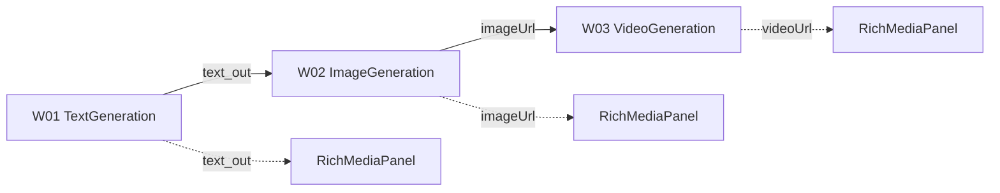
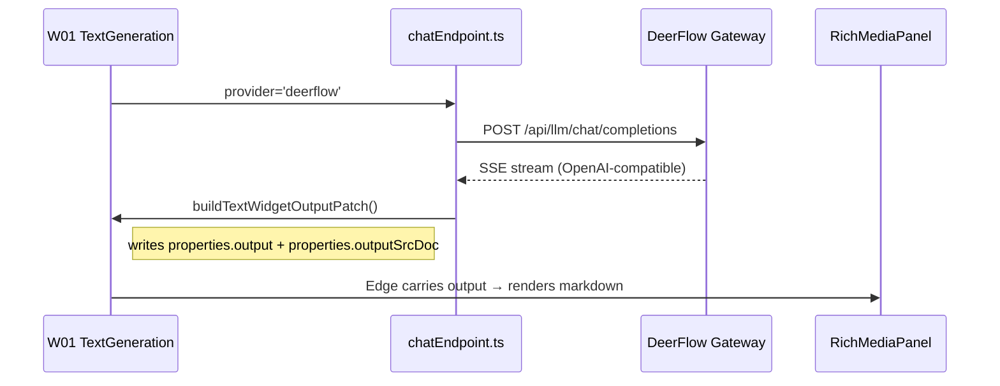
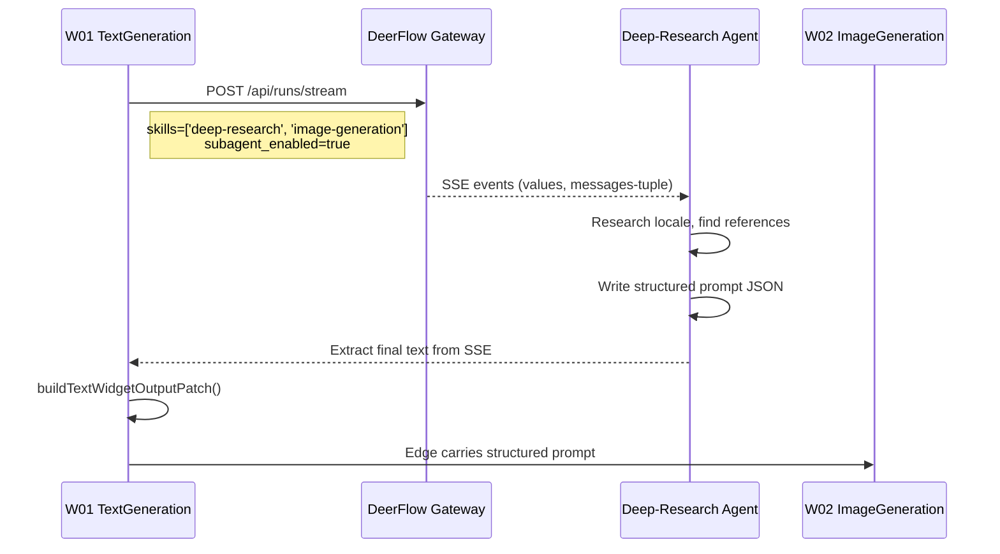
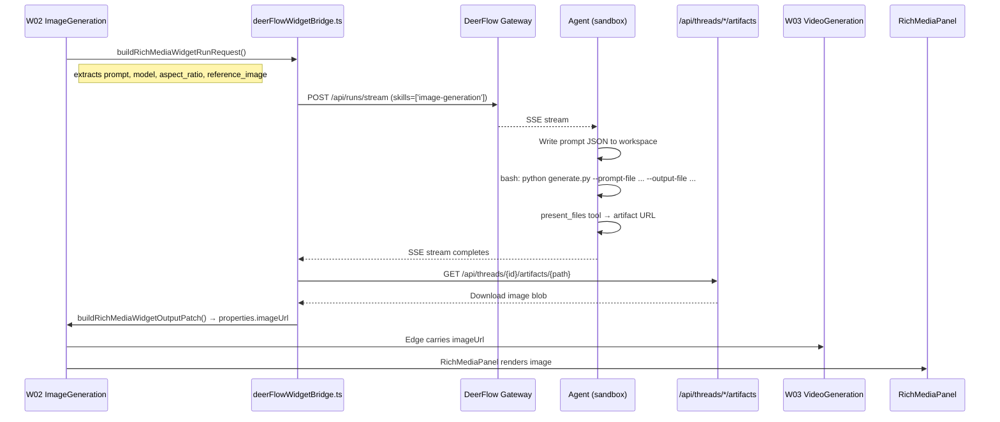
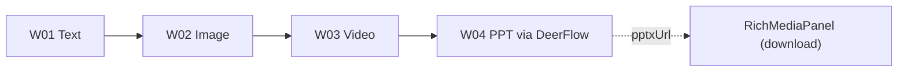
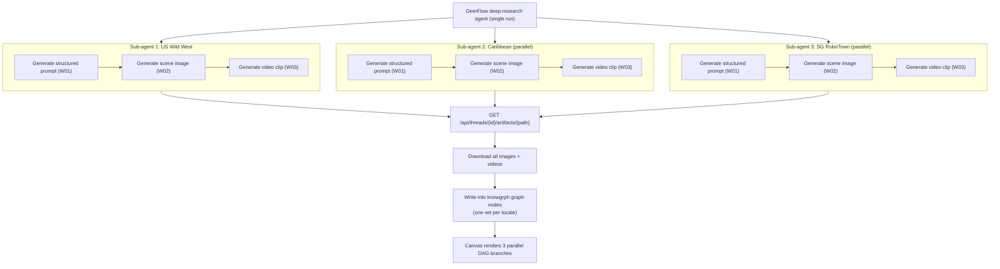
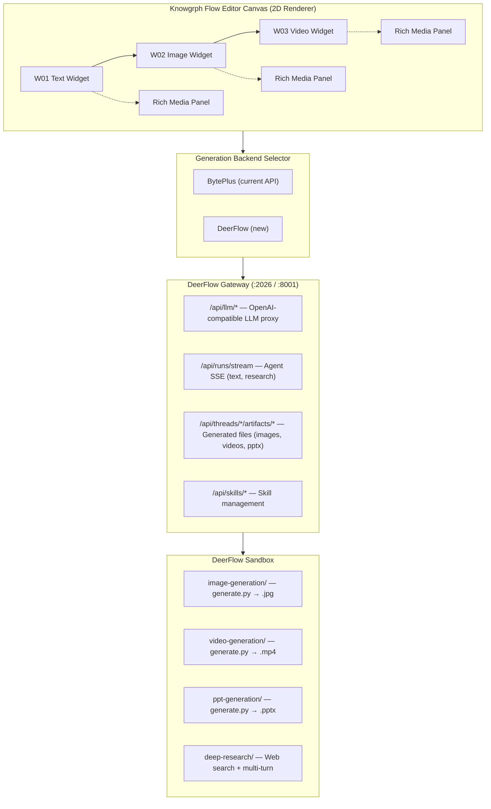

toolName: todo_write
            
status: success
          
Todos updated: 5 items
          
Here is the full recommendation, validated against the [knowgrph-video-demo.md](file://${KG_GITHUB_ROOT}/huijoohwee/docs/knowgrph-video-demo.md) spec.

---

# DeerFlow × Knowgrph Flow Editor: Text / Image / Video Generation Enhancement

## 1. Current State — What the Video Demo Spec Requires

The [video-demo spec](file://${KG_GITHUB_ROOT}/huijoohwee/docs/knowgrph-video-demo.md) defines a **3-node DAG pipeline** on the Flow Editor canvas:

| Widget | Node Type | Current Backend | Output Property |
|---|---|---|---|
| **W01** Text Script | `TextGeneration` | BytePlus Seed LLM via `chatEndpoint.ts` | `properties.output` + `properties.outputSrcDoc` |
| **W02** Scene Image | `ImageGeneration` | BytePlus Seedream via `byteplusRunGeneration.ts` | `properties.imageUrl` |
| **W03** Scene Video | `VideoGeneration` | BytePlus Seedance via `byteplusRunGeneration.ts` | `properties.videoUrl` |

**Key constraint from the spec** (line 481):
> "Toolbar Run all writes widget outputs into existing nodes only; it must not rewrite Balanced widget positions, Rich Media Panel layout, or edge topology."

The current system is **hardwired to BytePlus APIs**. DeerFlow can enhance this in five concrete ways.

---

## 2. Enhancement Map — Five Recommendations

### R1 — DeerFlow as Alternative Generation Backend (Provider Abstraction)

**What it solves:** The video-demo spec hardcodes `byteplus-modelark` as the chat provider and `seedream-*` / `seedance-*` as image/video models. DeerFlow's LLM proxy (`/api/llm/chat/completions`) speaks the same OpenAI protocol, and its skills system provides image/video generation through sandbox-executed Python scripts.

**How it maps to the spec:**

| Spec Field | Current Value | DeerFlow Equivalent |
|---|---|---|
| `chatProvider` | `byteplus-modelark` | `deerflow` (new provider) |
| `chatEndpointUrl` | `https://ark.ap-southeast.bytepluses.com/api/v3/chat/completions` | `{deerflowGateway}/api/llm/chat/completions` |
| `chatModel` (text) | `seed-2-0-lite-260228` | Any model configured in deer-flow's `config.yaml` |
| `model` (image) | `seedream-4-0-250828` | DeerFlow `image-generation` skill (sandbox `generate.py`) |
| `model` (video) | `seedance-1-0-pro-fast-251015` | DeerFlow `video-generation` skill (sandbox `generate.py`) |

**Files to modify:**

| File | Change |
|---|---|
| [chatEndpoint.ts](file://${KG_GITHUB_ROOT}/knowgrph/canvas/src/lib/chatEndpoint.ts) | Add `CHAT_PROVIDER_DEERFLOW` with endpoint resolver |
| [config.flow-editor.ts](file://${KG_GITHUB_ROOT}/knowgrph/canvas/src/lib/config.flow-editor.ts) | Add deer-flow model options to `FLOW_EDITOR_IMAGE_MODEL_OPTIONS` and `FLOW_EDITOR_VIDEO_MODEL_OPTIONS` |
| [integrations/config.ts](file://${KG_GITHUB_ROOT}/knowgrph/canvas/src/features/integrations/config.ts) | Add `IntegrationDeerFlowConfig` with `gatewayUrl`, `apiKey`, `enabled` |

**Data flow for text generation (W01):**

**Effort:** ~3 files, ~100 lines. No new UI components.

---

### R2 — DeerFlow Agent as Intelligent Prompt Engineer (Text Widget Enhancement)

**What it solves:** The video-demo spec's W01 node currently generates prompts via a single LLM call with a static system prompt. DeerFlow's agent can **autonomously research, iterate, and refine** prompts before they reach the image/video widgets — using web search, reference image discovery, and multi-turn reasoning.

**How it maps to the spec:**

The spec's W01 `sys_event` (line 121) says:
> "TextGeneration returns dual-layer prompts (parent trust + child multiverse) per locale for scene image + final video"

DeerFlow's `deep-research` skill can enhance this by:
1. **Web-searching** for visual references matching the locale/theme before writing prompts
2. **Using `image_search` tool** (DuckDuckGo) to find reference images for the scene
3. **Producing structured JSON** that the image-generation skill's `generate.py` expects (characters, composition, lighting, color_palette fields)
4. **Iterating** via sub-agents — one for parent-trust layer, one for child-adventure layer

**Data flow:**

**Effort:** ~2 new files (deer-flow SSE client, prompt adapter), ~200 lines.

---

### R3 — DeerFlow Sandbox as Image/Video Generation Engine (Widget Backend Swap)

**What it solves:** The current image/video widgets call BytePlus APIs directly via `generateRunImageWithBytePlus()` / `generateRunVideoWithBytePlus()` in [richMediaRun.ts](file://${KG_GITHUB_ROOT}/knowgrph/canvas/src/features/chat/richMediaRun.ts). DeerFlow's sandbox can run **any image/video generation model** through its skill scripts, including open-source models (Stable Diffusion, Wan2.1) that BytePlus doesn't offer.

**How it maps to the spec:**

The spec's W02 and W03 nodes define these properties:
- W02: `model`, `prompt`, `size`, `output_format`, `aspect_ratio`, `reference_image`
- W03: `model`, `prompt`, `ratio`, `resolution`, `duration`, `reference_image`

DeerFlow's `image-generation` skill accepts:
- `--prompt-file` (JSON with characters, composition, lighting, style, color_palette)
- `--output-file` (path in `/mnt/user-data/outputs/`)
- `--aspect-ratio` (e.g., `16:9`, `9:16`)
- `--reference-images` (paths to reference images)

DeerFlow's `video-generation` skill accepts:
- Same JSON prompt structure with camera, dialogue, audio fields
- `--reference-images` (single reference image, often from image-generation skill)

**Bridge architecture:**

**Files to create:**

| File | Purpose |
|---|---|
| `features/integrations/deer-flow/deerFlowWidgetBridge.ts` | Orchestrates deer-flow run → artifact download → blob creation |
| `features/integrations/deer-flow/deerFlowArtifactClient.ts` | Downloads artifacts from `GET /api/threads/{id}/artifacts/{path}` |
| `features/integrations/deer-flow/types.ts` | DeerFlow SSE event types, artifact metadata |

**Files to modify:**

| File | Change |
|---|---|
| [richMediaRun.ts](file://${KG_GITHUB_ROOT}/knowgrph/canvas/src/features/chat/richMediaRun.ts) | Add `runRichMediaWidgetGenerationWithDeerFlow()` alongside existing BytePlus path |
| [config.flow-editor.ts](file://${KG_GITHUB_ROOT}/knowgrph/canvas/src/lib/config.flow-editor.ts) | Add `FLOW_IMAGE_GENERATION_BACKEND` and `FLOW_VIDEO_GENERATION_BACKEND` options (`byteplus` | `deerflow`) |

**Effort:** ~3 new files, ~2 modified files, ~350 lines.

---

### R4 — DeerFlow PPT-Generation Skill as Presentation Export Path

**What it solves:** The video-demo spec produces a 30-second video reel. DeerFlow's `ppt-generation` skill can **compose the generated scene images into a PPTX presentation** as an additional output — providing a slide deck alongside the video.

**How it maps to the spec:**

The spec's `director_brief.shots` array (S01–S05) already defines per-shot image prompts. After W02 generates scene images and W03 generates the video, a new W04 node could invoke DeerFlow's PPT skill:

DeerFlow's PPT skill workflow:
1. Create plan JSON (slide titles, content, speaker notes)
2. Generate slide images sequentially (each referencing previous for consistency)
3. Compose via `python generate.py --plan-file ... --slide-images ... --output-file ...`
4. Output: `.pptx` in `/mnt/user-data/outputs/`

**8 built-in styles:** glassmorphism, dark-premium, gradient-modern, neo-brutalist, 3d-isometric, editorial, minimal-swiss, keynote.

**Effort:** ~1 new node type (`DeerFlowPPTGeneration`), ~150 lines.

---

### R5 — DeerFlow Deep-Research as Multi-Shot Pipeline Orchestrator

**What it solves:** The video-demo spec defines 3 locale variants (US, Caribbean, SG) but the current Flow Editor runs them as separate manual invocations. DeerFlow's `deep-research` skill with sub-agents can **autonomously execute the full pipeline for all 3 locales in parallel** — generating text prompts, reference images, and video clips for each locale without manual intervention.

**How it maps to the spec:**

The spec's `runner.steps` (lines 79–111) define: ingest → resolve → build-graph → compile-compute → traverse → render. DeerFlow's sub-agent system can execute the "compile-compute" and "traverse" steps across all 3 locales concurrently:

**Key advantage:** DeerFlow's sub-agents are **isolated contexts** with independent tool execution, so locale-1's image generation doesn't block locale-2's text generation. The agent runtime handles parallel execution, timeout enforcement, and error recovery.

**Effort:** ~2 new files (multi-locale orchestrator, sub-agent result parser), ~250 lines.

---

## 3. Validation Against Video-Demo Spec

| Spec Requirement | Current System | DeerFlow Enhancement | Validation |
|---|---|---|---|
| **Text → Image → Video DAG** | BytePlus-only pipeline | R1: DeerFlow as alternative provider | Same node types, same edge topology, different backend |
| **9:16 vertical format** | `aspect_ratio: 0.5625` in W02 | R3: DeerFlow `--aspect-ratio 9:16` | Direct mapping |
| **8s video duration** | `duration: 8` in W03 | R3: DeerFlow video skill supports duration | Direct mapping |
| **Reference image chaining** (W02 imageUrl → W03 reference_image) | BytePlus `image_url_url: "base64"` | R3: DeerFlow `--reference-images` path | Bridge converts blob URL to sandbox path |
| **Dual-layer prompts** (parent trust + child multiverse) | Single LLM call | R2: DeerFlow agent with sub-agents | Agent produces richer structured prompts |
| **3 locale variants** | Manual per-locale runs | R5: Parallel sub-agents | Automated multi-locale execution |
| **Rich Media Panel rendering** | `properties.imageUrl` / `properties.videoUrl` | All R1–R5: Same output properties | No panel changes needed |
| **Toolbar Run all** writes outputs only | BytePlus `buildRichMediaWidgetOutputPatch()` | Same patch function, different asset source | Spec constraint preserved |
| **No topology rewrite on run** | Existing guard | Same guard applies | Spec constraint preserved |

---

## 4. Implementation Priority

| Phase | Recommendation | Value | Effort | Dependency |
|---|---|---|---|---|
| **P0** | R1 — DeerFlow as chat provider | Unlocks all BytePlus model alternatives | ~100 lines | DeerFlow instance |
| **P1** | R2 — Agent prompt engineering | Richer, researched prompts for W01 | ~200 lines | P0 |
| **P2** | R3 — Sandbox image/video generation | Open-source model support, no BytePlus lock-in | ~350 lines | P0 |
| **P3** | R5 — Multi-locale parallel orchestration | Full 3-locale automation | ~250 lines | P1 + P2 |
| **P4** | R4 — PPT export | Slide deck alongside video | ~150 lines | P2 |

---

## 5. Architecture Summary

### Component Inventory — DeerFlow Integration

| Layer | Component | Type | Status |
|---|---|---|---|
| Flow Editor | W01 TextGeneration widget | Existing | Built |
| Flow Editor | W02 ImageGeneration widget | Existing | Built |
| Flow Editor | W03 VideoGeneration widget | Existing | Built |
| Flow Editor | Rich Media Panel | Existing | Built |
| Backend | BytePlus API (current) | Existing | Built |
| Backend | DeerFlow provider abstraction | New | **R1 — ~100 lines** |
| Gateway | `/api/llm/*` LLM proxy | External | DeerFlow |
| Gateway | `/api/runs/stream` Agent SSE | External | DeerFlow |
| Gateway | `/api/threads/*/artifacts/*` | External | DeerFlow |
| Gateway | `/api/skills/*` | External | DeerFlow |
| Sandbox | `image-generation/` skill | External | DeerFlow |
| Sandbox | `video-generation/` skill | External | DeerFlow |
| Sandbox | `ppt-generation/` skill | External | DeerFlow |
| Sandbox | `deep-research/` skill | External | DeerFlow |
| Bridge | `deerFlowWidgetBridge.ts` | New | **R3 — ~350 lines** |
| Bridge | `deerFlowArtifactClient.ts` | New | **R3 — ~350 lines** |
| Bridge | `types.ts` (SSE events, artifacts) | New | **R3 — ~350 lines** |
| Agent | DeerFlow SSE client | New | **R2 — ~200 lines** |
| Agent | Prompt adapter | New | **R2 — ~200 lines** |
| Orchestrator | Multi-locale orchestrator | New | **R5 — ~250 lines** |
| Orchestrator | Sub-agent result parser | New | **R5 — ~250 lines** |
| Flow Editor | W04 PPT node type | New | **R4 — ~150 lines** |

The key insight: **knowgrph's Flow Editor already has the perfect widget/edge/panel architecture** defined in the video-demo spec. DeerFlow doesn't need to change the canvas — it plugs in underneath as an alternative generation backend, progressively adding agent intelligence, model diversity, and parallel orchestration.