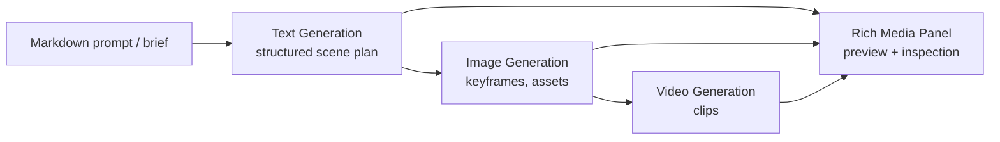

# Knowgrph

## AI-assisted programmatic video generation

**Widget-based canvas where AI (Markdown) orchestrated responses become images — and images become video.**

<v-clicks>

- Create a video by writing **Markdown**, not by editing a timeline
- Keep the entire pipeline **inspectable, reproducible, and remixable**
- Ship a new “creative” as a **diff**, not a project file

</v-clicks>

---

---
layout: intro
class: text-left
---

# The problem

Video production is still **timeline-first**, which makes it:

- **Slow**: iteration cycles depend on manual editing and render queues
- **Hard to automate**: little reusable structure; creative logic is implicit
- **Hard to audit**: prompts, assets, and decisions are scattered across tools
- **Hard to scale**: content variants explode cost (localized, personalized, A/B)

**Teams want video to behave like software:** versioned, testable, composable.

---

---
layout: default
class: text-left
---

# The insight

If you can represent a “scene plan” as **structured Markdown**, then:

- **AI can be an orchestrator** (not just a chat window)
- **Widgets become compiled stages** (text → image → video → interactive preview)
- The canvas becomes a **single source of truth** for:
  - prompts
  - intermediate artifacts (images)
  - final artifacts (video)
  - provenance and parameters

Markdown is the *control plane*; media generation is the *data plane*.

---

---
layout: two-cols
class: text-left
---

# What we’re building

Knowgrph is a **widget-based canvas** for AI-assisted media pipelines.

::right::

## Core primitives

<v-clicks>

- **Text Generation widget**: create structured narrative, shot lists, captions
- **Image Generation widget**: render keyframes / storyboards / overlays
- **Video Generation widget**: turn images + prompts into clips
- **Rich Media Panel**: one canonical place to preview outputs (image/video/html)

</v-clicks>

---

---
layout: default
class: text-left
---

# The workflow (end-to-end)

1. **Write Markdown**: brief → script → shot list → style guide
2. **AI produces structured outputs** (tables / JSON / sections)
3. **Images are generated programmatically** from the plan (keyframes, overlays)
4. **Video is generated** from images + constraints (duration, ratio, camera)
5. **Review + iterate** in a single canvas; everything is versionable

**Result:** fast iteration loops and reproducible media generation.

---

---
layout: default
class: text-left
---

# How it works (high-level architecture)



**Key design choice:** outputs always land on **one canonical render surface** (Rich Media Panel).

---

---
layout: default
class: text-left
---

# “Markdown orchestration” example (concept)

```markdown
## Scene 03 — The product moment

Goal: show the canvas turning Markdown into images, then into video.
Style: minimalist, high contrast, 16:9, subtle motion.

Shots:
1) Close-up: markdown lines appear (typing)
2) Cut: storyboard grid fills with generated keyframes
3) Cut: video preview plays in panel
```

From here the pipeline:
- derives **image prompts** per shot
- generates keyframes
- composes them into a clip (or a sequence of clips)

---

---
layout: two-cols
class: text-left
---

# Why the canvas matters

The canvas turns a “creative” into a **graph** of explicit stages.

::right::

## You get software-like guarantees

<v-clicks>

- **Reproducibility**: same Markdown + params → same artifacts (seeded)
- **Traceability**: every media output has upstream provenance
- **Composable reuse**: reuse nodes, subgraphs, and templates
- **Safe iteration**: diff prompts/params without breaking the whole project

</v-clicks>

---

---
layout: default
class: text-left
---

# Differentiation

| Approach | Strength | Weakness |
|---|---|---|
| Timeline editors | Fine-grained manual control | Not automatable; hard to scale variants |
| Prompt-only tools | Fast single output | Weak structure; poor reproducibility |
| Agent-only chains | Flexible reasoning | Hard to inspect; “where did this come from?” |
| **Knowgrph (canvas + widgets + Markdown SSOT)** | **Automatable + inspectable + reusable** | Needs strong template/contract discipline |

We treat “creative” as a **compiled artifact** from a declarative spec.

---

---
layout: default
class: text-left
---

# Target users & use-cases

<v-clicks>

- **Growth & marketing**: campaign variants, localization, rapid A/B creatives
- **Product teams**: feature launches, onboarding explainers, changelog videos
- **Education**: course clips from lesson Markdown
- **Ops / internal comms**: auto-generated weekly update videos
- **Developers**: programmatic media generation as part of CI/CD

</v-clicks>

Common requirement: generate many videos with **consistent structure**.

---

---
layout: default
class: text-left
---

# Business model (initial)

<v-clicks>

- **Workspace subscription** (per seat) for authoring + collaboration
- **Usage-based compute** (per image / per video second) with budgets + quotas
- **Template marketplace** (optional): reusable branded decks, story styles, packs
- **Enterprise**: SSO, audit logs, on-prem / VPC, policy controls

</v-clicks>

Principle: keep cost and quality **predictable** with explicit parameters.

---

---
layout: default
class: text-left
---

# Roadmap

**Now**
- Stable Markdown-to-widget orchestration patterns
- Rich Media Panel as canonical preview and export surface

**Next**
- Scene templates + subgraph library (storyboards, product demo flows)
- Batch generation + variant management (language, CTA, segments)
- Evaluation harness (quality checks, policy checks, regressions)

**Later**
- Multi-track composition (audio, captions, overlays)
- Deterministic “render recipes” and caching across variants

---

---
layout: default
class: text-left
---

# What we need (the ask)

<v-clicks>

- **Design partners**: teams generating video variants weekly
- **Feedback**: what constraints matter most (brand, compliance, localization)
- **Data**: real-world briefs + existing creative specs to template
- **Distribution**: intros to growth, product marketing, and education creators

</v-clicks>

If you want video creation to feel like software, let’s talk.

---

---
layout: center
class: text-center
---

# Thank you

**Knowgrph — AI-assisted programmatic video generation**

Contact: (add)
