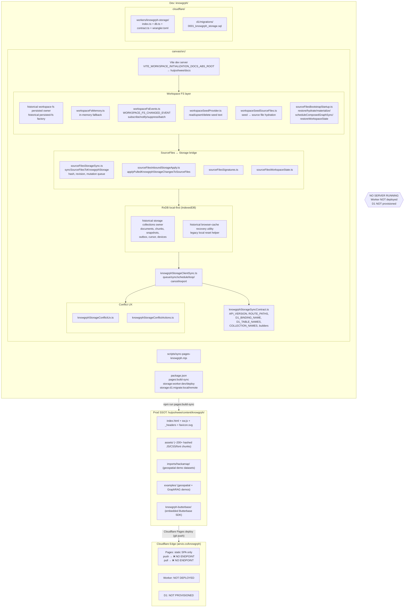
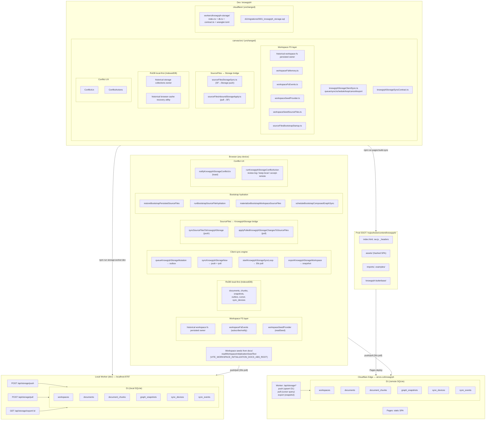

# Knowgrph Sync Infrastructure

## Cloudflare Workers + D1 (SQLite) — PRD & TAD

---

## PRD — Product Requirements

### Problem Statement

Knowgrph source files (Markdown documents powering graph visualizations) exist in three disconnected locations:

1. **Dev** (`knowgrph/canvas/src/`) — live editing environment with RxDB local-first storage
2. **Prod SSOT** (`huijoohwee/content/knowgrph/`) — static build artifacts deployed to Cloudflare Pages
3. **Docs seed** (`huijoohwee/docs/`) — 4 canonical Markdown files used for workspace initialization

Users editing source files in Dev have **no mechanism to persist changes to a shared remote store**. The client-side sync engine (push/pull API contract, outbox, revision tracking) is fully built but has **no server-side endpoint to communicate with**. Workspace seed files in `huijoohwee/docs/` are synced to Dev via polling (`VITE_WORKSPACE_SEED_SYNC_POLL_MS`) but changes flow **one direction only** — there is no write-back path from Dev to Docs.

**Impact**: graph data, document edits, and workspace state are siloed per-browser. Multi-device continuity and collaborative editing are impossible.

### User Stories

**As a** Knowgrph developer editing source files in the workspace  
**I want** my document edits to persist to a remote store automatically  
**So that** I can close the browser and resume work from any device without losing changes

**As a** Knowgrph developer running the Dev server  
**I want** changes to seed files in `huijoohwee/docs/` to appear in my workspace immediately  
**So that** I can iterate on canonical documentation without manual refresh or restart

**As a** Knowgrph developer editing a seed document  
**I want** my edits to write back to the `huijoohwee/docs/` directory  
**So that** the canonical seed files stay in sync with the latest workspace state

**As a** Knowgrph operator deploying to production  
**I want** the build-sync pipeline to remain the single static-artifact deployment path  
**So that** the production SPA at `airvio.co/knowgrph` continues to serve from `huijoohwee/content/knowgrph`

**As a** Knowgrph user on a mobile device  
**I want** my workspace state to sync via the same push/pull mechanism as desktop  
**So that** I have seamless cross-device continuity

### Acceptance Criteria

**Given** a developer edits a source file in the Dev workspace  
**When** the autosave debounce fires (workspace sync scheduler)  
**Then** the document upsert mutation is queued in the RxDB outbox and pushed to `/api/storage/push`

**Given** the push endpoint receives a document mutation  
**When** the D1 `documents` table is upserted with the new revision  
**Then** the response confirms the stored revision number and the client clears the outbox entry

**Given** a second device opens the same workspace  
**When** the client polls `/api/storage/pull` with its last cursor  
**Then** it receives all mutations newer than the cursor and applies them to local RxDB

**Given** a file changes in `huijoohwee/docs/`  
**When** the Dev server's seed polling cycle runs  
**Then** the workspace re-reads the file via `VITE_WORKSPACE_INITIALIZATION_DOCS_ABS_ROOT` and updates the source file state

**Given** a developer edits a workspace seed document in Dev  
**When** the edit is persisted to D1 via push  
**Then** the `upsertWorkspaceInitializationSeedText` helper writes the updated text back to the `huijoohwee/docs/` absolute path (Node.js only)

**Given** `npm run pages:build-sync` is executed  
**When** the build completes and sync runs  
**Then** `huijoohwee/content/knowgrph/` reflects the latest static artifacts and `_redirects` is updated

### Success Metrics

| Metric | Baseline | Target | Timeline |
|---|---|---|---|
| Push success rate | 0% (no endpoint) | 99.9% | Phase 1 complete |
| Pull-to-apply latency | N/A | <2s p95 | Phase 1 complete |
| Seed file Dev→Docs write-back | Manual | Automatic | Phase 2 complete |
| Cross-device state parity | 0% (no sync) | 100% document parity | Phase 1 complete |
| D1 free-tier utilization | $0/mo | <$5/mo at projected scale | 6 months post-launch |

### Out of Scope

- Real-time WebSocket collaboration (Durable Objects) — deferred to Phase 3
- Authentication / multi-tenant workspace isolation — deferred
- File attachment binary sync (images, PDFs) — deferred
- CI/CD pipeline integration (GitHub Actions auto-deploy) — deferred
- Migration from existing Butterbase embedded project in Prod SSOT

### Dependencies

- Cloudflare account with Workers and D1 enabled
- `wrangler` CLI installed and authenticated
- Existing client-side sync engine (RxDB, outbox, push/pull contract) — already built
- Existing D1 table schema defined in `knowgrphStorageSyncContract.ts` — already specified

### Open Questions

- Should the Worker co-exist with the Cloudflare Pages SPA (Pages Function) or deploy as a standalone Worker?
- What is the D1 database naming convention (`knowgrph-storage` vs. project-prefixed)?
- Should seed write-back to `huijoohwee/docs/` be opt-in via env var or always-on in Dev?

---

## TAD — Technical Architecture

### Architecture Overview

**From source file edits to persistent shared state**: Browser → RxDB local-first outbox → push mutation → Cloudflare Worker → D1 (SQLite) → pull mutation → remote device RxDB → workspace state hydrated.

**From docs seed changes to Dev workspace**: Filesystem watcher / poll → `VITE_WORKSPACE_INITIALIZATION_DOCS_ABS_ROOT` → `readWorkspaceInitializationSeedText` → source file state update → canvas re-render.

**From Dev edits to docs seed write-back**: Source file persist → D1 push → Node.js `upsertWorkspaceInitializationSeedText` → `huijoohwee/docs/*.md` file write.

**From Dev to Prod static artifacts**: `npm run pages:build-sync` → Vite build → `sync-pages-knowgrph.mjs` → `huijoohwee/content/knowgrph/` → Cloudflare Pages deploy → `airvio.co/knowgrph`.

### Architecture Diagram — As-Is (current state)



### Component Inventory — As-Is

| Layer | Module | File | Status |
|---|---|---|---|
| Workspace FS | Historical persisted FS owner | `historical workspace fs persisted owner` | Built |
| Workspace FS | In-memory fallback | `workspaceFsMemory.ts` | Built |
| Workspace FS | Change events | `workspaceFsEvents.ts` | Built |
| Workspace FS | Seed read/write | `workspaceSeedProvider.ts` | Built |
| Workspace FS | Seed → SF hydration | `workspaceSeedSourceFiles.ts` | Built |
| Workspace FS | Bootstrap startup | `sourceFilesBootstrapStartup.ts` | Built |
| SF ↔ Storage | Push bridge | `sourceFilesStorageSync.ts` | Built |
| SF ↔ Storage | Pull apply | `sourceFilesInboundStorageApply.ts` | Built |
| SF ↔ Storage | Signatures | `sourceFilesSignatures.ts` | Built |
| SF ↔ Storage | Workspace state | `sourceFilesWorkspaceState.ts` | Built |
| RxDB | Historical storage collections owner | `historical storage collections owner` | Built |
| RxDB | Recovery | `historical browser-cache recovery utility` | Built |
| Sync engine | Client push/pull/loop | `knowgrphStorageClientSync.ts` | Built |
| Sync contract | Constants + builders | `knowgrphStorageSyncContract.ts` | Built |
| Conflict UX | Toast notification | `knowgrphStorageConflictUx.ts` | Built |
| Conflict UX | Resolution actions | `knowgrphStorageConflictActions.ts` | Built |
| Cloudflare | Worker handlers | `cloudflare/workers/knowgrph-storage/index.ts` | Built |
| Cloudflare | D1 query helpers | `cloudflare/workers/knowgrph-storage/db.ts` | Built |
| Cloudflare | Contract re-export | `cloudflare/workers/knowgrph-storage/contract.ts` | Built |
| Cloudflare | Wrangler config | `cloudflare/workers/knowgrph-storage/wrangler.toml` | Built |
| Cloudflare | D1 migration SQL | `cloudflare/d1/migrations/0001_knowgrph_storage.sql` | Built |
| Deploy | Pages sync script | `scripts/sync-pages-knowgrph.mjs` | Built |
| Deploy | npm scripts | `package.json` | Built |
| Cloudflare Edge | Deployed Worker | — | **Missing** |
| Cloudflare Edge | Provisioned D1 | — | **Missing** |

### Architecture Diagram — To-Be (Phase 1 target)



### Component Specifications

**Component**: Cloudflare Worker (API)  
**Responsibility**: Receives push/pull/export requests from client; validates mutations; reads/writes D1 tables; returns revision-confirmed responses  
**Interfaces**: `POST /api/storage/push`, `POST /api/storage/pull`, `GET /api/storage/export/:workspaceId`  
**Dependencies**: D1 binding (`DB`), request validation layer  
**Configuration**: `wrangler.toml` (D1 binding name, route patterns, compatibility flags)

**Component**: D1 Database (SQLite)  
**Responsibility**: Persistent storage for workspaces, documents, document chunks, graph snapshots, sync devices, sync events  
**Interfaces**: SQL via Cloudflare D1 binding API  
**Dependencies**: Cloudflare D1 service  
**Configuration**: 6 tables defined in `KNOWGRPH_STORAGE_D1_TABLE_NAMES`

**Component**: RxDB Client-Side Storage  
**Responsibility**: Local-first IndexedDB cache; outbox queue for offline mutations; revision tracking; conflict detection via base revision  
**Interfaces**: `syncSourceFilesToKnowgrphStorage`, `queueKnowgrphStorageMutation`, `pullAndApplyRemoteMutations`  
**Dependencies**: `rxdb` v16, historical storage collections owner, `knowgrphStorageClientSync.ts`  
**Configuration**: `KNOWGRPH_STORAGE_DB_NAME`, poll interval, retry count, batch size

**Component**: Workspace Seed Provider  
**Responsibility**: Reads canonical Markdown files from `huijoohwee/docs/` for workspace initialization; writes edited seed text back to filesystem in Node.js context  
**Interfaces**: `readWorkspaceInitializationSeedText`, `upsertWorkspaceInitializationSeedText`, `deleteWorkspaceInitializationSeedText`  
**Dependencies**: `VITE_WORKSPACE_INITIALIZATION_DOCS_ABS_ROOT` env var, Node.js `fs/promises`  
**Configuration**: `VITE_WORKSPACE_SEED_SYNC_ENABLED`, `VITE_WORKSPACE_SEED_SYNC_POLL_MS`

**Component**: Pages Build-Sync Script  
**Responsibility**: Hash-compares build output against Prod SSOT; copies changed files; removes stale artifacts; regenerates `_redirects`  
**Interfaces**: CLI (`--check` mode, sync mode)  
**Dependencies**: `canvas/dist/`, `huijoohwee/content/knowgrph/`, `huijoohwee/_redirects`  
**Configuration**: Blocked paths, preserved paths, public managed files

### Integration Contracts

**Interface**: Push Mutations  
**Protocol**: HTTPS POST  
**Data Format**: JSON  
**Endpoint**: `/api/storage/push`  
**Request Body**:

```json
{
  "workspaceId": "kgws:abc123",
  "deviceId": "dev:local-browser-1",
  "mutations": [
    {
      "entity": "document",
      "op": "upsert",
      "recordId": "sf:source-file-id",
      "baseRevision": 3,
      "record": {
        "id": "sf:source-file-id",
        "workspaceId": "kgws:abc123",
        "canonicalPath": "workspace:/README.md",
        "title": "README.md",
        "docType": "markdown",
        "contentMd": "# Hello",
        "contentHash": "sha256hex",
        "revision": 4,
        "updatedAtMs": 1778151345000,
        "deleted": false
      }
    }
  ]
}
```

**Response**: `{ "accepted": 1, "rejected": 0, "cursor": "evt:xyz" }`  
**Error Handling**: 409 on base revision mismatch (conflict); 400 on invalid payload; 500 on D1 failure

**Interface**: Pull Mutations  
**Protocol**: HTTPS POST  
**Data Format**: JSON  
**Endpoint**: `/api/storage/pull`  
**Request Body**:

```json
{
  "workspaceId": "kgws:abc123",
  "deviceId": "dev:local-browser-2",
  "cursor": "evt:abc"
}
```

**Response**:

```json
{
  "mutations": [
    {
      "entity": "document",
      "op": "upsert",
      "record": { "..." }
    }
  ],
  "cursor": "evt:xyz",
  "hasMore": false
}
```

**Error Handling**: 400 on missing workspaceId; 404 on unknown workspace; 500 on D1 failure

**Interface**: Export Workspace  
**Protocol**: HTTPS GET  
**Data Format**: JSON  
**Endpoint**: `/api/storage/export/:workspaceId`  
**Response**: Full workspace snapshot (all documents, chunks, graph snapshots)  
**Error Handling**: 404 on unknown workspace; 500 on D1 failure

### Architectural Decisions

**Decision**: Use Cloudflare D1 (SQLite) as the remote persistence layer  
**Rationale**: Client-side sync contract already defines D1 table names and binding conventions; D1 is co-located with Cloudflare Pages (zero additional latency); free tier covers projected scale; SQLite schema is portable  
**Alternatives Considered**:

1. **Supabase (PostgreSQL)**: Would require rewriting the D1-oriented schema contract; adds a separate provider; loses edge co-location
2. **Turso (libSQL)**: Good FOSS SQLite option but adds a separate provider when D1 is already in the Cloudflare account
3. **Firebase Realtime DB**: Proprietary NoSQL — schema is relational (workspaces → documents → chunks → snapshots), would need major refactor
4. **Self-hosted SQLite + Fly.io**: Higher ops burden; no edge co-location with Pages

**Trade-offs**: D1 has a 500-row query limit per statement (requires pagination for large workspaces); D1 is Cloudflare-specific (mitigated by standard SQLite portability); no built-in real-time push (polling required, acceptable for current scale)

**Decision**: Deploy Worker as Cloudflare Pages Function (co-located with SPA)  
**Rationale**: Pages Functions share the same domain (`airvio.co/knowgrph`), avoiding CORS complexity; same deployment pipeline as static assets; D1 binding available via `wrangler.toml`  
**Alternatives Considered**:

1. **Standalone Worker on custom subdomain**: Adds CORS headers, separate deployment pipeline
2. **Separate API domain**: Additional DNS, TLS, and configuration overhead

**Trade-offs**: Pages Functions have a 50ms CPU time limit on free tier (sufficient for CRUD operations); standalone Workers offer more flexibility for future WebSocket/Durable Object integration

**Decision**: Retain polling-based sync (30s interval) for Phase 1  
**Rationale**: Client-side polling infrastructure already exists (`DEFAULT_POLL_INTERVAL_MS = 30_000`); acceptable latency for single-user / small-team use; avoids Durable Objects complexity  
**Alternatives Considered**:

1. **WebSocket via Durable Objects**: Adds significant complexity; deferred to Phase 3
2. **SSE (Server-Sent Events)**: Not natively supported by Pages Functions without additional infrastructure

**Trade-offs**: 30s worst-case delay for cross-device sync; unnecessary network traffic when no changes exist (mitigated by cursor-based empty responses)

**Decision**: Seed write-back to `huijoohwee/docs/` via Node.js `fs` only (browser-inaccessible)  
**Rationale**: `upsertWorkspaceInitializationSeedText` already implements Node.js-only file write with `typeof window !== 'undefined'` guard; prevents browser-side filesystem access; keeps docs directory as a Dev-only concern  
**Alternatives Considered**:

1. **Write-back via D1 + separate sync script**: Adds complexity; D1 is the remote store, not the filesystem
2. **Git commit-based write-back**: Over-engineered for local Dev workflow

**Trade-offs**: Write-back only works in Dev server context (Node.js), not in production browser; acceptable since docs seed is a Dev initialization concern

### Quality Attributes

- **Performance**: Push/pull round-trip <500ms p95 for single-document mutations; D1 queries <50ms p95 (edge-proxied SQLite)
- **Scalability**: D1 free tier supports 5M reads/day and 100K writes/day — sufficient for <100 active users; pagination required for workspaces exceeding 500 documents
- **Security**: Push mutations validated against base revision (optimistic concurrency control); no authentication in Phase 1 (single-user); workspace-scoped data isolation via `workspaceId` partition key
- **Observability**: Worker logs via `wrangler tail`; D1 query metrics via Cloudflare dashboard; client-side sync telemetry via existing `pipelinePerf.ts` instrumentation
- **Resilience**: RxDB outbox survives browser crashes and offline periods; retry logic with exponential backoff (`DEFAULT_MAX_RETRY_COUNT = 3`); cursor-based pull ensures no missed mutations after reconnection
- **Maintainability**: Worker handler is a thin validation + D1 proxy layer; all business logic remains client-side; D1 schema migrations via numbered SQL files

### Deployment Strategy

**Phase 1 — Worker + D1 (unblock sync)**

1. Create `wrangler.toml` with D1 binding (`DB`) and Pages Function route pattern (`/api/storage/*`)
2. Write D1 migration `0001_initial.sql` for 6 tables: `workspaces`, `documents`, `document_chunks`, `graph_snapshots`, `sync_devices`, `sync_events`
3. Implement Worker handler for `POST /api/storage/push` — validate mutations, upsert D1 rows, insert sync events, return cursor
4. Implement Worker handler for `POST /api/storage/pull` — query sync events after cursor, return mutations
5. Implement Worker handler for `GET /api/storage/export/:workspaceId` — full workspace snapshot
6. Wire `pages:build-sync` to deploy Worker alongside static assets
7. Verify end-to-end: Dev browser push → D1 → second browser pull → state parity

**Phase 2 — Docs real-time seed sync**

1. Add Vite plugin or `fs.watch` on `VITE_WORKSPACE_INITIALIZATION_DOCS_ABS_ROOT` directory
2. On file change, trigger `ensureSeed` re-read (bypass poll interval for immediate response)
3. Wire seed document edits through `upsertWorkspaceInitializationSeedText` for automatic write-back
4. Add `--check` mode to seed sync for CI drift detection

**Phase 3 — Real-time collaboration (future)**

1. Introduce Cloudflare Durable Objects for per-workspace WebSocket channels
2. Replace 30s polling with push-based mutation broadcast
3. Add device presence tracking via `sync_devices` table
4. Implement conflict resolution UI for concurrent edits

### Migration Path

No migration required for Phase 1 — D1 is a new empty database. Existing RxDB local data remains valid; the first push will seed D1 with the client's current state. Existing `sync-pages-knowgrph.mjs` static sync pipeline is unchanged.

For Phase 2, the existing `VITE_WORKSPACE_SEED_SYNC_ENABLED` and `VITE_WORKSPACE_SEED_SYNC_POLL_MS` env vars provide a feature flag to enable/disable the enhanced seed sync without breaking existing behavior.

### D1 Schema Reference

Tables as defined in `KNOWGRPH_STORAGE_D1_TABLE_NAMES`:

| Table | Purpose | Primary Key |
|---|---|---|
| `workspaces` | Workspace identity and metadata | `id` |
| `documents` | Markdown source files with content and revision | `id` |
| `document_chunks` | Token-bounded document segments for search/rag | `id` |
| `graph_snapshots` | Parsed graph JSON per document revision | `id` |
| `sync_devices` | Registered client devices per workspace | `id` |
| `sync_events` | Ordered mutation log for cursor-based pull | `id` |

### Existing Infrastructure Inventory

| Component | File | Status |
|---|---|---|
| D1 table name constants | `knowgrphStorageSyncContract.ts` | Built |
| D1 binding name constant | `knowgrphStorageSyncContract.ts` | Built |
| Push/pull route path constants | `knowgrphStorageSyncContract.ts` | Built |
| API version constant | `knowgrphStorageSyncContract.ts` | Built (`2026-05-04`) |
| Record type definitions | `knowgrphStorageSyncContract.ts` | Built |
| Historical browser-local schema | `historical storage collections owner` | Built |
| Client push queue | `knowgrphStorageClientSync.ts` | Built |
| SourceFiles → Storage bridge | `sourceFilesStorageSync.ts` | Built |
| D1 test fake | `fakeKnowgrphStorageD1.ts` | Built |
| Workspace seed reader/writer | `workspaceSeedProvider.ts` | Built |
| Seed sync env vars | `config.env.ts` | Built |
| Pages build-sync script | `sync-pages-knowgrph.mjs` | Built |
| Worker runtime (`wrangler.toml`) | — | Missing |
| D1 migrations | — | Missing |
| Worker request handlers | — | Missing |
| Docs file watcher | — | Missing |

### Validation Checklist

- [ ] User stories follow "As a...I want...So that" format
- [ ] Acceptance criteria use Given-When-Then pattern
- [ ] Features prioritized via MoSCoW (Phase 1 = Must, Phase 2 = Should, Phase 3 = Could)
- [ ] Components have single responsibility
- [ ] Interfaces specified with contracts (push, pull, export)
- [ ] Architectural decisions documented with rationale and alternatives
- [ ] PRD-to-TAD traceability established (user stories → component specs)
- [ ] No implementation details in PRD section
- [ ] No business logic in TAD section
- [ ] Quality attributes specified with measurable thresholds
- [ ] Deployment strategy phased with clear checkpoints
- [ ] Migration path documented (no breaking changes)
- [ ] Existing infrastructure inventory confirms 90% client-side completion
