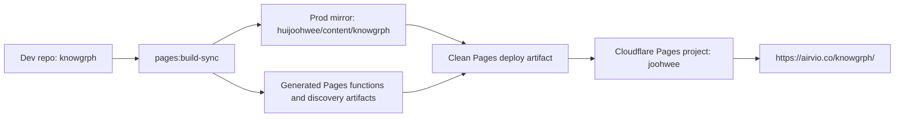
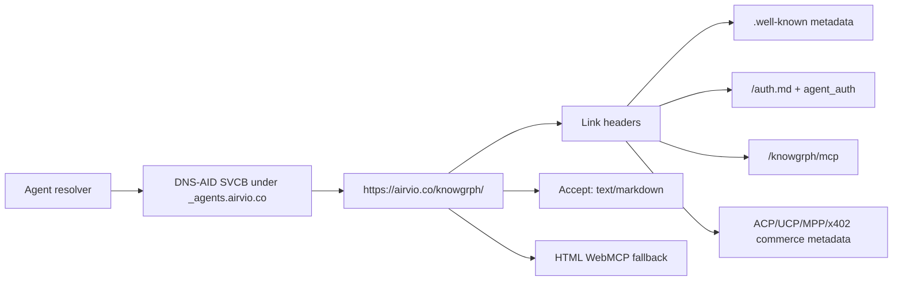
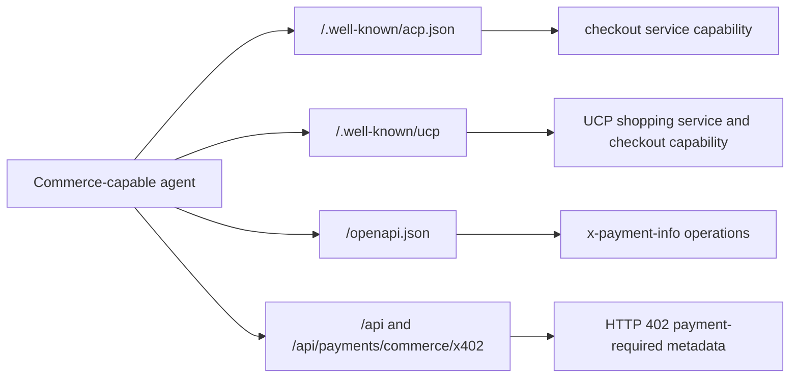
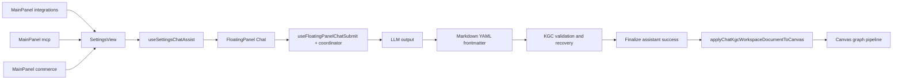

# Knowgrph Agent Ready Document

## Executive Summary

Knowgrph is agent-ready through a source-owned Dev -> Prod -> Cloudflare chain. The current
implementation exposes DNS-AID, Auth.md, OAuth/OIDC metadata, root and app-scoped `.well-known`
artifacts, Markdown negotiation, read-only HTTP MCP, browser-visible WebMCP, and root Commerce
discovery without moving authority out of the `knowgrph` repository.

The shipped browser and deployed surfaces intentionally differ by trust boundary:

- deployed Pages HTTP/HTML fallback exposes the five published read-only tools that can execute
  from public storage-backed content
- browser runtime can expose additional local inspection tools from the running app state
- MainPanel `mcp` and `integrations` remain thin shells over shared `SettingsView` ownership
- MainPanel `commerce` is the canonical operator surface for agent-buyable workflows, with
  Payments retained only as a subsection
- FloatingPanel Chat remains the single LLM output -> Markdown YAML frontmatter -> Canvas pipeline
- `flow.subgraphs` is the only canonical grouping authoring surface for graph-producing Markdown

The document is a living PRD/TAD companion. It records the current implemented baseline, the
acceptance conditions that prove it, and the guardrails that prevent stale downstream patches,
parallel discovery surfaces, hardcoded mirror logic, or duplicate chat-to-canvas pipelines.

## Problem Statement

Agents need to discover Knowgrph from DNS, HTTP metadata, and browser runtime context before they
spend tokens on page interpretation. The previous failure mode was fragmented readiness: HTTP
discovery, auth registration, DNS entrypoints, WebMCP, MainPanel MCP surfaces, and chat-to-canvas
flow could drift independently.

Knowgrph solves this by keeping discovery and pipeline readiness rooted in upstream owners, then
projecting generated artifacts to the production mirror and Cloudflare Pages.

## Personas

| Persona | Job To Be Done | Success Signal |
|---|---|---|
| Agent resolver | Discover Knowgrph before fetching HTML | DNS-AID SVCB records and DNSSEC-authenticated responses exist |
| Browser-based agent | Inspect app capabilities in the loaded page | WebMCP tools are visible through model-context surfaces |
| API/MCP client | Read public Source Files and shared documents | HTTP MCP lists and calls read-only tools successfully |
| Commerce-capable agent | Discover paid resource and checkout capabilities | ACP, UCP, MPP, and x402 root commerce probes pass |
| Solo maintainer | Ship one source-owned readiness surface | Dev build, prod sync, deploy, and live checks pass without mirror patches |
| Knowledge worker | Turn chat output into canvas graph structure | LLM output starts with YAML frontmatter and applies through the existing Canvas pipeline |

## Journey: Agent Resolver - Discover Knowgrph

| Stage | Action | Touchpoint | Pain Point | Opportunity |
|---|---|---|---|---|
| Trigger | Agent receives `airvio.co` as a candidate service | DNS | No reliable pre-HTTP entrypoint if records drift | DNS-AID routes resolver to service metadata |
| Discover | Agent fetches service homepage and `.well-known` metadata | `/knowgrph/`, root aliases, Link headers | HTML scraping wastes tokens and may miss APIs | Structured headers and JSON metadata advertise routes |
| Engage | Agent reads MCP card, Auth.md, and public Source Files | `/auth.md`, `/knowgrph/mcp`, storage-backed docs | Auth and read surfaces can diverge | Shared route owner keeps metadata and tools aligned |
| Complete | Agent calls read-only tools or reads Markdown | HTTP MCP, WebMCP, Markdown negotiation | Browser and HTTP tool schemas can fork | Shared published tool contract keeps parity |
| Return | Agent or maintainer re-validates readiness after deploy | npm checks and external scan | Stale deploy claims hide regressions | Live smoke and DNS/Auth checks are repeatable |

## Scope

### In Scope

- DNS-AID entrypoint records under `_agents.airvio.co`
- `/auth.md`, OAuth Protected Resource metadata, OAuth/OIDC metadata, and `agent_auth`
- root and `/knowgrph/` discovery `Link` headers
- app-scoped and root `.well-known` discovery artifacts
- Markdown negotiation for root, service homepage, and published document routes
- read-only HTTP MCP on `/knowgrph/mcp`
- browser WebMCP runtime and Pages HTML fallback WebMCP
- root Commerce discovery for ACP, UCP, MPP, and x402
- MainPanel `mcp` / `integrations` / `commerce` -> FloatingPanel Chat -> KGC Markdown -> Canvas apply path
- generated production mirror sync and Cloudflare Pages deployment validation

### Out Of Scope

- write-capable public MCP tools
- direct mutation of unpublished browser drafts from deployed MCP
- replacing `/knowgrph/` with apex `/` as the service homepage
- TXT-only DNS-AID substitutes or unsigned public discovery as the canonical path
- a second MainPanel MCP settings stack
- a second Commerce or payment worker stack
- a second LLM Markdown-to-Canvas graph pipeline
- legacy grouping aliases such as `kg:subgraphs`, `clusters`, `groups`, or `layers`

## User Stories And Acceptance

| ID | Story | Acceptance Criteria | `/goal` Translation |
|---|---|---|---|
| PRD-AR-01 | As an agent resolver, I want DNS-AID records so discovery can start before HTTP fetches. | Given public DNS, when `_index._agents.airvio.co`, `_mcp._agents.airvio.co`, and `_a2a._agents.airvio.co` are queried for SVCB, then records return authenticated ServiceMode parameters. | `npm run dns-aid:check` exits 0 with 3/3 checks passing. |
| PRD-AR-02 | As an agent registration client, I want Auth.md and agent auth metadata so registration is machine-discoverable. | Given root discovery, when `/auth.md` and OAuth metadata are fetched, then Markdown auth instructions and `agent_auth` metadata are present. | `npm run auth-md:check` exits 0 with 5/5 checks passing. |
| PRD-AR-03 | As an MCP client, I want a read-only published document surface so I can list and read public Knowgrph content. | Given `/knowgrph/mcp`, when `initialize`, `tools/list`, and supported `tools/call` requests run, then public Source Files and shared-document reads resolve. | `KNOWGRPH_AGENT_READY_BASE_URL=https://airvio.co/knowgrph npm run agent-ready:check` exits 0. |
| PRD-AR-04 | As a browser agent, I want WebMCP in the loaded page so I can inspect the deployed surface without scraping. | Given root or `/knowgrph/` HTML, when scanner execution evaluates the page, then model-context tools are visible and no meta refresh destroys the context. | External agent-ready WebMCP scan returns `pass` with five published tools. |
| PRD-AR-05 | As a knowledge worker, I want MainPanel MCP and integrations actions to route into the existing chat/canvas pipeline. | Given a MainPanel assist action, when FloatingPanel Chat emits LLM output, then KGC Markdown validates from YAML frontmatter and applies through Canvas owners. | Source owners remain `SettingsView`, `useFloatingPanelChatSubmit`, KGC validation, and `applyChatKgcWorkspaceDocumentToCanvas`; no duplicate pipeline is introduced. |
| PRD-AR-06 | As maintainer, I want deployment to stay source-owned so production cannot drift from Dev. | Given Dev changes, when build/sync/deploy runs, then prod mirror assets match the generated artifact and live `/knowgrph/` serves that artifact. | `npm run pages:build-sync`, `npm run pages:check-sync`, deploy, and live asset hash comparison pass. |
| PRD-AR-07 | As a commerce-capable agent, I want payment and checkout discovery before creating a checkout session. | Given the root origin, when Commerce discovery routes are fetched, then ACP, UCP, MPP, and x402 metadata expose protocol, service, capability, endpoint, and payable-operation data. | `agent-ready:check` commerce probes pass and external scan reports `commerce.acp`, `commerce.ucp`, `commerce.mpp`, and `commerce.x402` as `pass`. |

## Success Metrics

| Metric | Baseline | Target | Current |
|---|---:|---:|---:|
| Agent-ready smoke checks | 0 | 42 | 42 |
| Auth.md checks | 0 | 5 | 5 |
| DNS-AID public checks | 0 | 3 | 3 |
| External WebMCP published tools | 0 | 5 | 5 |
| Commerce protocol checks | 0 | 4 | 4 |
| Discovery token spend | Unknown | 0 LLM tokens | 0 LLM tokens |
| Monthly TCO for discovery layer | Unknown | zero incremental paid services | Cloudflare-native, no added paid dependency |
| ROI score | Unscored | ship min-viable max-value readiness | High: reused existing Pages, DNS, storage, and chat owners |

### ROI And TCO Estimate

```text
ROI Score = (User Impact x Reach) / (Build Hours + Monthly TCO + Token Cost / Month)
ROI Score = (5 x 4 validation surfaces) / (2 + 0 + 0) = 10
```

Inputs:

- User Impact: `5`, because a broken readiness surface blocks agent discovery.
- Reach: `4`, represented by the recurring DNS-AID, Auth.md, MCP/WebMCP, and deploy-validation
  sessions that must stay aligned after every release.
- Build Hours: `2`, bounded to document consolidation and validation rather than new runtime code.
- Monthly TCO: `0`, because the solution reuses Cloudflare Pages, Cloudflare DNS, and existing
  storage/read pipelines.
- Token Cost / Month: `0` for discovery and read-only MCP/WebMCP inspection.

## MoSCoW Priority

| Tier | Items | Rationale |
|---|---|---|
| Must | DNS-AID, Auth.md, OAuth metadata, `.well-known`, Link headers, Markdown negotiation, HTTP MCP, WebMCP fallback, Commerce discovery, deploy validation | Required for agent discovery and public readiness scans |
| Should | MainPanel MCP/integrations/commerce documentation, chat-to-canvas traceability, canonical frontmatter constraints | Prevents future implementation drift |
| Could | richer write-capable agent workflows, remote MCP pipeline expansion | Requires auth, mutation policy, and separate acceptance |
| Won't | mirror-only patches, duplicate route owners, TXT-only DNS-AID, grouping alias remaps | Conflicts with source ownership and neutrality guardrails |

## Architecture

### Deployment Topology



### Discovery Flow



### Commerce Discovery Flow



### MainPanel To Canvas Pipeline



## Workflow: Source-Owned Agent-Ready Deploy

**Trigger**: agent-ready implementation, documentation, DNS, auth, or Pages artifact changes.

**Actors**: solo maintainer, Dev repo, prod mirror, Cloudflare Pages, external readiness scanner.

**Happy Path**:

1. Maintainer updates canonical `knowgrph` source owners and documentation.
2. Dev build runs `npm run pages:build-sync`.
3. Sync check runs `npm run pages:check-sync`.
4. Functions bundle is generated from upstream Pages owners.
5. A clean deploy artifact is created from the prod mirror plus generated files.
6. Cloudflare Pages deploys the artifact to project `joohwee`.
7. Live checks prove `/`, `/knowgrph/`, Auth.md, DNS-AID, MCP, and WebMCP readiness.

**Alternate Paths**:

- DNS-only change: run `npm run dns-aid:contract`, publish DNS records, then run
  `npm run dns-aid:check` before HTTP deployment claims.
- Documentation-only change: validate frontmatter, line budget, whitespace, and changed-file
  hygiene before stopping.

**Error Paths**:

- Build or sync drift fails: do not deploy stale artifacts.
- Cloudflare credential or account mismatch occurs: stop and report the live deploy gap explicitly.
- External WebMCP scan fails: inspect root no-navigation behavior and shared lifecycle parity first.

**Postconditions**: live `https://airvio.co/knowgrph/` returns the generated artifact, checks pass,
and the prod mirror remains a downstream artifact rather than a hand-edited source.

## Component Inventory

| Concern | Canonical Owner | Status |
|---|---|---|
| Pages route and agent-ready discovery | `cloudflare/pages/knowgrph-agent-ready.mjs` | Implemented |
| Shared discovery helpers | `cloudflare/pages/knowgrph-agent-ready-shared.mjs` | Implemented |
| Root stable WebMCP/Markdown response | `cloudflare/pages/root-agent-ready-index.mjs` | Implemented |
| Browser WebMCP lifecycle | `canvas/src/features/agent-ready/webMcpLifecycle.mjs` | Implemented |
| Shared published tool contract | `canvas/src/features/agent-ready/knowgrphAgentReadyToolContract.mjs` | Implemented |
| Commerce discovery static files | `cloudflare/pages/knowgrph-agent-ready-commerce.mjs` | Implemented |
| Commerce route, protocol, and semantic-key SSOT | `grph-shared/src/payments/agenticCommerceSsot.ts` | Implemented |
| Payment worker runtime | `cloudflare/workers/knowgrph-payment/agenticCommerce.ts` | Implemented |
| Commerce readiness validation | `scripts/agent-ready-commerce-checks.mjs` | Implemented |
| HTTP MCP and HTML fallback validation | `scripts/check-agent-ready.mjs` | Implemented |
| Auth.md validation | `scripts/check-auth-md.mjs` | Implemented |
| DNS-AID record contract and live check | `scripts/dns-aid-records.mjs`, `scripts/check-dns-aid-cloudflare.mjs` | Implemented |
| DNS-AID publish tooling | `scripts/publish-dns-aid-cloudflare.mjs` | Implemented |
| MainPanel MCP/integrations shells | `MainPanel.tsx`, `McpHubView.tsx`, `IntegrationsHubView.tsx`, `SettingsView.tsx` | Implemented |
| Chat submit and KGC pipeline | `useFloatingPanelChatSubmit.ts`, submit coordinator helpers, KGC validation, Canvas apply bridge | Implemented |
| Prod mirror sync | `scripts/sync-pages-knowgrph.mjs` | Implemented |

## Data Flow

| Stage | Component | Input Format | Output Format | Persistence | Error Handling |
|---|---|---|---|---|---|
| DNS discover | Cloudflare DNS | SVCB query | DNS-AID ServiceMode records | Cloudflare zone | `dns-aid:check` fails closed on missing AD or mismatched params |
| HTTP discover | Pages function | GET/HEAD with optional Accept | HTML, Markdown, JSON metadata, Link headers | Cloudflare Pages artifact | smoke checks require expected routes and headers |
| Commerce discover | root Pages function | ACP, UCP, MPP, and x402 probes | commerce protocol JSON and HTTP 402 payment metadata | Cloudflare Pages artifact / payment Worker | commerce checks fail closed on missing protocol fields, service lists, schemas, or payment-required metadata |
| MCP read | Pages MCP transport | JSON-RPC | read-only tool results | storage worker / D1-backed public docs | tool errors return structured JSON-RPC errors |
| Browser context | WebMCP lifecycle | page runtime context | model-context tools | in-memory browser runtime | bounded late binding and readable fallback context |
| Chat output | FloatingPanel Chat | user prompt + selected context | Markdown with YAML frontmatter | workspace / chat history | KGC recovery validates or rejects malformed output |
| Canvas apply | KGC parser and graph bridge | frontmatter flow markdown | canvas nodes, edges, subgraphs | graph store / workspace state | parser rejects non-canonical grouping aliases |

## Quality Attributes

| Attribute | Scenario | Target | Verification |
|---|---|---|---|
| Discoverability | Agent starts from DNS or homepage | DNS-AID, Link headers, `.well-known`, Auth.md, MCP card all resolve | `dns-aid:check`, `auth-md:check`, `agent-ready:check` |
| Commerce readiness | Agent starts from root origin and needs paid resource discovery | ACP, UCP, MPP, and x402 resolve without creating a checkout session | `agent-ready:check` and external commerce scan |
| Security | Public tools execute without user auth | Read-only only; mutation is out of scope | MCP tools expose reads only |
| Resilience | Root scanners evaluate WebMCP | No meta refresh or navigation destroys execution context | external WebMCP scan passes |
| Observability | Maintainer can prove readiness | Checks surface counts and route failures | npm checks and scan result |
| Performance | Discovery should avoid LLM work | 0 LLM tokens before optional chat | token budget table |
| Maintainability | Future work stays source-owned | one owner path per concern | traceability and guardrails |

## AI Harness And Token Economics

Discovery endpoints are deterministic and spend zero LLM tokens. The only LLM-bearing path in this
document is the FloatingPanel Chat pipeline. It must remain a harnessed path:

```text
User/context -> Chat submit coordinator -> LLM -> KGC validation -> Canvas apply
```

Harness requirements:

- validate chat inputs and selected context before model spend
- require output to start with YAML frontmatter for graph-producing KGC Markdown
- reject wrapper prose and non-canonical grouping aliases before Canvas apply
- keep retry loops bounded by the existing KGC attempt/recovery flow
- emit or preserve provider/model metadata where the chat runtime already tracks it
- do not create raw prompt calls outside the shared submit coordinator

Token budget:

| Pipeline | Prompt Tokens | Completion Tokens | Cache / Reuse | Cost Rule |
|---|---:|---:|---|---|
| DNS/HTTP discovery | 0 | 0 | CDN and DNS cache | zero LLM spend |
| Commerce discovery | 0 | 0 | static protocol metadata and HTTP 402 probes | zero LLM spend before an agent chooses to pay |
| HTTP MCP read-only calls | 0 | 0 | public storage reads | zero LLM spend |
| Browser WebMCP inspection | 0 | 0 | in-memory runtime | zero LLM spend |
| FloatingPanel Chat -> Canvas | provider-dependent | provider-dependent | selected model/provider settings | log through existing chat/provider metadata; no unbounded retry loops |

## ADRs

### ADR-001: Keep Agent Readiness Source-Owned

Decision: agent-ready behavior is authored in `knowgrph`, generated into the prod mirror, and
deployed to Cloudflare Pages.

Alternatives considered:

- mirror-only patches in `huijoohwee/content/knowgrph`
- a separate Worker service for discovery

TCO/FOSS result: existing Pages/functions/DNS ownership has zero new dependency and no extra
runtime service. Mirror-only patches have low short-term cost but high drift cost, so they are
forbidden.

### ADR-002: Use DNS-AID SVCB Records, Not TXT Fallbacks

Decision: publish ServiceMode SVCB records for `_index`, `_mcp`, and `_a2a` under `_agents`.

Alternatives considered:

- TXT records
- HTTP-only `.well-known` discovery

TCO/FOSS result: Cloudflare DNS is already in use. SVCB plus DNSSEC gives authenticated
pre-HTTP discovery without additional paid infrastructure.

### ADR-003: Publish Auth.md And `agent_auth` In Existing Metadata

Decision: root `/auth.md`, OAuth Protected Resource metadata, OAuth authorization-server metadata,
and OIDC metadata are served from the same agent-ready surface.

Alternatives considered:

- separate auth-registration endpoint
- static auth instructions without machine-readable `agent_auth`

TCO/FOSS result: extending existing metadata has no new dependency and keeps registration
discoverability neutral.

### ADR-004: Keep MCP And Integrations As Shared MainPanel Shells

Decision: MainPanel `mcp` and `integrations` reuse `SettingsView` and existing chat assist helpers.

Alternatives considered:

- separate MCP-only chat pipeline
- separate MCP settings registry

TCO/FOSS result: reusing shared shells reduces implementation and maintenance cost, preserves
current chat/provider controls, and avoids duplicate state.

### ADR-005: Keep Commerce Discovery In Shared Payment Owners

Decision: ACP, UCP, MPP, and x402 discovery are generated from
`grph-shared/src/payments/agenticCommerceSsot.ts` and exposed through the existing Pages and
payment Worker surfaces.

Alternatives considered:

- a separate commerce discovery Worker
- mirror-only static JSON under `huijoohwee/content/knowgrph`
- local UI aliases that keep Payments and Commerce as parallel top-level panels

TCO/FOSS result: shared payment owners keep Dev -> Prod -> Cloudflare parity intact, preserve one
semantic-key source for MainPanel Commerce readiness, and avoid stale static fixtures.

## Validation Evidence

Latest live deployment target:

- service URL: `https://airvio.co/knowgrph/`
- Cloudflare Pages project: `joohwee`
- deployment preview: `https://0b76c831.joohwee.pages.dev`
- Commerce root scan: external `isitagentready.com` scan for `https://airvio.co` returned
  `commerce.acp`, `commerce.ucp`, `commerce.mpp`, and `commerce.x402` as `pass`

Checks:

| Check | Command / Probe | Result |
|---|---|---|
| Prod sync | `npm run pages:check-sync` | passed |
| Agent-ready smoke | `KNOWGRPH_AGENT_READY_BASE_URL=https://airvio.co/knowgrph npm run agent-ready:check` | `43/43` |
| Auth.md | `npm run auth-md:check` | `5/5` |
| DNS-AID | `npm run dns-aid:check` | `3/3` |
| WebMCP external scan | `isitagentready.com` scan for `https://airvio.co/knowgrph/` | passed with five published tools |
| Commerce external scan | `isitagentready.com` scan for `https://airvio.co` | ACP, UCP, MPP, and x402 passed |
| Root scan stability | `https://airvio.co/` | 200 app-shell alias, no meta refresh, inline WebMCP present |

## Guardrails

- Do not hand-author production behavior in the mirror when an upstream `knowgrph` owner exists.
- Do not add compatibility remaps for stale grouping aliases; reject or clean them at source.
- Do not create a second WebMCP lifecycle or MCP schema owner.
- Do not create a second commerce discovery owner; update shared payment SSOT and generated Pages
  artifacts instead.
- Do not re-calculate document identity with timestamp-only or ad hoc keys when shared semantic-key
  helpers already exist.
- Do not re-render or re-apply Canvas graphs from stale Source Files snapshots.
- Do not freeze browser scanner execution with root redirects or meta refreshes.
- Do not advertise write tools or mutation capability before auth, scopes, and revocation are
  specified.

## Traceability

| Requirement | Architecture Owner | Verification |
|---|---|---|
| PRD-AR-01 DNS-AID | `scripts/dns-aid-records.mjs` and Cloudflare DNS | `npm run dns-aid:check` |
| PRD-AR-02 Auth.md | `cloudflare/pages/knowgrph-agent-ready.mjs` | `npm run auth-md:check` |
| PRD-AR-03 HTTP MCP | Pages MCP handler and shared tool contract | `npm run agent-ready:check` |
| PRD-AR-04 WebMCP | WebMCP lifecycle plus HTML fallback injection | external WebMCP scan |
| PRD-AR-05 Chat to Canvas | shared MainPanel, FloatingPanel, KGC, parser, and Canvas owners | source-owner audit plus focused app tests |
| PRD-AR-06 Deploy parity | `pages:build-sync`, prod mirror, Pages deploy artifact | sync check and live asset comparison |
| PRD-AR-07 Commerce discovery | shared Commerce SSOT, Pages commerce static files, and payment Worker | `agent-ready:check` plus external Commerce scan |

## Change Log

| Version | Date | Change |
|---|---|---|
| 1.1.0 | 2026-05-29 | Updated Commerce readiness for ACP, UCP, MPP, x402, MainPanel Commerce ownership, validation evidence, and shared payment-owner guardrails. |
| 1.0.0 | 2026-05-29 | Created implementation PRD/TAD living document for the deployed DNS-AID, Auth.md, WebMCP, MCP, MainPanel, chat, Markdown frontmatter, Canvas, and Cloudflare validation baseline. |
