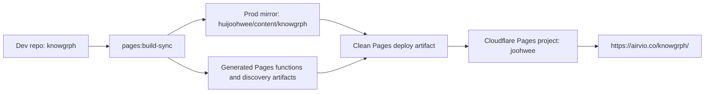
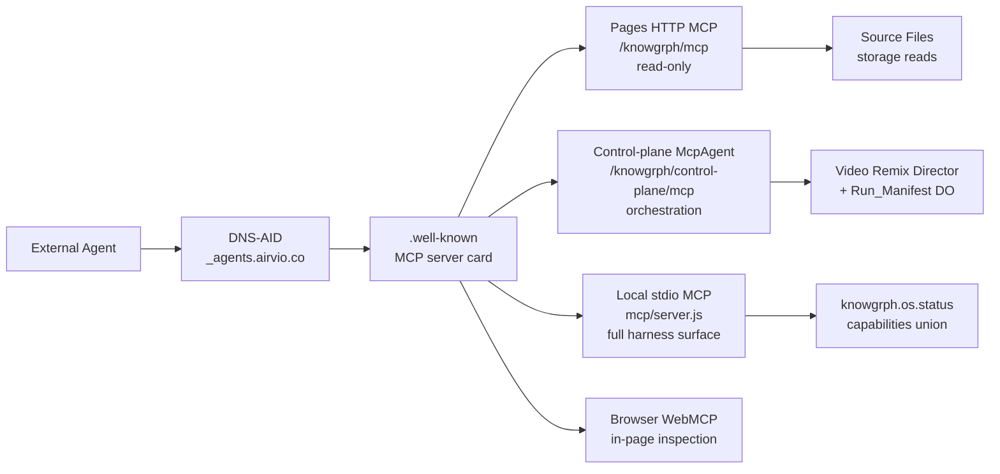
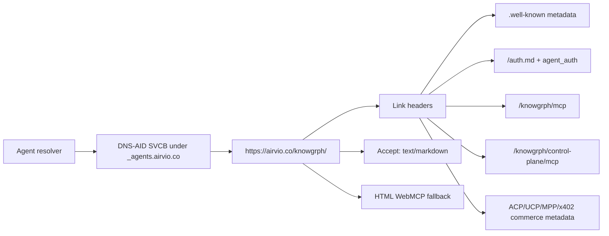
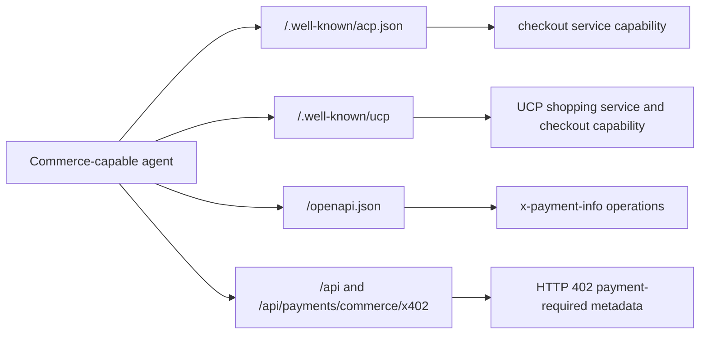
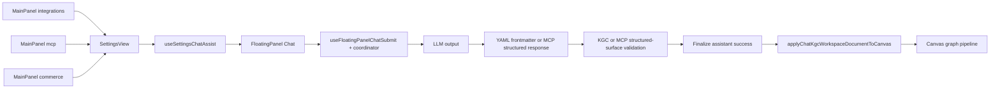

# Knowgrph Agent Ready Document

## Executive Summary

Knowgrph is agent-ready through a source-owned Dev -> Prod -> Cloudflare chain. The current
implementation exposes DNS-AID, Auth.md, OAuth/OIDC metadata, root and app-scoped `.well-known`
artifacts, Markdown negotiation, read-only HTTP MCP, browser-visible WebMCP, control-plane Streamable
HTTP MCP for approval-gated orchestration, Agentic OS visibility via `knowgrph.os.status`, and root
Commerce discovery without moving authority out of the `knowgrph` repository.

The **MCP Gateway** is a discovery-first federation over four existing surfaces (local stdio, Pages
HTTP MCP, browser WebMCP, Cloudflare `McpAgent` control plane) unified by shared contracts — not a
fifth monolithic proxy tier (see `knowgrph-agentic-os-prd-tad.md` ADR-4). Agents discover capabilities
via DNS-AID → Link headers → `.well-known` MCP server card → surface selection by trust boundary.
MCP-compatible hosts including Claude, ChatGPT, Codex, Gemini, Qwen Code, Kimi CLI, and BytePlus ModelArk can use public discovery for read-only installation and the control plane for approval-gated grammar invocation. MainPanel claims remain `documented` or `browser-published` unless a `runtime-executable` owner is named.
For public remote installs, `https://airvio.co/knowgrph/mcp` is the canonical discovery and setup URL.
`https://airvio.co/knowgrph/control-plane/mcp` remains a separate approval-gated orchestration surface.
The public install endpoint truth stays read-only retrieval/inspection plus prompt/resource/template
discovery, while the separate control-plane surface now advertises remote Agentic Canvas OS docs
invocation through `knowgrph.agentic_canvas_os.docs.invoke` in current source-owned discovery metadata.
The **Agentic OS** (`knowgrph.os.status`) provides read-only cross-harness visibility: process list,
capability union, cost summary, gate catalog, and circuit-breaker bounds — at zero token cost per call.

The repo also ships a local long-horizon SuperAgent harness for research/code/create artifact runs.
That harness is available through `python3 -m knowgrph_parser superagent`, `npm run goal:run`, and
local MCP `knowgrph.superagent.run`. It is source-owned and DeerFlow-inspired only at the concept
level; it is not a deployed public Pages/WebMCP mutation service.

The shipped browser and deployed surfaces intentionally differ by trust boundary:

- deployed Pages HTTP/HTML fallback exposes the five published read-only tools that can execute
  from public storage-backed content
- browser runtime can expose additional local inspection tools from the running app state
- MainPanel `mcp` and `integrations` remain thin shells over shared `SettingsView` ownership
- MainPanel `commerce` is the canonical operator surface for agent-buyable workflows, with
  Payments retained only as a subsection
- FloatingPanel Chat remains the single LLM output -> YAML frontmatter Markdown or MCP structured response -> Editor Workspace -> Canvas pipeline
- `flow.subgraphs` is the only canonical grouping authoring surface for graph-producing Markdown
- local SuperAgent execution remains CLI/local-MCP only unless a future source-owned deployed route
  and live validation prove otherwise
- Agentic Canvas OS Dashboard remains a planned browser-local document/runtime model: agents may inspect
  the active dashboard document, run state, approvals, budget, artifacts, and failures, but deployed
  Pages/WebMCP must not claim write/deploy/payment mutation from that surface
- Agentic Canvas OS Market Radar and real-browser evidence remain planned local/browser capabilities: agents
  may inspect source-backed market reports, evidence levels, source cards, screenshots/media
  artifacts, scoped browser session state, and blocked gates, but must not persist credentials,
  cookies, private messages, unrelated tabs, or perform social-platform actions
- Agentic Canvas OS Starter Repo remains a planned dry-run blueprint capability: agents may inspect
  React frontend, AI-agent backend, auth, gateway/tool policy, IaC, tests, docs, and deployment
  preflight state, but must not write files, copy external templates, generate secrets, or deploy
  infrastructure without approval
- Agentic Canvas OS Learning Loop remains a planned local-first capability: agents may inspect finalized-trace
  recall cards, candidate/approved skills, learning nudges, and editable identity facets, but deployed
  Pages/WebMCP must not expose private memory, raw transcripts, hidden prompts, or auto-promote skills

The document is a living PRD/TAD companion. It records the current implemented baseline, the
acceptance conditions that prove it, and the guardrails that prevent stale downstream patches,
parallel discovery surfaces, hardcoded mirror logic, or duplicate chat-to-canvas pipelines.

## Problem Statement

Agents need to discover Knowgrph from DNS, HTTP metadata, and browser runtime context before they
spend tokens on page interpretation. The previous failure mode was fragmented readiness: HTTP
discovery, auth registration, DNS entrypoints, WebMCP, MainPanel MCP surfaces, and chat-to-canvas
flow could drift independently.

Public remote exposure can also drift if the canonical install URL, MCP server card, `tools/list`,
and host setup snippets stop telling the same story. That drift is especially costly for low-context
remote hosts because it turns a one-paste MCP install into manual endpoint selection.

Knowgrph solves this by keeping discovery and pipeline readiness rooted in upstream owners, then
projecting generated artifacts to the production mirror and Cloudflare Pages.

## Personas

| Persona | Job To Be Done | Success Signal |
|---|---|---|
| Agent resolver | Discover Knowgrph before fetching HTML | DNS-AID SVCB records and DNSSEC-authenticated responses exist |
| Browser-based agent | Inspect app capabilities in the loaded page | WebMCP tools are visible through model-context surfaces |
| API/MCP client | Read public Source Files and shared documents | HTTP MCP lists and calls read-only tools successfully |
| Commerce-capable agent | Discover paid resource and checkout capabilities | ACP, UCP, MPP, and x402 root commerce probes pass |
| Solo maintainer | Ship one source-owned readiness surface | Dev build, prod sync, deploy, and live checks pass without mirror patches |
| External agent operator | Discover full MCP capability surface in one call | `knowgrph.os.status` (`view:"capabilities"`) returns deduplicated tool union |
| Harness operator | See all in-flight agent work from one MCP call | `knowgrph.os.status` (`view:"process_list"`) returns normalized Process_Entry[] |
| Knowledge worker | Turn chat output into canvas graph structure | LLM output starts with YAML frontmatter and applies through the existing Canvas pipeline |

## Journey: Agent Resolver - Discover Knowgrph

| Stage | Action | Touchpoint | Pain Point | Opportunity |
|---|---|---|---|---|
| Trigger | Agent receives `airvio.co` as a candidate service | DNS | No reliable pre-HTTP entrypoint if records drift | DNS-AID routes resolver to service metadata |
| Discover | Agent fetches service homepage and `.well-known` metadata | `/knowgrph/`, root aliases, Link headers | HTML scraping wastes tokens and may miss APIs | Structured headers and JSON metadata advertise routes |
| Engage | Agent reads MCP card, Auth.md, and public Source Files | `/auth.md`, `/knowgrph/mcp`, storage-backed docs | Auth and read surfaces can diverge | Shared route owner keeps metadata and tools aligned |
| Complete | Agent calls read-only tools or reads Markdown | HTTP MCP, WebMCP, Markdown negotiation | Browser and HTTP tool schemas can fork | Shared published tool contract keeps parity |
| Return | Agent or maintainer re-validates readiness after deploy | npm checks and external scan | Stale deploy claims hide regressions | Live smoke and DNS/Auth checks are repeatable |

## Scope

### In Scope

- DNS-AID entrypoint records under `_agents.airvio.co`
- `/auth.md`, OAuth Protected Resource metadata, OAuth/OIDC metadata, and `agent_auth`
- root and `/knowgrph/` discovery `Link` headers
- app-scoped and root `.well-known` discovery artifacts
- Markdown negotiation for root, service homepage, and published document routes
- read-only HTTP MCP on `/knowgrph/mcp`
- control-plane Streamable HTTP MCP on `/knowgrph/control-plane/mcp` (Director + stages + `knowgrph.os.status` + `knowgrph.agentic_canvas_os.docs.invoke`)
- public remote endpoint role separation: `/knowgrph/mcp` for install/discovery, `/knowgrph/control-plane/mcp` for approval-gated orchestration
- browser WebMCP runtime and Pages HTML fallback WebMCP
- local stdio MCP with Agentic OS `knowgrph.os.status` and full harness tool surface
- Agentic OS read-only aggregation (process list, capabilities, cost, gates, circuit breakers)
- MCP Gateway discovery contract (four-surface federation via shared agent-ready contracts)
- local CLI/local-MCP SuperAgent harness documentation and source-owner linkage
- root Commerce discovery for ACP, UCP, MPP, and x402
- MainPanel `mcp` / `integrations` / `commerce` -> FloatingPanel Chat -> KGC Markdown -> Canvas apply path
- planned Agentic Canvas OS Dashboard inspection as a Source Files Markdown document plus typed runtime manifest
- planned Agentic Canvas OS Market Radar inspection as source-backed reports and evidence cards
- planned local real-browser evidence inspection for scoped dedicated-profile research artifacts
- planned Agentic Canvas OS Starter Repo inspection for secured full-stack agent app blueprints
- planned Agentic Canvas OS Learning Loop inspection for finalized-trace recall, reviewed skills, nudges, and identity facets
- generated production mirror sync and Cloudflare Pages deployment validation

### Out Of Scope

- a fifth monolithic MCP proxy gateway tier (federation uses existing four surfaces per ADR-4)
- write-capable public MCP tools on Pages HTTP MCP (control-plane orchestration is approval-gated separately)
- public docs that imply `/knowgrph/control-plane/mcp` is the default install URL for basic remote MCP discovery
- public docs that claim `/knowgrph/mcp` already exposes `knowgrph.agentic_canvas_os.docs.invoke`
- direct mutation of unpublished browser drafts from deployed MCP
- replacing `/knowgrph/` with apex `/` as the service homepage
- TXT-only DNS-AID substitutes or unsigned public discovery as the canonical path
- a second MainPanel MCP settings stack
- a second Commerce or payment worker stack
- a second LLM Markdown-to-Canvas graph pipeline
- legacy grouping aliases such as `kg:subgraphs`, `clusters`, `groups`, or `layers`
- a deployed mutating SuperAgent route without a source-owned Pages/Worker owner and live validation
- copied DeerFlow code, copied DeerFlow architecture, or DeerFlow-owned renderer/parser/graph apply stacks

## User Stories And Acceptance

| ID | Story | Acceptance Criteria | `/goal` Translation |
|---|---|---|---|
| PRD-AR-01 | As an agent resolver, I want DNS-AID records so discovery can start before HTTP fetches. | Given public DNS, when `_index._agents.airvio.co`, `_mcp._agents.airvio.co`, and `_a2a._agents.airvio.co` are queried for SVCB, then records return authenticated ServiceMode parameters. | `npm run dns-aid:check` exits 0 with 3/3 checks passing. |
| PRD-AR-02 | As an agent registration client, I want Auth.md and agent auth metadata so registration is machine-discoverable. | Given root discovery, when `/auth.md` and OAuth metadata are fetched, then Markdown auth instructions and `agent_auth` metadata are present. | `npm run auth-md:check` exits 0 with 5/5 checks passing. |
| PRD-AR-03 | As an MCP client, I want a read-only published document surface so I can list and read public Knowgrph content. | Given `/knowgrph/mcp`, when `initialize`, `tools/list`, and supported `tools/call` requests run, then public Source Files and shared-document reads resolve. | `KNOWGRPH_AGENT_READY_BASE_URL=https://airvio.co/knowgrph npm run agent-ready:check` exits 0. |
| PRD-AR-03A | As a remote MCP host operator, I want one canonical public install/discovery endpoint so setup metadata stays coherent. | Given public discovery metadata and setup guidance, when a basic remote host is configured, then `/knowgrph/mcp` is the install/discovery URL and `/knowgrph/control-plane/mcp` is documented separately for approval-gated orchestration. | Docs and metadata reference one public install URL for basic remote MCP setup. |
| PRD-AR-04 | As a browser agent, I want WebMCP in the loaded page so I can inspect the deployed surface without scraping. | Given root or `/knowgrph/` HTML, when scanner execution evaluates the page, then model-context tools are visible and no meta refresh destroys the context. | External agent-ready WebMCP scan returns `pass` with five published tools. |
| PRD-AR-05 | As a knowledge worker, I want MainPanel MCP and integrations actions to route into the existing chat/canvas pipeline. | Given a MainPanel assist action, when FloatingPanel Chat emits LLM output, then KGC Markdown validates from YAML frontmatter or literal MCP `structuredContent` validates as a renderable structured surface before Editor Workspace and Canvas apply. | Source owners remain `SettingsView`, `useFloatingPanelChatSubmit`, KGC/MCP structured-surface validation, `chatResponseStructuredContent`, and `applyChatKgcWorkspaceDocumentToCanvas`; no duplicate pipeline is introduced. |
| PRD-AR-06 | As maintainer, I want deployment to stay source-owned so production cannot drift from Dev. | Given Dev changes, when build/sync/deploy runs, then prod mirror assets match the generated artifact and live `/knowgrph/` serves that artifact. | `npm run pages:build-sync`, `npm run pages:check-sync`, deploy, and live asset hash comparison pass. |
| PRD-AR-07 | As a commerce-capable agent, I want payment and checkout discovery before creating a checkout session. | Given the root origin, when Commerce discovery routes are fetched, then ACP, UCP, MPP, and x402 metadata expose protocol, service, capability, endpoint, and payable-operation data. | `agent-ready:check` commerce probes pass and external scan reports `commerce.acp`, `commerce.ucp`, `commerce.mpp`, and `commerce.x402` as `pass`. |
| PRD-AR-08 | As an Agentic Canvas OS operator, I want the dashboard to be inspectable without exposing mutation. | Given a dashboard document exists, when browser-local agent inspection runs, then the active document path, run state, approvals, budget, artifacts, failures, and demo-pack completeness are readable while file-write, deploy, paid-call, and payment actions remain blocked without approval. | Future implementation proves read-only dashboard inspection and rejects unapproved mutation. |
| PRD-AR-09 | As an Agentic Canvas OS operator, I want market validation and browser evidence to be inspectable without exposing private browser data. | Given a market report and scoped browser evidence manifest exist, when browser-local agent inspection runs, then evidence levels, source cards, claim ids, screenshots/media hashes, allowed domains, and blocked gates are readable while credentials, cookies, private messages, unrelated tabs, and unscoped network bodies are absent. | Future implementation proves source-card inspection and browser privacy redaction before any richer research tool ships. |
| PRD-AR-10 | As an Agentic Canvas OS operator, I want self-improving memory to be inspectable and controllable. | Given finalized traces or explicit notes exist, when browser-local learning inspection runs, then recall cards, skill states, learning nudges, identity facets, confidence, expiry, and source trace ids are readable while drafts, rejected memories, hidden prompts, raw transcripts, and private browser data stay excluded. | Future implementation proves local-first learning inspection, skill-promotion approval, and identity-facet edit/delete controls. |
| PRD-AR-11 | As an Agentic Canvas OS operator, I want starter-repo blueprints to be inspectable before creation. | Given a starter manifest exists, when browser-local inspection runs, then frontend, backend, auth, gateway/tool policy, IaC choice, tests, docs, security checks, and deployment preflight state are readable while file writes, copied scaffolds, generated secrets, and deployment remain blocked without approval. | Future implementation proves starter-repo dry-run inspection and rejects unapproved creation/deploy actions. |
| PRD-AR-12 | As an external agent, I want MCP Gateway discovery so I can choose the correct surface without scraping HTML. | Given DNS-AID and `.well-known` metadata, when the agent reads the MCP server card and calls `knowgrph.os.status` (`view:"capabilities"`), then deduplicated tool ids with `sourceCatalogs[]` are returned and `unreachableCatalogs[]` names any optional catalog without failing the call. | `npm run agent-ready:check` exits 0; local `knowgrph.os.status` capabilities view matches fixture union. |
| PRD-AR-13 | As a harness operator, I want Agentic OS process visibility in one MCP call. | Given Showrunner, Video Remix, or SuperAgent runs exist on disk, when `knowgrph.os.status` (`view:"process_list"`) is called, then normalized Process_Entry[] are returned with `unavailableSources` for unreadable sources and no harness state file is modified. | `node --test mcp/__tests__/os-status-runtime.test.mjs` exits 0; before/after state snapshot diff is empty. |
| PRD-AR-14 | As an external agent, I want control-plane MCP for approval-gated orchestration. | Given `/knowgrph/control-plane/mcp` is deployed, when the agent calls `knowgrph.video_remix.run` in live mode without approval tokens, then state is blocked, estimated cost is zero, and Run_Manifest is persistable via `GET /knowgrph/control-plane/mcp/runs/{id}`. | `node --test cloudflare/workers/knowgrph-mcp/__tests__/tool-registry.test.mjs` exits 0. |
| PRD-AR-15 | As maintainer, I want Agentic OS and MCP Gateway docs aligned with runtime. | Given v0.4.1 Agentic OS PRD/TAD, when this document is reviewed, then four-surface gateway federation, os.status views, and control-plane URL are documented with traceability to canonical owners. | Document frontmatter references `knowgrph-agentic-os-prd-tad.md` v0.4.1; component inventory lists implemented modules. |
| PRD-AR-16 | As operator, I want durable HITL tokens on the control plane before live spend. | Given Approval_Token issuance on Worker, when the Worker restarts within TTL, then verify and single-use consume still succeed for an approved stage. | Follow-on Track A in `knowgrph-agentic-os-follow-on-prd-tad.md`; local HITL tests pass today. |
| PRD-AR-17 | As operator, I want one gated live Director stage proof on the deployed Worker. | Given live env vars and approval tokens, when research+storyboard stages run live, then Run_Manifest persists with cited evidence and validated Cost_Log. | Follow-on Track B; `director-live-run` + `research-harness` tests pass locally. |
| PRD-AR-18 | As operator, I want the Agentic Canvas OS dashboard visible on Canvas. | Given `knowgrph.agentic_canvas_os.plan` output, when dashboard markdown opens in Canvas, then Storyboard Widget renders lane nodes from frontmatter-flow. | Follow-on Track C; companion lane contracts unchanged. |

## Success Metrics

| Metric | Baseline | Target | Current |
|---|---:|---:|---:|
| Agent-ready smoke checks | 0 | 42 | 42 |
| Agentic OS unit + PBT tests | 0 | pass | pass (local) |
| Control-plane MCP tool-registry tests | 0 | pass | pass |
| Auth.md checks | 0 | 5 | 5 |
| DNS-AID public checks | 0 | 3 | 3 |
| External WebMCP published tools | 0 | 5 | 5 |
| Commerce protocol checks | 0 | 4 | 4 |
| Discovery token spend | Unknown | 0 LLM tokens | 0 LLM tokens |
| Agentic OS token spend | N/A | $0 per call | $0 (read-only, zero model calls) |
| Time-to-value (TTV steps) — Agentic OS | N/A | ≤ 2 (start local MCP; call os.status) | ≤ 2 |
| Time-to-value (TTV elapsed) — Agentic OS | N/A | ≤ 1 min | ≤ 1 min (local MCP already running) |
| Monthly TCO for discovery layer | Unknown | zero incremental paid services | Cloudflare-native, no added paid dependency |
| Public remote install URLs for basic setup | Unknown | 1 canonical URL | 1 (`/knowgrph/mcp`) documented; control plane kept separate |
| ROI score | Unscored | ship min-viable max-value readiness | High: reused existing Pages, DNS, storage, and chat owners |

### ROI And TCO Estimate

```text
ROI Score = (User Impact x Reach) / (Build Hours + Monthly TCO + Token Cost / Month)
ROI Score = (5 x 4 validation surfaces) / (2 + 0 + 0) = 10
```

Inputs:

- User Impact: `5`, because a broken readiness surface blocks agent discovery.
- Reach: `4`, represented by the recurring DNS-AID, Auth.md, MCP/WebMCP, and deploy-validation
  sessions that must stay aligned after every release.
- Build Hours: `2`, bounded to document consolidation and validation rather than new runtime code.
- Monthly TCO: `0`, because the solution reuses Cloudflare Pages, Cloudflare DNS, and existing
  storage/read pipelines.
- Token Cost / Month: `0` for discovery and read-only MCP/WebMCP inspection.

## MoSCoW Priority

| Tier | Items | Rationale |
|---|---|---|
| Must | DNS-AID, Auth.md, OAuth metadata, `.well-known`, Link headers, Markdown negotiation, HTTP MCP, WebMCP fallback, Commerce discovery, deploy validation, MCP Gateway discovery contract, Agentic OS local os.status | Required for agent discovery, gateway federation, and OS visibility |
| Must | Control-plane Streamable HTTP MCP (WHERE deployed) | Required for remote approval-gated orchestration |
| Should | Agentic Canvas OS dashboard documentation, follow-on Tracks A/B/C | See `knowgrph-agentic-os-follow-on-prd-tad.md` |
| Should | MainPanel MCP/integrations/commerce documentation, chat-to-canvas traceability, canonical frontmatter constraints | Prevents future implementation drift |
| Could | richer write-capable agent workflows, remote MCP pipeline expansion | Requires auth, mutation policy, and separate acceptance |
| Won't | mirror-only patches, duplicate route owners, TXT-only DNS-AID, grouping alias remaps | Conflicts with source ownership and neutrality guardrails |

## Architecture

### Deployment Topology



### MCP Gateway Federation Topology



### Discovery Flow



### Commerce Discovery Flow



### MainPanel To Canvas Pipeline



## Workflow: Source-Owned Agent-Ready Deploy

**Trigger**: agent-ready implementation, documentation, DNS, auth, or Pages artifact changes.

**Actors**: solo maintainer, Dev repo, prod mirror, Cloudflare Pages, external readiness scanner.

**Happy Path**:

1. Maintainer updates canonical `knowgrph` source owners and documentation.
2. Dev build runs `npm run pages:build-sync`.
3. Sync check runs `npm run pages:check-sync`.
4. Functions bundle is generated from upstream Pages owners.
5. A clean deploy artifact is created from the prod mirror plus generated files.
6. Cloudflare Pages deploys the artifact to project `joohwee`.
7. Live checks prove `/`, `/knowgrph/`, Auth.md, DNS-AID, MCP, and WebMCP readiness.

**Alternate Paths**:

- DNS-only change: run `npm run dns-aid:contract`, publish DNS records, then run
  `npm run dns-aid:check` before HTTP deployment claims.
- Documentation-only change: validate frontmatter, line budget, whitespace, and changed-file
  hygiene before stopping.

**Error Paths**:

- Build or sync drift fails: do not deploy stale artifacts.
- Cloudflare credential or account mismatch occurs: stop and report the live deploy gap explicitly.
- External WebMCP scan fails: inspect root no-navigation behavior and shared lifecycle parity first.

**Postconditions**: live `https://airvio.co/knowgrph/` returns the generated artifact, checks pass,
and the prod mirror remains a downstream artifact rather than a hand-edited source.

## Component Inventory

| Concern | Canonical Owner | Status |
|---|---|---|
| Pages route and agent-ready discovery | `cloudflare/pages/knowgrph-agent-ready.mjs` | Implemented |
| Shared discovery helpers | `cloudflare/pages/knowgrph-agent-ready-shared.mjs` | Implemented |
| Root stable WebMCP/Markdown response | `cloudflare/pages/root-agent-ready-index.mjs` | Implemented |
| Browser WebMCP lifecycle | `canvas/src/features/agent-ready/webMcpLifecycle.mjs` | Implemented |
| Shared published tool contract | `canvas/src/features/agent-ready/knowgrphAgentReadyToolContract.mjs` | Implemented |
| Commerce discovery static files | `cloudflare/pages/knowgrph-agent-ready-commerce.mjs` | Implemented |
| Commerce route, protocol, and semantic-key SSOT | `grph-shared/src/payments/agenticCommerceSsot.ts` | Implemented |
| Payment worker runtime | `cloudflare/workers/knowgrph-payment/agenticCommerce.ts` | Implemented |
| Commerce readiness validation | `scripts/agent-ready-commerce-checks.mjs` | Implemented |
| HTTP MCP and HTML fallback validation | `scripts/check-agent-ready.mjs` | Implemented |
| Local stdio MCP + Agentic OS | `mcp/server.js`, `mcp/os-status-runtime.js`, `mcp/local-tool-contract.js` | Implemented |
| Control-plane McpAgent Worker | `cloudflare/workers/knowgrph-mcp/index.ts`, `tool-registry.mjs`, `os-status-tool.mjs` | Implemented (WHERE deployed) |
| Agentic OS PRD/TAD SSOT | `docs/documents/knowgrph-agentic-os-prd-tad.md` | v0.4.1 |
| Agentic OS follow-on PRD/TAD | `docs/documents/knowgrph-agentic-os-follow-on-prd-tad.md` | v1.0.0 — Tracks A/B/C |
| HITL issuance (local) | `mcp/video-remix/approval-token-issuer.js` | Implemented; Worker KV pending Track A |
| Live stage clients | `mcp/video-remix/live-clients.js` | Env-gated; Track B |
| Agentic Canvas OS plan tool | `mcp/local-tool-contract.js` → `knowgrph.agentic_canvas_os.plan` | Dry-run; Track C |
| MCP architecture overview | `docs/documents/knowgrph-mcp/knowgrph-mcp.md` | Active |
| Auth.md validation | `scripts/check-auth-md.mjs` | Implemented |
| DNS-AID record contract and live check | `scripts/dns-aid-records.mjs`, `scripts/check-dns-aid-cloudflare.mjs` | Implemented |
| DNS-AID publish tooling | `scripts/publish-dns-aid-cloudflare.mjs` | Implemented |
| MainPanel MCP/integrations shells | `MainPanel.tsx`, `McpHubView.tsx`, `IntegrationsHubView.tsx`, `SettingsView.tsx` | Implemented as UI shells; readiness claims inside them may be `documented` or `browser-published` rather than `runtime-executable` |
| Chat submit and response validation pipeline | `useFloatingPanelChatSubmit.ts`, submit coordinator helpers, KGC validation, `chatResponseStructuredContent`, Canvas apply bridge | Implemented |
| Prod mirror sync | `scripts/sync-pages-knowgrph.mjs` | Implemented |

## Data Flow

| Stage | Component | Input Format | Output Format | Persistence | Error Handling |
|---|---|---|---|---|---|
| DNS discover | Cloudflare DNS | SVCB query | DNS-AID ServiceMode records | Cloudflare zone | `dns-aid:check` fails closed on missing AD or mismatched params |
| HTTP discover | Pages function | GET/HEAD with optional Accept | HTML, Markdown, JSON metadata, Link headers | Cloudflare Pages artifact | smoke checks require expected routes and headers |
| Commerce discover | root Pages function | ACP, UCP, MPP, and x402 probes | commerce protocol JSON and HTTP 402 payment metadata | Cloudflare Pages artifact / payment Worker | commerce checks fail closed on missing protocol fields, service lists, schemas, or payment-required metadata |
| MCP read | Pages MCP transport | JSON-RPC | read-only tool results | storage worker / D1-backed public docs | tool errors return structured JSON-RPC errors |
| Control-plane MCP | McpAgent Streamable HTTP | JSON-RPC POST `/knowgrph/control-plane/mcp` | Director Run_Manifest + stage tool results | Run_Manifest Durable Object | approval_required on unapproved spend; structured errors |
| Agentic OS read | Local stdio os.status | MCP tool call | Process/Capability/Cost/Gate/Breaker views | none (read-time aggregation) | registry failure → `{ ok:false, errorCode }`; harness state unmodified |
| Browser context | WebMCP lifecycle | page runtime context | model-context tools | in-memory browser runtime | bounded late binding and readable fallback context |
| Chat output | FloatingPanel Chat | user prompt + selected context | Markdown with YAML frontmatter or literal MCP `structuredContent` | workspace / chat history | KGC recovery validates malformed Markdown; structured-surface acceptance rejects non-renderable MCP output |
| Canvas apply | KGC parser and graph bridge | frontmatter flow markdown or projected MCP structured surface | canvas nodes, edges, widgets, cards, rich media panels, subgraphs | graph store / workspace state | parser rejects non-canonical grouping aliases and graph apply stays source-owned |

## Quality Attributes

| Attribute | Scenario | Target | Verification |
|---|---|---|---|
| Discoverability | Agent starts from DNS or homepage | DNS-AID, Link headers, `.well-known`, Auth.md, MCP card all resolve | `dns-aid:check`, `auth-md:check`, `agent-ready:check` |
| Commerce readiness | Agent starts from root origin and needs paid resource discovery | ACP, UCP, MPP, and x402 resolve without creating a checkout session | `agent-ready:check` and external commerce scan |
| Security | Public tools execute without user auth | Read-only only; mutation is out of scope | MCP tools expose reads only |
| Resilience | Root scanners evaluate WebMCP | No meta refresh or navigation destroys execution context | external WebMCP scan passes |
| Observability | Maintainer can prove readiness | Checks surface counts and route failures | npm checks and scan result |
| Performance | Discovery should avoid LLM work | 0 LLM tokens before optional chat | token budget table |
| Maintainability | Future work stays source-owned | one owner path per concern | traceability and guardrails |

## AI Harness And Token Economics

Discovery endpoints are deterministic and spend zero LLM tokens. The only LLM-bearing path in this
document is the FloatingPanel Chat pipeline. It must remain a harnessed path:

```text
User/context -> Chat submit coordinator -> LLM -> KGC or MCP structured-surface validation -> Editor Workspace -> Canvas apply
```

Harness requirements:

- validate chat inputs and selected context before model spend
- require output to start with YAML frontmatter for graph-producing KGC Markdown
- reject wrapper prose and non-canonical grouping aliases before Canvas apply
- keep retry loops bounded by the existing KGC attempt/recovery flow
- emit or preserve provider/model metadata where the chat runtime already tracks it
- do not create raw prompt calls outside the shared submit coordinator

Token budget:

| Pipeline | Prompt Tokens | Completion Tokens | Cache / Reuse | Cost Rule |
|---|---:|---:|---|---|
| DNS/HTTP discovery | 0 | 0 | CDN and DNS cache | zero LLM spend |
| Commerce discovery | 0 | 0 | static protocol metadata and HTTP 402 probes | zero LLM spend before an agent chooses to pay |
| HTTP MCP read-only calls | 0 | 0 | public storage reads | zero LLM spend |
| Agentic OS os.status (all views) | 0 | 0 | read-time aggregation | zero LLM spend; non-zero cost_log is a defect |
| Control-plane MCP discovery | 0 | 0 | tool listing / server card | zero LLM spend before orchestration |
| Browser WebMCP inspection | 0 | 0 | in-memory runtime | zero LLM spend |
| FloatingPanel Chat -> Canvas | provider-dependent | provider-dependent | selected model/provider settings | log through existing chat/provider metadata; no unbounded retry loops |

## ADRs

### ADR-001: Keep Agent Readiness Source-Owned

Decision: agent-ready behavior is authored in `knowgrph`, generated into the prod mirror, and
deployed to Cloudflare Pages.

Alternatives considered:

- mirror-only patches in `huijoohwee/content/knowgrph`
- a separate Worker service for discovery

TCO/FOSS result: existing Pages/functions/DNS ownership has zero new dependency and no extra
runtime service. Mirror-only patches have low short-term cost but high drift cost, so they are
forbidden.

### ADR-002: Use DNS-AID SVCB Records, Not TXT Fallbacks

Decision: publish ServiceMode SVCB records for `_index`, `_mcp`, and `_a2a` under `_agents`.

Alternatives considered:

- TXT records
- HTTP-only `.well-known` discovery

TCO/FOSS result: Cloudflare DNS is already in use. SVCB plus DNSSEC gives authenticated
pre-HTTP discovery without additional paid infrastructure.

### ADR-003: Publish Auth.md And `agent_auth` In Existing Metadata

Decision: root `/auth.md`, OAuth Protected Resource metadata, OAuth authorization-server metadata,
and OIDC metadata are served from the same agent-ready surface.

Alternatives considered:

- separate auth-registration endpoint
- static auth instructions without machine-readable `agent_auth`

TCO/FOSS result: extending existing metadata has no new dependency and keeps registration
discoverability neutral.

### ADR-004: Keep MCP And Integrations As Shared MainPanel Shells

Decision: MainPanel `mcp` and `integrations` reuse `SettingsView` and existing chat assist helpers.

Alternatives considered:

- separate MCP-only chat pipeline
- separate MCP settings registry

TCO/FOSS result: reusing shared shells reduces implementation and maintenance cost, preserves
current chat/provider controls, and avoids duplicate state.

### ADR-005: Keep Commerce Discovery In Shared Payment Owners

Decision: ACP, UCP, MPP, and x402 discovery are generated from
`grph-shared/src/payments/agenticCommerceSsot.ts` and exposed through the existing Pages and
payment Worker surfaces.

Alternatives considered:

- a separate commerce discovery Worker
- mirror-only static JSON under `huijoohwee/content/knowgrph`
- local UI aliases that keep Payments and Commerce as parallel top-level panels

TCO/FOSS result: shared payment owners keep Dev -> Prod -> Cloudflare parity intact, preserve one
semantic-key source for MainPanel Commerce readiness, and avoid stale static fixtures.

### ADR-006: MCP Gateway as Four-Surface Federation (Not a Fifth Proxy)

Decision: the MCP Gateway is discovery-first federation over local stdio, Pages HTTP MCP, browser
WebMCP, and Cloudflare control-plane `McpAgent` — unified by shared contracts and
`knowgrph.os.status` capabilities union. No fifth monolithic proxy tier.

Alternatives considered:

- unified MCP proxy Worker (rejected: duplicates dispatch, violates min-viable-max-value)
- Pages HTTP MCP only (rejected: cannot expose approval-gated orchestration)

TCO/FOSS result: $0 incremental infrastructure; reuses existing DNS-AID, Pages, and Worker deploy
paths. Full rationale in `knowgrph-agentic-os-prd-tad.md` ADR-4.

### ADR-007: Agentic OS Read-Only Aggregation via knowgrph.os.status

Decision: cross-harness visibility (process list, capabilities, cost, gates, circuit breakers) is
exposed through one combined MCP tool with a `view` argument at zero token cost.

Alternatives considered:

- five separate os.* tools (rejected: 5× wiring surface for identical read-only behavior)
- new OS-level persistent datastore (rejected: violates TCO-zero guardrail)

TCO/FOSS result: $0 infra, $0 token cost per call; read-time aggregation from existing harness
state. Full rationale in `knowgrph-agentic-os-prd-tad.md` ADR-1 and ADR-2.

## Validation Evidence

Latest live deployment target:

- service URL: `https://airvio.co/knowgrph/`
- Cloudflare Pages project: `joohwee`
- deployment preview: `https://2b72de0c.joohwee.pages.dev`
- Commerce root scan: external `isitagentready.com` scan for `https://airvio.co` returned
  `commerce.acp`, `commerce.ucp`, `commerce.mpp`, and `commerce.x402` as `pass`

Checks:

| Check | Command / Probe | Result |
|---|---|---|
| Prod sync | `npm run pages:check-sync` | passed |
| Agent-ready smoke | `KNOWGRPH_AGENT_READY_BASE_URL=https://airvio.co/knowgrph npm run agent-ready:check` | `43/43` |
| Agentic OS local | `node --test mcp/__tests__/os-status-runtime.test.mjs mcp/__pbt__/os-status.pbt.test.mjs` | pass |
| Control-plane MCP | `node --test cloudflare/workers/knowgrph-mcp/__tests__/tool-registry.test.mjs` | pass |
| Follow-on HITL (local) | `node --test mcp/__tests__/approval-token-single-use.test.mjs mcp/__tests__/director-gates-enforcement.test.mjs` | pass |
| Follow-on live harness (local) | `node --test mcp/__tests__/research-harness.test.mjs mcp/__tests__/director-live-run.test.mjs` | pass |
| Auth.md | `npm run auth-md:check` | `5/5` |
| DNS-AID | `npm run dns-aid:check` | `3/3` |
| WebMCP external scan | `isitagentready.com` scan for `https://airvio.co/knowgrph/` | passed with five published tools |
| Commerce external scan | `isitagentready.com` scan for `https://airvio.co` | ACP, UCP, MPP, and x402 passed |
| Root scan stability | `https://airvio.co/` | 200 app-shell alias that mounts the same `Knowgrph Canvas` app as `/knowgrph/`, hidden fixed fallback guard, no meta refresh, inline WebMCP present |

## Guardrails

- Do not hand-author production behavior in the mirror when an upstream `knowgrph` owner exists.
- Do not add compatibility remaps for stale grouping aliases; reject or clean them at source.
- Do not create a second WebMCP lifecycle or MCP schema owner.
- Do not create a second commerce discovery owner; update shared payment SSOT and generated Pages
  artifacts instead.
- Do not re-calculate document identity with timestamp-only or ad hoc keys when shared semantic-key
  helpers already exist.
- Do not re-render or re-apply Canvas graphs from stale Source Files snapshots.
- Do not freeze browser scanner execution with root redirects or meta refreshes.
- Do not build a fifth monolithic MCP proxy when four federated surfaces plus os.status suffice.
- Do not describe Agentic OS as write-capable; it is read-only aggregation only.
- Do not conflate Pages HTTP MCP (read-only) with control-plane MCP (approval-gated orchestration).

## Traceability

| Requirement | Architecture Owner | Verification |
|---|---|---|
| PRD-AR-01 DNS-AID | `scripts/dns-aid-records.mjs` and Cloudflare DNS | `npm run dns-aid:check` |
| PRD-AR-02 Auth.md | `cloudflare/pages/knowgrph-agent-ready.mjs` | `npm run auth-md:check` |
| PRD-AR-03 HTTP MCP | Pages MCP handler and shared tool contract | `npm run agent-ready:check` |
| PRD-AR-03A Public install/discovery coherence | Pages `.well-known`, MCP server card, and docs SSOT | doc review against canonical URLs |
| PRD-AR-04 WebMCP | WebMCP lifecycle plus HTML fallback injection | external WebMCP scan |
| PRD-AR-05 Chat to Canvas | shared MainPanel, FloatingPanel, KGC, parser, and Canvas owners | source-owner audit plus focused app tests |
| PRD-AR-06 Deploy parity | `pages:build-sync`, prod mirror, Pages deploy artifact | sync check and live asset comparison |
| PRD-AR-07 Commerce discovery | shared Commerce SSOT, Pages commerce static files, and payment Worker | `agent-ready:check` plus external Commerce scan |
| PRD-AR-12 MCP Gateway discovery | DNS-AID, Pages `.well-known`, os.status capabilities | `agent-ready:check` + os.status capabilities test |
| PRD-AR-13 Agentic OS process visibility | `mcp/os-status-runtime.js` | os-status unit + PBT tests |
| PRD-AR-14 Control-plane MCP | `cloudflare/workers/knowgrph-mcp/tool-registry.mjs` | tool-registry tests |
| PRD-AR-16..18 Follow-on tracks | `knowgrph-agentic-os-follow-on-prd-tad.md` | follow-on validation commands |

## Change Log

| Version | Date | Change |
|---|---|---|
| 1.3.3 | 2026-07-10 | Added explicit MCP-compatible LLM readiness language for Claude, ChatGPT, Codex, Gemini, Qwen Code, Kimi CLI, BytePlus ModelArk, and similar hosts, while preserving the `/knowgrph/mcp` discovery vs `/knowgrph/control-plane/mcp` orchestration boundary. |
| 1.3.2 | 2026-07-10 | Updated the implemented baseline to reflect current source truth: `/knowgrph/mcp` remains the canonical public install/discovery URL, while `/knowgrph/control-plane/mcp` advertises approval-gated orchestration plus remote `knowgrph.agentic_canvas_os.docs.invoke` grammar lookup in control-plane discovery metadata. |
| 1.3.1 | 2026-07-10 | Documented public remote exposure and discovery coherence: `/knowgrph/mcp` is the canonical install/discovery URL, `/knowgrph/control-plane/mcp` remains orchestration-only, and remote `/`, `#`, `@` grammar exposure remains a planned enhancement. |
| 1.3.0 | 2026-07-03 | Added follow-on PRD/TAD link, PRD-AR-16..18 (HITL durable store, live golden path, dashboard Canvas), Track A/B/C component inventory and validation commands. |
| 1.2.0 | 2026-07-03 | Added Agentic OS (`knowgrph.os.status`), MCP Gateway four-surface federation, control-plane MCP URL, PRD-AR-12..15, ADR-006/007, updated topology and validation evidence per `knowgrph-agentic-os-prd-tad.md` v0.4.0. |
| 1.1.0 | 2026-05-29 | Updated Commerce readiness for ACP, UCP, MPP, x402, MainPanel Commerce ownership, validation evidence, and shared payment-owner guardrails. |
| 1.0.0 | 2026-05-29 | Created implementation PRD/TAD living document for the deployed DNS-AID, Auth.md, WebMCP, MCP, MainPanel, chat, Markdown frontmatter, Canvas, and Cloudflare validation baseline. |
