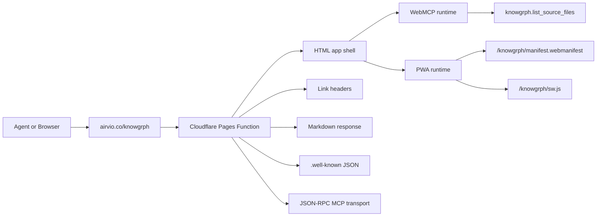

# Knowgrph Agent Ready - PRD + TAD (Implemented)

## Scope

Make `https://airvio.co/knowgrph/` discoverable to agents, browser-resident tools, and
Cloudflare-based crawlers without introducing a parallel architecture or a downstream-only
publish path. The implemented release chain is:

```text
Dev SSOT
  /Users/huijoohwee/Documents/GitHub/knowgrph
    -> npm run pages:build-sync
Prod mirror
  /Users/huijoohwee/Documents/GitHub/huijoohwee/content/knowgrph
    -> shared Pages repo root config in /Users/huijoohwee/Documents/GitHub/huijoohwee
Cloudflare Pages
  https://airvio.co/knowgrph/
```

The agent-ready route owner is generated from `cloudflare/pages/knowgrph-agent-ready.mjs`
and synced to `huijoohwee/functions/knowgrph/[[path]].js`.

## Product Goal

Knowgrph must:

- expose machine-readable discovery metadata without requiring HTML scraping
- keep the browser HTML shell as the default response for people
- expose a browser WebMCP surface for read-only source file discovery
- keep publish ownership upstream in `knowgrph`, not in generated mirror files
- avoid stale or conflicting Cloudflare control surfaces that can confuse Wrangler, caches,
  or custom-domain shells

## Source Of Truth

### Canonical owners

| Concern | Canonical owner | Notes |
|---|---|---|
| Agent-ready Pages Function | `cloudflare/pages/knowgrph-agent-ready.mjs` | Generates discovery metadata and Markdown response behavior |
| Browser WebMCP runtime | `canvas/src/features/agent-ready/webMcpRuntime.ts` | Registers `knowgrph.list_source_files` |
| App bootstrap | `canvas/src/main.tsx` | Installs WebMCP runtime and production PWA runtime |
| PWA runtime | `canvas/src/lib/pwa/runtime.ts` | Registers service worker and update handling |
| Publish sync | `scripts/sync-pages-knowgrph.mjs` | Mirrors built artifacts and generates root publish config updates |
| Shared Pages headers | `huijoohwee/_headers` | Authoritative deployed header surface |
| Shared Pages redirects | `huijoohwee/_redirects` | Authoritative deployed route surface |

### Forbidden architecture

The following are explicitly non-authoritative for deployed architecture and must not be used
to justify alternate implementation paths:

- the older universal `knowgrph-prd.md` and `knowgrph-tad.md` server architecture narrative
- any Node/Express, PostgreSQL/Redis, Kubernetes, GraphQL, or WebSocket backend description
- nested `content/knowgrph/_headers` or `content/knowgrph/_redirects` as deploy authority
- downstream patches in `huijoohwee/content/knowgrph` that do not originate from `knowgrph`

## User Stories

### E1-S3: Link Headers

As an agent or API client, I want `Link` headers on the Knowgrph homepage so I can discover
the API catalog, OpenAPI document, MCP card, and service documentation without scraping HTML.

Acceptance:

- `GET https://airvio.co/knowgrph/` returns a `Link` header
- the header includes `rel="api-catalog"`, `rel="service-desc"`, `rel="service-doc"`, and
  `rel="mcp-server-card"`
- the apex homepage `https://airvio.co/` must not receive Knowgrph-specific discovery headers

Implementation:

- source: `cloudflare/pages/knowgrph-agent-ready.mjs`
- route owner: `onRequest()`
- sync target: `huijoohwee/functions/knowgrph/[[path]].js`

### E2-S1: Markdown Negotiation

As an AI crawler or agent, I want Markdown from the homepage when I send
`Accept: text/markdown` so I receive a compact, token-efficient representation.

Acceptance:

- `GET /knowgrph/` with `Accept: text/markdown` returns
  `Content-Type: text/markdown; charset=utf-8`
- the body starts with `# Knowgrph`
- the response includes `x-markdown-tokens`
- the response varies by `Accept` so HTML and Markdown caches cannot collide

Implementation:

- source: `cloudflare/pages/knowgrph-agent-ready.mjs`
- matcher: `wantsMarkdown(request)`
- response builder: `markdownResponse()`

### E4-S5: WebMCP

As a browser-based agent, I want a WebMCP tool exposed through `navigator.modelContext` so I
can discover site actions directly in the browser context.

Acceptance:

- the page registers `knowgrph.list_source_files`
- registration supports `provideContext`, `registerTool`, and readable fallback tool storage
- the tool is de-duplicated by canonical name
- the document root exposes `data-kg-webmcp-tools="knowgrph.list_source_files"` for audit proof
- the apex homepage does not include the Knowgrph WebMCP tool

Implementation:

- runtime source: `canvas/src/features/agent-ready/webMcpRuntime.ts`
- install path: `canvas/src/main.tsx`
- transport/data endpoint: `https://airvio.co/api/storage/source-files`

### E5-S2: Publish Surface Hygiene

As a maintainer, I want a single authoritative Pages control-file surface so Wrangler and
Cloudflare do not evaluate stale nested `_headers` or `_redirects` artifacts.

Acceptance:

- final deploy authority lives at `huijoohwee/_headers` and `huijoohwee/_redirects`
- build sync must not mirror app-level `_headers` or `_redirects` into
  `huijoohwee/content/knowgrph`
- `npm run pages:check-sync` flags drift if generated root control blocks diverge

Implementation:

- sync owner: `scripts/sync-pages-knowgrph.mjs`
- blocked mirror control files: `_headers`, `_redirects`

### E5-S3: Custom-Domain Shell Correctness

As a user opening Knowgrph through the custom domain, I want the manifest and service-worker
surface to stay bound to `/knowgrph/` so an apex-domain rewrite cannot revive an old shell.

Acceptance:

- source `canvas/index.html` references the manifest through the configured base path
- a rewrite from `/` to Knowgrph must not resolve the manifest against the apex root
- regression coverage must fail if the manifest link falls back to a raw relative path again

Implementation:

- source HTML: `canvas/index.html`
- regression guard: `canvas/src/__tests__/pipelinePwaEnhancementsRegression.test.ts`

## Technical Architecture



## Publish Architecture

### Invariants

- `knowgrph` owns all source, build config, generated agent-ready artifacts, and sync logic
- `huijoohwee/content/knowgrph` is a mirrored artifact directory, not a configuration owner
- `huijoohwee/_headers` and `huijoohwee/_redirects` are the only authoritative Pages
  control-file surfaces
- `huijoohwee/knowgrph` is a generated compatibility surface for selected public-route files
- custom-domain rewrites must not introduce a second PWA identity at the apex root

### Why this matters

Two drift classes were explicitly neutralized:

1. Nested mirror control files can produce Wrangler confusion and stale deploy assumptions.
2. A relative manifest link can bind a rewritten apex page to the wrong manifest scope, which
   risks reviving an old cached shell.

## Route Contract

| Route | Method | Response |
|---|---:|---|
| `/knowgrph/` | GET/HEAD | HTML app shell plus Knowgrph discovery `Link` headers |
| `/knowgrph/` | GET with `Accept: text/markdown` | `text/markdown` plus `x-markdown-tokens` |
| `/robots.txt` | GET | root discovery alias |
| `/sitemap.xml` | GET | root discovery alias |
| `/.well-known/api-catalog` | GET | root discovery alias |
| `/knowgrph/robots.txt` | GET | app-scoped robots.txt |
| `/knowgrph/sitemap.xml` | GET | app-scoped sitemap |
| `/knowgrph/.well-known/api-catalog` | GET | RFC 9727 linkset |
| `/knowgrph/.well-known/openapi.json` | GET | OpenAPI 3.1 JSON |
| `/knowgrph/.well-known/oauth-protected-resource` | GET | OAuth protected-resource metadata |
| `/knowgrph/.well-known/oauth-authorization-server` | GET | OAuth/OIDC metadata |
| `/knowgrph/.well-known/mcp/server-card.json` | GET | MCP server card |
| `/knowgrph/.well-known/agent-skills/index.json` | GET | Agent Skills index |
| `/knowgrph/.well-known/http-message-signatures-directory` | GET | Web Bot Auth metadata |
| `/knowgrph/mcp` | GET/HEAD | MCP metadata |
| `/knowgrph/mcp` | POST | JSON-RPC `initialize`, `tools/list`, `tools/call` |

## Component Inventory

| Layer | Component | File / Module | Status |
|---|---|---|---|
| Pages Function | Route dispatcher | `cloudflare/pages/knowgrph-agent-ready.mjs` | Implemented |
| Pages Function | Markdown negotiation | `wantsMarkdown()`, `markdownResponse()` | Implemented |
| Pages Function | Link header injector | `linkHeaderValue`, `onRequest()` | Implemented |
| Pages Function | MCP transport | `handleMcpTransport()` | Implemented |
| Static artifacts | robots, sitemap, `.well-known` | generated by `buildAgentReadyStaticFiles()` | Implemented |
| Browser | WebMCP runtime | `canvas/src/features/agent-ready/webMcpRuntime.ts` | Implemented |
| Browser | PWA runtime | `canvas/src/lib/pwa/runtime.ts` | Implemented |
| Build | PWA manifest + service worker | `canvas/index.html`, `canvas/vite.config.ts` | Implemented |
| Publish | Mirror + root control generation | `scripts/sync-pages-knowgrph.mjs` | Implemented |
| Validation | Live smoke | `scripts/check-agent-ready.mjs` | Implemented |

## Cache And PWA Contract

### Required behavior

- `/knowgrph`, `/knowgrph/`, and `/knowgrph/index.html` stay non-cacheable at the Pages root
- `/knowgrph/assets/*` and `/knowgrph/vendor/*` stay immutable
- the production PWA runtime registers only against the Knowgrph base path
- the manifest link in source HTML resolves from `%BASE_URL%`, not a raw relative path
- service-worker and manifest ownership stay under the `/knowgrph/` path

### Explicit non-goals

- no apex-root PWA identity for Knowgrph
- no second service-worker route under `/`
- no manual edits inside mirrored `content/knowgrph` for cache or route fixes

## Validation Checklist

- [x] `https://airvio.co/knowgrph/` emits Knowgrph discovery `Link` headers
- [x] the apex homepage is excluded from Knowgrph discovery headers
- [x] Markdown negotiation returns `text/markdown`, `x-markdown-tokens`, and `Vary: Accept`
- [x] browser runtime exposes `knowgrph.list_source_files`
- [x] JSON-RPC MCP `initialize` returns a valid result
- [x] publish sync owns the root generated `_headers` and `_redirects` blocks
- [x] publish sync excludes nested `_headers` and `_redirects` from the mirrored app payload
- [x] `canvas/index.html` uses `%BASE_URL%manifest.webmanifest`
- [x] regression coverage protects the manifest base-path invariant

## Deployment Sequence

1. Build and sync: `npm run pages:build-sync`
2. Drift-check the mirror and generated Pages control files: `npm run pages:check-sync`
3. Smoke-check the agent-ready surface: `npm run agent-ready:check`
4. Deploy the shared Pages repo:
   `npx wrangler pages deploy ../huijoohwee --project-name=joohwee --branch=main --commit-dirty=true`
5. Re-run live checks against `https://airvio.co/knowgrph/`

## Enhancements

The implementation is complete for current agent-ready scope. Safe next steps are:

- add more read-only MCP tools before any mutating tool surface
- keep extending Cloudflare-hosted metadata from the single Pages Function generator
- add focused live checks for rewrite plus PWA manifest correctness if apex rewrites remain active

*Document version: 1.4.0 - Implemented - 2026-05-22*
