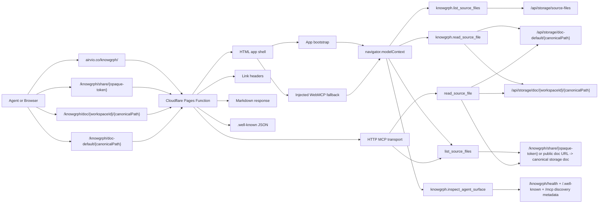
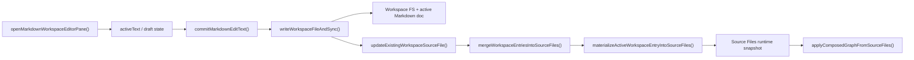

# Knowgrph Agent Ready - PRD + TAD (Implementation Accurate + Enhanced)

## Executive Summary

This document replaces two stale narratives at once:

- scan-style narratives that still describe Knowgrph as missing Link headers, Markdown
  negotiation, or WebMCP on `https://airvio.co/knowgrph/`
- roadmap narratives that blur the boundary between the shipped read-only Pages MCP surface and
  a larger still-proposed remote MCP platform documented separately in
  `docs/documents/knowgrph-mcp/knowgrph-mcp-service-prd-tad-proposed.md`

In the current repo, Knowgrph already ships the service-homepage agent-readiness surface on
`https://airvio.co/knowgrph/`, plus a separate in-browser MainPanel -> FloatingPanel Chat -> KGC
-> Canvas pipeline that is richer than the deployed read-only MCP surface but is not yet exposed
as a first-class MCP tool chain.

The active work is therefore not "add the first agent-ready surface." The active work is:

- keep deployed discovery owned upstream in `knowgrph`
- keep `/knowgrph/` as the canonical service homepage for agent discovery
- preserve the shipped read-only Pages MCP and browser WebMCP contracts as the truthful
  implementation baseline
- document MainPanel `mcp` and `integrations` as thin shells over shared `SettingsView` ownership
  instead of parallel configuration systems
- document the existing FloatingPanel Chat -> LLM output -> YAML frontmatter -> Canvas graph
  pipeline as the only valid upstream path for future MCP-aligned pipeline work
- prevent drift between browser WebMCP, HTTP MCP, MainPanel surfaces, chat submit helpers, canvas
  parsing, storage routes, and publish sync
- forbid stale architecture claims that the full remote MCP pipeline, auth, monetization, or graph
  mutation platform is already deployed when those capabilities remain proposed elsewhere

## Scope

### Product scope

Make `https://airvio.co/knowgrph/` discoverable to agents, browser-resident tools, and
Cloudflare-based crawlers without introducing a parallel architecture, duplicate deploy owner, or
stale downstream patches.

### Deployment topology

```text
Dev SSOT
  /Users/huijoohwee/Documents/GitHub/knowgrph
    -> npm run pages:build-sync

Prod static mirror
  /Users/huijoohwee/Documents/GitHub/huijoohwee/content/knowgrph
    -> mirrored app payload only

Prod Pages route owner
  /Users/huijoohwee/Documents/GitHub/huijoohwee/functions/knowgrph/[[path]].js
    -> generated from cloudflare/pages/knowgrph-agent-ready.mjs

Prod Pages root config
  /Users/huijoohwee/Documents/GitHub/huijoohwee/{_headers,_redirects,.well-known/*}

Cloudflare Pages
  https://airvio.co/knowgrph/
```

### Critical correction

`huijoohwee/content/knowgrph` is not the complete deploy authority for agent-readiness. It is a
mirrored artifact tree. The deployed discovery and route behavior is jointly owned by:

- `knowgrph/cloudflare/pages/knowgrph-agent-ready.mjs`
- `knowgrph/scripts/sync-pages-knowgrph.mjs`
- `huijoohwee/functions/knowgrph/[[path]].js`
- `huijoohwee/_headers`
- `huijoohwee/_redirects`

## Product Goals

Knowgrph must:

- expose machine-readable discovery metadata without requiring HTML scraping
- expose a valid A2A Agent Card at the standard well-known path
- keep HTML as the default human response on `/knowgrph/`
- return Markdown for agent requests on `/knowgrph/` when `Accept: text/markdown`
- expose read-only WebMCP and HTTP MCP tools that resolve to real storage-backed documents
- keep the default published workspace readable without requiring a caller-supplied `workspaceId`
- keep MainPanel `mcp` and MainPanel `integrations` aligned to the same upstream settings and chat
  routing owners instead of diverging into duplicate surfaces
- preserve one canonical document identity and path contract across Editor Workspace, Source Files,
  FloatingPanel Chat, frontmatter validation, canvas parsing, storage routes, and agent surfaces
- preserve one canonical KGC contract where the LLM output starts at YAML frontmatter and uses
  `flow.subgraphs` as the sole grouping authoring surface
- prevent stale or conflicting Cloudflare control surfaces, mirror-owned route logic, apex-root PWA
  drift, and duplicate MCP-only chat-to-canvas pipelines

## Non-Goals

Knowgrph does not currently aim to:

- expose write-capable browser or HTTP MCP tools
- expose the user's unsaved local browser draft directly as a deployed Cloudflare document
- move full Knowgrph route ownership or app identity onto the apex homepage `https://airvio.co/`
- introduce a second agent-ready implementation path outside `knowgrph`
- preserve legacy or conflicting architecture descriptions through compatibility aliases

## Current Implementation Status

| Capability | Status | Canonical owner | Remaining gap |
|---|---|---|---|
| Link headers on service homepage | Implemented | `cloudflare/pages/knowgrph-agent-ready.mjs` | Headers exist on `/knowgrph/`; apex `/` remains intentionally excluded |
| Link headers on root homepage | Implemented | `scripts/sync-pages-knowgrph.mjs` + `huijoohwee/_headers` | Root `/` advertises Knowgrph discovery without moving route ownership out of `knowgrph` |
| Markdown negotiation on homepage | Implemented | `cloudflare/pages/knowgrph-agent-ready.mjs` + `cloudflare/pages/root-agent-ready-index.mjs` | Accept parsing is intentionally narrow to `text/markdown` |
| Markdown negotiation on shared published docs | Implemented | `cloudflare/pages/knowgrph-agent-ready.mjs` + `cloudflare/workers/knowgrph-storage/wrangler.toml` + `scripts/sync-pages-knowgrph.mjs` | Pages server-side shared-doc and MCP storage reads use the storage worker `workers.dev` origin to avoid custom-domain self-fetch rewrites |
| Knowgrph health endpoint | Implemented | `cloudflare/pages/knowgrph-agent-ready.mjs` | App-scoped route stays the canonical status surface |
| A2A Agent Card | Implemented | `cloudflare/pages/knowgrph-agent-ready.mjs` | Card advertises current machine interfaces; it does not imply a full new task runtime |
| Browser WebMCP tool registration | Implemented | `canvas/src/features/agent-ready/webMcpRuntime.ts` + `canvas/src/features/agent-ready/knowgrphAgentReadyToolContract.mjs` | App runtime installs twelve read-only tools, including browser-local workspace, canvas, 3d, 2d viewport, and Source Files snapshot inspectors, and attempts `provideContext`, `registerTool(tool, { signal })`, then readable fallback storage |
| Browser WebMCP lifecycle hardening | Implemented | `canvas/src/features/agent-ready/webMcpRuntime.ts` | Late-binding install, `AbortController` registration lifecycle, and current-origin/localhost-aware storage resolution are now shipped without changing the shared tool contract |
| Browser-local workspace document inspector | Implemented | `canvas/src/features/agent-ready/webMcpRuntime.ts` + `canvas/src/hooks/useGraphStore.ts` | Exposed only in the app-installed browser runtime; not part of the shared deployed Pages HTTP/HTML tool contract |
| Browser-local canvas topology inspector | Implemented | `canvas/src/features/agent-ready/webMcpRuntime.ts` + `canvas/src/features/agent-ready/localCanvasTopologyInspection.ts` | Reuses active-view derivation and graph-topology helpers in the app runtime only; not part of the shared deployed Pages HTTP/HTML tool contract |
| Browser-local canvas snapshot inspector | Implemented | `canvas/src/features/agent-ready/webMcpRuntime.ts` + `canvas/src/features/agent-ready/localCanvasSnapshotInspection.ts` | Reuses the store-owned canvas SVG snapshot seam in the app runtime only; not part of the shared deployed Pages HTTP/HTML tool contract |
| Browser-local 3d camera pose inspector | Implemented | `canvas/src/features/agent-ready/webMcpRuntime.ts` + `canvas/src/features/agent-ready/localThreeCameraPoseInspection.ts` | Reuses the store-owned 3d camera pose seam in the app runtime only; not part of the shared deployed Pages HTTP/HTML tool contract |
| Browser-local 3d layout-position inspector | Implemented | `canvas/src/features/agent-ready/webMcpRuntime.ts` + `canvas/src/features/agent-ready/localThreeLayoutPositionsInspection.ts` | Reuses the store-owned 3d layout-position seam in the app runtime only, with a bounded sampled payload; not part of the shared deployed Pages HTTP/HTML tool contract |
| Browser-local 2d zoom/viewport inspector | Implemented | `canvas/src/features/agent-ready/webMcpRuntime.ts` + `canvas/src/features/agent-ready/local2dZoomViewportInspection.ts` | Reuses the keyed 2d zoom-state seam in the app runtime only, with renderer-aware active-view key resolution; not part of the shared deployed Pages HTTP/HTML tool contract |
| Browser-local Source Files snapshot inspector | Implemented | `canvas/src/features/agent-ready/webMcpRuntime.ts` + `canvas/src/features/agent-ready/localSourceFilesSnapshotInspection.ts` | Reuses the in-memory Source Files runtime snapshot, active workspace path, and existing composition/storage signatures in the app runtime only; not part of the shared deployed Pages HTTP/HTML tool contract |
| HTML fallback WebMCP injection | Implemented | `cloudflare/pages/knowgrph-agent-ready.mjs` | Injection must stay contract-equal with the shared published tool contract, excluding browser-local app-only tools |
| HTTP MCP transport | Implemented | `cloudflare/pages/knowgrph-agent-ready.mjs` | Tool surface is read-only only, by design |
| Shared tool-schema contract | Implemented | `canvas/src/features/agent-ready/knowgrphAgentReadyToolContract.mjs` | Future published tools must extend this shared upstream contract; browser-only tools may opt in explicitly without leaking into Pages MCP |
| MainPanel Integrations hub | Implemented | `canvas/src/features/panels/MainPanel.tsx` + `canvas/src/features/panels/views/IntegrationsHubView.tsx` + `canvas/src/features/panels/views/SettingsView.tsx` | Integrations is a thin `SettingsView` specialization, not a second routing owner |
| MainPanel MCP hub | Implemented | `canvas/src/features/panels/MainPanel.tsx` + `canvas/src/features/panels/views/McpHubView.tsx` + `canvas/src/features/panels/views/SettingsView.tsx` | MCP is also a thin `SettingsView` specialization, not a separate chat pipeline |
| Chat integration routing and presets | Implemented | `canvas/src/features/panels/views/useSettingsChatAssist.tsx` + `canvas/src/features/panels/views/settingsView.constants.ts` | Future MCP deep links must reuse the same chat routing, model, and open-panel helpers |
| FloatingPanel chat submit pipeline | Implemented | `canvas/src/features/chat/sidePanelChat/useSidePanelChatSubmit.ts` + coordinator helpers | Browser-local today; not yet exposed as a first-class WebMCP or HTTP MCP tool chain |
| KGC validation and recovery | Implemented | `canvas/src/features/chat/sidePanelChat/sidePanelChatKgcAttempt.ts` + `canvas/src/features/chat/chatMarkdownValidation.ts` + recovery helpers | Wrapper prose and parallel grouping aliases are rejected or stripped upstream before canvas apply |
| Chat finalize -> canvas apply | Implemented | `canvas/src/features/chat/sidePanelChat/useFinalizeAssistantSuccess.ts` + `canvas/src/features/chat/chatKgcCanvasApply.ts` | Writes canonical workspace KGC first, then applies to graph through existing store actions |
| Frontmatter-flow parse priority and graph composition | Implemented | `canvas/src/features/parsers/default.ts` + `canvas/src/features/parsers/markdownFrontmatterFlowGraph.*` | `tryParseMarkdownFrontmatterFlowGraph()` remains first parse priority for structured KGC Markdown |
| Subgraph/group projection | Implemented | `canvas/src/lib/graph/subgraphs.ts` + `canvas/src/components/GraphCanvas/layout/graphGroups.ts` | `flow.subgraphs` remains the sole authoring surface; rendered groups are downstream projection only |
| API catalog | Implemented | `cloudflare/pages/knowgrph-agent-ready.mjs` | `status` relation now targets `/knowgrph/health` |
| OpenAPI document | Implemented | `cloudflare/pages/knowgrph-agent-ready.mjs` | Health, MCP, and storage reads are documented from the existing route owner |
| Agent Skills index | Implemented | `cloudflare/pages/knowgrph-agent-ready.mjs` | Index is intentionally minimal |
| Default workspace markdown doc route | Implemented | `cloudflare/workers/knowgrph-storage/index.ts` | Published default workspace only |
| Source Files index and `llms.txt` | Implemented | `cloudflare/workers/knowgrph-storage/crawler.ts` | Service doc remains intentionally compact |
| Publish sync and Pages control-file hygiene | Implemented | `scripts/sync-pages-knowgrph.mjs` | Must keep mirror non-authoritative |
| PWA base-path correctness | Implemented | `canvas/index.html` and Pages root config | Must keep `%BASE_URL%manifest.webmanifest` invariant |
| Full remote MCP pipeline platform from the separate MCP service PRD/TAD | Proposed only | `docs/documents/knowgrph-mcp/knowgrph-mcp-service-prd-tad-proposed.md` | Must not be documented here as already shipped on the Pages agent-ready surface |

## Source Of Truth

### Canonical owners

| Concern | Canonical owner | Notes |
|---|---|---|
| Agent-ready Pages function | `cloudflare/pages/knowgrph-agent-ready.mjs` | Owns `/knowgrph/` Link headers, Markdown negotiation, `.well-known`, MCP, A2A card, and HTML WebMCP injection |
| Explicit shared-doc Pages functions | generated by `scripts/sync-pages-knowgrph.mjs` into `huijoohwee/functions/knowgrph/doc/[[path]].js` and `huijoohwee/functions/knowgrph/doc-default/[[path]].js` | Pins shared document routes to the canonical handler on deploy |
| Shared markdown-negotiation helper | `cloudflare/pages/knowgrph-agent-ready-shared.mjs` | Owns shared Markdown body, `markdownResponse()`, and `wantsMarkdown()` |
| Root markdown-negotiation function | `cloudflare/pages/root-agent-ready-index.mjs` | Owns `Accept: text/markdown` on `/` without changing app route ownership |
| Shared tool contract | `canvas/src/features/agent-ready/knowgrphAgentReadyToolContract.mjs` | Owns shared tool names, titles, descriptions, and input schema for browser WebMCP and HTTP MCP parity |
| Browser WebMCP runtime | `canvas/src/features/agent-ready/webMcpRuntime.ts` | Owns app-installed `navigator.modelContext` integration |
| App bootstrap | `canvas/src/main.tsx` | Installs WebMCP runtime at app startup |
| MainPanel shared tab shell | `canvas/src/features/panels/MainPanel.tsx` | Owns tab registration and lazy mounting for `integrations` and `mcp` |
| MainPanel Integrations hub | `canvas/src/features/panels/views/IntegrationsHubView.tsx` | Thin `SettingsView mode="integrations"` shell |
| MainPanel MCP hub | `canvas/src/features/panels/views/McpHubView.tsx` | Thin `SettingsView mode="mcp"` shell |
| Settings-mode filtering and action registration | `canvas/src/features/panels/views/SettingsView.tsx` | Shared owner for integrations and MCP surfaces |
| Chat routing and integration assist helpers | `canvas/src/features/panels/views/useSettingsChatAssist.tsx` + `canvas/src/features/panels/views/settingsView.constants.ts` | Owns presets, context scope, integration enablement, and open-chat handoff |
| FloatingPanel chat UI | `canvas/src/features/chat/SidePanelChat.tsx` | Owns interactive chat experience inside the floating panel |
| Chat submit shell | `canvas/src/features/chat/sidePanelChat/useSidePanelChatSubmit.ts` | Must remain a thin shell over centralized submit helpers |
| Chat submit coordinator | `canvas/src/features/chat/sidePanelChat/sidePanelChatSubmitCoordinator.ts` | Owns request lifecycle, streaming, retry, KGC validation, and finalize sequencing |
| KGC recovery and validation | `canvas/src/features/chat/chatHistoryWorkspace.kgc.recovery.ts` + `canvas/src/features/chat/chatMarkdownValidation.ts` | Owns wrapper salvage, frontmatter-first enforcement, and grouping-surface validation |
| Chat finalize and canvas bridge | `canvas/src/features/chat/sidePanelChat/useFinalizeAssistantSuccess.ts` + `canvas/src/features/chat/chatKgcCanvasApply.ts` | Owns canonical workspace persistence then canvas apply |
| Storage route contract | `canvas/src/lib/storage/knowgrphStorageSyncContract.ts` | Owns workspace id constant and route builders |
| Storage worker doc routes | `cloudflare/workers/knowgrph-storage/index.ts` | Serves `/api/storage/doc-default/*` and `/api/storage/doc/*` |
| Shared doc deep-link contract | `canvas/src/features/canvas/canvasDocDeepLink.ts` + `canvas/src/features/canvas/canvasDocShareToken.mjs` | Owns `/knowgrph/share/*`, `/knowgrph/doc/*`, `/knowgrph/doc-default/*`, opaque `kgShare` tokens, and published Share URL mapping from storage URLs |
| Shared doc runtime import | `canvas/src/features/canvas/CanvasDocDeepLinkRuntime.tsx` | Owns browser-side loading of shared documents into the Editor Workspace |
| Source Files share URL builder | `canvas/src/features/markdown-workspace/MarkdownWorkspaceSourceFilesList.tsx` | Promotes published storage-backed entries to canonical public Share URLs |
| Storage crawler routes | `cloudflare/workers/knowgrph-storage/crawler.ts` | Serves `/api/storage/source-files` and `/api/storage/llms.txt` |
| Workspace-open SSOT | `canvas/src/features/workspace-table/workspaceTableSsot.ts` | `openMarkdownWorkspaceEditorPane()` is canonical |
| Markdown edit convergence | `canvas/src/features/markdown-workspace/main/MarkdownWorkspaceMain.tsx` | `commitMarkdownEditText()` is canonical |
| Workspace write-through sync | `canvas/src/lib/markdown-workspace-runtime/markdownWorkspaceRuntime.io.ts` | `writeWorkspaceFileAndSync()` is canonical |
| Workspace to Source Files merge | `canvas/src/features/workspace-fs/syncToSourceFiles.ts` | `mergeWorkspaceEntriesIntoSourceFiles()` is canonical |
| Active-path Source Files materialization | `canvas/src/features/source-files/sourceFilesRuntimeMaterialization.ts` | `materializeActiveWorkspaceEntryIntoSourceFiles()` is canonical |
| Source Files graph compose/apply | `canvas/src/features/source-files/applyComposedGraphFromSourceFiles.ts` | Explicit graph-owner path only |
| Structured Markdown parse priority | `canvas/src/features/parsers/default.ts` | `tryParseMarkdownFrontmatterFlowGraph()` stays first for canonical KGC Markdown |
| Frontmatter-flow graph composition | `canvas/src/features/parsers/markdownFrontmatterFlowGraph.core.ts` + companion helpers | Owns edge merge, subgraph merge, cluster merge, and metadata projection |
| Canvas subgraph/group projection | `canvas/src/lib/graph/subgraphs.ts` + `canvas/src/components/GraphCanvas/layout/graphGroups.ts` | Rendered groups derive from canonical subgraph metadata; they are not a second authoring channel |
| Publish sync | `scripts/sync-pages-knowgrph.mjs` | Mirrors app build and generates root control surfaces |
| Shared Pages headers | `huijoohwee/_headers` | Final deploy header surface |
| Shared Pages redirects | `huijoohwee/_redirects` | Final deploy redirect surface |

### Forbidden architecture

The following are explicitly non-authoritative and must not be used to justify new code or docs:

- any claim that Link headers, Markdown negotiation, or WebMCP are still missing on
  `https://airvio.co/knowgrph/`
- any claim that the shipped Pages agent-ready surface already exposes the full MainPanel/Chat/KGC
  pipeline as a deployed HTTP MCP or WebMCP tool chain
- any claim that the separate proposed remote MCP platform in
  `docs/documents/knowgrph-mcp/knowgrph-mcp-service-prd-tad-proposed.md` is already implemented in
  the current repo or deployed Cloudflare Pages surface
- any claim that the apex root homepage `/` is the Knowgrph service homepage
- any parallel MainPanel MCP configuration system that bypasses `SettingsView`,
  `useSettingsChatAssist()`, or the existing open-panel helpers
- any second LLM output -> Markdown -> Canvas graph pipeline that bypasses
  `useSidePanelChatSubmit()`, the submit coordinator helpers, KGC recovery/validation, or
  `applyChatKgcWorkspaceDocumentToCanvas()`
- any grouping authoring alias besides canonical `flow.subgraphs`, including `kg:subgraphs`,
  `clusters`, `groups`, or `layers` as a parallel upstream source
- any Node/Express, PostgreSQL/Redis, Kubernetes, GraphQL, WebSocket, Durable Object, or server
  cluster narrative for the shipped Pages agent-ready surface unless the repo gains those owners for
  this surface first
- nested `content/knowgrph/_headers` or `content/knowgrph/_redirects` as deploy authority
- downstream patches in `huijoohwee/content/knowgrph` that do not originate from `knowgrph`
- agent-only Markdown serialization, local DOM scraping, or duplicate route contracts that bypass
  the existing workspace, storage, chat, and parser helpers
- timestamp-only or ad hoc cache keys for future agent pipeline signatures when shared semantic-key
  helpers already exist upstream

## Corrected Requirements

### R1: Link Header Discoverability

#### Requirement

As an agent or API client, I want discovery `Link` headers on the Knowgrph service homepage and
root homepage so I can find the API catalog, OpenAPI document, service docs, A2A card, and MCP
card without scraping HTML.

#### Implemented acceptance

- `GET https://airvio.co/knowgrph/` returns a `Link` header
- `HEAD https://airvio.co/` returns a `Link` header
- the header includes `rel="api-catalog"`, `rel="service-desc"`, `rel="service-doc"`,
  `rel="status"`, `rel="mcp-server-card"`, and `rel="describedby"` for the A2A Agent Card
- the app homepage remains the service homepage for discovery
- root `/` advertises discovery hints only; route ownership remains in `knowgrph`

#### Enhancement target

- keep root-level `.well-known` static artifacts discoverable without introducing a second route
  owner
- keep homepage Link headers, API catalog, OpenAPI, and health docs contract-equal

### R1b: A2A Agent Card

#### Requirement

As an external agent, I want a JSON A2A Agent Card at `/.well-known/agent-card.json` so I can
discover the Knowgrph agent surface without scraping HTML.

#### Implemented acceptance

- `GET https://airvio.co/.well-known/agent-card.json` returns JSON, not HTML
- `GET https://airvio.co/knowgrph/.well-known/agent-card.json` returns the same canonical card
- the card includes `name`, `version`, `description`, `supportedInterfaces`, `capabilities`, and
  `skills`
- the card points to the current machine interfaces already shipped by Knowgrph instead of inventing
  a parallel runtime

#### Enhancement target

- add richer A2A protocol support only if it remains rooted in the existing upstream route owner and
  validation contract

### R2: Markdown Negotiation

#### Requirement

As an AI crawler or agent, I want Markdown from `/`, `/knowgrph/`, and published shared document
URLs when I send `Accept: text/markdown` so I receive a compact, token-efficient representation
while HTML remains the browser default.

#### Implemented acceptance

- `GET /knowgrph/` with `Accept: text/markdown` returns
  `Content-Type: text/markdown; charset=utf-8`
- `GET /` with `Accept: text/markdown` returns
  `Content-Type: text/markdown; charset=utf-8`
- `GET /knowgrph/share/{opaque-token}` with `Accept: text/markdown` returns the published
  markdown document body instead of the HTML shell
- `GET /knowgrph/doc/{workspaceId}/{canonicalPath}` with `Accept: text/markdown` returns the
  published markdown document body instead of the HTML shell
- `GET /knowgrph/doc-default/{canonicalPath}` with `Accept: text/markdown` returns the same
  published markdown body for default-workspace aliases
- query-param alias `?kgShare={opaque-token}` remains supported by the same parser
- semantic query aliases `kgWorkspaceId` + `kgCanonicalPath` remain supported by the same parser
- the body starts with `# Knowgrph`
- the response includes `x-markdown-tokens`
- the response includes `Vary: Accept`

#### Enhancement target

- keep the HTML and Markdown bodies contract-equal for discovery metadata
- harden Accept parsing only if needed without broadening the route into a second content pipeline

### R3: WebMCP

#### Requirement

As a browser-based agent, I want a WebMCP surface exposed through `navigator.modelContext` so I
can discover real Knowgrph read-only tools inside the browser context.

#### Implemented acceptance

- app bootstrap installs WebMCP at startup through `installKnowgrphWebMcpRuntime()`
- the app runtime registers `knowgrph.list_source_files`, `knowgrph.read_source_file`, `knowgrph.read_shared_document`, `knowgrph.inspect_shared_document_structure`, `knowgrph.inspect_local_workspace_document`, `knowgrph.inspect_local_canvas_topology`, `knowgrph.inspect_local_canvas_snapshot`, `knowgrph.inspect_local_3d_camera_pose`, `knowgrph.inspect_local_3d_layout_positions`, `knowgrph.inspect_local_2d_zoom_viewport`, `knowgrph.inspect_local_source_files_snapshot`, and `knowgrph.inspect_agent_surface`
- the Pages HTML fallback registers the shared published tool set only: `knowgrph.list_source_files`, `knowgrph.read_source_file`, `knowgrph.read_shared_document`, `knowgrph.inspect_shared_document_structure`, and `knowgrph.inspect_agent_surface`
- registration attempts `provideContext({ tools })`, then `registerTool(tool, { signal })`, then a
  readable fallback `modelContext.tools` store
- tool names are canonical and deduplicated by name through
  `knowgrphAgentReadyToolContract.mjs`
- `read_source_file` requires `canonicalPath` and defaults `workspaceId` to
  `kgws:canonical-docs`
- the document root exposes tool presence through `data-kg-webmcp-tools` and
  `data-kg-webmcp-context`
- Knowgrph WebMCP is installed by app bootstrap and also available through HTML fallback injection
- browser WebMCP and HTTP MCP share the same upstream tool name and input-schema owner
- late `navigator.modelContext` arrival is supported through bounded retry and setter-driven install
- duplicate registration is treated as duplicate-state handling, not implicit success for all errors
- localhost browser reads keep same-origin `/api/storage/*` paths while preview/prod resolve from
  current origin with canonical fallback

#### Important correction

The external scan failure `Execution context was destroyed` is not the product truth. The repo
already contains both:

- app runtime WebMCP install in `canvas/src/features/agent-ready/webMcpRuntime.ts`
- HTML injection fallback in `cloudflare/pages/knowgrph-agent-ready.mjs`

The current shipped runtime is therefore not "missing WebMCP". It already exposes the read-only
browser tools and now ships the bounded late-binding, `AbortController` registration lifecycle, and
same-origin/current-origin storage-resolution hardening needed for preview, localhost, and prod.

#### Enhancement target

- keep browser WebMCP and HTTP MCP tool schemas contract-equal through the shared upstream contract
- add new tools only when they are read-only or explicitly user-mediated, rooted in existing helper
  owners, and validation-covered

### R3b: MainPanel MCP And Integrations Readiness

#### Requirement

As a user moving between MainPanel `mcp`, MainPanel `integrations`, and the FloatingPanel Chat UI,
I want one shared configuration and routing contract so MCP readiness does not fork into duplicate
UI owners or stale downstream panel logic.

#### Implemented acceptance

- `MainPanel.tsx` exposes both `integrations` and `mcp` shared tabs
- `IntegrationsHubView.tsx` is a thin `SettingsView mode="integrations"` shell
- `McpHubView.tsx` is a thin `SettingsView mode="mcp"` shell
- chat integration routing, preset application, context-scope changes, and model refresh live in
  `useSettingsChatAssist.tsx`
- section-level open-panel actions route to FloatingPanel chat through the shared
  `emitSidePanelOpen({ tab: 'chat', open: true })` path
- MainPanel `mcp` and MainPanel `integrations` therefore already converge on one upstream settings
  and chat-routing owner

#### Enhancement target

- keep any future MainPanel MCP quick-actions, docs links, or deep-link launches rooted in the same
  `SettingsView` and chat-assist owners
- do not create a second MCP-only panel flow, shadow chat routing config, or duplicate provider
  model selector outside the existing helpers

### R4: HTTP MCP

#### Requirement

As a remote agent, I want a simple HTTP MCP transport that exposes the same read-only document
tools as the browser surface.

#### Implemented acceptance

- `/knowgrph/mcp` supports `GET`, `HEAD`, and JSON-RPC `POST`
- `initialize`, `tools/list`, and `tools/call` execute successfully
- `tools/call` resolves live storage lookups for `list_source_files` and `read_source_file`
- tool execution returns structured content without advertising write capabilities
- HTTP MCP tool schema matches the shared upstream contract used by browser WebMCP

#### Enhancement target

- keep HTTP MCP and WebMCP parity for tool names, defaults, and input schema through the shared
  upstream contract
- do not add mutation tools until the workspace write contract, auth, and conflict semantics are
  explicitly designed

### R5: Default Workspace Markdown Access

#### Requirement

As an AI agent, I want direct read-only access to the default published Knowgrph workspace without
supplying a `workspaceId` first.

#### Implemented acceptance

- `/api/storage/doc-default/{canonicalPath}` resolves the canonical docs workspace
- `/api/storage/doc/{workspaceId}/{canonicalPath}` remains available for explicit workspace reads
- `/api/storage/source-files` and `/api/storage/llms.txt` advertise published source-file reads
- WebMCP and HTTP MCP both default `workspaceId` to `kgws:canonical-docs`

#### Enhancement target

- keep the default workspace id centralized in `knowgrphStorageSyncContract.ts`
- avoid any new hardcoded workspace-id aliases outside the shared storage contract

### R5b: Published Share URL Markdown Access

#### Requirement

As an AI agent or user opening a published shared document, I want one canonical Share URL that
serves HTML to browsers and the Editor Workspace Markdown pane content to agents on
`Accept: text/markdown`.

#### Implemented acceptance

- `MarkdownWorkspaceSourceFilesList` promotes published `source.kind === 'url'` entries into
  `/knowgrph/share/{opaque-token}`
- `CanvasDocDeepLinkRuntime` can import both workspace-scoped and default-workspace shared routes
- the Pages function proxies shared document Markdown from the storage worker instead of returning
  the generic homepage Markdown body
- `_redirects` reserves `/knowgrph/share/*`, `/knowgrph/doc/*`, and `/knowgrph/doc-default/*`
  for the Pages function so shared document URLs do not fall through to the apex redirect HTML
- publish sync emits explicit shared-doc function files so route ownership does not rely only on
  the generic `/knowgrph/[[path]]` catch-all
- semantic query params and path routes remain aliases; the canonical Share URL is the opaque
  `/knowgrph/share/{opaque-token}` route backed by the shared `kgShare` token contract

#### Deployed note

- Pages preview and `https://airvio.co/knowgrph/share/{opaque-token}` now both return the same
  storage-backed Markdown body on `Accept: text/markdown`
- the Pages handler fetches published shared-doc and MCP storage reads from
  `https://knowgrph-storage.huijoohwee.workers.dev` so the app no longer self-fetches through the
  custom-domain `/api/storage/*` route during server-side negotiation

#### Enhancement target

- keep Share URL generation and shared doc parsing rooted in `canvasDocDeepLink.ts`
- keep opaque token encoding rooted in `canvasDocShareToken.mjs`
- do not add a second public markdown serializer for shared documents

### R6: Editor Workspace -> Source Files -> Markdown SSOT

#### Requirement

As a maintainer, I want every future agent-readiness enhancement to reuse the existing workspace,
source-files, and Markdown SSOT so agents do not see a stale or alternate document pipeline.

#### Current canonical pipeline

1. Open the workspace editor through `openMarkdownWorkspaceEditorPane()`.
2. Edit through `commitMarkdownEditText()` so viewer edits, editor edits, and JSON-derived Markdown
   edits converge on one write path.
3. Persist through `writeWorkspaceFileAndSync()` so workspace FS, active Markdown document, and
   existing workspace-backed Source Files update together.
4. Merge entries into Source Files through `mergeWorkspaceEntriesIntoSourceFiles()`.
5. Materialize the active workspace entry through
   `materializeActiveWorkspaceEntryIntoSourceFiles()` and related active-path helpers.
6. Compose or apply graph data through `applyComposedGraphFromSourceFiles()` only through the
   explicit graph-owner path.

#### Implemented invariants

- `openMarkdownWorkspaceEditorPane()` is the canonical workspace-open helper
- `commitMarkdownEditText()` is the canonical edit convergence helper
- `writeWorkspaceFileAndSync()` is the canonical workspace write-through helper
- `readCallerOwnedSourceFilesSnapshot()` remains the snapshot owner in bootstrap paths
- Source Files composition signatures and workspace graph-mutation keys already reuse shared
  semantic-key/signature helpers upstream
- passive source-file switching must not become a hidden graph-apply side effect

#### Enhancement target

- future agent-readiness for live workspace reads must reuse the same helpers above
- no direct DOM scrape, no alternate serializer, no local-only Markdown shadow state, and no
  bypass around shared workspace writeback
- if a future agent snapshot or cache key is added, it must reuse shared semantic-key/signature
  helpers instead of timestamps or content-length heuristics
- if browser-local active-workspace reads are added later, they must be explicitly scoped as
  runtime-local and must not be confused with published Cloudflare document reads

### R6b: FloatingPanel Chat -> KGC -> Canvas Pipeline Alignment

#### Requirement

As a maintainer, I want future MCP readiness to extend the existing in-browser chat pipeline from
MainPanel settings to FloatingPanel Chat to canonical KGC Markdown to Canvas graph apply so we do
not create a second LLM-to-graph architecture.

#### Implemented acceptance

- `useSidePanelChatSubmit()` stays a thin shell that delegates lifecycle work to the submit helper
  stack
- `sidePanelChatSubmitCoordinator.ts` owns draft bootstrap, request context, transport retry,
  response streaming, KGC validation/retry, and finalize sequencing
- `chatMarkdownValidation.ts` enforces frontmatter-first output, canonical frontmatter shape, and
  `flow.subgraphs` as the sole grouping surface
- KGC recovery helpers salvage wrapped responses upstream before validation retry instead of adding
  downstream parser aliases
- `useFinalizeAssistantSuccess.ts` persists the canonical workspace KGC document and then calls
  `applyChatKgcWorkspaceDocumentToCanvas()`
- `setActiveMarkdownDocument({ applyToGraph: true })` remains the graph-apply gateway
- `tryParseMarkdownFrontmatterFlowGraph()` remains first parse priority for structured KGC Markdown
- frontmatter-flow composition merges edges, subgraphs, and cluster-derived groups before Canvas
  projection

#### Enhancement target

- if a future WebMCP or HTTP MCP tool can trigger this pipeline, it must call the existing submit,
  validation, finalize, and canvas-apply helpers or equally thin adapters
- do not introduce a second serializer, second grouping contract, second graph-apply path, or
  MCP-only Markdown template that diverges from the current chat pipeline

### R7: Publish Surface Hygiene

#### Requirement

As a maintainer, I want one authoritative Pages control-file surface so Wrangler and Cloudflare do
not evaluate stale nested control files or mirror-owned route logic.

#### Implemented acceptance

- final deploy authority lives at `huijoohwee/_headers` and `huijoohwee/_redirects`
- app-level `_headers` and `_redirects` are not mirrored into `huijoohwee/content/knowgrph`
- `npm run pages:check-sync` detects generated drift
- the Pages function sync target is generated from `knowgrph`, not hand-edited downstream

### R7b: Health And Status Discoverability

#### Requirement

As an agent or platform probe, I want a stable status route and status metadata so I can verify the
Knowgrph service homepage and discovery surface without scraping HTML.

#### Implemented acceptance

- `/knowgrph/health` returns `application/health+json`
- the homepage `Link` header includes `rel="status"`
- the API catalog includes a `status` relation pointing to `/knowgrph/health`
- the MCP server card exposes the same status URL in `links.status`
- the app `llms.txt` and Markdown-for-agents response mention the health route

### R8: Custom-Domain Shell Correctness

#### Requirement

As a user opening Knowgrph through the custom domain, I want manifest and service-worker ownership
to stay under `/knowgrph/` so apex rewrites cannot revive an old shell.

#### Implemented acceptance

- `canvas/index.html` references `%BASE_URL%manifest.webmanifest`
- Knowgrph PWA ownership stays under the `/knowgrph/` base path
- regression coverage protects the manifest base-path invariant

## Technical Architecture

### Deployed agent-ready surface



### Internal runtime contract for future enhancements



### Browser E2E pipeline contract

```mermaid
flowchart LR
  A["MainPanel integrations tab"] --> C["SettingsView"]
  B["MainPanel mcp tab"] --> C
  C --> D["useSettingsChatAssist()"]
  D --> E["emitSidePanelOpen(tab=chat)"]
  E --> F["FloatingPanel / SidePanelChat"]
  F --> G["useSidePanelChatSubmit()"]
  G --> H["sidePanelChatSubmitCoordinator.ts"]
  H --> I["streaming draft + KGC retry"]
  I --> J["chatMarkdownValidation.ts"]
  J --> K["useFinalizeAssistantSuccess()"]
  K --> L["applyChatKgcWorkspaceDocumentToCanvas()"]
  L --> M["setActiveMarkdownDocument(applyToGraph)"]
  M --> N["tryParseMarkdownFrontmatterFlowGraph()"]
  N --> O["merge edges + subgraphs + clusters"]
  O --> P["Canvas groups / clusters / edges"]
```



### Architectural rule

The deployed Cloudflare document surface, the shared MainPanel shells, and any future local
runtime agent surface must converge on the same document identity and pipeline model:

- canonical workspace id
- canonical `canonicalPath`
- canonical workspace/source-file path resolution
- canonical Markdown body produced by the existing workspace write-through flow
- canonical MainPanel ownership where `integrations` and `mcp` stay thin `SettingsView` shells
- canonical chat submit ownership where `useSidePanelChatSubmit()` remains a thin shell and the
  coordinator/helper stack owns lifecycle complexity
- canonical KGC contract where output starts at YAML frontmatter and `flow.subgraphs` is the only
  upstream grouping surface
- canonical graph-apply path where finalized KGC Markdown reaches Canvas through
  `applyChatKgcWorkspaceDocumentToCanvas()` and `setActiveMarkdownDocument({ applyToGraph: true })`

## Route Contract

| Route | Method | Response |
|---|---:|---|
| `/knowgrph/` | GET/HEAD | HTML app shell plus Knowgrph discovery `Link` headers |
| `/` | GET with `Accept: text/markdown` | `text/markdown` plus `x-markdown-tokens` |
| `/knowgrph/` | GET with `Accept: text/markdown` | `text/markdown` plus `x-markdown-tokens` |
| `/knowgrph/share/{opaque-token}` | GET | HTML shell for browsers or published markdown document on `Accept: text/markdown` |
| `/knowgrph/doc/{workspaceId}/{canonicalPath}` | GET | HTML shell for browsers or published markdown document on `Accept: text/markdown` |
| `/knowgrph/doc-default/{canonicalPath}` | GET | HTML shell for browsers or published markdown document on `Accept: text/markdown` |
| `/knowgrph/health` | GET/HEAD | `application/health+json` status payload |
| `/knowgrph/mcp` | GET/HEAD | MCP metadata |
| `/knowgrph/mcp` | POST | JSON-RPC `initialize`, `tools/list`, `tools/call` |
| `/knowgrph/.well-known/agent-card.json` | GET | app-scoped A2A Agent Card JSON |
| `/knowgrph/robots.txt` | GET | app-scoped crawl policy |
| `/knowgrph/sitemap.xml` | GET | app-scoped sitemap |
| `/knowgrph/.well-known/api-catalog` | GET | RFC 9727 linkset |
| `/knowgrph/.well-known/openapi.json` | GET | OpenAPI 3.1 JSON |
| `/knowgrph/.well-known/oauth-protected-resource` | GET | OAuth protected-resource metadata |
| `/knowgrph/.well-known/oauth-authorization-server` | GET | OAuth/OIDC metadata |
| `/knowgrph/.well-known/openid-configuration` | GET | OAuth/OIDC metadata alias |
| `/knowgrph/.well-known/mcp/server-card.json` | GET | MCP server card |
| `/knowgrph/.well-known/mcp.json` | GET | MCP card alias |
| `/knowgrph/.well-known/agent-skills/index.json` | GET | Agent Skills index |
| `/knowgrph/.well-known/agent-skills/knowgrph-source-files.md` | GET | Agent skill markdown |
| `/knowgrph/.well-known/http-message-signatures-directory` | GET | Web Bot Auth metadata |
| `/robots.txt` | GET | root discovery alias |
| `/sitemap.xml` | GET | root discovery alias |
| `/.well-known/api-catalog` | GET | root discovery artifact |
| `/.well-known/openapi.json` | GET | root discovery artifact |
| `/.well-known/agent-card.json` | GET | root A2A Agent Card JSON |
| `/.well-known/oauth-protected-resource` | GET | root discovery artifact |
| `/.well-known/oauth-authorization-server` | GET | root discovery artifact |
| `/.well-known/openid-configuration` | GET | root discovery artifact |
| `/.well-known/mcp/server-card.json` | GET | root discovery artifact |
| `/.well-known/mcp.json` | GET | root discovery artifact |
| `/.well-known/agent-skills/index.json` | GET | root discovery artifact |
| `/.well-known/agent-skills/knowgrph-source-files.md` | GET | root discovery artifact |
| `/.well-known/http-message-signatures-directory` | GET | root discovery artifact |
| `/api/storage/source-files` | GET | default Source Files markdown index |
| `/api/storage/llms.txt` | GET | default Source Files plain-text agent entrypoint |
| `/api/storage/doc-default/{canonicalPath}` | GET | default published workspace markdown document |
| `/api/storage/doc/{workspaceId}/{canonicalPath}` | GET | workspace-scoped markdown document |

## Component Inventory

| Layer | Component | File / Module | Status |
|---|---|---|---|
| Pages function | Route dispatcher | `cloudflare/pages/knowgrph-agent-ready.mjs` | Implemented |
| Pages function | Root markdown negotiation | `cloudflare/pages/root-agent-ready-index.mjs` | Implemented |
| Pages function | Markdown negotiation | `wantsMarkdown()`, `markdownResponse()` | Implemented |
| Pages function | Shared doc markdown proxy | `/knowgrph/share/*` + `/knowgrph/doc/*` + `/knowgrph/doc-default/*` in `cloudflare/pages/knowgrph-agent-ready.mjs` | Implemented |
| Pages deploy | Explicit shared-doc function wrappers | generated by `scripts/sync-pages-knowgrph.mjs` | Implemented |
| Pages function | Health status route | `/knowgrph/health` in `cloudflare/pages/knowgrph-agent-ready.mjs` | Implemented |
| Pages function | A2A Agent Card route | `/.well-known/agent-card.json` alias + `/knowgrph/.well-known/agent-card.json` | Implemented |
| Pages function | Link header injector | `linkHeaderValue`, `onRequest()` | Implemented |
| Pages function | HTTP MCP transport | `handleMcpTransport()` | Implemented |
| Pages function | WebMCP HTML injection | `injectWebMcpScript()` | Implemented |
| Shared contract | Tool names and input schema | `canvas/src/features/agent-ready/knowgrphAgentReadyToolContract.mjs` | Implemented |
| Static artifacts | robots, sitemap, `.well-known` | `buildAgentReadyStaticFiles()` | Implemented |
| Browser | WebMCP runtime | `canvas/src/features/agent-ready/webMcpRuntime.ts` | Implemented |
| MainPanel | Shared MCP / Integrations tabs | `canvas/src/features/panels/MainPanel.tsx` | Implemented |
| MainPanel | Integrations hub shell | `canvas/src/features/panels/views/IntegrationsHubView.tsx` | Implemented |
| MainPanel | MCP hub shell | `canvas/src/features/panels/views/McpHubView.tsx` | Implemented |
| Settings | Shared MCP / Integrations owner | `canvas/src/features/panels/views/SettingsView.tsx` | Implemented |
| Settings | Chat assist and routing helpers | `canvas/src/features/panels/views/useSettingsChatAssist.tsx` | Implemented |
| FloatingPanel | Chat UI | `canvas/src/features/chat/SidePanelChat.tsx` | Implemented |
| Chat submit | Thin submit shell | `canvas/src/features/chat/sidePanelChat/useSidePanelChatSubmit.ts` | Implemented |
| Chat submit | Submit coordinator | `canvas/src/features/chat/sidePanelChat/sidePanelChatSubmitCoordinator.ts` | Implemented |
| Chat submit | Streaming draft writer | `canvas/src/features/chat/sidePanelChat/sidePanelChatStreaming.ts` | Implemented |
| Chat validation | KGC attempt + retry | `canvas/src/features/chat/sidePanelChat/sidePanelChatKgcAttempt.ts` | Implemented |
| Chat validation | Frontmatter/grouping validation | `canvas/src/features/chat/chatMarkdownValidation.ts` | Implemented |
| Chat validation | KGC recovery / normalization | `canvas/src/features/chat/chatHistoryWorkspace.kgc.recovery.ts` | Implemented |
| Chat finalize | Workspace persistence + canvas bridge | `canvas/src/features/chat/sidePanelChat/useFinalizeAssistantSuccess.ts` + `canvas/src/features/chat/chatKgcCanvasApply.ts` | Implemented |
| Storage | Shared route contract | `canvas/src/lib/storage/knowgrphStorageSyncContract.ts` | Implemented |
| Browser | Shared doc deep-link parsing and Share URL mapping | `canvas/src/features/canvas/{canvasDocDeepLink.ts,canvasDocShareToken.mjs}` | Implemented |
| Browser | Shared doc import runtime | `canvas/src/features/canvas/CanvasDocDeepLinkRuntime.tsx` | Implemented |
| Storage | Default doc read route | `cloudflare/workers/knowgrph-storage/index.ts` | Implemented |
| Storage | Source Files index and `llms.txt` | `cloudflare/workers/knowgrph-storage/crawler.ts` | Implemented |
| Workspace runtime | Workspace-open SSOT | `canvas/src/features/workspace-table/workspaceTableSsot.ts` | Implemented |
| Workspace runtime | Markdown edit convergence | `canvas/src/features/markdown-workspace/main/MarkdownWorkspaceMain.tsx` | Implemented |
| Workspace runtime | Write-through sync | `canvas/src/lib/markdown-workspace-runtime/markdownWorkspaceRuntime.io.ts` | Implemented |
| Workspace runtime | Workspace -> Source Files merge | `canvas/src/features/workspace-fs/syncToSourceFiles.ts` | Implemented |
| Workspace runtime | Active-path materialization | `canvas/src/features/source-files/sourceFilesRuntimeMaterialization.ts` | Implemented |
| Workspace runtime | Source Files graph compose/apply | `canvas/src/features/source-files/applyComposedGraphFromSourceFiles.ts` | Implemented |
| Parser | Structured Markdown parse priority | `canvas/src/features/parsers/default.ts` | Implemented |
| Parser | Frontmatter-flow graph composition | `canvas/src/features/parsers/markdownFrontmatterFlowGraph.core.ts` + companion helpers | Implemented |
| Canvas | Subgraph/group projection | `canvas/src/lib/graph/subgraphs.ts` + `canvas/src/components/GraphCanvas/layout/graphGroups.ts` | Implemented |
| Browser | PWA runtime | `canvas/src/lib/pwa/runtime.ts` | Implemented |
| Publish | Mirror and root control generation | `scripts/sync-pages-knowgrph.mjs` | Implemented |
| Publish | Root homepage discovery headers | `scripts/sync-pages-knowgrph.mjs` -> `huijoohwee/_headers` | Implemented |
| Validation | Live smoke | `scripts/check-agent-ready.mjs` | Implemented |

## Guardrails

### Agent surface guardrails

- no write access from HTTP MCP
- no mutation tools in browser WebMCP
- no discovery metadata advertising tools that are not executable
- no root-level discovery drift that conflicts with `/knowgrph/` as the service homepage

### Workspace and Markdown guardrails

- no alternate agent-only Markdown export path
- no bypass around `commitMarkdownEditText()` or `writeWorkspaceFileAndSync()`
- no passive workspace path switch causing hidden graph apply
- no stale source-file snapshot reads when caller-owned snapshots are already available
- no new signature or cache-key logic that ignores shared semantic-key/signature helpers

### Publish guardrails

- no manual mirror-only edits in `huijoohwee/content/knowgrph`
- no nested `_headers` or `_redirects` under mirrored content
- no apex-root PWA identity for Knowgrph

## Validation Checklist

- [x] `https://airvio.co/knowgrph/` emits discovery `Link` headers
- [x] `https://airvio.co/` emits discovery `Link` headers for scanners that probe the root homepage
- [x] `https://airvio.co/` returns Markdown on `Accept: text/markdown`
- [x] `https://airvio.co/knowgrph/health` returns `application/health+json`
- [x] the homepage `Link` header includes a `status` relation
- [x] the homepage `Link` header includes a `describedby` relation for the A2A Agent Card
- [x] root `/` advertises discovery hints without becoming the canonical Knowgrph service homepage
- [x] Markdown negotiation returns `text/markdown`, `x-markdown-tokens`, and `Vary: Accept`
- [x] Pages preview shared document URLs can negotiate from the HTML shell to storage-backed Markdown
- [x] `https://airvio.co/knowgrph/share/{opaque-token}` negotiates to storage-backed Markdown
- [x] smoke validation probes a canonical published shared document URL instead of skipping the route
- [x] `/.well-known/agent-card.json` and `/knowgrph/.well-known/agent-card.json` both return JSON
- [x] browser runtime exposes `knowgrph.list_source_files`, `knowgrph.read_source_file`, `knowgrph.read_shared_document`, `knowgrph.inspect_shared_document_structure`, `knowgrph.inspect_local_workspace_document`, `knowgrph.inspect_local_canvas_topology`, `knowgrph.inspect_local_canvas_snapshot`, `knowgrph.inspect_local_3d_camera_pose`, `knowgrph.inspect_local_3d_layout_positions`, `knowgrph.inspect_local_2d_zoom_viewport`, `knowgrph.inspect_local_source_files_snapshot`, and `knowgrph.inspect_agent_surface`
- [x] HTML fallback exposes WebMCP markers on the app document
- [x] JSON-RPC MCP `initialize` returns a valid result
- [x] JSON-RPC MCP `tools/list` returns the shared read-only published tool set
- [x] JSON-RPC MCP `tools/call` executes live storage lookups
- [x] MCP server card, HTTP MCP `tools/list`, and browser WebMCP all reuse one shared tool schema
- [x] MainPanel `integrations` and MainPanel `mcp` both mount `SettingsView` specializations instead of separate routing stacks
- [x] chat routing and presets stay owned by `useSettingsChatAssist.tsx` and shared open-panel helpers
- [x] `useSidePanelChatSubmit()` remains a thin shell over the submit coordinator/helper stack
- [x] KGC validation rejects wrapper prose before frontmatter and rejects parallel grouping aliases outside `flow.subgraphs`
- [x] finalized KGC workspace documents apply to Canvas through `applyChatKgcWorkspaceDocumentToCanvas()` and `setActiveMarkdownDocument({ applyToGraph: true })`
- [x] `tryParseMarkdownFrontmatterFlowGraph()` remains first parse priority for structured KGC Markdown
- [x] default published workspace markdown is readable without explicit `workspaceId`
- [x] root `.well-known` OpenAPI, MCP card, and Agent Skills artifacts are validation-covered
- [x] publish sync owns the generated root `_headers` and `_redirects` blocks
- [x] publish sync excludes nested `_headers` and `_redirects` from the mirrored app payload
- [x] `canvas/index.html` uses `%BASE_URL%manifest.webmanifest`
- [x] regression coverage protects the manifest base-path invariant

## Deployment Sequence

1. Build and sync Pages artifacts: `npm run pages:build-sync`
2. Drift-check the mirror and generated Pages control files: `npm run pages:check-sync`
3. Smoke-check the agent-ready surface: `npm run agent-ready:check`
4. Deploy the shared Pages repo:
   `cd /Users/huijoohwee/Documents/GitHub/huijoohwee && npx wrangler pages deploy . --project-name=joohwee --branch=main --commit-dirty=true`
5. Re-run live checks against `https://airvio.co/knowgrph/`

## Next Enhancements

The current implementation is shipped. The safe next steps are:

1. Keep the Pages-to-storage server-side fetch origin pinned to the storage worker `workers.dev`
   surface unless a stronger service-binding or direct-binding upstream path replaces it.
2. Keep browser WebMCP lifecycle ownership contract-equal between `webMcpRuntime.ts`, the HTML
   fallback in `knowgrph-agent-ready.mjs`, and the smoke contract in `scripts/check-agent-ready.mjs`
   so future changes do not drift across transports.
3. If Knowgrph exposes more browser-local or remote tools, add them as thin adapters over the
   existing MainPanel -> FloatingPanel Chat -> KGC -> Canvas helper stack instead of creating a
   second pipeline.
4. Prefer read-only inspection tools first, such as storage-backed document reads or browser-local
   canvas/workspace inspection that reuses existing parser and graph owners.
5. Keep the OpenAPI document and Pages discovery artifacts expanding only from the existing route
   owner instead of introducing parallel spec files.
6. Keep the larger remote MCP platform, auth, monetization, and mutation roadmap explicitly scoped
   to the separate proposed MCP service PRD/TAD until the repo gains those implementation owners.
7. Harden Accept parsing only if a real caller requires broader Markdown negotiation semantics.

*Document version: 1.18.0 - Shared-document structure inspection added to the shipped read-only MCP/WebMCP surface and smoke/docs kept aligned with agent-readiness SSOT - 2026-05-22*
