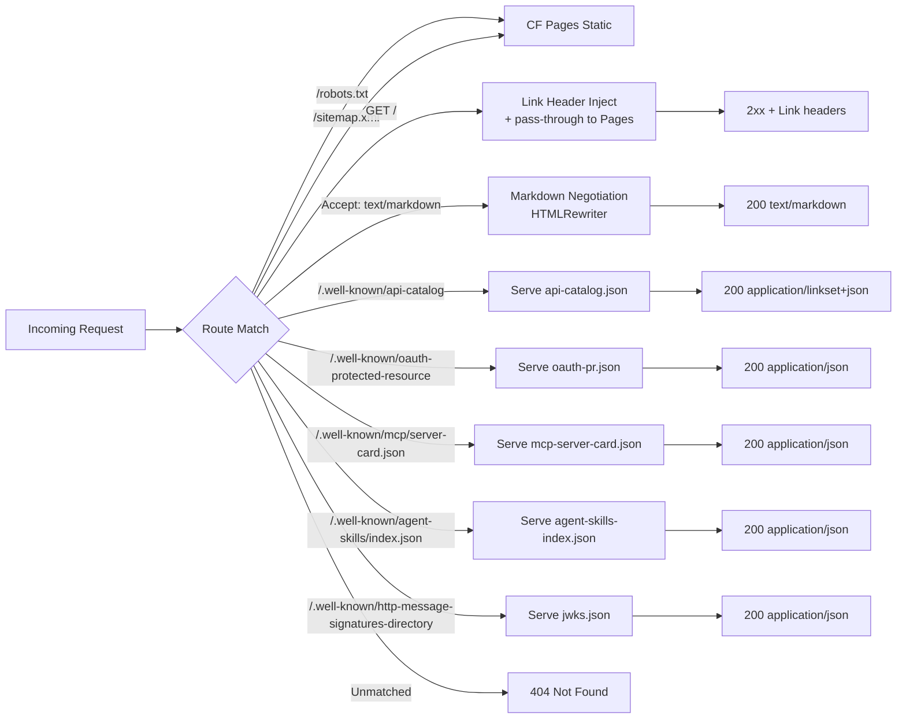
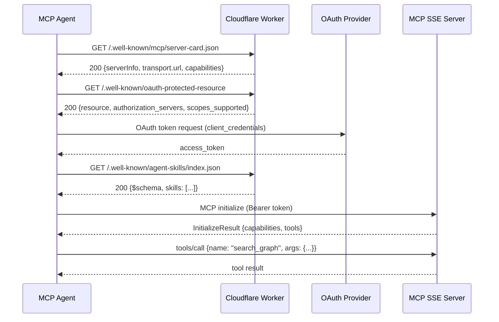

# Knowgrph Agent Ready — PRD + TAD (Proposed)

> **Scope**: Make the Knowgrph site (`airvio.co/knowgrph` / Cloudflare-hosted) fully compliant with
> emerging AI-agent discoverability and interoperability standards, as audited by
> [isitagentready.com](https://isitagentready.com).  
> **Constraints**: Solo-dev, TCO-zero, FOSS-first, Cloudflare-native stack, token-efficient
> implementation.

---

## Audit Baseline (isitagentready.com — 2026-05-21)

| Category | Item | Status |
|---|---|---|
| Discoverability | robots.txt | ❌ Not found |
| Discoverability | sitemap.xml | ❌ Not found |
| Discoverability | Link Headers (RFC 8288) | ❌ Not found |
| Content | Markdown Negotiation | ❌ Not supported |
| Bot Access Control | Web Bot Auth (JWKS) | ⚠️ HTML returned instead of JSON |
| Bot Access Control | AI Bot Rules in robots.txt | ❌ Blocked by missing robots.txt |
| Bot Access Control | Content Signals in robots.txt | ❌ Blocked by missing robots.txt |
| API / Auth / MCP | API Catalog (RFC 9727) | ⚠️ HTML returned instead of JSON |
| API / Auth / MCP | OAuth / OIDC Discovery | ❌ Not found |
| API / Auth / MCP | OAuth Protected Resource | ❌ Not found |
| API / Auth / MCP | MCP Server Card | ❌ Not found |
| API / Auth / MCP | Agent Skills Index | ⚠️ HTML returned instead of JSON |
| API / Auth / MCP | WebMCP | ⚠️ Could not check |
| Commerce (optional) | x402 Protocol | ℹ️ Not a commerce site |
| Commerce (optional) | MPP | ℹ️ Not a commerce site |
| Commerce (optional) | UCP | ℹ️ Not a commerce site |
| Commerce (optional) | ACP | ℹ️ Not a commerce site |

**Audit score: 0 / 13 active checks passing. 4 commerce checks deferred.**

---

# Part I — PRD

## Problem Statement

Knowgrph has zero AI-agent discoverability. AI crawlers (GPTBot, Claude-Web, Google-Extended),
autonomous agents using MCP, and any system relying on standard HTTP discovery protocols cannot
find, index, authenticate to, or tool-call Knowgrph's APIs. This blocks Knowgrph from being
surfaced in AI-native workflows, referenced by LLM assistants, or integrated by third-party
agent builders — all of which are increasingly the primary channels for developer and researcher
discovery in 2026.

**Pain point → Impact → Opportunity**:  
Agent crawlers visit Knowgrph → find no robots.txt, no .well-known structure, no MCP endpoint →
bounce without indexing → Knowgrph is invisible to AI-native search and agent pipelines.  
Opportunity: one focused Cloudflare Worker sprint delivers all critical endpoints, zero infra
cost, and positions Knowgrph as an agent-first knowledge platform.

---

## Personas

### P1 — AI Crawler / Indexing Agent
**Job-to-be-done**: Discover crawl policy, fetch sitemap, index content in markdown, respect
content usage signals.  
**Trigger**: Receives Knowgrph URL from a user query or link graph.  
**Frustration**: No robots.txt → treats site as uncrawlable or defaults to restrictive policy.

### P2 — Autonomous MCP Agent
**Job-to-be-done**: Discover MCP server card, authenticate via OAuth, enumerate skills, invoke
Knowgrph tools on behalf of a user.  
**Trigger**: User delegates "explore this knowledge graph" to an AI agent.  
**Frustration**: No /.well-known/mcp/server-card.json, no OAuth metadata → agent cannot
auto-configure integration.

### P3 — Developer / Agent Builder
**Job-to-be-done**: Integrate Knowgrph into an agentic pipeline using standard discovery
protocols (RFC 9727 API Catalog, Agent Skills).  
**Trigger**: Building a research or knowledge-graph assistant and wants Knowgrph as a data source.  
**Frustration**: No API catalog, no structured skill manifest → must reverse-engineer API from
docs or skip Knowgrph entirely.

### P4 — Solo Founder (Joohwee / airvio)
**Job-to-be-done**: Ship agent-readiness at zero additional infrastructure cost, maintain full
control, and ensure every standard served is FOSS-compatible and auditable.  
**Trigger**: isitagentready.com audit returns 0/13; AI-native platform positioning requires passing.  
**Frustration**: Each missing standard requires a separate file or endpoint; no unified Cloudflare
Worker template for the full .well-known stack exists.

---

## User Journeys

### Journey: AI Crawler — Discover & Index Knowgrph

| Stage | Action | Touchpoint | Pain Point | Opportunity |
|---|---|---|---|---|
| Trigger | Receives Knowgrph URL | External link / LLM context | None | — |
| Discover | Fetches `/robots.txt` | HTTP GET / | 404 → bounce | Publish robots.txt with AI crawler rules |
| Engage | Fetches `/sitemap.xml` | Sitemap reference in robots | Not linked → manual crawl | Reference sitemap from robots.txt |
| Engage | Requests content as Markdown | `Accept: text/markdown` | HTML returned → high token cost | Enable Markdown Negotiation |
| Complete | Indexes Knowgrph pages | Crawler index store | Pages not indexed | Clean markdown responses, low token overhead |
| Return | Re-crawls on schedule | Sitemap lastmod | Stale without lastmod | Auto-update sitemap on publish |

### Journey: MCP Agent — Discover & Integrate Knowgrph Tools

| Stage | Action | Touchpoint | Pain Point | Opportunity |
|---|---|---|---|---|
| Trigger | User delegates Knowgrph task | LLM agent orchestrator | None | — |
| Discover | Fetches `/.well-known/mcp/server-card.json` | HTTP GET | 404 → cannot auto-configure | Publish MCP Server Card |
| Discover | Fetches `/.well-known/oauth-protected-resource` | HTTP GET | 404 → no auth info | Publish OAuth Protected Resource metadata |
| Engage | Enumerates Agent Skills | `/.well-known/agent-skills/index.json` | 404 / HTML → no skills known | Publish Agent Skills index |
| Engage | Calls Knowgrph API with token | API endpoint | No API Catalog → agent guesses paths | Publish RFC 9727 API Catalog |
| Complete | Executes tool on behalf of user | MCP transport | N/A | Structured tool response |
| Return | Re-discovers on version bump | Server card version field | Version undetectable | Increment server card version on change |

---

## Epics & User Stories

### E1 — Discoverability

**E1-S1: robots.txt**  
**As a** AI crawler (P1) **I want** a standards-compliant `/robots.txt` with explicit per-agent
rules **So that** I can determine crawl policy without defaulting to block.

**Acceptance Criteria**:
- **Given** any HTTP client, **When** `GET /robots.txt` is requested, **Then** a `200 text/plain`
  response is returned within 300 ms with `User-agent` directives for `*`, `GPTBot`, `Claude-Web`,
  `Google-Extended`, `OAI-SearchBot`, and a `Sitemap:` reference.
- **Given** the robots.txt is served, **When** it is parsed by an RFC 9309-compliant parser,
  **Then** no syntax errors are reported.

> **`/goal` translation**: `curl -s https://airvio.co/knowgrph/robots.txt returns HTTP 200 text/plain
> with lines matching User-agent, Allow/Disallow, and Sitemap; wrangler deploy exits 0 and no
> other Worker route is modified`

**MoSCoW**: Must  
**Dependencies**: Cloudflare Pages or Worker route for `/robots.txt`  
**Out of Scope**: Dynamic per-user crawl policies

---

**E1-S2: sitemap.xml**  
**As a** AI crawler (P1) **I want** a valid `/sitemap.xml` **So that** I can enumerate all
canonical Knowgrph URLs without brute-force crawling.

**Acceptance Criteria**:
- **Given** a request `GET /sitemap.xml`, **When** served, **Then** returns `200
  application/xml` with `<urlset>` containing at minimum the homepage and all published node
  pages, each with `<loc>` and `<lastmod>`.
- **Given** robots.txt is published, **When** parsed, **Then** contains `Sitemap:
  https://airvio.co/knowgrph/sitemap.xml`.

> **`/goal` translation**: `curl -s https://airvio.co/knowgrph/sitemap.xml returns HTTP 200 XML with
> at least one <url> element containing <loc> and <lastmod>; robots.txt Sitemap: line present`

**MoSCoW**: Must  
**Dependencies**: E1-S1, site page inventory  
**Out of Scope**: Sitemap index files (multi-sitemap), image/video sitemaps

---

**E1-S3: Link Headers (RFC 8288)**  
**As a** MCP agent or API client (P2, P3) **I want** `Link` response headers on the homepage
**So that** I can auto-discover the API catalog, MCP endpoint, and documentation without
scraping.

**Acceptance Criteria**:
- **Given** `GET /`, **When** response headers are inspected, **Then** `Link` headers include
  `rel="api-catalog"` pointing to `/.well-known/api-catalog` and `rel="service-doc"` pointing
  to docs.

> **`/goal` translation**: `curl -I https://airvio.co/knowgrph/ output contains Link: header with
> rel=api-catalog and rel=service-doc`

**MoSCoW**: Should  
**Dependencies**: E4-S1 (API Catalog must exist before linking to it)  
**Out of Scope**: Link headers on all pages (homepage only, phase 1)

---

### E2 — Content Negotiation

**E2-S1: Markdown for Agents**  
**As a** AI crawler or agent (P1, P2) **I want** Knowgrph pages to return Markdown when I send
`Accept: text/markdown` **So that** I receive compact, token-efficient content without HTML
parsing overhead.

**Acceptance Criteria**:
- **Given** `GET /` with header `Accept: text/markdown`, **When** served, **Then** returns
  `200 text/markdown` body with valid CommonMark Markdown and optionally
  `x-markdown-tokens: N` header.
- **Given** `GET /` with no special Accept header, **When** served, **Then** returns standard
  HTML (no regression).

> **`/goal` translation**: `curl -H "Accept: text/markdown" https://airvio.co/knowgrph/ returns
> Content-Type: text/markdown and body begins with a Markdown heading; HTML request returns
> text/html with no change`

**MoSCoW**: Must  
**Dependencies**: Cloudflare Pages Markdown for Agents feature (zero-cost, platform toggle)  
**Out of Scope**: Per-page custom Markdown rendering (use CF platform feature)

---

### E3 — Bot Access Control

**E3-S1: AI Bot Rules in robots.txt**  
**As a** AI crawler (P1) **I want** explicit `User-agent` entries for AI bots with clear
allow/disallow **So that** I know exactly which paths I may index.

**Acceptance Criteria**:
- **Given** robots.txt, **When** parsed, **Then** contains named entries for `GPTBot`,
  `Claude-Web`, `Google-Extended`, `OAI-SearchBot` each with at least one
  `Allow` or `Disallow` directive.

> **`/goal` translation**: `grep -E "^User-agent: (GPTBot|Claude-Web|Google-Extended|OAI-SearchBot)"
> output of curl /robots.txt returns 4 matches`

**MoSCoW**: Must (bundled with E1-S1 — same file)  
**Dependencies**: E1-S1  
**Out of Scope**: Automated per-bot policy management UI

---

**E3-S2: Content Signals**  
**As a** AI training pipeline operator **I want** `Content-Signal` directives in robots.txt
**So that** I respect Knowgrph's explicit preferences on training and search use.

**Acceptance Criteria**:
- **Given** robots.txt, **When** parsed by a Content Signals-aware consumer, **Then** at least
  `Content-Signal: ai-train=no, search=yes, ai-input=yes` is present.

> **`/goal` translation**: `grep "Content-Signal:" output of curl /robots.txt returns one line
> with ai-train, search, and ai-input values`

**MoSCoW**: Should  
**Dependencies**: E1-S1  
**Out of Scope**: Granular per-path content signals (global policy only, phase 1)

---

**E3-S3: Web Bot Auth (JWKS)**  
**As a** receiving site **I want** Knowgrph to publish a JWKS at
`/.well-known/http-message-signatures-directory` **So that** when Knowgrph's crawler/agent
makes outbound requests, the receiving site can verify the signature.

**Acceptance Criteria**:
- **Given** `GET /.well-known/http-message-signatures-directory`, **When** requested, **Then**
  returns `200 application/json` with a valid JWKS structure (`{"keys": [...]}`).

> **`/goal` translation**: `curl /.well-known/http-message-signatures-directory returns HTTP 200
> Content-Type application/json and body contains "keys" array`

**MoSCoW**: Could (informational — Knowgrph is primarily a server, not a bot)  
**Dependencies**: JWKS key generation (one-time)  
**Out of Scope**: Request-signing middleware for outbound Knowgrph agent calls (phase 2)

---

### E4 — API, Auth, MCP & Skill Discovery

**E4-S1: API Catalog (RFC 9727)**  
**As a** developer / agent builder (P3) **I want** `/.well-known/api-catalog` returning
RFC 9727-compliant JSON **So that** I can auto-discover Knowgrph's API endpoints, specs,
and status page without reading docs.

**Acceptance Criteria**:
- **Given** `GET /.well-known/api-catalog`, **When** requested, **Then** returns
  `200 application/linkset+json` with a `linkset` array; each entry has `anchor`, and link
  relations for `service-desc` (OpenAPI spec URL) and `service-doc` (docs URL).
- **Given** `service-desc` URL, **When** fetched, **Then** returns a valid OpenAPI 3.x document.

> **`/goal` translation**: `curl /.well-known/api-catalog returns HTTP 200 application/linkset+json
> with linkset[0].anchor present and service-desc URL reachable returning 200`

**MoSCoW**: Should  
**Dependencies**: OpenAPI spec for Knowgrph API (may be stub v0.1)  
**Out of Scope**: Auto-generated API catalog from code (manual JSON, phase 1)

---

**E4-S2: OAuth Protected Resource (RFC 9728)**  
**As a** MCP agent (P2) **I want** `/.well-known/oauth-protected-resource` **So that** I can
discover which OAuth/OIDC servers issue valid tokens for Knowgrph APIs.

**Acceptance Criteria**:
- **Given** `GET /.well-known/oauth-protected-resource`, **When** requested, **Then** returns
  `200 application/json` with `resource`, `authorization_servers`, and `scopes_supported` fields.

> **`/goal` translation**: `curl /.well-known/oauth-protected-resource returns HTTP 200 JSON
> with keys resource, authorization_servers (non-empty array), and scopes_supported`

**MoSCoW**: Should  
**Dependencies**: OAuth/OIDC provider decision (Cloudflare Access or external IdP)  
**Out of Scope**: Full OAuth server implementation (reference metadata only, phase 1)

---

**E4-S3: MCP Server Card**  
**As a** MCP agent (P2) **I want** `/.well-known/mcp/server-card.json` **So that** I can
auto-configure a connection to Knowgrph's MCP server without manual setup.

**Acceptance Criteria**:
- **Given** `GET /.well-known/mcp/server-card.json`, **When** requested, **Then** returns
  `200 application/json` with `serverInfo` (name, version), `transport` endpoint URL, and
  `capabilities` listing available tools.
- **Given** the transport endpoint is reachable, **When** an MCP `initialize` request is sent,
  **Then** a valid `InitializeResult` is returned.

> **`/goal` translation**: `curl /.well-known/mcp/server-card.json returns HTTP 200 JSON with
> serverInfo.name, serverInfo.version, and transport fields present`

**MoSCoW**: Should  
**Dependencies**: Knowgrph MCP server implementation (may be stub SSE endpoint, phase 1)  
**Out of Scope**: Full tool implementation in MCP server (phase 2); browser-side WebMCP

---

**E4-S4: Agent Skills Index**  
**As a** agent builder (P3) **I want** `/.well-known/agent-skills/index.json` **So that** I
can enumerate all Knowgrph agent skills with their schemas and digests without manual discovery.

**Acceptance Criteria**:
- **Given** `GET /.well-known/agent-skills/index.json`, **When** requested, **Then** returns
  `200 application/json` with `$schema`, and a `skills` array where each entry has `name`,
  `type`, `description`, `url`, and `sha256`.
- **Given** each skill `url`, **When** fetched, **Then** returns the corresponding SKILL.md
  or JSON schema.

> **`/goal` translation**: `curl /.well-known/agent-skills/index.json returns HTTP 200 JSON
> with skills array length >= 1 and each item has name, type, url, sha256 fields`

**MoSCoW**: Should  
**Dependencies**: At least one Agent Skill defined for Knowgrph  
**Out of Scope**: Automated skill digest computation on deploy (manual SHA-256, phase 1)

---

**E4-S5: WebMCP**  
**As a** browser-based AI agent (P2) **I want** Knowgrph to expose tools via `navigator.modelContext`
**So that** in-browser agents can discover and invoke Knowgrph actions without a separate API call.

**Acceptance Criteria**:
- **Given** a browser loading Knowgrph with WebMCP support, **When** `navigator.modelContext` is
  checked, **Then** at least one tool is registered with `name`, `description`, `inputSchema`,
  and `execute`.

> **`/goal` translation**: `window.navigator.modelContext.tools array length >= 1 when evaluated
> in browser console on airvio.co/knowgrph; no console errors thrown`

**MoSCoW**: Could  
**Dependencies**: Chrome WebMCP API support (currently EPP); E4-S3 preferred first  
**Out of Scope**: Firefox/Safari WebMCP (Chromium only, phase 1)

---

### E5 — Commerce (Deferred)

**E5: x402 / MPP / UCP / ACP**  
**Won't** implement in this release. Knowgrph is not a commerce site. Commerce protocols
(x402, MPP, UCP, ACP) provide no user value at current product stage.  
**Revisit condition**: When Knowgrph introduces paid API tiers or knowledge subscriptions.

---

## Success Metrics

| Metric | Baseline | Target | Timeline |
|---|---|---|---|
| isitagentready.com score | 0 / 13 | 11 / 13 (E5 deferred, E3-S3 Could) | Sprint 1 (2 weeks) |
| robots.txt HTTP 200 | ❌ | ✅ | Week 1 |
| sitemap.xml HTTP 200 | ❌ | ✅ | Week 1 |
| Markdown negotiation pass | ❌ | ✅ | Week 1 |
| MCP Server Card HTTP 200 | ❌ | ✅ | Week 2 |
| Agent Skills index HTTP 200 | ❌ | ✅ | Week 2 |
| API Catalog HTTP 200 | ❌ | ✅ | Week 2 |
| Cloudflare Worker deploy cost | $0 (free tier) | $0 | Ongoing |
| Token cost per agent page fetch | ~4–8k HTML tokens | ~800–1.5k Markdown tokens | Week 1 |

---

## Scope Boundaries

**In scope**: All 13 active audit checks from isitagentready.com; Cloudflare-native delivery only.  
**Out of scope**: Commerce protocols (E5); non-Cloudflare infrastructure; OAuth server
implementation; full MCP tool suite; sitemap image/video extensions; per-page content signals.

---

## Open Questions

| # | Question | Owner | Resolution |
|---|---|---|---|
| OQ-1 | Which OAuth/OIDC provider will Knowgrph use? (Cloudflare Access vs external IdP) | Joohwee | Decide before E4-S2 |
| OQ-2 | Does Knowgrph have an active MCP server endpoint, or is phase 1 a stub SSE? | Joohwee | Stub acceptable for Server Card; real SSE for E4-S3 full pass |
| OQ-3 | Will sitemap be statically generated at build time or dynamically from KGC node store? | Joohwee | Static for phase 1; dynamic Cloudflare Worker for phase 2 |
| OQ-4 | Content Signals policy: allow `ai-input=yes`? | Joohwee | Default yes (benefits Knowgrph's positioning); confirm before E3-S2 |
| OQ-5 | WebMCP (E4-S5): Chrome EPP required — is Knowgrph targeting EPP users? | Joohwee | Defer to phase 2 unless EPP audience confirmed |

---

# Part II — TAD

## Architecture Overview

**From agent HTTP request to structured discovery response**:  
Cloudflare Edge → Worker (well-known router) → static JSON / dynamic response → agent.

All endpoints are served from a single Cloudflare Worker (`knowgrph-agent-worker`) with
route-based dispatch. Static seed files (robots.txt, sitemap.xml, JSON manifests) are committed
to the repository and served via Cloudflare Pages with Worker augmentation for dynamic headers
and markdown negotiation.

**TCO**: Cloudflare Workers free tier (100k requests/day), Pages free tier (500 builds/month),
R2 zero egress. Total additional monthly cost: **$0**.

---

## Journey → System Mapping

| Journey Stage | Workflow | Data Flow | Component |
|---|---|---|---|
| AI Crawler Discover | Crawl Policy Resolution | robots.txt Serve | TAD-CF-STATIC |
| AI Crawler Engage | Content Fetch | Markdown Negotiation | TAD-CF-PAGES |
| MCP Agent Discover | MCP Config Resolution | Server Card Serve | TAD-CF-WORKER |
| MCP Agent Discover | Auth Discovery | OAuth Metadata Serve | TAD-CF-WORKER |
| MCP Agent Engage | Skill Enumeration | Agent Skills Index Serve | TAD-CF-WORKER |
| Dev / Agent Builder | API Discovery | API Catalog Serve | TAD-CF-WORKER |
| Homepage Request | Link Header Injection | HTTP Header Augmentation | TAD-CF-WORKER |

---

## Component Specifications

### TAD-CF-STATIC
**Responsibility**: Serves static files (`/robots.txt`, `/sitemap.xml`) from Cloudflare Pages
`/public` directory as committed assets.  
**Interfaces**: `GET /robots.txt → 200 text/plain`, `GET /sitemap.xml → 200 application/xml`  
**Dependencies**: Cloudflare Pages (free tier), Git-committed static files  
**Configuration**: Files committed to `/public/robots.txt` and `/public/sitemap.xml`; updated
manually or via CI on content change.  
**`/goal` Conditions**:  
- `curl -s -o /dev/null -w "%{http_code}" https://airvio.co/knowgrph/robots.txt returns 200`  
- `grep -c "User-agent:" output of /robots.txt >= 5` (wildcard + 4 AI bots)  
- `grep "Sitemap:" /robots.txt returns one match pointing to /sitemap.xml`  
**Traces**: PRD-E1-S1, PRD-E1-S2, PRD-E3-S1, PRD-E3-S2

---

### TAD-CF-PAGES
**Responsibility**: Serves Knowgrph page content with content-negotiation: returns `text/markdown`
when `Accept: text/markdown` is present in request; returns `text/html` otherwise.  
**Interfaces**: `GET /[path]` with `Accept: text/markdown` → `200 text/markdown`;
`GET /[path]` default → `200 text/html`  
**Dependencies**: Cloudflare Pages Markdown for Agents feature (platform toggle, zero additional
cost); Cloudflare Worker intercept for Accept header routing.  
**Configuration**: Cloudflare Pages project setting: `markdown_for_agents = true` (or Worker
intercept pattern matching `Accept: text/markdown`).  
**`/goal` Conditions**:  
- `curl -H "Accept: text/markdown" https://airvio.co/knowgrph/ returns Content-Type: text/markdown`  
- `curl https://airvio.co/knowgrph/ returns Content-Type: text/html with no regression`  
**Traces**: PRD-E2-S1

---

### TAD-CF-WORKER
**Responsibility**: Serves all dynamic `.well-known/*` endpoints and injects `Link` headers on
homepage responses from a single Cloudflare Worker with route-based dispatch.  
**Interfaces**:

| Route | Response Type | RFC / Spec |
|---|---|---|
| `GET /.well-known/api-catalog` | `application/linkset+json` | RFC 9727 |
| `GET /.well-known/oauth-protected-resource` | `application/json` | RFC 9728 |
| `GET /.well-known/mcp/server-card.json` | `application/json` | SEP-1649 |
| `GET /.well-known/agent-skills/index.json` | `application/json` | Agent Skills Discovery v0.2.0 |
| `GET /.well-known/http-message-signatures-directory` | `application/json` | Web Bot Auth |
| `GET /` (passthrough + header inject) | Link headers added | RFC 8288 |

**Dependencies**: Cloudflare Workers (free tier); JSON manifests committed to `worker/data/`;
Wrangler CLI for deploy.  
**Configuration**: `wrangler.toml` with route patterns; JSON seed files externalized from
Worker code for zero-recompile updates.  
**`/goal` Conditions**:  
- `wrangler deploy exits 0 with no type errors`  
- `curl /.well-known/api-catalog returns HTTP 200 Content-Type application/linkset+json`  
- `curl /.well-known/mcp/server-card.json returns HTTP 200 JSON with serverInfo.name`  
- `curl /.well-known/agent-skills/index.json returns HTTP 200 JSON with skills array`  
- `curl -I https://airvio.co/knowgrph/ output contains Link: header with rel=api-catalog`  
**Traces**: PRD-E1-S3, PRD-E4-S1, PRD-E4-S2, PRD-E4-S3, PRD-E4-S4, PRD-E3-S3

---

### TAD-CF-BOTAUTH
**Responsibility**: Publishes a JWKS (JSON Web Key Set) at
`/.well-known/http-message-signatures-directory` to allow receiving sites to verify signed
outbound requests made by Knowgrph agents.  
**Interfaces**: `GET /.well-known/http-message-signatures-directory → 200 application/json`
with `{"keys": [<JWK>]}`  
**Dependencies**: TAD-CF-WORKER (serves endpoint); one-time key generation via `node:crypto`
or `openssl`; JWK committed to `worker/data/jwks.json`.  
**Configuration**: JWK stored as Worker environment secret or committed JSON (public key only).  
**`/goal` Conditions**:  
- `curl /.well-known/http-message-signatures-directory returns HTTP 200 JSON with keys array
  length >= 1`  
**Traces**: PRD-E3-S3

---

### TAD-CF-WEBMCP (Phase 2)
**Responsibility**: Injects WebMCP tool definitions into Knowgrph page via `<script>` calling
`navigator.modelContext.provideContext()` with at least one tool (e.g., `search_graph`,
`get_node`).  
**Interfaces**: Browser JS API — `navigator.modelContext.tools` after page load  
**Dependencies**: Chrome WebMCP EPP; TAD-CF-PAGES (page serves the script); TAD-CF-WORKER
(provides tool schema endpoint)  
**Configuration**: Tool definitions in `public/js/webmcp-init.js`; feature-flagged behind
`navigator.modelContext` existence check.  
**`/goal` Conditions**:  
- `window.navigator.modelContext && window.navigator.modelContext.tools.length >= 1 evaluated
  in Chrome DevTools console on airvio.co/knowgrph`  
**Traces**: PRD-E4-S5

---

## Workflows

### Workflow: Agent Crawl Policy Resolution

**Trigger**: AI crawler sends `GET /robots.txt`  
**Actors**: AI Crawler (P1), Cloudflare Pages (TAD-CF-STATIC)

**Happy Path**:
1. Crawler sends `GET https://airvio.co/knowgrph/robots.txt`
2. Cloudflare Pages serves `/public/robots.txt` → `200 text/plain`
3. Crawler parses User-agent directives, follows allow/disallow rules and Sitemap reference

**Alternate Paths**:
- `Accept: text/markdown` on robots.txt: ignored; returns plain text regardless

**Error Paths**:
- Cloudflare Pages outage: CF serves from edge cache → no downtime
- Malformed robots.txt syntax: RFC 9309 parser skips unknown directives silently → no
  hard failure; fix in next commit

**Postconditions**: Crawler has a valid crawl policy; sitemap URL known; AI bot rules applied.

---

### Workflow: MCP Agent Discovery

**Trigger**: MCP orchestrator attempts Knowgrph integration

**Actors**: MCP Agent (P2), Cloudflare Worker (TAD-CF-WORKER)

**Happy Path**:
1. Agent fetches `/.well-known/mcp/server-card.json` → `200 application/json`
2. Agent reads `transport.url`, connects to MCP SSE endpoint
3. Agent fetches `/.well-known/oauth-protected-resource` → reads `authorization_servers`
4. Agent obtains token from listed IdP → calls Knowgrph API with Bearer token
5. Agent fetches `/.well-known/agent-skills/index.json` → enumerates available skills

**Alternate Paths**:
- MCP SSE endpoint unavailable: agent reports connection failure; server card is still served
  (discovery succeeds, connection fails gracefully)
- No token scope match: API returns `403`; agent surfaces error to user

**Error Paths**:
- Worker cold start latency > 50 ms on first request: Cloudflare edge caching of static JSON
  responses mitigates; `Cache-Control: public, max-age=3600` applied

**Postconditions**: Agent has transport URL, auth config, and skill manifest; can proceed to
tool invocation or surface error to user.

---

### Workflow: Markdown Content Negotiation

**Trigger**: AI agent or crawler requests a Knowgrph page with `Accept: text/markdown`

**Actors**: AI Crawler (P1), Cloudflare Pages + Worker (TAD-CF-PAGES)

**Happy Path**:
1. Agent sends `GET /` with `Accept: text/markdown`
2. Cloudflare Worker intercepts; detects `text/markdown` in Accept header
3. Worker fetches page content, strips HTML, converts to CommonMark Markdown
4. Returns `200 text/markdown` with optional `x-markdown-tokens: N` header
5. Agent parses Markdown — ~80% fewer tokens vs raw HTML

**Alternate Paths**:
- Browser sends `Accept: text/html, */*`: Worker passes through; Cloudflare Pages serves HTML

**Error Paths**:
- Markdown conversion fails: Worker falls back to HTML response with `Content-Type: text/html`;
  logs error to Cloudflare Workers log

**Postconditions**: Agent has compact Markdown content; token cost significantly reduced.

---

## Data Flows

### Data Flow: .well-known Endpoint Serve

| Stage | Component | Input Format | Output Format | Persistence | Error Handling |
|---|---|---|---|---|---|
| Ingest | Cloudflare Worker route match | HTTP GET request | Route + params | None | 404 on unmatched route |
| Transform | Worker dispatch | Route string | JSON file read from `worker/data/` | None | 500 + log on read error |
| Store | Git repo / Worker KV (optional) | JSON files | JSON | Git-committed seed files | Immutable; update via commit |
| Serve | Cloudflare Edge | JSON in-memory | HTTP response | Edge cache 1h | Cache-Control fallback |

### Data Flow: robots.txt Serve

| Stage | Component | Input Format | Output Format | Persistence | Error Handling |
|---|---|---|---|---|---|
| Ingest | Cloudflare Pages CDN | HTTP GET `/robots.txt` | Static file request | None | CF 404 page |
| Store | CF Pages `/public/` | Plain text file | Plain text | Git-committed | Redeploy on change |
| Serve | CF Pages CDN | Static bytes | `200 text/plain` | CF edge cache | Serve from nearest PoP |

---

## Architectural Decisions

### ADR-1: Single Worker for All .well-known Endpoints
**Status**: Proposed  
**Date**: 2026-05-21

**Context**: 8+ distinct `.well-known` endpoints required; each could be a separate Worker, a
Pages Function, or a committed static file.

**Decision**: One Cloudflare Worker (`knowgrph-agent-worker`) with route-based dispatch,
reading JSON seed files from `worker/data/`. Static files (robots.txt, sitemap.xml) served
via Pages `/public/` (no Worker needed for pure-static paths).

**Alternatives Considered**:
1. One Worker per endpoint: pros — isolation; cons — 8+ wrangler configs, maintenance overhead
2. All as Pages static files: pros — zero code; cons — cannot inject Link headers dynamically,
   cannot serve `application/linkset+json` with proper Content-Type routing

**Rationale**: Single Worker minimizes deployment surface, fits free tier, and allows dynamic
header injection (Link headers, Cache-Control) that static Pages cannot provide.

**Consequences**:
- Positive: One deploy command (`wrangler deploy`) updates all endpoints; free tier sufficient
- Negative: Worker code must be maintained alongside JSON seed files
- Neutral: Cold-start latency mitigated by edge caching; negligible for discovery endpoints

---

### ADR-2: JSON Seed Files Externalized from Worker Code
**Status**: Proposed  
**Date**: 2026-05-21

**Context**: MCP Server Card, API Catalog, Agent Skills index change more frequently than
Worker routing logic.

**Decision**: JSON payloads committed as files in `worker/data/` and imported at Worker
build time. For high-frequency updates, migrate to Cloudflare KV (still free tier up to
1k writes/day).

**Alternatives Considered**:
1. Inline JSON in Worker code: pros — one file; cons — requires recompile for every content update
2. Cloudflare KV from day 1: pros — runtime updateable; cons — adds KV write step to content
   update workflow; overkill for phase 1

**Rationale**: Git-committed JSON is zero-cost, auditable, and sufficient for infrequent
discovery metadata updates. KV migration path is clear if update frequency increases.

**Consequences**:
- Positive: Content updates are PRs, not code deploys; zero KV cost phase 1
- Negative: Content and code share the same deploy cycle
- Neutral: KV migration is a 1-day effort when needed

---

### ADR-3: Markdown Negotiation via Cloudflare Platform Feature
**Status**: Proposed  
**Date**: 2026-05-21

**Context**: Markdown for Agents requires detecting `Accept: text/markdown` and returning
converted content. Options: Cloudflare platform toggle vs custom Worker HTML-to-Markdown
conversion.

**Decision**: Use Cloudflare Pages "Markdown for Agents" platform feature if available as a
project setting; otherwise implement lightweight Worker intercept using `@cloudflare/html-rewriter`
+ a minimal Markdown serializer (FOSS, no npm deps beyond CF SDK).

**Alternatives Considered**:
1. Server-side Pandoc/unified.js: pros — rich conversion; cons — not edge-compatible, adds
   dependency, increases Worker bundle size
2. Return raw HTML with `Content-Type: text/markdown`: violates spec; breaks agent parsers

**Rationale**: Platform toggle is zero-code, zero-cost. Worker fallback is ~50 lines using
CF HTMLRewriter API, no external deps.

**Consequences**:
- Positive: Zero marginal cost; platform handles Accept header parsing
- Negative: Platform feature availability uncertain; Worker fallback needed as backup
- Neutral: Token reduction benefit accrues immediately for all agent consumers

---

### ADR-4: robots.txt AI Bot Policy — Allow All, No Training
**Status**: Proposed  
**Date**: 2026-05-21

**Context**: Knowgrph benefits from AI crawler indexing (P1 persona) but does not consent to
training data use.

**Decision**: `Allow: /` for all named AI bots (GPTBot, Claude-Web, Google-Extended,
OAI-SearchBot) with `Content-Signal: ai-train=no, search=yes, ai-input=yes`.

**Rationale**: Knowgrph's positioning benefits from AI search indexing and agent-input use;
training consent is withheld by default pending commercial arrangements.

**Consequences**:
- Positive: Maximum discoverability; explicit training opt-out protects IP
- Negative: No enforcement mechanism; signals are advisory only
- Neutral: Policy can be updated per-bot as commercial context evolves

---

## Quality Attributes

| Attribute | Scenario | Pattern | Validation |
|---|---|---|---|
| Performance | 1000 simultaneous agent crawls → all .well-known endpoints < 50 ms P99 | Cloudflare edge caching (`Cache-Control: max-age=3600`) | CF Workers Analytics → P99 latency |
| Scalability | Knowgrph indexed by 10+ major AI crawlers simultaneously | Cloudflare global CDN, stateless Worker | CF dashboard request volume check |
| Security | Malicious agent attempts path traversal on Worker routes | Route allowlist in Worker; no filesystem access | Security audit: fuzz unregistered routes → all return 404 |
| Observability | Deploy fails silently → endpoints return 404 | `wrangler tail` log streaming; CF Workers Analytics | Post-deploy smoke test: `curl` all 7 endpoints, assert 200 |
| Token Efficiency | Agent fetches Knowgrph page → consumes minimum LLM tokens | Markdown negotiation reduces payload ~80% | Compare token count: HTML vs Markdown response on homepage |

---

## Deployment Strategy

**Approach**: Rolling deploy via Wrangler CLI. No blue-green needed (stateless Worker, no
DB migration risk). Rollback: `wrangler rollback` restores previous deployment within 30 s.

**Deploy sequence**:
1. Commit JSON seed files and Worker code to `main`
2. CI runs `wrangler deploy` (GitHub Actions, free tier)
3. Post-deploy smoke test script curls all 7 `.well-known` endpoints and `/robots.txt`
4. isitagentready.com re-scan confirms score improvement
5. Tag release `v1.0.0` in Git

**Rollback plan**: `wrangler rollback` → previous Worker version served from CF edge within
one propagation cycle (~30 s globally).

---

## Architecture Diagrams

### System Topology

```mermaid
flowchart TB
    subgraph Agents
        A1[AI Crawler\nGPTBot / Claude-Web]
        A2[MCP Agent\nOrchestrator]
        A3[Developer\nAgent Builder]
        A4[Browser Agent\nWebMCP]
    end

    subgraph Cloudflare Edge
        CF_CDN[Cloudflare CDN\nPages]
        CF_W[knowgrph-agent-worker\nWorker]
    end

    subgraph Static Assets
        ST_ROBOTS[/public/robots.txt]
        ST_SITEMAP[/public/sitemap.xml]
        ST_OPENAPI[/public/openapi.json]
    end

    subgraph Worker Data
        D_APICAT[worker/data/api-catalog.json]
        D_OAUTH[worker/data/oauth-protected-resource.json]
        D_MCP[worker/data/mcp-server-card.json]
        D_SKILLS[worker/data/agent-skills-index.json]
        D_JWKS[worker/data/jwks.json]
    end

    subgraph External
        EXT_IDP[OAuth / OIDC Provider\nCloudflare Access]
        EXT_MCP[Knowgrph MCP SSE\nEndpoint]
    end

    A1 -->|GET /robots.txt| CF_CDN
    A1 -->|GET /sitemap.xml| CF_CDN
    A1 -->|Accept: text/markdown| CF_W
    A2 -->|GET /.well-known/mcp/*| CF_W
    A2 -->|GET /.well-known/oauth-*| CF_W
    A2 -->|Token → MCP SSE| EXT_MCP
    A3 -->|GET /.well-known/api-catalog| CF_W
    A3 -->|GET /.well-known/agent-skills/*| CF_W
    A4 -->|navigator.modelContext| CF_CDN

    CF_CDN --> ST_ROBOTS
    CF_CDN --> ST_SITEMAP
    CF_CDN --> ST_OPENAPI
    CF_W --> D_APICAT
    CF_W --> D_OAUTH
    CF_W --> D_MCP
    CF_W --> D_SKILLS
    CF_W --> D_JWKS
    CF_W -->|Link header inject on GET /| CF_CDN

    D_OAUTH -.->|references| EXT_IDP
    D_MCP -.->|transport URL| EXT_MCP
```

### Worker Route Dispatch Flow



### MCP Agent Discovery Sequence



---

## Component Inventory

| Layer | Component | File / Module | Status |
|---|---|---|---|
| Static | robots.txt | `public/robots.txt` | 🔲 To build |
| Static | sitemap.xml | `public/sitemap.xml` | 🔲 To build |
| Static | OpenAPI spec (stub) | `public/openapi.json` | 🔲 To build |
| Worker | Route dispatcher | `worker/src/index.ts` | 🔲 To build |
| Worker | Markdown negotiation | `worker/src/markdown.ts` | 🔲 To build |
| Worker | Link header injector | `worker/src/link-headers.ts` | 🔲 To build |
| Worker Data | API Catalog | `worker/data/api-catalog.json` | 🔲 To build |
| Worker Data | OAuth Protected Resource | `worker/data/oauth-protected-resource.json` | 🔲 To build |
| Worker Data | MCP Server Card | `worker/data/mcp-server-card.json` | 🔲 To build |
| Worker Data | Agent Skills Index | `worker/data/agent-skills-index.json` | 🔲 To build |
| Worker Data | JWKS | `worker/data/jwks.json` | 🔲 To build |
| CI | Deploy workflow | `.github/workflows/deploy.yml` | 🔲 To build |
| CI | Smoke test | `.github/workflows/smoke-test.sh` | 🔲 To build |
| Phase 2 | WebMCP init script | `public/js/webmcp-init.js` | ⏳ Deferred |

---

## PRD ↔ TAD Traceability

| PRD Story | TAD Component | Interface | `/goal` Condition |
|---|---|---|---|
| PRD-E1-S1 | TAD-CF-STATIC | `GET /robots.txt` | `curl /robots.txt returns 200 text/plain with User-agent lines` |
| PRD-E1-S2 | TAD-CF-STATIC | `GET /sitemap.xml` | `curl /sitemap.xml returns 200 XML with <url> elements` |
| PRD-E1-S3 | TAD-CF-WORKER | `GET / → Link headers` | `curl -I / contains Link: rel=api-catalog` |
| PRD-E2-S1 | TAD-CF-PAGES | `Accept: text/markdown` | `curl -H "Accept: text/markdown" / returns Content-Type: text/markdown` |
| PRD-E3-S1 | TAD-CF-STATIC | `GET /robots.txt` | `grep User-agent: /robots.txt has 4 AI bot entries` |
| PRD-E3-S2 | TAD-CF-STATIC | `GET /robots.txt` | `grep Content-Signal: /robots.txt returns 1 match` |
| PRD-E3-S3 | TAD-CF-BOTAUTH | `GET /.well-known/http-message-signatures-directory` | `curl returns 200 JSON with keys array` |
| PRD-E4-S1 | TAD-CF-WORKER | `GET /.well-known/api-catalog` | `curl returns 200 application/linkset+json with linkset[0].anchor` |
| PRD-E4-S2 | TAD-CF-WORKER | `GET /.well-known/oauth-protected-resource` | `curl returns 200 JSON with authorization_servers` |
| PRD-E4-S3 | TAD-CF-WORKER | `GET /.well-known/mcp/server-card.json` | `curl returns 200 JSON with serverInfo.name and transport` |
| PRD-E4-S4 | TAD-CF-WORKER | `GET /.well-known/agent-skills/index.json` | `curl returns 200 JSON with skills[].name present` |
| PRD-E4-S5 | TAD-CF-WEBMCP | Browser `navigator.modelContext` | `navigator.modelContext.tools.length >= 1 in Chrome console` |

---

## JSON Contract Schemas (Seed File Reference)

### `worker/data/mcp-server-card.json` (stub)
```json
{
  "serverInfo": {
    "name": "knowgrph-mcp",
    "version": "0.1.0"
  },
  "transport": {
    "type": "sse",
    "url": "https://airvio.co/knowgrph/mcp/sse"
  },
  "capabilities": {
    "tools": true,
    "resources": false,
    "prompts": false
  }
}
```

### `worker/data/agent-skills-index.json` (stub)
```json
{
  "$schema": "https://agentskills.io/schema/v0.2.0/index.json",
  "skills": [
    {
      "name": "search-graph",
      "type": "mcp-tool",
      "description": "Search Knowgrph knowledge graph nodes by query string",
      "url": "https://airvio.co/knowgrph/.well-known/agent-skills/search-graph/SKILL.md",
      "sha256": "<computed-on-publish>"
    }
  ]
}
```

### `worker/data/api-catalog.json` (stub)
```json
{
  "linkset": [
    {
      "anchor": "https://airvio.co/knowgrph/api",
      "service-desc": [{"href": "https://airvio.co/knowgrph/openapi.json", "type": "application/json"}],
      "service-doc": [{"href": "https://docs.airvio.co/knowgrph", "type": "text/html"}]
    }
  ]
}
```

### `/public/robots.txt` (seed)
```
User-agent: *
Allow: /
Crawl-delay: 2

User-agent: GPTBot
Allow: /
Disallow: /api/private/

User-agent: OAI-SearchBot
Allow: /

User-agent: Claude-Web
Allow: /

User-agent: Google-Extended
Allow: /

Content-Signal: ai-train=no, search=yes, ai-input=yes

Sitemap: https://airvio.co/knowgrph/sitemap.xml
```

---

## Validation Checklist

**Pre-Implementation**:
- [x] User journeys mapped before stories written (AI Crawler, MCP Agent journeys)
- [x] Workflows defined with trigger, happy/alternate/error paths, postconditions
- [x] Data flows typed at every stage boundary with persistence and error handling
- [x] User stories follow "As a… I want… So that" format
- [x] Acceptance criteria use Given-When-Then with observable outcomes
- [x] Every acceptance criterion translatable to a `/goal` condition
- [x] Features prioritized via MoSCoW with rationale
- [x] Components have single responsibility; interfaces specified with explicit contracts
- [x] Architectural decisions documented with ADRs (ADR-1 through ADR-4)
- [x] Architecture diagrams use Mermaid (3 diagrams: topology, route flow, sequence)
- [x] Component inventory table accompanies every architecture diagram
- [x] PRD-to-TAD traceability established via full traceability matrix
- [x] `/goal` conditions recorded in TAD component specs and traced to source criteria
- [x] No implementation detail in PRD; no business logic in TAD

**Post-Documentation Review**:
- [ ] OQ-1 resolved (OAuth provider decision)
- [ ] OQ-2 resolved (MCP SSE stub vs real endpoint)
- [ ] OQ-3 resolved (sitemap generation strategy)
- [ ] OQ-4 resolved (Content Signals policy confirmed)
- [ ] OQ-5 resolved (WebMCP EPP audience decision)
- [ ] isitagentready.com re-scan post-deploy confirms ≥ 11/13

---

*Document version: 1.0.0 — Proposed — 2026-05-21*  
*Next review: post-sprint-1 deploy (target: 2026-06-04)*