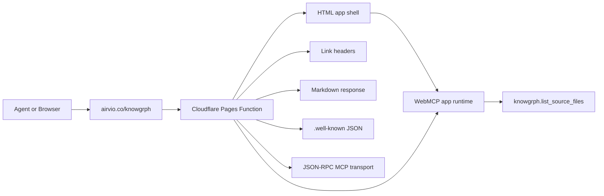

# Knowgrph Agent Ready - PRD + TAD (Implemented)

## Scope

Make `https://airvio.co/knowgrph/` agent-discoverable and browser-tool discoverable while
preserving the existing app shell. The deployment path is:

Dev: `/Users/huijoohwee/Documents/GitHub/knowgrph`
Prod mirror: `/Users/huijoohwee/Documents/GitHub/huijoohwee/content/knowgrph`
Cloudflare Pages: `airvio.co/knowgrph`

The implemented owner is a Cloudflare Pages Function generated from:

`cloudflare/pages/knowgrph-agent-ready.mjs`

It is synced to:

`/Users/huijoohwee/Documents/GitHub/huijoohwee/functions/knowgrph/[[path]].js`

## Implemented Audit Result

| Category | Item | Status |
|---|---|---|
| Discoverability | robots.txt | Implemented and smoke-tested |
| Discoverability | sitemap.xml | Implemented and smoke-tested |
| Discoverability | Link Headers (RFC 8288) | Implemented and smoke-tested |
| Content | Markdown Negotiation | Implemented and smoke-tested |
| Bot Access Control | Web Bot Auth / JWKS | Implemented and smoke-tested |
| Bot Access Control | AI Bot Rules in robots.txt | Implemented and smoke-tested |
| Bot Access Control | Content Signals in robots.txt | Implemented and smoke-tested |
| API / Auth / MCP | API Catalog (RFC 9727) | Implemented and smoke-tested |
| API / Auth / MCP | OAuth / OIDC Discovery | Implemented and smoke-tested |
| API / Auth / MCP | OAuth Protected Resource | Implemented and smoke-tested |
| API / Auth / MCP | MCP Server Card | Implemented and smoke-tested |
| API / Auth / MCP | Agent Skills Index | Implemented and smoke-tested |
| API / Auth / MCP | WebMCP | Implemented and browser-checked |

Commerce checks are intentionally deferred because Knowgrph is not a commerce site.

## User Stories

### E1-S3: Link Headers

As an MCP agent or API client, I want `Link` response headers on the Knowgrph homepage so I
can discover the API catalog, OpenAPI document, MCP card, and service documentation without
scraping HTML.

Acceptance:

- `GET https://airvio.co/knowgrph/` returns a `Link` header.
- The header includes `</.well-known/api-catalog>; rel="api-catalog"`.
- The header includes `rel="service-desc"` pointing at `/knowgrph/.well-known/openapi.json`.
- The header includes `rel="service-doc"` pointing at `/knowgrph/llms.txt`.
- The header includes `rel="mcp-server-card"` pointing at
  `/knowgrph/.well-known/mcp/server-card.json`.
- The apex homepage must not receive Knowgrph-specific Link headers.

Implementation:

- Source: `cloudflare/pages/knowgrph-agent-ready.mjs`
- Constant: `linkHeaderValue`
- Route owner: `onRequest()`
- Sync target: `huijoohwee/functions/knowgrph/[[path]].js`

Verification:

```bash
curl -I https://airvio.co/knowgrph/
curl -I https://airvio.co/
```

### E2-S1: Markdown Negotiation

As an AI crawler or agent, I want Knowgrph to return Markdown when I send
`Accept: text/markdown` so I receive compact, token-efficient content.

Acceptance:

- `GET https://airvio.co/knowgrph/` with `Accept: text/markdown` returns
  `Content-Type: text/markdown; charset=utf-8`.
- The Markdown body starts with `# Knowgrph`.
- The response includes `x-markdown-tokens`.
- Requests without `Accept: text/markdown` continue to return HTML.

Implementation:

- Source: `cloudflare/pages/knowgrph-agent-ready.mjs`
- Function: `markdownResponse()`
- Body: `markdownForAgents`
- Matcher: `wantsMarkdown(request)`

Verification:

```bash
curl -i https://airvio.co/knowgrph/ -H 'Accept: text/markdown'
curl -I https://airvio.co/knowgrph/
```

### E4-S5: WebMCP

As a browser-based AI agent, I want Knowgrph to expose a WebMCP tool through
`navigator.modelContext` so I can discover site actions from the browser context.

Acceptance:

- The page registers the `knowgrph.list_source_files` tool.
- Registration uses `navigator.modelContext.provideContext({ tools })` when that API is
  available.
- Registration falls back to `navigator.modelContext.tools` without duplicating the tool.
- The same installation path marks the document root with
  `data-kg-webmcp-tools="knowgrph.list_source_files"` for browser audit verification.
- The apex homepage does not include the Knowgrph WebMCP tool.

Implementation:

- App runtime source: `canvas/src/features/agent-ready/webMcpRuntime.ts`
- Runtime install call: `canvas/src/main.tsx`
- Pages Function HTML injection: `cloudflare/pages/knowgrph-agent-ready.mjs`
- Tool execute endpoint: `https://airvio.co/api/storage/source-files`

Verification:

```js
document.documentElement.dataset.kgWebmcpTools === "knowgrph.list_source_files"
```

## Technical Architecture



## Route Contract

| Route | Method | Response |
|---|---:|---|
| `/knowgrph/` | GET/HEAD | HTML app shell plus agent discovery Link headers |
| `/knowgrph/` | GET with `Accept: text/markdown` | `text/markdown` plus `x-markdown-tokens` |
| `/robots.txt` | GET | root static alias for agent crawlers |
| `/sitemap.xml` | GET | root static alias |
| `/.well-known/api-catalog` | GET | root static alias for RFC 9727 discovery |
| `/knowgrph/robots.txt` | GET | app-scoped robots.txt |
| `/knowgrph/sitemap.xml` | GET | app-scoped sitemap |
| `/knowgrph/.well-known/api-catalog` | GET | `application/linkset+json` |
| `/knowgrph/.well-known/openapi.json` | GET | OpenAPI 3.1 JSON |
| `/knowgrph/.well-known/oauth-protected-resource` | GET | OAuth protected-resource metadata |
| `/knowgrph/.well-known/oauth-authorization-server` | GET | OAuth/OIDC authorization-server metadata |
| `/knowgrph/.well-known/mcp/server-card.json` | GET | MCP server card |
| `/knowgrph/.well-known/agent-skills/index.json` | GET | Agent Skills index |
| `/knowgrph/.well-known/http-message-signatures-directory` | GET | JWKS / Web Bot Auth metadata |
| `/knowgrph/mcp` | GET/HEAD | MCP metadata |
| `/knowgrph/mcp` | POST | JSON-RPC `initialize`, `tools/list`, `tools/call` |

## Component Inventory

| Layer | Component | File / Module | Status |
|---|---|---|---|
| Static | robots.txt | generated from `cloudflare/pages/knowgrph-agent-ready.mjs` | Implemented |
| Static | sitemap.xml | generated from `cloudflare/pages/knowgrph-agent-ready.mjs` | Implemented |
| Static | OpenAPI spec | generated into root and `/knowgrph/.well-known` aliases | Implemented |
| Pages Function | Route dispatcher | `cloudflare/pages/knowgrph-agent-ready.mjs` | Implemented |
| Pages Function | Link header injector | `linkHeaderValue` and `onRequest()` | Implemented |
| Pages Function | Markdown negotiation | `markdownResponse()` and `wantsMarkdown()` | Implemented |
| Pages Function | MCP JSON-RPC transport | `handleMcpTransport()` at `/knowgrph/mcp` | Implemented |
| Pages Function Data | API Catalog | `apiCatalog` constant | Implemented |
| Pages Function Data | OAuth metadata | `oauthProtectedResource`, `oauthAuthorizationServer` | Implemented |
| Pages Function Data | MCP Server Card | `mcpServerCard` constant | Implemented |
| Pages Function Data | Agent Skills Index | `agentSkillsIndex()` | Implemented |
| Pages Function Data | JWKS | `httpMessageSignaturesDirectory` | Implemented |
| Browser | WebMCP runtime | `canvas/src/features/agent-ready/webMcpRuntime.ts` | Implemented |
| CI | Deploy workflow | `.github/workflows/agent-ready.yml` | Implemented |
| CI | Smoke test | `.github/workflows/smoke-test.sh`, `scripts/check-agent-ready.mjs` | Implemented |

## Validation Checklist

- [x] Link headers are emitted on `https://airvio.co/knowgrph/`.
- [x] Link headers include `rel="api-catalog"`, `rel="service-desc"`, `rel="service-doc"`,
  and `rel="mcp-server-card"`.
- [x] `rel="api-catalog"` uses `/.well-known/api-catalog`.
- [x] Markdown negotiation returns `text/markdown`.
- [x] Markdown negotiation includes `x-markdown-tokens`.
- [x] Browser HTML contains `provideContext`, `modelContext`, and `knowgrph.list_source_files`.
- [x] Browser runtime marks `data-kg-webmcp-tools="knowgrph.list_source_files"`.
- [x] JSON-RPC MCP `initialize` returns a valid result.
- [x] `npm run agent-ready:check` covers the implemented discovery surface.
- [x] `npm --prefix canvas exec tsc -- -p canvas/tsconfig.json --noEmit --pretty false`
  passes.

## Deployment Sequence

1. Build and sync: `npm run pages:build-sync`
2. Check sync drift: `npm run pages:check-sync`
3. Smoke locally or live: `npm run agent-ready:check`
4. Deploy Pages mirror:
   `npx wrangler pages deploy ../huijoohwee --project-name=joohwee --branch=main --commit-dirty=true`
5. Re-run live smoke against `https://airvio.co/knowgrph`

## Open Items

No implementation blockers remain for Link headers, Markdown negotiation, or WebMCP. Future
work can add mutating MCP tools and richer browser tools, but the agent-ready discovery
contract is implemented.

*Document version: 1.2.1 - Implemented - 2026-05-21*
