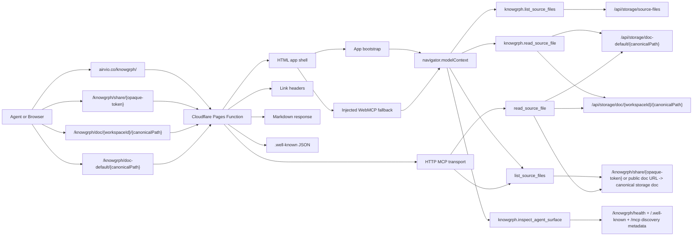
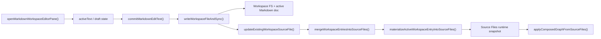
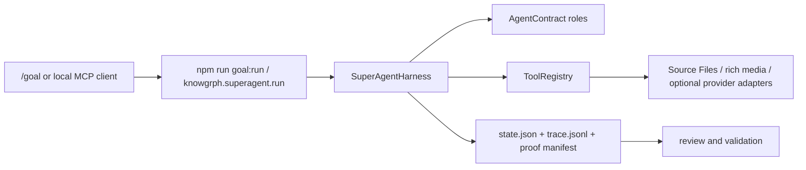

# Knowgrph Agent Ready - Runtime, Routes, Validation, And Deployment Companion

> Canonical source: `docs/documents/knowgrph-agent-ready-prd-tad.md`

For current remote MCP onboarding, start with
`docs/documents/knowgrph-mcp-onboarding-index.md`, then use
`docs/documents/knowgrph-mcp-install-contract.md` for the canonical
public-discovery vs control-plane endpoint boundary.
Map intent on `https://airvio.co/knowgrph/mcp`, orchestrate agents on
`https://airvio.co/knowgrph/control-plane/mcp` only for session-capable hosts,
and prove outcomes first with the source-side `README.md` or
`docs/documents/knowgrph-superagent-harness.md` offline path.

## Technical Architecture

### Deployed agent-ready surface

### Internal runtime contract for future enhancements

### Local SuperAgent harness contract

The local SuperAgent harness is source-owned and DeerFlow-inspired only at the
concept level: message gateway, memory, tools, skills, subagents, sandboxed
workspace artifacts, and long-horizon runs. It must not be documented as a
deployed Pages/WebMCP mutation service, must not copy DeerFlow code or
architecture, and must keep graph commits on existing review-first KGC owners.

### Browser E2E pipeline contract

```mermaid
flowchart LR
  A["MainPanel integrations tab"] --> C["SettingsView"]
  B["MainPanel mcp tab"] --> C
  C --> D["useSettingsChatAssist()"]
  D --> E["emitFloatingPanelOpen(tab=chat)"]
  E --> F["FloatingPanel / FloatingPanelChat"]
  F --> G["useFloatingPanelChatSubmit()"]
  G --> H["floatingPanelChatSubmitCoordinator.ts"]
  H --> I["vdeoxpln routing prompt"]
  I --> J["streaming draft + KGC retry"]
  J --> K["chatMarkdownValidation.ts"]
  K --> L["useFinalizeAssistantSuccess()"]
  L --> M["Workspace FS run manifest"]
  L --> N["applyChatKgcWorkspaceDocumentToCanvas()"]
  N --> O["applyWorkspaceImportToCanvas()"]
  O --> P["setActiveMarkdownDocument(applyToGraph)"]
  P --> Q["tryParseMarkdownFrontmatterFlowGraph()"]
  Q --> R["merge edges + subgraphs + clusters"]
  R --> S["Canvas groups / clusters / edges"]
```

### Architectural rule

The deployed Cloudflare document surface, the shared MainPanel shells, and any future local
runtime agent surface must converge on the same document identity and pipeline model:

- canonical workspace id
- canonical `canonicalPath`
- canonical workspace/source-file path resolution
- canonical Markdown body produced by the existing workspace write-through flow
- canonical MainPanel ownership where `integrations` and `mcp` stay thin `SettingsView` shells
- canonical chat submit ownership where `useFloatingPanelChatSubmit()` remains a thin shell and the
  coordinator/helper stack owns lifecycle complexity
- canonical vdeoxpln routing where intent/current state select a pack and route names, file names,
  absolute paths, and URLs are ignored for selection
- canonical KGC contract where output starts at YAML frontmatter and `flow.subgraphs` is the only
  upstream grouping surface
- canonical source-backed run manifest where Chat-to-Canvas vdeoxpln execution writes a KGC
  companion artifact through Workspace FS
- canonical graph-apply path where finalized KGC Markdown reaches Canvas through
  `applyChatKgcWorkspaceDocumentToCanvas()`, `applyWorkspaceImportToCanvas()`, and `setActiveMarkdownDocument({ applyToGraph: true })`

## Route Contract
| Route | Method | Response |
|---|---:|---|
| `/knowgrph/` | GET/HEAD | HTML app shell plus Knowgrph discovery `Link` headers |
| `/` | GET with `Accept: text/markdown` | `text/markdown` plus `x-markdown-tokens` |
| `/knowgrph/` | GET with `Accept: text/markdown` | `text/markdown` plus `x-markdown-tokens` |
| `/knowgrph/share/{opaque-token}` | GET | HTML shell for browsers or published markdown document on `Accept: text/markdown` |
| `/knowgrph/doc/{workspaceId}/{canonicalPath}` | GET | HTML shell for browsers or published markdown document on `Accept: text/markdown` |
| `/knowgrph/doc-default/{canonicalPath}` | GET | HTML shell for browsers or published markdown document on `Accept: text/markdown` |
| `/knowgrph/health` | GET/HEAD | `application/health+json` status payload |
| `/knowgrph/mcp` | GET/HEAD | MCP metadata |
| `/knowgrph/mcp` | POST | JSON-RPC `initialize`, `tools/list`, `tools/call` |
| `/knowgrph/.well-known/agent-card.json` | GET | app-scoped A2A Agent Card JSON |
| `/knowgrph/robots.txt` | GET | app-scoped crawl policy |
| `/knowgrph/sitemap.xml` | GET | app-scoped sitemap |
| `/auth.md` and `/knowgrph/auth.md` | GET | Auth.md Markdown for agent registration metadata |
| `/knowgrph/.well-known/api-catalog` | GET | RFC 9727 linkset |
| `/knowgrph/.well-known/openapi.json` | GET | OpenAPI 3.1 JSON |
| `/knowgrph/.well-known/oauth-protected-resource` | GET | OAuth protected-resource metadata |
| `/knowgrph/.well-known/oauth-authorization-server` | GET | OAuth/OIDC metadata |
| `/knowgrph/.well-known/openid-configuration` | GET | OAuth/OIDC metadata alias |
| `/knowgrph/.well-known/mcp/server-card.json` | GET | MCP server card |
| `/knowgrph/.well-known/mcp.json` | GET | MCP card alias |
| `/knowgrph/.well-known/agent-skills/index.json` | GET | Agent Skills index |
| `/knowgrph/.well-known/agent-skills/{vdeoxplnId}.md` | GET | Generated vdeoxpln Markdown |
| `/knowgrph/.well-known/http-message-signatures-directory` | GET | Web Bot Auth metadata |
| `/robots.txt` | GET | root discovery alias |
| `/sitemap.xml` | GET | root discovery alias |
| `/.well-known/api-catalog` | GET | root discovery artifact |
| `/.well-known/openapi.json` | GET | root discovery artifact |
| `/.well-known/agent-card.json` | GET | root A2A Agent Card JSON |
| `/.well-known/oauth-protected-resource` | GET | root discovery artifact |
| `/.well-known/oauth-authorization-server` | GET | root discovery artifact |
| `/.well-known/openid-configuration` | GET | root discovery artifact |
| `/.well-known/mcp/server-card.json` | GET | root discovery artifact |
| `/.well-known/mcp.json` | GET | root discovery artifact |
| `/.well-known/agent-skills/index.json` | GET | root discovery artifact |
| `/.well-known/agent-skills/{vdeoxplnId}.md` | GET | root discovery artifact |
| `/.well-known/http-message-signatures-directory` | GET | root discovery artifact |
| `/api/storage/source-files` | GET | default Source Files markdown index |
| `/api/storage/llms.txt` | GET | default Source Files plain-text agent entrypoint |
| `/api/storage/doc-default/{canonicalPath}` | GET | default published Editor Workspace Markdown-pane document from the D1-backed storage worker |
| `/api/storage/doc/{workspaceId}/{canonicalPath}` | GET | workspace-scoped Editor Workspace Markdown-pane document from the D1-backed storage worker |

## Component Inventory

| Layer | Component | File / Module | Status |
|---|---|---|---|
| Pages function | Route dispatcher | `cloudflare/pages/knowgrph-agent-ready.mjs` | Implemented |
| Pages function | Root markdown negotiation | `cloudflare/pages/root-agent-ready-index.mjs` | Implemented |
| Pages function | Root no-navigation WebMCP HTML | `cloudflare/pages/root-agent-ready-index.mjs` | Implemented |
| Pages function | Markdown negotiation | `wantsMarkdown()`, `markdownResponse()` | Implemented |
| Pages function | Shared doc markdown proxy | `/knowgrph/share/*` + `/knowgrph/doc/*` + `/knowgrph/doc-default/*` in `cloudflare/pages/knowgrph-agent-ready.mjs` | Implemented |
| Pages deploy | Explicit shared-doc function wrappers | generated by `scripts/sync-pages-knowgrph.mjs` | Implemented |
| Pages function | Health status route | `/knowgrph/health` in `cloudflare/pages/knowgrph-agent-ready.mjs` | Implemented |
| Pages function | A2A Agent Card route | `/.well-known/agent-card.json` alias + `/knowgrph/.well-known/agent-card.json` | Implemented |
| Pages function | Link header injector | `linkHeaderValue`, `onRequest()` | Implemented |
| Pages function | HTTP MCP transport | `handleMcpTransport()` | Implemented |
| Pages function | WebMCP HTML injection | `injectWebMcpScript()` | Implemented |
| Shared contract | Tool names and input schema | `canvas/src/features/agent-ready/knowgrphAgentReadyToolContract.mjs` | Implemented |
| Static artifacts | robots, sitemap, `.well-known` | `buildAgentReadyStaticFiles()` | Implemented |
| Browser | WebMCP runtime | `canvas/src/features/agent-ready/webMcpRuntime.ts` | Implemented |
| MainPanel | Shared MCP / Integrations tabs | `canvas/src/features/panels/MainPanel.tsx` | Implemented |
| MainPanel | Integrations hub shell | `canvas/src/features/panels/views/IntegrationsHubView.tsx` | Implemented |
| MainPanel | MCP hub shell | `canvas/src/features/panels/views/McpHubView.tsx` | Implemented |
| Settings | Shared MCP / Integrations owner | `canvas/src/features/panels/views/SettingsView.tsx` | Implemented |
| Settings | Chat assist and routing helpers | `canvas/src/features/panels/views/useSettingsChatAssist.tsx` | Implemented |
| FloatingPanel | Chat UI | `canvas/src/features/chat/FloatingPanelChat.tsx` | Implemented |
| Chat submit | Thin submit shell | `canvas/src/features/chat/floatingPanelChat/useFloatingPanelChatSubmit.ts` | Implemented |
| Chat submit | Submit coordinator | `canvas/src/features/chat/floatingPanelChat/floatingPanelChatSubmitCoordinator.ts` | Implemented |
| Chat submit | Streaming draft writer | `canvas/src/features/chat/floatingPanelChat/floatingPanelChatStreaming.ts` | Implemented |
| Chat validation | KGC attempt + retry | `canvas/src/features/chat/floatingPanelChat/floatingPanelChatKgcAttempt.ts` | Implemented |
| Chat validation | Frontmatter/grouping validation | `canvas/src/features/chat/chatMarkdownValidation.ts` | Implemented |
| Chat validation | KGC recovery / normalization | `canvas/src/features/chat/chatHistoryWorkspace.kgc.recovery.ts` | Implemented |
| Chat finalize | Workspace persistence + canvas bridge | `canvas/src/features/chat/floatingPanelChat/useFinalizeAssistantSuccess.ts` + `canvas/src/features/chat/chatKgcCanvasApply.ts` | Implemented |
| Storage | Shared route contract | `canvas/src/lib/storage/knowgrphStorageSyncContract.ts` | Implemented |
| Browser | Shared doc deep-link parsing and Share URL mapping | `canvas/src/features/canvas/{canvasDocDeepLink.ts,canvasDocShareToken.mjs}` | Implemented |
| Browser | Shared doc import runtime | `canvas/src/features/canvas/CanvasDocDeepLinkRuntime.tsx` | Implemented |
| Storage | Default doc read route | `cloudflare/workers/knowgrph-storage/index.ts` | Implemented |
| Storage | Source Files index and `llms.txt` | `cloudflare/workers/knowgrph-storage/crawler.ts` | Implemented |
| Storage | D1-backed crawler doc-view source | `cloudflare/workers/knowgrph-storage/{crawler.ts,index.ts}` | Implemented |
| Workspace runtime | Workspace-open SSOT | `canvas/src/features/workspace-table/workspaceTableSsot.ts` | Implemented |
| Workspace runtime | Markdown edit convergence | `canvas/src/features/markdown-workspace/main/MarkdownWorkspaceMain.tsx` | Implemented |
| Workspace runtime | Write-through sync | `canvas/src/lib/markdown-workspace-runtime/markdownWorkspaceRuntime.io.ts` | Implemented |
| Workspace runtime | Workspace -> Source Files merge | `canvas/src/features/workspace-fs/syncToSourceFiles.ts` | Implemented |
| Workspace runtime | Active-path materialization | `canvas/src/features/source-files/sourceFilesRuntimeMaterialization.ts` | Implemented |
| Workspace runtime | Source Files graph compose/apply | `canvas/src/features/source-files/applyComposedGraphFromSourceFiles.ts` | Implemented |
| Parser | Structured Markdown parse priority | `canvas/src/features/parsers/default.ts` | Implemented |
| Parser | Frontmatter-flow graph composition | `canvas/src/features/parsers/markdownFrontmatterFlowGraph.core.ts` + companion helpers | Implemented |
| Canvas | Subgraph/group projection | `canvas/src/lib/graph/subgraphs.ts` + `canvas/src/components/GraphCanvas/layout/graphGroups.ts` | Implemented |
| Browser | PWA runtime | `canvas/src/lib/pwa/runtime.ts` | Implemented |
| Publish | Mirror and root control generation | `scripts/sync-pages-knowgrph.mjs` | Implemented |
| Publish | Root homepage discovery headers | `scripts/sync-pages-knowgrph.mjs` -> `huijoohwee/_headers` | Implemented |
| Validation | Live smoke | `scripts/check-agent-ready.mjs` | Implemented |
| Validation | DNS-AID shared record contract | `scripts/dns-aid-records.mjs` | Implemented |
| Validation | DNS-AID local contract check | `scripts/check-dns-aid-contract.mjs` | Implemented |
| Validation | DNS-AID DoH check | `scripts/check-dns-aid-cloudflare.mjs` | Implemented |

## Guardrails

### Agent surface guardrails

- no write access from HTTP MCP
- no published or remote mutation tools; browser WebMCP mutation is limited to the three guarded
  local Camera, Animation, and XR scene controls declared by the shared contract
- no discovery metadata advertising tools that are not executable
- no root-level discovery drift that conflicts with `/knowgrph/` as the service homepage
- no deployed-route claim for the local SuperAgent harness unless a source-owned Pages/Worker route and live validation exist
- no copied DeerFlow architecture, provider-specific renderer, parser, memory, or graph-apply stack
### Workspace and Markdown guardrails

- no alternate agent-only Markdown export path
- no bypass around `commitMarkdownEditText()` or `writeWorkspaceFileAndSync()`
- no passive workspace path switch causing hidden graph apply
- no stale source-file snapshot reads when caller-owned snapshots are already available
- no new signature or cache-key logic that ignores shared semantic-key/signature helpers

### Publish guardrails

- no manual mirror-only edits in `huijoohwee/content/knowgrph`
- no nested `_headers` or `_redirects` under mirrored content
- no apex-root PWA identity for Knowgrph

## Validation Checklist

- [x] `https://airvio.co/knowgrph/` emits discovery `Link` headers
- [x] `https://airvio.co/` emits discovery `Link` headers for scanners that probe the root homepage
- [x] `npm run dns-aid:contract` validates the local ServiceMode SVCB DNS-AID record contract
- [x] `_index._agents`, `_mcp._agents`, and `_a2a._agents.airvio.co` return DNSSEC-authenticated SVCB DNS-AID records
- [x] `https://airvio.co/auth.md` returns Auth.md Markdown instead of HTML
- [x] `/.well-known/oauth-protected-resource` points `authorization_servers` at the site-owned authorization-server metadata where `agent_auth` is published
- [x] `https://airvio.co/` returns Markdown on `Accept: text/markdown`
- [x] `https://airvio.co/knowgrph/health` returns `application/health+json`
- [x] the homepage `Link` header includes a `status` relation
- [x] the homepage `Link` header includes a `describedby` relation for the A2A Agent Card
- [x] root `/` advertises discovery hints without becoming the canonical Knowgrph service homepage
- [x] root `/` serves stable WebMCP-capable HTML without a meta refresh that destroys scanner execution context
- [x] Markdown negotiation returns `text/markdown`, `x-markdown-tokens`, and `Vary: Accept`
- [x] Pages preview shared document URLs can negotiate from the HTML shell to storage-backed Markdown
- [x] `https://airvio.co/knowgrph/share/{opaque-token}` negotiates to storage-backed Markdown
- [x] smoke validation probes a canonical published shared document URL instead of skipping the route
- [x] `/.well-known/agent-card.json` and `/knowgrph/.well-known/agent-card.json` both return JSON
- [x] browser runtime exposes all 26 shared app contracts: 23 read-only retrieval/inspection tools plus `knowgrph.control_local_camera`, `knowgrph.control_local_animation`, and `knowgrph.control_local_xr_scene`; Animation inspection/control is included explicitly
- [x] HTML fallback exposes WebMCP markers plus scanner-visible `provideContext` and `registerTool`
- [x] JSON-RPC MCP `initialize` returns a valid result
- [x] JSON-RPC MCP `tools/list` returns the shared read-only published tool set
- [x] JSON-RPC MCP `tools/call` executes live storage lookups
- [x] MCP server card, HTTP MCP `tools/list`, and browser WebMCP all reuse one shared tool schema
- [x] MainPanel `integrations` and MainPanel `mcp` both mount `SettingsView` specializations instead of separate routing stacks
- [x] chat routing and presets stay owned by `useSettingsChatAssist.tsx` and shared open-panel helpers
- [x] `useFloatingPanelChatSubmit()` remains a thin shell over the submit coordinator/helper stack
- [x] KGC validation rejects wrapper prose before frontmatter, literal MCP structured-surface acceptance rejects non-renderable output, and parallel grouping aliases outside `flow.subgraphs` stay rejected upstream
- [x] finalized KGC workspace documents apply to Canvas through `applyChatKgcWorkspaceDocumentToCanvas()`, `applyWorkspaceImportToCanvas()`, and `setActiveMarkdownDocument({ applyToGraph: true })`
- [x] `tryParseMarkdownFrontmatterFlowGraph()` remains first parse priority for structured KGC Markdown
- [x] default published workspace markdown is readable without explicit `workspaceId`
- [x] crawler-visible Markdown-pane content resolves from the D1-backed storage worker doc-view
  routes instead of repo-local docs trees
- [x] root `.well-known` OpenAPI, MCP card, and Agent Skills artifacts are validation-covered
- [x] publish sync owns the generated root `_headers` and `_redirects` blocks
- [x] publish sync excludes nested `_headers` and `_redirects` from the mirrored app payload
- [x] `canvas/index.html` uses `%BASE_URL%manifest.webmanifest`
- [x] regression coverage protects the manifest base-path invariant
## Deployment Sequence
1. Validate the DNS-AID records after any DNS discovery change:
   `npm run dns-aid:contract && npm run dns-aid:check`
2. Build, sync, and drift-check Pages artifacts: `npm run pages:build-sync && npm run pages:check-sync && npm run auth-md:check`
3. Smoke-check the HTTP agent-ready surface: `npm run agent-ready:check`
4. Deploy the shared Pages repo:
   `cd $GITHUB_ROOT/huijoohwee && npx wrangler pages deploy . --project-name=joohwee --branch=main --commit-dirty=true`
5. Re-run live checks against `https://airvio.co/knowgrph/`

*Document version: 1.27.5 - Root WebMCP scanning is stable without meta-refresh navigation, and the live external scan passes with five unique published WebMCP tools; DNS-AID, Auth.md, and MainPanel -> FloatingPanel Chat -> KGC or MCP structured response -> Editor Workspace -> Canvas ownership contracts stay unchanged - 2026-05-29*
