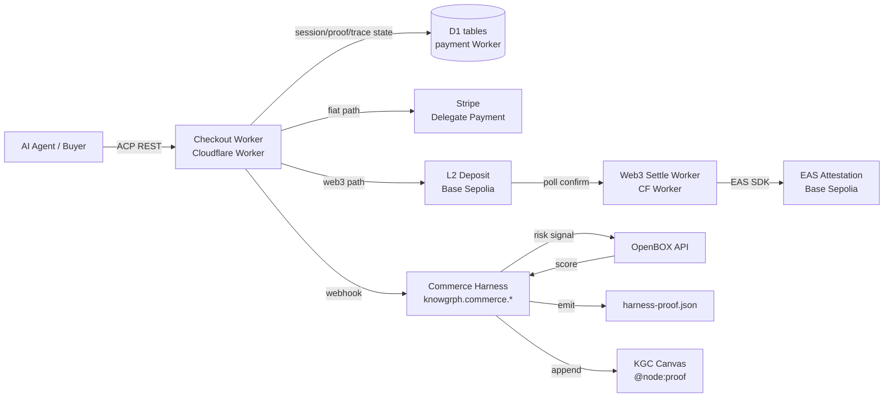
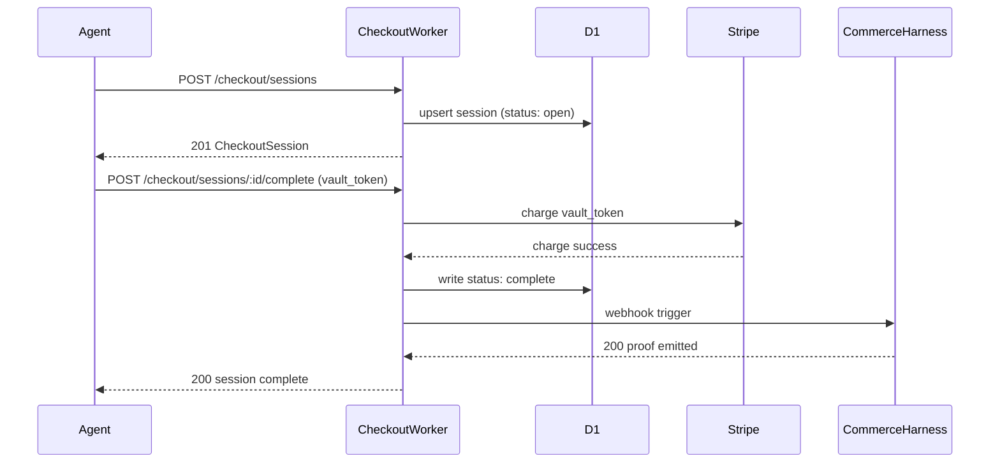
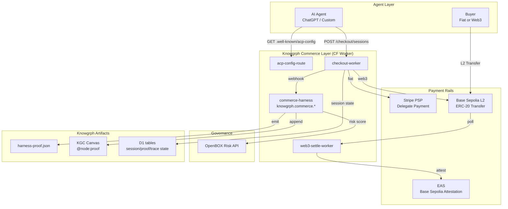

# Knowgrph Agentic Commerce — PRD & TAD
---

## Overview

Knowgrph exposes a composable MCP-native commerce orchestration layer — `knowgrph.commerce.*` — that makes any harness-driven workspace agent-buyable via the Agentic Commerce Protocol (ACP, Apache 2.0 / Stripe + OpenAI), while extending ACP with a FOSS Web3 identity sidecar (DeBox DID) and a governance signal adapter (OpenBOX risk scores). 
The layer operates across two payment rails: 
- fiat (Stripe Shared Payment Token), and 
- on-chain (ERC-20 / USDC on L2), routed by capability negotiation at session initiation.

**Governing lenses**: min-viable-max-value · TCO-zero · token economics · harness-first.

---

## Part 1 — PRD

---

### Epic AC-E1 — ACP-Compatible Agent Checkout

#### Problem Statement

AI agents (ChatGPT, Claude, custom harnesses) cannot initiate deterministic programmatic checkout against Knowgrph-powered workspaces or products. 
Browser-automation workarounds are fragile, non-auditable, and fail PCI compliance. 
ACP defines a standard REST + Delegate Payment interface that any compliant agent can call — Knowgrph must implement the seller-side spec to participate in the emerging agent commerce ecosystem.

#### Personas

**Agent Operator** — runs an AI agent (ChatGPT, Knowgrph harness, third-party) on behalf of a buyer; needs a deterministic, schema-validated checkout endpoint; values PCI safety and session idempotency.

**Seller / Solo Dev** — deploys Knowgrph as a product or data marketplace; wants agent-driven revenue without a bespoke storefront; values zero-infra-cost checkout that plugs into an existing Stripe account.

**Buyer** — interacts with an agent in natural language to purchase a digital good, data product, or harness run; never touches a checkout form directly.

#### User Journey — Agent Operator: Agent-Initiated Purchase

| Stage | Action | Touchpoint | Pain Point | Opportunity |
|---|---|---|---|---|
| Trigger | Buyer expresses purchase intent in agent chat | Agent UI | No structured checkout target | ACP endpoint makes checkout deterministic |
| Discover | Agent calls `GET /.well-known/acp-config` | ACP config URL | Config absent or malformed | Knowgrph auto-publishes config |
| Engage | Agent creates checkout session, presents options | ACP `POST /checkout/sessions` | Session schema mismatch | Typed schema + validation harness |
| Complete | Agent submits payment token, session completes | ACP `POST /checkout/sessions/{id}/complete` | Payment credential exposure | Stripe Delegate Payment isolates credentials |
| Return | Webhook triggers post-purchase harness run | Webhook → harness | No post-purchase orchestration | `knowgrph.commerce.settle` emits proof node |

#### User Stories

**AC-E1-S1**: As an Agent Operator, I want to discover a Knowgrph seller's ACP configuration via a well-known URL, so that my agent can initiate checkout without bespoke integration.

**AC-E1-S2**: As an Agent Operator, I want to create and complete an ACP checkout session via REST, so that my agent can purchase a digital product on behalf of a buyer without browser automation.

**AC-E1-S3**: As a Seller, I want checkout events to trigger a harness webhook, so that post-purchase orchestration (delivery, attestation, proof generation) is automated.

#### Acceptance Criteria

**AC-E1-S1-AC1**: Given a deployed Knowgrph seller instance, when `GET /.well-known/acp-config` is called by any HTTP client, then a valid ACP capability JSON response is returned within 300 ms with `Content-Type: application/json` and HTTP 200.

> **`/goal` translation**: `npm --prefix canvas run test:ci:unit -- "worker.payments.agenticCommerce.acpConfig" passes; GET /.well-known/acp-config returns HTTP 200 with required ACP fields from the shared Commerce SSOT`

**AC-E1-S2-AC1**: Given a valid ACP checkout session payload, when `POST /checkout/sessions` is called with a schema-valid body, then a session object is returned with `id`, `status: "open"`, and idempotency key echoed within 500 ms.

> **`/goal` translation**: `npm --prefix canvas run test:ci:unit -- "worker.payments.agenticCommerce.checkoutLifecycle" passes; POST /checkout/sessions returns 201 with status "open", persists through D1, and echoes the idempotency key`

**AC-E1-S3-AC1**: Given a completed checkout session, when Stripe emits a `checkout.session.completed` webhook event, then `knowgrph.commerce.settle` tool is invoked within 5 s, a `harness-proof.json` delta is appended, and the seller receives a 200 acknowledgment.

> **`/goal` translation**: `npm --prefix canvas run test:ci:unit -- "worker.payments.agenticCommerce.stripeWebhookSettle" passes; harness-proof.json contains a commerce entry with session_id, and settle tool call is logged in trace.jsonl`

#### Success Metrics

| Metric | Baseline | Target | Timeline |
|---|---|---|---|
| ACP config endpoint p95 latency | n/a | < 300 ms | Sprint 1 |
| Checkout session creation success rate | 0% | ≥ 99% | Sprint 2 |
| Post-purchase webhook delivery rate | 0% | ≥ 99.5% | Sprint 2 |
| Token cost / checkout session | n/a | < 500 tokens | Sprint 2 |
| Monthly TCO (infra) | n/a | $0 (Cloudflare free tier) | Sprint 1 |
| ROI Score | — | ≥ 4.0 | Sprint 2 |

**ROI Score (AC-E1)**:
```
Impact = 4 (unblocks agent-driven revenue; high pain)
Reach  = est. 50 sessions/month at launch
Build  = 6 hours
TCO    = $0/month (Cloudflare Worker free tier + Stripe fees at variable cost)
Token  = ~500 tokens/session × 50 × $3/1M = ~$0.08/month

ROI = (4 × 50) / (6 + 0 + 0.08) ≈ 33 — well above threshold
```

#### MoSCoW Priority

| Tier | Feature | ROI Score | Rationale |
|---|---|---|---|
| Must | ACP config well-known endpoint | 33 | Zero-build entry point; unlocks all downstream |
| Must | Checkout session CRUD (create, get, complete, cancel) | 33 | Core ACP seller compliance |
| Must | Stripe Delegate Payment token acceptance | 25 | PCI-safe fiat rail; required for ChatGPT compatibility |
| Must | Post-purchase webhook → harness trigger | 18 | Automates delivery; closes commerce loop |
| Should | ACP Extensions capability negotiation | 12 | Enables Web3 sidecar (AC-E2) |
| Could | Seller dashboard for session monitoring | 6 | Nice to have; defer to later sprint |
| Won't | Custom storefront UI | 2 | ACP agent renders checkout; seller UI not required |

#### Min-Viable Scope (AC-E1)

Four Cloudflare Worker routes: `GET /.well-known/acp-config`, `POST /checkout/sessions`, `GET /checkout/sessions/:id`, `POST /checkout/sessions/:id/complete`. 
Stripe webhook handler. Session/proof/trace state uses the existing payment Worker D1 binding. No separate store. No UI.

#### Out of Scope

Custom payment processor integrations (non-Stripe); subscription/recurring payment flows; physical goods fulfillment; buyer-facing storefront.

#### Dependencies

Stripe account (existing or new); Cloudflare Workers + D1 (free tier); ACP spec v2026-01-30 (Apache 2.0).

#### Open Questions

- Does the hackathon context require a testnet/mock Stripe environment, or can Stripe test mode suffice?
- Should `acp-config` advertise Web3 extension capability from day 0 or only after AC-E2 is shipped?

---

### Epic AC-E2 — Web3 Identity & Payment Extension

#### Problem Statement

ACP's `payment_method` schema is card/fiat-only. DeBox users authenticate via DID (Decentralized Identity, ERC-based) and transact in ERC-20 tokens (BOX) or stablecoins (USDC). 
There is no native ACP path for Web3 buyers. Without a bridge, DeBox communities cannot participate in agent commerce flows initiated through Knowgrph, creating a hard exclusion of the Web3 buyer segment.

#### Personas

**Web3 Buyer** — holds a DeBox DID + ERC-20/USDC balance; wants to transact with AI agents without exporting card credentials to a PSP; values self-custody and DID-based provenance.

**DAO Operator** — runs a DeBox DAO; wants to trigger harness-driven deliverables (analyses, reports, graph builds) funded by DAO treasury; values on-chain auditability of spending.

#### User Journey — Web3 Buyer: DID-Gated Checkout

| Stage | Action | Touchpoint | Pain Point | Opportunity |
|---|---|---|---|---|
| Trigger | Buyer signals Web3 payment intent to agent | Agent chat | ACP has no ERC-20 field | Extension sidecar carries DID in metadata |
| Discover | Agent reads ACP config `x-web3` extension | ACP config URL | Extension absent | Capability negotiation flags Web3 support |
| Engage | Agent initiates session with DID + token intent | ACP session + `x-web3` body | Schema mismatch on standard ACP | Extension fields ignored by non-Web3 sellers |
| Complete | On-chain transfer confirmed; synthetic vault token issued | L2 tx + Cloudflare Worker relay | No deterministic confirmation bridge | Worker polls L2; issues synthetic token on confirm |
| Return | EAS attestation anchored; proof node added to canvas | EAS Base Sepolia + KGC canvas | No provenance trail | `@node:proof` carries tx hash + attestation UID |

#### User Stories

**AC-E2-S1**: As a Web3 Buyer, I want to signal my DeBox DID and ERC-20 payment intent via an ACP extension field, so that my agent can route payment to an on-chain rail without card credentials.

**AC-E2-S2**: As a DAO Operator, I want a completed on-chain payment to automatically trigger a harness run and anchor its proof as an EAS attestation, so that treasury spend is traceable to a deliverable.

#### Acceptance Criteria

**AC-E2-S1-AC1**: Given an ACP session with `x-web3.payment_method: "erc20"` and a valid `payer_did`, when the session is created, then the seller accepts the session, sets `status: "pending_onchain"`, and returns the L2 deposit address within 500 ms.

> **`/goal` translation**: `npm --prefix canvas run test:ci:unit -- "worker.payments.agenticCommerce.web3Checkout" passes; POST /checkout/sessions with x-web3 returns 201 with status "pending_onchain" and a deterministic deposit_address`

**AC-E2-S2-AC1**: Given a confirmed L2 transfer matching the session amount, when the Cloudflare Worker polls and detects confirmation, then `knowgrph.commerce.attest` is called, an EAS attestation UID is returned within 30 s, and a `@node:proof` entry is appended to the active KGC canvas.

> **`/goal` translation**: `npm --prefix canvas run test:ci:unit -- "worker.payments.agenticCommerce.web3SettleRoute" passes; EAS attestation UID is present in harness-proof.json and @node:proof payload contains tx_hash plus attestation_uid`

#### Success Metrics

| Metric | Baseline | Target | Timeline |
|---|---|---|---|
| Web3 session creation latency | n/a | < 500 ms | Sprint 3 |
| L2 confirmation polling latency | n/a | < 30 s (Base Sepolia) | Sprint 3 |
| EAS attestation cost / tx | n/a | < $0.01 (Base L2) | Sprint 3 |
| Monthly TCO (L2 gas) | n/a | < $0.50 at 50 tx/month | Sprint 3 |
| ROI Score | — | ≥ 3.5 | Sprint 3 |

**ROI Score (AC-E2)**:
```
Impact = 4 (unlocks Web3 buyer segment; differentiates from pure ACP)
Reach  = est. 20 sessions/month (Web3 subset)
Build  = 8 hours
TCO    = ~$0.50/month (L2 gas)
Token  = ~300 tokens/session × 20 × $3/1M ≈ $0.02/month

ROI = (4 × 20) / (8 + 0.50 + 0.02) ≈ 9.5 — above threshold
```

#### MoSCoW Priority

| Tier | Feature | ROI Score | Rationale |
|---|---|---|---|
| Must | ACP `x-web3` extension fields in session schema | 12 | Structural enabler; zero runtime cost |
| Must | L2 deposit address generation + polling Worker | 9.5 | Core Web3 payment path |
| Should | EAS attestation on settlement | 8 | Provenance; complements OpenBOX (AC-E3) |
| Should | `@node:proof` canvas integration | 7 | Closes loop to KGC graph |
| Could | BOX token price oracle integration | 4 | Nice for UX; not required for MVP |
| Won't | Custom EVM smart contract (escrow) | 2 | Adds audit burden; L2 transfer + Worker is sufficient |

#### Min-Viable Scope (AC-E2)

`x-web3` extension fields in ACP session schema. Cloudflare Worker that generates a deterministic L2 deposit address through the shared semantic-key helper, confirms Base Sepolia transfers, then calls `knowgrph.commerce.attest`. EAS HTTP attestation endpoint. No custom contract.

#### Out of Scope

BOX token price discovery; multi-chain routing; escrow smart contracts; DEX integration.

#### Dependencies

AC-E2 requires AC-E1 (ACP session infrastructure). EAS SDK (MIT). 
Base Sepolia RPC (free public endpoint). `viem` or `ethers.js` (MIT).

#### Open Questions

- Should `payer_did` be validated against DeBox's DID registry on-chain, or is self-asserted DID sufficient for MVP?
- What is the acceptable confirmation block count on Base Sepolia for the hackathon demo (1 block ≈ 2 s)?

---

### Epic AC-E3 — Governance Overlay

#### Problem Statement

OpenBOX provides dynamic risk scoring and cognitive behavior analysis for AI agent actions. 
These signals have no structural home in the ACP checkout flow or the Knowgrph harness trace. 
Without integration, sellers cannot gate or flag agent-initiated transactions based on behavioral risk, and agents cannot surface governance provenance to buyers or auditors.

#### Personas

**Compliance-Oriented Seller** — deploying AI agents in regulated contexts (fintech, logistics, media); needs per-transaction risk scores attached to the audit trail; cannot approve agent actions without observable risk signals.

**OpenBOX Platform** — wants Knowgrph harness runs to generate governance-enriched proof artifacts that enterprise customers can ingest into their OpenBOX compliance dashboard.

#### User Stories

**AC-E3-S1**: As a Compliance-Oriented Seller, I want OpenBOX risk scores attached to each checkout session's harness proof, so that I can audit agent-initiated transactions against governance policy.

**AC-E3-S2**: As an OpenBOX Platform integrator, I want Knowgrph's `harness-proof.json` to be ingestible as a governance evidence artifact, so that agent commerce actions appear in the OpenBOX audit trail.

#### Acceptance Criteria

**AC-E3-S1-AC1**: Given a completed checkout session, when `knowgrph.commerce.settle` executes, then the emitted `harness-proof.json` contains an `openbox_risk` block with `score`, `action`, and `session_id` fields sourced from the OpenBOX API response.

> **`/goal` translation**: `npm --prefix canvas run test:ci:unit -- "worker.payments.agenticCommerce.checkoutLifecycle" passes; harness-proof.json fixture contains openbox_risk block with score, action, and session_id`

**AC-E3-S2-AC1**: Given a `harness-proof.json` artifact, when it is POSTed to the OpenBOX ingest endpoint, then OpenBOX returns a 200 response and the run appears in the audit trail within 60 s.

> **`/goal` translation**: `npm --prefix canvas run test:ci:unit -- "worker.payments.agenticCommerce.openboxIngest" passes with HTTP 200 response logged`

#### MoSCoW Priority

| Tier | Feature | ROI Score | Rationale |
|---|---|---|---|
| Must | OpenBOX risk signal in ACP `risk_signals` array | 15 | Direct ACP spec alignment; no schema change |
| Should | `openbox_risk` block in `harness-proof.json` | 10 | Enriches proof artifact for compliance use |
| Could | OpenBOX ingest adapter (POST proof to OpenBOX API) | 6 | Useful for enterprise; not required for hackathon |
| Won't | OpenBOX real-time policy enforcement (block checkout) | 3 | Requires OpenBOX enterprise API; deferred |

#### Min-Viable Scope (AC-E3)

Call OpenBOX risk scoring API at session completion. Map response to ACP `risk_signals` format. Append `openbox_risk` block to `harness-proof.json`. No ingest adapter required for MVP.

---

## Part 2 — TAD

---

### Architecture Overview

**From agent purchase intent to proof-anchored delivery**: Agent → ACP Checkout Worker → Knowgrph Commerce Harness → [Fiat: Stripe | Web3: L2 + EAS] → Post-purchase Harness Run → `harness-proof.json` + Canvas `@node:proof`.



### Journey → System Mapping

| Journey Stage | Workflow | Data Flow | Component |
|---|---|---|---|
| Discover | ACP Config Discovery | Agent → Checkout Worker → JSON response | `acp-config` route |
| Engage | Checkout Session Lifecycle | Agent → D1 → Stripe / L2 | `checkout-worker` |
| Complete (fiat) | Delegate Payment Token Exchange | Agent → Stripe PSP → vault token | Stripe integration |
| Complete (web3) | L2 Transfer + Poll | Agent → L2 → Web3 Settle Worker | `web3-settle-worker` |
| Return | Post-purchase Harness + Attestation | Webhook → Harness → EAS → Canvas | `commerce-harness` |

---

### Component Specifications

---

**Component**: `acp-config-route`
**Responsibility**: Serves the ACP capability JSON document at `GET /.well-known/acp-config`, advertising seller checkout endpoint, supported payment methods, and `x-web3` extension flag.
**Interfaces**: `GET /.well-known/acp-config` → `application/json`
**Dependencies**: Cloudflare Worker runtime
**Configuration**: `SELLER_ID`, `CHECKOUT_BASE_URL`, `WEB3_ENABLED` (env vars)
**FOSS / Vendor**: FOSS — Cloudflare Worker (free tier); ACP spec Apache 2.0
**Token Budget**: N/A (no LLM call)

---

**Component**: `checkout-worker`
**Responsibility**: Implements ACP Agentic Checkout REST API (session CRUD + complete + cancel); validates request schemas; routes payment to Stripe or Web3 path based on `x-web3` extension presence; persists session, proof, and trace state to D1 through the existing payment Worker owner.
**Interfaces**:
- `POST /checkout/sessions` → `CheckoutSession`
- `GET /checkout/sessions/:id` → `CheckoutSession`
- `POST /checkout/sessions/:id/complete` → `CheckoutSession`
- `POST /checkout/sessions/:id/cancel` → `CheckoutSession`
**Dependencies**: Cloudflare D1 (free tier); Stripe delegate-payment endpoint; Base RPC and EAS attestation endpoint for Web3 path
**Configuration**: `STRIPE_DELEGATE_PAYMENT_URL`, `ACP_BEARER_TOKEN`, `BASE_RPC_URL`, `EAS_ATTEST_URL`, `WEBHOOK_SECRET`
**FOSS / Vendor**: FOSS — Cloudflare Worker + D1; ACP spec Apache 2.0; Stripe proprietary (see ADR-1)
**Token Budget**: N/A (no LLM call)

---

**Component**: `web3-settle-worker`
**Responsibility**: Polls Base Sepolia for L2 transfer confirmation matching a pending session; on confirmation, calls `knowgrph.commerce.attest` to anchor an EAS attestation and returns the attestation UID.
**Interfaces**: Internal — invoked by `checkout-worker` on `pending_onchain` sessions via Cloudflare Queue (free tier)
**Dependencies**: Base Sepolia public RPC; EAS attestation HTTP endpoint
**Configuration**: `BASE_RPC_URL`, `BASE_CONFIRMATION_BLOCKS`, `EAS_ATTEST_URL`
**FOSS / Vendor**: FOSS — Cloudflare Worker + open HTTP integrations; no browser-secret exposure
**Token Budget**: N/A (no LLM call)

---

**Component**: `commerce-harness`
**Responsibility**: Orchestrates post-purchase actions — calls OpenBOX risk API, emits `harness-proof.json` delta, appends `@node:proof` to active KGC canvas — as a structured harness with typed inputs and outputs.
**Interfaces**: MCP tool `knowgrph.commerce.settle` (input: `CheckoutSession`; output: `CommerceProof`)
**Dependencies**: OpenBOX API; existing Knowgrph harness runtime; KGC canvas writer
**Configuration**: `OPENBOX_API_KEY`, `CANVAS_WORKSPACE_ID`
**FOSS / Vendor**: FOSS — existing harness runtime; OpenBOX API proprietary (see ADR-2)

**Harness Contract**:
- Input schema: `{ session_id: string, buyer_did?: string, amount: number, currency: string, payment_rail: "fiat" | "erc20", attestation_uid?: string }`
- Output schema: `{ proof_id: string, openbox_risk: { score: number, action: "authorized"|"manual_review"|"blocked" }, attestation_uid?: string, canvas_node_id?: string }`
- Cost log fields: `{ model, prompt_tokens, completion_tokens, cache_hits, estimated_cost_usd }`
- Fallback path: if OpenBOX API unavailable → emit proof without risk block; log degraded mode; do not block settlement

**Token Budget**: ~300 prompt + ~150 completion tokens @ ~40% cache hit rate = ~$0.00135/request at `claude-haiku-4-5` pricing

**Orchestration Topology**: Sequential — `[OpenBOX risk call] → [proof emit] → [EAS attest if web3] → [canvas append]`
Max iterations: 1 (no loop); circuit-breaker: N/A (sequential, no retry beyond 2 attempts per step)

**`/goal` Conditions**:
- `harness-proof.json contains commerce entry with session_id, openbox_risk block, and proof_id — verified by worker.payments.agenticCommerce.checkoutLifecycle`
- `@node:proof appended to canvas fixture with attestation_uid present when payment_rail is erc20`

---

### Integration Contracts

| Interface | Protocol | Format | Auth | Errors |
|---|---|---|---|---|
| ACP Checkout API (seller) | HTTPS REST | JSON, `API-Version: 2026-01-30` | Bearer token | 400/401/409/422/429/500 per ACP spec |
| Stripe Delegate Payment | HTTPS REST | JSON | Stripe Secret Key | Stripe error codes; retry on 5xx |
| Base Sepolia RPC | HTTPS JSON-RPC | JSON-RPC 2.0 | None (public) | Retry with backoff; fallback to secondary RPC |
| EAS SDK | In-process | TypeScript | ECDSA private key | SDK throws; catch + log + degrade |
| OpenBOX Risk API | HTTPS REST | JSON | Bearer API key | 429 → backoff; 5xx → degrade (emit proof without risk) |
| KGC Canvas Writer | In-process | `@node:proof` YAML block | N/A | File write error → log + continue |

---

### Architectural Decisions

#### ADR-1: Stripe as PSP for Fiat Rail

**Status**: Accepted
**Date**: 2026-05-28

**Context**: ACP's Delegate Payment spec names Stripe Shared Payment Token as the first compatible PSP. No FOSS PSP implements the ACP Delegate Payment interface.

**Decision**: Use Stripe for fiat checkout. Implement ACP compliance via Stripe's agentic commerce endpoints.

**Alternatives Considered**:
1. **Custom PSP integration**: Full control; 40+ build hours; out of hackathon scope.
2. **Stripe (chosen)**: ACP-native; immediate ChatGPT compatibility; variable fee model.
3. **FOSS PSP (Adyen Open Source, PayPal SDK)**: Neither implements ACP Delegate Payment; would require spec fork.

**TCO Impact**:
| Dimension | Stripe | Best FOSS Alt | Delta / 12 months |
|---|---|---|---|
| Infra cost | $0/mo | $0/mo | $0 |
| Transaction fee | 2.9% + $0.30 | N/A (no ACP compat) | Variable |
| Vendor risk | Low (ACP co-author) | N/A | — |

**Consequences**:
- Positive: ACP-compliant from day 0; ChatGPT-compatible immediately
- Negative: Stripe fee on every fiat transaction (mitigated by Web3 rail for on-chain buyers)
- Neutral: Stripe test mode available at zero cost for hackathon demo

---

#### ADR-2: OpenBOX API as Risk Signal Source

**Status**: Accepted
**Date**: 2026-05-28

**Context**: ACP `risk_signals` array requires at minimum one signal per checkout. OpenBOX provides dynamic risk scoring for agent actions. No FOSS equivalent implements behavioral cognitive analysis for AI agents at the same fidelity.

**Decision**: Call OpenBOX API at session completion to populate `risk_signals`. Degrade gracefully if API unavailable.

**Alternatives Considered**:
1. **Static risk signal (fixed `card_testing` score 0)**: Zero build; passes ACP validation; no real governance value.
2. **OpenBOX API (chosen)**: Real governance signal; aligns with hackathon sponsors; requires API key.
3. **FOSS rule-based risk scorer**: 12+ build hours for meaningful signal; out of scope.

**TCO Impact**:
| Dimension | OpenBOX API | Static Fallback | Delta / 12 months |
|---|---|---|---|
| Infra cost | $0 (free tier per OpenBOX launch) | $0 | $0 |
| Vendor risk | Medium (early-stage) | None | — |

**Consequences**:
- Positive: Real governance signal; hackathon alignment; audit trail value
- Negative: Vendor dependency; degrade path required
- Neutral: OpenBOX launched with no usage limits; re-evaluate at 12 months

---

#### ADR-3: Cloudflare Workers + D1 for Checkout Infrastructure

**Status**: Accepted
**Date**: 2026-05-28

**Context**: ACP checkout endpoints require a stateless compute layer with session, proof, and trace persistence. The FOSS-first, zero-TCO constraint eliminates self-hosted Node servers and separate storage stacks.

**Decision**: Reuse the existing Cloudflare payment Worker plus its D1 binding for all ACP endpoints, sessions, proofs, and trace events.

**Alternatives Considered**:
1. **Vercel Edge Functions**: Similar free tier; vendor lock-in; does not reuse the repo-owned payment Worker.
2. **Cloudflare Workers + D1 (chosen)**: Zero egress; zero cold start; queryable relational persistence; existing airvio stack.
3. **Self-hosted Express + Redis**: $5-15/month; operational overhead.

**TCO Impact**:
| Dimension | CF Workers + D1 | Self-hosted | Delta / 12 months |
|---|---|---|---|
| Infra cost | $0/mo (free tier) | ~$10/mo | -$120 |
| Egress cost | $0 | ~$2/mo | -$24 |
| Vendor risk | Low (FOSS-compatible) | None | — |

---

### Workflow Specifications

#### Workflow: Fiat Checkout Session Lifecycle

**Trigger**: AI agent calls `POST /checkout/sessions` with a valid ACP payload.
**Actors**: AI Agent, `checkout-worker`, Stripe PSP, `commerce-harness`.

**Happy Path**:
1. Agent sends `POST /checkout/sessions` with items + buyer info → Worker validates schema → D1 upserts `status: "open"` → returns `CheckoutSession`
2. Agent calls `POST /checkout/sessions/:id/complete` with `vault_token` → Worker validates token → calls Stripe delegate-payment endpoint → D1 writes `status: "complete"`
3. Stripe webhook fires → `commerce-harness` called → proof emitted → Worker returns 200

**Alternate Paths**:
- Agent calls `POST /checkout/sessions/:id/cancel` before complete → D1 writes `status: "cancelled"` → Stripe token released

**Error Paths**:
- Stripe charge fails (declined) → session `status: "payment_failed"` → agent receives 422 with error code
- Idempotency key conflict → 409 returned; existing session returned unchanged
- OpenBOX API timeout → `commerce-harness` degrades; proof emitted without risk block; warning logged

**Postconditions**: Session in terminal state (`complete`, `cancelled`, `payment_failed`); `harness-proof.json` updated; canvas `@node:proof` appended on success.



#### Workflow: Web3 Checkout + EAS Attestation

**Trigger**: AI agent calls `POST /checkout/sessions` with `x-web3.payment_method: "erc20"`.
**Actors**: AI Agent, `checkout-worker`, `web3-settle-worker`, EAS, `commerce-harness`.

**Happy Path**:
1. Agent sends session with `x-web3` fields → Worker generates deterministic L2 deposit address → D1 writes `status: "pending_onchain"` → returns session with `deposit_address`
2. Web3 buyer sends L2 transfer to deposit address
3. `web3-settle-worker` polls Base RPC → detects confirmed transfer → calls EAS → attestation UID returned
4. Worker calls `commerce-harness` webhook → proof + `@node:proof` emitted

**Error Paths**:
- L2 transfer not confirmed within 5 min → session expires → buyer notified via agent; refund path manual (hackathon scope: log + alert)
- EAS call fails → settle without attestation; log warning; proof emitted without UID

**Postconditions**: Session `status: "complete"`; EAS attestation UID in `harness-proof.json`; `@node:proof` in canvas.

---

### Data Flows

#### Data Flow: ACP Checkout Session State

| Stage | Component | Input Format | Output Format | Persistence | Error Handling |
|---|---|---|---|---|---|
| Ingest | `checkout-worker` | ACP `CreateSessionRequest` JSON | Validated `CheckoutSession` | D1: `agentic_commerce_sessions` | 400 on schema fail; 422 on semantic fail |
| Transform | `checkout-worker` | `CheckoutSession` + `vault_token` | Stripe charge request | None | Fail-fast; 422 to caller |
| Store | Cloudflare D1 | `CheckoutSession` JSON | `CheckoutSession` JSON | D1 row with proof/trace joins | D1 write error → 500; no silent fallback |
| Serve | `checkout-worker` | `session_id` | `CheckoutSession` JSON | D1 read | Missing row → 404 |

#### Data Flow: Commerce Proof Emission

| Stage | Component | Input Format | Output Format | Persistence | Error Handling |
|---|---|---|---|---|---|
| Ingest | `commerce-harness` | `CheckoutSession` JSON | Typed harness input | None | Schema rejection → degrade |
| Transform | `commerce-harness` | Harness input + OpenBOX response | `CommerceProof` | None | OpenBOX timeout → emit without risk block |
| Store | `harness-proof.json` writer | `CommerceProof` | Appended JSON entry | Git SSOT (append) | File write fail → log + alert |
| Serve | KGC Canvas writer | `CommerceProof` | `@node:proof` YAML block | Canvas file | Canvas write fail → log + continue |

---

### Quality Attributes

| Attribute | Scenario | Pattern | Validation |
|---|---|---|---|
| Performance | 50 sessions/day → checkout create < 500 ms p95 | CF Worker edge compute; D1 indexed session lookup | Load test with `wrangler dev` |
| Scalability | 10× traffic spike → no cold starts | CF Worker zero-cold-start; D1 free tier covers launch volume | CF Workers dashboard metrics |
| Security | Vault token must not be logged or persisted | Token passed through only; never written to D1 or proof | Code review + secret scanning |
| Observability | Every harness call emits cost log | `cost_log` field in every `commerce-harness` output | Log sampling test |
| Token Cost | < 500 tokens / checkout session at target load | Haiku model for governance call; prompt compression | Cost log p95 per sprint |
| TCO | 12-month infra cost = $0 | CF Worker + D1 free tier; Base Sepolia free RPC; EAS ~$0.01/tx | Monthly cost audit |

---

### Deployment Strategy

**Target**: Cloudflare Worker (single `wrangler.toml`; all routes in one Worker).

**Strategy**: Direct deploy via `wrangler deploy` (no staging environment required at solo-dev scale). Rollback: `wrangler rollback` to previous deployment.

**Environment variables**: `STRIPE_SECRET_KEY`, `OPENBOX_API_KEY`, `ATTESTER_PRIVATE_KEY` stored as Cloudflare Worker secrets (never in `wrangler.toml`).

**Migration path**: If session/proof/trace volume exceeds D1 free tier, shard by seller or move hot trace artifacts to R2 while preserving the shared route and semantic-key helpers.

---

### Architecture Diagram: Component Topology



### Component Inventory

| Layer | Component | File / Module | Status |
|---|---|---|---|
| Config | ACP config route | `cloudflare/workers/knowgrph-payment/agenticCommerce.ts` | Implemented |
| Checkout | Checkout Worker | `cloudflare/workers/knowgrph-payment/agenticCommerce.ts` | Implemented |
| Web3 | Web3 settlement path | `cloudflare/workers/knowgrph-payment/agenticCommerce.ts`, `agenticCommerceIntegrations.ts` | Implemented as Base RPC confirmation + EAS attest route |
| Harness | Commerce Harness persistence | `cloudflare/workers/knowgrph-payment/agenticCommerceSettlement.ts`, `agenticCommercePersistence.ts` | Implemented |
| Schema | ACP/session/Web3/proof shared SSOT + semantic keys | `grph-shared/src/payments/agenticCommerceSsot.ts`, `grph-shared/src/hash/signature.ts` | Implemented |
| Data | D1 session/proof/trace tables | `cloudflare/d1/migrations/0003_agentic_commerce.sql` | Implemented |
| Test | ACP config, checkout, Web3 settle, Stripe webhook settle, OpenBOX proof/ingest, artifact routes, shared semantic-key helper | `canvas/src/__tests__/agenticCommerceWorker.test.ts` | Implemented; includes `worker.payments.agenticCommerce.sharedSemanticKey` |
| Config | Wrangler config | `cloudflare/workers/knowgrph-payment/wrangler.toml` | Implemented |
| Operator UI | MainPanel Commerce | `docs/documents/knowgrph-mainpanel-commerce-prd-tad.md` | Implemented as canonical Commerce operator UI |

**Implementation note (2026-05-29)**: The existing repo already owned payment APIs in `cloudflare/workers/knowgrph-payment`, so ACP reuses that Worker and its D1 binding instead of adding a parallel route tree or second state worker. The Web3 path accepts `x-web3` sessions, returns a deterministic deposit address, confirms matching Base RPC transfers, calls an EAS attestation endpoint, and emits `@node:proof` payloads with `tx_hash` and `attestation_uid`; credential material stays in Cloudflare secrets and outside the repo.

---

## PRD ↔ TAD Traceability

| PRD Story | Acceptance Criterion | TAD Component | Interface | `/goal` Condition |
|---|---|---|---|---|
| AC-E1-S1 | AC-E1-S1-AC1 | `acp-config-route` | `GET /.well-known/acp-config` | `worker.payments.agenticCommerce.acpConfig` passes |
| AC-E1-S2 | AC-E1-S2-AC1 | `checkout-worker` | `POST /checkout/sessions` | `worker.payments.agenticCommerce.checkoutLifecycle` passes |
| AC-E1-S3 | AC-E1-S3-AC1 | `commerce-harness` | Webhook → harness | `worker.payments.agenticCommerce.stripeWebhookSettle` passes; harness-proof.json updated |
| AC-E2-S1 | AC-E2-S1-AC1 | `checkout-worker` | `POST /checkout/sessions` (x-web3) | `worker.payments.agenticCommerce.web3Checkout` passes |
| AC-E2-S2 | AC-E2-S2-AC1 | `web3-settle-worker` + `commerce-harness` | EAS + canvas writer | `worker.payments.agenticCommerce.web3SettleRoute` passes; @node:proof payload emitted |
| AC-E3-S1 | AC-E3-S1-AC1 | `commerce-harness` | OpenBOX API | `worker.payments.agenticCommerce.openboxIngest` passes |

---

## Open Questions Register

| ID | Question | Owner | Target Resolution |
|---|---|---|---|
| OQ-1 | Stripe test mode vs live mode for hackathon demo? | airvio | Sprint 0 |
| OQ-2 | Advertise `x-web3` in ACP config from day 0 or post-AC-E2? | airvio | Sprint 1 |
| OQ-3 | DeBox DID self-asserted or on-chain validated for MVP? | airvio | Sprint 3 |
| OQ-4 | Acceptable L2 confirmation block count for demo (1 block ≈ 2 s)? | airvio | Sprint 3 |
| OQ-5 | OpenBOX API rate limits on free tier — sufficient for 50 sessions/month? | airvio | Sprint 2 |
