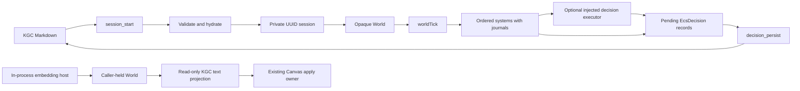

# Knowgrph Agentic Entity Component System PRD/TAD

## Outcome

Knowgrph gains a small native Entity Component System (ECS) that hydrates an opaque in-memory World from KGC Markdown, advances code-injected ordered systems transactionally, validates direct Decisions emitted by those systems plus Decisions and real cost evidence returned by an optional injected executor, projects caller-held World observations through the existing Canvas KGC apply path, and atomically writes only pending `EcsDecision` nodes back to the source document.

The ECS is not a game engine, graph database, agent framework, model gateway, renderer, or deployment service. It is a Dev-only runtime layer whose persistent authority remains KGC.

The upstream source contracts are the sibling Kiro requirements, design, and tasks documents. This combined PRD/TAD is the review and runtime-readiness handoff inside the Knowgrph repository.

## Product Requirements

### Problem

KGC can describe entities and decisions, but it lacks a compact runtime owner for frequently updated numeric component state. Encoding every transient update as graph mutation would make systems expensive, ambiguous, and difficult to roll back. Adding an external ECS would create dependency, ownership, and provenance risk.

### Users

| Persona | Need | Completion signal |
|---|---|---|
| Operator | Start a bounded session from one repository-owned KGC document, advance it, and persist validated decisions | Three exact MCP operations complete with typed results and a `dev-only` boundary |
| System author | Define numeric components and ordered systems without learning a third-party engine | Exact five-function API, deterministic queries, and per-system rollback tests pass |
| Canvas user | See ECS observations through existing graph materialization | Existing KGC text apply seam receives the projection; no temporary Source File or renderer fork exists |
| External MCP client | Discover and call ECS safely through the shipped stdio server | Official SDK initialize/list/call proof passes; invalid calls fail closed |
| Maintainer | Review source, behavior, cost, and release claims independently | Focused checks, protected integration, exact SHAs, and an explicit no-deploy statement are recorded |

### Primary Journey

| Stage | Action | Runtime owner | Durable effect |
|---|---|---|---|
| Start | Call `knowgrph.ecs.session_start` with `kgcPath` | Safe path resolver, KGC validator, hydration, private session store | None |
| Advance | Call `knowgrph.ecs.world_tick` with the returned session id | Async ordered systems, per-system journal, optional decision executor | Valid direct System Decisions and executor-returned Decisions remain pending only when the embedding host supplied the producing code |
| Project | An in-process host projects a caller-held World into KGC text | ECS projection adapter and existing Canvas text apply owner | Existing Canvas graph state only; this is not a fourth MCP/session operation |
| Persist | Call `knowgrph.ecs.decision_persist` | Decision-only atomic persistence | New idempotent `EcsDecision` nodes in the same KGC file |
| Finish | Persistence succeeds or has zero pending decisions | Private session store | Session disposed; no World snapshot retained |

The shipped stdio server deliberately injects no default system and no decision executor. Its default MCP path therefore proves hydration, a model-free zero-system tick with one canonical zero cost log, and zero-pending terminal disposal. Executable domain systems are explicit host code passed through the internal runtime-construction seam; they are never synthesized from caller input or KGC data.

### Product Goals

1. Deliver useful component/query/tick behavior with no external ECS dependency.
2. Keep World state deterministic, opaque, bounded, and ephemeral.
3. Make failure semantics precise: atomic allocation and per-system rollback.
4. Keep cost claims honest: one canonical zero record only after a successful model-free tick and only validated executor-supplied logs for reasoning.
5. Preserve authored KGC content while persisting only validated decisions.
6. Reuse the existing official MCP SDK stdio transport and Canvas graph owner.
7. Complete protected Dev integration without production or Cloudflare mutation.

### Non-Goals

- Physics, collision, multiplayer, durable World snapshots, or a server-hosted game runtime.
- An ECS-owned prompt, model, provider, credential, agent loop, or orchestration graph.
- A new MCP transport, HTTP endpoint, Worker binding, browser tool surface, or public session registry.
- Direct Canvas-store mutation, an ECS renderer, or a second graph representation.
- Persisting component arrays, entity snapshots, deferred outcomes, or cost logs.
- A caller-selectable deploy gate or any ability to open production lanes.
- Backward-compatible aliases for the rejected draft API.

### MoSCoW

| Priority | Scope |
|---|---|
| Must | Typed components, opaque World, atomic entities, ascending query, async transactional tick, KGC hydration, decision-only persistence, exact three MCP tools, private bounded sessions, focused proof |
| Should | Existing-owner Canvas projection and readable `[absent]` degradation |
| Could | Additional systems and component schemas authored by future KGC documents without changing the core API |
| Won't | External ECS dependency, new transport/renderer/datastore, production deployment, compatibility facade |

### Success Metrics

| Metric | Target |
|---|---|
| Public API drift | Exactly five export names |
| Component correctness | At least 100 generated runs per property |
| Hydration stability | Equivalent node permutations produce equal observations |
| Tick failure containment | Only the failing system rolls back; prior commits remain |
| Cost honesty | Exactly one canonical zero log after successful no-reasoning ticks; no fabricated or dropped valid reasoning usage |
| Persistence safety | Idempotent by decision id; validation, write, and pre-rename failures preserve original bytes and pending state |
| MCP surface growth | Exactly three ECS tools and zero new transports |
| Session retention | Zero sessions after terminal success; retryable session after persistence failure |
| Projection performance | 10,000 observed rows projected within the focused benchmark budget |
| Deployment | Zero production, mirror, network, or Cloudflare mutation |

## Technical Architecture

### Runtime Topology



Everything above runs in process and locally. The private three-tool session lane and the standalone caller-held-World projection lane are intentionally disconnected. The diagram includes no deploy node because ECS has no deployment capability.

### Public Runtime Contract

`ecs/index.js` exports only:

```js
createWorld
allocateEntity
registerComponent
query
worldTick
```

`createWorld({ systems, decisionExecutor, clock })` receives ordered systems and optional injected dependencies. There is no public `registerSystem`, component-store object, mutation journal, absence sentinel, hydration API, or session registry.

Supported field types map to `Float32Array`, `Float64Array`, `Int8Array`, `Int16Array`, `Int32Array`, `Uint8Array`, `Uint16Array`, and `Uint32Array`. A private unique Symbol distinguishes missing membership from valid numeric values. Presentation maps that sentinel to `[absent]`.

### World and Query Invariants

- Registering a component validates the entire name/field spec before mutation.
- Allocating an entity validates every initial component/value before reserving an id.
- Failed allocation leaves the id counter and all stores unchanged.
- Growth preserves field values and membership.
- Query returns ascending entity ids in the intersection of all requested components.
- Unknown components fail before mutation.
- Callers cannot enumerate or replace internal stores through the public API.

### Tick Transaction

`worldTick` is asynchronous. Each system receives only a frozen restricted context with `query`, `read`, `write`, `setComponent`, `emitDecision`, and `requestReasoning`; the World and stores are not passed through. Systems run sequentially in construction order, and the runtime opens a new mutation journal for each system:

1. Successful system writes commit and become visible to later systems.
2. A failing system reverses only its own recorded writes.
3. Prior system commits remain.
4. Later systems and decision execution are skipped.
5. The result is a structured failure, not an uncaught integration error.
6. An invalid `emitDecision` fails inside the current system transaction and rolls back that system's writes.

While a tick is open, public `query`, snapshots/projection, and another tick fail closed with `ECS_TICK_IN_PROGRESS`; only the restricted system context can observe its own and prior committed writes. If all systems succeed and request no reasoning, the tick returns exactly one canonical zero cost log from `contracts/cost-log.schema.js`. Failed or concurrent ticks do not claim zero usage.

Each reasoning request that reaches an injected executor must return exactly one valid non-`none` entry in plural `cost_logs`. Canonicalization drops unknown cost fields. A valid log is retained even when the paired Decision is invalid and becomes deferred. A request with no executor, invalid/missing usage, or a timed-out/unavailable executor returns a sanitized deferred outcome without a fake decision, fake usage, or persistent write.

After any structured tick result, the MCP session increments `tickCount` before adding Decisions to pending state. If pending retention then fails because a newly committed Decision conflicts with an existing id or is invalid/noncanonical, the tool returns `ok: false`, `tickCommitted: true`, the committed tick count, canonical cost/deferred evidence, and the unchanged prior pending count. The World changes have already committed, so a client must inspect `tickCommitted` and must not blindly retry that tick. A structured System failure is distinct: earlier System commits and the incremented tick count may remain, but the result does not use this post-tick retention marker.

### KGC Node Models

```yaml
- type: EcsComponentSchema
  properties:
    ecsComponent:
      name: Position
      fields: { x: f32, y: f32 }
- type: EcsEntity
  properties:
    ecsEntity:
      entityRef: player
      components:
        Position: { x: 1, y: 2 }
- type: EcsDecision
  properties:
    ecsDecision:
      decisionId: decision-1
      decisionType: world_tick_result
      entityRef: player
      payload: {}
      producedAt: 2026-07-20T00:00:00.000Z
```

Hydration requires at least one `EcsComponentSchema` and one `EcsEntity`, validates and indexes all three ECS node types, ignores unrelated nodes, and sorts schemas/entities by stable identifiers before materialization. `decisionType` is exactly `dialogue_outcome`, `quest_flag`, or `world_tick_result`. Duplicate/invalid persisted Decisions, duplicates in schemas/entities, unknown component references, unsupported types, missing required data, or invalid values fail the whole start before session insertion.

### Decision Persistence

The persistence owner reads decisions only from the resolved live session. The MCP caller cannot provide them. The session binds the start-time canonical path and device/inode identity. Persistence revalidates root containment, canonical path, and identity inside the same-path process queue, reads through a no-follow file handle, and repeats validation before the exclusive sibling-temp write and atomic rename. It accepts either the session identity or a bounded replacement lineage recorded by prior same-process queued ECS renames, allowing two already-open sessions to append without trusting an external swap. It deduplicates against existing `decisionId` values, parses through `readKgcNodeState`, byte-splices only serialized Decision nodes into block `flow.nodes`, and preserves unrelated frontmatter and the Markdown body. Separate OS writers remain fenced by the repository collaboration lease; this feature does not claim a distributed file lock.

Success, including zero pending decisions, disposes the session. Validation/write/rename failure leaves the source unchanged, removes temporary residue where possible, and retains pending decisions for retry. If the source commit succeeds but World disposal fails, the session retains its pending Decisions and the replacement file identity so the next call performs an idempotent retry and closes; callers must not infer that `sessionRetained` means the source was never committed.

### Canvas Projection

The projection adapter snapshots a caller-held World, converts those read-only observations to KGC Markdown text, and calls `applyChatKgcDocumentTextToCanvas({ name, text })`, an extracted seam within the existing chat/KGC Canvas owner. It creates no temporary Source File, owns no Canvas store, and is not wired into the private three-tool MCP session. Snapshot/apply failures are structured, sanitized, and leave World state unchanged.

### MCP and Invocation Contract

| Tool | Invocation metadata | Arguments |
|---|---|---|
| `knowgrph.ecs.session_start` | `/ecs.session-start #agentic-ecs @source.frontmatter` | `{ kgcPath, scope?, binding? }` |
| `knowgrph.ecs.world_tick` | `/ecs.world-tick #agentic-ecs @ecs-session` | `{ sessionId, input?, scope?, binding? }` |
| `knowgrph.ecs.decision_persist` | `/ecs.decision-persist #agentic-ecs @ecs-session` | `{ sessionId, scope?, binding? }` |

The existing `mcp/server.js` remains the official MCP SDK stdio owner. Input schemas are closed; the shared output envelope requires `ok` and `execution_boundary` while allowing tool-specific result fields. Unknown input fields, scope/binding mismatch, unsafe paths, missing/expired sessions, and runtime failures return structured errors. Every result states `execution_boundary: "dev-only"`.

The stdio owner does not infer systems from `input`, accept a caller-authored decision, or configure a model. An embedding host may construct the private ECS runtime with reviewed system functions and an optional executor; the public MCP argument shapes remain unchanged.

`kgcPath` must realpath to a `.md` file beneath the configured repository root. Session start binds and reads the validated file through a no-follow handle whose identity must match the check. Persistence repeats the root/path/identity checks inside its serialized operation. Root-escaping traversal, symlink escape, parent/target swaps, missing files, directories, and non-Markdown targets fail before source use; normalized paths that remain beneath the root are allowed.

### Session Lifecycle

The MCP runtime stores sessions in a private bounded map keyed by UUID. It applies a finite TTL, maximum count, and lazy expiry sweep. It never serializes World internals.

| Event | Result |
|---|---|
| Valid start | Insert one live session |
| Tick | Reuse live session and update pending decisions |
| Successful persistence | Dispose session |
| Zero-pending persistence | Dispose session |
| Persistence failure | Retain session and pending decisions |
| Source committed, disposal failed | Retain session and replacement identity for idempotent close retry |
| Inactive TTL expiry with successful disposal | Remove the session without source mutation |
| Expiry disposal failure | Retain the session, extend its TTL, and expose a retryable disposal error |
| Capacity reached | Return typed error; do not silently evict live work |

## Security, Cost, and Operations

| Concern | Design response |
|---|---|
| Filesystem escape | Realpath containment plus file identity, no-follow reads, and revalidation inside the persistence turn |
| Secret leakage | ECS loads no credentials. Allowlists constrain field shape, not retained string content: hosts must keep secrets out of Decision identifiers/fields/payload, deferred request identifiers, and canonical Cost_Log fields. Sanitized thrown-error/projection metadata excludes source bytes, prompts, arbitrary codes, function names, and World internals |
| Network | The canonical no-system/no-executor stdio construction issues no outbound request; an embedding host exclusively owns any external behavior of injected Systems and its executor |
| Model spend | A canonical zero record is emitted only after a successful no-reasoning tick; nonzero usage comes only from validated injected-executor results and is never invented. External work inside an injected System is host-owned and outside the ECS cost ledger |
| Persistence corruption | Validate, same-path process queue, sibling-temp write, atomic rename, failure retention |
| Memory leak | TTL, max session count, lazy sweep, terminal disposal |
| Runtime duplication | Reuse official stdio server, KGC contract, cost schema, and Canvas apply owner |
| Deployment | Capability absent; Prod and Cloudflare remain external and unauthorized |

The new runtime adds no production infrastructure. Its canonical no-system/no-executor stdio path has no external service cost; an embedding host owns any service cost incurred by injected Systems or its optional executor. Base TCO is repository code, focused tests, and bounded process memory.

## Validation and Evidence

### Correctness Properties

The focused `fast-check` suites cover all eight typed-array selections, write/read round trips, capacity growth, atomic schema/allocation rejection, absence, ascending intersections, hydration order invariance, malformed hydration, ordered system visibility, per-system rollback, tick determinism, zero-cost accounting, reasoning deferral, idempotent decision persistence, failure retention, and read-only projection. Fixed regressions cover parent/target swap races, handle-bound source reads, concurrent same-path writes, post-commit pending-retention failures, metadata sanitization, valid-usage retention, reserved keys, block-style YAML properties, non-finite projection values, duplicate source decisions, and impossible timestamps.

Fixed tests cover the exact public export set, three KGC node schemas, exact three-tool discovery, closed input schemas plus the extensible shared output envelope, official SDK stdio handshake and default zero-system lifecycle, safe-path/session lifecycle, Canvas seam wiring, collaboration selector routing, and no-copy/dependency boundaries.

### Proof Layers

| Layer | Required evidence | Claim boundary |
|---|---|---|
| Source | Focused unit, PBT, schema, MCP, Canvas, typecheck, hygiene, and diff checks | Implementation behavior only |
| Browser/runtime | Existing-owner projection or stdio client output when exercised | Local Dev only |
| Protected integration | Integration Gate success for exact PR commit | Merged Dev source |
| Deployment | Not requested and not run | No production claim |

### Traceability

| Requirement | Primary owners | Proof class |
|---|---|---|
| Native five-name ECS | `ecs/{componentStore,world,query,worldTick,index}.js` | Unit + PBT + export test |
| Deterministic hydration | `contracts/kgc-document.schema.js`, `ecs/{kgcNodeContract,hydration}.js` | Schema + unit + PBT |
| Decision-only persistence | `ecs/decisionPersistence.js` | Unit + integration + PBT |
| Canvas projection | `ecs/renderingLayer.js`, `canvas/src/features/chat/chatKgcCanvasApply.ts`, `canvas/src/features/agentic-ecs/agenticEcsCanvasProjection.ts` | Focused Canvas test + typecheck |
| Exact MCP/session runtime | `mcp/{ecs-tool-contract,local-tool-contract,server}.js` plus private ECS runtime modules | Contract + official SDK stdio + lifecycle tests |
| Collaboration selection | `docs/collaboration-runtime-contract.md`, `package.json`, `scripts/__tests__/collaboration-contract.test.mjs` | Focused selector + affected runtime gate |
| Invocation truth | Agentic Canvas OS dictionaries, FACTS, and monthly todo shard | `npm run docs:check` + protected docs PR |

## Completion Conditions

This document may change to `runtime-ready` only after:

1. focused ECS, KGC, MCP, Canvas, typecheck, collaboration, hygiene, and diff checks pass;
2. the exact Agentic Canvas OS invocation-catalog SHA is protected and pinned;
3. the final app/docs pair passes the collaboration gate;
4. the Knowgrph protected Integration Gate accepts the exact ECS commit; and
5. the final handoff states that Prod, mirrors, network services, and Cloudflare were untouched.
