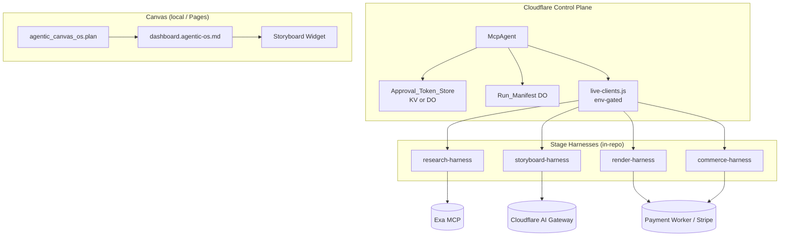

# Knowgrph — Agentic OS Follow-On PRD/TAD

Parent SSOT: [`knowgrph-agentic-os-prd-tad.md`](knowgrph-agentic-os-prd-tad.md) v0.4.0 (Must-tier Agentic OS + MCP Gateway federation). This document closes the three **P1/P2 follow-on tracks** called out there: **HITL Gate Service completion**, **live stage harness wiring on the control plane**, and **Agentic Canvas OS dashboard UI lanes**.

For current remote MCP onboarding, start with
`docs/documents/knowgrph-mcp-onboarding-index.md`, then use
`docs/documents/knowgrph-mcp-install-contract.md` for the canonical
public-discovery vs control-plane endpoint boundary.

## Overview

The Must-tier increment shipped read-only OS visibility and discovery-first MCP Gateway federation. What remains is **closing the spend-safety and live-orchestration loops** and **rendering the Agentic Canvas OS dashboard on Canvas** — all native-in-repo, reusing modules that already exist locally with passing tests.

| Track | Spec anchor | Local code status | Deployed gap |
|---|---|---|---|
| **A — HITL Gate Service** | tasks 4.1–4.5 | Issuance, verify, single-use, rejection, Director boundaries **implemented in-repo** with in-memory store | Durable token store on Worker; remote issuance API |
| **B — Live stage harnesses** | tasks 3.x / 12.x | Exa research live path + env-gated clients **implemented**; storyboard wireable; render/commerce **async scaffold** | Worker secrets + one golden-path live proof |
| **C — Dashboard UI lanes** | Agentic Canvas OS PRD + companion | `knowgrph.agentic_canvas_os.plan` dry-run manifest **implemented** | Canvas Storyboard render of dashboard doc + lane inspectors |

## Four-Lens Overview

| Lens | Follow-on constraint | Key decision |
|---|---|---|
| **Min-Viable-Max-Value** | One golden-path live Director run + durable HITL on Worker before expanding dashboard lanes | Ship Track B proof before Track C visual polish |
| **TCO-Zero** | Live stages opt-in via `KNOWGRPH_LIVE_CLIENTS` + per-provider secrets; default remains mock/zero-spend | No live call without explicit env + approval token |
| **Token Economics** | Every live harness emits Cost_Log via existing schema; Exa/BytePlus bounded by gate + daily budget | Cost logs validated by `validateCostLog()` before aggregation |
| **Harness-First** | Stage tools remain typed input → harness → typed output; HITL wraps spend boundaries only | Reuse `mcp/video-remix/*` modules — no parallel gate implementation |

---

## PRD

### Problem Statement

Operators and external agents can discover capabilities and inspect harness state (Must-tier), but **approved live spend** and **dashboard operator UX** are incomplete: HITL tokens work locally but lack a durable Worker store; live Exa research is env-gated but render/commerce async paths need deployment proof; Agentic Canvas OS plans exist as dry-run manifests without a Canvas-rendered operator dashboard.

### Personas

| Persona | Need | Success |
|---|---|---|
| **Operator** | Approve a render/checkout gate and see a live stage execute once | One approved live Director run completes research → storyboard with cited evidence |
| **External agent** | Present approval tokens that survive Worker restarts | Durable Approval_Token store on control-plane; single-use enforced after spend |
| **Solo founder** | Inspect cross-repo build state on Canvas, not only JSON manifests | Dashboard document renders on Storyboard Widget with lane nodes |
| **Maintainer** | Prove spend isolation after follow-on deploy | R11 smoke tests pass; blocked run still shows zero estimated cost |

### User Stories

| Story | Acceptance (condensed) | VCC translation |
|---|---|---|
| **PRD-FO-1**: Durable HITL on Worker | Given a minted Approval_Token on the control plane, when the Worker restarts, then verify/consume still succeeds within TTL | `Verify RunManifestStore-adjacent token DO or KV persistence tests pass and a token minted before simulated restart verifies after restart` |
| **PRD-FO-2**: Live Exa research behind gate | Given `KNOWGRPH_LIVE_CLIENTS=1`, Exa key, and `paid-model-call` token, when research stage runs, then ≥3 cited sources return and Cost_Log validates | `Verify research-harness live fixture or integration test with mock fetch records ≥3 sources and validateCostLog() passes on emitted log` |
| **PRD-FO-3**: Live storyboard behind gate | Given AI Gateway chat URL + BytePlus model env and approval token, when storyboard runs, then KGC doc emits with nodes == planned shots | `Verify storyboard harness test output parses as kgc-computing-flow/v1 with flow.nodes.length == shotCount` |
| **PRD-FO-4**: Render/commerce async live path | Given render/commerce endpoints configured and matching gate tokens, when async Director live run executes, then queue/Stripe clients invoked once per approved stage | `Verify director-live-run tests pass with injected live clients; no provider call when gate withheld` |
| **PRD-FO-5**: Dashboard Canvas render | Given `knowgrph.agentic_canvas_os.plan` output, when operator opens dashboard doc in Canvas, then frontmatter-flow projects lanes as Storyboard nodes | `Verify dashboard.agentic-os.md applies through applyChatKgcWorkspaceDocumentToCanvas without duplicate pipeline` |
| **PRD-FO-6**: Market Radar lane inspect | Given dry-run market report in manifest, when browser-local inspection runs, then evidence levels and source cards readable; no credential fields | `Verify companion lane payload schema tests; redaction asserts no cookie/token fields` |

### Success Metrics

| Metric | Baseline | Target | Timeline |
|---|---|---|---|
| HITL unit + PBT tests (local) | passing | remain passing after durable store | Track A |
| Live harness unit tests | passing | +1 deployed golden-path capture | Track B |
| Agentic OS blocked live run (zero spend) | proven locally | proven on deployed Worker | Track B |
| Dashboard dry-run plan tool | implemented | Canvas render of dashboard doc | Track C |
| Time-to-value — first live approved stage | n/a | ≤ 5 operator steps (env, deploy, mint token, submit run, read manifest) | Track B gate |
| Token cost / month (follow-on orchestration) | unmeasured | ≤ $25 at demo load (bounded by gates + mock default) | Ongoing |
| Monthly TCO (follow-on infra) | $0 | $0 delta (reuse Worker DO/KV; no new vendor) | Ongoing |

### MoSCoW Priority

| Tier | Item | ROI rationale |
|---|---|---|
| **Must** | Durable HITL token store on control-plane Worker | Unblocks trustworthy remote approval; local issuance already built |
| **Must** | Deployed golden-path: gated live Exa research + storyboard | Proves Track B with smallest paid surface |
| **Should** | Async live render + commerce on Worker | Requires async harness path; scaffolds exist in `live-clients.js` |
| **Should** | Dashboard doc → Canvas Storyboard render | High operator value; reuses existing frontmatter-flow |
| **Could** | Market Radar / browser evidence live capture | Companion contracts exist; live capture approval-gated |
| **Could** | Learning Loop skill promotion UI | Local-first; promotion already approval-gated in companion |
| **Won't** | Fifth MCP proxy tier | ADR-4 forbids |
| **Won't** | Vercel/AWS product tiers | ADR-3 forbids |

### Min-Viable Scope (Follow-On Sprint 1)

1. Durable Approval_Token persistence on `knowgrph-mcp` Worker (KV or DO adapter implementing existing store interface).
2. Deploy control plane with `KNOWGRPH_LIVE_CLIENTS=1` + Exa + AI Gateway chat vars.
3. One operator-captured golden-path run: approved research + storyboard, manifest persisted, demo-pack section populated.
4. Dashboard markdown from `knowgrph.agentic_canvas_os.plan` opens in Canvas via existing apply path.

Explicitly excludes: full Market Radar live browser capture, Starter Repo file writes, skill auto-promotion.

### Out of Scope

- New persistent OS-level database beyond token/run manifest stores already on Worker.
- Remote HTTP exposure of local-only tools (SuperAgent, pipelines) — surface separation unchanged.
- Automatic approval or bypass of any gate.
- Multi-tenant auth on control-plane read-back (deferred per parent Open Question 5).

---

## TAD

### Journey → System Mapping

| Journey stage | Workflow | Data flow | Orchestration/Harness | Component |
|---|---|---|---|---|
| Operator approves research | Mint token → re-submit Director with `approvals[]` | Token → DO/KV store → verify at research boundary | Sequential; max 1 research round by default | `approval-token-issuer.js`, `research-harness.js` |
| Operator approves storyboard | Same token flow | Evidence pack → BytePlus via AI Gateway → KGC doc | Sequential after research | `live-clients.js`, storyboard harness |
| Operator views dashboard | Open Source Files dashboard doc | manifest JSON + markdown → Canvas graph | Zero-token UI projection | `agentic-canvas-os` plan tool, Canvas apply |
| External agent discovers live path | capabilities → control-plane MCP | Run_Manifest DO read-back | Agentic loop; max 8 iterations | `tool-registry.mjs`, `video-remix-runtime.js` |

### Topology (Follow-On delta)

**Version**: 2.2.0 — 2026-07-03 (extends parent Topology v2.1.0)

| Node | Role | Type | Connects to | Connection type | Data residency |
|---|---|---|---|---|---|
| Approval_Token_Store | HITL persistence | Worker KV or DO (new binding) | `approval-token-issuer.js` adapter | sync read/write | CF region |
| Live_Stage_Client_Resolver | Env-gated provider wiring | Pure module (`live-clients.js`) | Exa, AI Gateway, Strytree, payment worker | HTTPS via Worker env | Provider regions |
| Dashboard_Document | Operator UI SSOT | Source Files markdown + manifest | Canvas Storyboard Widget | local/CF Pages | Git + optional D1 mirror |



### Orchestration/Harness Flow: Live Director Stage Pipeline

**Trigger**: `knowgrph.video_remix.run` with `mode:"live"` and growing `approvals[]`
**Topology pattern**: Agentic loop | **Max iterations**: 8 | **Circuit-breaker**: `state in {blocked, budget_exceeded, approval_required, verification_failed}`
**Token budget**: research ~800+600, storyboard ~1200+900 @ AI Gateway cache — est. < $0.03/stage at demo load

| Role | Component | Input schema | Output schema | Cost log | Fallback |
|---|---|---|---|---|---|
| Dispatcher | `tool-registry.mjs` / Director | Run args + approvals[] | Routed stage | — | `approval_required` |
| Executor | Stage harness + live client | Typed stage input | Evidence/KGC/assets/session | ✓ required | mock client when env absent |
| Observer | Cost log + Run_Manifest DO | Harness output | Persisted manifest | ✓ | persistence failure flagged inline |
| Consumer | Operator / external agent | Run_Manifest | UI / MCP response | — | upstream error |

**Postconditions**: no unapproved provider call; Cost_Log validates or lands in `validationFailures`; token consumed only after permitted spend (task 4.3).

### Workflow: HITL Token Mint → Spend → Consume

**Trigger**: Operator or Director raises `approval_required` for a gate id.

**Happy path**:
1. Operator calls issuance surface (local: in-process issuer; Worker: new `POST` mint route or embedded in Director response metadata — implementer chooses minimal diff).
2. Token stored in Approval_Token_Store with `issuedAt`, `gateId`, `ttlMs` (15 min default).
3. Operator re-submits run with token in `approvals[]`.
4. `verifyGateToken` passes at stage boundary; spend executes via live or mock client.
5. `consumeSeam()` marks token used; second verify fails closed.

**Error paths**:
- Expired token → `approval_required`, no spend.
- Reused token → `consumed`, no spend.
- Unknown gate id → `ApprovalTokenIssueError`, no mint.

**Postconditions**: `paidProviderCalls` unchanged when gate withheld; R11 smoke tests unchanged.

### Component Specifications (Follow-On)

**Component**: `mcp/video-remix/approval-token-issuer.js`
**Status**: Implemented locally | **Gap**: Worker durable `store` adapter
**VCC**: `node --test mcp/__tests__/approval-token-single-use.test.mjs mcp/__tests__/approval-rejection-path.test.mjs` exits 0

**Component**: `mcp/video-remix/approval-gate-guard.js`, `director-gates.js`
**Status**: Implemented | **VCC**: `node --test mcp/__tests__/director-gates-enforcement.test.mjs` exits 0

**Component**: `mcp/video-remix/live-clients.js`, `live-stage-clients.js`, `director-live-run.js`
**Status**: Exa + storyboard live wireable; render/commerce scaffold (`requiresAsyncHarness`)
**VCC**: `node --test mcp/__tests__/director-live-run.test.mjs mcp/__tests__/research-harness.test.mjs` exits 0

**Component**: `knowgrph.agentic_canvas_os.plan` (local MCP)
**Status**: Dry-run manifest implemented | **Gap**: Canvas dashboard render automation
**Owner**: `mcp/agentic-canvas-os-runtime.js` (or successor), `mcp/director-lanes.js` builders

**Component**: Agentic Canvas OS lanes (Market Radar, browser evidence, starter repo, learning loop)
**Status**: P0 dry-run payloads per companion | **Gap**: live capture + Canvas lane nodes
**Owner**: [`knowgrph-mcp-agentic-os-prd-tad.companion.md`](knowgrph-mcp/knowgrph-mcp-agentic-os-prd-tad.companion.md)

### ADR-FO-1: Worker KV for Approval_Token store (vs new DO class)

**Status**: Proposed | **Date**: 2026-07-03

**Decision**: Implement durable HITL storage as a **KV namespace** first, accessed through the existing in-memory store **interface** from `approval-token-issuer.js` — smallest diff, zero new DO class.

**Alternatives**: dedicated Approval Token DO (stronger consistency, higher ops); external Redis (vendor + TCO).

**TCO**: KV free tier at demo load; $0 delta vs in-memory for local dev.

### ADR-FO-2: Live stages default mock; opt-in via env

**Status**: Accepted (implemented in `live-clients.js`)

**Decision**: `KNOWGRPH_LIVE_CLIENTS` + per-provider secrets required for any live call; unset env → deterministic mock → zero provider spend.

### Deployment Strategy (Follow-On)

1. `npm run runtime:test` — full gate locally.
2. `wrangler secret put` for Exa/BytePlus/payment keys (operator-only).
3. Deploy `knowgrph-mcp` Worker with KV binding for tokens + live env vars per [`knowgrph-acos-deploy-runbook.md`](../knowgrph-acos-deploy-runbook.md) (Cloudflare-only steps; ignore AWS/Vercel sections per ADR-3).
4. Capture one golden-path manifest + demo-pack URLs.
5. Open generated `dashboard.agentic-os.md` in Canvas.

### Validation

```bash
# Track A — HITL
node --test mcp/__tests__/approval-token-single-use.test.mjs \
  mcp/__tests__/approval-rejection-path.test.mjs \
  mcp/__tests__/director-gates-enforcement.test.mjs

# Track B — Live harnesses
node --test mcp/__tests__/research-harness.test.mjs \
  mcp/__tests__/director-live-run.test.mjs \
  cloudflare/workers/knowgrph-mcp/__tests__/tool-registry.test.mjs

# Parent Must-tier regression
node --test mcp/__tests__/os-status-runtime.test.mjs mcp/__pbt__/os-status.pbt.test.mjs
npm run runtime:test
```

### PRD ↔ TAD Traceability

| Line |
|---|
| `PRD-FO-1 ↔ TAD-Approval_Token_Store ↔ VCC "token survives simulated Worker restart verify path"` |
| `PRD-FO-2 ↔ TAD-research-harness-live ↔ VCC "≥3 cited sources + validateCostLog passes"` |
| `PRD-FO-3 ↔ TAD-storyboard-harness-live ↔ VCC "kgc-computing-flow/v1 nodes == shotCount"` |
| `PRD-FO-4 ↔ TAD-director-live-run ↔ VCC "director-live-run tests pass; no call when gate withheld"` |
| `PRD-FO-5 ↔ TAD-Dashboard_Document ↔ VCC "dashboard doc applies via existing Canvas pipeline"` |
| `PRD-FO-6 ↔ TAD-Market_Radar_lane ↔ VCC "companion payload tests; no credential fields"` |

### Execution Sequence

1. **Track A** — Worker KV adapter + deploy; verify token persistence.
2. **Track B** — Enable live Exa + storyboard env; golden-path capture on deployed Worker.
3. **Track B2** — Async render/commerce live clients (after harness async seam complete).
4. **Track C** — Canvas dashboard render + lane inspector nodes from dry-run manifest.

*Follows [PRD & TAD Guidelines v1.3.0](https://huijoohwee.github.io/guidelines/prd-tad-guidelines.md). Parent: [`knowgrph-agentic-os-prd-tad.md`](knowgrph-agentic-os-prd-tad.md) v0.4.0.*
