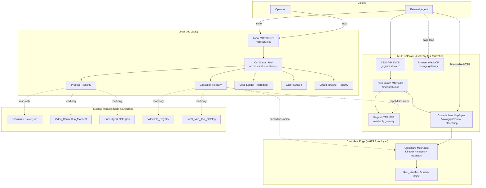

# Knowgrph — Agentic OS PRD/TAD

SSOT upstream: `.kiro/specs/knowgrph-agentic-os/requirements.md` (EARS acceptance criteria, Glossary, MoSCoW) and `.kiro/specs/knowgrph-agentic-os/design.md` (components, data models, correctness properties). This document weaves both into the combined PRD/TAD form established by `knowgrph-tech-stack-document.md`, and **consolidates** the former `knowgrph-mcp-agentic-canvas-os-prd-tad.md` (v0.3.1): the Video_Remix Director connector content from that document is retained here as a native-in-repo harness aggregated by the Agentic OS, while its Vercel product tier, AWS Agent-API fallback, and AWS AgentCore wrapper lane are **removed from the runtime topology** per ADR-3.
## Overview
`knowgrph` already runs nine independent AI/automation harnesses — FloatingPanel Chat → KGC, the AI Agents Memory Layer, the Visual Annotation Engine, the HTML Video Renderer, the Video Intelligence pipeline (VideoDB Director MCP), the SuperAgent Harness, the AI Showrunner, the `knowgrph.video_remix.run` Director (research → storyboard → render → commerce, formerly specified in the Agentic Canvas OS PRD/TAD), and the Swarm Prediction Engine — each with its own run-state shape, its own tool surface, and its own circuit-breaker. The **knowgrph Agentic OS** is a thin, OS-level unification layer over these *already-existing* harnesses: the smallest set of cross-harness primitives (process visibility, capability discovery, cost/token accounting, approval-gate consistency, circuit-breaker observability) that lets an Operator or an External_Agent reason about *all* running knowgrph agent work through one surface — the **Os_Status_Tool** (`knowgrph.os.status`) — instead of learning each harness's bespoke shape individually.

Every capability is **read-only aggregation at call time**. The Agentic OS introduces zero new persistent datastore, zero new runtime process, and zero new dependency by default (Requirement 7). It does not modify, weaken, or duplicate the existing R11 Spend_Isolation_Boundary or the Approval_Gate_Invariant (Property 1) established in `knowgrph-acos-mcp-connector`.

**Runtime surfaces (native-in-repo only)**: the Os_Status_Tool is reachable through the local stdio MCP server (`mcp/server.js`) and, WHERE deployed, the Cloudflare `McpAgent` worker (`cloudflare/workers/knowgrph-mcp`). There is no Vercel frontend tier, no Supabase datastore, and no AWS Agent-API / AgentCore tier anywhere in this topology — those tiers, previously documented in the Agentic Canvas OS PRD/TAD, are removed by ADR-3 and their responsibilities are absorbed by existing in-repo surfaces (CF Pages for the product frontend, the Cloudflare `McpAgent` for remote MCP access, CF D1/R2/KV/Durable Objects for all persistence).

**MCP Gateway (discovery-first federation)**: Knowgrph does not introduce a fifth monolithic proxy gateway. Instead, the **MCP Gateway contract** is the existing four-surface topology — local stdio, Pages HTTP (`/knowgrph/mcp`), browser WebMCP, and Cloudflare `McpAgent` (`/knowgrph/control-plane/mcp`) — unified by shared contracts in `canvas/src/features/agent-ready/` and `contracts/*.schema.js`. External agents discover the full capability surface through DNS-AID → Link headers → `.well-known` MCP server card → `knowgrph.os.status` (`view:"capabilities"`) on local stdio, or through the control-plane tool listing on the deployed Worker. Spend-bearing orchestration routes exclusively through the Cloudflare control plane; read-only discovery routes through Pages HTTP MCP at zero token cost.

**AI Agent readiness**: Any stdio-capable, HTTP MCP, or WebMCP host can operate Knowgrph harnesses today. Local stdio exposes the richest tool surface (pipelines, SuperAgent, Video Remix Director, browser bridge, memory, OS status). Deployed agents use Pages HTTP MCP for read-only Source Files retrieval and the control-plane Worker for approval-gated Director runs. The Agentic OS layer gives agents a single onboarding call (`capabilities`) instead of learning each harness catalog independently.

**Video_Agent companion (runtime-ready)**: the Video_Remix Director now includes live BytePlus render resolution, narrative coherence/token ceiling guards, and a zero-spend Editing_Stage that emits a single `Edited_Video_Reference`; see [`knowgrph-agentic-os-video-agent-prd-tad.companion.md`](knowgrph-agentic-os-video-agent-prd-tad.companion.md).
## Four-Lens Overview

| Lens | Applied Constraint (this feature) | Key Decision |
|---|---|---|
| **Min-Viable-Max-Value** | Ship the combined Os_Status_Tool through the existing Local_Mcp_Tool_Catalog with all five read views: `process_list`, `capabilities`, `cost_summary`, `gate_catalog`, and `circuit_breakers` | Keep the surface to one read-only tool and avoid a new OS datastore, scheduler, dependency, or external tier |
| **TCO-Zero** | Every registry computed at read time from files/state that already exist; no new D1 table, R2 bucket, KV namespace, or Durable Object class; no external tier (Vercel/Supabase/AWS) to provision or pay for | Reuse `contracts/*.schema.js`, `mcp/local-tool-contract.js`, `knowgrph.vdeoxpln.list` instead of any new store — 12-month TCO delta is $0 (see ADR-2); removing the AWS/Vercel tiers removes their residual free-tier-overrun and ops-audit exposure entirely (ADR-3) |
| **Token Economics** | The Os_Status_Tool performs zero model calls on any of its views | Every call emits a Cost_Log with `estimated_cost_usd`, `prompt_tokens`, `completion_tokens` computed as exactly `0` — never clamped — so a non-zero value surfaces as a defect, not a suppressed metric (Requirement 6.4) |
| **Harness-First** | The Agentic OS is not a new harness with its own model calls; it is a read-time projection over existing harnesses' already-typed contracts | One combined tool (`knowgrph.os.status`) chosen over four separate tools — see ADR-1 — to minimize the surface an External_Agent must learn while still exposing distinct, independently-testable read views |

## PRD

### Problem Statement
An Operator today must individually query each of three run-lifecycle sources (Showrunner `Pipeline_Run`, Video_Remix `Run_Manifest`, SuperAgent `state.json`) to answer "what is running right now?" — a 3–5 minute manual process across bespoke tool shapes. An External_Agent must separately call `knowgrph.vdeoxpln.list`, the local MCP tool catalog, and the Cloudflare `McpAgent` `tools/list` to discover the full set of callable capabilities. Cost/token spend and approval-gate state are similarly fragmented across harness-specific emission points. The opportunity is a single, read-only, zero-cost aggregation surface — not a rebuild of any harness's internals.

Additionally, the former Agentic Canvas OS PRD/TAD spread the product runtime across three vendors (Cloudflare control plane + Vercel product tier + AWS fallback/AgentCore tier), creating a documentation-vs-runtime drift risk, a per-vendor ops audit burden, and two keyless-forwarder tiers whose only role was stack-mandate compliance. With that mandate expired, the fragmentation is pure cost: the pain is three deploy pipelines, three secret-audit surfaces, and topology docs that must reconcile three vendors for one product. The opportunity is consolidation to the native-in-repo Cloudflare + local stack that already carries 100% of the intelligence and spend-bearing paths (ADR-3).

### Personas

| Persona | Need | Success |
|---|---|---|
| **Operator** | See all in-flight/recent harness work, real spend, and pending approvals from one place | ≤ 1 Os_Status_Tool call answers "what is running right now?" (down from 3–5 min across 3+ tools) |
| **External_Agent** | Discover every callable capability across the three existing catalogs without three separate calls | One `knowgrph.os.status` call with `view:"capabilities"` returns the full union, deduplicated by tool id |

### User Journey Flow: Operator — Answer "what is running right now?"

| Stage | Action | Touchpoint | Pain Point | Opportunity |
|---|---|---|---|---|
| **Trigger** | Operator wants to know what harness work is in flight before starting new work | Local MCP client (stdio) → `mcp/server.js` | Must remember and query 3+ bespoke tool shapes (`knowgrph.showrunner.run_status`, Video_Remix run read, SuperAgent `state.json` inspection) | One `knowgrph.os.status` call with `view:"process_list"` |
| **Discover** | Operator calls `knowgrph.os.status` (`view:"process_list"`) | Os_Status_Tool → Process_Registry | Unsure which harnesses are even queryable right now | Response's `unavailableSources` names exactly which harness state was unreadable, with no failed call |
| **Engage** | Operator reviews normalized `Process_Entry[]` across Showrunner/Video_Remix/SuperAgent | Os_Status_Tool JSON response | Cross-harness status vocabulary differs (`awaiting_review` vs `approval_required` vs `created`) | Normalization to `{ processId, harness, status, startedAt, sourceRef }` preserves the source-native status string without inventing a fourth vocabulary |
| **Complete** | Operator identifies the run needing attention and dispatches to that harness's own tool | Harness-specific tool (`knowgrph.showrunner.approve_stage`, etc.) | Os_Status_Tool is read-only by design; it never resolves the action itself | Explicit non-goal (Out of Scope): the Agentic OS never approves or advances a run — it only surfaces what needs attention |
| **Return** | Operator re-checks status after taking action | Same Os_Status_Tool call | No caching staleness risk since every call re-reads state | Every call is a fresh read; no invalidation logic needed |

### User Journey Flow: External_Agent — Discover callable capabilities

| Stage | Action | Touchpoint | Pain Point | Opportunity |
|---|---|---|---|---|
| **Trigger** | External_Agent onboarding to the knowgrph MCP surface needs the full capability list | MCP client → `mcp/server.js` (or, WHERE deployed, Cloudflare `McpAgent`) | Must call `knowgrph.vdeoxpln.list`, the local tool catalog, and (if reachable) the Cloudflare catalog separately | One `knowgrph.os.status` call with `view:"capabilities"` |
| **Discover** | Agent calls `knowgrph.os.status` (`view:"capabilities"`) | Os_Status_Tool → Capability_Registry | Duplicate tool ids across catalogs create ambiguity about which catalog is authoritative | De-duplication by `toolId` with `sourceCatalogs[]` naming every catalog that declared it |
| **Engage** | Agent inspects `Capability_Entry[]` for `toolId`, `owningHarness`, `schemaRef` | Os_Status_Tool JSON response | Unknown whether the Cloudflare `McpAgent` surface is even deployed in this environment | `unreachableCatalogs[]` names exactly which optional catalog was unreachable, without failing the call |
| **Complete** | Agent selects and calls the target capability directly (e.g. `knowgrph.video_remix.run`) | Target harness's own MCP tool | — | The Os_Status_Tool never proxies the actual capability call; it is discovery-only |
| **Return** | Agent re-queries after a new harness/tool is deployed | Same Os_Status_Tool call | No registry to keep in sync manually | Union is computed at read time, so newly deployed catalogs appear automatically |

### User Stories (from requirements.md, condensed)

| Story | Acceptance (condensed) | VCC translation |
|---|---|---|
| **PRD-AOS-1**: Operator visibility across in-flight harness work | Os_Status_Tool `process_list` returns one Process_Entry per readable Pipeline_Run/Run_Manifest/Superagent_Run state source | `Verify the process-list response contains one Process_Entry per readable state source found on disk at call time, with no existing Harness state file modified` |
| **PRD-AOS-2**: Unified capability/tool discovery | Capability_Registry returns the union of the 3 existing catalogs (Vdeoxpln_Registry, Local_Mcp_Tool_Catalog, Cloudflare_Mcp_Agent) | `Verify the response tool-id set equals the union of the three existing catalogs' tool-id sets recorded in the test fixture, with none of the three source catalog files modified` |
| **PRD-AOS-3**: Unified cost/token ledger with coverage-gap detection | Cost_Ledger_Aggregator sums valid Cost_Log entries and normalized Credit_Ledger events per harness, flags Cost_Emission_Gap harnesses | `Verify every included Cost_Log-shaped entry passes contracts/cost-log.schema.js validateCostLog(), every Credit_Ledger source event passes contracts/credit-ledger.schema.js validateCreditLedgerEvent(), and every failing entry is in the validation-failures list, with schema files unmodified` |
| **PRD-AOS-4**: Approval-gate consistency across harnesses | Gate_Catalog lists the six canonical gate ids plus the Showrunner stage-approval boundary, read/describe-only | `Verify APPROVAL_GATE_ID_VALUES, APPROVAL_TOKEN_TTL_MS, and the R11 secret-scan smoke tests are byte-identical before and after this increment` |
| **PRD-AOS-5**: Circuit-breaker bound observability | Circuit_Breaker_Registry reports each harness's already-configured bound and current iteration count, read-only | `Verify no Harness configuration file, retry counter, or circuit-breaker state file changes value as a result of a read call (before/after snapshot diff is empty)` |
| **PRD-AOS-6**: One MCP surface for OS-level visibility | Os_Status_Tool reachable via Local_Mcp_Tool_Catalog and, WHERE deployed, Cloudflare_Mcp_Agent; structured error on failure; $0 cost log | `Verify every induced registry failure yields { ok:false, errorCode } with the test process exiting 0 and no unhandled rejection logged` |
| **PRD-AOS-7**: TCO-zero and no new dependency by default (guardrail) | Zero new datastore; zero new dependency unless flagged/justified by ADR; zero external tier (no Vercel/Supabase/AWS) | `Verify package manifests and lockfiles (package.json/package-lock.json where present) across canvas/, mcp/, contracts/, cloudflare/workers/knowgrph-mcp show zero added dependencies attributable to this increment; no new D1 migration/R2 bucket/KV namespace/Durable Object class is present in the diff; and no aws/, vercel*, or supabase* runtime configuration is referenced by any Agentic OS module` |
| **PRD-AOS-8**: MCP Gateway discovery for External_Agents | Agent resolves the four-surface MCP topology from DNS-AID + `.well-known` + `knowgrph.os.status` (`view:"capabilities"`) without a fifth proxy tier | `Verify KNOWGRPH_AGENT_READY_BASE_URL agent-ready:check passes; capabilities view returns deduplicated tool ids with sourceCatalogs[]; unreachableCatalogs[] names optional remote catalogs without failing the call` |
| **PRD-AOS-9**: Control-plane MCP gateway for spend-bearing runs | External_Agent invokes approval-gated Director + stage tools over Streamable HTTP at `/knowgrph/control-plane/mcp` with Run_Manifest persistence | `Verify cloudflare/workers/knowgrph-mcp tool-registry tests pass; live run without approval tokens returns state blocked with zero estimated cost; GET /knowgrph/control-plane/mcp/runs/{id} returns persisted manifest after Director completion` |

### Success Metrics

| Metric | Baseline | Target | Timeline |
|---|---|---|---|
| Operator time to answer "what is running right now?" | Manual query across 3+ harness-specific tools (~3–5 min) | ≤ 1 Os_Status_Tool call (~10 s) | First increment ship |
| Time-to-value (TTV steps) | N/A (capability does not exist) | ≤ 2 steps (start local MCP server if not already running; call `process_list`) | First increment ship |
| Time-to-value (TTV elapsed) | N/A | ≤ 1 minute on a clean checkout with local MCP server already running | Validated before Phase 3 sign-off |
| Harnesses covered by Process_Registry | 0 of 3 run-state sources unified | 3 of 3 (Pipeline_Run, Run_Manifest, Superagent_Run) | First increment ship |
| Capability catalogs unified | 0 of 3 (each queried separately) | 3 of 3 (Vdeoxpln_Registry, Local_Mcp_Tool_Catalog, Cloudflare_Mcp_Agent) | First increment ship |
| Cost_Emission_Gap harnesses identified | Unknown before Agentic OS | 100% of model-bearing Harnesses classified as covered or gapped | Runtime-ready increment |
| External tiers in runtime topology | 3 vendors (Cloudflare + Vercel + AWS per superseded canvas-os doc) | 1 (Cloudflare only, plus local dev) | This document (ADR-3) |
| MCP surfaces in gateway federation | 4 parallel surfaces, no unified discovery | 4 surfaces + `knowgrph.os.status` capabilities union | First increment ship |
| Control-plane MCP tools deployed | 0 remote orchestration tools | 7 (Director + 5 stages + os.status) on Worker | WHERE deployed |
| Token cost / month (Os_Status_Tool itself) | N/A | $0 (read-only, zero model calls) | Ongoing |
| Monthly TCO (Agentic_OS itself) | N/A | $0 (no new datastore, no new paid service) | Ongoing |
| ROI Score threshold | — | ≥ 50 for any item promoted out of Won't | Per sprint review |

### MoSCoW Priority

Reproduced from requirements.md (ROI Score = User Impact × Reach / (Build Hours + Monthly TCO + Token Cost/Month); Reach ≈ 150 harness-invoking sessions/month):

| Tier | Requirement | ROI Score | Rationale |
|---|---|---|---|
| Must | R6 Os_Status_Tool (entry point) | 75.0 | Delivery vehicle for every other item |
| Must | R1 Process_Registry | 75.0 | Highest-frequency Operator pain today |
| Must | R2 Capability_Registry | 100.0 | Cheapest to build; high External_Agent onboarding value |
| Must | R7 TCO-zero guardrail (incl. no external tier) | n/a (guardrail) | Non-negotiable cost-avoidance constraint |
| Must | ADR-3 vendor removal (Vercel/Supabase/AWS out of topology + docs) | n/a (guardrail) | Eliminates three-vendor drift, deploy pipelines, and secret-audit surfaces; documentation-only cost |
| Must | MCP Gateway discovery contract (four-surface federation + capabilities union) | 90.0 | Reuses shipped DNS-AID, Pages MCP, WebMCP, control-plane Worker — zero new infra |
| Must | Control-plane Streamable HTTP MCP (Director + stages + os.status) | 75.0 | Already implemented in `cloudflare/workers/knowgrph-mcp`; spend isolation preserved |
| Should | R3 Cost_Ledger_Aggregator | 60.0 | High value, more build risk than Must-tier |
| Should | R4 Gate_Catalog extension | 56.25 | Improves consistency; not blocking |
| Could | R5 Circuit_Breaker_Registry | 50.0 | Nice-to-have observability |
| Could | HITL durable Worker store (Track A) | 45.0 | Local HITL complete; KV adapter is smallest deploy diff |
| Could | Live Exa + storyboard golden path (Track B) | 40.0 | Env-gated clients exist; needs operator deploy proof |
| Could | Dashboard Canvas render (Track C) | 35.0 | Dry-run plan exists; UI projection reuses frontmatter-flow |
| Won't (this increment) | Shared in-process scheduler across Harnesses | — | Three incompatible runtimes; fails min-viable-max-value; risks Spend_Isolation_Boundary |
| Won't (this increment) | New persistent OS-level datastore | — | Violates R7 guardrail |
| Won't (this increment) | Visual dashboard/UI | — | Out of scope for an MCP-tool-surface increment |
| Won't (this increment) | Automatic approval/bypass of any Approval_Gate | — | Would weaken the Approval_Gate_Invariant |
| Won't (permanently, per ADR-3) | Reinstating Vercel frontend, Supabase datastore, or AWS Agent-API/AgentCore tiers | — | Native-in-repo constraint; any future external tier requires a superseding ADR with full deployment-model TCO comparison |

### Min-Viable Scope

The Os_Status_Tool exposes five read views — `process_list`, `capabilities`, `cost_summary`, `gate_catalog`, and `circuit_breakers` — through the existing Local_Mcp_Tool_Catalog, subject to the R7 guardrails. The Cloudflare `McpAgent` exposes the same tool name and zero-token read-view contract, returning Cloudflare-owned catalog/static guard data while marking non-enumerable local filesystem or Durable Object index sources in `unavailableSources`; it does not add a filesystem datastore or model-bearing remote execution path.

### Out of Scope

- A new persistent OS-level database, table, KV namespace, R2 bucket, or Durable Object class.
- A shared in-process scheduler/dispatcher across Showrunner, the Video_Remix Director, and the SuperAgent Harness.
- A visual dashboard or web UI for any registry.
- Automatic approval, auto-continuation, or bypass of any existing Approval_Gate.
- Modifying the internal state machine, retry policy, schema, or persistence format of any existing Harness.
- Real-time push/streaming/webhook delivery of registry updates — every registry is pull/read-only per call.
- Any Vercel frontend tier, Supabase datastore, AWS Agent-API tier, or AWS AgentCore wrapper lane — removed from the runtime topology per ADR-3; the Cloudflare `McpAgent` is the sole remote MCP surface.
- Issuing an actual Approval_Token for the Showrunner stage-approval boundary (catalog/description only this increment).

### Dependencies

`contracts/cost-log.schema.js`, `contracts/approval.schema.js`, `contracts/run-manifest.schema.js`, `contracts/credit-ledger.schema.js`, `mcp/local-tool-contract.js`, `mcp/server.js`, `mcp/showrunner-runtime.js`, `mcp/video-remix-runtime.js`, `knowgrph_parser/superagent_harness.py`, `canvas/src/features/agent-ready/knowgrphVdeoxplnContract.mjs`, the Cloudflare `McpAgent` worker (`cloudflare/workers/knowgrph-mcp`) — all existing and unmodified by this spec except for the additive tool-descriptor and catalog-entry changes described in the TAD. No AWS, Vercel, or Supabase dependency exists or is introduced.

### Resolved Decisions

| # | Prior decision point (requirements.md) | Resolution (this document) |
|---|---|---|
| 1 | SuperAgent multi-run directory enumeration convention | Enumerate subdirectories of `data/superagent-runs/` (the existing `default_output_dir()` convention) that contain a readable `state.json`; no new index file. See ADR-2 discussion and TAD Component Specifications › Process_Registry. |
| 2 | Single combined tool vs four separate tools | **Single combined tool**, `knowgrph.os.status`, with a `view` argument. See **ADR-1**. |
| 3 | Retention/time window for "recently completed" runs | Deferred — the 200-record cap (Requirement 1.5) is the only bound in this increment; a time-based window is a candidate for a later increment, not required for Must-tier scope. |
| 4 | Real Approval_Token issuance for Showrunner stage-approval | Deferred — this increment's Gate_Catalog is read/describe-only (Requirement 4.5); token issuance is out of scope (see Out of Scope). |
| 5 | Auth_Token/Caller_Identity requirement for remote Os_Status_Tool access | Deferred to whichever increment first deploys the Os_Status_Tool over the Cloudflare_Mcp_Agent for External_Agent use; local-stdio access has no such requirement for this increment's Must-tier scope. |
| 6 | Current per-Harness Cost_Log emission coverage audit | Runtime-classified by Cost_Ledger_Aggregator; `costEmissionGaps` surfaces model-bearing harnesses without schema-valid Cost_Log or Credit_Ledger entries. |
| 7 | (New, from consolidation) Where do the former Vercel/AWS Agent-API responsibilities land? | Frontend hosting → existing CF Pages; remote MCP access → existing Cloudflare `McpAgent`; run persistence → existing CF D1/R2/Durable Objects; auth session mint/verify → existing JWT-in-CF-Worker pattern. No responsibility is orphaned. See ADR-3. |

## TAD

### Journey → System Mapping

| Journey Stage | Workflow | Data Flow | Orchestration/Harness Flow | Topology Node(s) | Component |
|---|---|---|---|---|---|
| Operator: Trigger/Discover | Workflow: Os_Status_Tool `process_list` Read | Data Flow: Process_Registry Read | Orchestration/Harness Flow: Os_Status_Tool (zero-token) | Local MCP server, Process_Registry | `mcp/os-status-runtime.js` |
| Operator: Engage/Complete | Workflow: Os_Status_Tool `cost_summary` / `circuit_breakers` Read | Data Flow: Cost_Ledger_Aggregator Read, Circuit_Breaker_Registry Read | Orchestration/Harness Flow: Os_Status_Tool (zero-token) | Local MCP server, Cost_Ledger_Aggregator, Circuit_Breaker_Registry | `mcp/os-status-runtime.js`, `mcp/os-status-cost-ledger.js`, `contracts/cost-log.schema.js` |
| External_Agent: Trigger/Discover | Workflow: Os_Status_Tool `capabilities` Read | Data Flow: Capability_Registry Read | Orchestration/Harness Flow: Os_Status_Tool (zero-token) | Local MCP server, Cloudflare `McpAgent` (WHERE deployed) | `mcp/os-status-runtime.js`, `mcp/local-tool-contract.js` |
| Operator: approval consistency | Workflow: Gate_Catalog Read | Data Flow: Gate_Catalog Read | Orchestration/Harness Flow: Os_Status_Tool (zero-token) | Local MCP server, Gate_Catalog | `mcp/os-status-runtime.js`, `contracts/approval.schema.js` |

### Topology

**Version**: 2.1.0 — 2026-07-03 (extends v2.0.0 with MCP Gateway federation layer and control-plane routing)
**Boundaries**: Local Dev (stdio), CF Edge (`airvio.co`, WHERE deployed) — two trust boundaries only. The AWS and Vercel boundaries present in the superseded Agentic Canvas OS topology are **removed** (ADR-3); the Agentic OS adds no new boundary.

| Node | Role | Type | Connects to | Connection type | Data residency |
|---|---|---|---|---|---|
| MCP Gateway (discovery contract) | Router / catalog union | Shared contracts (`knowgrphAgentReadyToolContract.mjs`, `mcp/local-tool-contract.js`, `tool-registry.mjs`) | DNS-AID, Pages `.well-known`, Os_Status_Tool `capabilities`, control-plane `tools/list` | Sync in-process / async HTTPS discovery | CF edge + local module memory (no persistence) |
| Pages HTTP MCP | Read-only discovery gateway | Pages Function (`knowgrph-agent-ready.mjs`) | Source Files storage, MCP clients | Sync REST JSON-RPC POST `/knowgrph/mcp` | CF Pages region |
| Cloudflare `McpAgent` | Control-plane orchestration gateway | CF Worker (`knowgrph-mcp/index.ts`) | Director, stage tools, Os_Status_Tool, Run_Manifest DO | MCP Streamable HTTP `/knowgrph/control-plane/mcp` | CF region |
| Browser WebMCP | In-page discovery gateway | Canvas runtime (`webMcpRuntime.ts`) | Shared published tool contract | In-memory `navigator.modelContext` | Browser local |
| Os_Status_Tool | Aggregator + OS visibility | Node.js module (`mcp/os-status-runtime.js`), dispatched from `mcp/server.js` | Process_Registry, Capability_Registry, Cost_Ledger_Aggregator, Gate_Catalog, Circuit_Breaker_Registry | In-process function calls (sync/async, no network) | Local dev process memory (no persistence) |
| Process_Registry | Read-only aggregator | In-process function | Showrunner `state.json`, Video_Remix Run_Manifest, SuperAgent `state.json` | Sync filesystem read / in-memory read | Local filesystem (existing files, unmodified) |
| Capability_Registry | Read-only aggregator | In-process function | Vdeoxpln_Registry, Local_Mcp_Tool_Catalog, Cloudflare_Mcp_Agent (WHERE reachable) | Sync in-process call (local 2) + async HTTPS MCP Streamable HTTP (remote 1) | Local module memory; CF edge (catalog only, no state written) |
| Cost_Ledger_Aggregator | Read-only aggregator | In-process function | `contracts/cost-log.schema.js`, `contracts/credit-ledger.schema.js`, `mcp/video-remix/cost-log.js`, `Credit_Ledger` | Sync in-process read | Local filesystem / in-memory Director state (existing, unmodified) |
| Gate_Catalog | Read-only aggregator | In-process function | `contracts/approval.schema.js`, `contracts/run-manifest.schema.js`, Showrunner `awaiting_review` state | Sync in-process read | Local filesystem (existing, unmodified) |
| Circuit_Breaker_Registry | Read-only aggregator | In-process function | Showrunner, Video_Remix Director, SuperAgent existing bound configs | Sync in-process read | Local filesystem / in-memory (existing, unmodified) |
| Local MCP server | Tool surface | Node.js stdio server (`mcp/server.js`, existing) | Os_Status_Tool, Canvas SPA, AI agents | stdio (local) | Local dev |
| Cloudflare `McpAgent` (WHERE deployed) | Sole remote tool gateway | CF Worker (existing, `cloudflare/workers/knowgrph-mcp`) | Os_Status_Tool catalog entry (additive), MCP clients | MCP Streamable HTTP | CF region |



**Version notes**: v2.1.0 — (a) adds the **MCP Gateway federation layer** (Pages HTTP, control-plane Worker, WebMCP, DNS-AID) as explicit topology nodes; (b) documents control-plane routing for spend-bearing Director runs; (c) retains v2.0.0 Os_Status_Tool aggregator nodes and ADR-3 tier removals. v2.0.0 — (a) adds `Os_Status_Tool` and its five in-process aggregator nodes; (b) **removes** the AWS AgentCore node, the AWS Agent-API fallback tier, and every Vercel node; (c) reduces the Capability_Registry catalog union from four sources to three. Prior versions archived in git history.

### Orchestration/Harness Flow: Os_Status_Tool (zero-token)

**Trigger**: Operator or External_Agent calls `knowgrph.os.status` with a `view` argument
**Topology pattern**: Sequential | **Max iterations**: 1 (single-call, no loop) | **Circuit-breaker**: N/A — no loop; a registry failure returns a structured error, it does not retry
**Token budget**: 0 prompt + 0 completion @ n/a cache hit rate = **$0.00 / call** — this pipeline makes zero model calls on every one of its views (Requirement 6.4)

| Role | Component | Input schema | Output schema | Cost log emitted | Fallback |
|---|---|---|---|---|---|
| Dispatcher | `mcp/server.js` `CallToolRequestSchema` handler | `{ name:"knowgrph.os.status", arguments:{ view, ...viewArgs } }` | Routed to `runOsStatusTool(view, args, { rootDir })` | — | Unknown `view` → `{ ok:false, errorCode:"invalid_view" }` |
| Executor | `runOsStatusTool()` → one of Process_Registry / Capability_Registry / Cost_Ledger_Aggregator / Gate_Catalog / Circuit_Breaker_Registry | Typed view args | Typed view response (see Data Models in design.md) | ✓ `{ model:"none", prompt_tokens:0, completion_tokens:0, cache_hits:0, estimated_cost_usd:0, incomplete:false }` | Registry throws → caught, degraded `{ ok:false, errorCode:"registry_failure" }` |
| Observer | None (no external cost-log sink for this zero-cost pipeline; the cost log is returned inline in the response, not shipped to a monitoring pipeline) | Inline cost log field | — | — | N/A |
| Consumer | Calling Operator/External_Agent | Typed `Os_Status_Result` | Displayed/consumed directly | — | Upstream error propagation |

**Happy path**:
1. Caller invokes `knowgrph.os.status` with a `view` → Dispatcher validates `view` is one of the known values.
2. Executor calls the matching registry function, which reads existing Harness state at call time.
3. Executor wraps the result with the zero-cost log and returns `{ ok:true, view, ...response, cost_log }`.

**Alternate paths**: partial source unavailability (Process_Registry, Capability_Registry) is not an error — see design.md Properties 1 and 7.

**Error paths**: any registry throw is caught by the dispatcher and converted to `{ ok:false, view, errorCode, message }` — never an uncaught exception (Property 16).

**Postconditions**: no Harness state file, capability catalog module, or `contracts/*.schema.js` exported constant changes value as a result of the call (Property 18); a Cost_Log with all-zero numeric fields is present in the response.

### Workflow: Process_Registry Read

**Trigger**: `knowgrph.os.status` called with `view:"process_list"`
**Actors**: Operator or External_Agent (caller), `mcp/os-status-runtime.js` (Process_Registry), Showrunner/Video_Remix/SuperAgent state sources

**Happy Path**:
1. Caller invokes `view:"process_list"`.
2. Process_Registry lists `showrunner/runs/*/state.json`, reads the in-memory/D1 Video_Remix Run_Manifest, and lists `data/superagent-runs/*/state.json` subdirectories.
3. Each readable source is normalized to a `Process_Entry { processId, harness, status, startedAt, sourceRef }`.
4. If more than 200 entries would result, the 200 most-recently-started are returned with `truncated:true`.
5. Response returned with `ok:true`.

**Alternate Paths**:
- Fewer than 200 entries: `truncated:false`, all entries returned.

**Error Paths**:
- A given source's file is missing, malformed, or unreadable: that source is omitted from `entries`, its harness+reason recorded in `unavailableSources`, and the overall call still succeeds.

**Postconditions**: no Harness state file is created, deleted, or modified; the response is a pure read-time projection.

### Workflow: Capability_Registry Read

**Trigger**: `knowgrph.os.status` called with `view:"capabilities"`
**Actors**: Operator or External_Agent (caller), Capability_Registry, Vdeoxpln_Registry, Local_Mcp_Tool_Catalog, Cloudflare_Mcp_Agent (optional)

**Happy Path**:
1. Caller invokes `view:"capabilities"`.
2. Capability_Registry reads the Vdeoxpln_Registry and Local_Mcp_Tool_Catalog (always local, always reachable).
3. WHERE `KNOWGRPH_MCP_AGENT_URL` is configured and reachable, the Cloudflare `McpAgent` `tools/list` is also read.
4. Entries are merged by `toolId`; duplicates across catalogs are combined into one entry with `sourceCatalogs[]` naming every contributing catalog.
5. Response returned with `ok:true`, `entries[]`, `unreachableCatalogs[]`.

**Alternate Paths**:
- Cloudflare_Mcp_Agent not configured/deployed: `unreachableCatalogs` lists it; the union still returns the two always-local catalogs' entries.

**Error Paths**:
- Cloudflare_Mcp_Agent times out or errors: that catalog is added to `unreachableCatalogs`; the call still succeeds with the remaining catalogs.

**Postconditions**: none of the three source catalog files/modules is modified; no capability-catalog storage is created.

### Workflow: Cost_Ledger_Aggregator Read

**Trigger**: `knowgrph.os.status` called with `view:"cost_summary"`
**Actors**: Operator (caller), Cost_Ledger_Aggregator, `contracts/cost-log.schema.js`, `contracts/credit-ledger.schema.js`, `mcp/video-remix/cost-log.js`, `Credit_Ledger`

**Happy Path**:
1. Caller invokes `view:"cost_summary"`.
2. Cost_Ledger_Aggregator collects available Cost_Log entries and Credit_Ledger events per harness from each harness's existing emission point.
3. Each Cost_Log-shaped entry is validated via `validateCostLog()`; Credit_Ledger source events are validated via `validateCreditLedgerEvent()` before normalization; valid entries are summed into `totalsByHarness[harness].estimated_cost_usd`.
4. Any harness with a known model-bearing call and no matching schema-valid Cost_Log or Credit_Ledger entry is added to `costEmissionGaps`.
5. Response returned with `ok:true`, `totalsByHarness`, `validationFailures`, `costEmissionGaps`.

**Alternate Paths**:
- A harness emits no Cost_Log/Credit_Ledger entries at all and has no known model-bearing calls: it is simply absent from both `totalsByHarness` and `costEmissionGaps` (nothing to report).

**Error Paths**:
- An entry fails `validateCostLog()`: excluded from the total, recorded in `validationFailures`, aggregation of the remaining entries continues.

**Postconditions**: `contracts/cost-log.schema.js` and every harness's own cost-log emission point are unmodified; no second cost-tracking store is created.

### Workflow: Gate_Catalog Read

**Trigger**: `knowgrph.os.status` called with `view:"gate_catalog"`
**Actors**: Operator (caller), Gate_Catalog, `contracts/approval.schema.js`, `contracts/run-manifest.schema.js`, Showrunner run state

**Happy Path**:
1. Caller invokes the gate-catalog view.
2. Gate_Catalog reads the six canonical `APPROVAL_GATE_ID_VALUES` and adds one entry for the Showrunner stage-approval boundary.
3. For any run in `awaiting_review` or carrying a `pending` ApprovalGate, a pending entry is included using the existing `ApprovalGate` shape.
4. Response returned with `ok:true`, `gates[]`.

**Alternate Paths**:
- No run is currently pending: all seven gate ids are still listed, each with `approvalState:"n/a"` where no active run references them.

**Error Paths**:
- Showrunner stage cost cannot be determined: `estimatedCostUsd` is reported as the existing `COST_LOG_UNKNOWN` indicator, never a fabricated number.

**Postconditions**: `APPROVAL_GATE_ID_VALUES`, `APPROVAL_TOKEN_TTL_MS`, and the R11 secret-scan smoke tests remain byte-identical; no Approval_Token is issued, verified, or consumed by this workflow.

### Workflow: Circuit_Breaker_Registry Read

**Trigger**: `knowgrph.os.status` called with `view:"circuit_breakers"`
**Actors**: Operator (caller), Circuit_Breaker_Registry, Showrunner/Video_Remix/SuperAgent existing bound configs

**Happy Path**:
1. Caller invokes the circuit-breakers view.
2. Circuit_Breaker_Registry reads each harness's already-configured bound (VideoDB 36×10s, SuperAgent `max_steps`/`max_retries_per_task`, Showrunner `max_retries`/`token_budget`, Director 1s→30s backoff cap).
3. For any in-flight Process_Entry, the current iteration count is read if available.
4. Response returned with `ok:true`, `breakers[]`.

**Alternate Paths**:
- No run is in-flight for a given harness: the harness's configured bound is still reported; `currentIterationCount` is omitted only if there is no Process_Entry at all for that harness (not marked unavailable, since there is nothing in flight to count).

**Error Paths**:
- A run is in-flight but its iteration counter is unavailable: `currentIterationCount:"unavailable"` is reported and the harness is never omitted.

**Postconditions**: no harness configuration file, retry counter, or circuit-breaker state file changes value as a result of the read (before/after snapshot diff empty).

### Data Flow: Process_Registry Read

| Stage | Component | Input Format | Output Format | Persistence | Error Handling |
|---|---|---|---|---|---|
| Ingest | `mcp/os-status-runtime.js` → `listProcessRegistry()` | `{ rootDir }` | Candidate source paths (Showrunner run dirs, SuperAgent run dirs, Video_Remix in-memory ref) | None (transient enumeration) | Directory-list failure → empty candidate set, not a call failure |
| Transform | Per-source reader (existing `state.json` parse conventions) | Raw JSON per source | `Process_Entry` normalized shape | None | Malformed JSON / missing file → source omitted, recorded in `unavailableSources` |
| Store | — (no Store stage; read-time only) | — | — | **None — explicitly no new persistence** | N/A |
| Serve | `runOsStatusTool("process_list", ...)` | `view:"process_list"` args | `Process_Registry_Response` JSON | None (on-demand, re-read every call) | Registry throw → `{ ok:false, errorCode }` |

### Data Flow: Capability_Registry Read

| Stage | Component | Input Format | Output Format | Persistence | Error Handling |
|---|---|---|---|---|---|
| Ingest | `listCapabilityRegistry()` | `{ rootDir, cloudflareMcpUrl? }` | Three raw catalog reads (2 local, 1 optional remote) | None | Remote fetch failure → that catalog marked unreachable, not a call failure |
| Transform | Merge-by-`toolId` | Three raw catalog entry arrays | Deduplicated `Capability_Entry[]` with `sourceCatalogs[]` | None | Malformed catalog entry → entry skipped, does not halt merge |
| Store | — (no Store stage) | — | — | **None — explicitly no new persistence** | N/A |
| Serve | `runOsStatusTool("capabilities", ...)` | `view:"capabilities"` args | `Capability_Registry_Response` JSON | None (on-demand) | Registry throw → `{ ok:false, errorCode }` |

### Data Flow: Cost_Ledger_Aggregator Read

| Stage | Component | Input Format | Output Format | Persistence | Error Handling |
|---|---|---|---|---|---|
| Ingest | `summarizeCostLedger()` | `{ rootDir }` | Raw Cost_Log entries and Credit_Ledger events per harness's existing emission point | None | Missing emission point → harness excluded from totals; candidate for `costEmissionGaps` |
| Transform | `validateCostLog()` / `validateCreditLedgerEvent()` gates + per-harness sum | Raw Cost_Log entries and Credit_Ledger events | Valid normalized entries summed; invalid entries routed to `validationFailures` | None | Invalid entry → excluded + recorded, aggregation continues |
| Store | — (no Store stage) | — | — | **None — explicitly no second cost-tracking system** | N/A |
| Serve | `runOsStatusTool("cost_summary", ...)` | `view:"cost_summary"` args | `Cost_Ledger_Response` JSON | None (on-demand) | Registry throw → `{ ok:false, errorCode }` |

### Data Flow: Gate_Catalog Read

| Stage | Component | Input Format | Output Format | Persistence | Error Handling |
|---|---|---|---|---|---|
| Ingest | `listGateCatalog()` | `{ rootDir }` | `APPROVAL_GATE_ID_VALUES` + Showrunner run states | None | Showrunner state unreadable → that run's pending entry omitted (falls back to Process_Registry's own omission rule) |
| Transform | Canonical-plus-one projection | Six canonical ids + Showrunner boundary | `gates[]` in existing `ApprovalGate` shape | None | Cost undeterminable → `COST_LOG_UNKNOWN`, never fabricated |
| Store | — (no Store stage) | — | — | **None — no new gate-catalog storage** | N/A |
| Serve | `runOsStatusTool("gate_catalog", ...)` | view args | `Gate_Catalog_Response` JSON | None (on-demand) | Registry throw → `{ ok:false, errorCode }` |

### Data Flow: Circuit_Breaker_Registry Read

| Stage | Component | Input Format | Output Format | Persistence | Error Handling |
|---|---|---|---|---|---|
| Ingest | `listCircuitBreakerRegistry()` | `{ rootDir }` | Existing bound configs per harness + current iteration source | None | Iteration source unreadable → count marked `"unavailable"`, harness still reported |
| Transform | Bound + count projection | Raw config/counter | `breakers[]` normalized shape | None | — |
| Store | — (no Store stage) | — | — | **None — no new breaker-state storage** | N/A |
| Serve | `runOsStatusTool("circuit_breakers", ...)` | view args | `Circuit_Breaker_Response` JSON | None (on-demand) | Registry throw → `{ ok:false, errorCode }` |

### Component Specifications

**Component**: `mcp/os-status-runtime.js` + `mcp/os-status-cost-ledger.js` (new modules — Os_Status_Tool dispatcher + all five registries)
**Responsibility**: Aggregate existing Harness state into read-only registries and dispatch them behind one MCP tool
**Interfaces**: `listProcessRegistry()`, `listCapabilityRegistry()`, `summarizeCostLedger()`, `listGateCatalog()`, `listCircuitBreakerRegistry()`, `runOsStatusTool(view, args, { rootDir })`
**Dependencies**: `contracts/cost-log.schema.js`, `contracts/approval.schema.js`, `contracts/run-manifest.schema.js`, `mcp/video-remix/cost-log.js`, `mcp/video-remix-runtime.js`, `mcp/showrunner-runtime.js` (state-path convention reuse), `canvas/src/features/agent-ready/knowgrphVdeoxplnContract.mjs`, `mcp/local-tool-contract.js`
**Configuration**: `KNOWGRPH_ROOT` (existing env), optional `KNOWGRPH_MCP_AGENT_URL` (new optional env name, no secret value)
**FOSS / Vendor**: FOSS/internal — pure Node module; reuses `@modelcontextprotocol/sdk` already declared in `mcp/package.json`
**Harness Contract** *(this component is explicitly NOT an AI harness — zero model calls on every path)*:
  - Input schema: `{ view: "process_list"|"capabilities"|"cost_summary"|"gate_catalog"|"circuit_breakers", ...viewArgs }`
  - Output schema: `Os_Status_Result` (see design.md Data Models)
  - Cost log fields: `{ model:"none", prompt_tokens:0, completion_tokens:0, cache_hits:0, estimated_cost_usd:0, incomplete:false }` — always exactly zero, never clamped
  - Fallback path: structured `{ ok:false, errorCode, message }` on any underlying registry failure
**Token Budget**: 0 prompt + 0 completion @ n/a cache hit rate = **$0.00/request** (every view)
**Orchestration Topology**: Sequential, max 1 iteration, no circuit-breaker needed (no loop)
**VCC Conditions**: `Verify every Os_Status_Tool integration test that induces an underlying registry failure receives a { ok:false, errorCode } result and the test process exits 0 with no unhandled rejection logged` (Requirement 6.3)

**Component**: Process_Registry
**Responsibility**: Normalize Showrunner `Pipeline_Run`, Video_Remix `Run_Manifest`, and SuperAgent `Superagent_Run` state into `Process_Entry[]` at read time
**Interfaces**: `listProcessRegistry({ rootDir })`
**Dependencies**: `mcp/showrunner-runtime.js` state-path convention (`showrunner/runs/<run_id>/state.json`), Video_Remix in-memory/D1 Run_Manifest, `knowgrph_parser/superagent_utils.py` `default_output_dir()` convention (`data/superagent-runs/<run_id>/state.json`)
**Configuration**: `KNOWGRPH_ROOT`
**FOSS / Vendor**: FOSS/internal
**VCC Conditions**: `Verify the process-list response contains one Process_Entry per readable Pipeline_Run/Run_Manifest/Superagent_Run state source found on disk at call time, with no existing Harness state file modified` (Requirement 1.1); `Verify a before/after snapshot diff of every read Harness state file is empty` (Requirement 1.4)

**Component**: Capability_Registry
**Responsibility**: Union the Vdeoxpln_Registry, Local_Mcp_Tool_Catalog, and, WHERE reachable, the Cloudflare_Mcp_Agent catalog into one deduplicated `Capability_Entry[]`
**Interfaces**: `listCapabilityRegistry({ rootDir, cloudflareMcpUrl? })`
**Dependencies**: `canvas/src/features/agent-ready/knowgrphVdeoxplnContract.mjs` (`buildKnowgrphVdeoxplnRegistry()`), `mcp/local-tool-contract.js` (`buildKnowgrphLocalMcpToolDefinitions()`), Cloudflare `McpAgent` `tools/list` (optional)
**Configuration**: `KNOWGRPH_MCP_AGENT_URL` (optional, unset = treated as unreachable, not an error)
**FOSS / Vendor**: FOSS/internal
**VCC Conditions**: `Verify the response tool-id set equals the union of the three existing catalogs' tool-id sets recorded in the test fixture, with none of the three source catalog files modified` (Requirement 2.1)

**Component**: Cost_Ledger_Aggregator
**Responsibility**: Sum `validateCostLog()`-valid Cost_Log entries and `validateCreditLedgerEvent()`-valid normalized Credit_Ledger events per harness; flag harnesses with an identified Cost_Emission_Gap
**Interfaces**: `summarizeCostLedger({ rootDir })`
**Dependencies**: `contracts/cost-log.schema.js` (`validateCostLog`), `contracts/credit-ledger.schema.js` (`validateCreditLedgerEvent`), `mcp/video-remix/cost-log.js` (`buildModelStageCostLogs`, `aggregateCostLogs`), `Credit_Ledger`
**Configuration**: `KNOWGRPH_ROOT`
**FOSS / Vendor**: FOSS/internal
**VCC Conditions**: `Verify every Cost_Log-shaped entry included in a reported total passes contracts/cost-log.schema.js validateCostLog(), every Credit_Ledger source event passes contracts/credit-ledger.schema.js validateCreditLedgerEvent(), and every entry that fails is present in the validation-failures list instead, with schema files unmodified` (Requirement 3.2)

**Component**: Gate_Catalog (extension)
**Responsibility**: List the six canonical `APPROVAL_GATE_ID_VALUES` plus the Showrunner stage-approval boundary under the existing `ApprovalGate` shape, read/describe-only
**Interfaces**: `listGateCatalog({ rootDir })`
**Dependencies**: `contracts/approval.schema.js` (`APPROVAL_TOKEN_TTL_MS`, `APPROVAL_GATE_FIELDS`), `contracts/run-manifest.schema.js` (`APPROVAL_GATE_ID_VALUES`, `APPROVAL_GATE_STATE`), `mcp/showrunner-runtime.js` (`awaiting_review` state read)
**Configuration**: `KNOWGRPH_ROOT`
**FOSS / Vendor**: FOSS/internal
**VCC Conditions**: `Verify contracts/approval.schema.js APPROVAL_GATE_ID_VALUES, APPROVAL_TOKEN_TTL_MS, and the R11 secret-scan smoke tests are byte-identical before and after this increment` (Requirement 4.3)

**Component**: Circuit_Breaker_Registry
**Responsibility**: Report each harness's already-configured max-iteration bound/exit condition and, where available, its current iteration count, read-only
**Interfaces**: `listCircuitBreakerRegistry({ rootDir })`
**Dependencies**: VideoDB async-poll config (36×10s), SuperAgent `RunBudget` (`max_steps`, `max_retries_per_task`), Showrunner per-role `max_retries`/`token_budget`, Director bounded backoff (`mcp/video-remix/retry.js`)
**Configuration**: `KNOWGRPH_ROOT`
**FOSS / Vendor**: FOSS/internal
**VCC Conditions**: `Verify no Harness configuration file, retry counter, or circuit-breaker state file changes value as a result of a Circuit_Breaker_Registry read call (before/after snapshot diff is empty)` (Requirement 5.3)

**Component**: `mcp/local-tool-contract.js` (extended)
**Responsibility**: Add the `knowgrph.os.status` tool descriptor to `buildKnowgrphLocalMcpToolDefinitions()`, following the existing descriptor pattern
**Interfaces**: `{ name:"knowgrph.os.status", inputSchema, outputSchema }`
**Dependencies**: none new
**FOSS / Vendor**: FOSS/internal

**Component**: `mcp/server.js` (extended)
**Responsibility**: Add one dispatch branch routing `knowgrph.os.status` calls to `runOsStatusTool()`
**Interfaces**: existing `CallToolRequestSchema` handler, one new `if` branch
**Dependencies**: `mcp/os-status-runtime.js`
**FOSS / Vendor**: FOSS/internal

**Component**: Cloudflare `tool-registry.mjs` + `os-status-tool.mjs` (additive catalog entry and remote read-view dispatcher)
**Responsibility**: Advertise and serve `knowgrph.os.status` through the existing keyless MCP-forwarding pattern of the Cloudflare `McpAgent`, WHERE deployed
**Interfaces**: existing `tools/list` entry addition
**Dependencies**: existing forwarder code (`cloudflare/workers/knowgrph-mcp/tool-registry.mjs`)
**FOSS / Vendor**: FOSS/internal — no model key added; preserves the Spend_Isolation_Boundary by construction (holds no secret to leak)

**Component**: Video_Remix Director (`knowgrph.video_remix.run`) — consolidated from `knowgrph-mcp-agentic-canvas-os-prd-tad.md`, aggregated (not owned) by the Agentic OS
**Responsibility**: Sequence research → storyboard → render → publish → checkout stages under approval gates and bounded retry; the Agentic OS reads (never writes) its `Run_Manifest`
**Interfaces**: MCP tool — input `{ referenceUrl, brief, budgetUsd, mode, approvals[] }`, output `Run_Manifest { state, stages[], approvalGates[], budgetMeters }`
**Dependencies**: existing `mcp/video-remix-runtime.js`, `mcp/agentic-canvas-os-lanes.js` (`buildPlanner`, `buildApprovalGates`, `buildFailureHandling`), Cloudflare AI Gateway model routing, existing Strytree/BytePlus render pipeline, Stripe payment worker — all in-repo or Cloudflare-native; the former Vercel Agent-API primary path and AWS Agent-API fallback path are removed (ADR-3); the sole surfaces are the local MCP server and the Cloudflare `McpAgent`, and the product frontend is CF Pages
**FOSS / Vendor**: harness code FOSS/internal; orchestrated providers (BytePlus, Exa, Stripe) proprietary, gated per existing ADRs in `knowgrph-acos-mcp-connector`
**Orchestration Topology**: Agentic loop — max `maxIterations` (default 8), circuit-breaker: `state in {blocked, budget_exceeded, approval_required, verification_failed}`
**VCC Conditions**: `Verify a live run without approval tokens returns state "blocked" with approvalGates length >= 5 and budgetMeters.estimatedCostUsd == 0, with no provider execution log` (carried over from superseded AC-1)

### Integration Contracts

**Interface**: `knowgrph.os.status` (local stdio) | **Protocol**: MCP stdio (JSON-RPC over stdio) | **Format**: JSON | **Errors**: structured `{ ok:false, errorCode, message }`, never an uncaught exception
**Interface**: `knowgrph.os.status` (Cloudflare `McpAgent`, WHERE deployed) | **Protocol**: MCP Streamable HTTP | **Format**: JSON | **Errors**: same structured error shape; remote read views return available Cloudflare catalog/static guard data and list non-enumerable local sources in `unavailableSources`; the `McpAgent` tier holds no model key (R11 preserved by construction)

**Interface**: MCP Gateway discovery | **Protocol**: DNS SVCB + HTTPS GET (`.well-known`, Link headers, MCP server card) + MCP `tools/list` / `knowgrph.os.status` capabilities | **Format**: JSON / MCP tool descriptors | **Errors**: partial catalog unavailability surfaced in `unreachableCatalogs[]`; discovery never invokes paid models

## ADR-4: Discovery-first MCP Gateway federation (no fifth proxy tier)

**Status**: Accepted
**Date**: 2026-07-03

### Context

External agents need one coherent onboarding path to Knowgrph's MCP capabilities without learning four separate transport semantics. A common anti-pattern is building a new API Gateway that proxies all tool calls — adding latency, a second auth surface, and duplicate schema maintenance. Knowgrph already ships four MCP surfaces with shared contracts.

### Decision

**Treat the four existing MCP surfaces plus `knowgrph.os.status` capabilities union as the MCP Gateway.** Discovery flows: DNS-AID → Link headers → `.well-known` MCP server card → choose surface by trust boundary (read-only → Pages HTTP MCP; orchestration → control-plane Worker; local dev → stdio; in-browser → WebMCP). No fifth monolithic proxy tier is introduced.

### Alternatives Considered

1. **Single unified MCP proxy (new Worker route forwarding all tools)**: Pros — one URL for agents. Cons — duplicates dispatch logic already in `mcp/server.js` and `tool-registry.mjs`; adds hop latency; violates min-viable-max-value; reintroduces a tier ADR-3 removed.
2. **FOSS alternative — self-hosted LiteLLM or MCP-router proxy**: Pros — portable. Cons — new dependency (Requirement 7 guardrail); ops burden; no zero-egress edge cache; splits token accounting off Cloudflare AI Gateway.
3. **Pages HTTP MCP only (drop control-plane Worker)**: Pros — simplest deploy. Cons — cannot expose approval-gated Director runs or Run_Manifest persistence; fails spend-bearing orchestration requirement.

### Rationale

- **Min-viable-max-value**: reuse four shipped surfaces and one capabilities union call — zero new infrastructure.
- **Harness-first**: each surface already has typed contracts; federation is discovery routing, not re-implementation.
- **TCO-zero**: no new Worker, no new paid service; DNS-AID and Pages MCP already deployed at $0 incremental.
- **Token economics**: discovery path spends zero LLM tokens; orchestration spend remains behind Cloudflare approval gates.

### TCO Impact

| Dimension | Chosen: four-surface federation | Alternative: unified proxy Worker | FOSS Alternative: self-hosted MCP router | Delta / 12 months |
|---|---|---|---|---|
| Infra cost | $0 (existing CF free tier) | ~$0–5/mo (extra Worker invocations at scale) | ~$60–180 (VPS) | saves up to ~$180 |
| Egress cost | $0 (CF zero-egress) | $0 | variable | — |
| Token cost | $0 on discovery | $0 on discovery | $0 on discovery | $0 |
| Ops burden | Near-zero (one wrangler deploy path) | Low-Medium (second dispatch layer to maintain) | High (patching, backup) | — |
| Vendor risk | Medium (Cloudflare — accepted) | Medium | Low (FOSS) but adds dependency | — |

### Consequences

- **Positive**: agents onboard via existing DNS-AID + server card; capabilities union deduplicates tool ids; no proxy duplication.
- **Negative**: agents must choose the correct surface for read vs orchestration (mitigated by server card metadata and `inspect_agent_surface`).
- **Neutral**: a future increment may add surface-routing hints to the MCP server card without introducing a proxy.

## ADR-1: Single combined `knowgrph.os.status` tool vs. four separate tools

**Status**: Accepted
**Date**: 2026-07-02

### Context

Resolved Question 2 in requirements.md asked whether the Os_Status_Tool should be exposed as one combined MCP tool (`knowgrph.os.status`) with a `view` argument, or as separate per-view tools (`knowgrph.os.process_list`, `knowgrph.os.capabilities`, `knowgrph.os.cost_summary`, `knowgrph.os.gate_catalog`, `knowgrph.os.circuit_breakers`). This is resolved here as a runtime-ready naming/ergonomics decision.

### Decision

**A single combined tool, `knowgrph.os.status`, with a required `view` argument** (`process_list | capabilities | cost_summary | gate_catalog | circuit_breakers`) is exposed through `mcp/local-tool-contract.js`, dispatched from `mcp/server.js` to `runOsStatusTool(view, args, { rootDir })` in `mcp/os-status-runtime.js`.

### Alternatives Considered

1. **Four/five separate tools** (`knowgrph.os.process_list`, `knowgrph.os.capabilities`, `knowgrph.os.cost_summary`, `knowgrph.os.gate_catalog`, `knowgrph.os.circuit_breakers`): Pros — each tool has a narrower, self-documenting input/output schema; an External_Agent calling `tools/list` sees five distinct, individually-describable capabilities without needing to branch on a `view` argument. Cons — five tool descriptors to register in `mcp/local-tool-contract.js`, five catalog entries to add to the Cloudflare `tool-registry.mjs`, and five entries the Capability_Registry itself must union and self-list (Requirement 6.5) rather than one — this multiplies the wiring surface by 5× for no additional read-only behavior.
2. **FOSS alternative — reuse an existing generic "admin" or "introspection" MCP tool pattern, if one existed in the dependency tree**: none exists in `@modelcontextprotocol/sdk` or elsewhere in the repo; there is no off-the-shelf multi-view tool primitive to adopt, so this alternative reduces to option 1 or the chosen option regardless.

### Rationale

- **Min-viable-max-value**: one tool descriptor, one dispatch branch, one Cloudflare catalog entry addition — the smallest wiring surface that still exposes all five read views. Keeping `cost_summary`, `gate_catalog`, and `circuit_breakers` as `view` values avoids registering separate tools across two MCP surfaces.
- **Harness-first / self-listing consistency**: Requirement 6.5 requires the Os_Status_Tool to list itself in the Capability_Registry it exposes. A single tool id self-lists once; five tool ids would require five self-listing entries, all pointing back at the same underlying module — redundant bookkeeping for identical behavior.
- **TCO-zero**: no cost difference between the two options (both are $0 token cost, $0 infra cost), so this decision is resolved on wiring-surface and ergonomics grounds, not TCO.
- **Discoverability tradeoff acknowledged**: the four/five-separate-tools alternative does make each capability's schema marginally more self-evident from `tools/list` alone (no `view` branch to read). This is a real, if minor, ergonomics cost of the chosen option — mitigated by documenting the `view` union directly in the tool's `inputSchema` (an enum with each value's conditional output shape documented in the tool description), so `tools/list` output still communicates the full capability surface without requiring five separate entries.

### TCO Impact

Both options are read-only, zero-model-call, zero-new-infrastructure choices — there is no deployment-model variance (no Managed/Serverless vs Provisioned/Self-Managed distinction applies here; both are in-process Node function calls).

| Dimension | Chosen: single tool | Alternative: four/five separate tools | Delta / 12 months |
|---|---|---|---|
| Infra cost | $0 | $0 | $0 |
| Egress cost | $0 | $0 | $0 |
| Token cost | $0 | $0 | $0 |
| Ops burden | Low (1 descriptor, 1 dispatch branch, 1 catalog entry per MCP surface) | Low-Medium (4–5 descriptors, 4–5 dispatch branches, 4–5 catalog entries per MCP surface) | — (wiring effort only, not a recurring cost) |
| Vendor risk | Low (FOSS/internal) | Low (FOSS/internal) | — |

### Consequences

- **Positive**: smallest wiring surface; matches the requirements document's own framing of "one MCP tool group" (Requirement 6); self-listing (6.5) is a single entry.
- **Negative**: the `view` argument must be well-documented in the tool's `inputSchema`/description so callers can discover the read views without separate `tools/list` entries; a malformed `view` value must be explicitly validated (`invalid_view` error code) since MCP schema validation alone cannot express "one of these five sub-shapes" as cleanly as five independent tool schemas would.
- **Neutral**: this decision is purely additive and reversible — nothing prevents a later increment from also registering per-view tool aliases that internally call the same `runOsStatusTool()` dispatcher, if External_Agent feedback later shows the `view` branch is a discoverability problem in practice.

## ADR-2: Aggregate at read-time vs. new datastore

**Status**: Accepted
**Date**: 2026-07-02

### Context

Every one of the five read views (Process_Registry, Capability_Registry, Cost_Ledger_Aggregator, Gate_Catalog, Circuit_Breaker_Registry) needs to present a unified view across state that today lives in at least seven different places (three run-state shapes, three capability catalogs, several cost-log emission points, one approval-gate schema, four circuit-breaker configs). The architectural question is whether the Agentic OS should aggregate this data **at read time** from those existing sources, or **write a new, denormalized index/datastore** (a table, a KV namespace, a JSON index file) that is kept in sync with the sources and read from directly.

### Decision

**Aggregate at read time, from the existing sources, on every call.** No new persistent datastore, index file, table, KV namespace, R2 bucket, or Durable Object class is introduced. This is mandated by Requirement 7.2 and reaffirmed as the design's central architectural choice: `mcp/os-status-runtime.js` performs a fresh filesystem/in-memory read of every source on every `knowgrph.os.status` call.

### Alternatives Considered

1. **New denormalized index (e.g., a JSON index file or SQLite table maintained by a background sync job)**: Pros — reads could be faster at very high call volume (no repeated directory listing / multi-source merge per call); could support richer queries (filter/sort across sources) more cheaply than read-time merging. Cons — requires a second write path that must stay synchronized with every source it indexes (Showrunner writes, Video_Remix Director writes, SuperAgent writes, catalog changes) — exactly the "second copy of state" Requirement 1.4/2.5/7.2 explicitly forbid; introduces staleness risk (index lags source); requires a background job or write-hook in each of the harnesses it aggregates, which the requirements document's Grounding table explicitly frames as out of scope ("no new persistent OS-level datastore... every registry is computable at read time from existing state").
2. **FOSS alternative — a local SQLite file (e.g., `better-sqlite3`) as the new index**: Pros — FOSS, zero licensing cost, well-understood. Cons — still a new datastore requiring a new dependency (`better-sqlite3` is not currently in the dependency tree) and a new write-sync path with the same staleness/second-copy problems as option 1; fails the Requirement 7.1/7.2 "zero new dependency, zero new persistent datastore" guardrail without an explicit justification, which this increment's ROI does not support (Requirement 7's MoSCoW entry has no ROI score — it is a non-negotiable guardrail, not a value-scored feature to trade off against build cost).

### Rationale

- **TCO-zero (primary driver)**: a read-time aggregator has $0 infrastructure delta — no new table, bucket, namespace, or class to provision, monitor, or pay for, at any deployment model (Managed/Serverless or Provisioned/Self-Managed are both irrelevant here since nothing is provisioned). A new index, by contrast, would require *some* storage substrate (even a local SQLite file has a non-zero ops cost: backup/restore, migration on schema change, corruption risk on concurrent writes from three different runtimes).
- **Min-viable-max-value**: the read-time approach is deliverable with zero new infrastructure decisions and zero new failure modes beyond "a source was unreadable at this instant" (already required error handling per Requirements 1.3, 2.4). A new index adds an entire synchronization subsystem's worth of failure modes (write conflicts across three runtimes, staleness, index corruption) for a feature whose Reach (~150 sessions/month) and ROI scores (50–100) do not justify that additional build/ops cost.
- **Harness-first**: the whole point of the Agentic OS is that it does not touch any Harness's internals. A synchronized index would require each of Showrunner, the Video_Remix Director, and the SuperAgent Harness to gain a write-hook or event-emission point feeding the index — exactly the kind of shared in-process coupling the requirements document's Won't-tier explicitly rejects ("Harnesses run on three different runtimes... and cannot share one in-process scheduler without a rewrite that fails min-viable-max-value").
- **No new spend or approval boundary**: a read-time aggregator cannot itself become a second source of truth that drifts from the Approval_Gate_Invariant or the Spend_Isolation_Boundary, because it never writes anything that could disagree with the harness it reads from. A synchronized index reintroduces exactly the "two sources of truth that can diverge" risk the connector spec's R11 boundary work was designed to avoid.

### TCO Impact

| Dimension | Chosen: read-time aggregation | FOSS Alternative: local SQLite index (`better-sqlite3`) | Delta / 12 months |
|---|---|---|---|
| Infra cost | $0 (no new storage substrate) | $0 (FOSS, file-based, no hosting fee) | $0 |
| Egress cost | $0 | $0 | $0 |
| Token cost | $0 | $0 | $0 |
| Ops burden | Low (no sync job, no schema migration, no backup/restore path) | Medium (new dependency to vet/update; write-sync hooks in 3 harnesses; schema migration on change; backup/corruption risk) | — |
| Vendor risk | Low (no new dependency) | Low (FOSS) but adds one new dependency to the tree, which Requirement 7.1 requires to be explicitly flagged/justified | — |

Both options are $0 in direct infrastructure/token cost — the deciding factor is **ops burden and architectural coupling**, not TCO in the dollar sense, which is why this ADR's TCO table shows a $0 delta on every dollar-denominated row while the qualitative ops-burden row is the actual basis for the decision.

### Consequences

- **Positive**: zero new infrastructure to provision, monitor, back up, or migrate; zero risk of the aggregation layer becoming a second, potentially-stale source of truth; directly satisfies Requirement 7.2 and the requirements document's Won't-tier exclusion of "a new persistent OS-level datastore."
- **Negative**: every call re-reads and re-merges all sources — acceptable at the stated Reach (~150 sessions/month) and the 200-record cap (Requirement 1.5), but would need re-evaluation (a new ADR, per Requirement 7.3) if call volume or source count grew enough to make read-time merging a measurable latency problem.
- **Neutral**: this decision does not preclude a future increment introducing caching (e.g., a short-lived in-memory cache with explicit TTL) as a performance optimization — that would still be "computed at read time" in spirit (no durable second copy) and would be a smaller, separate ADR if ever needed; it is explicitly not required by this increment's Must/Should/Could scope.

## ADR-3: Native-in-repo consolidation — remove Vercel, Supabase, and AWS tiers

**Status**: Accepted
**Date**: 2026-07-02

### Context

The superseded `knowgrph-mcp-agentic-canvas-os-prd-tad.md` (v0.3.1) documented a three-vendor product topology driven by a hackathon stack mandate: Cloudflare control plane (all intelligence and spend) + Vercel frontend/serverless Agent-API (primary product path) + AWS Agent-API fallback and AgentCore wrapper lane (stack-mandate proof surfaces). Supabase never entered the runtime stack (it appears only as a rejected lean-startup comparison in `knowgrph-tech-stack-document.md`) but is named here for completeness so its exclusion is explicit and permanent. With the stack mandate expired, the Vercel and AWS tiers deliver no user value: they hold no model keys, run no orchestration, and store no source-of-truth state — they are keyless forwarders and a duplicate static host whose entire content already exists in-repo (CF Pages for the frontend, the Cloudflare `McpAgent` for remote MCP, D1/R2/DO for persistence). The cost is real: three deploy pipelines, three secret-audit surfaces, three sets of topology documentation, and a permanent risk of documentation-vs-runtime drift (the superseded document's own Readiness Gap Matrix rated the deployed AWS route wiring and Vercel product surface **Red**).

### Decision

**Remove the Vercel frontend/Agent-API tier, the AWS Agent-API fallback, and the AWS AgentCore wrapper lane from the runtime topology. Exclude Supabase permanently. All runtime surfaces are native-in-repo (`huijoohwee/knowgrph`)**: CF Pages hosts the product frontend, the Cloudflare `McpAgent` worker is the sole remote MCP gateway, the local stdio MCP server is the dev surface, and CF D1/R2/KV/Durable Objects plus local JSON state files are the only persistence. The Capability_Registry unions three catalogs (Vdeoxpln_Registry, Local_Mcp_Tool_Catalog, Cloudflare_Mcp_Agent) instead of four. Any future reinstatement of an external tier requires a superseding ADR with a full deployment-model TCO comparison per the PRD & TAD Guidelines.

### Alternatives Considered

1. **Keep the three-vendor topology (status quo)**: Pros — AWS/Vercel proof surfaces already partially built; fallback path redundancy. Cons — the fallback protects against a Vercel outage on a tier that no longer needs to exist at all; three deploy pipelines and secret audits for a solo dev; the AgentCore lane was never runtime-proven (Red in the superseded gap matrix); violates the native-in-repo constraint.
2. **FOSS alternative — self-host the product tier (e.g., a container on any commodity VPS running the same static shell + forwarder)**: Pros — vendor-neutral, portable, plain Linux/Docker. Cons — reintroduces a second deploy pipeline and a provisioned always-on runtime (~$5–15/mo VPS + patching/backup ops) for a shell whose content CF Pages already serves at $0 with zero ops; fails min-viable-max-value because it adds fixed cost and ops burden to replace something that is being deleted, not relocated.
3. **Consolidate onto AWS instead of Cloudflare**: Pros — single vendor. Cons — discards the working zero-egress Cloudflare estate (R2, D1, Workers, AI Gateway, payment worker); S3/CloudFront egress ~$0.09/GB vs R2 $0; contradicts `knowgrph-tech-stack-document.md` ADR-001 (Cloudflare-first, ~$1,000–1,850/year cheaper than AWS at projected load); maximal rebuild cost.

### Rationale

- **Min-viable-max-value**: deleting tiers is the cheapest possible change — zero build hours for the MVP (the Agentic OS modules never referenced them), and it removes the largest standing source of spec-vs-runtime drift identified in the superseded document.
- **TCO-zero**: the removed tiers were "~$0 under free tier" but carried non-zero *expected* cost: free-tier overrun exposure, three vendors' billing surfaces to monitor, and solo-dev ops attention (the scarcest resource). Post-removal there is exactly one paid-vendor billing surface (Cloudflare) plus pay-per-use model providers.
- **Harness-first**: every harness contract, approval gate, and cost log already lived on the Cloudflare/local path; the removed tiers added transport hops without adding a single typed contract.
- **FOSS-first**: unchanged — all in-repo code remains FOSS/internal; the proprietary surface shrinks from three infrastructure vendors to one.

### TCO Impact

Per the Deployment-Model TCO Variants rule, the removed candidate (external product tier) is compared across its deployment models rather than blended:

| Dimension | Chosen: native-in-repo (CF Pages + `McpAgent`, Managed/Serverless) | Removed: Vercel + AWS tiers (Managed/Serverless) | FOSS Alternative: self-hosted VPS shell (Provisioned/Self-Managed) | Delta / 12 months |
|---|---|---|---|---|
| Infra cost | $0 (existing CF free tier, already provisioned for the platform) | ~$0–300 (Vercel hobby $0–$240 if forced to Pro; AWS free-tier overrun exposure) | ~$60–180 (VPS) | saves up to ~$300 |
| Egress cost | $0 (CF Pages/R2 zero-egress) | Vercel bandwidth + S3 ~$0.09/GB beyond free tier | VPS bandwidth cap / overage | saves variable egress |
| Token cost | $0 (no model call on any removed or retained path) | $0 | $0 | $0 |
| Ops burden | Near-zero (one existing deploy pipeline: `wrangler`) | Medium (three deploy pipelines, three secret audits, drift reconciliation) | High (patching, backup, failover manual) | — |
| Vendor risk | Medium (single vendor: Cloudflare — accepted per tech-stack ADR-001; exit path = static SPA + standard SQLite/S3-compatible APIs) | Medium-High (three vendors, two of them value-free) | Low (plain Linux) but pays for it in ops | — |

No Hybrid/Consolidated estimate is required: nothing provisioned remains to consolidate — the chosen option is fully managed/serverless on infrastructure the platform already pays $0 for.

### Consequences

- **Positive**: one deploy pipeline, one secret-audit surface, one topology document; Capability_Registry drops one optional remote catalog (smaller union, fewer unreachable-catalog states to test); the Spend_Isolation_Boundary simplifies — there is no keyless external tier left whose keylessness must be smoke-tested, only the in-repo Cloudflare `McpAgent`.
- **Negative**: no fallback product API path if the Cloudflare `McpAgent` is down (accepted: local stdio remains available to the Operator, and the removed fallback protected a tier that no longer exists); loses AWS/Vercel "stack credit" (no longer required).
- **Neutral**: the superseded document's Video_Remix Director connector content (director, harnesses, HITL gates, judging evidence) survives intact in-repo — only its external transport tiers are removed; `agentic-canvas-os` as a split repo is no longer part of this topology's runtime path and its reference implementations in `knowgrph/aws/*` and `knowgrph/web` become archival, not deploy targets.

### Quality Attributes

| Attribute | Scenario | Pattern | Validation |
|---|---|---|---|
| Performance | Operator calls `process_list` with up to 200 in-flight runs across 3 harnesses → response returns within the existing MCP call timeout (`KNOWGRPH_MCP_TIMEOUT_MS`, default 600000ms; realistic target ≤ 2s for read-time filesystem scans at this scale) | Read-time aggregation over existing files; 200-record cap bounds worst-case merge/sort cost | Property 3 (200-cap/truncation) exercised at N=201, N=1000 fixture sizes; manual timing check on a clean checkout per the TTV validation method |
| Scalability | Harness count grows beyond the current 3 (Process_Registry) / 3 (Capability_Registry) sources | Each registry's per-source reader is independently pluggable (new source = new reader function, no change to the merge/normalize logic) | Property-based tests already generate variable-N source sets; adding a 4th Process_Registry source is a new generator case, not a new property |
| Security | External_Agent reaches the Os_Status_Tool over the Cloudflare_Mcp_Agent surface | No model key held by the forwarding tier (R11 preserved by construction); Auth_Token/Caller_Identity requirement deferred per Open Question 5 resolution; no external (non-Cloudflare) tier exists to audit (ADR-3) | Existing R11 secret-scan smoke tests (unchanged) applied to the new catalog entry |
| Observability | Operator needs to know which sources were unreadable/unreachable at call time | Every registry response includes an explicit `unavailableSources`/`unreachableCatalogs`/`validationFailures` field rather than silently omitting data | Properties 1, 7, 9 assert these fields are populated correctly under induced failure |
| Token Cost | Any Os_Status_Tool call, any view, any load | Zero model calls on every code path; cost log fields hardcoded to 0, never computed from a real (absent) model response | Property 17; cost log sampling would show a flat $0 line — any non-zero reading is treated as a defect (Requirement 6.4), not throttled |
| TCO | 12-month projected spend for the Agentic OS itself | Read-time aggregation, zero new datastore, zero new dependency by default (ADR-2); zero external tier (ADR-3) | Monthly cost audit (expected: $0 delta); ADR-1/ADR-2/ADR-3 review before any future increment that would add a dependency, datastore, or external tier |

### Deployment Strategy

The Agentic OS ships as an in-repo code change to `mcp/os-status-runtime.js`, `mcp/os-status-cost-ledger.js`, `mcp/local-tool-contract.js`, `mcp/server.js`, and the existing Cloudflare worker MCP catalog/read-view modules — no separate deployment artifact or datastore. Local stdio availability requires only restarting the local MCP server process (no migration, no rollback beyond reverting the commit). Exposure through the Cloudflare `McpAgent`, WHERE deployed, follows that surface's existing deploy command unchanged; this increment adds a catalog entry and Worker-owned read-view dispatcher, not a new deploy pipeline. Rollback is the existing worker rollback path (redeploy the prior version); the Agentic OS introduces no new rollback complexity because it holds no state to roll back. There is no Vercel or AWS deploy step anywhere in this strategy (ADR-3).

### Component Inventory

| Layer | Component | File / Module | Status |
|---|---|---|---|
| MCP Gateway | Discovery contract (four-surface federation) | `canvas/src/features/agent-ready/knowgrphAgentReadyToolContract.mjs`, DNS-AID scripts, Pages `.well-known` | Implemented |
| MCP Gateway | Pages HTTP read-only gateway | `cloudflare/pages/knowgrph-agent-ready.mjs` | Implemented |
| MCP Gateway | Control-plane orchestration gateway | `cloudflare/workers/knowgrph-mcp/index.ts`, `tool-registry.mjs` | Implemented (WHERE deployed) |
| MCP Gateway | Browser WebMCP gateway | `canvas/src/features/agent-ready/webMcpRuntime.ts` | Implemented |
| Aggregation | Os_Status_Tool dispatcher + read registries | `mcp/os-status-runtime.js` | Implemented |
| Aggregation | Cost_Ledger_Aggregator helper | `mcp/os-status-cost-ledger.js` | Implemented |
| Aggregation | OS status contract SSOT | `mcp/os-status-contract.js` | Implemented |
| Local MCP wiring | Tool descriptor | `mcp/local-tool-contract.js` | Extended (implemented) |
| Local MCP wiring | Dispatch branch | `mcp/server.js` | Extended (implemented) |
| Remote MCP wiring | Catalog entry + stage tools | `cloudflare/workers/knowgrph-mcp/tool-registry.mjs` | Extended (implemented, WHERE deployed) |
| Remote MCP wiring | Worker read-view dispatcher | `cloudflare/workers/knowgrph-mcp/os-status-tool.mjs` | Implemented (WHERE deployed) |
| Remote MCP wiring | Run_Manifest persistence | `cloudflare/workers/knowgrph-mcp/run-manifest-store.mjs` | Implemented (WHERE deployed) |
| Orchestration | Video_Remix Director | `mcp/video-remix-runtime.js` | Implemented (local + Worker) |
| Reused contract | Cost_Log validator | `contracts/cost-log.schema.js` | Unmodified (read-only dependency) |
| Reused contract | Credit_Ledger validator | `contracts/credit-ledger.schema.js` | Unmodified (read-only dependency) |
| Reused contract | Approval gate constants | `contracts/approval.schema.js` | Unmodified (read-only dependency) |
| Reused contract | Run_Manifest constants | `contracts/run-manifest.schema.js` | Unmodified (read-only dependency) |
| Reused source | Showrunner run state | `mcp/showrunner-runtime.js`, `showrunner/runs/*/state.json` | Unmodified (read-only source) |
| Reused source | Video_Remix Run_Manifest | `mcp/video-remix-runtime.js` | Unmodified (read-only source) |
| Reused source | SuperAgent run state | `knowgrph_parser/superagent_harness.py`, `data/superagent-runs/*/state.json` | Unmodified (read-only source) |
| Reused source | Vdeoxpln_Registry | `canvas/src/features/agent-ready/knowgrphVdeoxplnContract.mjs` | Unmodified (read-only source) |
| Follow-on | HITL Gate Service (durable Worker store) | `mcp/video-remix/approval-token-issuer.js` + KV adapter (proposed ADR-FO-1) | **Local implemented**; Worker persistence in [`knowgrph-agentic-os-follow-on-prd-tad.md`](knowgrph-agentic-os-follow-on-prd-tad.md) Track A |
| Follow-on | Live stage harness wiring | `mcp/video-remix/live-clients.js`, stage harnesses | **Runtime-ready local async seams**; Exa/storyboard/render/commerce clients are env-gated, with Worker live proof remaining operator-deploy gated — Track B |
| Follow-on | Agentic Canvas OS dashboard UI | `knowgrph.agentic_canvas_os.plan`, companion lanes | **Dry-run implemented**; Canvas Storyboard render — Track C |
| Companion | Video_Agent (Director render/edit enhancement) | `mcp/video-remix/live-clients.js`, `mcp/video-remix/editing-harness.js`, `mcp/video-remix/video-agent-execution.js` | **Runtime-ready**; live BytePlus resolution, Editing_Stage, Cost_Log/Credit_Ledger checks, and 21-property suite implemented |
| Removed (ADR-3) | AWS AgentCore forwarder | `aws/agentcore` (archival reference only) | Removed from runtime topology |
| Removed (ADR-3) | AWS Agent-API fallback | `aws/agent-api` (archival reference only) | Removed from runtime topology |
| Removed (ADR-3) | Vercel frontend + serverless Agent-API | external repo `agentic-canvas-os` | Removed from runtime topology |

### Readiness Gap Matrix (Agentic OS + MCP Gateway)

Full follow-on specification: [`knowgrph-agentic-os-follow-on-prd-tad.md`](knowgrph-agentic-os-follow-on-prd-tad.md).

| Workstream | Current State | Gap | Priority | Exit Criteria |
|---|---|---|---|---|
| Os_Status_Tool (local) | Implemented with PBT + unit tests | None for Must-tier | P0 | os-status tests exit 0 |
| Os_Status_Tool (Worker) | Worker-owned read views; local FS sources marked unavailable | Process_Registry cannot enumerate local runs from edge | P1 (accepted) | Worker returns structured `unavailableSources` without failing |
| MCP Gateway discovery | DNS-AID + Pages MCP + server card + capabilities union | Agents must read server card to pick surface | P0 (documented) | `agent-ready:check` passes |
| Control-plane MCP | Director + 5 stages + os.status + Run_Manifest DO | Deployed live golden path | P1 | Track B in follow-on doc |
| HITL Gate Service | Local issuance/verify/consume + tests pass | Durable Worker token store | P1 | Track A in follow-on doc |
| Live stage clients | `live-clients.js` env-gated; Exa live; storyboard wireable | Render/commerce async live proof on Worker | P1–P2 | Track B/B2 in follow-on doc |
| Agentic Canvas OS dashboard UI | Dry-run plan tool + companion lane contracts | Canvas Storyboard render of dashboard doc | P2 | Track C in follow-on doc |
| Local → remote tool parity | Documented surface separation | By design Won't | P2 | `mcp/README.md` |

## Spend_Isolation_Boundary and Approval_Gate_Invariant Reaffirmation

This Agentic OS increment **introduces no new spend boundary and no new approval-issuance path**, and the ADR-3 tier removal *strengthens* the existing boundary by shrinking it:

- No component described in this document holds a model key on any tier. The Cloudflare `McpAgent` catalog entry remains a keyless forwarder. With the AWS and Vercel tiers removed, the R11 Spend_Isolation_Boundary ("only the Cloudflare control plane holds model keys and invokes paid models") now has zero external tiers to audit — the invariant is preserved by construction and by a strictly smaller surface.
- The Gate_Catalog is read/describe-only; it issues, verifies, or consumes no `Approval_Token` (Requirement 4.5). The existing `Hitl_Gate_Service` and the Showrunner `approve_stage` handler remain the sole enforcement points.
- The Approval_Gate_Invariant (Property 1, `knowgrph-acos-mcp-connector` design.md) is exercised unchanged by that spec's existing test suite; no new Property 1 variant is authored for this increment (see design.md Correctness Property 18 and Error Handling for the read-only invariant this design does add).

## PRD ↔ TAD Traceability

| Traceability line |
|---|
| `PRD-AOS-1 ↔ TAD-Process_Registry-listProcessRegistry ↔ VCC "one Process_Entry per readable state source, no state file modified"` |
| `PRD-AOS-2 ↔ TAD-Capability_Registry-listCapabilityRegistry ↔ VCC "tool-id set equals union of three catalogs, no source catalog modified"` |
| `PRD-AOS-3 ↔ TAD-Cost_Ledger_Aggregator-summarizeCostLedger ↔ VCC "every included Cost_Log-shaped entry passes validateCostLog(), every Credit_Ledger source passes validateCreditLedgerEvent(), failures listed, schema files unmodified"` |
| `PRD-AOS-4 ↔ TAD-Gate_Catalog-listGateCatalog ↔ VCC "APPROVAL_GATE_ID_VALUES, APPROVAL_TOKEN_TTL_MS, R11 smoke tests byte-identical"` |
| `PRD-AOS-5 ↔ TAD-Circuit_Breaker_Registry-listCircuitBreakerRegistry ↔ VCC "no harness config/counter/state file changes value (before/after diff empty)"` |
| `PRD-AOS-6 ↔ TAD-Os_Status_Tool-runOsStatusTool ↔ VCC "every induced registry failure yields { ok:false, errorCode }, process exits 0, no unhandled rejection"` |
| `PRD-AOS-7 ↔ TAD-Deployment_Strategy-dependency_manifest ↔ VCC "zero added dependencies, no new D1/R2/KV/Durable Object class in the diff, no aws/vercel/supabase runtime config referenced by Agentic OS modules"` |
| `PRD-AOS-8 ↔ TAD-MCP_Gateway-discovery_contract ↔ VCC "agent-ready:check passes; capabilities view deduplicates tool ids with sourceCatalogs[]"` |
| `PRD-AOS-9 ↔ TAD-Control_Plane_McpAgent-tool-registry ↔ VCC "tool-registry tests pass; blocked live run has zero estimated cost; Run_Manifest read-back returns persisted manifest"` |

## Validation

Focused Dev checks:

```bash
node --test mcp/__tests__/os-status-runtime.test.mjs mcp/__pbt__/os-status.pbt.test.mjs
node --test cloudflare/workers/knowgrph-mcp/__tests__/tool-registry.test.mjs
node --test cloudflare/workers/knowgrph-mcp/__tests__/run-manifest-store.test.mjs
npm run mcp:worker:test
KNOWGRPH_AGENT_READY_BASE_URL=https://airvio.co/knowgrph npm run agent-ready:check
npm run vdeoxpln:check
npm run hygiene:check

# Follow-on tracks (HITL + live harnesses)
node --test mcp/__tests__/approval-token-single-use.test.mjs \
  mcp/__tests__/approval-rejection-path.test.mjs \
  mcp/__tests__/director-gates-enforcement.test.mjs \
  mcp/__tests__/research-harness.test.mjs \
  mcp/__tests__/director-live-run.test.mjs
```

See [`knowgrph-agentic-os-follow-on-prd-tad.md`](knowgrph-agentic-os-follow-on-prd-tad.md) for Track A/B/C exit criteria and deploy steps.

## Anti-Pattern Guards

| Guard | Applied |
|---|---|
| No second copy of Harness state | All registries compute at read time (ADR-2); Property 18 |
| No new spend/approval boundary | Gate_Catalog is read/describe-only; keyless forwarding preserved on the Cloudflare catalog addition; zero external tiers remain (ADR-3) |
| No unbounded loops | Every Os_Status_Tool call is single-call, max 1 iteration, no retry loop |
| No fabricated cost figures | `COST_LOG_UNKNOWN` used when cost is undeterminable (Property 13); Os_Status_Tool's own cost is hardcoded `0`, never clamped (Property 17) |
| No new dependency without ADR | ADR-1 and ADR-2 both show $0 TCO delta and zero new dependencies for the chosen path |
| No blended deployment-model TCO | ADR-3 separates Managed/Serverless vs Provisioned/Self-Managed columns for both the removed tiers and the FOSS alternative |
| No silent catalog/harness omission | `unavailableSources` / `unreachableCatalogs` / `validationFailures` fields surface every partial failure explicitly |
| No topology overwrite without version note | Topology bumped v2.0.0 → v2.1.0 with explicit version notes recording MCP Gateway federation (ADR-4) and ADR-3 removals; prior versions archived in git history |
| No fifth proxy gateway tier | MCP Gateway is discovery-first federation over four existing surfaces (ADR-4); forbid building a unified proxy that duplicates `mcp/server.js` dispatch |

*Content synthesized from `.kiro/specs/knowgrph-agentic-os/requirements.md`, `.kiro/specs/knowgrph-agentic-os/design.md`, the superseded Agentic Canvas OS PRD/TAD, and the Video_Agent companion; v0.5.0 records runtime-ready Video_Agent local implementation.*
