# Knowgrph - Agnes AI API Integration: MainPanel -> FloatingPanel Chat PRD/TAD

## Purpose

This document defines the implementation-accurate product and technical contract for adding **Agnes AI API** to Knowgrph through the **existing shared chat pipeline**, not through a parallel provider runtime.

The implemented path is:

`MainPanel Integrations -> Settings-backed provider readiness -> FloatingPanel Chat -> New Chat -> shared LLM prompt contract -> SSE JSON chunk stream -> Workspace / Source Files -> Markdown with YAML frontmatter -> shared frontmatter parser -> Flow Editor / Storyboard / Animatic provider-neutral renderers`

## Implementation Status

### Implemented in repo

- Agnes is added as a shared `chatProvider` option with canonical provider id `agnes-ai`.
- Agnes endpoint normalization resolves to `https://apihub.agnes-ai.com/v1/chat/completions`.
- MainPanel Integrations exposes an Agnes AI API virtual-doc section on the existing Settings surface.
- FloatingPanel Chat provider quick-preset can switch to Agnes.
- Dev/preview chat proxy accepts Agnes as an allowed upstream host and supports Bearer auth through BYOK or server-managed env keys.
- Shared chat request assembly, shared SSE parsing, shared KGC markdown validation, shared workspace persistence, and shared canvas apply are reused unchanged.

### Explicitly not implemented yet

- No Agnes-specific MainPanel action bar, modal, or standalone harness UI.
- No Agnes-specific text/image/video widget execution path.
- No direct Agnes image or video runtime integration into R2 mirroring or rich media generation flows.
- No provider-specific graph mutation path, renderer path, or provider-owned canvas schema.

## Product Requirements

### Problem Statement

Knowgrph already has a strong downstream contract for AI-assisted document generation, but every new provider risks introducing:

- duplicate request builders,
- duplicate SSE parsers,
- duplicate finalize/apply logic,
- stale provider-specific markdown schemas,
- renderer-coupled downstream patches.

The required solution is to add Agnes upstream at the provider boundary only, while preserving the canonical downstream path from chat to markdown to graph apply.

### Primary User Story

As a Knowgrph developer using MainPanel Integrations, I want to configure Agnes AI API as a shared chat provider so that FloatingPanel Chat can generate canonical KGC markdown through the existing prompt, streaming, workspace, and renderer pipeline without introducing provider-specific churn.

### Acceptance Criteria

#### AGNES-S01 Shared Provider Readiness

- Given MainPanel Integrations is open,
  when the user browses integration sections,
  then an `Agnes AI API` section is present on the existing Settings-backed Integrations surface.
- Given the Agnes section is visible,
  when the user inspects provider fields,
  then it documents the shared `chatProvider`, `chatAuthMode`, `chatApiKey`, `chatEndpointUrl`, `chatModel`, stream contract, and output contract.
- Given the user clicks the Agnes panel action,
  when the button dispatches,
  then FloatingPanel Chat opens instead of any provider-specific modal.

#### AGNES-S02 Shared Chat Transport

- Given Agnes is selected as `chatProvider`,
  when FloatingPanel Chat submits a request,
  then the request uses the shared message assembly and `POST /v1/chat/completions` with `model: agnes-2.0-flash`.
- Given the request goes through the dev or preview proxy,
  when Agnes auth is needed,
  then the proxy forwards `Authorization: Bearer <key>` using BYOK or server-managed key resolution.
- Given a models request is made,
  when the shared model discovery path runs,
  then Agnes resolves to `/v1/models` through the same proxy normalization logic.

#### AGNES-S03 Shared Streaming and KGC Output

- Given Agnes returns `text/event-stream`,
  when the shared stream reader consumes the response,
  then each SSE `data:` block is treated as one JSON payload or `[DONE]` and `choices[0].delta.content` is accumulated through the shared parser.
- Given `chatStorageTarget === chatKnowgrph`,
  when streamed or final text is validated,
  then the output must end as exactly one frontmatter-first KGC markdown document.
- Given KGC markdown finalization succeeds,
  when the assistant response is persisted,
  then the document is saved to Workspace and Source Files and applied downstream through the shared markdown/frontmatter graph path.

#### AGNES-S04 Downstream Neutrality

- Given Agnes is used upstream,
  when the final markdown lands in the canvas pipeline,
  then Flow Editor, Storyboard, and Animatic remain provider-neutral and consume only the shared markdown/frontmatter graph contract.
- Given provider switching occurs,
  when Agnes replaces OpenAI, MiroMind, or local chat,
  then no Agnes-only renderer flags, grouping aliases, or graph mutation branches are introduced.

## Scope Boundaries

### In scope

- Shared chat provider registration
- Shared endpoint and model defaults
- Shared proxy host and Bearer auth support
- Shared MainPanel Integrations documentation and readiness surface
- Shared FloatingPanel Chat preset support
- Shared SSE JSON chunk handling compatibility
- Shared KGC markdown and YAML frontmatter output contract

### Out of scope

- Agnes image generation runtime
- Agnes video generation runtime
- Provider-specific media asset upload lifecycle
- Provider-specific MainPanel action bars or widget runners
- Provider-specific graph, widget, cluster, edge, or renderer contracts

## Canonical Runtime Path

```mermaid
flowchart LR
    MP["MainPanel Integrations"] --> SV["SettingsView mode=integrations"]
    SV --> FP["FloatingPanel Chat"]
    FP --> NC["New Chat"]
    NC --> PC["Shared prompt contract"]
    PC --> TX["Shared chat submit transport"]
    TX --> PX["Dev/preview chat proxy"]
    PX --> AG["Agnes /v1/chat/completions"]
    AG --> SSE["SSE JSON chunks or final JSON"]
    SSE --> SP["Shared SSE parser"]
    SP --> KG["KGC markdown validation/finalize"]
    KG --> WS["Workspace + Source Files markdown"]
    WS --> FM["Frontmatter parser/apply"]
    FM --> FE["Flow Editor / Storyboard / Animatic"]
```



## Architecture Decisions

### ADR-01 Upstream-only Provider Addition

**Decision**: Agnes is integrated only at the shared chat provider boundary.

**Why**:

- avoids a second streaming stack,
- avoids duplicate prompt-contract code,
- avoids duplicate workspace finalize logic,
- keeps renderer ownership downstream and provider-neutral.

**Forbidden**:

- provider-specific finalize paths,
- provider-specific markdown wrappers,
- provider-specific graph mutation during streaming,
- provider-owned canvas schema aliases.

### ADR-02 Shared SSE Parser Ownership

**Decision**: Agnes streaming must reuse the existing shared SSE parser.

**Contract**:

- each event is framed as SSE `data:` lines,
- each event payload is JSON or `[DONE]`,
- content accumulation uses shared `choices[0].delta.content`,
- usage, finish reason, and model id remain observational metadata,
- graph apply happens only after finalized markdown persistence.

### ADR-03 Frontmatter-first Output SSOT

**Decision**: Agnes does not get a provider-specific output schema.

**Canonical output**:

- one standalone markdown document,
- YAML frontmatter must be the first block,
- shared `flow:` and canonical sections only,
- no prose wrapper,
- no duplicate group, cluster, or subgraph aliases,
- no downstream repair as an authoring target.

## Technical Contract

### Provider Configuration

| Field | Value | Notes |
|---|---|---|
| `chatProvider` | `agnes-ai` | Canonical shared provider id |
| `chatEndpointUrl` | `https://apihub.agnes-ai.com/v1/chat/completions` | Routed through shared proxy |
| `chatModel` | `agnes-2.0-flash` | Shared default model |
| `chatAuthMode` | `serverManaged` or `byok` | Same shared auth modes as other providers |
| `chatApiKey` | session-only when BYOK | Never persist to localStorage |
| token limit key | `max_tokens` | Agnes stays on chat-completions surface |

### Proxy Contract

The dev or preview proxy must:

- allow upstream host `apihub.agnes-ai.com`,
- resolve Agnes upstream to `https://apihub.agnes-ai.com`,
- accept `KNOWGRPH_CHAT_PROXY_AGNES_API_KEY` or `AGNES_API_KEY` for server-managed auth,
- prefer `X-KG-Chat-Api-Key` when BYOK is supplied,
- forward `Authorization: Bearer <key>` for Agnes requests,
- keep the same request path rewrite conventions as other OpenAI-compatible chat-completions providers.

### Submit Contract

Shared request payload:

```json
{
  "model": "agnes-2.0-flash",
  "messages": [
    { "role": "system", "content": "<shared response contract>" },
    { "role": "system", "content": "<packed context>" },
    { "role": "user", "content": "<user prompt>" }
  ],
  "stream": true,
  "max_tokens": 4000
}
```

Additive shared optional fields may still be present when configured through existing settings, for example `temperature`, `top_p`, `tools`, `tool_choice`, `stop`, `stream_options`, `response_format`, and `parallel_tool_calls`.

### Streaming Contract

Shared parser assumptions for Agnes:

```text
Content-Type: text/event-stream

data: {"choices":[{"delta":{"content":"---\n"}}]}

data: {"choices":[{"delta":{"content":"title: ..."}}]}

data: {"choices":[{"delta":{"content":"..."}}]}

data: [DONE]
```

Rules:

- stream chunks are append-only text deltas,
- per-chunk graph mutation is forbidden,
- finalize happens after shared accumulation and validation,
- malformed chunks fail the request rather than creating provider-side fallback parsers.

### Output Contract

When `chatStorageTarget` is `chatKnowgrph`, Agnes output must satisfy all of the following:

- exactly one standalone markdown document,
- first block is valid YAML frontmatter,
- downstream content is compatible with shared frontmatter parser,
- output can persist to Workspace and Source Files without provider-specific post-processing,
- output can land in Flow Editor, Storyboard, or Animatic using shared renderer ownership.

### Guideline Alignment

Agnes output must remain compatible with the existing authoring guidelines used by the shared pipeline:

- `huijoohwee.github.io/guidelines/yaml-frontmatter-guidelines.md`
- `huijoohwee.github.io/guidelines/video-script-generation-guidelines.md`
- `huijoohwee.github.io/guidelines/markdown-syntax-guidelines.md`

It must also remain compatible with the existing downstream demo documents used as validation references:

- `huijoohwee/docs/knowgrph-storyboard-demo.md`
- `huijoohwee/docs/knowgrph-video-demo.md`
- `huijoohwee/docs/knowgrph-animatic-demo.md`

## Component Inventory

| Component | Current role | Boundary |
|---|---|---|
| `chatEndpoint.ts` | provider ids, model defaults, endpoint normalization, proxy headers | upstream shared provider boundary |
| `useSettingsChatAssist.tsx` | Agnes quick preset in shared Chat settings surface | settings UX only |
| `agnesApiDocs.ts` | Agnes virtual integration documentation rows | MainPanel Integrations readiness only |
| `settingsView.constants.ts` | section metadata and open-panel action | Integrations surface only |
| `floatingPanelChatSubmitRequest.ts` | shared request body creation | no Agnes fork |
| `floatingPanelChatSubmitCoordinator.ts` | shared transport, validation retries, finalize handoff | no Agnes fork |
| `FloatingPanelChat.helpers.ts` | shared provider option shaping and SSE delta extraction | no Agnes fork |
| `useFinalizeAssistantSuccess.ts` | shared markdown persist and canvas apply | downstream SSOT |
| `graphDataDocumentActions.ts` | shared markdown and frontmatter graph apply | renderer-neutral downstream |

## Anti-Churn Guards

The Agnes integration must continue to enforce the following constraints:

- Reuse the shared provider switch, not a parallel provider runtime.
- Reuse the shared SSE parser, not an Agnes-only parser.
- Reuse the shared markdown validation and finalize path, not provider-specific finalize hooks.
- Reuse the shared workspace and source-files apply path, not direct graph mutation from transport.
- Keep renderer, widget, group, cluster, and edge ownership downstream of shared markdown and frontmatter apply.
- Do not introduce hardcoded fixtures, provider-only aliases, or backward-compat remapping layers for stale contracts.

## Validation Plan

### Required tests

- provider header and endpoint normalization tests for Agnes
- shared provider options shaping tests for Agnes chat-completions
- MainPanel Integrations surface test for Agnes virtual-doc entries and open-chat CTA
- focused diagnostics on edited shared chat and settings files

### Runtime checks

- BYOK Agnes request forwards Bearer auth through the shared proxy
- server-managed Agnes request resolves env key without localStorage persistence
- streaming Agnes response produces one finalized markdown artifact in Workspace
- finalized markdown applies through shared frontmatter parser into provider-neutral renderer surfaces

## Traceability

| Requirement | Implementation surface |
|---|---|
| shared provider registration | `canvas/src/lib/chatEndpoint.ts` |
| Agnes integrations readiness docs | `canvas/src/features/panels/views/agnesApiDocs.ts` |
| Agnes panel CTA in Integrations | `canvas/src/features/panels/views/settingsView.constants.ts` |
| Agnes quick preset in Chat settings | `canvas/src/features/panels/views/useSettingsChatAssist.tsx` |
| shared transport and prompt assembly | `canvas/src/features/chat/floatingPanelChat/*` |
| shared workspace and canvas apply | `canvas/src/features/chat/chatKgcCanvasApply.ts`, `canvas/src/hooks/store/graph-data-slice/graphDataDocumentActions.ts` |
| dev and preview proxy auth plus host allowlist | `canvas/vite.config.ts` |

## Archived Upstream Reference

The upstream Agnes material that informed this integration remains archived for reference only:

- `docs/documents/knowgrph-api-reference/_archive/agnes-ai-api-reference.md`

That archive is **not** the runtime authority. The runtime authority is the shared Knowgrph implementation path documented here.
