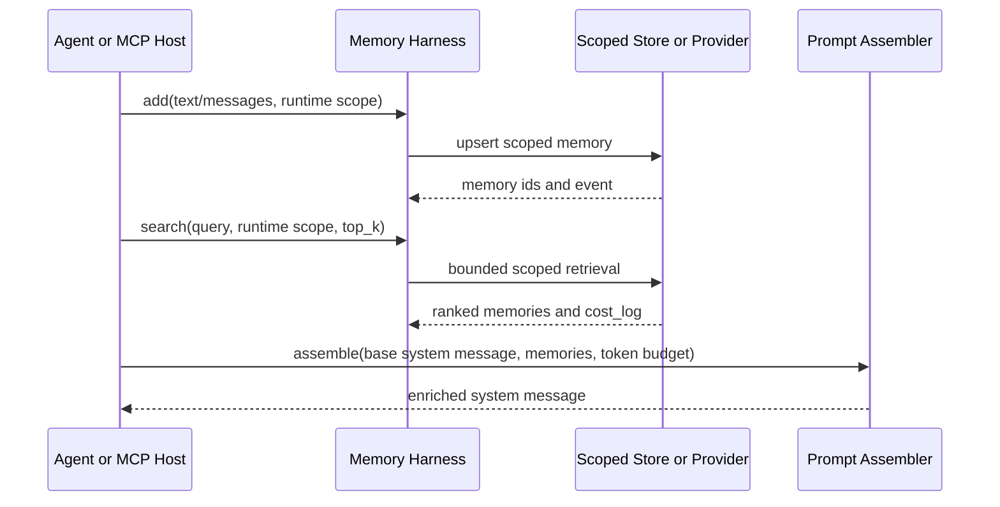

# Knowgrph — AI Agents Universal Memory Layer PRD/TAD

SSOT upstream: [mem0ai/mem0](https://github.com/mem0ai/mem0) and [mem0ai/mem0-mcp](https://github.com/mem0ai/mem0-mcp).

## Overview

Knowgrph now has a Dev-runtime memory layer for AI agents. The shipped layer is provider-neutral and local-first: it exposes typed memory add, search, and prompt-assembly contracts without hardcoded credentials, user IDs, agent IDs, model names, collection IDs, or vendor-only paths.

Mem0 remains the reference external engine. Current Context7 docs confirm the core SDK/API primitives: `add`, `search`, `get`, `get_all`, `update`, `delete`, `delete_all`, and `history`; Platform uses `MemoryClient`, OSS uses `Memory`, and Mem0 MCP exposes `add_memory`, `search_memories`, `get_memories`, `get_memory`, `update_memory`, `delete_memory`, and `delete_all_memories`.

## PRD

### Problem

Knowgrph agents otherwise start cold each session. Users repeat preferences, prompt tokens bloat, and long-running research or build workflows lose context.

### Personas

| Persona | Need | Success |
|---|---|---|
| Power user | Recall preferences across sessions | No repeated re-briefing for known facts |
| Agent pipeline developer | Standard memory primitive | Typed add/search/assemble harness callable from agents |
| Solo operator | Zero-TCO Dev path | Local-first runtime without committed secrets or paid calls |

### Must-Tier Stories

| Story | Acceptance |
|---|---|
| MEM-1-S1: recall cross-session preferences | Search with the same runtime scope returns a stored preference in a later session |
| MEM-1-S2: update changed preferences | Add with the same `memory_key` updates the record instead of stacking stale duplicates |
| MEM-2-S1: inject only relevant context | Prompt assembly includes top-ranked memories within `max_memory_tokens` |
| MEM-2-S2: keep retrieval bounded | Search is one bounded call; local Dev proof emits latency in `cost_log` |
| MEM-3-S1: FOSS/local-first path | Dev runtime works without Mem0 credentials, Qdrant, or Cloudflare deploy |
| MEM-4-S1: MCP-native access | Local MCP exposes memory add, search, and prompt assembly tools |

### Out of Scope

- Browser-stored Mem0 credentials.
- Backfilling old chat artifacts into memory.
- Cloudflare/Prod deployment until explicitly requested.
- A second KGC or Canvas materialization path for memory.
- Custom memory extraction prompt tuning before the provider mode is selected.

## TAD

### Implemented Components

| Layer | Component | Owner | Status |
|---|---|---|---|
| Shared contract | Schemas, scope validation, token estimate, env names | `canvas/src/features/memory/aiAgentsMemoryLayerContract.mjs` | Implemented |
| Dev runtime | Local JSON add/search/assemble harness | `mcp/memory-layer-runtime.js` | Implemented |
| Local MCP | Tool descriptors and server handlers | `mcp/local-tool-contract.js`, `mcp/server.js` | Implemented |
| Agent registry | `knowgrph-memory-layer` vdeoxpln entry | `canvas/src/features/agent-ready/knowgrphVdeoxplnContract.mjs` | Implemented |
| Docs | PRD/TAD and MCP README | this file, `mcp/README.md` | Implemented |

### Local MCP Tools

| Tool | Mutation | Input |
|---|---|---|
| `knowgrph.memory.add` | Local scoped write | `text` or `messages`, plus at least one of `user_id`, `agent_id`, `run_id`, `app_id` |
| `knowgrph.memory.search` | Read-only | `query`, explicit scope, optional `top_k` |
| `knowgrph.memory.assemble_prompt` | Read-only | `base_system_message`, ranked `memories`, `max_memory_tokens` |

### Scope and Config

All scope values are runtime inputs. Missing scope fails fast. The local store is configured by `KNOWGRPH_MEMORY_STORE_PATH`; the default Dev path is `data/memory-layer/local-memory-store.json`.

Provider-mode env names are documented in the shared contract:

| Env | Purpose |
|---|---|
| `KNOWGRPH_MEMORY_PROVIDER_MODE` | `local-json`, `mem0-platform`, `mem0-oss`, or `external-mcp` |
| `KNOWGRPH_MEMORY_STORE_PATH` | Local Dev JSON store path |
| `MEM0_API_KEY` | Operator-owned Mem0 Platform key |
| `VECTOR_STORE_PROVIDER` | OSS vector provider such as Qdrant |
| `LLM_PROVIDER` | OSS extraction LLM provider |
| `EMBEDDER_PROVIDER` | OSS embedder provider |

### Data Flow



### Fallbacks

| Operation | Failure behavior |
|---|---|
| Add | Return structured MCP error; agent turn can continue without memory write |
| Search | Return structured MCP error or empty result at caller boundary; no agent loop retry |
| Assemble | Inject no context when no memory fits budget |

### ADR-MEM-01: Provider Mode

Default Dev mode is `local-json` because it is deterministic, zero-TCO, and credential-free. Mem0 Platform and Mem0 OSS are provider modes behind the same contract once an operator supplies runtime config. The implementation does not add SDK dependencies or vendor credentials to the repo.

## Traceability

| Requirement | Runtime evidence |
|---|---|
| Explicit scope | `requireMemoryScope()` rejects missing `user_id`/`agent_id`/`run_id`/`app_id` |
| Add/update | `metadata.memory_key` produces update semantics in the local runtime |
| Search top-K | `knowgrph.memory.search` returns scored, bounded results |
| Prompt budget | `knowgrph.memory.assemble_prompt` emits `injected_token_estimate` |
| MCP exposure | `buildKnowgrphLocalMcpToolDefinitions()` includes the three memory tools |
| Registry discovery | `knowgrph-memory-layer` is present in vdeoxpln output |

## Validation

Focused Dev checks:

```bash
npm -C canvas run test:ci:unit -- memory.layer.runtime
npm -C canvas run test:ci:unit -- mcp.server.localToolContract.sharedAndStable
npm -C canvas run test:ci:unit -- vdeoxpln.contract.registryProjection
npm run vdeoxpln:check
npm run hygiene:check
```

Known wider check status on 2026-06-13: `npm -C canvas run check` currently fails on unrelated pre-existing type errors in `src/lib/canvas/widgets/replayContract.ts`, `src/lib/config.ls.owners.ts`, and `cloudflare/workers/knowgrph-storage/media.ts`.

## Anti-Pattern Guards

| Guard | Applied |
|---|---|
| No hardcoded identities | Scope is required at call time |
| No browser secrets | Env names only; no credential values in UI/docs/tests |
| No unbounded loops | Add/search/assemble are single-call operations |
| No stale alias stack | New vdeoxpln id is canonical; no compatibility aliases |
| No deploy side effects | Dev-only implementation; no Prod/Cloudflare deploy |

*Content was paraphrased and synthesized from current Context7 Mem0 and Mem0 MCP docs plus the local Knowgrph implementation.*
