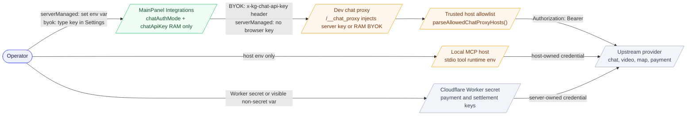
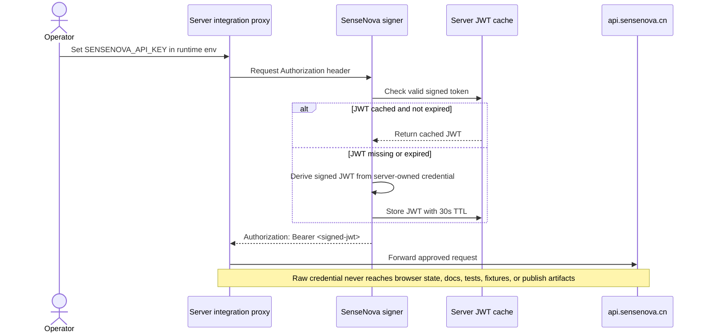

# Knowgrph API Surfaces (Dev/Preview)

Knowgrph Canvas is primarily a client-side app. Local “API” surfaces used by the UI are implemented as Vite middleware during **dev** and **preview** runs.

## Execution boundary

- Dev SSOT: `$GITHUB_ROOT/knowgrph`
- Prod artifact mirror: `$GITHUB_ROOT/huijoohwee/content/knowgrph`
- Cloudflare route: `airvio.co/knowgrph`

API and MCP contracts are owned upstream in Dev. Production mirrors should receive synced artifacts only after upstream validation passes; do not patch generated API behavior inside the publish directory.

## Agentic Video Canvas runtime contract

- Prompt preset catalog: `agentic-canvas-os/docs/PROMPT-PRESETS.md`, materialized at `/agentic-canvas-os/docs/PROMPT-PRESETS.md`, is the single prompt-text owner for Video Agent, Image to Three.js, Image to GLB, Knowgrph Probe-Tree, SME Care Agent, Investment Research Agent, and Crawler Agent. The FloatingPanel selector reads labels, descriptions, routes, activation modes, and prompt bodies from this source; duplicate ids, missing entries, unknown routes, or invalid prompt grammar fail closed. The Probe-Tree preset inserts only `/knowgrph.probe-tree`; `@knowgrph.probe-tree` and `#knowgrph.probe-tree` remain independently authorable aliases. Selecting a token chip is metadata-only. The bubble-toolbar **Probe-Tree** action only reveals already accepted branches and otherwise directs the user to Run. Widget **Run** sends the selected card's authored context and bounded `/`, `@`, and `#` invocation tokens through the Dev-only Probe-Tree MCP bridge, then always asks the configured chat LLM for the typed 2–4-card response. The zero-model MCP path returns no cards instead of synthesizing a fallback. The Run path rejects source-query restatements, extracted entity lists presented as choices, generic wrappers, and context-mismatched output before committing accepted cards, inferred edges, and the Rich Media ledger through one shared active-graph projector.
- Video Canvas source: `huijoohwee/docs/knowgrph-agentic-video-canvas-demo.md`, materialized through the shared workspace seed and docs-mirror canonicalization owners, owns the graph and video-script binding but no prompt copy. Every `Load preset` activation rematerializes the configured canonical source revision over a drifted runtime `/docs/knowgrph-agentic-video-canvas-demo.md` mirror before graph parsing; an initialization-root alias is adopted only when its basename and source bytes match.
- Invocation: `/video-agent @video-generation-demo-script @provider.byteplus @text @image @audio @video #spec.low #thinking.type.enabled #token-cap.medium` plus one authored `workspace:` Markdown reference. `#thinking.type.*` accepts `enabled`, `disabled`, or `auto`. `#token-cap.*` maps Low to low reasoning/4,096 completion tokens, Medium (default) to medium reasoning/16,384, and High to high reasoning/32,768. `#spec.*` remains the independent creative/cost specification. Recognized demo invocations activate locally before generic chat transport.
- Structured text contract: the internal `TextGeneration` stage returns one Markdown package with Character, Scene, Dialogue, Visual asset, Audio, Timing, Metadata, and Prompt sheets before downstream image/video stages consume it. Storyboard and palette surfaces expose this stage only as `Widget Card`; persisted `Text Generation` lane/type labels normalize at projection and are not public UI identity.
- Activation and execution boundary: **New Chat** allocates the session path without mirroring an empty canonical host file. Selecting Video Agent, SME Care Agent, or Investment Research Agent and pressing **Load preset** only projects centralized prompt text into the composer and performs zero provider calls. **Send** is explicit approval. SME Care and Investment Research use the existing slash-agent response contract. Video additionally awaits each exact queued Markdown graph apply, normalizes implicit and explicitly parsed canvas-preset identities, rejects stale delayed editor sync, verifies the committed text/image/video plan, applies its `@provider.*`, `#thinking.type.*`, and `#token-cap.*` tokens, and hands that exact graph snapshot to the Storyboard **Run all** owner. The Storyboard toolbar reserves the Strybldr handoff for graph-identified Strybldr documents and dispatches other multi-Widget graphs to the shared workflow runner. Once Probe-Tree children exist, the root remains lineage-only and each selected child owns its continuation. For a Chat-triggered run, structured starting/running/completed/terminal status replaces the initiating assistant bubble instead of creating the global Run-all progress toast. The same visible message identities adopt each bounded graph-derived history-key transition, so activation, parsing, and settled-canvas revisions cannot clear the initiating thread or disconnect later progress. The path never enters generic generated-KGC finalization. Historical failed artifacts remain read-only evidence.
- Composer presentation: the raw composer string remains the source of truth while Home and FloatingPanel Chat reuse the Card/Widget `MarkdownInlineTextEditSurface` over the neutral `MarkdownContentEditableCore` for `/`, `@`, `#`, media, and `.md` source-binding chips. Text, atomic chips, caret movement, Select All, and double-click suppression therefore share one DOM selection geometry; the only textarea is the screen-reader-hidden command-selection proxy. Double-clicking an atomic chip never replaces it with projected plain text. The shared serializer publishes each edit once and preserves exact authored Markdown, including decoded `workspace:` paths, while a source reference such as `[script.md](workspace:/docs/script.md)` renders as one `@script.md` atomic edit chip. During execution, one `streamingAssistant` tail is rendered in Chat and the same streaming workspace state drives Editor Workspace content and tail-follow; neither surface persists rendered chip markup back into authored Markdown.
- Provider recovery: BytePlus `ModelNotOpen` responses use the shared bounded `/models` fallback and persist the resolved account-accessible model; approval, credentials, entitlement, and budget failures still fail closed.
- Provider response integrity: every local port uses the same Vite chat-proxy owner. Non-SSE responses are read completely with a 64 MiB bound and JSON responses are validated before the proxy publishes the upstream status or headers. Empty, malformed, truncated, or oversized upstream bodies therefore become typed proxy failures instead of browser `Response.json()` errors. Ambiguous generation responses are not retried automatically because the provider may already have accepted the paid request; SSE remains streamed intentionally.
- Execution: registered `videoScript`, `imageGeneration`, and `videoGeneration` forms run through the shared workflow. `generate_audio: true` requests audio; the persisted master identity reaches audio projections only when the returned MP4 container proves a real audio track.
- Persistence and projection: generated text uses the workspace document publisher; generated media uses the shared FloatingPanel Media R2/D1 upload and registration pipeline plus the workspace-manifest publisher. The read-back identity becomes an invocable Media `@` candidate, is reused across the generator Widget, downstream Rich Media Panel, and Timeline surfaces, and exposes the shared hover-only download overlay. Binary and manifest workspace entries are registered together in Explorer → Source Files without applying either artifact as a replacement graph. Sequential Run-all stages preserve previously registered input, text, manifest, and binary Source Files even when the workspace is in docs-only mode. Live graph publication is synchronous and each completed card performs one awaited durable source write. The run snapshots the originating Canvas Markdown source as the semantic graph owner; opening or generating another artifact before terminal persistence cannot redirect the graph write. When Workspace rendering is an aggregate of several Source Files, publication projects only that owner's scoped and newly authored unscoped entities before serialization instead of offering the composed graph to one document. A blank owner materializes its first canonical `flow:` frontmatter block. An inactive owner is updated in Source Files and durable Workspace FS without replacing the user's current editor selection. Changed stages create GitGraph document versions named `Run All i/n: <card>` or `Chat Run All i/n: <card>`; an already-serialized graph is an accepted no-op and does not duplicate history. A Chat-started Run all finalizes its canonical KGC and trace only after the shared workflow owner reports terminal `complete` or `error`, without replacing the committed source-backed graph. Zero-byte historical Markdown evidence remains excluded and is never backfilled; the lifecycle repair applies to fresh runs only.
- Probe-Tree response: `/knowgrph.probe-tree`, `#knowgrph.probe-tree`, `@knowgrph.probe-tree`, `knowgrph.probe.generate`, and `knowgrph.probe.select` request `probe-tree-llm-response/v5`: source-specific profiles under `response.structuredContent`. The active Chat provider, endpoint, and selected model own Probe-Tree transport and return only 2–4 semantic card records containing a model-generated `question`, 2–4 suggested clarification answers, rationale, and evidence need. The shared text-provider resolver also reconciles the selected model with persisted generic TextGeneration provider/endpoint fields; a known model family wins a stale contradictory tuple, and transport failures remain distinct from semantic response rejection. The runtime derives source-verbatim `contextAnchors` from semantic question/request overlap, the selected-child parent, candidate ids and edges, bounded depth, multi-selection plus Other, empty user-owned Output, source Widget, and Rich Media ledger; literal MCP results retain their complete Widget/Card/Panel envelope. From a bounded provider batch, the projector keeps the largest query-relevant mutually distinct subset only when at least two cards survive, then creates public `TextGeneration` Probe-Tree Cards. The FloatingPanel Widgets palette renders one canonical **Widget Card Type 0**, one open-answer **Probe-Tree Type 1**, one bounded multi-select **Probe-Tree Type 2**, one consolidated **Rich Media Panel**, and genuinely distinct enabled custom flow editors. Image/Video generation remain runtime registry capabilities but use Rich Media Panel as their single creation surface; provider-specific TextGeneration compatibility aliases and duplicate registry shapes do not create competing Widget Card entries. Each preview follows the active Storyboard **16:9** or **9:16** aspect setting and omits registry-id prose from the item body. Type 1 seeds free-form Summary plus Output; Type 2 seeds 2–4 numbered choices, multi-selection, Other, `/knowgrph.probe-tree`, and the same canonical Output owner. Regular Widget Cards retain the media drop slot; Type 1 keeps free-form Summary plus Add output; Type 2 renders numbered checkboxes plus Other in Summary while the shared Output Viewer remains the continuation SSOT. The canonical Output commit leads the selected continuation card's MCP context and optional provider-refinement prompt when Run is pressed; the selected child is reconciled into the active graph and replaces any same-ID root writeback alias before materialization, while the canonical thread root remains lineage-only metadata. Generic request verbs, workflow roles, root aliases, and evidence mechanics cannot outrank the selected Output's concrete entities and risk topics. Widget Run calls the local stdio `knowgrph.probe.generate` tool first and passes its literal result into an optional provider-refinement prompt. A provider batch is accepted only when its cards satisfy the bounded semantic structure, propose clarification answers instead of bare focus fragments, and overlap the selected child plus bounded lineage context. Invalid siblings are excluded before cross-card diversity selection; if fewer than two provider cards survive, a separately accepted model-backed MCP response may win, otherwise the Run fails closed without local-zero card synthesis. The projector clears any provider-authored Output so the model cannot pre-answer the user-owned field. The accepted result replaces the stale Probe-Tree candidate children, their complete descendant closure, and incident edges, then flows through the existing active graph, Mermaid metadata, and owned Rich Media publication transaction rather than a second MCP-only graph pipeline. Continuations reuse one thread-scoped panel through `workflowOutputGroupId`; the runtime normalizes each thread into a balanced, grid-snapped left-to-right/top-down waterfall whose bounded sibling batches originate at their actual parent. A whole-thread footprint score selects a nearby collision-free stagger, caps vertical search at two card steps before spilling rightward, and therefore avoids depth-global long parent/child arcs, one long horizontal or vertical block, and card overlap. Layout authority is versioned per canonical thread root and grid size. The tallest supported 9:16 card defines the collision envelope, which also keeps shorter 16:9 cards disjoint; graph authority rebuilds exactly one `candidateOption` route from each branch's declared parent, removing duplicate or mismatched routes so every retained target stays to the right of its source, while the single ledger remains strictly beyond the rightmost branch column. Layout-owned cards and the ledger default to pinned only when pin state is missing; an explicit unpin survives generation and reopen. The next terminal publication collapses prior per-turn ledgers/output edges and gives generated Markdown a media-owned scrolling viewport so content height cannot resize the panel. Generation versions one canonical graph for the run ref, live store, and source, then applies the normalization in the active document without requesting a whole-canvas fit, navigating, or refreshing the browser page; this preserves the current zoom/pan transform while moving the ledger with the rightmost branch. A restarted or refreshed Storyboard projection performs one bounded Fit-to-View recovery only when every measurable card is offscreen; ordinary graph growth and user pan do not re-arm continuous auto-fit. Toolbar **Reset all** clears generated output and force-reapplies the current heuristic to every ledger-owned or ancestry-discovered Probe thread through one canonical persisted graph commit, including layout-only and ledger-less repair; it refreshes overlay edges without navigation, page reload, global fit, or zoom/pan mutation. On reopen, Storyboard graph authority normalizes older per-turn ledgers; full hybrid Strybldr commits reconcile Rich Media topology into the serialized editor blocks and canonical `flow.nodes`, with the `knowgrph` runtime winning any documentation or projection conflict. Later inline edits update both canonical `flow.nodes` and an embedded literal MCP envelope when present so stale card values do not remain in active frontmatter. The generic Clarify/Generate/Select process cards are rejected as LLM-contract output. Dev validation does not prove or authorize a paid provider, Prod, or Cloudflare execution.
- Proof boundary: `live_provider_run_proven` stays false until an explicitly approved provider run proves real bytes, manifest/read-back identity, playback, synchronized audio/subtitles, Canvas projection, and bounded cost. Dev validation does not authorize Prod or Cloudflare deployment.

## Image-to-Three.js skill contract

- Canonical API contract: [knowgrph-image-to-threejs-api.md](knowgrph-image-to-threejs-api.md) owns the typed input, manifest, native Three.js lifecycle, shared surface propagation, no-copy boundary, proof, and deployment gate.

## Canvas iframe embed contract

- UI entry: Editor Workspace → Source Files → right-click a file → **Share canvas embed**.
- Panel output: a complete sandboxed `<iframe>` snippet in an HTML code-block panel with the shared **Copy code to clipboard** control, not only a URL.
- Frame source: the published opaque share route with `kgPreview=1`; Live Canvas Hero isolation adds `kgLiveHero=1` when it owns the selected background.
- Runtime boundary: iframe rendering remains owned by Knowgrph. External hosts may size or position the frame but must not reimplement canvas state.
- Security: generated markup accepts HTTP(S) only and includes `sandbox="allow-scripts allow-same-origin"` plus `referrerpolicy="no-referrer"`. Cloudflare permits external `frame-ancestors` only for the apex/embed owner and opaque published-document HTML routes.
- Home and MainPanel import: **Import canvas embed** is available on Home and under **MainPanel Settings → Canvas Embed**. Both entry points reuse the shared canvas-embed import panel and accept the generated iframe HTML or a JSON `postMessage` envelope with `type: "knowgrph.canvas-embed.select"`, `version: 1`, and either `embedUrl` or `iframe`. The optional `sourcePath` preserves source identity. Generic imports normalize `kgPreview=1&kgLiveHero=1`; the Workspace README preset preserves its direct remote iframe and selects the `2d` / `storyboard` renderer through the shared canvas query contract.
- Host control: the same v1 envelope is accepted only from the embedding parent or opening window; direct host mutation of internal renderer state remains forbidden.

## Endpoints

### Remote media fetch proxy

- Path: `/__fetch_remote?url=<encoded>`
- Purpose: serve remote images/media through same-origin to reduce CORS/ORB issues.
- Limits: bounded upstream timeout and max response size (prevents hanging requests and unbounded memory).
- Used by:
  - Node media panels (remote `image/video/iframe` sources)
  - Markdown slide backgrounds via `applyMediaProxySrc(...)`
- Implementation: [vite.config.ts](../../canvas/vite.config.ts)

### Run markdown pipeline (dev tooling)

- Path: `/__run_markdown_pipeline` (POST)
- Purpose: allow the UI/dev workflow to trigger the repo-level markdown pipeline once.
- Implementation: [vite.config.ts](../../canvas/vite.config.ts)

### Agentic Canvas OS invocation grammar (dev/preview)

- Path: `/knowgrph/control-plane/mcp` (POST, MCP initialize and `tools/call` for `knowgrph.agentic_canvas_os.docs.invoke`).
- Purpose: keep localhost Skills & Commands and shared composer menus projected from the sibling `agentic-canvas-os/docs` command, semantic, and binding dictionaries after static downstream invocation arrays were removed.
- Query contract: sigil-only `/`, `#`, and `@` searches filter by token prefix and request the bounded 500-entry catalog ceiling.
- Runtime: the Vite dev/preview middleware delegates to the existing read-only local docs tool; deployed hosts continue to use the control-plane MCP owner.
- Boundary: the forwarder exposes no mutation or deployment operation and removes the machine-local absolute docs path from browser responses.
- Implementations: [agenticOsGrammarDevServer.mjs](../../canvas/agenticOsGrammarDevServer.mjs), [agentic-canvas-os-docs-runtime.js](../../mcp/agentic-canvas-os-docs-runtime.js), and [agenticOsRemoteGrammarClient.ts](../../canvas/src/features/agentic-os/agenticOsRemoteGrammarClient.ts).
- Probe-Tree Widget bridge: Dev/Preview `POST /__knowgrph_mcp_probe_generate` accepts a same-origin/same-site request bounded to 32 KiB, 12,000 context characters, 24 invocation tokens, 2–4 options, recall 0–20, depth 1–8, 256–4,000 requested tokens, and one shared 20-second deadline across stdio connect, evidence lookup, and generation. [viteProbeTreeMcpBridge.ts](../../canvas/viteProbeTreeMcpBridge.ts) invokes the actual local stdio server, resolves representative `/`, `@`, and `#` tokens in parallel through `knowgrph.agentic_canvas_os.docs.invoke` under a 3-second evidence sub-budget, calls exactly `knowgrph.probe.generate` with the remaining deadline, and returns literal MCP plus invocation evidence; [probeTreeMcpClient.ts](../../canvas/src/features/agent-ready/probeTreeMcpClient.ts), [storyboardWidgetProbeTreeStructuredResponse.ts](../../canvas/src/components/StoryboardWidgetCanvas/runtime/storyboardWidgetProbeTreeStructuredResponse.ts), and [storyboardWidgetProbeTreeLayout.ts](../../canvas/src/components/StoryboardWidgetCanvas/runtime/storyboardWidgetProbeTreeLayout.ts) project accepted cards, balanced grid-snapped waterfall positions, forward-only inferred edges, Mermaid metadata, and one thread-grouped Rich Media ledger beyond the rightmost branch in the same terminal commit. New layout-owned nodes default to pinned without overwriting explicit unpin state, and publication preserves the current page lifecycle and zoom/pan transform rather than requesting a global fit or refresh. On Probe-Tree Card Output → Run, canonical Output leads the context, sibling recall is disabled, the original thread root is preserved or recovered from the parent chain, the answered card becomes current node, depth increments once, and depth 8 stops before MCP/provider spend. Every explicit Run hands the selected context and literal MCP result to the configured chat LLM; if no model produces 2–4 distinct query-specific cards, the run fails closed and publishes no synthesized cards. The route exposes no caller-selected tool, path, endpoint, mutation, or deployment and is not a production HTTP MCP transport; exact docs lookup remains fail-closed when its sibling checkout is dirty.

### Super-agent harness (CLI/MCP)

- CLI: `python3 -m knowgrph_parser superagent` or `python3 -m knowgrph_parser run-goal`
- MCP tool: `knowgrph.superagent.run`
- Purpose: run the bounded long-horizon research/code/create artifact loop across `quick_triage`, `bounded_compile`, `deep_research`, and `parallel_build` task levels with typed provider contracts, `skill.select`, `research.scout`, `code.write_and_run`, bounded sandbox execution, trace persistence, artifact provenance, run memory, resume, verification, default BytePlus ModelArk placeholder media metadata, deterministic mock mode, and mobile-first responsive workspace metadata.
- Implementation: [superagent_harness.py](../../knowgrph_parser/superagent_harness.py), local stdio transport in [server.js](../../mcp/server.js), and local MCP tool-contract ownership in [local-tool-contract.js](../../mcp/local-tool-contract.js)
- Boundary: DeerFlow is conceptual inspiration only for message gateway, memory, tools, skills, subagents, sandboxed workspace artifacts, and minutes-to-hours runs. The API docs must not copy DeerFlow code, clone its architecture, or describe the local harness as a deployed Pages/WebMCP mutation route.

### Native agent sandbox policy preflight (local MCP)

- MCP tools: `knowgrph.sandbox.policy.validate` and `knowgrph.sandbox.policy.authorize`
- Purpose: compile a source-backed dependency-free YAML 1.2 JSON-compatible policy and return deterministic deny-first decisions for filesystem, process, network, and credential operations without executing them.
- Owners: [agent-sandbox-policy-runtime.js](../../mcp/agent-sandbox-policy-runtime.js), [agent-sandbox-policy-tool-contract.js](../../mcp/agent-sandbox-policy-tool-contract.js), and [agent-sandbox-policy.yaml](../../config/agent-sandbox-policy.yaml)
- Boundary: OpenShell informs the defense-in-depth capability class only. No OpenShell code, schema, skill, fixture, prose, runtime package, or compatibility alias is imported. Application preflight is not OS/kernel or container containment; autonomous untrusted execution remains blocked until a host isolation adapter proves that boundary.
- Contract source: [README.md](../../mcp/README.md) and [knowgrph-mcp-service-prd-tad.companion.md](knowgrph-mcp/knowgrph-mcp-service-prd-tad.companion.md)

### Agentic video workflow (local and control-plane MCP)

- MCP tool: `knowgrph.video_remix.run`
- Purpose: run the native approval-gated research -> storyboard -> parallel first-frame generation/consistency selection -> dependency-aware parallel video render -> visual review -> edit -> publish -> checkout Director with interactive planning, exact-span long-script segmentation, script-unit RAG, audience-conditioned cinematography, scene-scoped multi-camera simulation, intelligent first-frame reference selection, automated spatial image-prompt generation, narrative rhythm, hierarchical narrative structure, temporal character/environment continuity, bounded specialist negotiation, revision, bounded context, landscape guards, persistent per-shot checkpoints, completed-shot reuse, and bounded retries.
- Workflow actions: `run`, `plan`, `revise`, `render`, and `resume` through the optional `workflow` object. `plan` and `revise` return `awaiting_review` without render dispatch. `resume` requires a matching checkpoint and dispatches only pending shots.
- Checkpoint output: `workflow.checkpoint` returns the stable session id, revision number, compacted context accounting, ordered render status, reusable render assets, and complete/pending counts.
- Long-script output: `workflow.longScript` and `workflow.checkpoint.longScript` expose the exact source corpus, plot/dialogue unit ids and source ranges, ordered multi-scene segments, shot bindings, recommended scene count, retention coverage, and named omissions. `workflow.script` accepts up to 500,000 characters; segmentation and live-context budgets are configured through `workflow.narrativePolicy`.
- Storyboard input/output: `workflow.storyboardProfile` accepts operator requirements, target audience, viewing/accessibility context, tone, style, aspect ratio, pace, motion intensity, and shot-duration bounds. `workflow.storyboardDesign` returns the canonical camera grammar, designed shots, intensity/duration rhythm, issues, and `ok` state. Each planned shot keeps its editable `prompt` and receives a provider-facing `renderPrompt`.
- Multi-camera input/output: `workflow.storyboardProfile.multiCamera` accepts enabled state, camera count, action-axis degrees, minimum cut angle, and explicit axis-crossing permission. `workflow.multiCameraDesign` returns scene rigs, effective camera counts, coverage roles, camera assignments, action-beat character blocking, normalized backgrounds, issues, and `ok`. KGC nodes and VLM packets carry the same camera/spatial state used in `renderPrompt`.
- Reference input/output: `workflow.referenceImages[]` accepts kind, entity ids, scene/action-beat/source-shot ids, environment state, landscape dimensions, and asset URL. `workflow.referencePolicy` bounds references and optionally requires character/environment coverage. `workflow.referenceSelection` returns the explicit plus completed-timeline catalog, ranked per-shot selection, primary/supporting references, coverage, issues, and `ok`; the same URLs reach video submit as `first_frame_image` and `reference_images`.
- Automated image-prompt input/output: `workflow.imagePromptPolicy` controls enablement, prior-timeline/reference directives, coordinate precision, interaction distance, and strict spatial blocking. `workflow.imageGeneration` returns one canonical prompt, semantic input key, reuse state, and structured spatial plan per shot; unchanged checkpoint prompts are reused byte-for-byte, while `imagePrompt` reaches provider dispatch, KGC nodes, checkpoints, and VLM expectations without downstream recomputation.
- First-frame consistency input/output: `workflow.imageConsistencyPolicy` controls candidate count, minimum successes, concurrency, threshold, required/optional behavior, and normalized identity/environment/spatial/temporal/technical metric weights. Live execution returns `workflow.imageConsistency` with candidates, VLM reviews, stable ranking, the accepted first frame, semantic reuse state, retry trace, Cost Logs, issues, and provider-call counts. The accepted durable URL replaces only the shot's primary first-frame reference.
- First-frame provider configuration: `AI_GATEWAY_IMAGE_URL`, `IMAGE_GENERATION_MODEL`, and optional `IMAGE_GENERATION_API_KEY` configure the provider-neutral candidate client. Candidate review reuses `AI_GATEWAY_CHAT_URL` and the existing multimodal review client. Missing configuration remains zero-spend unless `workflow.imageConsistencyPolicy.required` is true.
- Parallel-shot input/output: `workflow.parallelShotPolicy` controls enablement, maximum concurrency, maximum batch size, same-scene enforcement, and the maximum provider cost reserved per shot. `workflow.parallelShotPlan` returns the semantic schedule and per-shot batch assignments; `workflow.parallelShotExecution` returns the pending projection and observed concurrency. Unknown-cost clients execute serially, failures settle in-flight work before halting later batches, and result order remains identical to storyboard order.
- Multi-agent pipeline output: `workflow.multiAgentPipeline`, `workflow.checkpoint.multiAgentPipeline`, and `videoAgent.multiAgentPipeline` expose one native nine-stage DAG across input, central orchestration, script understanding, scene/shot planning, visual asset planning, asset indexing, consistency/continuity, synthesis/assembly, and output. It includes named specialist assignments, typed handoffs, semantic reuse, an artifact index, provider-call/cost/retry accounting, and honest `complete_unverified` or dependency-propagated `blocked` state.
- Narrative/continuity output: `workflow.narrative`, `workflow.continuity`, and `workflow.negotiation` expose source-card and script-unit retrieval, plot/dialogue retention, dependency validation, temporal state, specialist proposals, and the bounded production decision.
- Visual-review output: `videoAgent.qualityReview` and `workflow.checkpoint.proposedRevisions` expose VLM scores, findings, Cost Logs, and shot-scoped refinements. The reviewer reuses the existing AI Gateway chat endpoint/key and BytePlus multimodal `image_url` contract; no new provider configuration is introduced.
- Schema owner: [workflow-contract.js](../../mcp/video-remix/workflow-contract.js), reused by [local-tool-contract.js](../../mcp/local-tool-contract.js) and the Cloudflare [tool-registry.mjs](../../cloudflare/workers/knowgrph-mcp/tool-registry.mjs).
- Runtime owners: [long-script-engine.js](../../mcp/video-remix/long-script-engine.js), [expressive-storyboard.js](../../mcp/video-remix/expressive-storyboard.js), [multi-camera-simulation.js](../../mcp/video-remix/multi-camera-simulation.js), [reference-image-selection.js](../../mcp/video-remix/reference-image-selection.js), [automated-image-generation.js](../../mcp/video-remix/automated-image-generation.js), [image-consistency-check.js](../../mcp/video-remix/image-consistency-check.js), [parallel-shot-generation.js](../../mcp/video-remix/parallel-shot-generation.js), [multi-agent-pipeline.js](../../mcp/video-remix/multi-agent-pipeline.js), [storyboard.js](../../mcp/video-remix/storyboard.js), [workflow-control.js](../../mcp/video-remix/workflow-control.js), [run-video-remix.js](../../mcp/video-remix/run-video-remix.js), [video-agent-execution.js](../../mcp/video-remix/video-agent-execution.js), and [retry.js](../../mcp/video-remix/retry.js).
- Boundary: ViMax informs the capability checklist only. Knowgrph imports no ViMax code, prompt, provider configuration, fixture, test, or runtime dependency. Prod and Cloudflare remain deployment-gated.

### API-native browser MCP bridge

- MCP tool: `knowgrph.browser_api.run`
- API-route operations: `health`, `search`, `searchDomain`, `resolve`, `login`, `cookieImport`, `skills`, `stats`, `feedback`, `verify`, `issues`, `execute`
- Native browser operations: `go`, `snap`, `click`, `fill`, `type`, `press`, `select`, `scroll`, `submit`, `screenshot`, `text`, `markdown`, `cookies`, `eval`, `sync`, `close`, `skill`, `sessions`
- Purpose: let any MCP client call a local browser/API runtime that resolves first-party browser routes, executes resolved skills, and can fall back to native browser capture/action flows without copying a vendor implementation.
- Safety: execution forwards `dry_run=true` by default, rejects non-loopback runtime URLs unless explicitly enabled by server environment, normalizes browser target URLs to credential-free `http`/`https`, requires `confirm_unsafe` for live route execution/native browser mutations, and requires `confirm_cookie_import` before cookie storage access.
- Configuration: MainPanel MCP owns `browser.apiNative.mcp.*` rows, direct browser-MCP `mcpServers` JSON using `UNBROWSE_URL`, and a separate local bridge config using `KNOWGRPH_BROWSER_API_RUNTIME_URL`. Target URLs are caller- or setting-supplied, validated before forwarding, and never injected from a default site.
- Contract source: [README.md](../../mcp/README.md), [local-tool-contract.js](../../mcp/local-tool-contract.js), and [knowgrph-mcp-service-prd-tad.companion.md](knowgrph-mcp/knowgrph-mcp-service-prd-tad.companion.md)
- Browser-local read-only WebMCP: `knowgrph.read_local_runtime_identity` returns the application-global canonical identity plus automatic gate snapshot without refreshing, copying, or mutating either owner.

Responsive output contract:

- Workspace artifacts should expose widget bounds, fit strategy, edge anchors, overflow handling, and panel behavior for mobile, tablet, desktop, wide-canvas, and 1920x1080 proof classes.
- API or MCP wrappers must return responsive verification status alongside artifact paths so callers can tell whether generated Text, Image, Video, and Rich Media Panel widgets remain reachable on narrow screens.
- Rich Media Panel consumers must select one active content surface through the shared neutral resolver and reuse the Storyboard Widget chrome, title typography, compact Card read/edit surface, and single vertical Card scroll owner; full-surface consumers set the shared Card `displayLineClamp` policy to `none`, while row-like consumers retain density clamping. APIs must pass document context and edit capability into that shared surface rather than encode renderer-local read-only markdown, editable text, nested overflow, iframe, image, audio, or video shell variants, or expose a Rich Media-only validation callback that actually performs selection or z-order mutation.
- A clicked, blue-chrome Card or Rich Media Panel exposes exactly one semantic input handle at left-middle and one semantic output handle at right-middle; the handles unmount with that selection chrome. Selected Widgets expose the full KTV-row-derived multi-port set. The shared handle renderer guarantees a 10 px minimum visible glyph, separate from its larger interaction target. Overlay projection selects the semantic handle nearest the center and changes only presentation, never the authored port key or edge binding. Selected and unselected Card/Rich Media edges retain that same centered anchor; a surface must not mount both the outer overlay rail and KTV-row handles.
- Editor Workspace launch paths must use the root workspace width defaults and shared canvas gutter token; downstream API/publish routes must not remap mobile pane widths locally.
- Dev, preview, Prod mirror, and Cloudflare production must consume the same responsive metadata; do not patch mobile behavior in downstream route handlers or generated publish files.

### YouTube transcript conversion

- Path: `/__youtube_transcript?url=<encoded>[&lang=<code>]` (POST)
- Purpose: convert YouTube transcripts/subtitles/captions into Markdown for the Markdown Editor/Preview/Slides and return a transcript JSON payload for JSON-backed markdown workspace and UI Editor flows.
- Implementation: [vite.config.ts](../../canvas/vite.config.ts)
- Validation: video-agent external test URLs are supplied through `KNOWGRPH_VIDEO_AGENT_TEST_URLS` for focused tests, and through the user-configurable `VIDEO_AGENT_VALIDATION_CONFIG_STORAGE_KEY` / `VITE_KNOWGRPH_VIDEO_AGENT_VALIDATION_URLS` runtime config for the app. Both paths are exercised by the same Toolbar Launch Import URL flow, which calls this endpoint and then materializes source-owned video markdown with video corpus metadata without committing URL fixtures in repo source. Director-style orchestration is represented only through the native `VIDEO_AGENT_REFERENCE_BOUNDARY` contract: inspiration-only, native Knowgrph implementation, no external code copy, and no external video-agent runtime dependency.

### Import URL local video download

- Endpoint source: `VITE_VIDEO_DOWNLOAD_ENDPOINT`, read by `canvas/src/lib/video-download/videoDownloadResolver.ts`; Dev/Preview falls back to same-origin `/__video_download` when the env var is unset.
- Client owner: Toolbar Launch Import URL calls `workspaceActionBridge.downloadVideo` first, then HTTP POST fallback.
- Download folder setting: MainPanel Settings exposes `workspace.import.videoDownload.outputDir`; when unset, the Dev/Preview server resolves the portable default to the sibling `huijoohwee/video` folder under the detected workspace root.
- Request: `POST` JSON with `url` plus optional `format`, `mediaKind`, `quality`, `subtitleLang`, and `outputDir`; no committed video URL fixtures or credentials. `mediaKind` accepts `video-audio` or `audio`; `quality` accepts `best`, common video heights, or audio quality presets.
- Response: `Download_Result` with `ok`, `filePath`, `fileName`, `mimeType`, `sizeBytes`, `sourceUrl`, and optional browser-local `fileUrl`; errors return `ok: false`, `error`, and optional `errorCode`.
- Server implementation: `canvas/vite.config.ts` owns the local `/__video_download` middleware and range-capable `/__video_download_file` asset route; `cloudflare/pages/video-download.mjs` owns the Pages endpoint source. The Dev/Preview route uses native in-repo `fetch`, bounded file writes, generic media-source discovery, and a native YouTube player resolver for direct audio/video URLs; it does not invoke yt-dlp or any external downloader. Sources that require unsupported native muxing/transcoding return sanitized errors without stack traces.
- Video-frame extraction: Dev/Preview `/__video_frame` writes generated frame images under `$GITHUB_ROOT/huijoohwee/image/video-frame/YYYYMMDDTHHmmssZ`, matching the timestamp-token shape used by `/docs_/YYYYMMDDTHHmmssZ` Import URL artifacts.

### HTML video renderer runtime

- Client owner: `canvas/src/features/html-video-renderer/*`.
- Design bridge owner: `canvas/src/features/design/designAgentVideoSpec.ts` and `canvas/src/features/design/DesignEditorOverviewPanel.tsx`.
- Purpose: turn source-owned HTML, CSS, seekable timing data, and structured render data into video artifacts for coding-agent workflows and Design renderer previews.
- Runtime contract: engine adapters are registered through `globalThis.knowgrphHtmlVideoEngines` and resolved by `createHtmlVideoEngineRegistryFromRuntimeConfig()`. Missing engines fail closed with structured `engine_not_configured` errors; there is no endpoint-level or client-level fallback engine.
- Browser-native video smoke: the shipped Dev runtime can register the FOSS `canvas-2d` adapter, which uses in-browser canvas capture plus `MediaRecorder` and records the browser-supported video container without installing a system `ffmpeg` binary or an imported muxer. The headless adapter remains operator-configured for environments that explicitly provide an FFmpeg runtime.
- Artifact contract: `runHtmlVideoFlowNode` writes generated video output through the shared rich-media artifact writer when workspace FS is available and can publish a `video/*` blob preview to the calling surface. Design-authored artifacts include composition metadata, virtual workspace files, composition rows, source-derived assets, timeline lanes, and per-layer `data-start`, `data-duration`, and `data-track-index` markers so runtime adapters can seek deterministic frames without a proprietary timeline file.

## Production note

These middleware endpoints exist for local development and preview builds. Current production is split by concern:

- Static SPA: `knowgrph/canvas/dist` -> `huijoohwee/content/knowgrph` -> Cloudflare Pages at `airvio.co/knowgrph`
- Storage API: `cloudflare/workers/knowgrph-storage` -> Cloudflare Worker `knowgrph-storage` at `airvio.co/api/storage/*`
- Server-side storage fetch origin: `https://knowgrph-storage.huijoohwee.workers.dev` for Pages or future MCP Worker reads of published Source Files / markdown docs
- Payments API: `cloudflare/workers/knowgrph-payment` -> Cloudflare Worker `knowgrph-payment` at `airvio.co/api/payments/*`
- Dev-only tooling routes such as remote media proxying and markdown pipeline execution must be promoted to a real server route before relying on them in production.

Production API work must keep root-owned configuration, path policy, provider dispatch, and responsive workspace metadata as the single source of truth. Fix stale behavior in Dev, then sync the mirror and schema/API docs from the canonical source.

## Production Worker API

### Pages Chat Relay: `__chat_proxy`

Route owner: `huijoohwee/functions/__chat_proxy/[[path]].js`. Public route: `airvio.co/__chat_proxy/*`. Shared helper owner: `huijoohwee/functions/api/_integrationHub.js`. Deploy owner: `npm run pages:deploy-cloudflare` from `knowgrph`, which uploads the `huijoohwee` publish repo to Cloudflare Pages project `joohwee`.

This route is a Cloudflare Pages Function relay, not a persistence owner. It enforces the provider host allowlist, injects BYOK or server-managed Authorization headers, bounds the upstream timeout, and returns `cache-control: no-store`. It does not create user identity, workspace membership, role-based authorization, or a collaboration room record.

For the current Cloudflare AI Gateway runtime slice, the relay also accepts the internal
request-only headers `x-kg-ai-gateway-route`, `x-kg-ai-gateway-metadata`, and
`x-kg-ai-gateway-cache-ttl`. When `KNOWGRPH_CHAT_PROXY_AI_GATEWAY_BASE_URL` plus a matching
Cloudflare token are configured, the OpenAI draft lane can be rewritten from the standard provider
path to the AI Gateway REST surface and the request model can be switched to `dynamic/draft`
without changing the browser route.

For authenticated storage-relayed chat, the storage Worker now owns the default draft AI Gateway
policy when the browser omits `x-kg-ai-gateway-route` and `x-kg-ai-gateway-cache-ttl`: OpenAI
requests carrying `intent=draft` derive the `dynamic/draft` route server-side, requests carrying a
`workspace_context_cache_key` get the longer deterministic-context cache lane (`120` seconds), and
history-backed draft traffic falls back to `60` seconds. Explicit route or cache TTL values still
override those defaults when a server-owned caller needs a different bound.

#### Current Route Contract

| Surface | Current owner | Public route | Runtime persistence | Secret/config owner |
|---|---|---|---|---|
| Chat relay | `huijoohwee/functions/__chat_proxy/[[path]].js` | `airvio.co/__chat_proxy/*` | None; stateless proxy only | Cloudflare Pages project `joohwee` |
| Shared integration helpers | `huijoohwee/functions/api/_integrationHub.js` | Internal helper | None | Cloudflare Pages project `joohwee` |
| Route manifest | `huijoohwee/_routes.json` | `airvio.co/__chat_proxy/*` inclusion | Generated deploy artifact | Cloudflare Pages bundle |

#### Cloudflare Pages Variables And Secrets For This Route

| Name | Role | Source owner |
|---|---|---|
| `KNOWGRPH_CHAT_PROXY_OPENAI_API_KEY` | Server-managed OpenAI proxy key | Cloudflare Pages project secret |
| `KNOWGRPH_CHAT_PROXY_MIROMIND_API_KEY` | Server-managed MiroMind proxy key | Cloudflare Pages project secret |
| `KNOWGRPH_CHAT_PROXY_AGNES_API_KEY` | Server-managed Agnes proxy key | Cloudflare Pages project secret |
| `KNOWGRPH_CHAT_PROXY_SEALION_API_KEY` | Server-managed AI Singapore SEA-LION proxy key | Cloudflare Pages project secret |
| `KNOWGRPH_CHAT_PROXY_BYTEPLUS_API_KEY` | Server-managed BytePlus proxy key | Cloudflare Pages project secret |
| `OPENAI_API_KEY` | Fallback OpenAI proxy key alias | Cloudflare Pages project secret; cleanup debt only |
| `MIROMIND_API_KEY` | Fallback MiroMind proxy key alias | Cloudflare Pages project secret; cleanup debt only |
| `AGNES_API_KEY` | Fallback Agnes proxy key alias | Cloudflare Pages project secret; cleanup debt only |
| `BYTEPLUS_API_KEY` | Fallback BytePlus proxy key alias | Cloudflare Pages project secret; cleanup debt only |
| `KNOWGRPH_CHAT_PROXY_AI_GATEWAY_BASE_URL` | Cloudflare AI Gateway universal base URL. **Legacy:** `https://gateway.ai.cloudflare.com/v1/<account_id>/<gateway_id>`. **Modern REST API:** `https://api.cloudflare.com/client/v4/accounts/<account_id>/ai` for `/run` and `/v1/chat/completions` | Cloudflare Pages project variable |
| `KNOWGRPH_CHAT_PROXY_AI_GATEWAY_TOKEN` | Server-managed Cloudflare AI Gateway token | Cloudflare Pages project secret |
| `AI_GATEWAY_TOKEN` | Fallback AI Gateway token alias | Cloudflare Pages project secret; cleanup debt only |
| `KNOWGRPH_CHAT_PROXY_AI_GATEWAY_GATEWAY_ID` | Optional explicit gateway id header override | Cloudflare Pages project variable |
| `KNOWGRPH_CHAT_PROXY_UPSTREAM` | Optional upstream base override | Cloudflare Pages project variable |
| `KNOWGRPH_CHAT_PROXY_TIMEOUT_MS` | Upstream timeout override | Cloudflare Pages project variable |
| `KNOWGRPH_INTEGRATION_ALLOWED_HOSTS` | Canonical additional host allowlist | Cloudflare Pages project variable |
| `KNOWGRPH_CHAT_PROXY_ALLOWED_HOSTS` | Legacy host allowlist alias | Cloudflare Pages project variable; cleanup debt only |

#### GitHub To Cloudflare Deploy Chain For This Route

1. Edit the production route owner in `huijoohwee/functions/__chat_proxy/[[path]].js` or update the canonical source/deploy logic in `knowgrph`.
2. From `knowgrph`, run `npm run pages:build-sync` so the publish repo mirror stays aligned.
3. From `knowgrph`, run `npm run pages:functions:build` to build the Pages Functions bundle and regenerate `huijoohwee/_worker.js` plus `huijoohwee/_routes.json`.
4. From `knowgrph`, run `npm run pages:deploy-cloudflare`, which executes `wrangler pages deploy ../huijoohwee --project-name=joohwee --branch=main --commit-dirty=true`.
5. Cloudflare Pages project `joohwee` serves the updated `__chat_proxy` route at `airvio.co/__chat_proxy/*`.

Use `npm run ai-gateway:readiness:check` before or after deployment when the OpenAI draft lane changes.
It chains the focused source proof, publish-proxy smoke, Pages secret-list check, and a bounded live
Cloudflare-hosted transport smoke for the AI Gateway path. Add `-- --skip-sync-check` only while
working in a deliberately dirty tree and keep the default sync gate on for release decisions.
Passing `-- --skip-live` skips only the live transport smoke; the Pages secret-list verification
still runs first, so a missing AI Gateway secret remains a hard stop for the readiness gate.

#### Recommended Successor Route

The browser should stop calling `airvio.co/__chat_proxy/*` directly once authenticated multi-user collaboration is promoted to production. Keep `__chat_proxy` as the narrow upstream relay and introduce a source-owned authenticated server route:

| Method | Path | Purpose |
|---|---|---|
| POST | `/api/chat/relay` | Authenticate the caller, resolve workspace membership, enforce per-provider policy/quota, append audit rows, then delegate to the current `__chat_proxy` relay logic |
| GET | `/api/chat/policies/{workspaceId}` | Return the provider modes, quotas, and auth capabilities visible to the current member |
| GET | `/api/chat/audit/{workspaceId}` | Return bounded workspace-scoped relay audit entries to owners/admins only |

#### Migration Contract

- Phase 1: keep `__chat_proxy` available for Dev, BYOK experiments, and internal server delegation.
- Phase 2: route the browser MainPanel chat submit path through `/api/chat/relay` whenever the workspace has authenticated membership enabled.
- Phase 3: deny direct browser use of server-managed provider mode on `__chat_proxy`; allow only server-internal delegation or explicit BYOK fallback.
- Phase 4: treat `__chat_proxy` as infrastructure-only and move all user-facing authz, quota, and audit semantics to `/api/chat/relay`.

### Storage Worker: `knowgrph-storage`

Route owner: `cloudflare/workers/knowgrph-storage`. Cloudflare route: `airvio.co/api/storage/*`. The Worker owns the D1 query layer through `drizzle-orm` and schema through Wrangler SQL migrations; browser storage is cache-only and is not the canonical persistence surface.

Canonical public/browser URL space stays on `https://airvio.co/api/storage/*`. Server-side readers inside Cloudflare Pages or future MCP Workers should fetch from `https://knowgrph-storage.huijoohwee.workers.dev` to avoid custom-domain self-fetch rewrites while reusing the same Worker implementation and D1 data.

| Method | Path | Purpose |
|---|---|---|
| POST | `/api/storage/push` | Push local workspace mutations into D1 |
| POST | `/api/storage/pull` | Pull D1 mutations since a cursor |
| GET | `/api/storage/export/{workspaceId}` | Export the full workspace storage bundle as JSON |
| GET | `/api/storage/doc-default/{canonicalPath}` | Serve the latest markdown for one canonical Source File from the default published workspace |
| GET | `/api/storage/doc/{workspaceId}/{canonicalPath}` | Serve the latest markdown for one canonical Source File |
| GET | `/api/storage/source-files` | Serve the default workspace Source Files crawler index |
| GET | `/api/storage/source-files/{workspaceId}` | Serve a workspace-scoped Source Files crawler index |
| GET | `/api/storage/llms.txt` | Serve the default LLM crawler entrypoint |
| GET | `/api/storage/source-files/{workspaceId}/llms.txt` | Serve a workspace-scoped LLM crawler entrypoint |
| GET | `/api/storage/chat/session` | Resolve the authenticated browser caller and workspace memberships from the storage auth session |
| GET | `/api/storage/chat/policies/{workspaceId}` | Return workspace-scoped provider policy for the authenticated caller |
| POST | `/api/storage/chat/relay` | Authenticate the browser caller, authorize provider access, append audit rows, then delegate internally to `__chat_proxy` |
| GET | `/api/storage/chat/audit/{workspaceId}` | Return bounded workspace-scoped chat relay audit rows for owner/provider-admin |
| GET upgrade | `/api/storage/canvas-room/{workspaceId}/{roomId}` | Join an authenticated room; `roomId=runtime-identity:knowgrph:main` is application-global and permits only ping, challenge, attestation, and server peer-lifecycle messages, with no identity or asset persistence |

Crawler access is read-only. It reads existing D1 document rows and doc-view links; it does not import, parse, render, mutate storage, or emulate Cloudflare Pay Per Crawl.

Browser chat relay opt-in is Dev-scoped and fail-closed. The current client only activates the storage relay after all three browser env vars are present and the browser successfully resolves both the authenticated storage chat session and the workspace provider policies:

| Browser env | Purpose |
|---|---|
| `VITE_KNOWGRPH_STORAGE_BASE_URL` | Absolute origin for storage Worker browser calls |
| `VITE_KNOWGRPH_STORAGE_WORKSPACE_ID` | Workspace identity resolved by the browser storage/chat client |
| `VITE_KNOWGRPH_STORAGE_CHAT_SESSION_TOKEN` | Authenticated session token forwarded as `Authorization: Bearer ...` to chat routes and `kg_session_token` on the canvas-room WebSocket upgrade |

When any of the three values is absent, unsupported, or invalid, the browser falls back to the existing direct `__chat_proxy` submit path. When the env is present but the authenticated workspace policy is still loading or explicitly blocks the selected provider/auth mode, submit fails closed in the browser instead of bypassing policy with a direct proxy POST. The current storage relay path is non-streaming and unwraps the upstream JSON body back into the existing chat response parser contract.

Pay Per Crawl headers are Cloudflare-owned:

| Header | Direction | Owner |
|---|---|---|
| `crawler-exact-price` | AI crawler request | Cloudflare/Web Bot Auth flow |
| `crawler-max-price` | AI crawler request | Cloudflare/Web Bot Auth flow |
| `crawler-price` | Cloudflare response | Cloudflare zone policy |
| `crawler-charged` | Cloudflare response | Cloudflare zone policy |
| `crawler-error` | Cloudflare response | Cloudflare zone policy |

### Payment Worker: `knowgrph-payment`

Route owner: `cloudflare/workers/knowgrph-payment`. Cloudflare route: `airvio.co/api/payments/*`.

| Method | Path | Purpose |
|---|---|---|
| POST | `/api/payments/stripe/checkout/session` | Create a hosted Stripe Checkout Session server-side |
| GET | `/api/payments/stripe/checkout/session?session_id=...` | Read minimal locally-owned Checkout payment state from D1, or server-refresh an existing open/unpaid row from Stripe |
| POST | `/api/payments/stripe/webhook` | Verify Stripe webhook signatures and store Checkout Session events |
| POST | `/api/payments/commerce/solana-pay/settle` | Confirm a Solana Pay ACP checkout session from an operator-owned Solana RPC transaction lookup |

Required production runtime configuration lives on `knowgrph-payment`, not on Cloudflare Pages project variables:

| Variable | Required For |
|---|---|
| `STRIPE_RESTRICTED_KEY` or `STRIPE_SECRET_KEY` | Stripe API authentication; Worker secret only, never visible Worker `[vars]` |
| `STRIPE_CHECKOUT_PRICE_ID` or `STRIPE_CHECKOUT_CURRENCY` + `STRIPE_CHECKOUT_UNIT_AMOUNT` + `STRIPE_CHECKOUT_PRODUCT_NAME` | Non-secret Worker `[vars]` server-owned checkout price authority |
| `STRIPE_CHECKOUT_MODE` | Optional non-secret Worker `[vars]` checkout mode, `payment` by default or `subscription` with `STRIPE_CHECKOUT_PRICE_ID` |
| `STRIPE_WEBHOOK_SECRET` | Webhook signature verification; Worker secret only, never visible Worker `[vars]` |
| `STRIPE_CHECKOUT_RETURN_ORIGIN` | Optional non-secret Worker `[vars]` return-origin override |
| `SOLANA_PAY_RECIPIENT` | Solana Pay recipient address for `payment_rail="solana_pay"` checkout sessions |
| `SOLANA_PAY_SPL_TOKEN` | Required non-secret Worker `[vars]` mint address for non-SOL Solana Pay currencies such as USDC |
| `SOLANA_PAY_RPC_URL` | Worker secret or private binding used only by the Worker to confirm Solana Pay transfers |
| `SOLANA_PAY_LABEL`, `SOLANA_PAY_NETWORK`, `SOLANA_PAY_COMMITMENT`, `SOLANA_PAY_AMOUNT_SCALE` | Optional Solana Pay transfer URL and settlement normalization controls |

The explicit `--deploy-visible-vars --apply --yes --confirm=apply-stripe-payment-worker-config` configure path can deploy a freshly written checkout price authority before live Checkout smoke.

Checkout creation accepts `successUrl`, `cancelUrl`, optional `workspaceId`, and optional `agenticCommerceSessionId`. Agentic hosted Checkout also requires `expectedAmountTotal` and `expectedCurrency`; the ACP create route derives those from the checkout session before persistence. The Worker validates both return URLs against `STRIPE_CHECKOUT_RETURN_ORIGIN` when set, otherwise against the Checkout route origin; caller `Origin` headers never define hosted Checkout redirect authority. The ACP create route can also include `stripe_checkout { success_url, cancel_url, workspace_id }`; the Worker creates hosted Checkout through the same server-owned helper and returns `session.stripe_checkout.url`. Inline price tuples are checked against the ACP total before Stripe is called; Price-ID-backed sessions are checked against Stripe's returned `amount_total`/`currency`, and mismatched open Sessions are expired before any ACP session or Stripe audit row is written. If the local Stripe checkout audit row cannot be persisted after Stripe creation, the Worker expires the hosted Session before returning 500 so human and agentic callers do not receive an untracked Checkout URL. If Stripe creation succeeds but ACP session persistence fails before the handoff is owned, the Worker expires the hosted Session before returning 500 and refreshes the Stripe audit row to `expired` when D1 is still writable. The Worker appends `session_id={CHECKOUT_SESSION_ID}` to success URLs that omit it, sends `metadata[workspace_id]`, `metadata[acp_session_id]`, `metadata[expected_amount_total]`, and `metadata[expected_currency]` to Stripe when present, uses the ACP session id as `client_reference_id` for agentic reconciliation, and sends that same non-sensitive ACP id as Stripe `Idempotency-Key` so agentic Checkout retries cannot create duplicate hosted Sessions. Human Paywall Checkout intentionally omits Stripe idempotency so each Open Checkout action creates a fresh Session. Stripe webhook settlement claims each Stripe event id as `processing` with nullable `processed_at`, acknowledges same-payload `processing` or `processed` duplicate event ids without rewriting Checkout audit rows or replaying side effects, rejects conflicting payloads for an already recorded event id with 409, marks successful side effects `processed`, and marks failed side effects `failed` so Stripe retries can process the same event id later. Stale `processing` claims are reclaimed instead of being acknowledged forever. First-time settlement requires `metadata[acp_session_id]`, `client_reference_id`, amount, and currency to match the same fiat ACP checkout session; `checkout.session.async_payment_failed` marks the matching fiat ACP session `payment_failed`, refreshes the embedded `stripe_checkout` summary, and writes no proof. `checkout.session.expired` and status-route live refreshes that return `status=expired` mark the matching fiat ACP session `cancelled`, refresh `stripe_checkout`, trace `knowgrph.commerce.checkout_expired`, and write no proof. Later paid Stripe events for a `cancelled` or `payment_failed` ACP session update the Stripe audit row but cannot complete ACP, call OpenBOX, or write proof. Oversized `client_reference_id` values fail closed before the Stripe API call. Direct ACP delegate-token completion is accepted only for fiat sessions that did not request hosted Stripe Checkout and are not already `cancelled` or `payment_failed`; hosted Checkout sessions must complete through verified Stripe webhook or status refresh. Solana Pay ACP checkout sessions use `payment_rail="solana_pay"` and return `session.solana_pay.url` with a deterministic session reference, memo, recipient, amount, network, and SPL token when configured; the session remains `pending_onchain` until the Worker validates a submitted transaction signature through `SOLANA_PAY_RPC_URL`. Solana Pay settlement accepts the dedicated route or canonical checkout completion path, requires the generated reference and memo to appear in the confirmed transaction, validates recipient and amount against SPL token balance deltas or SOL lamport deltas, writes the normal ACP proof, and rejects the generic commerce webhook so an unverified callback cannot complete Solana Pay. If the browser or agent returns before Stripe delivers the webhook, the status route retrieves Stripe live status only for an existing locally-owned Checkout Session row, persists server-side Stripe audit fields in D1, returns only minimal payment state in public JSON, and settles the matching ACP fiat session only when `payment_status` is `paid` or `no_payment_required` and `metadata[acp_session_id]`, `client_reference_id`, amount, and currency still match; the route accepts only the canonical `session_id` query parameter, unknown `session_id` values fail with 404 before Stripe is called, legacy `id` aliases fail with 400, and `status=complete` alone does not unlock payment. Public status JSON omits customer identifiers, Stripe metadata, hosted Checkout URLs, and workspace ids; those values remain server-side in D1 for webhook/ACP reconciliation. The Canvas paywall creates a fresh server-managed Session through the Worker for each Open Checkout action, redirects the current browser window to the hosted Checkout URL, and treats that URL as session-only runtime state rather than a browser setting. Any Checkout return clears the transient URL; only paid or no-payment-required returns close the paywall, while cancelled/expired/unpaid returns remain locked. Run `npm run payment:stripe:configure` to validate operator-supplied environment values and dry-run the Worker secret names that would be applied; it rejects Stripe credential names in visible Worker `[vars]`, writes checkout price authority to `wrangler.toml` only with `-- --write-visible-vars --yes --confirm=apply-stripe-payment-worker-config`, rejects `STRIPE_CHECKOUT_MODE` and `STRIPE_CHECKOUT_RETURN_ORIGIN` process input because mode and return origin are non-secret Worker `[vars]` config that readiness must inspect, and never creates Stripe Products, Prices, Checkout Sessions, webhook endpoints, or D1 migrations. Mutating Cloudflare Worker secrets requires `-- --apply --yes --confirm=apply-stripe-payment-worker-config`; deploy `payment:worker:deploy` after visible Worker `[vars]` changes before live Checkout smoke. Apply D1 migrations separately with `npx wrangler d1 migrations apply knowgrph-storage --remote --config cloudflare/workers/knowgrph-payment/wrangler.toml`; the Stripe webhook processing migration rebuilds `stripe_webhook_events` so `processed_at` can stay `NULL` while an event is claimed as `processing`. Run `npm run payment:stripe:readiness` to check Worker secret names, visible Worker `[vars]` checkout mode, return origin, and price authority, plus remote D1 payment tables/columns/constraints without creating Stripe sessions; it fails if Stripe credentials appear in visible Worker `[vars]` and fails if checkout price authority, checkout mode, or return origin is hidden as a Worker secret. Add `-- --live-checkout-create` only for an intentional bounded hosted Checkout create-and-expire smoke after production config and schema are approved; the Worker creates, persists, expires, and withholds the hosted URL for that test Session. Use `-- --live-checkout-timeout-ms=<ms>` only when intentionally adjusting the smoke timeout. Current live context as of 2026-06-04: `STRIPE_SECRET_KEY` and `STRIPE_WEBHOOK_SECRET` are configured on `knowgrph-payment`, and remote D1 has no pending payment migrations; checkout still fails closed until visible Worker `[vars]` checkout price authority is configured and deployed.

---

## API Credential Management

### Overview

Knowgrph integrates with external AI, video, map, payment, and local MCP providers across `MainPanel Integrations`, `MainPanel MCP`, Vite middleware, local stdio MCP, and Cloudflare Workers. Provider credentials must flow through the owning server, host, or in-memory BYOK path without hardcoded literals, generated fixture credentials, browser persistence, downstream mirror patches, or compatibility aliases.

This section is the canonical API credential contract for Dev. Prod mirrors and Cloudflare deployments consume validated artifacts only after the Dev owner is updated and proven.

For MainPanel surfaces, credential/setup documentation must also respect the
MainPanel readiness rubric:

- `documented` for setup-only guidance
- `browser-published` for browser-readable readiness payloads
- `runtime-executable` only when a runtime owner actually registers the route or tool

MainPanel credential rows and connection snippets must not be described as
`runtime-executable` merely because the UI renders them.

---

### Credential Model: Auth Modes

Two auth modes govern how credentials reach the upstream provider:

| Mode | Description | Credential owner | Operator action |
|---|---|---|---|
| `serverManaged` | Dev proxy, Worker, or MCP host injects the credential immediately before the upstream call | Server environment, Worker secret, or MCP host process environment | Set the canonical env var on the owning runtime and restart or redeploy that runtime |
| `byok` | Operator supplies a temporary key for a single browser runtime | `GraphState.chatApiKey` in RAM only | Type the key into Settings; re-enter after reload |

The `serverManaged` default is correct and preferred for production and development. `byok` is the operator escape hatch for local experimentation.

**Hard invariant from `SettingsFallbackDetails.ts`:**
> `chatApiKey: { responsibility: 'BYOK API key (in-memory only, never localStorage)' }`

This invariant must be preserved across all provider additions.

---

### Provider Credential Inventory

All credentials are operator-supplied. No credential literal appears in source files, tests, documentation, generated publish artifacts, or browser storage. The names below are the contract names; any currently shipped fallback env reads are cleanup debt at the owning runtime, not a new public contract.

| Surface | Auth type | Canonical credential owner | BYOK capable | Browser persistence |
|---|---|---|---|---|
| OpenAI chat proxy | Bearer API key | `KNOWGRPH_CHAT_PROXY_OPENAI_API_KEY` on the Vite or server proxy runtime | Yes | RAM only |
| BytePlus ModelArk chat proxy | Bearer API key | `KNOWGRPH_CHAT_PROXY_BYTEPLUS_API_KEY` on the Vite or server proxy runtime | Yes | RAM only |
| MiroMind chat proxy | Bearer API key | `KNOWGRPH_CHAT_PROXY_MIROMIND_API_KEY` on the Vite or server proxy runtime | Yes | RAM only |
| Agnes AI chat proxy | Bearer API key | `KNOWGRPH_CHAT_PROXY_AGNES_API_KEY` on the Vite or server proxy runtime | Yes | RAM only |
| AI Singapore SEA-LION chat proxy | Bearer API key for `https://api.sea-lion.ai/v1` | `KNOWGRPH_CHAT_PROXY_SEALION_API_KEY` on the Vite or server proxy runtime | Yes | RAM only |
| AI Singapore SEA-LION MCP sidecar | Bearer API key | `KNOWGRPH_MCP_SEALION_API_KEY` on the local MCP host process | No browser path | Never |
| Qwen chat proxy | Bearer API key | `KNOWGRPH_CHAT_PROXY_QWEN_API_KEY` on the Vite or server proxy runtime | Yes | RAM only |
| Google Cloud / Gemini chat proxy | OAuth access token | `KNOWGRPH_CHAT_PROXY_GOOGLE_CLOUD_ACCESS_TOKEN` on the Vite or server proxy runtime | Yes | RAM only |
| GrabMaps API | Bearer token | `KNOWGRPH_GRABMAPS_API_TOKEN` on the API proxy runtime | Yes | RAM only |
| GrabMaps MCP | Bearer token | `KNOWGRPH_GRABMAPS_MCP_TOKEN` on the MCP host process | No browser path | Never |
| Stripe Checkout and webhook | Restricted or secret API key | Worker secret `STRIPE_RESTRICTED_KEY` or `STRIPE_SECRET_KEY` on `knowgrph-payment` | No | Never |
| Solana Pay settlement | RPC URL or private binding | Worker secret/private binding `SOLANA_PAY_RPC_URL` on `knowgrph-payment` | No | Never |
| BytePlus ModelArk SuperAgent placeholder | MCP/provider credential | Local MCP/provider host environment, when an operator supplies a remote MCP endpoint | No browser path | Never |
| VideoDB API and MCP | Bearer API key | `VIDEODB_API_KEY` on the server integration proxy or MCP host process | No browser path | Never |
| SenseNova API | HMAC-SHA256 signed JWT source credential | `SENSENOVA_API_KEY` on the server integration proxy | No browser path | Never |

**Env var naming convention:** chat-proxy credentials use `KNOWGRPH_CHAT_PROXY_<PROVIDER>_<TYPE>`. Local Knowgrph-owned MCP bridges use `KNOWGRPH_MCP_<PROVIDER>_<TYPE>`. Provider-specific server-integration credentials use the upstream-recognized server or host env name documented by their SSOT row, such as `VIDEODB_API_KEY` and `SENSENOVA_API_KEY`. Do not add fallback env aliases; remove stale aliases at the source owner when touching the integration.

---

### Auth Architecture

**Proxy host allowlist** (`parseAllowedChatProxyHosts()` in `vite.config.ts`): every provider host must be explicitly listed. The proxy rejects requests to unlisted hosts, preventing open-proxy abuse. Adding a new provider requires adding its host to this allowlist.

**Proxy response boundary** (`forwardChatProxyUpstreamResponse()` in `viteChatProxyResponse.ts`): non-SSE response bytes and JSON validity must be complete before downstream success headers are sent. The browser-side provider adapters use the shared typed JSON reader for a second fail-closed boundary. Neither layer automatically retries an ambiguous POST response.

---

### SenseNova HMAC-JWT Auth Flow

SenseNova requires a server-owned signing boundary rather than a browser-stored static key. The MainPanel surface documents the env-key name and endpoint contract only; the browser never stores or derives the signing material.

**Security invariants for HMAC-JWT providers:**
- Signing material is used only by the server integration owner, never by browser Settings.
- The derived JWT may be cached only in the owning server process and only until expiry.
- Cache invalidation is tied to runtime credential changes or process restart.

---

### Data Flow: BYOK Key Lifecycle

| Stage | Component | Input | Output | Persistence | Error Handling |
|---|---|---|---|---|---|
| Entry | MainPanel Settings field | Raw key string from operator | `setChatApiKey(key)` -> `GraphState.chatApiKey` | RAM only; lost on reload | Reject empty string; surface preflight error |
| Preflight | `resolveChatSubmitRequestUrlOrSetErrorText` | `chatApiKey`, `chatAuthMode`, provider | Validated request URL or error | None | Set `connectivity: 'error'`; block submission |
| Proxy injection | Dev chat proxy | `x-kg-chat-api-key` header (BYOK) or `process.env.KNOWGRPH_*` (serverManaged) | `Authorization: Bearer <key>` | None | Return 400 with provider-specific error message if key missing |
| Request | Upstream provider | `Authorization` header | API response | None | Surface upstream 401/403 to the UI |
| Reload | Page hydration | — | `chatApiKey` defaults to `null` | Nothing to hydrate (RAM-only) | Operator must re-enter BYOK key; serverManaged mode works without re-entry |

---

### Security Invariants

These invariants must hold for every current and future provider. They are verified by repo tests (see `chatApiKeyAuthModeAutoByok.test.ts`, `chatResponseContractPrompt.test.ts`).

| Invariant | Rule | Verification |
|---|---|---|
| No key in browser persistence | `chatApiKey` is never written to `localStorage` or `sessionStorage` | `SettingsFallbackDetails.chatApiKey` documents `in-memory only, never localStorage`; targeted store tests assert the write path |
| No key in source | Literal credential values never appear in `.ts`, `.md`, fixture, or test files | Repo grep assertions in CI for known env var name patterns |
| BYOK preflight | Empty BYOK key blocks submission before any API call | `chatResponseContractPrompt.test.ts` asserts rejection for each provider |
| Host allowlist | Dev proxy rejects requests to hosts not in `parseAllowedChatProxyHosts()` | `vite.config.ts` `allowedChatProxyHosts` set; new providers must be added explicitly |
| Stripe server-only | Stripe credentials are Worker secrets only; `payment:stripe:readiness` fails if Stripe key appears in visible Worker `[vars]` | `stripeCheckoutSecurity.test.ts` asserts server-managed-route-only paths |
| HMAC raw key isolation | For HMAC-JWT providers, raw signing material never reaches browser state; only derived JWT is forwarded | SenseNova server-integration contract; JWT cache holds derived token only |
| Proxy auth injection only | The proxy adds `Authorization`; the browser client never reads or echoes the key back | CORS policy and proxy response stripping prevent key reflection |

---

### Runtime-Ready Implementation Rules

New or changed API integrations must be implemented at the shared owner for that surface. Do not add demo-local adapters, downstream publish patches, fixture backfills, compatibility aliases, or route-name inference.

#### 1. Shared owner first

Use the narrowest canonical owner:

- Vite middleware routes: `canvas/vite.config.ts`
- Chat endpoint and provider normalization: `canvas/src/lib/chatEndpoint.ts`
- FloatingPanel Chat invocation discovery: `canvas/src/features/chat/{chatSkillRegistry.ts,chatCommandRegistry.ts,chatInvocationRegistry.ts}` plus shared Markdown command-menu, variable-token, `inlineUploadedMediaCandidates.ts`, keyword, vdeoxpln, and memory-contract owners; `/`, `@`, and `#` must resolve canonical registries, exact tool names, explicit scope, cached FloatingPanel Media candidates, and fail-closed handoff behavior without provider-specific parsers
- MainPanel settings docs rows: `canvas/src/features/integrations/*Ssot.ts` or `canvas/src/features/panels/views/*ApiDocs.ts`
- Local MCP tools: `mcp/local-tool-contract.js` plus the shared agent-ready contract imported by it
- HTML video rendering: `canvas/src/features/html-video-renderer/*` validates Render_Spec input, resolves engines from runtime config, and delegates video persistence to `canvas/src/features/chat/richMediaRun.ts`; the native `headless-browser` adapter captures seeked Playwright frames and invokes an operator-provided FFmpeg binary, with no hardcoded fallback engine
- Production storage/payment routes: `cloudflare/workers/*`

#### 2. Canonical credential names only

Use one documented env key per credential owner. If an owner still reads old
fallback names, remove those reads in the same source area before documenting
the integration as `runtime-executable`.

#### 3. Runtime data only from live responses

Docs, tests, and fixtures may contain env-var placeholders and schema examples, but must not contain fabricated live ids such as `video_id`, `job_id`, `stream_url`, checkout URLs, transcript bodies, or API response payloads that look like provider output.

#### 4. Responsive metadata is part of the API

Wrappers that create or return canvas/workspace artifacts must return responsive proof metadata, artifact paths, and validation status beside the main payload. Mobile and desktop behavior must be fixed at the shared renderer/workspace owner, never by route-specific publish patches.

#### 5. Bounded execution

Every API or MCP path that polls, downloads, imports, transcodes, generates, or proxies remote data must use bounded timeouts, size limits, terminal status checks, and explicit error output. No API route may loop until success or recompute unchanged artifacts.

#### 6. Lazy readiness

Readiness checks should run on explicit action, first use, or focused validation commands. Do not run provider health checks on every panel open or renderer switch.

---

### Anti-Patterns (Forbidden)

| Anti-pattern | Why Forbidden | Correct Alternative |
|---|---|---|
| Persist raw API key to `localStorage` | Keys survive logout, browser profile sharing, and extension access | Store BYOK in RAM (`GraphState.chatApiKey`) or use serverManaged |
| Persist raw API key to `sessionStorage` | Browser session persistence still exposes secrets outside the active React state lifecycle | Keep BYOK in RAM only; use serverManaged for durable setups |
| Log `Authorization` header in proxy | Exposes credential in server logs accessible to any process with filesystem read | Strip `Authorization` from logs; log only the provider name and response status code |
| Hardcode API key in `.env.example` | Leaks a real or plausible key; misleads contributors | Use `${KNOWGRPH_<PROVIDER>_API_KEY}` placeholder text |
| Send raw HMAC secret over the wire | Exposes the signing secret permanently | Sign server-side; forward only the derived JWT |
| Add a new provider host without updating the allowlist | Exposes the proxy as an open relay for any host | Always add the provider's canonical hostname to `parseAllowedChatProxyHosts()` |
| Store Stripe or payment keys in visible Worker `[vars]` | Violates least-privilege; payment readiness check fails | Keep payment keys as Worker secrets only |
| Add fallback env aliases | Masks stale local configuration and creates conflicting ownership | Use the canonical env key; delete fallback reads at the source owner |
| Backfill provider output fixtures | Lets tests pass on fabricated ids or URLs | Use deterministic mocks that are labeled as mocks, or live response evidence from an approved run |

---

### ADRs

#### ADR-CRED-001 - In-Memory Only BYOK

**Decision:** BYOK API keys are stored in `GraphState` RAM only. No write to `localStorage` or `sessionStorage` is allowed.

**Rationale:** `localStorage` persists across sessions and browser profiles. An operator's credential would survive logout, shared-computer use, and browser extension access. RAM-only storage ensures keys are scoped to the current page lifecycle.

**TCO/FOSS:** zero cost; pure state management change.

**Tradeoff:** operators must re-enter BYOK keys after page reload. Durable credentials belong to the `serverManaged` path.

#### ADR-CRED-002 - Server-Managed Durability

**Decision:** credential durability is server-managed, host-managed, or Worker-managed. Browser session persistence is not a credential durability mechanism.

**Rationale:** the browser is an interactive control surface, not the source of truth for provider secrets. Keeping durable secrets in the runtime owner prevents settings, localStorage, sessionStorage, generated docs, and publish artifacts from becoming credential stores.

**TCO/FOSS:** zero cost.

**Tradeoff:** local experimentation may require env setup or BYOK re-entry. This is intentional because it keeps secret ownership explicit.

#### ADR-CRED-003 - Trusted Host Allowlist for Chat Proxy

**Decision:** the dev/preview chat proxy enforces an explicit allowlist of trusted upstream hostnames. Any provider not on the list is rejected with HTTP 400 before the request is forwarded.

**Rationale:** without an allowlist, `/__chat_proxy` is an open relay that any client-side code can use to send credentialed requests to arbitrary third-party hosts. The allowlist limits blast radius to known provider endpoints.

**TCO/FOSS:** zero cost; already implemented.

**Rule:** every new provider integration MUST add its canonical hostname to `parseAllowedChatProxyHosts()` as part of the same PR that adds the provider to `CHAT_PROVIDER_OPTIONS`.

#### ADR-CRED-004 - Server-Side HMAC-JWT Derivation for Signing-Key Providers

**Decision:** for providers that use HMAC-signed JWTs instead of static Bearer keys, the raw signing material is used only by the owning server integration. The derived JWT may be cached in that runtime with its expiry TTL. The raw credential never reaches browser RAM, browser storage, repo files, tests, fixtures, docs, or publish artifacts.

**Rationale:** static Bearer keys and HMAC-signed JWTs have the same `Authorization: Bearer <value>` wire format. The signing material must never be sent or exposed to browser Settings; only the signed token derived from it may be forwarded.

**TCO/FOSS:** zero cost when implemented with the server runtime crypto APIs already available to the owning integration.

---

### Validation Checklist

Before any new API integration is merged, verify:

- [ ] Provider hostname added to `parseAllowedChatProxyHosts()` in `vite.config.ts`
- [ ] Provider canonical env var is singular for the credential owner; no fallback alias is introduced or documented
- [ ] `chatApiKey` remains in-memory only; no `localStorage` or `sessionStorage` write introduced
- [ ] BYOK preflight rejects empty key and sets `connectivity: 'error'` before any upstream call
- [ ] For HMAC providers: raw secret is used only inside the signer function; derived token is forwarded
- [ ] No literal credential appears in source, fixture, test, or doc files
- [ ] `SettingsFallbackDetails` entry added for any new credential-related settings key
- [ ] Focused test asserts BYOK preflight rejection and credential-absent-from-output conditions
- [ ] Non-SSE JSON responses are buffered and validated before success headers; tests cover complete, empty, and truncated bodies without automatic POST retries
- [ ] `.env.example`, docs, tests, and settings rows use placeholder strings only, never literal secret values
