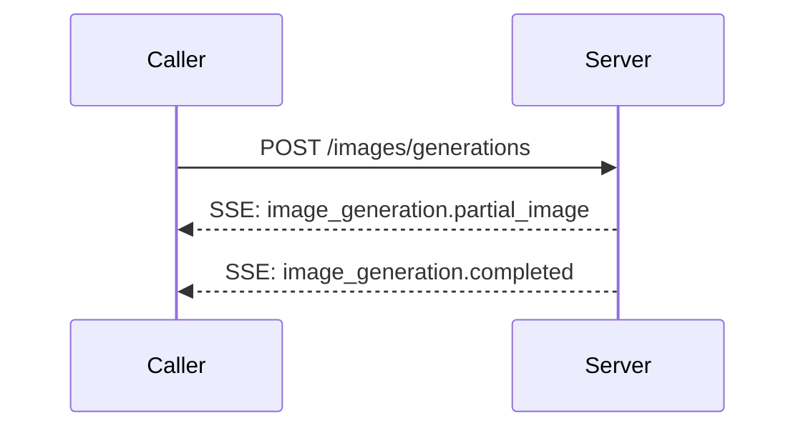

# OpenAI · Images API

---

## Schema Legend

### Column Order & Zone Logic

```
[ANCHOR]       [CLASSIFY]        [IDENTITY]        [CONTRACT]                                      [SEQUENCE]              [CLASSIFY-2]               [PROSE]                              [BINDING]
endpoint       kind              key · type · val  required · direction                            actor · seq-note        location · scope · pattern key-description · value-description  module · class · function
```

`endpoint` is col 1 because it is the primary grouping key — every other column is subordinate to it. A reader scans endpoint first to locate their context, then reads right into the row.

Zones read left-to-right from most structural (machine-queryable, sparse-friendly) to most discursive (human prose, binding metadata). The four sparsest columns (`module · class · function`, often blank during API reference pass) land at the far right so the informational core stays compact.

The `[SEQUENCE]` zone (`actor · seq-note`) sits between `[CONTRACT]` and `[CLASSIFY-2]` so that the direction of data flow (`direction`) is resolved before the participant (`actor`) and message label (`seq-note`) are assigned — enabling direct, lossless export to a Mermaid `sequenceDiagram` without touching any other column.

---

### Column Definitions

#### `endpoint`
The API operation this row belongs to. Format: `METHOD /path` (relative to `base-url`), e.g. `POST /images/generations`. Use `ALL` for rows that apply globally across every endpoint (base URL, auth headers). Sort rows by endpoint, then by kind order within each endpoint.

**Kind sort order within an endpoint:** `config → header → path → param → return → enum → error`
This mirrors the natural implementation read order: setup → request → response → reference → errors.

---

#### `kind`
Controlled vocabulary. Classifies what type of entity the row describes. Determines which other columns are applicable (see sparsity rules below).

| kind | meaning | typical `direction` | `required` |
|------|---------|-------------------|------------|
| `config` | Operational/environment-level setting not part of the wire format | `in` or `out` | `yes` or `—` |
| `header` | HTTP request or response header | `in` or `out` | `yes` or `no` |
| `path` | URL path segment variable, interpolated before the request is sent | `in` | `yes` |
| `param` | Request body or query string parameter | `in` | `yes`, `no`, or `conditional` |
| `return` | Response body field | `out` | `yes`, `no`, or `conditional` |
| `enum` | Enumerated valid value for a `param` or `return` key | same as parent | `—` |
| `error` | HTTP status code or named error code returned by the server | `out` | `—` |

---

#### `key`
The canonical field name as it appears on the wire (API param name, header name, response field, error code key). For nested fields use dot-notation: `data[].url`, `error.code`. For codebase binding rows, use the internal symbol name and cross-reference via `key-description`.

**Key sort order:** a→z within each `kind` group within each `endpoint`, except `enum` rows which sort a→z by `value`.

---

#### `type`
Data type of the field. Use wire-format types: `string`, `integer`, `boolean`, `float`, `array<T>`, `object`, `string (url)`, `string (base64)`, `integer (unix)`. For enums, repeat the parent type (usually `string`). For discriminated union arrays, use `array<object (union)>`.

---

#### `value`
The fixed, default, or example value for this field. Use backtick formatting for literal values: `` `application/json` ``. Leave blank if the value is caller-supplied and has no fixed default. For `enum` rows, this column carries the specific enum value being documented.

---

#### `required`
Whether the field must be present. Controlled vocabulary:

| value | meaning |
|-------|---------|
| `yes` | Always required |
| `no` | Optional |
| `conditional` | Required only under specific conditions (explain in `value-description`) |
| `—` | Not applicable (used for `enum` and `error` rows) |

---

#### `direction`
Data flow relative to the caller.

| value | meaning |
|-------|---------|
| `in` | Caller → Server (request) |
| `out` | Server → Caller (response) |

---

#### `actor`
The named participant that **sends** this message in a `sequenceDiagram`. Decouples participant identity from the binary `direction` axis so multi-party flows (e.g. server → webhook → caller) are unambiguous.

Controlled vocabulary (`actor-vocab` in frontmatter):

| value | meaning |
|------|---------|
| `Caller` | The API consumer (client application, SDK, browser) |
| `Server` | The API provider endpoint handling the request |
| `Broker` | An intermediary layer (queue, gateway, proxy) that relays messages between participants |
| `Webhook` | An external receiver the server POSTs callbacks to (owned by Caller but distinct from it in sequence) |
| `—` | Not applicable (`config`, `enum`, `error` rows that produce no diagram arrow) |

**Sparsity rule:** populate `—` for `config`, `enum`, and `error` rows. All other kinds must carry a named participant.

---

#### `seq-note`
A terse (≤ 60 characters) message label suitable for use as the arrow annotation in a Mermaid `sequenceDiagram`. Must be self-contained at a glance — no placeholders, no prose.

**Format:** imperative verb phrase or noun phrase that names the action, e.g.:
- `POST /images/generations`
- `Return data[] with b64_json or url`
- `SSE: image_generation.partial_image`
- `SSE: image_generation.completed`

**Rules:**
- No angle-bracket placeholders (`{{…}}`); use the actual key name or a short literal
- Prefer the HTTP method + path for top-level request rows
- Prefer `Return <key>` or `Respond <status>` for response rows
- Leave `—` for `config`, `enum`, and `error` rows that do not map to a diagram arrow

---

#### `location`
Where on the wire this field lives. Disambiguates `param` rows and is always populated for `path`, `header`, `param`, and `return` kinds. Use `—` for `config`, `enum`, and `error` rows.

| value | meaning |
|-------|---------|
| `path` | Interpolated into the URL path, e.g. `/tasks/{id}` |
| `query` | Appended to the URL as a query string, e.g. `?limit=10` |
| `body` | Sent in the HTTP request or response body (JSON unless noted) |
| `header` | Transmitted in an HTTP header |
| `—` | Not applicable (`config`, `enum`, `error`) |

---

#### `scope`
Applicability constraint for this row — which versions, plans, tiers, or named variants the field applies to. Leave blank (populate with `—`) when the field applies universally to all variants of this endpoint.

**Format:** a pipe-separated list of named applicability tokens, e.g. `gpt-image-1 | gpt-image-1-mini`, `dall-e-2 | dall-e-3`.

Use the API's own version/model/plan naming conventions verbatim. Do not invent abbreviations.

**Sparsity rule:** populate only when the field is genuinely restricted. A field available in all variants must carry `—`, not a list of every variant.

---

#### `pattern`
Structural pattern of this field's value shape. Enables tooling to select the correct parsing and validation strategy without reading prose.

| value | meaning |
|-------|---------|
| `scalar` | Single atomic value (string, integer, boolean, float) |
| `union` | Object whose shape is determined by a discriminant field (`type`, `kind`, etc.) |
| `array<union>` | Array where each element is a discriminated union object |
| `webhook` | String field that, when set, causes the server to POST responses to the supplied URL |
| `state-machine` | Enumerable field whose values represent discrete lifecycle states with defined legal transitions |
| `—` | Not applicable or pattern is trivially scalar |

**Sparsity rule:** use `scalar` only when the distinction matters. For `header`, `path`, `enum`, `error`, and most `config` rows, populate with `—`.

---

#### `key-description`
**Pattern: role → action → outcome**
Who uses this field → what it does mechanically → why it matters / what it affects downstream.

Format: `{Actor} → {verb phrase} → {consequence}`

---

#### `value-description`
**Pattern: structured prose**
Describes the valid value space, defaults, constraints, and behavioural notes for the field.

---

#### `module · class · function`
Codebase binding columns. Leave blank during the API reference pass. Populated in a separate binding pass via static analysis or manual mapping.

---

### Categorisation Decisions

**`kind = config` vs `kind = param`**
`config` is for environment-level or operational settings not part of the wire request body (base URL, polling interval, TTL constants). `param` is for per-request fields sent in the HTTP body or query string.

**`kind = enum` rows**
Each valid value for a constrained field gets its own `enum` row. The `key` column repeats the parent param key. The `value` column carries the specific enum value. `required = —`. This makes each option independently queryable and annotatable without embedding all options in a single `value-description` cell.

**`required = conditional`**
Use when a field is required only in certain configurations. Always state the triggering condition in `value-description`.

**`endpoint = ALL`**
Use only for rows that are literally universal — apply to every endpoint in this document regardless of method or path.

---

### Mermaid `sequenceDiagram` Export Guide

The two columns enable mechanical export. The mapping is:

| table column | `sequenceDiagram` construct |
|---|---|
| `actor` | participant / actor node label |
| `direction = in` | `->>` arrow from `actor` to counterpart |
| `direction = out` | `-->>` return arrow from `actor` to counterpart |
| `seq-note` | arrow label text |
| `pattern = state-machine` | candidates for `Note over Server: state` annotations |
| `scope` | optionally gates the arrow inside an `opt` or `alt` block |

**Example output:**



---

## Table

| endpoint | kind | key | type | value | required | direction | actor | seq-note | location | scope | pattern | key-description | value-description | module | class | function |
|----------|------|-----|------|-------|----------|-----------|-------|----------|----------|-------|---------|-----------------|-------------------|--------|-------|----------|
| ALL | config | base_url | string | `https://api.openai.com/v1` | yes | in | — | — | — | — | — | Operator → set API base URL → scopes all requests to the OpenAI API | Fixed; no trailing slash; all endpoints are relative to this base | | | |
| ALL | header | Authorization | string | `Bearer <api-key>` | yes | in | Caller | Authenticate request | header | — | — | Caller → authenticate request → grants access to the OpenAI API | API key authentication; prefix value with Bearer; obtain key from platform.openai.com | | | |
| ALL | header | Content-Type | string | `application/json` | yes | in | Caller | Declare JSON body encoding | header | — | — | Caller → declare request body encoding → ensures server parses JSON body correctly | Fixed value for JSON body requests; multipart/form-data used for variations endpoint | | | |
| POST /images/generations | param | background | string | `auto` | no | in | Caller | POST /images/generations | body | gpt-image | scalar | Caller → set background transparency → controls whether generated image has a transparent background | Default: auto; Options: transparent, opaque, auto; only supported for GPT image models; transparent requires output_format png or webp | | | |
| POST /images/generations | param | model | string | `dall-e-2` | no | in | Caller | POST /images/generations | body | — | scalar | Caller → specify image generation model → routes request to the correct model version | Options: dall-e-2, dall-e-3, gpt-image-1, gpt-image-1-mini, gpt-image-1.5; defaults to dall-e-2 unless a GPT-image-specific param is used | | | |
| POST /images/generations | param | moderation | string | `auto` | no | in | Caller | POST /images/generations | body | gpt-image | scalar | Caller → set content moderation level → controls filtering strictness for generated images | Default: auto; Options: low (less restrictive), auto (default); only supported for GPT image models | | | |
| POST /images/generations | param | n | integer | `1` | no | in | Caller | POST /images/generations | body | — | scalar | Caller → set number of images to generate → controls output count | Range: 1–10; dall-e-3 only supports n=1 | | | |
| POST /images/generations | param | output_compression | integer | `100` | no | in | Caller | POST /images/generations | body | gpt-image | scalar | Caller → set output compression level → controls file size of generated images | Range: 0–100 (%); only supported for GPT image models with webp or jpeg output format; default 100 means no compression | | | |
| POST /images/generations | param | output_format | string | `png` | no | in | Caller | POST /images/generations | body | gpt-image | scalar | Caller → set output image format → determines container format of returned image bytes | Options: png, jpeg, webp; only supported for GPT image models; dall-e models always return png | | | |
| POST /images/generations | param | partial_images | integer | `0` | no | in | Caller | POST /images/generations | body | gpt-image | scalar | Caller → set partial image count for streaming → controls number of progressive preview events | Range: 0–3; 0 means single final image in one event; final image may arrive before all partials are generated | | | |
| POST /images/generations | param | prompt | string | | yes | in | Caller | POST /images/generations | body | — | scalar | Caller → supply text description → drives content and style of the generated image | Max length: 32000 chars (GPT image models), 4000 chars (dall-e-3), 1000 chars (dall-e-2) | | | |
| POST /images/generations | param | quality | string | `auto` | no | in | Caller | POST /images/generations | body | — | scalar | Caller → set image quality → controls generation fidelity and compute cost | Default: auto; Options: auto, high, medium, low (GPT image models); hd, standard (dall-e-3); standard only (dall-e-2) | | | |
| POST /images/generations | param | response_format | string | `url` | no | in | Caller | POST /images/generations | body | dall-e | scalar | Caller → select delivery method for generated images → determines whether images are returned as URLs or inline Base64 | Options: url (default, valid 60 min), b64_json; only supported for dall-e-2 and dall-e-3; GPT image models always return b64_json | | | |
| POST /images/generations | param | size | string | `1024x1024` | no | in | Caller | POST /images/generations | body | — | scalar | Caller → set output image dimensions → controls resolution and aspect ratio | dall-e-2: 256x256, 512x512, 1024x1024; dall-e-3: 1024x1024, 1792x1024, 1024x1792; GPT image models: 1024x1024, 1536x1024, 1024x1536, auto; gpt-image-2 supports arbitrary WxH divisible by 16 with aspect ratio 1:3 to 3:1, max 3840x2160 | | | |
| POST /images/generations | param | stream | boolean | `false` | no | in | Caller | POST /images/generations | body | gpt-image | scalar | Caller → enable streaming output → switches response delivery from batch to incremental SSE events | Default: false; true → SSE events with progressive partial images; only supported for GPT image models | | | |
| POST /images/generations | param | style | string | `vivid` | no | in | Caller | POST /images/generations | body | dall-e-3 | scalar | Caller → set image style → controls hyper-realism vs naturalism | Options: vivid (hyper-real, dramatic), natural (less hyper-real); only supported for dall-e-3 | | | |
| POST /images/generations | param | user | string | | no | in | Caller | POST /images/generations | body | — | scalar | Caller → supply end-user identifier → enables abuse monitoring per user | Unique identifier representing the end-user; helps OpenAI monitor and detect abuse | | | |
| POST /images/generations | return | created | integer (unix) | | yes | out | Server | Return created | body | non-streaming | scalar | Server → report request creation timestamp → enables logging and correlation | Unix timestamp in seconds | | | |
| POST /images/generations | return | background | string | | no | out | Server | Return background | body | non-streaming | scalar | Server → echo background setting → confirms the transparency mode used for generation | Either transparent or opaque; only present when background param was set | | | |
| POST /images/generations | return | data | array<Image> | | yes | out | Server | Return data | body | non-streaming | — | Server → deliver all generated images → contains per-image result objects | Array of Image objects; typically one element for dall-e-3, up to 10 for dall-e-2 | | | |
| POST /images/generations | return | data[].b64_json | string (base64) | | no | out | Server | Return data[].b64_json | body | non-streaming | scalar | Server → deliver inline image data as Base64 → caller decodes to obtain image bytes without a separate HTTP fetch | Returned by default for GPT image models; only present for dall-e models when response_format=b64_json | | | |
| POST /images/generations | return | data[].revised_prompt | string | | no | out | Server | Return data[].revised_prompt | body | non-streaming · dall-e-3 | scalar | Server → return the revised prompt used for generation → shows how the model interpreted the input prompt | Only present for dall-e-3; the prompt that was actually used to generate the image | | | |
| POST /images/generations | return | data[].url | string (url) | | no | out | Server | Return data[].url | body | non-streaming · dall-e | scalar | Server → deliver image download link → caller must fetch and store the image before the link expires | Only present for dall-e models when response_format=url; URL valid for 60 minutes; unsupported for GPT image models | | | |
| POST /images/generations | return | output_format | string | | no | out | Server | Return output_format | body | non-streaming · gpt-image | scalar | Server → echo output format → confirms the container format of generated images | Either png, webp, or jpeg; only present for GPT image models | | | |
| POST /images/generations | return | quality | string | | no | out | Server | Return quality | body | non-streaming · gpt-image | scalar | Server → echo quality setting → confirms the quality level used for generation | Either low, medium, or high; only present for GPT image models | | | |
| POST /images/generations | return | size | string | | no | out | Server | Return size | body | non-streaming · gpt-image | scalar | Server → echo image dimensions → confirms the pixel dimensions of generated images | Either 1024x1024, 1024x1536, or 1536x1024; only present for GPT image models | | | |
| POST /images/generations | return | usage | object | | no | out | Server | Return usage | body | non-streaming · gpt-image | — | Server → report token usage statistics → used for billing and monitoring | Only present for GPT image models; contains input_tokens, output_tokens, total_tokens and detail breakdowns | | | |
| POST /images/generations | return | usage.input_tokens | integer | | yes | out | Server | Return usage.input_tokens | body | non-streaming · gpt-image | scalar | Server → report input token count → number of tokens in the prompt including images and text | Includes both text_tokens and image_tokens | | | |
| POST /images/generations | return | usage.input_tokens_details.image_tokens | integer | | yes | out | Server | Return usage.input_tokens_details.image_tokens | body | non-streaming · gpt-image | scalar | Server → report input image token count → number of tokens consumed by input images | Only present when input images are provided | | | |
| POST /images/generations | return | usage.input_tokens_details.text_tokens | integer | | yes | out | Server | Return usage.input_tokens_details.text_tokens | body | non-streaming · gpt-image | scalar | Server → report input text token count → number of tokens consumed by the text prompt | Always present in input_tokens_details | | | |
| POST /images/generations | return | usage.output_tokens | integer | | yes | out | Server | Return usage.output_tokens | body | non-streaming · gpt-image | scalar | Server → report output token count → number of image tokens in the generated output | | | |
| POST /images/generations | return | usage.total_tokens | integer | | yes | out | Server | Return usage.total_tokens | body | non-streaming · gpt-image | scalar | Server → report total token count → sum of input and output tokens | | | |
| POST /images/generations | return | usage.output_tokens_details.image_tokens | integer | | no | out | Server | Return usage.output_tokens_details.image_tokens | body | non-streaming · gpt-image-1 | scalar | Server → report output image token count → number of image output tokens generated by the model | Only present for gpt-image-1 and later | | | |
| POST /images/generations | return | usage.output_tokens_details.text_tokens | integer | | no | out | Server | Return usage.output_tokens_details.text_tokens | body | non-streaming · gpt-image-1 | scalar | Server → report output text token count → number of text output tokens generated by the model | Only present for gpt-image-1 and later | | | |
| POST /images/generations | return | b64_json | string (base64) | | yes | out | Server | SSE: Return b64_json | body | streaming · image_generation.partial_image · image_generation.completed | scalar | Server → deliver base64-encoded image data → caller renders partial or final image from decoded bytes | Present in both partial_image and completed events; partial_image provides progressive preview, completed provides final image | | | |
| POST /images/generations | return | background | string | | yes | out | Server | SSE: Return background | body | streaming · gpt-image | scalar | Server → echo background setting in SSE event → confirms transparency mode for streamed image | Either transparent, opaque, or auto | | | |
| POST /images/generations | return | created_at | integer (unix) | | yes | out | Server | SSE: Return created_at | body | streaming | scalar | Server → report event creation timestamp → enables event correlation and timing | Unix timestamp in seconds | | | |
| POST /images/generations | return | output_format | string | | yes | out | Server | SSE: Return output_format | body | streaming · gpt-image | scalar | Server → echo output format in SSE event → confirms container format for streamed image | Either png, webp, or jpeg | | | |
| POST /images/generations | return | partial_image_index | integer | | yes | out | Server | SSE: Return partial_image_index | body | streaming · image_generation.partial_image | scalar | Server → identify partial image position → allows caller to track progressive preview ordering | 0-based index; increments for each partial_image event | | | |
| POST /images/generations | return | quality | string | | yes | out | Server | SSE: Return quality | body | streaming · gpt-image | scalar | Server → echo quality setting in SSE event → confirms quality level for streamed image | Either low, medium, high, or auto | | | |
| POST /images/generations | return | size | string | | yes | out | Server | SSE: Return size | body | streaming · gpt-image | scalar | Server → report image dimensions in SSE event → informs caller of pixel dimensions for layout | Either 1024x1024, 1024x1536, 1536x1024, or auto | | | |
| POST /images/generations | return | type | string | | yes | out | Server | SSE: Return event type | body | streaming | state-machine | Server → identify SSE event kind → allows caller to route each event to the correct handler | Discriminant for streaming event; Options: image_generation.partial_image, image_generation.completed | | | |
| POST /images/generations | return | usage | object | | yes | out | Server | SSE: Return usage | body | streaming · image_generation.completed | — | Server → report final token usage after generation completes → used for billing and monitoring | Present only in the completed event; contains input_tokens, output_tokens, total_tokens and detail breakdowns | | | |
| POST /images/generations | enum | background | string | `auto` | — | in | — | — | — | gpt-image | — | Automatic background selection | Model determines best background for the image | | | |
| POST /images/generations | enum | background | string | `opaque` | — | in | — | — | — | gpt-image | — | Opaque background | Generated image has a solid, non-transparent background | | | |
| POST /images/generations | enum | background | string | `transparent` | — | in | — | — | — | gpt-image | — | Transparent background | Generated image has a transparent background; requires output_format png or webp | | | |
| POST /images/generations | enum | model | string | `dall-e-2` | — | in | — | — | — | — | — | DALL-E 2 model | Original DALL-E model; supports 256x256, 512x512, 1024x1024; supports n up to 10; supports response_format url and b64_json | | | |
| POST /images/generations | enum | model | string | `dall-e-3` | — | in | — | — | — | — | — | DALL-E 3 model | Higher quality; supports 1024x1024, 1792x1024, 1024x1792; n=1 only; supports style vivid/natural; returns revised_prompt | | | |
| POST /images/generations | enum | model | string | `gpt-image-1` | — | in | — | — | — | — | — | GPT Image 1 model | Native image generation; returns b64_json by default; supports streaming, background, output_format, quality, partial_images | | | |
| POST /images/generations | enum | model | string | `gpt-image-1-mini` | — | in | — | — | — | — | — | GPT Image 1 Mini model | Lightweight GPT image model; same features as gpt-image-1; lower cost | | | |
| POST /images/generations | enum | model | string | `gpt-image-1.5` | — | in | — | — | — | — | — | GPT Image 1.5 model | Latest GPT image model; supports all GPT image features including arbitrary resolutions (gpt-image-2) | | | |
| POST /images/generations | enum | quality | string | `auto` | — | in | — | — | — | gpt-image | — | Automatic quality selection | Model selects best quality for the given configuration; default value | | | |
| POST /images/generations | enum | quality | string | `hd` | — | in | — | — | — | dall-e-3 | — | HD quality | Higher detail and fidelity; dall-e-3 only | | | |
| POST /images/generations | enum | quality | string | `high` | — | in | — | — | — | gpt-image | — | High quality | Highest fidelity output; GPT image models only | | | |
| POST /images/generations | enum | quality | string | `low` | — | in | — | — | — | gpt-image | — | Low quality | Lower fidelity, faster generation; GPT image models only | | | |
| POST /images/generations | enum | quality | string | `medium` | — | in | — | — | — | gpt-image | — | Medium quality | Balanced fidelity and speed; GPT image models only | | | |
| POST /images/generations | enum | quality | string | `standard` | — | in | — | — | — | dall-e-2 · dall-e-3 | — | Standard quality | Default quality for dall-e models; dall-e-2 only supports standard | | | |
| POST /images/generations | enum | response_format | string | `b64_json` | — | in | — | — | — | dall-e | — | Base64 JSON response | Image returned as base64-encoded string in response body; dall-e models only | | | |
| POST /images/generations | enum | response_format | string | `url` | — | in | — | — | — | dall-e | — | URL response (default) | Image returned as temporary HTTPS URL; valid 60 minutes; dall-e models only | | | |
| POST /images/generations | enum | style | string | `natural` | — | in | — | — | — | dall-e-3 | — | Natural style | Less hyper-real, more natural looking images; dall-e-3 only | | | |
| POST /images/generations | enum | style | string | `vivid` | — | in | — | — | — | dall-e-3 | — | Vivid style | Hyper-real, dramatic images; dall-e-3 only | | | |
| POST /images/generations | enum | type | string | `image_generation.completed` | — | out | — | — | — | streaming | — | Final generation completed event | Emitted when the final image is available; includes b64_json and usage | | | |
| POST /images/generations | enum | type | string | `image_generation.partial_image` | — | out | — | — | — | streaming | — | Partial image preview event | Emitted when a progressive preview is available; includes b64_json and partial_image_index | | | |
| POST /images/edits | param | image | object | | yes | in | Caller | POST /images/edits | body | dall-e-2 | — | Caller → supply source image → provides the image to edit via file upload | Multipart form field; the source image file; dall-e-2 only supports multipart form | | | |
| POST /images/edits | param | images | array<object (union)> | | yes | in | Caller | POST /images/edits | body | gpt-image | array<union> | Caller → supply input image references → provides source images for editing | Up to 16 images for GPT image models; each element has file_id or image_url | | | |
| POST /images/edits | param | images[].file_id | string | | no | in | Caller | POST /images/edits | body | gpt-image | scalar | Caller → reference uploaded file → provides image via File API ID | The File API ID of a previously uploaded image | | | |
| POST /images/edits | param | images[].image_url | string | | no | in | Caller | POST /images/edits | body | gpt-image | scalar | Caller → supply image URL or base64 → provides image inline without prior upload | Fully qualified URL or base64-encoded data URL | | | |
| POST /images/edits | param | mask | object | | no | in | Caller | POST /images/edits | body | dall-e-2 | — | Caller → supply edit mask → defines which area of the image to edit | Multipart form field; transparent areas of the mask indicate where to edit; dall-e-2 only | | | |
| POST /images/edits | param | model | string | | no | in | Caller | POST /images/edits | body | — | scalar | Caller → specify image editing model → routes request to the correct model version | Options: dall-e-2, gpt-image-1, gpt-image-1-mini, gpt-image-1.5, chatgpt-image-latest | | | |
| POST /images/edits | param | prompt | string | | yes | in | Caller | POST /images/edits | body | — | scalar | Caller → supply edit instruction → describes the desired modification to the source image | Text description of the desired image edit | | | |
| POST /images/edits | param | background | string | `auto` | no | in | Caller | POST /images/edits | body | gpt-image | scalar | Caller → set background transparency → controls whether edited image has a transparent background | Same semantics as POST /images/generations background param | | | |
| POST /images/edits | param | input_fidelity | string | `high` | no | in | Caller | POST /images/edits | body | gpt-image | scalar | Caller → control input image fidelity → determines how closely the output preserves the original | Options: high (preserve original closely), low (allow more creative changes) | | | |
| POST /images/edits | param | moderation | string | `auto` | no | in | Caller | POST /images/edits | body | gpt-image | scalar | Caller → set content moderation level → controls filtering strictness for edited images | Same semantics as POST /images/generations moderation param | | | |
| POST /images/edits | param | n | integer | `1` | no | in | Caller | POST /images/edits | body | — | scalar | Caller → set number of edited images → controls output count | Range: 1–10; dall-e-3 only supports n=1 | | | |
| POST /images/edits | param | output_compression | integer | `100` | no | in | Caller | POST /images/edits | body | gpt-image | scalar | Caller → set output compression level → controls file size of edited images | Same semantics as POST /images/generations output_compression param | | | |
| POST /images/edits | param | output_format | string | `png` | no | in | Caller | POST /images/edits | body | gpt-image | scalar | Caller → set output image format → determines container format of edited image | Options: png, jpeg, webp; only supported for GPT image models | | | |
| POST /images/edits | param | partial_images | integer | `0` | no | in | Caller | POST /images/edits | body | gpt-image | scalar | Caller → set partial image count for streaming → controls number of progressive preview events | Same semantics as POST /images/generations partial_images param | | | |
| POST /images/edits | param | quality | string | `auto` | no | in | Caller | POST /images/edits | body | gpt-image | scalar | Caller → set edited image quality → controls generation fidelity | Same semantics as POST /images/generations quality param | | | |
| POST /images/edits | param | size | string | `1024x1024` | no | in | Caller | POST /images/edits | body | — | scalar | Caller → set output image dimensions → controls resolution and aspect ratio of edited image | Options: auto, 1024x1024, 1536x1024, 1024x1536 | | | |
| POST /images/edits | param | stream | boolean | `false` | no | in | Caller | POST /images/edits | body | gpt-image | scalar | Caller → enable streaming output → switches response delivery to incremental SSE events | Default: false; true → SSE events with progressive partial images; only supported for GPT image models | | | |
| POST /images/edits | param | user | string | | no | in | Caller | POST /images/edits | body | — | scalar | Caller → supply end-user identifier → enables abuse monitoring per user | Same semantics as POST /images/generations user param | | | |
| POST /images/edits | return | created | integer (unix) | | yes | out | Server | Return created | body | non-streaming | scalar | Server → report request creation timestamp → enables logging and correlation | Unix timestamp in seconds | | | |
| POST /images/edits | return | data | array<Image> | | yes | out | Server | Return data | body | non-streaming | — | Server → deliver all edited images → contains per-image result objects | Same structure as POST /images/generations data response | | | |
| POST /images/edits | return | b64_json | string (base64) | | yes | out | Server | SSE: Return b64_json | body | streaming · image_edit.partial_image · image_edit.completed | scalar | Server → deliver base64-encoded edited image data → caller renders partial or final edited image | Present in both partial_image and completed events | | | |
| POST /images/edits | return | background | string | | yes | out | Server | SSE: Return background | body | streaming · gpt-image | scalar | Server → echo background setting in SSE event → confirms transparency mode for streamed edit | Either transparent, opaque, or auto | | | |
| POST /images/edits | return | created_at | integer (unix) | | yes | out | Server | SSE: Return created_at | body | streaming | scalar | Server → report event creation timestamp → enables event correlation and timing | Unix timestamp in seconds | | | |
| POST /images/edits | return | output_format | string | | yes | out | Server | SSE: Return output_format | body | streaming · gpt-image | scalar | Server → echo output format in SSE event → confirms container format for streamed edited image | Either png, webp, or jpeg | | | |
| POST /images/edits | return | partial_image_index | integer | | yes | out | Server | SSE: Return partial_image_index | body | streaming · image_edit.partial_image | scalar | Server → identify partial image position → allows caller to track progressive preview ordering | 0-based index; increments for each partial_image event | | | |
| POST /images/edits | return | quality | string | | yes | out | Server | SSE: Return quality | body | streaming · gpt-image | scalar | Server → echo quality setting in SSE event → confirms quality level for streamed edited image | Either low, medium, high, or auto | | | |
| POST /images/edits | return | size | string | | yes | out | Server | SSE: Return size | body | streaming · gpt-image | scalar | Server → report image dimensions in SSE event → informs caller of pixel dimensions for layout | Either 1024x1024, 1024x1536, 1536x1024, or auto | | | |
| POST /images/edits | return | type | string | | yes | out | Server | SSE: Return event type | body | streaming | state-machine | Server → identify SSE event kind → allows caller to route each event to the correct handler | Discriminant for streaming event; Options: image_edit.partial_image, image_edit.completed | | | |
| POST /images/edits | return | usage | object | | yes | out | Server | SSE: Return usage | body | streaming · image_edit.completed | — | Server → report final token usage after edit completes → used for billing and monitoring | Present only in the completed event; contains input_tokens, output_tokens, total_tokens and detail breakdowns | | | |
| POST /images/edits | enum | type | string | `image_edit.completed` | — | out | — | — | — | streaming | — | Final edit completed event | Emitted when the final edited image is available; includes b64_json and usage | | | |
| POST /images/edits | enum | type | string | `image_edit.partial_image` | — | out | — | — | — | streaming | — | Partial edited image preview event | Emitted when a progressive preview of the edited image is available; includes b64_json and partial_image_index | | | |
| POST /images/variations | param | image | object | | yes | in | Caller | POST /images/variations | body | dall-e-2 | — | Caller → supply source image → provides the image to create variations from | Multipart form field; the source image file; dall-e-2 only | | | |
| POST /images/variations | param | model | string | `dall-e-2` | no | in | Caller | POST /images/variations | body | dall-e-2 | scalar | Caller → specify model → routes request to the correct model version | Only dall-e-2 is supported for variations endpoint | | | |
| POST /images/variations | param | n | integer | `1` | no | in | Caller | POST /images/variations | body | dall-e-2 | scalar | Caller → set number of variations → controls output count | Range: 1–10 | | | |
| POST /images/variations | param | response_format | string | `url` | no | in | Caller | POST /images/variations | body | dall-e-2 | scalar | Caller → select delivery method → determines whether variations are returned as URLs or inline Base64 | Options: url (default, valid 60 min), b64_json | | | |
| POST /images/variations | param | size | string | `1024x1024` | no | in | Caller | POST /images/variations | body | dall-e-2 | scalar | Caller → set output image dimensions → controls resolution and aspect ratio | Options: 256x256, 512x512, 1024x1024 | | | |
| POST /images/variations | param | user | string | | no | in | Caller | POST /images/variations | body | dall-e-2 | scalar | Caller → supply end-user identifier → enables abuse monitoring per user | Same semantics as POST /images/generations user param | | | |
| POST /images/variations | return | created | integer (unix) | | yes | out | Server | Return created | body | non-streaming | scalar | Server → report request creation timestamp → enables logging and correlation | Unix timestamp in seconds | | | |
| POST /images/variations | return | data | array<Image> | | yes | out | Server | Return data | body | non-streaming | — | Server → deliver all variation images → contains per-image result objects | Same structure as POST /images/generations data response | | | |

---

*Source: OpenAI Images API · developers.openai.com/api/reference/resources/images · retrieved 2026-05-07*
*fetch-status: scraped · complete*
*`module · class · function` columns intentionally blank — pending codebase binding pass*
