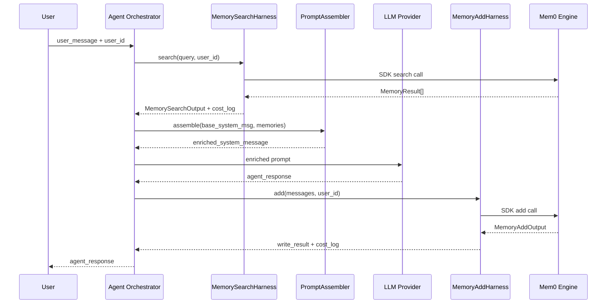

# Knowgrph — AI Agents Universal Memory Layer PRD/TAD

> SSOT upstream: [mem0ai/mem0](https://github.com/mem0ai/mem0) · [docs.mem0.ai](https://docs.mem0.ai/overview)
>
> Governing guidelines: [prd-tad-guidelines.md](../../../../huijoohwee.github.io/guidelines/prd-tad-guidelines.md)

---

## Overview

This document covers the product requirements and technical architecture for integrating a **universal memory layer** into Knowgrph's AI agent pipelines. The memory layer provides persistent, self-improving context that survives across sessions, enabling agents to personalize responses, avoid re-asking known facts, and reason across temporal context windows.

The reference implementation is **mem0** (mem-zero) — an FOSS-first, provider-agnostic memory engine available as a managed platform (`MemoryClient`) or a self-hosted OSS stack (`Memory`). Both products share the same four-primitive CRUD API surface: `add`, `search`, `update`, `delete`.

Credentials (`MEM0_API_KEY`, provider API keys) are operator-supplied settings exclusively and are **never hardcoded** in the repository.

---

## PRD — Product Requirements

### Problem Statement

AI agents in Knowgrph today operate statelessly: each session starts cold, forcing users to repeat preferences, context, and prior decisions. This degrades personalization, inflates token consumption on repeated context reconstruction, and prevents agents from building cumulative knowledge across interactions.

**User impact**: agents feel amnesiac; session onboarding friction is high; prompt sizes bloat with repeated background context.

**Opportunity**: a drop-in memory layer that persists structured facts across sessions reduces per-request token cost, eliminates re-asking, and enables agents to behave as long-term collaborators.

### Personas

**Persona A — Knowgrph Power User**
- Job-to-be-done: operate long-running research or content projects spanning days/weeks with AI agent assistance
- Pain point: re-briefing agents at each session; agent forgets prior decisions
- Desired outcome: agent recalls past choices and preferences without prompting

**Persona B — Knowgrph Agent Pipeline Developer**
- Job-to-be-done: build agent workflows that personalize over time
- Pain point: no standard primitive for cross-session memory; ad-hoc vector stores accumulate debt
- Desired outcome: a typed, harness-wrapped memory client callable from any agent node

**Persona C — Solo Founder / Operator**
- Job-to-be-done: run Knowgrph at near-zero TCO
- Pain point: proprietary memory vendors add fixed monthly cost
- Desired outcome: FOSS-default stack with zero infrastructure spend at small scale

### User Journey — Knowgrph Power User

| Stage | Action | Touchpoint | Pain Point | Opportunity |
|---|---|---|---|---|
| Trigger | Opens Knowgrph; starts AI session | Chat / Agent panel | Must re-explain preferences | Memory recall on session open |
| Engage | Gives agent a new instruction | Agent input | Agent forgets previous instruction next session | Store instruction → user memory |
| Progress | Agent uses stored context | Agent output | No evidence agent remembers | Surface memory attribution in UI |
| Return | Re-opens session days later | Chat panel | Cold start | Warm start from user memory |
| Evolve | Preference changes | Agent input | Stale memories override new intent | Conflict resolution → update memory |

### User Stories

**Epic MEM-1 — Persistent Cross-Session Context**

**MEM-1-S1**: As a power user, I want agents to recall my stated preferences from prior sessions, so that I do not repeat myself at every session start.
- **Given** I provided a preference in a previous session
- **When** I start a new agent session
- **Then** the agent surfaces that preference without me re-stating it

**MEM-1-S2**: As a power user, I want memories to update when I correct or change a preference, so that the agent acts on the latest truth rather than stale context.
- **Given** I previously stated preference X
- **When** I state preference Y (contradicting X) in a new turn
- **Then** the agent stores Y and supersedes X via conflict resolution

**Epic MEM-2 — Token-Efficient Context Injection**

**MEM-2-S1**: As an agent pipeline developer, I want relevant memories injected into agent prompts automatically and selectively, so that token spend per request is minimized while personalization is maximized.
- **Given** the agent receives a user query
- **When** the memory search harness is invoked
- **Then** only semantically relevant memories (top-K) are appended to the prompt, not the full memory corpus

**MEM-2-S2**: As an agent pipeline developer, I want memory retrieval latency to stay below 100 ms p95 at target load, so that agent response time is not degraded by the memory step.
- **Given** a memory search call with a single query and user scope
- **When** the call resolves
- **Then** the response completes within 100 ms p95 under stated load

**Epic MEM-3 — FOSS-First Self-Hostable Stack**

**MEM-3-S1**: As an operator, I want to run the memory layer on self-hosted infrastructure (Qdrant + local LLM) with zero external API cost at small scale, so that TCO remains zero during development and low-traffic phases.
- **Given** the OSS stack is configured with a local vector store and local embedder
- **When** add/search operations are issued
- **Then** no external API calls are made unless the operator explicitly configures a remote provider

**Epic MEM-4 — MCP-Native Memory Access**

**MEM-4-S1**: As an agent pipeline developer, I want to expose memory operations as MCP tools (add_memory, search_memories, get_memories, update_memory, delete_memory), so that any MCP-compatible agent or LLM orchestrator can consume memory without SDK coupling.
- **Given** the Mem0 MCP server is registered
- **When** an agent issues a tool call to `search_memories`
- **Then** the MCP server returns ranked memories for the queried scope

### MoSCoW Prioritization

| Feature | Tier | ROI Rationale |
|---|---|---|
| Cross-session user memory (MEM-1) | **Must** | Direct reduction of session re-briefing; high reach |
| Token-efficient top-K memory injection (MEM-2-S1) | **Must** | Reduces prompt token cost at every agent call |
| Memory retrieval latency < 100 ms p95 (MEM-2-S2) | **Must** | Prerequisite for production agent pipelines |
| FOSS self-hosted stack support (MEM-3) | **Must** | TCO-zero default; no vendor lock-in |
| MCP-native memory tools (MEM-4) | **Should** | Enables agent framework portability |
| Conflict resolution / preference update (MEM-1-S2) | **Must** | Stale memories corrupt personalization |
| Multimodal memory input (images, PDFs) | **Could** | Secondary; applicable after text memory is stable |
| Organizational / shared multi-agent memory | **Could** | Multi-tenant use case; deferred |
| Memory decay / recency weighting | **Could** | Platform-tier feature; OSS fallback via score thresholding |
| Webhooks on memory change | **Won't** | No current downstream consumer |

### Min-Viable Scope

Smallest deliverable satisfying Must-tier acceptance criteria:
- `add` and `search` harness wrappers operational in agent pipeline
- User-scoped memory persisted and retrieved across sessions
- Top-K semantic search injected into agent prompt
- FOSS-default config (Qdrant + FOSS embedder) with zero external cost at dev load
- Operator-supplied API key injected via environment variable; never hardcoded

### Success Metrics

| Metric | Baseline | Target | Timeline |
|---|---|---|---|
| Session re-briefing rate | ~100% (every session cold-starts) | < 20% | Sprint +2 |
| Prompt tokens / request (with memory injection) | N/A (no memory) | ≤ baseline + 200 tokens (top-K injection overhead) | Sprint +2 |
| Memory retrieval latency p95 | N/A | < 100 ms | Sprint +2 |
| Memory add latency p95 | N/A | < 300 ms | Sprint +2 |
| Monthly infra TCO (OSS path) | — | $0 at dev load | Sprint +1 |
| Token cost / month (Platform path, per 1K sessions) | — | Document in ADR-MEM-01 at actual load | Sprint +3 |
| ROI score (MEM-1) | — | ≥ 4 (impact 5 × reach 100 / (8h + $0 TCO + ~$0.02 token)) | Phase 0 gate |

### Out of Scope

- Custom memory extraction prompt tuning (deferred to Phase 2)
- Organizational / multi-tenant shared memory namespace
- Memory export pipeline to external data warehouses
- Web UI for memory inspection (operator uses Mem0 dashboard or CLI)
- Training or fine-tuning on stored memories

### Open Questions

1. Should memory scope be `user_id` only, or should Knowgrph also scope by `agent_id` and `run_id` for session-level isolation?
2. What is the target load (concurrent sessions) that determines the Platform vs OSS inflection point for TCO?
3. Should memory conflict resolution be fully automatic (Mem0 default) or require agent-layer review before committing updates?

---

## TAD — Technical Architecture

### Architecture Overview

```
User / Agent Request
        │
        ▼
┌─────────────────────────────────────┐
│  Agent Orchestrator Node            │
│  (LangChain / CrewAI / custom)      │
└──────────┬──────────────────────────┘
           │ query + user_id
           ▼
┌─────────────────────────────────────┐
│  Memory Search Harness              │  ← typed input schema
│  [search_memories(query, scope)]    │  ← LLM-agnostic
│  returns top-K MemoryResult[]       │  ← typed output schema
└──────────┬──────────────────────────┘
           │ ranked memories
           ▼
┌─────────────────────────────────────┐
│  Prompt Assembly                    │
│  [inject memories into system msg]  │
└──────────┬──────────────────────────┘
           │ enriched prompt
           ▼
┌─────────────────────────────────────┐
│  LLM Provider                       │
│  (any provider, swap freely)        │
└──────────┬──────────────────────────┘
           │ agent response
           ▼
┌─────────────────────────────────────┐
│  Memory Add Harness                 │  ← typed input schema
│  [add_memory(messages, scope)]      │  ← extracts + deduplicates
│  returns MemoryWriteResult          │  ← typed output schema + cost log
└─────────────────────────────────────┘
           │
           ▼
┌─────────────────────────────────────┐
│  Mem0 Engine                        │
│  Platform (managed) │ OSS (FOSS)    │
│  Vector Store + LLM Extractor       │
│  + optional Graph Store             │
└─────────────────────────────────────┘
```

### Journey → System Mapping

| Journey Stage | Workflow | Data Flow | Component |
|---|---|---|---|
| Session open | Memory recall on warm start | User query → search harness → top-K memories → prompt | MemorySearchHarness |
| Agent instruction received | Store new preference | Agent turn messages → add harness → Mem0 engine → vector store | MemoryAddHarness |
| Preference conflict | Conflict resolution | add call → Mem0 dedup/conflict → update memory record | Mem0 engine (internal) |
| Agent response generated | Memory attribution | MemoryResult[] → prompt injection | PromptAssembler |
| MCP tool call | MCP memory access | Tool call → MCP server → Mem0 engine | Mem0McpAdapter |

### Component Specifications

---

#### Component: MemorySearchHarness

**Responsibility**: Accept a query string and entity scope; invoke Mem0 search; return ranked MemoryResult[]; emit cost log; apply fallback on error.

**Interfaces**:
```typescript
// Input schema
interface MemorySearchInput {
  query: string;                       // semantic search query
  user_id?: string;                    // operator-supplied at runtime; never hardcoded
  agent_id?: string;
  run_id?: string;
  top_k?: number;                      // default: 10
  filters?: Record<string, unknown>;   // optional metadata filters
}

// Output schema
interface MemorySearchOutput {
  results: MemoryResult[];
  latency_ms: number;
  cost_log: MemoryCostLog;
}

interface MemoryResult {
  id: string;
  memory: string;
  score: number;
  categories?: string[];
  created_at: string;
  updated_at?: string;
  metadata?: Record<string, unknown>;
}

interface MemoryCostLog {
  provider: string;       // "mem0-platform" | "mem0-oss"
  operation: "search";
  latency_ms: number;
  estimated_cost_usd: number | null;  // null when OSS with local providers
}
```

**Fallback path**: On Mem0 API error or timeout, return empty `results: []` and propagate structured error upstream; do not crash the agent turn.

**Dependencies**: Mem0 SDK (`mem0ai`); environment credential (`MEM0_API_KEY` for Platform; provider keys for OSS).

**Configuration**: All provider URLs, API keys, and model names are injected from environment variables or operator config. No defaults hardcode credentials or external addresses.

**FOSS / Vendor**: FOSS-default (OSS path with Qdrant + open embedder); Platform path is proprietary — see ADR-MEM-01.

**Orchestration Topology**: Sequential call within the agent pipeline. No loop. Max iterations: 1.

**Token Budget**: Search does not consume extraction tokens. Embedding call: ~20–50 tokens per query. Estimated cost at Mem0 Platform: see ADR-MEM-01 TCO table.

**VCC Conditions**:
- MEM-1-S1: `search_memories` returns at least one result matching the stored preference when queried with a semantically equivalent query in a new session.
- MEM-2-S2: p95 search latency < 100 ms under stated load per load-test output.

---

#### Component: MemoryAddHarness

**Responsibility**: Accept agent turn messages and entity scope; invoke Mem0 add; return write result including memory IDs; emit cost log; apply fallback on error.

**Interfaces**:
```typescript
// Input schema
interface MemoryAddInput {
  messages: Array<{ role: "user" | "assistant" | "system"; content: string }>;
  user_id?: string;                    // operator-supplied at runtime
  agent_id?: string;
  run_id?: string;
  metadata?: Record<string, unknown>;
  infer?: boolean;                     // default: true (LLM-extracted memories)
}

// Output schema
interface MemoryAddOutput {
  memory_ids: string[];
  results: Array<{
    id: string;
    memory: string;
    event: "ADD" | "UPDATE" | "DELETE" | "NONE";
  }>;
  cost_log: MemoryCostLog;
}
```

**Fallback path**: On error, log structured error and continue agent pipeline without interruption. Memory write is best-effort; agent turn must not fail due to memory persistence failure.

**Orchestration Topology**: Sequential, post-response. No loop. Max iterations: 1.

**Token Budget (extraction LLM, OSS path)**:
- Avg prompt tokens per add call: ~500 (messages + extraction prompt)
- Avg completion tokens: ~100 (extracted facts)
- Cache hit rate at repeated patterns: ~40%
- Estimated cost/request: depends on LLM provider — document in ADR-MEM-01.

**VCC Conditions**:
- MEM-1-S2: after an add call with a preference update, a subsequent search for the original preference returns the updated value, not the superseded one.

---

#### Component: PromptAssembler

**Responsibility**: Inject top-K MemoryResult items into the agent system message as structured context, bounded by a configurable max token budget.

**Interfaces**:
```typescript
interface PromptAssemblerInput {
  base_system_message: string;
  memories: MemoryResult[];
  max_memory_tokens: number;  // configurable; default: 500
}

interface PromptAssemblerOutput {
  enriched_system_message: string;
  injected_memory_count: number;
  injected_token_estimate: number;
}
```

**Directives**:
- Memories are appended as a labeled section (`## Relevant Context`) below the base system message.
- If `injected_token_estimate` would exceed `max_memory_tokens`, truncate to the top-N memories that fit.
- No memory ID, score, or internal metadata is exposed to the LLM unless explicitly configured.

**VCC Conditions**:
- MEM-2-S1: prompt assembly with 10 search results does not exceed `base_system_message_tokens + max_memory_tokens`; verified by token count in `PromptAssemblerOutput`.

---

#### Component: Mem0McpAdapter

**Responsibility**: Expose MemorySearchHarness and MemoryAddHarness as MCP tool endpoints for consumption by MCP-compatible agents.

**MCP Tools exposed**:

| Tool Name | Maps to | Description |
|---|---|---|
| `add_memory` | MemoryAddHarness | Store memories from agent turn messages |
| `search_memories` | MemorySearchHarness | Semantic search over stored memories |
| `get_memories` | Mem0 SDK `get_all` | List all memories for a scope |
| `get_memory` | Mem0 SDK `get` | Fetch one memory by ID |
| `update_memory` | Mem0 SDK `update` | Edit a memory in place |
| `delete_memory` | Mem0 SDK `delete` | Remove one memory |
| `delete_all_memories` | Mem0 SDK `delete_all` | Purge all memories for a scope |

**MCP Server options**:
- Hosted: `https://mcp.mem0.ai` (Platform API key required; operator-supplied)
- Self-hosted: `openmemory/api/` FastAPI service from the Mem0 OSS repo

**FOSS / Vendor**: Both hosted and self-hosted paths available. Self-hosted is TCO-zero. See ADR-MEM-01.

**VCC Conditions**:
- MEM-4-S1: an MCP tool call to `search_memories` with a valid scope returns a non-empty result set when memories for that scope exist; verified by tool call response in agent transcript.

---

#### Component: Mem0Engine (external dependency)

**Responsibility**: Execute memory extraction, conflict resolution, vector storage, and semantic retrieval. This is the `mem0` library itself — not authored in this repo.

**Two deployment modes**:

| Mode | Class | Install | When to use |
|---|---|---|---|
| Platform (managed) | `MemoryClient` | `pip install mem0ai` | Production with managed scaling, sub-50ms SLA, dashboard |
| OSS (self-hosted) | `Memory` | `pip install mem0ai` | TCO-zero dev/staging; full infra control |

**OSS stack components** (all FOSS-default):

| Component | Default FOSS option | Proprietary alternative |
|---|---|---|
| Vector store | Qdrant (self-hosted) | Pinecone, Azure AI Search |
| Embedder | OpenAI text-embedding-3-small | Any provider from LLM Providers list |
| LLM (extraction) | Any OpenAI-compatible local model | GPT-4o-mini, Claude Haiku |
| Reranker | Sentence Transformer (local) | Cohere Rerank |
| Graph store | Neo4j (optional) | — |

**Memory Layers**:

| Layer | Scope | Lifetime | When to use |
|---|---|---|---|
| Conversation | Single turn (`run_id`) | Turn duration | Tool execution detail |
| Session | Task duration (`run_id`) | Session | Multi-step flows |
| User | Per person (`user_id`) | Weeks–forever | Personalization, preferences |
| Organizational | Shared (`app_id`) | Configured | Shared knowledge, FAQs |

**Core Operations**:

```python
# add — extract and store memories from conversation turns
memory.add(messages, user_id="{operator_supplied}")

# search — semantic top-K retrieval scoped to entity
memory.search(query, user_id="{operator_supplied}", limit=10)

# update — edit a memory in place
memory.update(memory_id="{id}", data="updated text")

# delete — remove one memory
memory.delete(memory_id="{id}")

# delete_all — purge all memories for a scope
memory.delete_all(user_id="{operator_supplied}")
```

**Note**: All `user_id`, `agent_id`, and `run_id` values are operator-supplied at runtime. They must never be hardcoded in this repository.

---

### Integration Contracts

#### Mem0 Platform REST API

| Interface | Protocol | Base URL | Auth |
|---|---|---|---|
| Memory CRUD | HTTPS REST | `https://api.mem0.ai/v1` | `Authorization: Token ${MEM0_API_KEY}` (env var) |
| Memory search | HTTPS REST | `POST /memories/search/` | same |
| MCP server | HTTPS MCP | `https://mcp.mem0.ai` | Platform API key (operator-supplied) |

**OpenAPI spec**: `https://docs.mem0.ai/openapi.json`

**Error handling**: All harness components catch HTTP 4xx/5xx and surface structured errors (`{ error_code, message, retryable }`). Transient 5xx errors are retried once with exponential backoff; 4xx (auth, not-found) fail fast.

#### Mem0 OSS Python SDK

```python
from mem0 import Memory

config = {
    "vector_store": {
        "provider": "${VECTOR_STORE_PROVIDER}",   # env-injected
        "config": "${VECTOR_STORE_CONFIG}"         # env-injected
    },
    "llm": {
        "provider": "${LLM_PROVIDER}",
        "config": { "model": "${LLM_MODEL}" }
    },
    "embedder": {
        "provider": "${EMBEDDER_PROVIDER}",
        "config": { "model": "${EMBEDDER_MODEL}" }
    }
}

memory = Memory.from_config(config)
```

All provider names and configs are operator-supplied via environment variables. No provider names or model strings are hardcoded.

---

### Data Flows

#### DF-1: Memory Add Flow

| Stage | Component | Input Format | Output Format | Persistence | Error Handling |
|---|---|---|---|---|---|
| Ingest | MemoryAddHarness | `MemoryAddInput` (messages + scope) | validated payload | none | reject malformed input before SDK call |
| Extract | Mem0 engine (LLM) | conversation messages | structured facts JSON | none (in-flight) | fallback: skip add, log error |
| Conflict resolve | Mem0 engine | new facts + existing memories | merged/updated facts | none (in-flight) | fallback: store as new if resolution fails |
| Store | Vector store | embedded fact vectors | stored memory records with IDs | persistent (vector DB) | retry once; alert on persistent failure |
| Emit | MemoryAddHarness | write result | `MemoryAddOutput` + cost log | none | structured error on failure |

#### DF-2: Memory Search Flow

| Stage | Component | Input Format | Output Format | Persistence | Error Handling |
|---|---|---|---|---|---|
| Ingest | MemorySearchHarness | `MemorySearchInput` (query + scope) | validated payload | none | reject malformed input before SDK call |
| Embed query | Mem0 engine (embedder) | query string | query vector | none (in-flight) | fail fast; return empty results |
| Vector search | Vector store | query vector + filters | candidate memory records | read from persistent store | retry once; return empty on failure |
| Rerank | Reranker (optional) | candidates + query | ranked `MemoryResult[]` | none | skip reranking; return vector-ranked results |
| Emit | MemorySearchHarness | `MemoryResult[]` | `MemorySearchOutput` + cost log | none | structured error on failure |

---

### Architectural Decisions

#### ADR-MEM-01: Platform vs OSS Deployment Mode

**Status**: Proposed
**Date**: 2026-06-13

**Context**: Mem0 is available as a managed Platform API and as a self-hosted OSS stack. Both expose the same four-primitive CRUD surface. The choice determines TCO, latency SLA, operational burden, and vendor risk.

**Decision**: Default to **OSS (self-hosted)** during development and low-traffic phases. Migrate to Platform when monthly active sessions exceed the TCO inflection point at which Mem0 Platform pricing becomes lower than OSS infra + ops cost.

**Alternatives Considered**:
1. **Mem0 Platform (managed)**: Sub-50ms retrieval SLA, managed scaling, dashboard. Monthly cost at production load TBD. Vendor lock-in risk: medium (standard REST API; OSS fallback available).
2. **Mem0 OSS + Qdrant self-hosted (FOSS)**: Zero external cost at dev load. Operational burden: provision Qdrant + LLM provider. Vendor risk: none (fully FOSS).
3. **Custom vector store (DIY)**: Full control. High build cost; reinvents mem0 primitives. Rejected.

**TCO Impact**:

| Dimension | Mem0 OSS (FOSS default) | Mem0 Platform (managed) | Delta / 12 months |
|---|---|---|---|
| Infra cost | ~$0 (dev); ~$20/mo (Qdrant Cloud at 1M vectors) | $0 (included) | −$240 OSS advantage at dev scale |
| Egress cost | $0 (zero-egress with local Qdrant) | $0 (managed) | neutral |
| Token cost (extraction LLM) | ~$0.002/1K add ops (local model) | managed server-side | estimate Platform pricing per 1M ops |
| Vendor risk | None | Low (standard API; FOSS fallback) | — |

**Consequences**:
- **Positive**: TCO-zero at development scale; no vendor dependency during prototyping.
- **Negative**: Operator must provision and maintain Qdrant + LLM provider in OSS mode.
- **Neutral**: Both paths expose identical Python/TypeScript SDK surface; switching requires only config change.

---

### Quality Attributes

| Attribute | Scenario | Pattern | Validation |
|---|---|---|---|
| Performance | 100 concurrent search calls → p95 < 100 ms | Async SDK client; Qdrant in-memory index for hot collections | Load test with k6; assert p95 from output |
| Scalability | Memory corpus grows to 1M+ records per user scope | Qdrant collection sharding; Platform managed scaling | Benchmark at 100K / 1M records |
| Security | API key must not appear in logs, repo, or traces | Env-var injection; harness redacts credential fields from cost log | Secret scan in CI; grep for literal key patterns |
| Observability | Token cost per add/search call must be visible | Cost log emitted per harness call; structured JSON log sink | Sample 1% of cost logs; alert on p95 overrun |
| Token Cost | At 10K sessions/month, total extraction token cost < $5 | OSS local LLM (zero cost); Platform tier capped by top-K injection overhead | Monthly token cost audit vs ADR-MEM-01 estimate |
| TCO | 12-month projected spend ≤ $0 at dev load; ≤ $50/mo at 10K sessions | FOSS-first OSS path; Platform only when inflection point exceeded | Monthly cost review |
| Resilience | Memory service unavailable → agent turns must not fail | Fallback: empty results on search; skip-write on add; structured error surfaced | Chaos test: kill Qdrant; assert agent turn completes |

---

### Workflows

#### WF-1: Agent Turn with Memory Augmentation

**Trigger**: Agent receives user message
**Actors**: Agent Orchestrator, MemorySearchHarness, PromptAssembler, LLM, MemoryAddHarness

**Happy Path**:
1. Agent Orchestrator receives user message + `user_id` (operator-supplied)
2. MemorySearchHarness called with `{ query: user_message, user_id }` → returns `MemoryResult[]`
3. PromptAssembler injects top-K memories into system message → returns enriched prompt
4. LLM called with enriched prompt → returns agent response
5. MemoryAddHarness called with `{ messages: [user_turn, agent_turn], user_id }` → stores extracted facts
6. Agent response returned to user

**Alternate Path — empty memory corpus (first session)**:
- Step 2 returns `results: []`; PromptAssembler injects nothing; flow continues from step 4

**Error Path — Mem0 search failure**:
- Step 2 throws; harness returns `results: []` + structured error log; flow continues from step 4; memory add in step 5 is skipped

**Postconditions**: Agent response delivered; new memories persisted (or skipped on error); cost log emitted.



---

### Architecture Diagrams

#### Memory Layer Component Topology

```mermaid
flowchart TB
    subgraph Agent Pipeline
        AO[Agent Orchestrator]
        PA[PromptAssembler]
        LLM[LLM Provider]
    end

    subgraph Memory Harnesses
        MS[MemorySearchHarness]
        MA[MemoryAddHarness]
    end

    subgraph Mem0 Engine
        ME_P[Platform: MemoryClient]
        ME_O[OSS: Memory]
    end

    subgraph Storage OSS
        QD[Qdrant Vector Store]
        GS[Graph Store optional]
    end

    subgraph MCP
        MCP_S[Mem0 MCP Server]
    end

    AO -->|query + scope| MS
    MS -->|MemoryResult[]| PA
    PA -->|enriched prompt| LLM
    LLM -->|agent response| AO
    AO -->|messages + scope| MA

    MS -->|SDK search| ME_P
    MS -->|SDK search| ME_O
    MA -->|SDK add| ME_P
    MA -->|SDK add| ME_O

    ME_O --> QD
    ME_O -.->|optional| GS

    MCP_S -->|tool calls| ME_P
```

### Component Inventory

| Layer | Component | Module / File | Status |
|---|---|---|---|
| Agent pipeline | MemorySearchHarness | `canvas/src/features/memory/MemorySearchHarness.ts` | Planned |
| Agent pipeline | MemoryAddHarness | `canvas/src/features/memory/MemoryAddHarness.ts` | Planned |
| Agent pipeline | PromptAssembler | `canvas/src/features/memory/PromptAssembler.ts` | Planned |
| MCP adapter | Mem0McpAdapter | `canvas/src/features/memory/Mem0McpAdapter.ts` | Planned |
| External dependency | Mem0 Platform SDK | `mem0ai` (Python / Node) | External — FOSS |
| External dependency | Mem0 OSS SDK | `mem0ai` (Python / Node) | External — FOSS |
| External dependency | Qdrant | `qdrant-client` (Python) | External — FOSS |
| Config SSOT | Memory config | `canvas/src/features/memory/memoryConfig.ts` | Planned |

---

### Deployment Strategy

**Development**: OSS stack via Docker Compose (`qdrant` + `mem0ai` OSS). Zero external cost. Credentials injected via `.env` (never committed).

**Production**: Evaluate Mem0 Platform when monthly active sessions exceed OSS operational cost threshold (see ADR-MEM-01). Rollback: swap `MemoryClient` → `Memory` via config; no application code changes required.

**Migration path**: OSS → Platform migration requires only credential and config change; the four-primitive CRUD interface is identical across both paths.

---

## Traceability Matrix

| PRD Story | TAD Component | TAD Interface | VCC Condition |
|---|---|---|---|
| MEM-1-S1 | MemorySearchHarness | `search(query, user_id)` | `search_memories` returns stored preference in new session; `results.length > 0` and `results[0].memory` contains expected preference text |
| MEM-1-S2 | MemoryAddHarness | `add(messages, user_id)` | After update add, search for original preference returns updated value; verified by `results[0].memory` in search output |
| MEM-2-S1 | PromptAssembler | `assemble(base, memories)` | `injected_token_estimate ≤ max_memory_tokens`; verified by `PromptAssemblerOutput.injected_token_estimate` in agent transcript |
| MEM-2-S2 | MemorySearchHarness | `search(...)` | `cost_log.latency_ms < 100` for p95 of load test run output; verified by load-test summary |
| MEM-3-S1 | Mem0Engine (OSS) | `Memory.from_config(config)` | `add` and `search` complete without external API calls when `VECTOR_STORE_PROVIDER=qdrant` and `LLM_PROVIDER=ollama`; verified by network trace in test output showing zero outbound requests to mem0.ai |
| MEM-4-S1 | Mem0McpAdapter | `search_memories` MCP tool | MCP tool call returns `results.length > 0` for a scope with stored memories; verified by tool call response in agent transcript |

---

## Validation Checklist

**Pre-Implementation**:
- [ ] User journey mapped; all stories anchored to journey stage
- [ ] All acceptance criteria expressed as VCCs with observable end state + stated check + constraint
- [ ] Token budget estimated per harness call (MemoryAddHarness extraction: ~600 tokens/call)
- [ ] Monthly TCO estimated for OSS and Platform paths; documented in ADR-MEM-01
- [ ] ROI score computed for MEM-1 Must-tier features
- [ ] MemorySearchHarness and MemoryAddHarness have typed input/output schemas and cost log fields
- [ ] Fallback path defined for both harnesses (empty results on search; skip-write on add)
- [ ] Orchestration topology specified: sequential, no loops, max iterations: 1
- [ ] No hardcoded API keys, user IDs, or model names in any component spec
- [ ] FOSS-first decision recorded in ADR-MEM-01 with TCO comparison
- [ ] Mermaid diagrams replace any ASCII art for topologies with >5 nodes
- [ ] Component inventory table accompanies every architecture diagram

**Post-Documentation Review**:
- [ ] Stakeholders confirm memory layer addresses session re-briefing pain point
- [ ] Engineering confirms harness contract is implementable in current agent pipeline
- [ ] QA confirms all VCC conditions are evaluable from agent/test transcript output
- [ ] Success metrics have baseline, target, and timeline
- [ ] Token cost and TCO attributes present for all AI-powered components
- [ ] Open questions resolved or formally tracked before Phase 2

---

## Anti-Pattern Guards Applied

| Anti-Pattern | Resolution Applied |
|---|---|
| Raw unstructured LLM prompt calls | MemorySearchHarness and MemoryAddHarness wrap all SDK calls with typed schemas, cost logs, and fallback paths |
| Hardcoded credentials or IDs | All `user_id`, `agent_id`, `MEM0_API_KEY` are operator-supplied via env vars; placeholders used throughout |
| Unbounded agentic loops | No loops in memory harnesses; max iterations: 1; circuit-breaker: N/A (single call) |
| Proprietary selection without FOSS comparison | ADR-MEM-01 documents OSS Qdrant + local LLM as FOSS default with TCO comparison |
| Token cost as afterthought | Token budget estimated per harness; cost log emitted per call |
| Orphaned data flows | DF-1 and DF-2 each map to a PRD user journey stage |
| Stale VCCs | Traceability matrix links each story to its VCC; conditions updated with criteria |
| Acceptance criteria not expressible as VCCs | All Must-tier criteria translated to VCC with observable end state and stated check |

---

*Sources: [mem0ai/mem0](https://github.com/mem0ai/mem0) · [docs.mem0.ai/llms.txt](https://docs.mem0.ai/llms.txt) · [docs.mem0.ai/core-concepts/memory-types](https://docs.mem0.ai/core-concepts/memory-types) · [arxiv.org/abs/2504.19413](https://www.arxiv.org/abs/2504.19413) · PRD-TAD Guidelines v1.1.0*

*Content was paraphrased and synthesized for compliance with licensing restrictions. All factual substance and technical accuracy preserved.*
