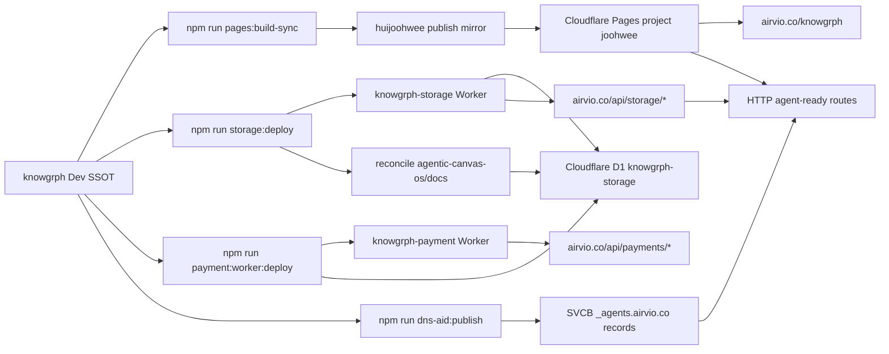

# Knowgrph Cloudflare Document - PRD & TAD

## Overview

This document is the implementation-accurate Cloudflare operating baseline for Knowgrph. It
describes the deployed `Dev -> Prod -> Cloudflare` chain, the Cloudflare Pages and Workers
ownership model, the D1-backed storage surface, the payment Worker boundary, and the live DNS-AID
records under `airvio.co`.

For current remote MCP onboarding, start with
`docs/documents/knowgrph-mcp-onboarding-index.md`, then use
`docs/documents/knowgrph-mcp-install-contract.md` for the canonical
public-discovery vs control-plane endpoint boundary.
Map intent on `https://airvio.co/knowgrph/mcp`, orchestrate agents on
`https://airvio.co/knowgrph/control-plane/mcp` only for session-capable hosts,
and prove outcomes first with the source-side `README.md` or
`docs/documents/knowgrph-superagent-harness.md` offline path.

**Governing lenses**: min-viable-max-value, TCO-zero, FOSS-first, token economics, and
harness-first. This document has no AI harness in its own runtime path; token cost is therefore
`$0` for the Cloudflare surfaces described here.

**Current live status, 2026-06-29**:

- Cloudflare Pages serves Knowgrph at `https://airvio.co/knowgrph`.
- Cloudflare Pages project name is `joohwee`.
- Storage Worker route family is `https://airvio.co/api/storage/*`.
- Payment Worker route family is `https://airvio.co/api/payments/*`.
- Latest verified release shipped Dev `530462d6`, publish `ec4dfa47`, preview `https://0d3c18ba.joohwee.pages.dev`, and live route proofs `https://airvio.co/` -> `200`, `https://airvio.co/knowgrph/` -> `200`.
- The latest `pages:deploy-cloudflare` run completed `storage:d1:seed:docs` with `applied=41`, `conflict=0`, and `rejected=0`.
- DNSSEC is active for `airvio.co`.
- DNS-AID SVCB records are published and verified for `_index._agents.airvio.co`,
  `_mcp._agents.airvio.co`, and `_a2a._agents.airvio.co`.
- `npm run dns-aid:check` passes `3/3`.

**External documentation checked**: Cloudflare official docs for API-token authentication,
Pages API-token permissions, DNS record configuration, and REST API bearer-token usage. Wrangler
OAuth remains valid for Wrangler-managed deploy flows, but direct DNS record writes require a
scoped API token with zone DNS edit permission.

## AI Gateway High-ROI Next Steps

The Cloudflare baseline in this document stays implementation-accurate and infrastructure-owned.
The next min-viable-max-value Cloudflare lane for Knowgrph is AI Gateway operationalization:
deterministic context caching, intent-mapped dynamic routes, spend/rate limits, source-owned cost
proof, and future alignment toward current AI Gateway REST surfaces.

The canonical execution queue for that work lives in
`docs/documents/knowgrph-ai-gateway-enhancement-plan.md`.

Current operator evidence is narrower than full live activation: the focused source draft-route
proofs and the publish-repo `__chat_proxy` smoke pass, but the readiness command remains fail-closed
until the `joohwee` Pages project exposes an accepted AI Gateway secret. `-- --skip-live` skips the
live transport smoke only; it does not bypass the Pages secret-list gate.

---

## Part 1 - PRD

### Problem Statement

Knowgrph uses Cloudflare as the public publication, storage, discovery, and crawler boundary. The
system must keep the fast static app route, the D1-backed Source Files route, the agent discovery
surface, and DNS-AID records aligned without creating downstream-only patches in the publish repo.

Current pain points:

1. **Publication drift risk**: source lives in `knowgrph`, generated artifacts live in
   `huijoohwee`, and Cloudflare serves the result. A release is incomplete unless all three layers
   agree.
2. **Agent discovery spans HTTP and DNS**: `.well-known` files, Link headers, Markdown
   negotiation, WebMCP, HTTP MCP, and DNS-AID records must describe the same service.
3. **Wrangler OAuth and REST API tokens have different jobs**: Wrangler OAuth can deploy Pages and
   Workers, while REST DNS edits need a scoped Cloudflare API token.
4. **Crawler access must stay storage-owned**: crawler-visible Source Files should come from D1
   document rows and storage Worker routes, not from local docs folders or browser-only app state.
5. **Payment and Pay Per Crawl boundaries must stay Cloudflare-owned**: application code must not
   emulate Cloudflare crawler pricing headers, crawler identity, or zone-level payment decisions.

### Personas

| Persona | Job To Be Done | Cloudflare Need | Failure To Avoid |
|---|---|---|---|
| Site owner | Publish Knowgrph at the public route | Stable Pages, DNS, and Worker routing | Live route points to stale artifacts |
| AI crawler operator | Discover readable source content and agent metadata | DNS-AID, `.well-known`, MCP, and Markdown routes | SPA-only discovery hides Source Files |
| Platform maintainer | Deploy and validate the public system | Repeatable Wrangler commands and route checks | Wrong account, wrong project, or silent DNS drift |
| Knowledge consumer | Fetch current Markdown documents | D1-backed storage doc-view routes | Raw export parsing or stale local path references |
| Security maintainer | Keep secrets scoped and revocable | API token separation and Keychain-backed local auth | Plaintext tokens in repo or dotfiles |

### User Journey

| Stage | Actor | Trigger | System Outcome | Evidence |
|---|---|---|---|---|
| Build | Platform maintainer | Source changes land in `knowgrph` | `pages:build-sync` creates the SPA and syncs publish artifacts | `npm run pages:check-sync` exits 0 |
| Deploy | Platform maintainer | Release is ready | Wrangler deploys Pages/Workers under the `joohwee` account | `npx wrangler whoami` and deploy output |
| Discover HTTP | AI crawler operator | Agent requests `airvio.co/knowgrph` or `.well-known` | Pages returns discovery metadata, Markdown negotiation, and MCP metadata | `npm run agent-ready:check` exits 0 |
| Discover DNS | AI crawler operator | Resolver queries `_agents.airvio.co` SVCB records | DNSSEC-authenticated DNS-AID records point to agent card, MCP, and A2A endpoints | `npm run dns-aid:check` exits 0 |
| Read Source Files | Knowledge consumer | Crawler follows storage links | Storage Worker serves D1-backed indexes and Markdown doc views | `curl -i https://airvio.co/api/storage/...` |
| Govern secrets | Security maintainer | DNS publish is required | Scoped DNS API token is read from local secure storage, not source control | Keychain/launchctl presence checks without printing token values |

### Epics And Stories

#### Epic PRD-CF-E001 - Publish The Cloudflare Route Reliably

**Story PRD-CF-E001-S001: Dev -> Prod -> Cloudflare parity**

**As a** platform maintainer  
**I want** the Knowgrph source repo, publish mirror, and Cloudflare deployment to share one release
contract  
**So that** production route behavior matches the source-owned implementation.

**Acceptance criteria**:

- **Given** source changes are ready in `$GITHUB_ROOT/knowgrph`
- **When** the maintainer runs the release validation chain
- **Then** `npm run pages:check-sync` reports no mirror drift
- **And** live probes confirm `https://airvio.co/knowgrph/` and at least one hashed asset return 200

> `/goal` translation: Cloudflare route parity is complete when `npm run pages:check-sync` exits 0
> and live route probes return 200 for the app shell plus a current hashed asset.

#### Epic PRD-CF-E002 - Publish Agent Discovery Over HTTP And DNS

**Story PRD-CF-E002-S001: HTTP agent-ready discovery**

**As an** AI crawler operator  
**I want** Knowgrph to expose `.well-known`, Link header, Markdown, and MCP discovery routes  
**So that** agents can inspect the service without depending on browser-only state.

**Acceptance criteria**:

- **Given** Cloudflare Pages serves the app route
- **When** `KNOWGRPH_AGENT_READY_BASE_URL=https://airvio.co/knowgrph npm run agent-ready:check`
  runs
- **Then** the check validates the Pages discovery routes, headers, Markdown negotiation, and MCP
  metadata

> `/goal` translation: HTTP agent discovery is complete when `agent-ready:check` exits 0 against
> `https://airvio.co/knowgrph`.

**Story PRD-CF-E002-S002: DNS-AID discovery**

**As an** AI crawler operator  
**I want** DNSSEC-authenticated DNS-AID SVCB records under `_agents.airvio.co`  
**So that** agent discovery can begin at DNS before falling through to HTTP `.well-known`
artifacts.

**Acceptance criteria**:

- **Given** `CLOUDFLARE_DNS_API_TOKEN` or `CLOUDFLARE_API_TOKEN` is available with zone DNS edit
  permission
- **When** `npm run dns-aid:publish` runs
- **Then** Cloudflare contains SVCB records for `_index._agents.airvio.co`,
  `_mcp._agents.airvio.co`, and `_a2a._agents.airvio.co`
- **And** `npm run dns-aid:check` validates all three public DNSSEC-authenticated records

> `/goal` translation: DNS-AID discovery is complete when `dns-aid:publish` exits 0, DNSSEC is
> reported active, and `dns-aid:check` passes `3/3`.

#### Epic PRD-CF-E003 - Keep Source Files Crawler Access Storage-Owned

**Story PRD-CF-E003-S001: D1-backed crawler reads**

**As a** knowledge consumer  
**I want** crawler-readable Source Files routes backed by the storage Worker and D1  
**So that** retrieval systems fetch current Markdown documents instead of local source files.

**Acceptance criteria**:

- **Given** D1 contains Source Files for a workspace
- **When** a crawler requests `/api/storage/source-files` or `/api/storage/doc/...`
- **Then** the storage Worker serves current D1-backed Markdown/index data
- **And** the request does not trigger app-shell rendering, URL import, or local file reads

> `/goal` translation: crawler reads are complete when storage route tests or live `curl` probes
> show D1-backed Source Files responses and no app-local import path is invoked.

#### Epic PRD-CF-E004 - Separate Deployment Auth From DNS Auth

**Story PRD-CF-E004-S001: Scoped credentials**

**As a** security maintainer  
**I want** Wrangler OAuth and DNS API tokens to stay separate  
**So that** deploy access does not imply broad DNS write authority and DNS writes remain scoped.

**Acceptance criteria**:

- **Given** Wrangler OAuth is active
- **When** Pages or Worker deploys run through Wrangler
- **Then** deploy commands may use Wrangler OAuth
- **And** DNS publish scripts still require `CLOUDFLARE_DNS_API_TOKEN` or `CLOUDFLARE_API_TOKEN`
  with zone DNS edit permission
- **And** token values are never committed, logged, or written into repo files

> `/goal` translation: credential separation is complete when `wrangler whoami` succeeds, DNS
> publish refuses missing API tokens, and token presence checks are masked.

### Success Metrics

| Metric | Baseline | Target | Measurement |
|---|---|---|---|
| Cloudflare app route availability | Manual route check | `airvio.co/knowgrph` returns 200 after deploy | `curl -I` plus browser smoke |
| Static mirror drift | Possible generated artifact drift | `pages:check-sync` exits 0 | `npm run pages:check-sync` |
| Agent-ready HTTP discovery | Partial or stale audit output | `agent-ready:check` exits 0 | `KNOWGRPH_AGENT_READY_BASE_URL=... npm run agent-ready:check` |
| DNS-AID discovery | Records absent before publish | `dns-aid:check` passes 3/3 | `npm run dns-aid:check` |
| DNSSEC | Required for authenticated DNS-AID | Active | `dns-aid:publish` DNSSEC check and DoH AD=true |
| Storage route availability | Raw app shell only | D1-backed Source Files indexes and docs | storage Worker route probes |
| Token cost / month | Not applicable | `$0` | No model call in Cloudflare routing path |
| Monthly TCO | Cloudflare free-tier target | `$0` until usage exceeds free limits | monthly Cloudflare dashboard review |

### MoSCoW Priority

| Priority | Scope | ROI Rationale | TCO |
|---|---|---|---|
| Must | Pages route, storage Worker, D1 binding, DNS-AID records, DNSSEC, masked credential handling | High discovery and publication value for low maintenance cost | Cloudflare free-tier target |
| Should | `agent-ready:check`, `dns-aid:contract`, `dns-aid:check`, live route smoke | Prevents false completion and stale discovery metadata | Local compute only |
| Could | Terraform-managed DNS records after the manual/API-token path stabilizes | Improves infra history but adds setup burden | Open-source Terraform provider; no runtime token cost |
| Won't | App-local Pay Per Crawl pricing, crawler identity signing, or broad DNS write tokens in source control | Conflicts with Cloudflare-owned boundaries and security model | Avoids vendor/security risk |

### Min-Viable Scope

The minimum complete Cloudflare baseline is:

1. Source-owned build and sync commands.
2. Cloudflare Pages route serving `airvio.co/knowgrph`.
3. Storage Worker and D1 route family serving crawler-readable Source Files.
4. Payment Worker route family isolated from storage reads.
5. HTTP agent discovery verified by repo scripts.
6. DNS-AID SVCB records published with DNSSEC-authenticated public verification.
7. Scoped DNS API token stored outside the repository.

### Out Of Scope

- Replacing Cloudflare with another edge provider.
- Moving source ownership into the publish mirror.
- Storing Cloudflare API tokens in `.env`, dotfiles, docs, or git-tracked files.
- Emulating Cloudflare Pay Per Crawl decisions inside Worker code.
- Claiming a full mutating remote MCP platform beyond the currently deployed read-only Pages MCP
  and browser WebMCP surfaces.

---

## Part 2 - TAD

### Architecture Overview

**From source to public agent-readable routes**: Knowgrph source builds the SPA, syncs the publish
mirror, deploys Pages and Workers through Wrangler, stores Source Files in D1 through the storage
Worker, and publishes DNS-AID SVCB records through the Cloudflare REST API.

### Journey To System Mapping

| Journey Stage | Workflow | Data Flow | Component |
|---|---|---|---|
| Build | `pages:build-sync` | source -> Vite build -> publish mirror | `scripts/sync-pages-knowgrph.mjs` |
| Deploy static app | Wrangler Pages deploy | publish mirror -> Cloudflare Pages | `pages:deploy-cloudflare` |
| Deploy storage | D1 migrations, Worker deploy, docs reconciliation | migrations -> D1, Worker bundle -> route, release-resolved `agentic-canvas-os/docs` -> D1 | `storage:deploy` |
| Deploy payment | Payment D1 migrations, Worker deploy, payment readiness | payment migrations -> D1 schema, payment Worker bundle -> route, visible payment vars -> production authority | `payment:d1:migrate:remote`, `payment:worker:deploy`, `payment:stripe:readiness`, `payment:x402:configure`, `payment:x402:readiness`, `payment:readiness` |
| Publish DNS-AID | REST API upsert | record contract -> Cloudflare DNS -> public DoH | `dns-aid:publish` |
| Validate discovery | HTTP and DNS checks | public routes -> validators -> pass/fail | `agent-ready:check`, `dns-aid:check` |

### Component Specifications

| Component | Responsibility | Interfaces | Configuration | FOSS / Vendor | Status |
|---|---|---|---|---|---|
| Cloudflare Pages project | Serve the static SPA and Pages Functions | `https://airvio.co/knowgrph/*` | project `joohwee`, publish repo `huijoohwee` | Vendor free-tier target; alternative static host would lose Workers/D1 adjacency | Implemented |
| Pages Functions | Serve agent-ready routes, Markdown negotiation, and MCP metadata | `.well-known`, `/knowgrph/mcp`, Link headers | `cloudflare/pages/knowgrph-agent-ready*.mjs` | Cloudflare Pages Functions; FOSS alternative is self-hosted Node edge router | Implemented |
| Storage Worker | Serve D1-backed Source Files indexes and doc views | `airvio.co/api/storage/*` | `cloudflare/workers/knowgrph-storage/wrangler.toml` | Cloudflare Workers; FOSS alternative is self-hosted HTTP API + SQLite/Postgres | Implemented |
| D1 database | Persist Source Files, storage sync rows, Stripe sessions, and ACP proof/trace rows | Worker `DB` binding | `knowgrph-storage` D1 binding | Cloudflare D1; FOSS alternative is local SQLite, but not globally hosted | Implemented |
| Generated media asset store | Persist AI image/audio/video bytes, metadata, access cache, and canvas-room notification | R2 `KNOWGRPH_STORAGE_BLOB_BUCKET` (`knowgrph-storage-blobs/airvio/` object prefix), D1 `media_artifacts`, optional KV `KNOWGRPH_MEDIA_ACCESS_KV`, DO `KNOWGRPH_CANVAS_ROOM` | `/api/storage/media/*`, `/api/storage/media/assets`, `cloudflare/workers/knowgrph-storage/mediaAssetSync.ts` | Cloudflare R2/D1/KV/Durable Objects; FOSS alternative is MinIO + SQLite + Redis + WebSocket room service | Dev source implemented; KV binding remains operator-owned before live claim |
| Payment Worker | Isolate checkout/payment route family | `airvio.co/api/payments/*`, `.well-known/acp-config`, `/checkout/sessions*` | `cloudflare/workers/knowgrph-payment/wrangler.toml` | Cloudflare Workers; FOSS alternative is self-hosted payment webhook service | Implemented |
| DNS-AID publisher | Upsert SVCB discovery records | Cloudflare REST API | `CLOUDFLARE_DNS_API_TOKEN`, `CLOUDFLARE_ZONE_ID`, `CLOUDFLARE_ZONE_NAME` | Cloudflare DNS; FOSS alternative is another authoritative DNS provider with SVCB + DNSSEC | Implemented |
| DNS-AID checker | Validate public DNSSEC-authenticated SVCB answers | DoH JSON, SVCB RFC3597 parser | `scripts/dns-aid-records.mjs` | FOSS local script; no vendor lock-in beyond DNS host | Implemented |
| Wrangler auth | Deploy Pages and Workers | `npx wrangler whoami`, deploy commands | Wrangler OAuth, account `joohwee` | Open-source Wrangler CLI against Cloudflare APIs | Implemented |

### Integration Contracts

| Interface | Protocol | Format | Auth | Error Handling |
|---|---|---|---|---|
| Pages app route | HTTPS | HTML, Markdown, JSON metadata | Public | Return route-specific status; avoid app-shell fallback for known metadata routes |
| HTTP MCP route | HTTPS JSON-RPC | JSON-RPC requests/responses | Public read-only surface | Reject unsupported methods/tools without mutation |
| Storage Worker routes | HTTPS | Markdown, JSON, plain text | Public read routes | Derive from D1; omit deleted records; no local file fallback |
| Media asset route | HTTPS | JSON metadata over `/api/storage/media/assets`; bytes over `/api/storage/media/*` | Run-scoped bearer token | Confirm R2 before D1 write; return explicit KV/DO binding status; no fake namespace ids |
| Payment Worker routes | HTTPS | JSON/HTTP payment endpoints | Provider-specific secrets in Worker env and D1 payment tables/columns | Keep payment errors isolated from storage reads; readiness verifies remote D1 tables and webhook-processing columns before live smoke |
| DNS-AID publish | Cloudflare REST API | DNS record JSON | `CLOUDFLARE_DNS_API_TOKEN` or `CLOUDFLARE_API_TOKEN` with zone DNS edit | Fail fast on missing token, invalid permission, DNSSEC inactive, or Cloudflare validation errors |
| DNS-AID verify | DNS-over-HTTPS | `application/dns-json`, type 64 answers | Public resolver | Require `AD=true`; decode RFC3597 SVCB answers for custom parameters |

### Data Flow

| Stage | Component | Input Format | Output Format | Persistence | Error Handling |
|---|---|---|---|---|---|
| Build | Vite + sync script | TypeScript/Markdown/assets | Static assets + Pages control files | publish mirror | Build or sync exits non-zero |
| Store Source Files | Storage Worker | Workspace/Source File sync payloads | D1 rows | Cloudflare D1 | Worker route validation and D1 migration checks |
| Store generated media | Storage Worker | R2 object key + provenance payload | D1 `media_artifacts` row + optional KV access cache + DO room notification | R2, D1, optional KV, Durable Object storage | Reject missing R2 object; report `binding_missing` for unbound optional services |
| Serve crawler docs | Storage Worker | HTTP GET route params | Markdown/index/doc-view response | D1 read | 404/empty-state responses without import side effects |
| Serve agent metadata | Pages Functions | HTTP GET/HEAD/POST | JSON, Markdown, Link headers, MCP responses | generated artifacts | route-specific failures; no stale local docs fallback |
| Publish DNS-AID | DNS-AID script | record contract from `scripts/dns-aid-records.mjs` | Cloudflare DNS SVCB records | Cloudflare DNS | REST API error exits non-zero |
| Validate DNS-AID | DNS-AID checker | DoH type 64 answers | pass/fail console result | none | fail if missing answer, AD false, or SVCB params mismatch |

### Deployment Strategy

| Step | Command | Rollback |
|---|---|---|
| Build static app | `npm run pages:build` | Revert source and rebuild |
| Sync publish mirror | `npm run pages:sync` | Re-run sync from last known-good source or revert publish commit |
| Check mirror drift | `npm run pages:check-sync` | Fix source/sync owner before deploying |
| Deploy Pages | `npm run pages:deploy-cloudflare` | Wrangler rollback or redeploy previous publish mirror |
| Deploy storage Worker | `npm run storage:deploy` | Wrangler rollback for Worker; D1 migration rollback requires explicit migration plan |
| Apply payment D1 migrations | `npm run payment:d1:migrate:remote` | D1 migration history |
| Deploy payment Worker | `npm run payment:worker:deploy` | Wrangler rollback for Worker |
| Publish DNS-AID | `npm run dns-aid:publish` | Update/delete records through the same Cloudflare REST API owner |
| Verify DNS-AID | `npm run dns-aid:check` | Re-publish or inspect DNSSEC/DoH answer shape |

### Secrets And Auth Policy

| Secret / Credential | Purpose | Storage | Prohibited Location |
|---|---|---|---|
| Wrangler OAuth token | Wrangler-managed Pages/Workers deploys | Wrangler local auth config | repo files |
| `CLOUDFLARE_DNS_API_TOKEN` | DNS-AID SVCB record publish | macOS Keychain and `launchctl` session env | git, docs, shell history, plaintext dotfiles |
| `CLOUDFLARE_API_TOKEN` | Generic Cloudflare REST API token fallback | secure local env only | git, docs, shell history |
| Worker runtime secrets | Provider/payment/API secrets | Cloudflare Worker secrets | `wrangler.toml`, docs, static assets |

Wrangler OAuth is not a substitute for direct REST DNS edits. DNS record mutation must require a
scoped API token with zone DNS edit permission. Presence checks must print only `<set>` or
`<missing>`.

### Quality Attributes

| Attribute | Scenario | Pattern | Validation |
|---|---|---|---|
| Availability | Public app and storage routes must survive deploy | Pages + Workers route separation | live `curl` probes and browser smoke |
| Security | DNS writes require least privilege | scoped token, secure local storage, fail-fast scripts | masked env checks and Cloudflare token validation |
| Observability | Worker behavior must be inspectable | Wrangler logs, route probes, explicit check scripts; x402 readiness must reject fallback or zero-address placeholder `payTo` authority until operator-owned `X402_PAY_TO_ADDRESS` is deployed | `wrangler tail`, `agent-ready:check`, `dns-aid:check`, `payment:stripe:configure`, `payment:stripe:readiness`, `payment:x402:configure`, `payment:x402:readiness`, `payment:readiness` |
| Consistency | Dev, publish mirror, and Cloudflare stay aligned | source-owned sync and deploy commands | `pages:check-sync` |
| Agent discovery | Agents find the same service via DNS and HTTP | DNS-AID SVCB + `.well-known` + MCP metadata | DoH `AD=true` and route checks |
| Token cost | Cloudflare routing path has no LLM calls | no AI harness in routing path | token cost remains `$0` |
| TCO | Preserve free-tier operating posture | Cloudflare free-tier target, FOSS local scripts | monthly dashboard and ADR review |

### Architectural Decisions

## ADR-CF-001: Cloudflare Pages Plus Workers For Public Knowgrph

**Status**: Accepted  
**Date**: 2026-05-29

#### Context

Knowgrph needs a static SPA route, dynamic read-only storage routes, agent metadata routes, and a
separate payment route family.

#### Decision

Use Cloudflare Pages for `airvio.co/knowgrph`, Cloudflare Workers for storage/payment routes, and
Cloudflare D1 for storage persistence.

#### Alternatives Considered

1. **Self-hosted VPS with Nginx and SQLite/Postgres**: more portable, but higher ops burden and no
   native Pages/Workers/D1 adjacency.
2. **Static-only Pages deployment**: simplest, but cannot serve D1-backed Source Files or payment
   routes.
3. **Cloudflare Pages + Workers + D1**: low ops, route adjacency, and current implementation fit.

#### TCO Impact

| Dimension | Chosen Option | Best FOSS Alternative | Delta / 12 Months |
|---|---|---|---|
| Infra cost | Cloudflare free-tier target | VPS or local host, non-zero ops | Cloudflare lower until free-tier limits are exceeded |
| Egress cost | Cloudflare edge/CDN | VPS bandwidth | Cloudflare lower for current scale |
| Token cost | `$0` | `$0` | none |
| Vendor risk | Medium | Low | mitigated by source-owned scripts and route docs |

#### Consequences

- **Positive**: low-maintenance edge deploy with route-level separation.
- **Negative**: Cloudflare API and product behavior must be validated against current docs.
- **Neutral**: source and publish mirror remain separate repos.

## ADR-CF-002: Scoped API Token For DNS-AID Publishing

**Status**: Accepted  
**Date**: 2026-05-29

#### Context

Wrangler OAuth is active and works for deploys, but direct Cloudflare REST DNS endpoints reject
Wrangler OAuth tokens. DNS-AID SVCB upserts require DNS edit authority.

#### Decision

Require `CLOUDFLARE_DNS_API_TOKEN` or `CLOUDFLARE_API_TOKEN` with zone DNS edit permission for
`npm run dns-aid:publish`. Store token values outside the repo.

#### Alternatives Considered

1. **Reuse Wrangler OAuth for DNS REST calls**: rejected by Cloudflare REST API and too broad for
   scripted DNS writes.
2. **Manual dashboard DNS edits only**: workable for one-off changes, but not repeatable or
   testable.
3. **Scoped API token**: repeatable, least-privilege, and compatible with repo-owned scripts.

#### TCO Impact

| Dimension | Chosen Option | Best FOSS Alternative | Delta / 12 Months |
|---|---|---|---|
| Infra cost | `$0` | `$0` | none |
| Egress cost | `$0` | `$0` | none |
| Token cost | `$0` | `$0` | none |
| Vendor risk | Medium | Low | limited by scoped token and externalized config |

#### Consequences

- **Positive**: DNS publish is repeatable and auditable.
- **Negative**: token creation remains a manual security step.
- **Neutral**: deploy auth and DNS auth intentionally stay separate.

## ADR-CF-003: DNS-AID SVCB Records With DNSSEC Verification

**Status**: Accepted  
**Date**: 2026-05-29

#### Context

Agent discovery should not depend only on HTTP crawling. DNS-AID records allow agents to discover
service entrypoints from DNS and then verify HTTP metadata.

#### Decision

Publish three SVCB records:

| Record | Purpose | Endpoint |
|---|---|---|
| `_index._agents.airvio.co` | organization index | `/knowgrph` |
| `_mcp._agents.airvio.co` | MCP endpoint | `/knowgrph/mcp` |
| `_a2a._agents.airvio.co` | A2A agent card | `/knowgrph/.well-known/agent-card.json` |

Validate them through DNS-over-HTTPS type 64 answers with DNSSEC `AD=true`. The checker decodes
RFC3597 hex-form SVCB answers so custom `key65400`, `key65401`, and `key65402` parameters remain
testable.

#### Alternatives Considered

1. **HTTP-only `.well-known` discovery**: still needed, but misses DNS-first discovery.
2. **TXT records**: easier to read, but weaker match for service binding semantics.
3. **SVCB + DNSSEC**: current implementation, machine-readable, and authentication-aware.

#### TCO Impact

| Dimension | Chosen Option | Best FOSS Alternative | Delta / 12 Months |
|---|---|---|---|
| Infra cost | `$0` at current DNS scale | self-hosted DNS, higher ops | Cloudflare lower ops |
| Egress cost | DNS only | DNS only | none |
| Token cost | `$0` | `$0` | none |
| Vendor risk | Medium | Low | mitigated by standards-based SVCB and DNSSEC |

#### Consequences

- **Positive**: DNS-first agent discovery is live and verifiable.
- **Negative**: resolver display may use RFC3597 hex format, requiring a decoder in checks.
- **Neutral**: custom SVCB keys remain implementation-specific until DNS-AID conventions stabilize.

### Component Inventory

| Layer | Component | File / Module | Status |
|---|---|---|---|
| Build | Static app build | `npm run pages:build` | Implemented |
| Publish | Mirror sync | `scripts/sync-pages-knowgrph.mjs` | Implemented |
| Cloudflare Pages | Public app route | `airvio.co/knowgrph` | Implemented |
| Pages Functions | Agent-ready route owner | `cloudflare/pages/knowgrph-agent-ready.mjs` | Implemented |
| Storage Worker | Worker config | `cloudflare/workers/knowgrph-storage/wrangler.toml` | Implemented |
| Storage Worker | Route implementation | `cloudflare/workers/knowgrph-storage/index.ts` | Implemented |
| Storage Worker | Crawler markdown/index owner | `cloudflare/workers/knowgrph-storage/crawler.ts` | Implemented |
| D1 | Storage and payment database | `knowgrph-storage` D1 binding, payment migrations `0002_stripe_payments.sql`, `0003_agentic_commerce.sql`, and `0006_stripe_webhook_processing_state.sql` | Implemented |
| Payment Worker | Worker config | `cloudflare/workers/knowgrph-payment/wrangler.toml` | Implemented |
| DNS-AID | Shared record contract | `scripts/dns-aid-records.mjs` | Implemented |
| DNS-AID | Cloudflare publisher | `scripts/publish-dns-aid-cloudflare.mjs` | Implemented |
| DNS-AID | Public DNS checker | `scripts/check-dns-aid-cloudflare.mjs` | Implemented |
| DNS-AID | Local contract checker | `scripts/check-dns-aid-contract.mjs` | Implemented |

### Traceability

| Requirement | TAD Component | Verification |
|---|---|---|
| PRD-CF-E001-S001 | Pages build/sync/deploy chain | `npm run pages:check-sync`, live route probes |
| PRD-CF-E002-S001 | Pages Functions agent-ready routes | `KNOWGRPH_AGENT_READY_BASE_URL=https://airvio.co/knowgrph npm run agent-ready:check` |
| PRD-CF-E002-S002 | DNS-AID publisher/checker | `npm run dns-aid:publish`, `npm run dns-aid:check` |
| PRD-CF-E003-S001 | Storage Worker + D1 | storage route tests and live storage `curl` probes |
| PRD-CF-E004-S001 | Wrangler OAuth + scoped DNS token policy | `npx wrangler whoami`, masked token checks, missing-token fail-fast behavior |

### Validation Runbook

| Check | Command | Expected Result |
|---|---|---|
| Wrangler account | `npx --yes wrangler whoami` | account `joohwee` visible |
| Static mirror | `npm run pages:check-sync` | exits 0 |
| Agent-ready HTTP | `KNOWGRPH_AGENT_READY_BASE_URL=https://airvio.co/knowgrph npm run agent-ready:check` | exits 0 |
| DNS-AID local contract | `npm run dns-aid:contract` | exits 0 |
| DNS-AID publish | `npm run dns-aid:publish` | SVCB records created/updated; DNSSEC active |
| DNS-AID public check | `npm run dns-aid:check` | `passed: 3/3` |
| Storage Worker deploy | `npm run storage:deploy` | D1 migrations, Worker deploy, and docs seed succeed |
| Payment Worker deploy | `npm run payment:worker:deploy` | Worker deploy succeeds |
| Full Worker deploy | `npm run workers:deploy` | storage deploy, D1 docs seed, and payment route deploy succeed |

### Current Evidence

The following evidence was produced on 2026-06-29:

- `npm run storyboard:readiness:check` passed before release.
- `npm run pages:deploy-cloudflare` completed with preview `https://0d3c18ba.joohwee.pages.dev`.
- Route probes returned `200` for `https://airvio.co/`, `https://airvio.co/knowgrph/`, and `https://0d3c18ba.joohwee.pages.dev/knowgrph/`.
- `storage:d1:seed:docs` completed with `applied=41`, `conflict=0`, and `rejected=0`.
- DNS-AID remains verified by `npm run dns-aid:check` with `3/3` passing.

### Change Log

| Version | Date | Change |
|---|---|---|
| 1.0.1 | 2026-06-29 | Refreshed the live Cloudflare release evidence with the shipped storyboard-runtime release, preview/live route proof, and latest D1 docs seed result. |
| 1.0.0 | 2026-05-29 | Created implementation-accurate Cloudflare PRD/TAD baseline with live DNS-AID publish evidence. |
