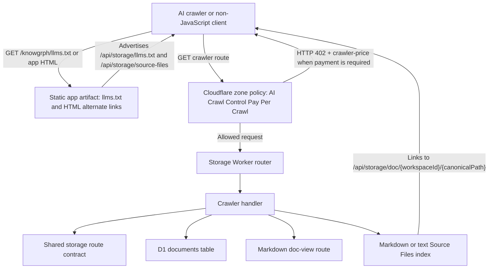
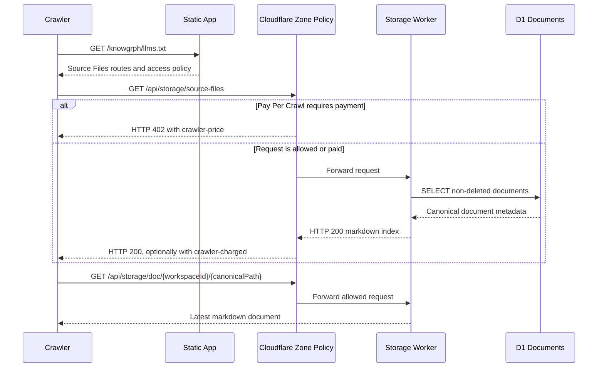

# Knowgrph Crawler Access - PRD & TAD

**Document Version**: 1.0.0
**Date**: 2026-05-19
**Status**: Draft aligned to implemented crawler-access slice
**Scope**: AI crawler and non-JavaScript access to Editor Workspace Source Files through storage-owned read-only routes, Cloudflare AI Crawl Control Pay Per Crawl compatibility, and Dev -> Prod -> Cloudflare publication parity

---

## Document Purpose

**Context**: Editor Workspace Source Files are canonical working content, but a single-page app surface is difficult for AI crawlers and non-JavaScript clients to discover without executing the UI.

**Intent**: Expose Source Files through neutral, read-only, storage-owned crawl entrypoints that preserve canonical paths, revisions, content hashes, and latest markdown doc-view links.

**Directive**: Keep crawler access rooted in the shared storage contract and D1-backed document rows; keep Pay Per Crawl as a Cloudflare zone policy boundary; do not emulate payment headers, prices, crawler identity, parsing, rendering, uploads, or local import behavior in application code.

**Current deployment context**: Dev is `/Users/huijoohwee/Documents/GitHub/knowgrph`; the static production mirror is `/Users/huijoohwee/Documents/GitHub/huijoohwee/content/knowgrph`; Cloudflare serves the app at `airvio.co/knowgrph`, the storage Worker at `airvio.co/api/storage/*`, and the separate payment Worker at `airvio.co/api/payments/*`.

---

## Companion Files

| File | Scope |
|---|---|
| `goal` | Source Files crawler contract, Pay Per Crawl boundary, and acceptance proof requirements |
| `knowgrph-storage-sync-document.md` | Storage ladder, Worker + D1 sync, public doc-view route, Dev -> Prod -> Cloudflare topology |
| `knowgrph-storage-schemas-document.md` | D1 document tables, RxDB shapes, and storage route schemas |
| `knowgrph-source-files-import-document.md` | Source Files ingestion, canonical path policy, provenance, and import boundaries |
| `knowgrph-multi-user-collaboration-prd.tad.md` | Future identity, membership, authorization, and shared-workspace constraints |

---

# PART I: PRODUCT REQUIREMENTS DOCUMENTATION (PRD)

## Problem Statement

### Current User Pain Points

**Problem 1: Source Files discovery depends on an app shell**
AI crawlers, search indexers, and non-JavaScript clients can find the public app route but cannot reliably discover Editor Workspace Source Files without a static or storage-owned crawl surface.

**Problem 2: Storage export is complete but not crawler-shaped**
The storage export endpoint is useful for synchronization and backups, but raw JSON requires schema awareness. Crawlers need a concise index that links directly to markdown doc-view URLs and exposes provenance metadata.

**Problem 3: Pay Per Crawl policy must not leak into app logic**
Cloudflare AI Crawl Control Pay Per Crawl can return payment-required or paid-access responses at the zone boundary. The application must declare compatibility without inventing prices, payment status, crawler identity, or app-local paywall decisions.

**Problem 3a: Pay Per Crawl has request-side payment intent**
Cloudflare's current Pay Per Crawl flow lets verified AI crawlers send signed `crawler-exact-price` or `crawler-max-price` headers. Those headers are Cloudflare/Web Bot Auth concerns, not Knowgrph app state.

**Problem 4: Publication parity needs a crawlable artifact**
The same crawl surface must survive the Dev -> Prod -> Cloudflare path so production crawlers receive the same route names, metadata shape, and static discovery hints as local validation.

### Quantified Impact

- A crawler that cannot execute the app has no guaranteed Source Files entrypoint without `llms.txt` or storage route discovery.
- A crawler using raw export JSON must understand internal sync records before it can identify the latest markdown document URL.
- Duplicating Pay Per Crawl semantics in app code risks conflicting with Cloudflare's own HTTP 402 and HTTP 200 header behavior.
- A production deploy is incomplete unless both static discovery and Worker-backed storage routes are present.

---

## Personas

| Persona | Role | Goal | Pain Point |
|---|---|---|---|
| AI Crawler Operator | Runs a crawler, indexer, or retrieval agent that consumes public web content | Discover readable markdown Source Files through predictable public entrypoints without executing the SPA | App-only routes hide the canonical content boundary and force crawler-specific scraping |
| Site Owner | Publishes Knowgrph content and controls crawler access policy | Make Source Files discoverable while allowing Cloudflare to negotiate Pay Per Crawl access when enabled | App-local payment or crawler-detection logic would conflict with zone-level policy and create stale behavior |
| Knowledge Consumer | Uses search, retrieval, or citation workflows that depend on current markdown content | Follow a Source Files index to latest markdown documents with stable metadata | Raw UI state or local file paths are not reliable evidence for current content |
| Platform Maintainer | Maintains storage, deployment, and crawler access contracts | Keep crawler routes centralized, tested, and deployable without hardcoded downstream host patches | Duplicate route strings or local-only aliases create drift across Dev, Prod, and Cloudflare |

---

## User Journey

| Stage | Persona | Trigger | Desired Outcome | Friction Removed |
|---|---|---|---|---|
| Discover | AI Crawler Operator | Crawler visits the public app or `llms.txt` | Finds Source Files crawl entrypoints | No SPA execution required |
| Negotiate | Site Owner, AI Crawler Operator | Zone has Pay Per Crawl enabled | Cloudflare handles payment-required or paid-access response | No app-level payment emulation |
| Index | Knowledge Consumer | Crawler follows the Source Files index | Receives markdown links plus canonical metadata | No raw sync JSON parsing required |
| Verify | Platform Maintainer | Release is built and deployed | Routes, headers, and metadata stay consistent | No Dev/Prod/Cloudflare route drift |

---

## Epic PRD-E001: Discover Source Files Without Executing the App

### Story PRD-E001-S001: Static LLM Entrypoint

**As a** crawler operator
**I want** a static `llms.txt` discovery file to advertise Source Files routes
**So that** I can find crawler-friendly content without executing the app shell

**Acceptance Criteria**:

- **Given** a deployed Knowgrph app
- **When** a crawler requests the app-level `llms.txt`
- **Then** the response lists the storage-owned LLM text route, Source Files index route, and markdown doc-view route pattern
- **And** the response describes Pay Per Crawl as a Cloudflare boundary, not an app-local payment system

### Story PRD-E001-S002: Storage-Owned Source Files Index

**As a** crawler operator
**I want** a storage-owned Source Files index
**So that** I can enumerate canonical documents without reading local UI state

**Acceptance Criteria**:

- **Given** D1 contains non-deleted Source Files for a workspace
- **When** a crawler requests `/api/storage/source-files` or `/api/storage/source-files/{workspaceId}`
- **Then** the Worker returns markdown with workspace ID, generated timestamp, document count, canonical paths, content hashes, revisions, updated timestamps, content lengths, and markdown doc-view links
- **And** deleted Source Files are omitted

---

## Epic PRD-E002: Preserve Current Content Provenance

### Story PRD-E002-S001: Direct Markdown Document Links

**As a** knowledge consumer
**I want** each index entry to link to the latest markdown doc-view URL
**So that** retrieval and citation workflows can fetch readable content directly

**Acceptance Criteria**:

- **Given** a Source File has a canonical path and content hash
- **When** the crawler reads the Source Files index
- **Then** the entry links to `/api/storage/doc/{workspaceId}/{canonicalPath}`
- **And** the entry includes the same content hash and revision that identify the stored document row

### Story PRD-E002-S002: Read-Only Crawl Behavior

**As a** platform maintainer
**I want** crawler routes to be read-only
**So that** crawler discovery never mutates, reparses, uploads, rerenders, or rehydrates Source Files

**Acceptance Criteria**:

- **Given** a crawler opens any crawler entrypoint
- **When** the Worker handles the request
- **Then** the response is derived from existing D1 document rows and doc-view URLs
- **And** the request does not trigger Import local files, Import URL, graph recomposition, canvas rendering, or document writes

---

## Epic PRD-E003: Respect Cloudflare Pay Per Crawl Semantics

### Story PRD-E003-S001: Cloudflare-Owned Payment Negotiation

**As a** site owner
**I want** Pay Per Crawl behavior to remain owned by Cloudflare AI Crawl Control
**So that** payment-required and paid-access responses do not conflict with application code

**Acceptance Criteria**:

- **Given** Pay Per Crawl is enabled for the zone
- **When** an AI crawler requests protected content without acceptable payment intent
- **Then** Cloudflare can return HTTP 402 with `crawler-price`
- **And** the Worker does not fabricate a payment-required response
- **And** the Worker does not generate, inspect, or sign `crawler-exact-price` or `crawler-max-price`

### Story PRD-E003-S002: Paid Access Metadata Compatibility

**As a** crawler operator
**I want** successful paid access to remain compatible with Cloudflare response headers
**So that** my crawler can distinguish charged access from regular access

**Acceptance Criteria**:

- **Given** Cloudflare accepts paid crawler access
- **When** the request reaches the Worker and content is served
- **Then** Cloudflare can return HTTP 200 with `crawler-charged`
- **And** Cloudflare can return `crawler-error` when payment intent is rejected
- **And** the application response declares only neutral crawler source and policy metadata

---

## Epic PRD-E004: Publish the Crawl Surface Consistently

### Story PRD-E004-S001: Dev -> Prod -> Cloudflare Route Parity

**As a** platform maintainer
**I want** the crawl surface to publish through the normal deployment chain
**So that** production crawlers and local validation use the same contracts

**Acceptance Criteria**:

- **Given** crawler access code and static discovery files are updated in Dev
- **When** the app is built, synced to Prod, and deployed to Cloudflare
- **Then** the production app advertises the same `llms.txt` and storage routes
- **And** the storage Worker serves the same route names, headers, and metadata shape

---

## Success Metrics

| Metric | Baseline | Target | Timeline | Measurement Method |
|---|---|---|---|---|
| Static crawl discovery | App route only | `llms.txt` advertises Source Files routes | Release validation | Built artifact inspection |
| Storage index availability | No crawler-shaped index | 100% HTTP 200 for valid Source Files index requests | Release validation | Worker route tests |
| Provenance coverage | Raw export requires schema parsing | 100% index entries include canonical path, hash, revision, updated time, and doc URL | Release validation | Worker route tests |
| Deleted record suppression | Export may include tombstone context | 100% deleted Source Files omitted from crawler index | Release validation | Worker route tests |
| Pay Per Crawl boundary clarity | No crawler policy metadata | Route headers and docs identify Cloudflare zone policy | Release validation | Contract tests and response header checks |
| Deployment parity | Local-only proof | Dev build, Prod sync, and Cloudflare route checks use same paths | Release validation | Build/sync/deploy proof |

---

## MoSCoW Prioritization

### Must Have

- [PRD-E001-S001] Static `llms.txt` discovery file
- [PRD-E001-S002] Storage-owned Source Files index
- [PRD-E002-S001] Direct markdown document links
- [PRD-E002-S002] Read-only crawl behavior
- [PRD-E003-S001] Cloudflare-owned payment negotiation
- [PRD-E004-S001] Dev -> Prod -> Cloudflare route parity

### Should Have

- Workspace-scoped `llms.txt` routes for non-default workspaces
- Link headers that point to Cloudflare Pay Per Crawl reference documentation
- Explicit crawler metadata headers for source and policy ownership

### Could Have

- Paginated Source Files indexes for very large workspaces
- Machine-readable JSON index alongside markdown and text routes
- Per-workspace crawler policy summary once authorization and tenancy are defined

### Won't Have This Slice

- App-local Pay Per Crawl pricing, charging, or crawler identity decisions
- Authenticated private workspace crawling
- Import local files or Import URL as crawler access mechanisms
- SPA rendering, graph recomposition, or markdown parsing during crawler index requests
- Backward-compatible aliases for legacy crawler route names

---

## Dependencies

| Dependency | Required For | Status |
|---|---|---|
| Cloudflare Worker storage API | Read-only crawler routes and doc-view URLs | Available |
| Cloudflare D1 `documents` rows | Source Files metadata and markdown content | Available |
| Shared storage route contract | Route constants and helper-generated paths | Available |
| Static app artifact publishing | App-level `llms.txt` discovery | Available |
| Cloudflare AI Crawl Control Pay Per Crawl | Zone-level paid crawler negotiation | External zone policy |

---

## Open Questions

| Question | Owner | Resolution Path |
|---|---|---|
| Should workspace-scoped crawl indexes require authorization after multi-user roles ship? | Platform maintainer | Resolve in multi-user collaboration PRD/TAD |
| Should large public workspaces add pagination or compressed indexes? | Platform maintainer | Add once document counts exceed single-response limits |
| Should a JSON crawl manifest accompany markdown indexes? | Product + platform | Validate crawler demand before adding another contract |
| Should production include per-zone pricing disclosure text outside Cloudflare headers? | Site owner | Decide through Cloudflare policy configuration, not Worker code |

---

# PART II: TECHNICAL ARCHITECTURE DOCUMENTATION (TAD)

## Architecture Overview

**From crawler request to markdown content**: crawler discovery -> static app hint or storage route -> Cloudflare zone policy -> storage Worker crawler handler -> D1 document metadata -> markdown doc-view URLs -> crawler-readable Source Files.

## Component Inventory

| Layer | Component | File / Module | Responsibility | Status |
|---|---|---|---|---|
| Static discovery | App `llms.txt` | `canvas/public/llms.txt` | Advertise Source Files crawler routes and Pay Per Crawl boundary | Implemented |
| Static discovery | App HTML alternate link | `canvas/index.html` | Expose crawl links in the app document head | Implemented |
| Contract | Storage route constants | `canvas/src/lib/storage/knowgrphStorageSyncContract.ts` | Centralize route paths, default workspace, Pay Per Crawl URL, and crawler header names | Implemented |
| Worker route contract | Worker contract mirror | `cloudflare/workers/knowgrph-storage/contract.ts` | Reuse the same route and header semantics inside the Worker | Implemented |
| Worker router | Storage API entrypoint | `cloudflare/workers/knowgrph-storage/index.ts` | Delegate crawler routes before generic storage handling | Implemented |
| Crawler handler | Source Files index builder | `cloudflare/workers/knowgrph-storage/crawler.ts` | Read D1 documents and build markdown or text crawler responses | Implemented |
| Operator readiness | MainPanel MCP crawler access | `canvas/src/features/panels/views/crawlerAccessMcpApiDocs.ts` | Surface storage route constants, Pay Per Crawl headers, read-only guard, and Stripe/MainPanel Payments handoff | Implemented |
| Persistence | Documents table | D1 `documents` | Store canonical Source Files metadata and markdown content | Implemented |
| Document content | Doc-view route | `/api/storage/doc/{workspaceId}/{canonicalPath}` | Serve latest markdown content for a canonical Source File | Implemented |
| Verification | Storage contract tests | `canvas/src/__tests__/knowgrphStorageContracts.test.ts` | Guard centralized routes and Pay Per Crawl header names | Implemented |
| Verification | Worker crawler tests | `canvas/src/__tests__/knowgrphStorageWorker.test.ts` | Prove index, LLM text, deleted suppression, headers, and doc links | Implemented |

---

## Journey -> System Mapping

| Journey Stage | Workflow | Data Flow | Component |
|---|---|---|---|
| Discover | Crawler reads static discovery | Static file -> storage route references | `canvas/public/llms.txt`, `canvas/index.html` |
| Negotiate | Cloudflare applies crawler policy | Request -> zone policy -> 402 or Worker pass-through | Cloudflare AI Crawl Control |
| Index | Worker builds Source Files response | D1 rows -> normalized metadata -> markdown/text response | `crawler.ts` |
| Fetch | Crawler follows document links | Canonical path -> doc-view route -> markdown content | Storage doc-view handler |
| Review | Operator opens MainPanel MCP | Storage constants -> crawler readiness manifest -> payment boundary handoff | `crawlerAccessMcpApiDocs.ts`, Stripe MCP rows |
| Verify | Tests enforce route and metadata shape | Contract constants -> fake D1 -> response assertions | Storage test suite |

---

## Data Flow

```mermaid
flowchart LR
    request["GET /api/storage/source-files or /api/storage/llms.txt"]
    routeRead["Read route and workspaceId"]
    d1Query["Query D1 documents where deleted = 0"]
    normalize["Normalize canonicalPath, title, docType, hash, revision, updatedAt, length"]
    links["Build doc-view URLs from shared path helper"]
    policy["Append Cloudflare Pay Per Crawl policy metadata"]
    response["Return markdown/text with cache and crawler headers"]

    request --> routeRead
    routeRead --> d1Query
    d1Query --> normalize
    normalize --> links
    links --> policy
    policy --> response
```

| Stage | Input | Output | Persistence | Error Handling |
|---|---|---|---|---|
| Route read | Request pathname | Route format and workspace ID | None | Non-crawler paths return `null` to router |
| Workspace ensure | Workspace ID | Existing or inserted workspace row | D1 `workspaces` | D1 errors return Worker error handling |
| Document read | Workspace ID | Non-deleted document rows | D1 `documents` | Empty workspace returns valid empty index |
| Metadata normalize | D1 rows | Crawler document records | None | Invalid rows without ID or canonical path are filtered |
| Response build | Metadata records | Markdown or text body | None | Response includes deterministic headers |

---

## Workflow Sequence

---

## Integration Contracts

| Interface | Protocol | Path | Format | Behavior |
|---|---|---|---|---|
| TAD-C001-I001 Default Source Files Index | HTTP GET | `/api/storage/source-files` | `text/markdown; charset=utf-8` | Uses default workspace ID; returns one metadata entry per non-deleted Source File |
| TAD-C001-I002 Workspace Source Files Index | HTTP GET | `/api/storage/source-files/{workspaceId}` | `text/markdown; charset=utf-8` | Decodes exactly one workspace segment; rejects ambiguous nested route shapes by not matching crawler routes |
| TAD-C001-I003 Default LLM Text Entrypoint | HTTP GET | `/api/storage/llms.txt` | `text/plain; charset=utf-8` | Uses default workspace ID; links to the Source Files index and document URLs |
| TAD-C001-I004 Workspace LLM Text Entrypoint | HTTP GET | `/api/storage/source-files/{workspaceId}/llms.txt` | `text/plain; charset=utf-8` | Uses workspace route segment; returns the same access policy and document links |
| TAD-C001-I005 Markdown Doc View | HTTP GET | `/api/storage/doc/{workspaceId}/{canonicalPath}` | Markdown response | Serves latest canonical Source File markdown; crawler indexes link to it instead of embedding full document bodies |

### Header Contract

| Header | Owner | Meaning |
|---|---|---|
| `content-type` | Worker | Response format, either markdown or text |
| `cache-control` | Worker | Public short-lived cache with revalidation |
| `link` | Worker | Help link to Cloudflare Pay Per Crawl reference |
| `x-robots-tag` | Worker | Allows crawler indexing of the route |
| `x-knowgrph-crawler-source` | Worker | Identifies D1 document/doc-view source ownership |
| `x-knowgrph-pay-per-crawl-policy` | Worker | Identifies policy as Cloudflare zone-owned |
| `crawler-exact-price` | Cloudflare / AI crawler | Request header for exact paid-access intent; must be signed through Web Bot Auth |
| `crawler-max-price` | Cloudflare / AI crawler | Request header for maximum paid-access intent; must be signed through Web Bot Auth |
| `crawler-price` | Cloudflare | Price returned with HTTP 402 when crawler payment is required |
| `crawler-charged` | Cloudflare | Amount returned with HTTP 200 after successful paid crawler access |
| `crawler-error` | Cloudflare | Error returned when paid crawler access is rejected |

---

## Architectural Decisions

## ADR-001: Storage-Owned Crawler Routes

**Status**: Accepted

**Date**: 2026-05-19

### Context

Crawler access needs the same canonical Source Files records used by storage sync and doc-view routes. App-shell scraping, renderer output, and import workflows would create duplicate ownership.

### Decision

Serve crawler indexes from the storage Worker using shared route helpers and D1 document rows.

### Alternatives Considered

1. **SPA-rendered crawler view**: Reuses UI but requires JavaScript execution and risks rerender side effects.
2. **Static generated index only**: Simple to crawl but can drift from D1 document revisions.
3. **Raw export JSON only**: Complete but not crawler-friendly and exposes sync schema complexity.

### Rationale

The storage Worker already owns canonical workspace records, revision state, and public doc-view URLs. Keeping crawl routes there avoids aliases and downstream patches.

### Consequences

- **Positive**: Crawler metadata matches storage state.
- **Negative**: Large workspaces may eventually need pagination.
- **Neutral**: Static `llms.txt` remains a discovery hint, not the content source of truth.

## ADR-002: Pay Per Crawl Remains Cloudflare-Owned

**Status**: Accepted

**Date**: 2026-05-19

### Context

Cloudflare AI Crawl Control Pay Per Crawl lets site owners control and monetize AI crawler access at the zone boundary. Cloudflare can return HTTP 402 with `crawler-price`, verified AI crawlers can send signed `crawler-exact-price` or `crawler-max-price`, successful paid access can return HTTP 200 with `crawler-charged`, and unsuccessful paid access can return `crawler-error`.

### Decision

The Worker declares compatibility and reference metadata but does not set payment prices, create charged headers, classify crawlers, or return payment-required responses.

### Alternatives Considered

1. **Worker-generated 402 responses**: Conflicts with Cloudflare's payment negotiation and risks stale policy behavior.
2. **Hardcoded crawler allowlist**: Creates identity drift and requires ongoing maintenance.
3. **No Pay Per Crawl metadata**: Leaves crawlers without route-level policy context.

### Rationale

Cloudflare is the correct owner for payment negotiation and Merchant of Record behavior. The application should only expose content and metadata when the request reaches it.

### Consequences

- **Positive**: No duplicated payment system.
- **Negative**: Local Worker tests cannot prove zone-level billing behavior.
- **Neutral**: Production verification must include Cloudflare route checks when Pay Per Crawl is enabled.

## ADR-003: Crawler Indexes Stay Metadata-Oriented

**Status**: Accepted

**Date**: 2026-05-19

### Context

Crawler indexes need to be small, deterministic, and cheap. Embedding every document body would increase response size and make cache invalidation less precise.

### Decision

Return document metadata and doc-view links from the index; serve full markdown through existing doc-view routes.

### Alternatives Considered

1. **Inline full markdown bodies in the index**: Reduces follow-up requests but inflates the index.
2. **Only list titles**: Small but not enough for provenance and freshness checks.
3. **Separate route per metadata field**: Over-fragments the contract.

### Rationale

Metadata plus doc-view links gives crawlers freshness evidence and direct content access while keeping the index stable.

### Consequences

- **Positive**: Indexes remain compact and easy to validate.
- **Negative**: Crawlers need one follow-up request per selected document.
- **Neutral**: Future JSON manifest can reuse the same metadata shape.

---

## Quality Attributes

| Attribute | Scenario | Pattern | Validation |
|---|---|---|---|
| Performance | Crawler opens index for a normal workspace | Single D1 query over non-deleted documents, metadata-only response | Worker route tests and build smoke |
| Scalability | Workspace grows beyond a small document set | Metadata response allows future pagination without changing doc-view URLs | Open question tracked |
| Security | Crawler route is requested by anonymous clients | Read-only GET route; no uploads, no writes, no local paths, no app payment emulation | Contract tests and route review |
| Reliability | Dev and Prod route names must stay aligned | Shared route constants and helper-generated paths | Storage contract tests |
| Observability | Maintainer needs route ownership evidence | Response headers identify source and Pay Per Crawl policy boundary | Worker header assertions |
| Testability | Crawler access must be provable without live billing | Fake D1 Worker tests verify content shape; Cloudflare route checks verify deployment | Focused tests plus deploy proof |

---

## Security And Privacy Boundaries

- Crawler routes are read-only and must not mutate D1, RxDB, local files, graph snapshots, or render state.
- Crawler indexes must not expose local absolute paths, device IDs, user identity, sync outbox records, or conflict logs.
- Deleted Source Files are excluded from crawler indexes.
- Pay Per Crawl headers that express price or charged amount belong to Cloudflare, not the Worker.
- Pay Per Crawl request headers that express crawler payment intent also belong to Cloudflare and verified AI crawler owners; Knowgrph does not sign or synthesize them.
- Private workspace authorization is out of scope for this slice and must be designed with multi-user membership before enabling private crawling.

---

## Deployment Strategy

1. Build the Dev app from `knowgrph`.
2. Verify static discovery artifact includes crawler routes.
3. Verify focused storage contract and Worker crawler tests.
4. Sync built artifacts into the Prod content mirror.
5. Commit and push the Prod mirror.
6. Deploy the storage Worker and D1 migrations when Worker code changed.
7. Deploy the separate payment Worker when Stripe checkout or webhook code changed.
8. Verify Cloudflare Pages route, storage Worker route, payment Worker route, and static asset MIME types with direct HTTP probes.

**Rollback Plan**:

- Revert the static `llms.txt` advertisement if discovery needs to be withdrawn.
- Revert the Worker crawler route handler and route registration if storage index behavior regresses.
- Keep doc-view and push/pull/export routes unchanged because crawler access is additive and read-only.

---

## Validation Plan

| Validation | Command Or Evidence | Expected Result |
|---|---|---|
| Route contract | Focused storage contract test | Route helpers and Pay Per Crawl header constants remain centralized |
| Worker crawler index | Focused storage Worker test | `/api/storage/source-files/{workspaceId}` returns markdown index, hides deleted rows, links doc-view URLs |
| LLM text entrypoint | Focused storage Worker test | `/api/storage/llms.txt` returns text/plain with Source Files and Pay Per Crawl metadata |
| Type safety | `npm --prefix canvas exec tsc -- -p canvas/tsconfig.json --noEmit --pretty false` | No TypeScript errors |
| Static artifact | `npm run pages:build` | Built `llms.txt` includes Source Files and access policy |
| MainPanel MCP readiness | Focused MainPanel MCP crawler/payment render test | MCP hub surfaces crawler routes, Pay Per Crawl boundary, Stripe MCP payment readiness, and no app-local crawler price |
| Docs map | `python3 ../huijoohwee.github.io/schema/AgenticRAG/sync_map.py --mode check` | Documentation map remains synchronized or is regenerated from canonical docs |
| Production smoke | Direct Cloudflare route probes after deploy | HTML route, storage crawler route, payment Worker route, and hashed static assets are reachable |

---

## PRD -> TAD Traceability

| PRD Story | TAD Component / Interface | Validation |
|---|---|---|
| PRD-E001-S001 Static LLM Entrypoint | Static discovery, TAD-C001-I003 | Built artifact inspection and Worker LLM test |
| PRD-E001-S002 Storage-Owned Source Files Index | Crawler handler, TAD-C001-I001, TAD-C001-I002 | Worker crawler index test |
| PRD-E002-S001 Direct Markdown Document Links | Doc-view route, TAD-C001-I005 | Worker doc-link assertions |
| PRD-E002-S002 Read-Only Crawl Behavior | Crawler handler, D1 read query | Route review and focused tests |
| PRD-E003-S001 Cloudflare-Owned Payment Negotiation | ADR-002, header contract | Contract test and Cloudflare docs check |
| PRD-E003-S002 Paid Access Metadata Compatibility | Header contract, ADR-002 | Production route verification when zone policy is enabled |
| PRD-E004-S001 Dev -> Prod -> Cloudflare Route Parity | Deployment strategy, shared route contract | Build/sync/deploy proof |

---

## Living Document Rules

- Update this document when crawler route names, metadata fields, policy headers, or deployment responsibilities change.
- Keep route names and header names sourced from shared storage contracts, not duplicated prose-first decisions.
- Add an ADR before adding JSON manifests, pagination, private workspace crawl access, or app-local crawler policy logic.
- Keep product requirements focused on crawler outcomes and technical architecture focused on storage-owned delivery.
